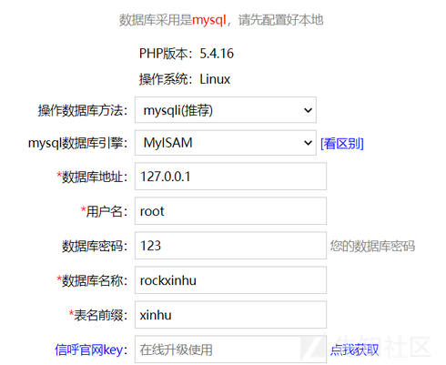
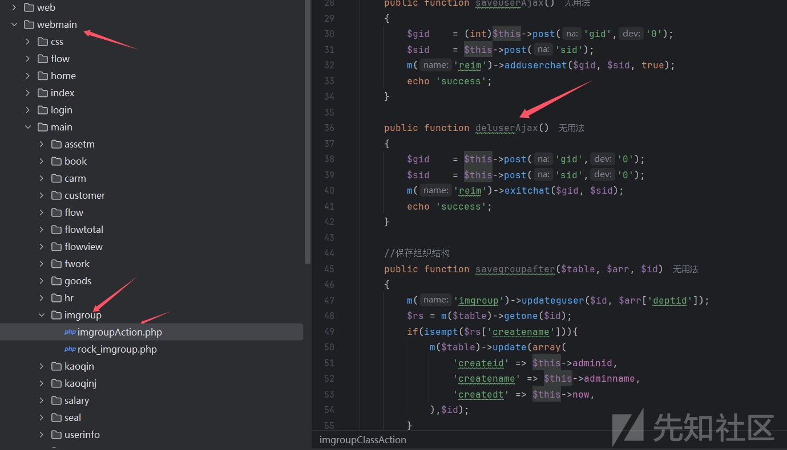
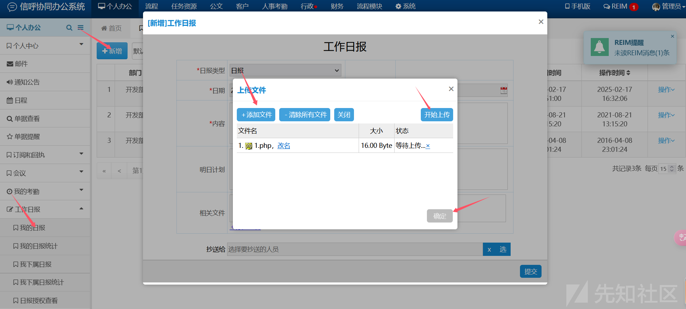
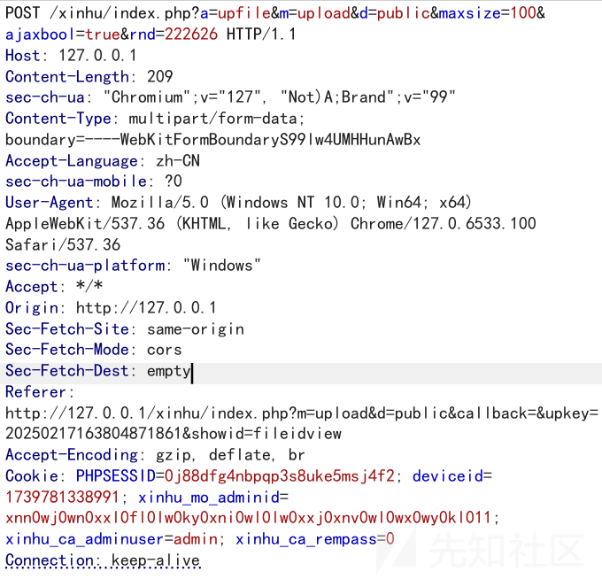
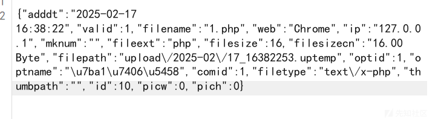
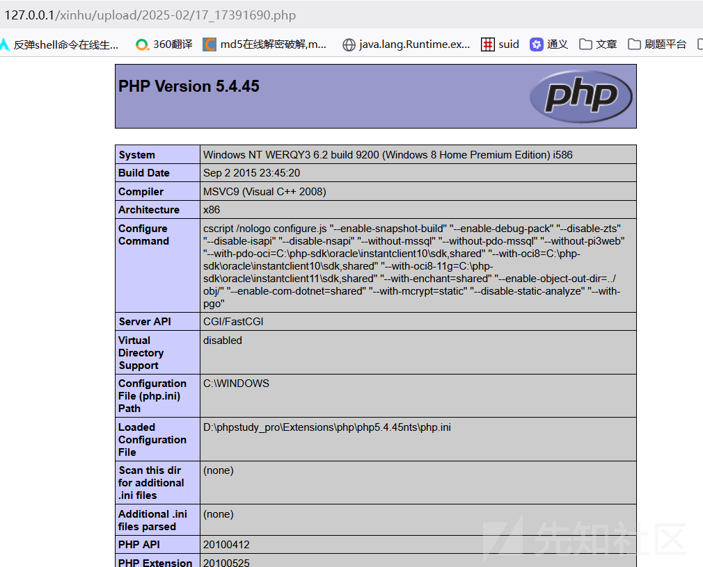

# 一次巧妙获取shell的代码审计-先知社区

> **来源**: https://xz.aliyun.com/news/16945  
> **文章ID**: 16945

---

# 环境搭建

源码下载地址：<https://github.com/rainrocka/xinhu>下载后解压到本地网站根目录下，配置好数据库，然后安装即可默认密码是admin/123456，登录进去得更改一次密码

# 路由分析

在include/View.php中详细介绍了路由的定义

```
<?php  
if(!isset($ajaxbool))$ajaxbool = $rock->jm->gettoken('ajaxbool', 'false');  
$ajaxbool   = $rock->get('ajaxbool', $ajaxbool);  
$p  = PROJECT;//define('PROJECT', 'webmain');  
if(!isset($m))$m='index';  
if(!isset($a))$a='default';  
if(!isset($d))$d='';  
$m  = $rock->get('m', $m);  
$a  = $rock->get('a', $a);  
$d  = $rock->get('d', $d);  
​  
define('M', $m);  
define('A', $a);  
define('D', $d);  
define('P', $p);  
​  
$_m = $m;  
if($rock->contain($m, '|')){  
    $_mas = explode('|', $m);//以|分割变量m  
    $m= $_mas[0];  
    $_m = $_mas[1];  
}  
include_once($rock->strformat('?0/?1/?1Action.php',ROOT_PATH, $p));//调用strformat进行格式化，其中?0、?1 等是占位符  
$rand   = date('YmdHis').rand(1000,9999);//随机值  
if(substr($d,-1)!='/' && $d!='')$d.='/';//若$d最后一个字符不是/且$d不是空就在$d后面加一个/  
$errormsg   = '';  
$methodbool = true;  
$actpath    = $rock->strformat('?0/?1/?2?3',ROOT_PATH, $p, $d, $_m);//$actpath：根目录/webmain/$d/$_m  
define('ACTPATH', $actpath);  
$actfile    = $rock->strformat('?0/?1Action.php',$actpath, $m);//$actfile:根目录/webmain/$d/$_m/$mAction.php  
$actfile1   = $rock->strformat('?0/?1Action.php',$actpath, $_m);//$actfile1:根目录/webmain/$d/$_m/$_mAction.php  
$actbstr = null;  
//依次判断$actfile1以及$actfile哪个文件存在，哪个存在包含哪个  
if(file_exists($actfile1))  
    include_once($actfile1);  
if(file_exists($actfile)){  
    include_once($actfile);  
    $clsname    = ''.$m.'ClassAction';  
    $xhrock = new $clsname();//创建一个与$m相关类的对象  
    $actname    = ''.$a.'Action';//在$a后接一个Action  
    if($ajaxbool == 'true')//判断ajaxbool是否为true  
        $actname    = ''.$a.'Ajax';//在$a后接一个Ajax  
    if(method_exists($xhrock, $actname)){//检测类中是否存在该方法  
        $xhrock->beforeAction();  
        $actbstr = $xhrock->$actname();  
        $xhrock->bodyMessage = $actbstr;  
        if(is_string($actbstr)){echo $actbstr;$xhrock->display=false;}  
        if(is_array($actbstr)){echo json_encode($actbstr);$xhrock->display=false;}  
    }else{  
        $methodbool = false;  
        if($ajaxbool == 'false')echo ''.$actname.' not found;';  
    }  
    $xhrock->afterAction();  
}else{  
    echo 'actionfile not exists;';  
    $xhrock = new Action();  
}  
​  
$_showbool = false;  
if($xhrock->display && ($ajaxbool == 'html' || $ajaxbool == 'false')){  
    $xhrock->smartydata['p']    = $p;  
    $xhrock->smartydata['a']    = $a;  
    $xhrock->smartydata['m']    = $m;  
    $xhrock->smartydata['d']    = $d;  
    $xhrock->smartydata['rand'] = $rand;  
    $xhrock->smartydata['qom']  = QOM;  
    $xhrock->smartydata['path'] = PATH;  
    $xhrock->smartydata['sysurl']= SYSURL;  
    $temppath   = ''.ROOT_PATH.'/'.$p.'/';  
    $tplpaths   = ''.$temppath.'/'.$d.''.$m.'/';  
    $tplname    = 'tpl_'.$m.'';  
    if($a!='default')$tplname  .= '_'.$a.'';  
    $tplname       .= '.'.$xhrock->tpldom.'';  
    $mpathname  = $tplpaths.$tplname;  
    if($xhrock->displayfile!='' && file_exists($xhrock->displayfile))$mpathname = $xhrock->displayfile;  
    if(!file_exists($mpathname) || !$methodbool){  
        if(!$methodbool){  
            $errormsg   = 'in ('.$m.') not found Method('.$a.');';  
        }else{  
            $errormsg   = ''.$tplname.' not exists;';  
        }  
        echo $errormsg;  
    }else{  
        $_showbool = true;  
    }  
}  
if($xhrock->display && ($ajaxbool == 'html' || $xhrock->tpltype=='html' || $ajaxbool == 'false') && $_showbool){  
    $xhrock->setHtmlData();  
    $da = $xhrock->smartydata;  
    foreach($xhrock->assigndata as $_k=>$_v)$$_k=$_v;  
    include_once($mpathname);  
    $_showbool = false;  
}
```

这里用get方式会接收m，d，a，ajaxbool参数

* rock->jm->gettoken获取。当ajaxbool为false时，是对xxxAction.php的内容访问，当ajaxbool为true时，是对xxxAjax.php的内容进行访问
* a, $d：分别代表php文件名（不含Action）、动作名（action）、目录名(webadmin下的子目录），默认值分别为index，default、空字符串。

举例：index.php?a=deluser&m=imgroup&ajaxbool=true&gid=38&sid=1

* $m：user，表示请求的是webadmin下的imgroup 目录。
* $a：list，表示请求的方法是 deluser。
* ajaxbool：true，表示这是一个 AJAX 请求

# 漏洞分析





根据路由定位文件：webmain/public/upload/uploadAction.php文件下的upfileAjax方法

```
public function upfileAjax()
{
    if(!$_FILES)exit('sorry!');
    $upimg = c('upfile');
    $maxsize= (int)$this->get('maxsize', 5);
    $uptype    = $this->get('uptype', '*');
    $thumbnail = $this->get('thumbnail');
    $upimg->initupfile($uptype, ''.UPDIR.'|'.date('Y-m').'', $maxsize);
    $upses = $upimg->up('file');
    $arr   = c('down')->uploadback($upses, $thumbnail, false);
    $this->returnjson($arr);
}
```

跟进一下c()方法，看看$upimg指向那个类

```
function c($name, $inbo=true, $param1='', $param2='')
{
    $class = ''.$name.'Chajian';
    $path  = ''.ROOT_PATH.'/include/chajian/'.$class.'.php';
    $cls   = NULL;
    if(file_exists($path)){
       include_once($path);
       if($inbo)$cls  = new $class($param1, $param2);
    }
    return $cls;   
}
```

这里主要包含了upfileChajian.php文件

再跟进一下upfileChajian.php文件中的up()方法，看看怎样实现文件上传的

```
public function up($name,$cfile='')
{
    if(!$_FILES)return 'sorry!';
    $file_name    = $_FILES[$name]['name'];
    $file_size    = $_FILES[$name]['size'];//字节
    $file_type    = $_FILES[$name]['type'];
    $file_error       = $_FILES[$name]['error'];
    $file_tmp_name = $_FILES[$name]['tmp_name'];
    $zongmax      = $this->getmaxupsize();   
    if($file_size<=0 || $file_size > $zongmax){
       return '文件为0字节/超过'.$this->formatsize($zongmax).'，不能上传';
    }
    $file_sizecn   = $this->formatsize($file_size);
    $file_ext     = $this->getext($file_name);//文件扩展名

    $file_img     = $this->isimg($file_ext);
    $file_kup     = $this->issavefile($file_ext);
    
    if(!$file_img && !$this->isoffice($file_ext) && getconfig('systype')=='demo')return '演示站点禁止文件上传';
    
    if($file_error>0){
       $rrs = $this->geterrmsg($file_error);
       return $rrs;
    }
       
    if(!$this->contain('|'.$this->ext.'|', '|'.$file_ext.'|') && $this->ext != '*'){
       return '禁止上传文件类型['.$file_ext.']';
    }
    
    if($file_size>$this->maxsize*1024*1024){
       return '上传文件过大，限制在：'.$this->formatsize($this->maxsize*1024*1024).'内，当前文件大小是：'.$file_sizecn.'';
    }
    
    //创建目录
    $zpath=explode('|',$this->path);
    $mkdir='';
    for($i=0;$i<count($zpath);$i++){
       $mkdir.=''.$zpath[$i].'/';
       if(!is_dir($mkdir))mkdir($mkdir);
    }
    
    //新的文件名
    $file_newname  = $file_name;
    $randname     = $file_name;
    if(!$cfile==''){
       $file_newname=''.$cfile.'.'.$file_ext.'';
    }else{
       $_oldval    = m('option')->getval('randfilename');
       $randname   = $this->getrandfile(1, $_oldval);
       m('option')->setval('randfilename', $randname);
       $file_newname=''.$randname.'.'.$file_ext.'';
    }
    
    $save_path = ''.str_replace('|','/',$this->path);
    //if(!is_writable($save_path))return '目录'.$save_path.'无法写入不能上传';
    $allfilename= $save_path.'/'.$file_newname.'';
    $uptempname    = $save_path.'/'.$randname.'.uptemp';

    $upbool       = true;
    if(!$file_kup){
       $allfilename= $this->filesave($file_tmp_name, $file_newname, $save_path, $file_ext);
       if(isempt($allfilename))return '无法保存到'.$save_path.'';
    }else{
       $upbool       = @move_uploaded_file($file_tmp_name,$allfilename);
    }
    
    if($upbool){
       $picw=0;$pich=0;
       if($file_img){
          $fobj = $this->isimgsave($file_ext, $allfilename);
          if(!$fobj){
             return 'error:非法图片文件';
          }else{
             $picw = $fobj[0];
             $pich = $fobj[1];  
          }
       }
       return array(
          'newfilename' => $file_newname,
          'oldfilename' => $file_name,
          'filesize'    => $file_size,
          'filesizecn'  => $file_sizecn,
          'filetype'    => $file_type,
          'filepath'    => $save_path,
          'fileext'     => $file_ext,
          'allfilename' => $allfilename,
          'picw'        => $picw,
          'pich'        => $pich
       );
    }else{
       return '上传失败：'.$this->geterrmsg($file_error).'';
    }
}
```

这里有一个issavefile()方法是用来进行后缀判断，跟进一下

```
private $upallfile		= '|doc|docx|xls|xlsx|ppt|pptx|pdf|swf|rar|zip|txt|gz|wav|mp3|avi|mp4|flv|wma|chm|apk|amr|log|json|cdr|psd|';
public function issavefile($ext)
{
    $bo       = false;
    $upallfile = $this->jpgallext.$this->upallfile;
    if($this->contain($upallfile, '|'.$ext.'|'))$bo = true;
    return $bo;
}
```

如果不在白名单里面$bo就返回false，由于我们上传的是php文件，所以这里为false，$filekup就为false了

```
if(!$file_kup){
    $allfilename= $this->filesave($file_tmp_name, $file_newname, $save_path, $file_ext);
    if(isempt($allfilename))return '无法保存到'.$save_path.'';
}else{
    $upbool       = @move_uploaded_file($file_tmp_name,$allfilename);
}
```

所以会调用filesave(方法，跟进一下

```
public function filesave($oldfile, $filename, $savepath, $ext)
    {
       $file_kup  = $this->issavefile($ext);
       $ldisn        = strrpos($filename, '.');
       if($ldisn>0)$filename = substr($filename, 0, $ldisn);
       $filepath  = ''.$savepath.'/'.$filename.'.'.$ext.'';
       if(!$file_kup){
          $filebase64    = base64_encode(file_get_contents($oldfile));
          $filepath  = ''.$savepath.'/'.$filename.'.uptemp';
          $bo       = $this->rock->createtxt($filepath, $filebase64);
          @unlink($oldfile);
          if(!$bo)$filepath = '';
       }else{
       }
       return $filepath;
    }
}
```

这个功能主要是将文件内容base64编码，并将文件内容写入到.uptemp文件，使用这里我们是无法利用的



这里也确实替换了后缀

但是在webmain/task/runt/qcloudCosAction.php文件中存在一个runAction方法

```
public function runAction()
{
    $fileid = (int)$this->getparams('fileid','0'); //文件ID
    if($fileid<=0)return 'error fileid';
    $frs   = m('file')->getone($fileid);
    if(!$frs)return 'filers not found';
    
    $filepath  = $frs['filepath'];
    if(substr($filepath, 0, 4)=='http')return 'filepath is httppath';
    
    if(substr($filepath,-6)=='uptemp'){
       $aupath = ROOT_PATH.'/'.$filepath;
       $nfilepath  = str_replace('.uptemp','.'.$frs['fileext'].'', $filepath);
       $content   = file_get_contents($aupath);
       $this->rock->createtxt($nfilepath, base64_decode($content));
       unlink($aupath);
       $filepath  = $nfilepath;
    }
```

这里可以通过控制id来还原.uptemp后缀为之前上传的后缀

根据文件来构造一下路由

task.php?m=qcloudCos|runt&a=run&fileid=10


成功替换后缀

访问一下


