# 分析某台子网站加密，脚本联动BP实现自动加解密梭哈，直接爽飞-先知社区

> **来源**: https://xz.aliyun.com/news/16951  
> **文章ID**: 16951

---

## 0x00 文章背景

虽然码的可能有点多，但是重点部分基本上都写了，主要还是看对代码的理解以分析的思路各方面。

一次对某个台子的加解密分析：打开一看，哦豁，整个就是加密。请求和响应的正文都是加密，最后通过断点，分析流程步骤；调教AI编写脚本，联动BP实现发包自动加解密，成功爽飞，快来跟我看看吧。

​

## 0x01 全是加密

开局一个登录框，随机输入抓个包：

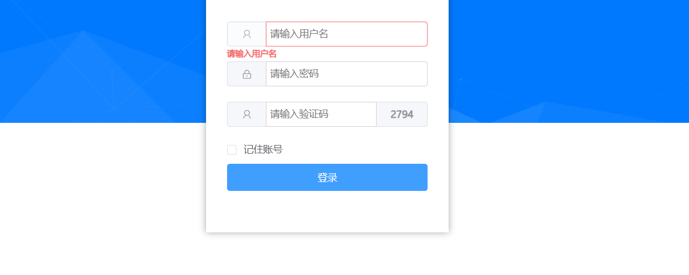

我嘞个骚刚，哥们，这对吗？请求与响应正文全是密文：

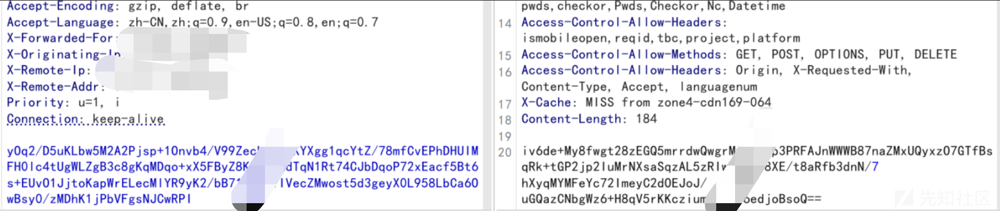

正文直接是密文，那么想要从JS里面去定位关键内容，就只能看请求头里有没有什么东西是可以用上的了（为了看的更清晰，其他的内容我就码掉了）：

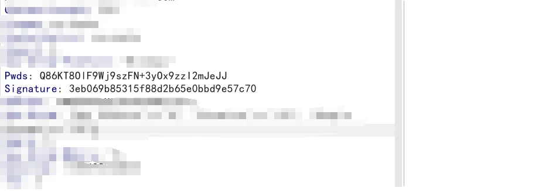

人们总是喜欢选择自己最熟悉的东西，就像看到一个东西、来到一个地方，你就会想起她……不好意思，走错片场了。

​

## 0x02 初步分析

好吧，这里我选择Pwds进行定位，在源代码中搜索：

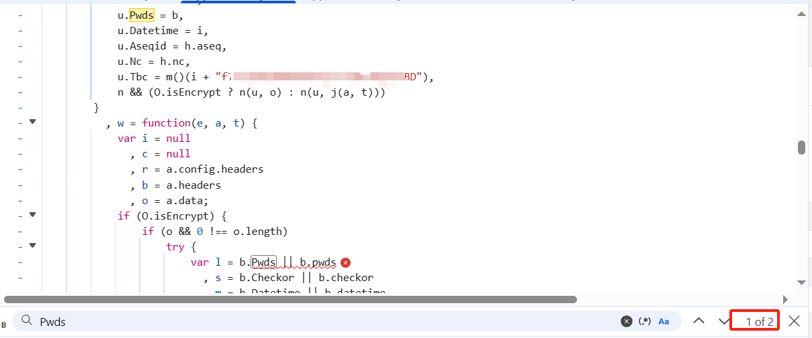

不出意外的话，关键位置就是这里了。简单往上爬一爬，发现了一个东西（其实很多处都出现了，简单截了一个点）：

那么，大概率密文用到的是des加密。接下来，尝试回到刚刚那段关键代码处，在附近打上几个断点来查看关键位置是否在这个范围：

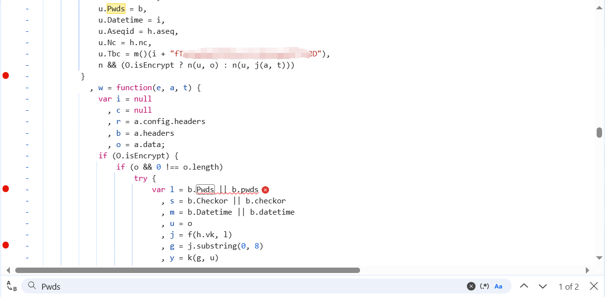

瞎鸡毛输入一串凭证，点击登录：

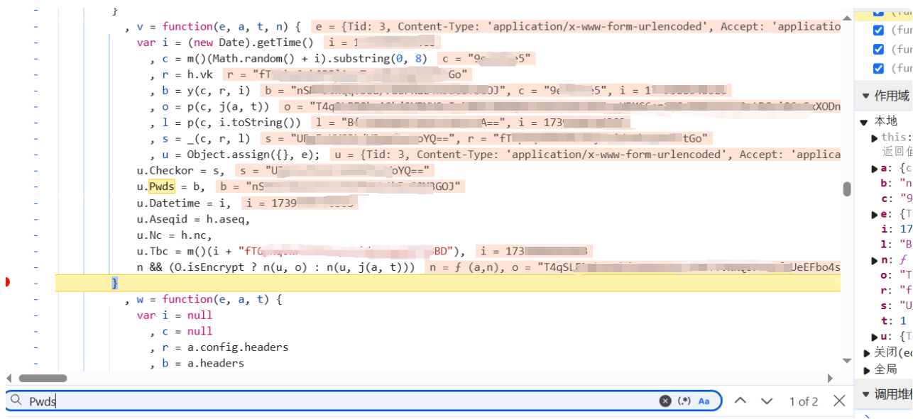

我焯，一发入魂了，当场就找到了关键点。那就，简单看看代码都啥流程吧（配合上面的图来看哈）：

**​**

**最后，分解一下总体流程：**

1. 我们说到了，o的值就是加密后的请求包正文。而o的值来源于 p(c, j(a, t)) ，使用 p() 调用 c 和 j(a, t) ；
2. 根据上图可得，c的值为：一串包含随机内容与时间戳生成的内容，最后截取前8位字符串；而a则是未加密前的正文内容；t的值是1，我推测就是确认加密的意思；
3. 那么也就是说：o的值，有可能是通过获取c的内容作为密钥，然后进行加密。至于是什么加密方式，我们在JS中看到有des关键字，可能是des加密。

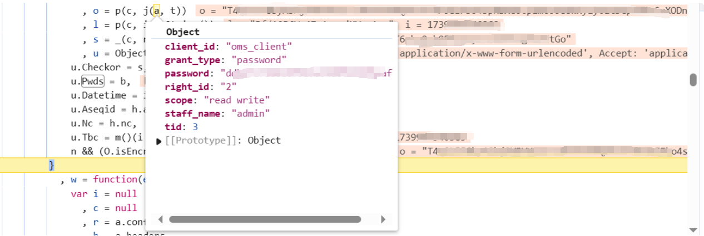

## 0x03 解密验证

根据我们前面的分析，我们推测用到的是des加密，并且使用c的值：9e\*\*\*e5，作为加密的密钥。那么，接下来我们尝试解密：

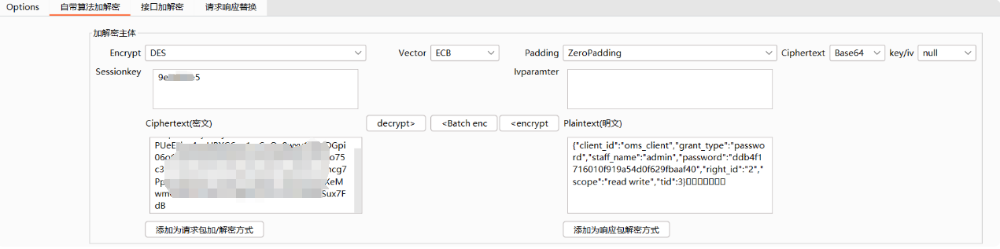

解密成功，当场没毛病。响应的我就不写了，用的流程是一样的。

## 0x04 问题出现

在前面的分析中，我们解释到了：c是生成一串具有随机数且包含时间戳的字符串，并且截取前8位字符串，最后作为c的值：

那也就是说，由于包含了时间戳，那么c的值会随着你每一次请求的时间戳不同而产生变化。同时经过我们的验证，c是des加密的密钥，那么意味着每一次发送新的数据包时，对应数据包的密钥也会产生变化。

问题大吗？有点大，但不是很大。我们逐步来解决，先看下图：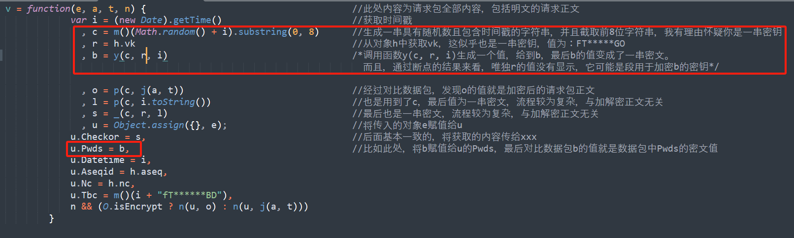

​

### 流程解析

回到我们最开始定位的数据包头里面的Pwds，从上图我们可以看到一些流程，我们直接来总结一下分解的步骤：

1. u.Pwds，也就是数据包头中的Pwds，它的值来源于b；
2. 而b是一串密文，它通过获取r的值：FT\*\*\*\*GO作为密钥；将c的值+时间戳，拼接在一起，然后进行加密；
3. 最后一个重点，记住：o是获取c的值作为密钥，进行des加密。

​

### 解决问题

此时就意味着，我们想要对密文进行加解密的话。首先，需要对Pwds进行解密，密钥是r的值；然后获取其明文的前8位字符串作为des解密密钥。验证一下，如下：

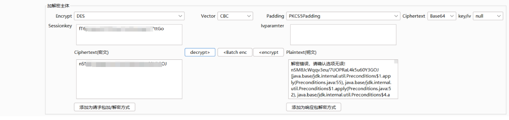

但是我死活解不出来，差点原地爆炸了。最后大佬跟我说，我的分析流程应该没有问题，但是有没有尝试一下3des加密（大佬不语，只说是经验之谈）：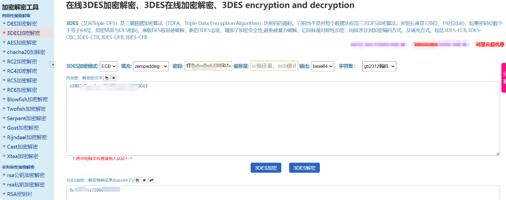

好吧……真的会谢，还是太年轻了：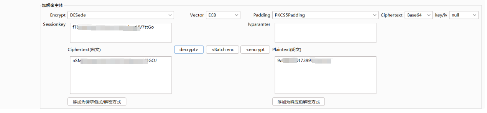

响应包的流程也是一样的，只是经过分析。响应包中r的值跟请求包里的值不一样，也就意味着响应包中Pwds的3des加密的密钥与请求包中的不一样：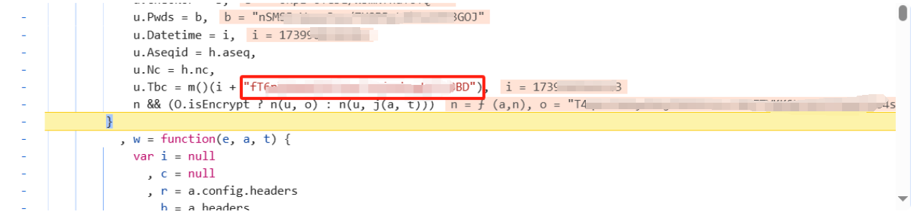

那么由于时间戳会导致密钥变化，接下来我们需要使用脚本联动BP进行发包，让其实现发包的时候进行相关的加解密操作。

​

## 0x05 调教AI编写脚本

掏出Deepseek，虽然第一次代码存在一些小问题，但是我提出新的要求后，差不多直接就运行没毛病了，后续再让他慢慢微调，形成最完美版本即可：

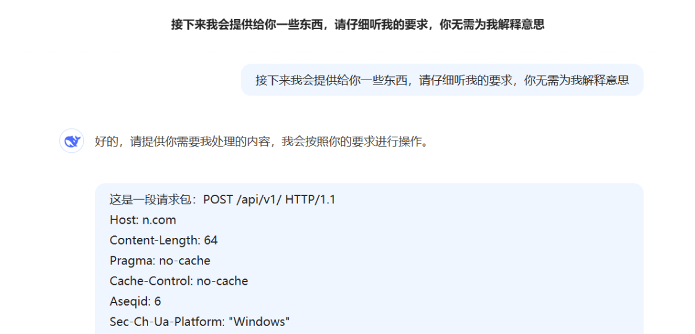

最好是提供请求包、响应包这些内容，然后再说出你的要求：

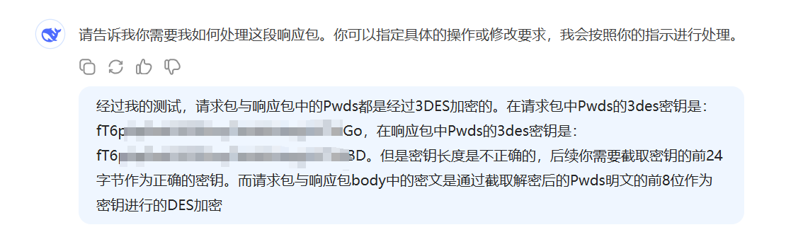

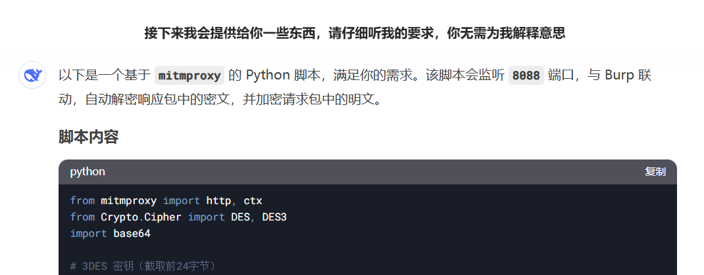

最终版本，联动BP发包测试，直接没毛病：

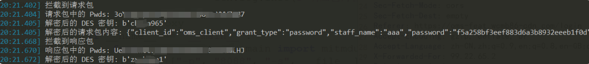
