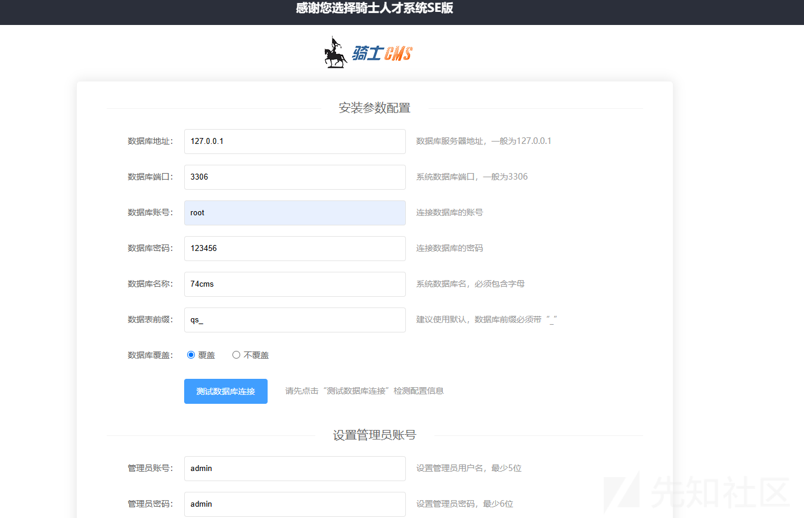
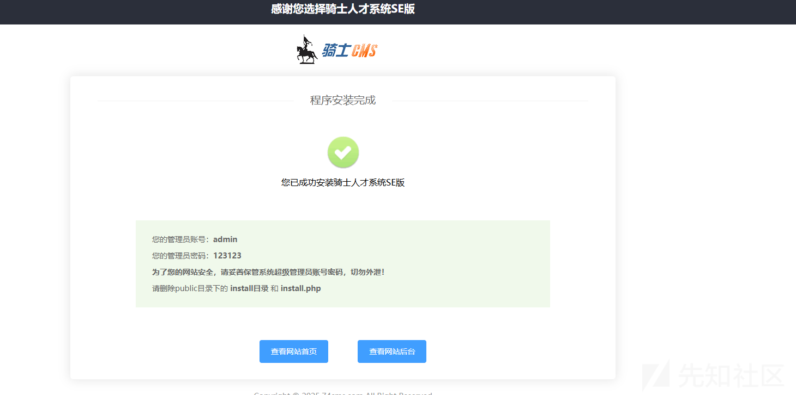
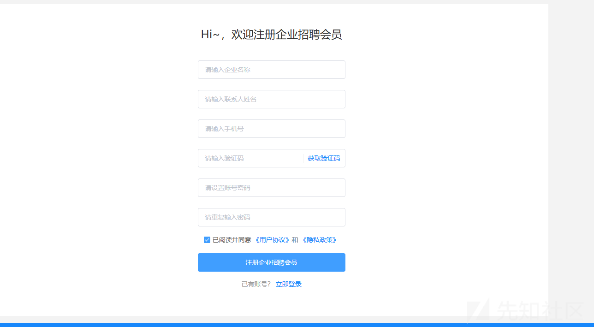
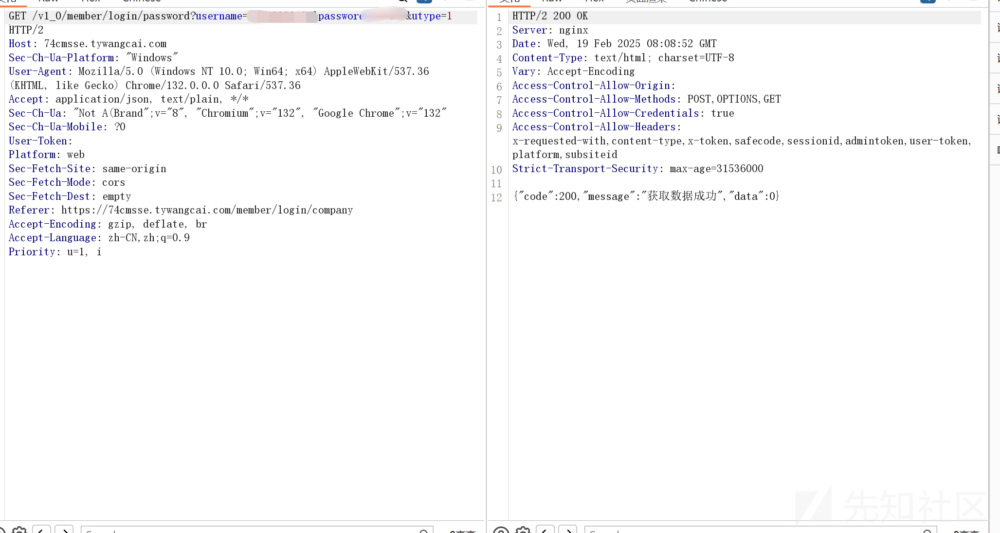
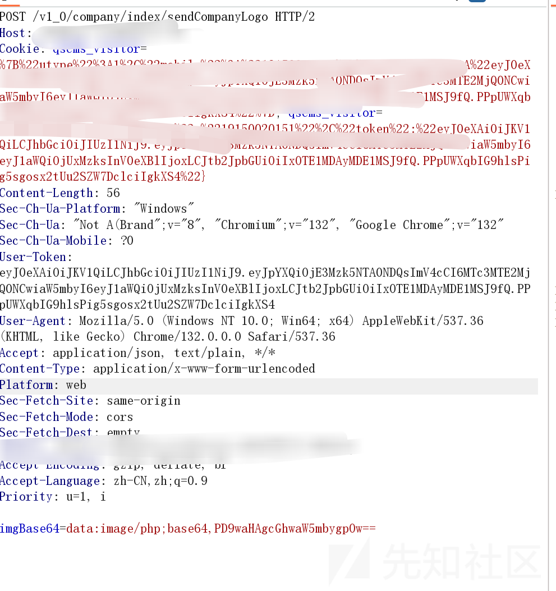
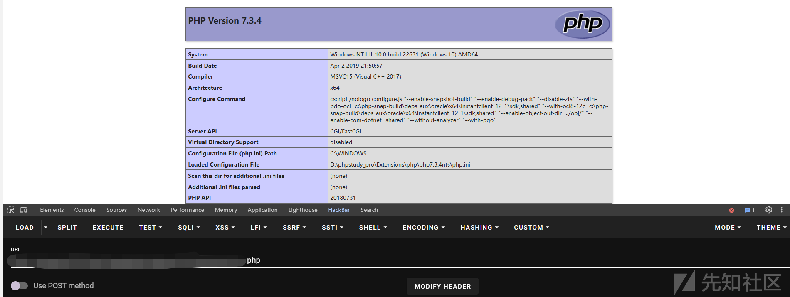
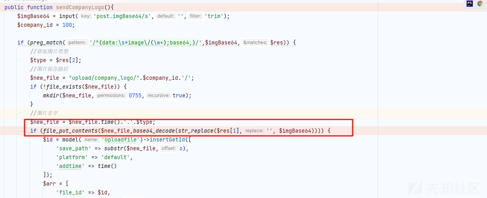
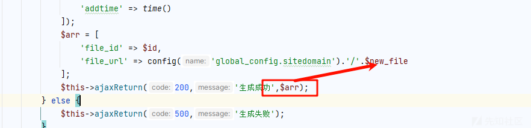

# 74cms 最新 getshell 漏洞-先知社区

> **来源**: https://xz.aliyun.com/news/16959  
> **文章ID**: 16959

---

# 74cms 最新 getshell 漏洞

## 前言

**文章中涉及的敏感信息均已做打码处理，文章仅做经验分享用途，切勿当真，未授权的攻击属于非法行为！文章中敏感信息均已做多层打码处理。传播、利用本文章所提供的信息而造成的任何直接或者间接的后果及损失，均由使用者本人负责，作者不为此承担任何责任，一旦造成后果请自行承担。**

## 环境搭建

首先下载源码，直接官网下就好了

<https://www.74cms.com/download/detail/161.html>

使用 phpstudy 搭建



然后配置数据库地址和管理员的密码

安装成功后



参考<http://doc.74cms.com/#/se/quickstart?id=%e5%ae%89%e8%a3%85%e7%a8%8b%e5%ba%8f>

## 漏洞复现

首先需要我们自己先注册一个企业账号

访问/member/reg/company



自己先注册一个

然后登录



然后就是我们的企业 logo

可是这里我们内容可以是 base64 来决定，而且文件类型也是可以的



然后发送这个 POC 会得到一个路径

```
{"code":200,"message":"生成成功","data":{"file_id":"5","file_url":"*****\/upload\/company_logo/******.php"}}
```

访问即可



## 漏洞分析

首先看到我们的漏洞源头代码

application/v1\_0/controller/company/Index.php

```
public function sendCompanyLogo(){
$imgBase64 = input('post.imgBase64/s','','trim');
$company_id = 100;

if (preg_match('/^(data:\s*image\/(\w+);base64,)/',$imgBase64,$res)) {
    //获取图片类型
    $type = $res[2];
    //图片保存路径
    $new_file = "upload/company_logo/".$company_id.'/';
    if (!file_exists($new_file)) {
        mkdir($new_file,0755,true);
    }
    //图片名字
    $new_file = $new_file.time().'.'.$type;
    if (file_put_contents($new_file,base64_decode(str_replace($res[1],'', $imgBase64)))) {
        $id = model('Uploadfile')->insertGetId([
            'save_path' => substr($new_file,6),
            'platform' => 'default',
            'addtime' => time()
        ]);
        $arr = [
            'file_id' => $id,
            'file_url' => config('global_config.sitedomain').'/'.$new_file
        ];
        $this->ajaxReturn(200,'生成成功',$arr);
    } else {
        $this->ajaxReturn(500,'生成失败');
    }
}
```

而当我们传入 imgBase64=data:image/php;base64,PD9waHAgcGhwaW5mbygpOw==的时候

生成的是一个 php 文件

```
<?php phpinfo(); ?>
```



会直接写入

不过生成文件名有 time 随机的，还好信息中会返回路径



但是调用这个方法需要初始化

```
public function _initialize()
{
    parent::_initialize();
    $this->checkLogin(1);
}
```

跟进 checkLogin 方法

```
public function checkLogin($need_utype = 0)
{
    if ($need_utype == 0) {
        $code = 50009;
        $tip = '请先登录';
    } else {
        $tip =
            '当前操作需要登录' .
            ($need_utype == 1 ? '企业' : '个人') .
            '会员';
        $code = $need_utype==1?50011:50010;
    }

    if (
        $this->userinfo === null ||
        ($need_utype > 0 && $this->userinfo->utype != $need_utype)
    ) {

        $this->ajaxReturn($code, $tip);
    }
    if($this->userinfo !== null){
        $member = model('Member')
            ->field(true)
            ->where('uid', $this->userinfo->uid)
            ->find();
        if($member===null){
            $this->ajaxReturn(50002, '请先登录');
        }else{
            /**
             * 【ID1000788】【bug】后台登录简历日志会记录很多条
             * cy 2023-12-23
             * 通过缓存进行控制，由于前端同时多条接口请求产生了并发所以导致记录了多次
             */
            $cacheKey = 'member_login_key_' . $member['uid'];
            $loginCache = cache($cacheKey);
            if (empty($loginCache) && ($member['last_login_time'] == 0 || strtotime(date('Y-m-d', $member['last_login_time'])) != strtotime('today'))) {
                $expire = strtotime('tomorrow') - time();
                cache($cacheKey, $member['uid'], [
                    'expire' => $expire
                ]);
                $this->writeMemberActionLog($member['uid'], '登录成功', true);
            }
        }
    }
}
```

这里就需要我们注册一个企业的账号了，也就是我们刚刚那个地方

## 漏洞修复

这里没有看原作者怎么修复的，我直接因为很明显的问题就是类型

严格限制文件类型  
防止文件扩展名伪装

```
public function sendCompanyLogo() {
    $imgBase64 = input('post.imgBase64/s', '', 'trim');
    $company_id = 100;

    // 正则检查是否是 Base64 编码的图像数据
    if (preg_match('/^(data:\s*image\/(\w+);base64,)/', $imgBase64, $res)) {
        // 获取图片类型
        $type = $res[2];

        // 图片类型检查：仅允许特定类型的图像（JPEG, PNG, GIF等）
        $allowedTypes = ['jpeg', 'jpg', 'png', 'gif'];
        if (!in_array(strtolower($type), $allowedTypes)) {
            $this->ajaxReturn(400, '只允许上传图像文件');
            return;
        }

        // 图片保存路径
        $new_file = "upload/company_logo/" . $company_id . '/';
        if (!file_exists($new_file)) {
            mkdir($new_file, 0755, true);
        }

        // 图片名字
        $new_file = $new_file . time() . '.' . $type;

        // 解码 Base64 并保存图片
        $decodedImage = base64_decode(str_replace($res[1], '', $imgBase64));

        // 通过 getimagesize() 函数确认文件是有效图像
        $imageInfo = getimagesizefromstring($decodedImage);
        if ($imageInfo === false) {
            $this->ajaxReturn(400, '无效的图像文件');
            return;
        }

        // 保存文件
        if (file_put_contents($new_file, $decodedImage)) {
            $id = model('Uploadfile')->insertGetId([
                'save_path' => substr($new_file, 6),
                'platform' => 'default',
                'addtime' => time()
            ]);

            $arr = [
                'file_id' => $id,
                'file_url' => config('global_config.sitedomain') . '/' . $new_file
            ];

            $this->ajaxReturn(200, '生成成功', $arr);
        } else {
            $this->ajaxReturn(500, '生成失败');
        }
    } else {
        $this->ajaxReturn(400, '无效的文件格式');
    }
}
```

这里强行要求是图片格式了，php 就不可以了

​

参考[https://github.com/wy876/POC/blob/main/74CMS](https://github.com/wy876/POC/blob/main/74CMS/CVE-2024-2561.md)
