# 某某小说逆向分析-先知社区

> **来源**: https://xz.aliyun.com/news/16969  
> **文章ID**: 16969

---

## 前言

环境：pixel2 android10  
应用：57q15qi{beihai\_delete}q5bCP6K+0YXBrICA4{beihai\_delete}LjEuMTAuNjU=

## 正文

​

抓取获取小说内容的流量包，看到sig参数变化不定，而其他参数是固定的  
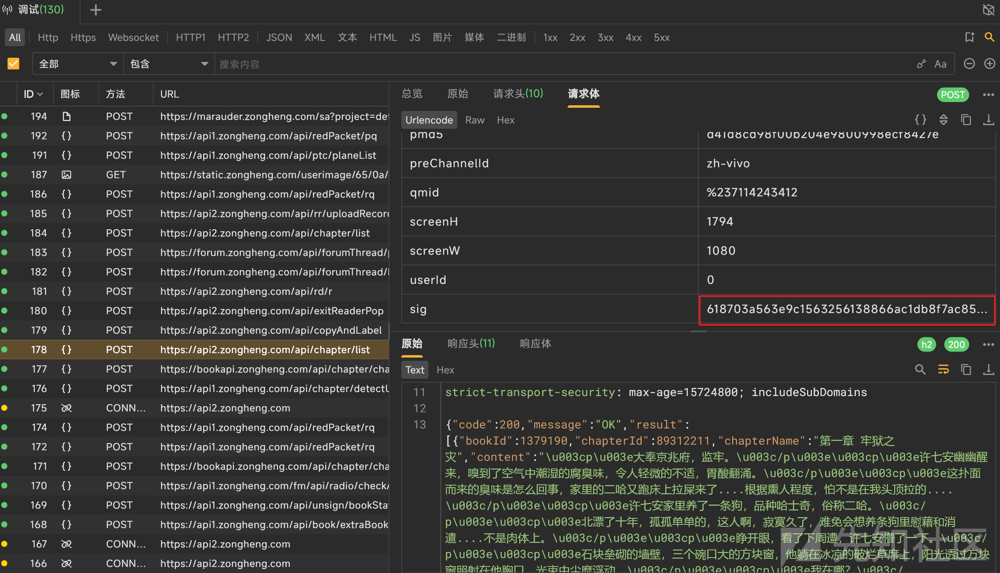

### Java层

于是来分析一下sig  
使用jadx反编译，然后搜索字符串"sig"和字符串sig,大致看了一下，没看到能确定的位置

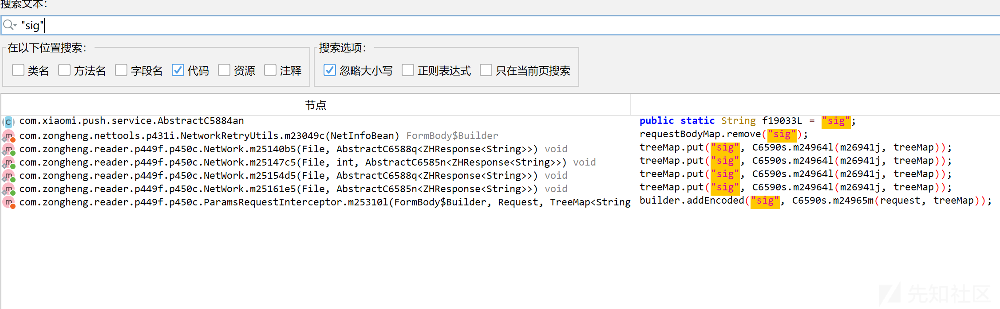

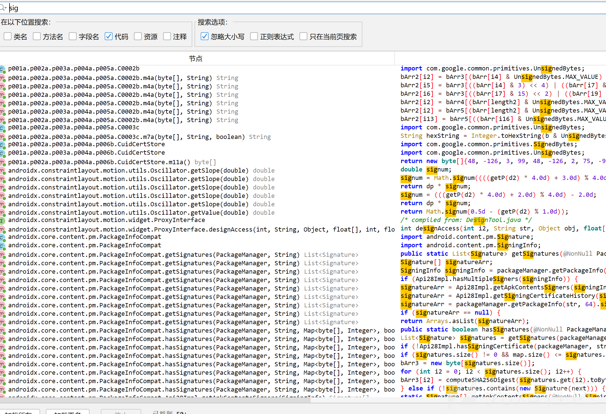

搜索字符串的办法不太可行  
使用算法助手hook一下看看有没有线索，但是好像并没有找到跟sig值相关的加密结果

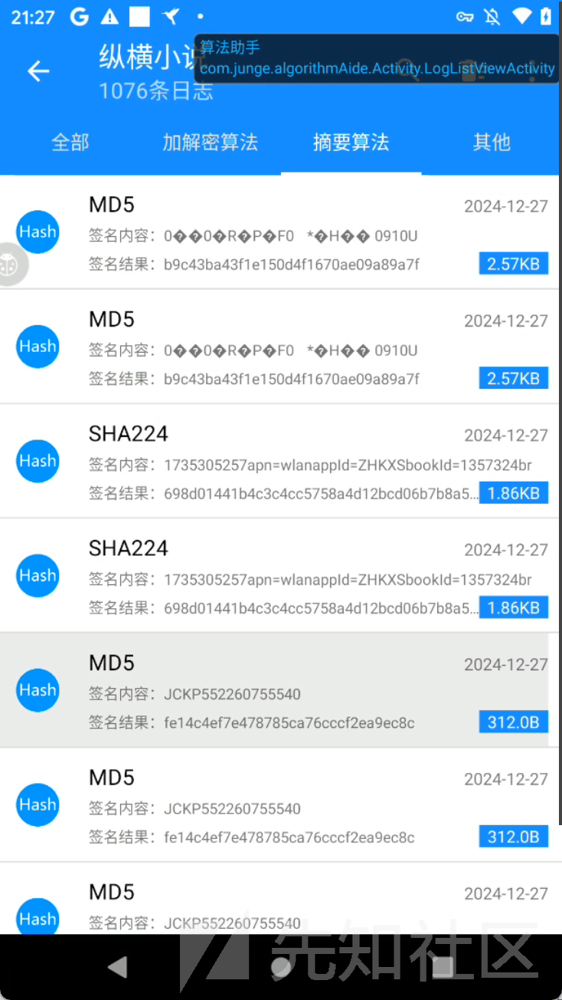

那就用一下加解密函数的hook脚本  
<https://github.com/InNorthSea/android_reverse_case/blob/main/纵横小说/加解密函数hook.js>

同样没有找到

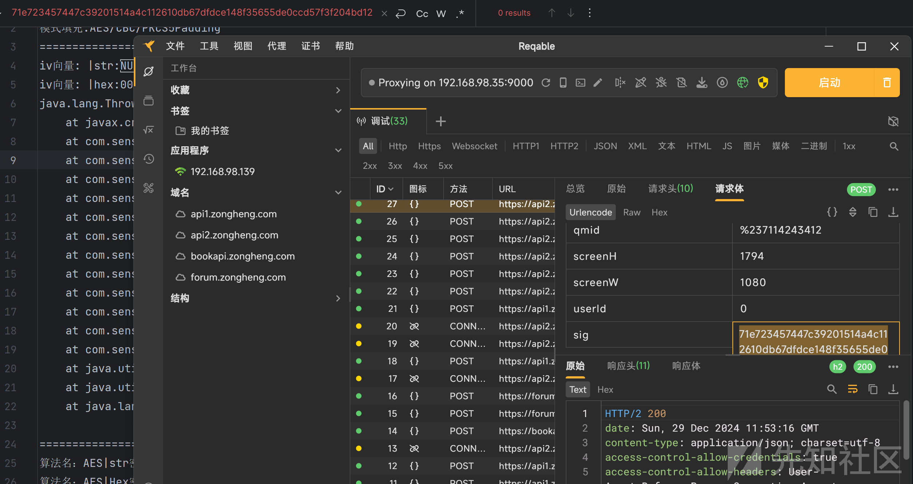

emm....那就看看其他参数能不能找到吧，一般生成请求参数的代码会写在一起

经过一番查找，发现了一个可疑位置

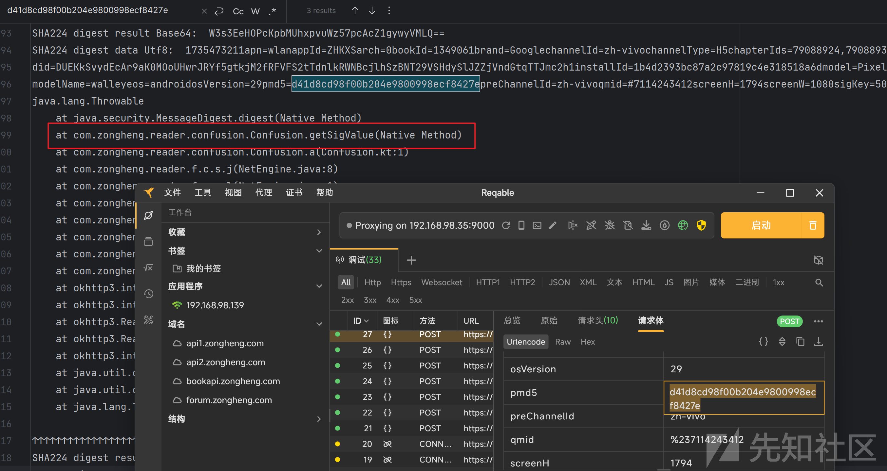

在jadx中搜索，发现搜到了，是个jni函数

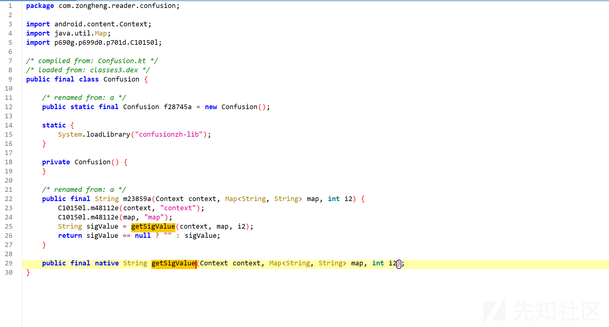

hook一下  
代码如下：

```
function hook_getSigValue() {
    Java.perform(
        function () {
            var Confusion = Java.use("com.zongheng.reader.confusion.Confusion");
            Confusion.getSigValue.overload('android.content.Context', 'java.util.Map', 'int').implementation = function (a, b, c) {
                var result = "";
                if (b!= null) {
                    var keyset = b.keySet();
                    var it = keyset.iterator();
                    while (it.hasNext()) {
                        var keystr = it.next().toString();
                        var valuestr = b.get(keystr).toString();
                        result  = " "   valuestr;
                    }
                }
                console.log("a========>", a);
                console.log("b========>", result);
                console.log("c========>", c);
                var ret = this.getSigValue(a, b, c);
                return ret;
            }
        }
    )
}
function main() {
    hook_getSigValue();
}
setImmediate(main);
```

a对应上下文，b对应map，c对应i2  
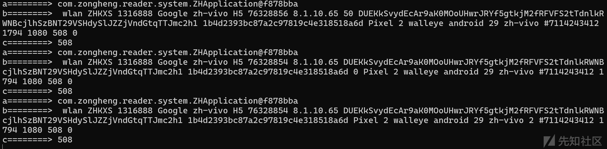

观察了一下，map里面好像是固定的，i2好像不是固定的，因为我第二天测崩了重装app后发现这个i2好像变了（  
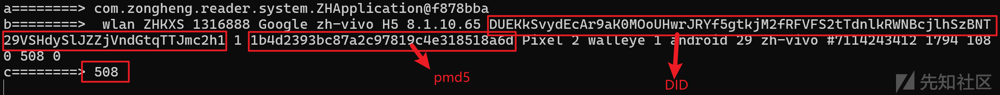  
下图是第二天重装后hook的结果

搜索一下Confusion类

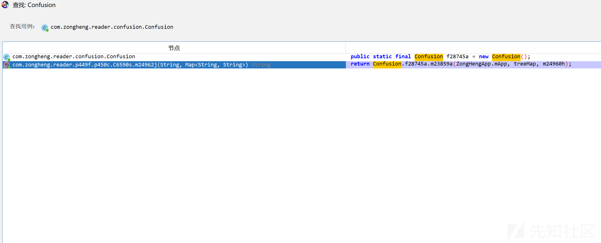

这个m24960h对应的就是i2，往上看看，这个传入的参数是由函数m24960生成

  
进入m24960，判断条件!TextUtils.isEmpty(str)是成立的，但是C9216g2.m43397n(map.get(Book.USER\_ID)) > 0一时间判断不了  
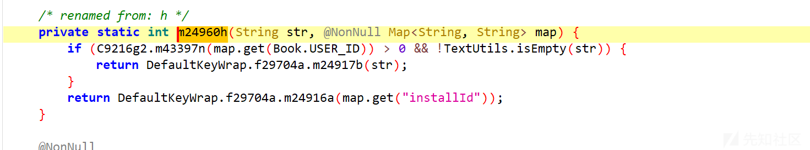  
那就分别看一下吧，  
先看看不符合if条件后执行的m24917a，这个函数最后会返回aVar2.m24919b()  
m24919b()会返回属性f29708b

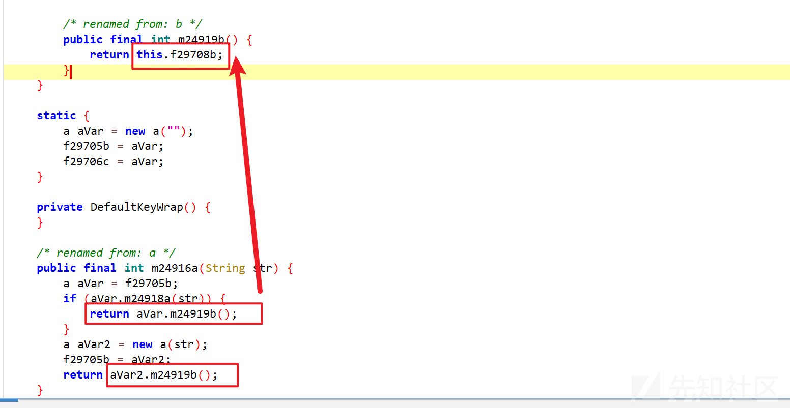

向上翻，很容易就可以看到属性f29708b是通过上面的a函数初始化的

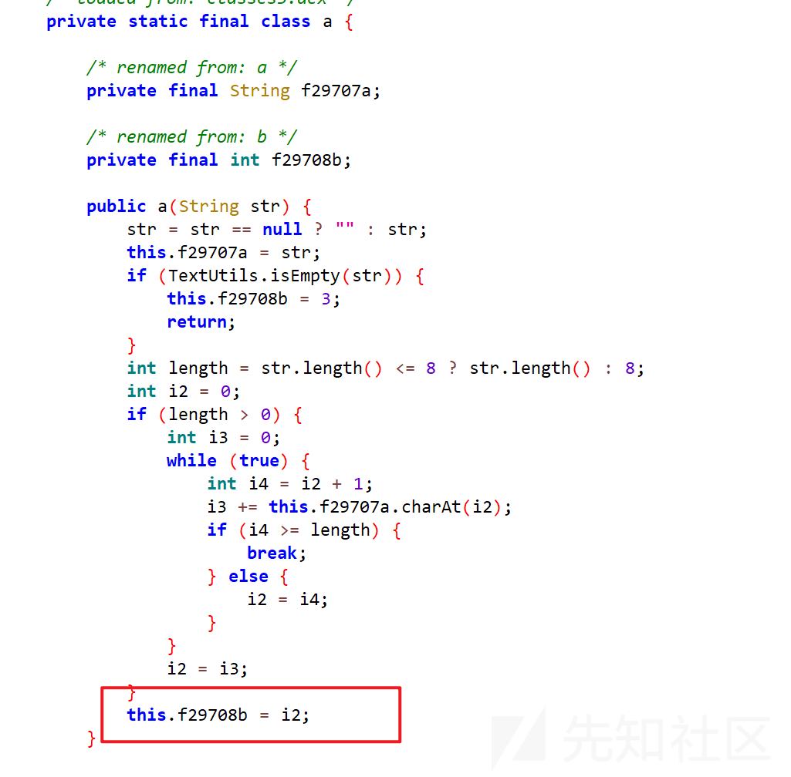

同样的，如果符合条件执行m24917b，也是返回属性f29708b  
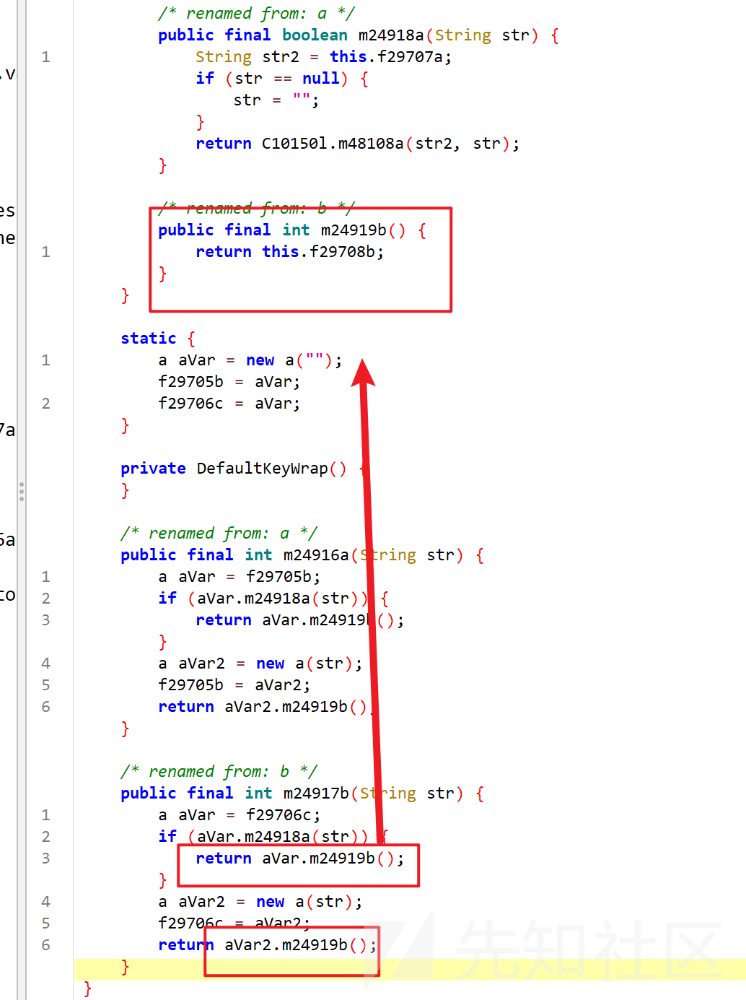

hook一下a看看参数是什么

```
function hook_a() {
    Java.perform(
        function () {
            var Confusion = Java.use("com.zongheng.reader.f.c.m$a");
            Confusion.a.overload('java.lang.String').implementation = function (a) {
                console.log("a========>", a);
                var ret = this.a(a);
                return ret;
            }
        }
    )
}
```

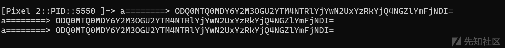

看着像base64，解一下发现确实是

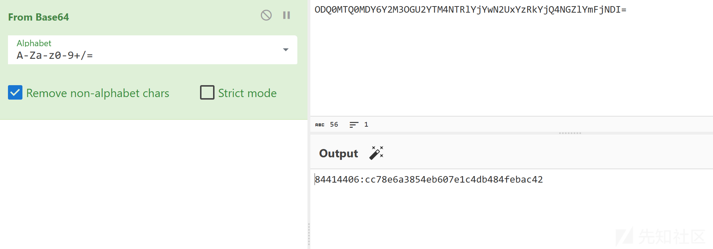

这里面的运算并不涉及随机数或者时间戳，初始化结果只与传入参数相关，观察了一会这个"ODQ0MTQ0MDY6Y2M3OGU2YTM4NTRlYjYwN2UxYzRkYjQ4NGZlYmFjNDI="好像也没怎么变动，所以如果逆向的目的是爬虫或者是发包测试，把这个参数视为固定值即可

于是getSigValue的参数大概是弄清楚了

### native层

现在来看getSigValue本身  
把confusionzh-lib库反编译  
通过搜索getSigValue很快就可以找到函数体

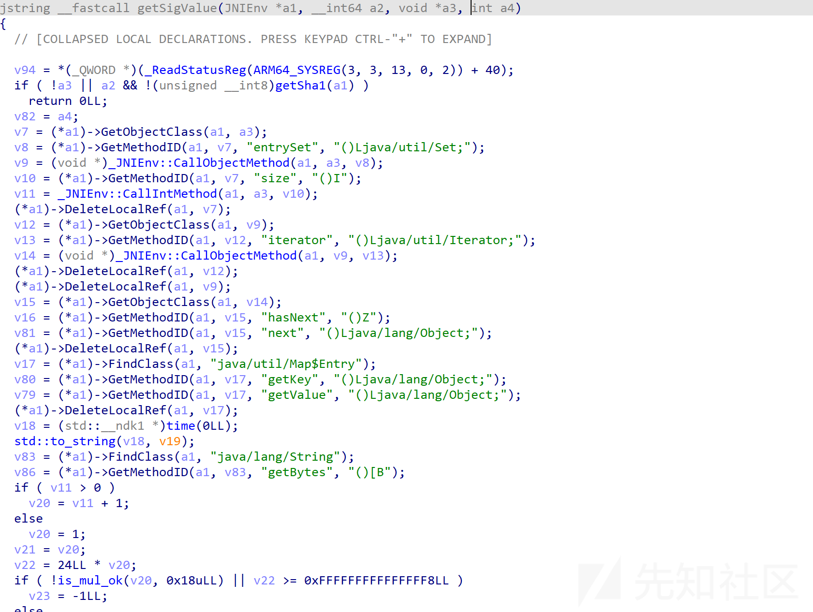  
这个函数不短也不长，如果从爬虫的角度，可以不分析直接用unidbg模拟执行得到sig值，如果想逆向分析native层的处理过程，就要认真阅读这个函数的源码

​

下面使用unidbg来黑盒模拟执行  
我们的目的是调用JNI函数getSigValue，获取它的返回值  
构造函数初始化

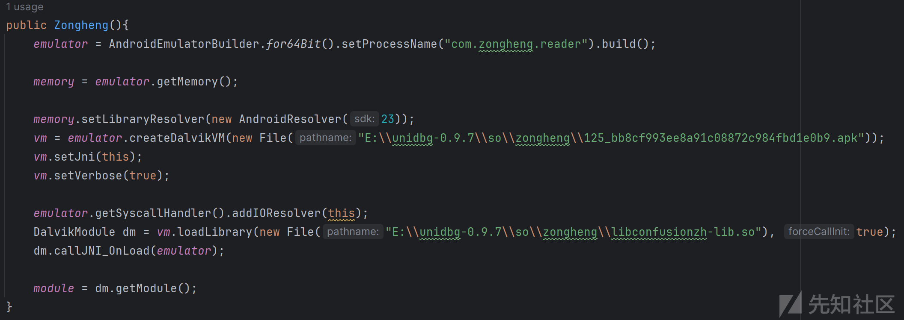

调用getSigValue

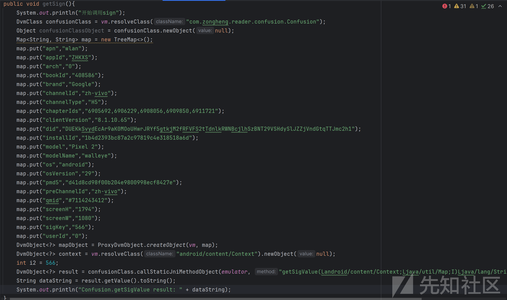

然后就是补环境了  
补环境相关文章：<https://www.freebuf.com/articles/endpoint/352513.html>  
下面是要补充的部分，主打一个抛出什么异常，就补什么就好了  
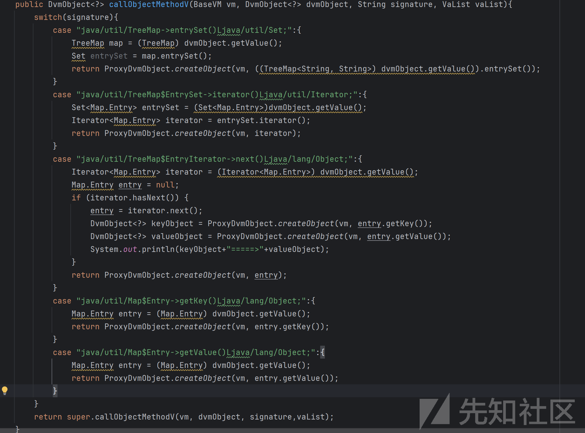

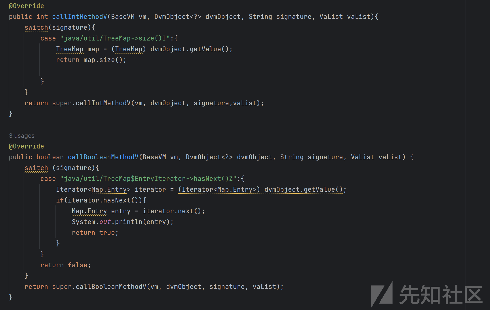

完整代码：<https://github.com/InNorthSea/android_reverse_case/blob/main/纵横小说/unidbg_code.java>

运行结果如下：

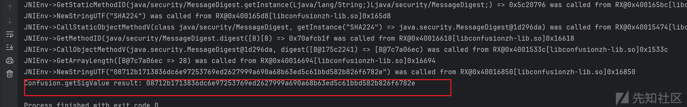

到此，就使用unidbg生成了sig值了

​

​

## 参考资料

<https://www.bilibili.com/video/BV19mzMYnE75/>
