# ctf异常处理-(1)-先知社区

> **来源**: https://xz.aliyun.com/news/16973  
> **文章ID**: 16973

---

### 前言

* **UEH**（Unstructured Exception Handling）通常指的是不通过结构化异常处理（SEH）机制的异常处理方式。SEH 是传统的 Windows 异常处理模型，使用 \_\_try 和 \_\_except 来捕获异常。与之相对的是 **VEH**，它是更底层的异常处理机制，允许开发者更精细地控制异常的捕获和处理。
* **VEH**（Vectored Exception Handling）通过 AddVectoredExceptionHandler 函数将异常处理程序添加到操作系统的异常处理链中。VEH 是 **非结构化异常处理（Unstructured Exception Handling，UEH）** 的一种实现方式，因此，有时人们也把 VEH 称为一种 UEH。

* **SEH**（Structured Exception Handling）：通过 \_\_try 和 \_\_except 语句捕获和处理异常，适用于 C/C++ 程序。SEH 是一种更高级、结构化的异常处理方式。
* VEH是全局共享的，工作在用户层；SEH是线程局部的，同时存在于内核层和用户层；UEH作为最后的异常处理手段，主要用于内存转储，且在调试状态下不触发。

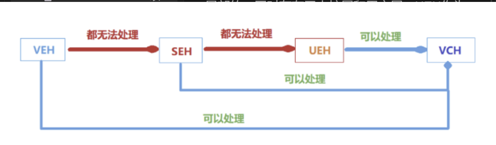

### eg

首先补上缺失的dll，可以运行了

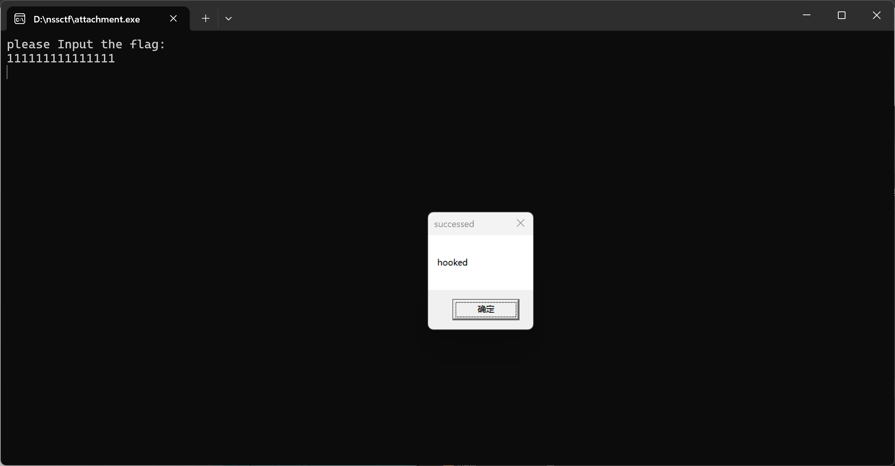

静态分析查看，初步确认是异常处理，但是一个一个查看因为回调逻辑很乱

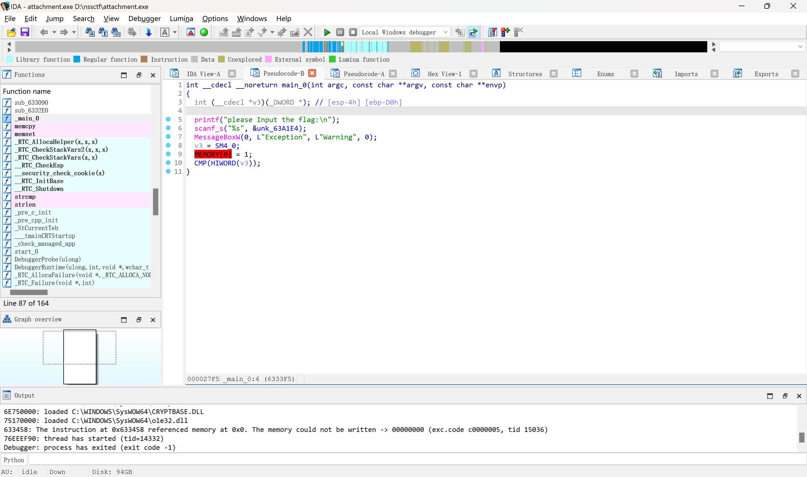

SM4特征

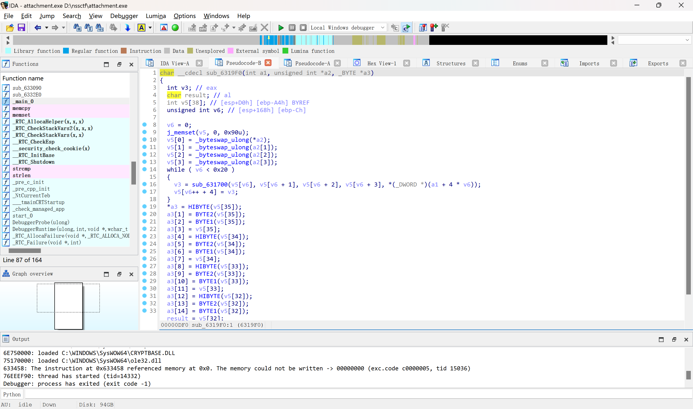

动调跟进

大小写，取出第一次变表 abcdefghijklmnopqrstuvwxyzABCDEFGHIJKLMNOPQRSTUVWXYZ0123456789+/

AddVectoredExceptionHandler(0, Handler); API，异常处理函数注册了VEH（向量化异常处理器）

继续调试这里触发内存写异常

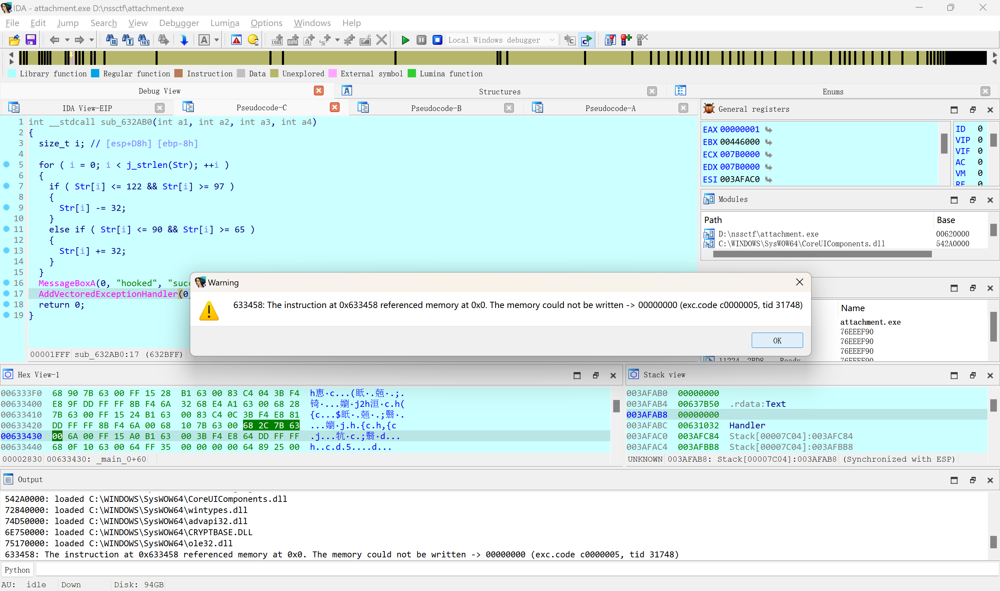

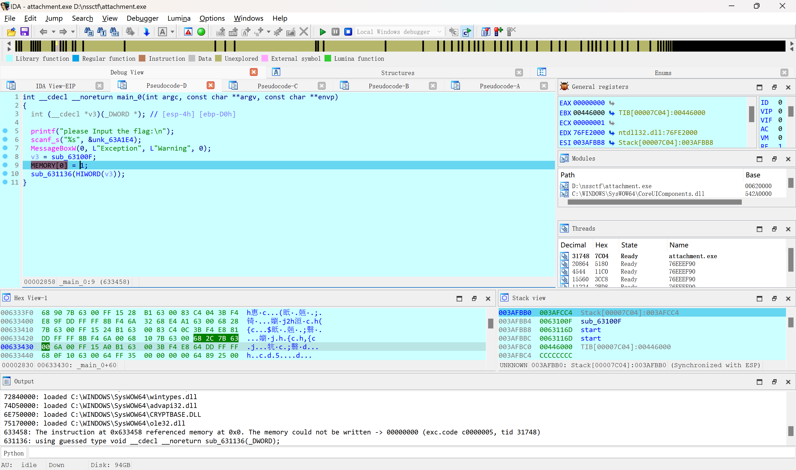

内存写异常后会调用VEH，进入了Handler\_0，

SetUnhandledExceptionFilter(TopLevelExceptionFilter); API,异常处理函数注册了UEH（顶层异常处理器）

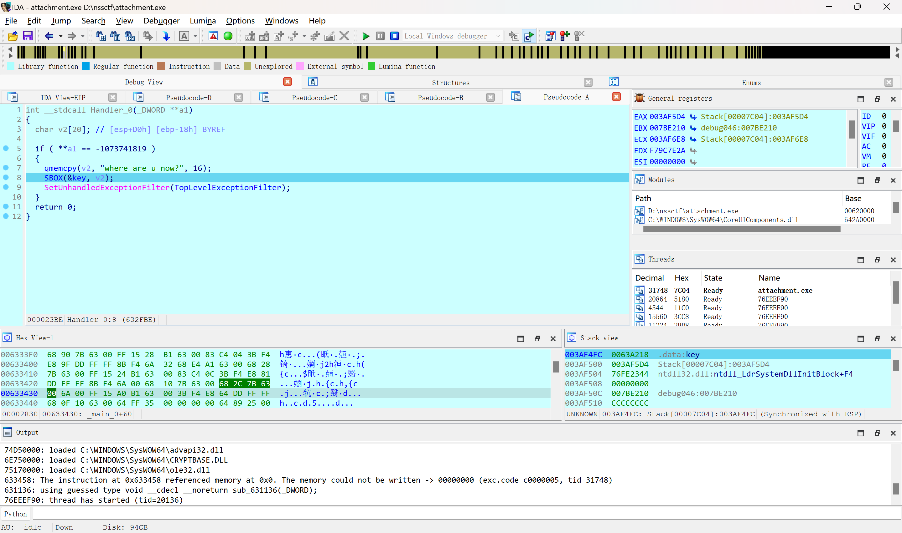

步入SetUnhandledExceptionFilter， 有未处理的异常

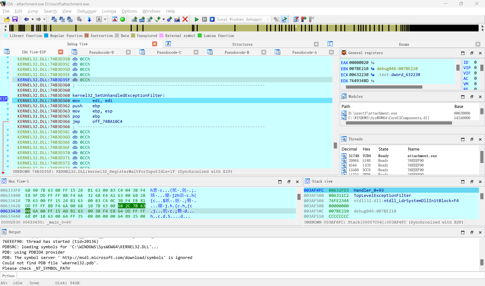

进入SM4加密 SEH （SEH是线程局部的，同时存在于内核层和用户层）

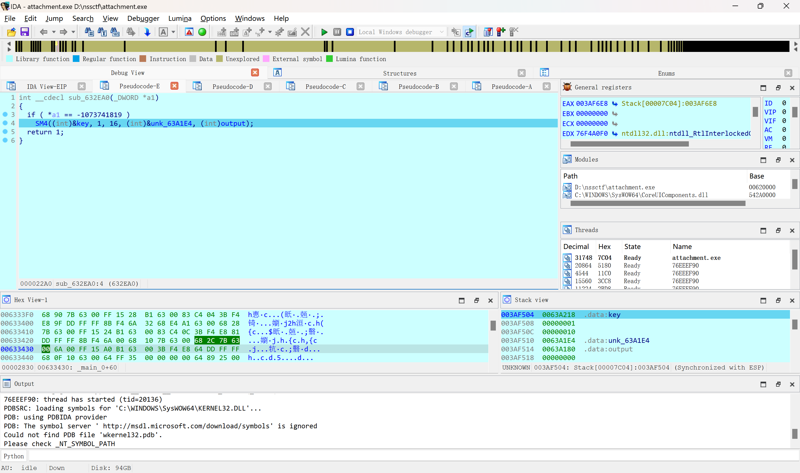

返回到正常流程，继续触发异常

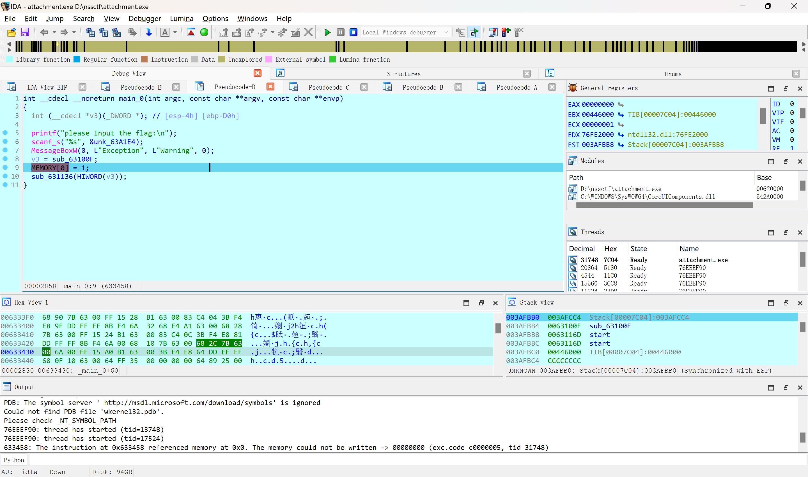

调试终止

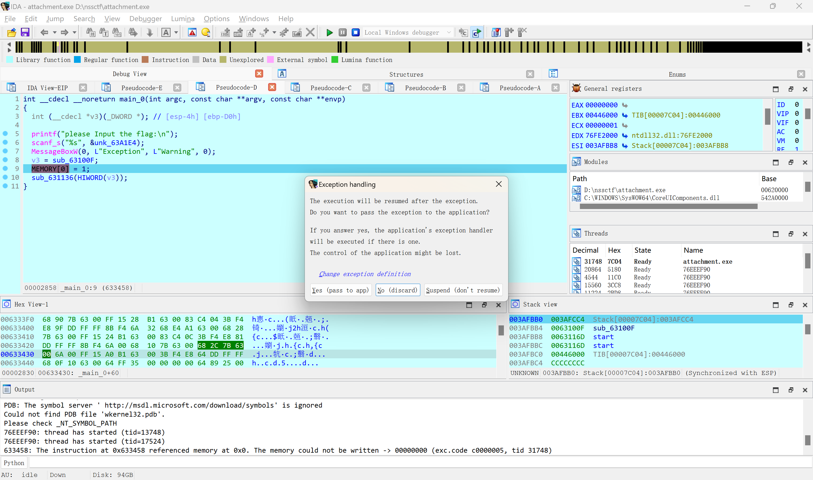

异常未被处理会继续调用UEH（顶层异常处理器），但是UEH作为最后的异常处理手段，在调试状态下不触发。所以当程序处于被调试状态时，不会调用UEH。进入不了TopLevelExceptionFilter，反调试。已经不重要了

通过之前静态分析可知最后TopLevelExceptionFilter是

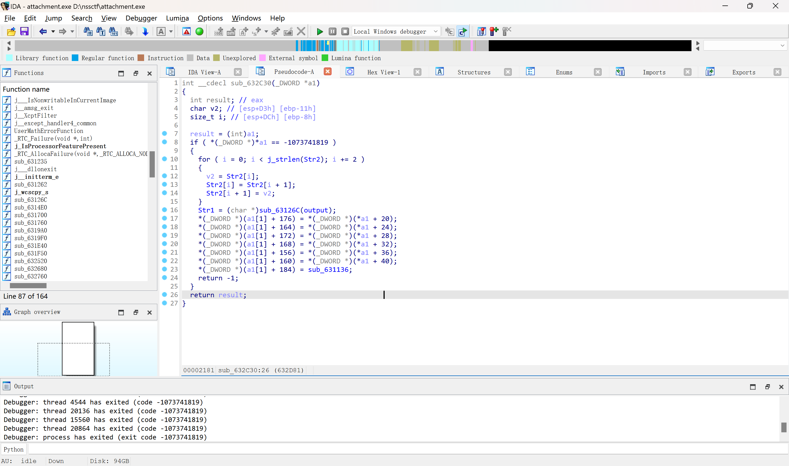

把SM4的加密输出进行base变种编码

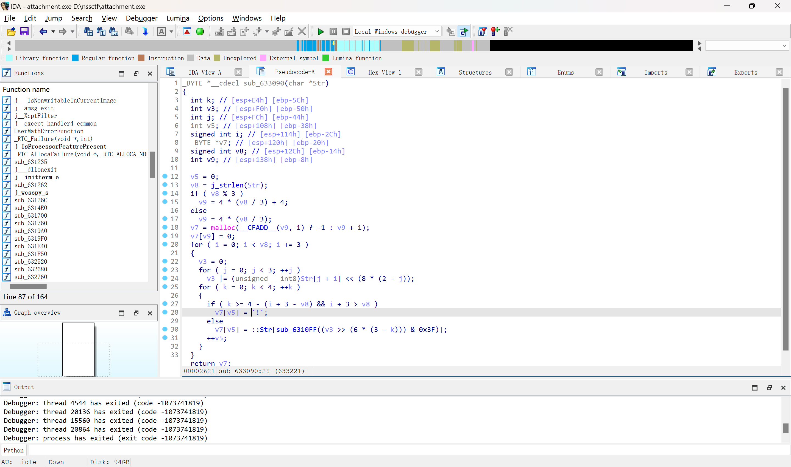

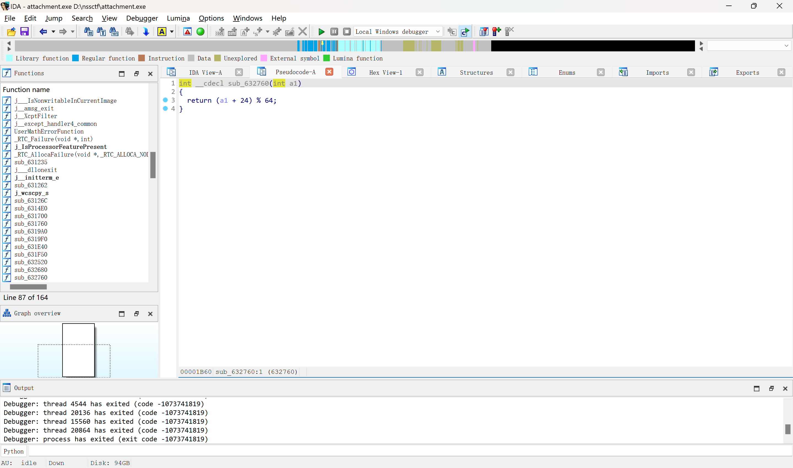

那么正确的表应该是yzABCDEFGHIJKLMNOPQRSTUVWXYZ0123456789+/abcdefghijklmnopqrstuvwx

通过修改ip，让程序进入TopLevelExceptionFilter跑出变了的str2 1ATIOpkOyWSvGm/YOYFR4!!

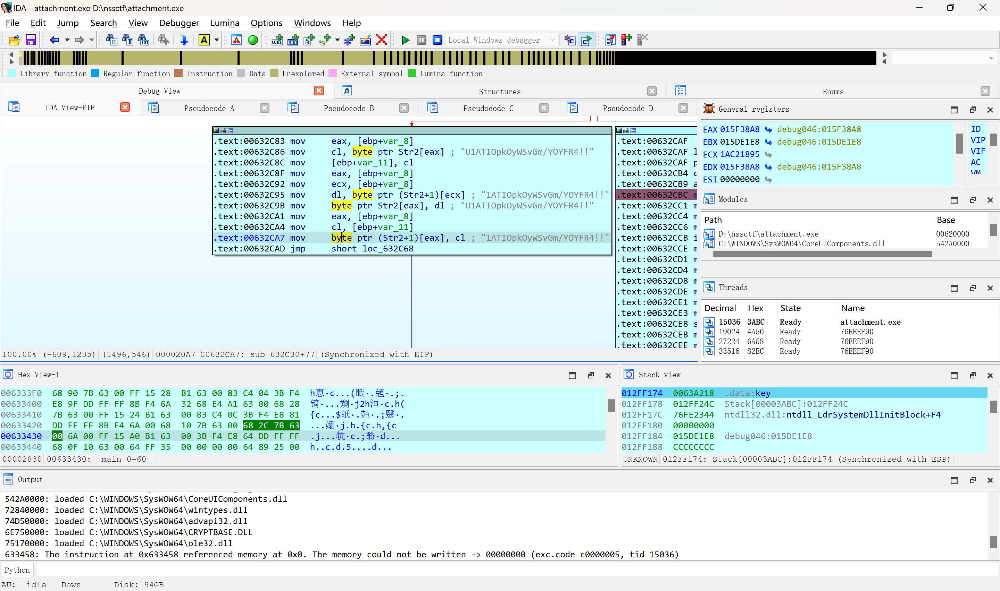

大小写->BOX->SM4->BASE->比较，很清楚了

最后用工具梭哈~~

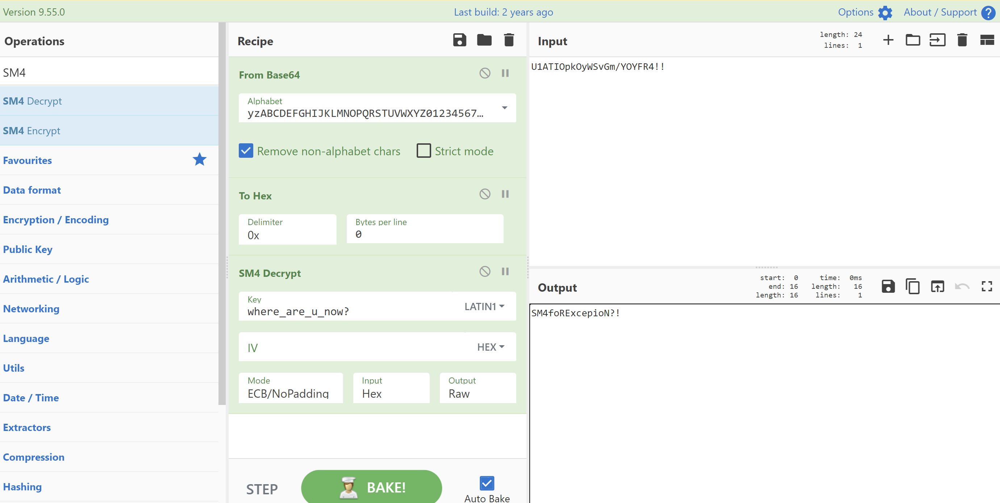
