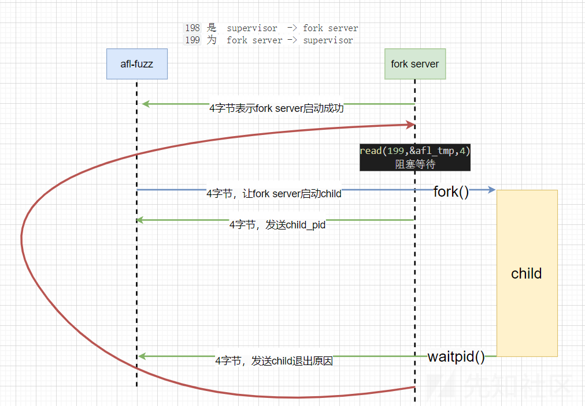
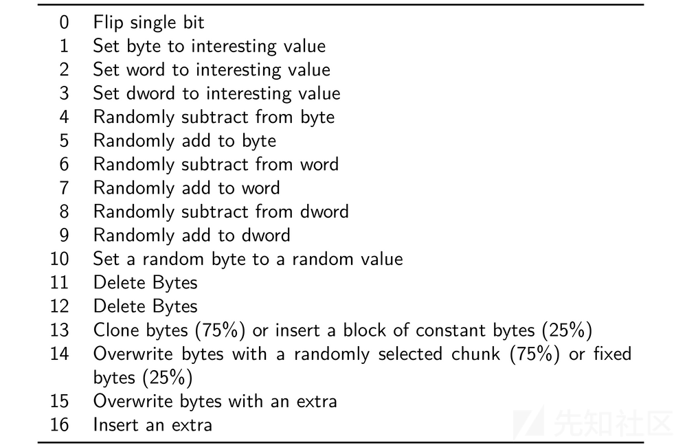

# AFL源码学习(三)-先知社区

> **来源**: https://xz.aliyun.com/news/16975  
> **文章ID**: 16975

---

# AFL源码学习(三)

## 前言

我们之前分析了AFL的编译和插桩代码。了解了基本的覆盖率实现，还阅读了`afl-tmin.c`了解了种子的一个优化策略,`afl-showmap`显示命中的功能,`afl-analyze`文件格式判断，也能对`fuzz`过程中有一个大致的了解，并且熟悉`share_shm`的作用以及使用。`fuzzer`的正常运行时的情况，存在三个进程`fuzzer、fork server、child`。`child`负责执行探测目标程序，由插桩代码`fork`出来。这篇来分析学习`afl-fuzz`。


#### 注释附件：

[mowenroot/Kernel/AFL-2.57b-mowen注释版](https://github.com/mowenroot/Kernel/tree/master/AFL-2.57b-mowen注释版)

## main 函数

main函数先会进行随机化种子，然后进行`argv`参数的处理。

```
int main(int argc, char** argv) {

  s32 opt;
  u64 prev_queued = 0;
  u32 sync_interval_cnt = 0, seek_to;
  u8  *extras_dir = 0;
  u8  mem_limit_given = 0;
  u8  exit_1 = !!getenv("AFL_BENCH_JUST_ONE");
  char** use_argv;

  struct timeval tv;
  struct timezone tz;

  SAYF(cCYA "afl-fuzz " cBRI VERSION cRST " by <lcamtuf@google.com>
");

  doc_path = access(DOC_PATH, F_OK) ? "docs" : DOC_PATH;

  gettimeofday(&tv, &tz);
  srandom(tv.tv_sec ^ tv.tv_usec ^ getpid());
  //argv处理
  while ((opt = getopt(argc, argv, "+i:o:f:m:t:T:dnCB:S:M:x:Q")) > 0)

    switch (opt) {

      case 'i': /* input dir */
        //初始输入文件
        if (in_dir) FATAL("Multiple -i options not supported");
        in_dir = optarg;
        //如果使用 '-i -'  则为resume
        if (!strcmp(in_dir, "-")) in_place_resume = 1;

        break;

      case 'o': /* output dir */
        //输出目录
        if (out_dir) FATAL("Multiple -o options not supported");
        out_dir = optarg;
        break;

      case 'M': { /* master sync ID */
          //master 
          u8* c;

          if (sync_id) FATAL("Multiple -S or -M options not supported");
          sync_id = ck_strdup(optarg);

          if ((c = strchr(sync_id, ':'))) {

            *c = 0;

            if (sscanf(c + 1, "%u/%u", &master_id, &master_max) != 2 ||
                !master_id || !master_max || master_id > master_max ||
                master_max > 1000000) FATAL("Bogus master ID passed to -M");

          }

          force_deterministic = 1;

        }

        break;

      case 'S': 
        //slave 
        if (sync_id) FATAL("Multiple -S or -M options not supported");
        sync_id = ck_strdup(optarg);
        break;

      case 'f': /* target file */
        //指定目标读取的input文件
        if (out_file) FATAL("Multiple -f options not supported");
        out_file = optarg;
        break;

      case 'x': /* dictionary */
        /* 字典目录 */
        if (extras_dir) FATAL("Multiple -x options not supported");
        extras_dir = optarg;
        break;

      case 't': { /* timeout */
          /* 超时时间 */
          u8 suffix = 0;

          if (timeout_given) FATAL("Multiple -t options not supported");

          if (sscanf(optarg, "%u%c", &exec_tmout, &suffix) < 1 ||
              optarg[0] == '-') FATAL("Bad syntax used for -t");

          if (exec_tmout < 5) FATAL("Dangerously low value of -t");

          if (suffix == '+') timeout_given = 2; else timeout_given = 1;

          break;

      }

      case 'm': { /* mem limit */
          /* 内存限制 */
          u8 suffix = 'M';

          if (mem_limit_given) FATAL("Multiple -m options not supported");
          mem_limit_given = 1;

          if (!strcmp(optarg, "none")) {

            mem_limit = 0;
            break;

          }

          if (sscanf(optarg, "%llu%c", &mem_limit, &suffix) < 1 ||
              optarg[0] == '-') FATAL("Bad syntax used for -m");

          switch (suffix) {

            case 'T': mem_limit *= 1024 * 1024; break;
            case 'G': mem_limit *= 1024; break;
            case 'k': mem_limit /= 1024; break;
            case 'M': break;

            default:  FATAL("Unsupported suffix or bad syntax for -m");

          }

          if (mem_limit < 5) FATAL("Dangerously low value of -m");

          if (sizeof(rlim_t) == 4 && mem_limit > 2000)
            FATAL("Value of -m out of range on 32-bit systems");

        }

        break;

      case 'd': /* skip deterministic */
      /* 跳过确定性变异 */
        if (skip_deterministic) FATAL("Multiple -d options not supported");
        skip_deterministic = 1;
        use_splicing = 1;
        break;

      case 'B': /* load bitmap */
        /* 加载bitmap ,只关心shm中特定的位置 */
        /* This is a secret undocumented option! It is useful if you find
           an interesting test case during a normal fuzzing process, and want
           to mutate it without rediscovering any of the test cases already
           found during an earlier run.

           To use this mode, you need to point -B to the fuzz_bitmap produced
           by an earlier run for the exact same binary... and that's it.

           I only used this once or twice to get variants of a particular
           file, so I'm not making this an official setting. */

        if (in_bitmap) FATAL("Multiple -B options not supported");

        in_bitmap = optarg;
        read_bitmap(in_bitmap);
        break;

      case 'C': /* crash mode */
        // 打开 crash exploration 模式
        if (crash_mode) FATAL("Multiple -C options not supported");
        crash_mode = FAULT_CRASH;
        break;

      case 'n': /* dumb mode */
        // 黑盒模式 不插桩
        if (dumb_mode) FATAL("Multiple -n options not supported");
        if (getenv("AFL_DUMB_FORKSRV")) dumb_mode = 2; else dumb_mode = 1;

        break;

      case 'T': /* banner */

        if (use_banner) FATAL("Multiple -T options not supported");
        use_banner = optarg;
        break;

      case 'Q': /* QEMU mode */

        if (qemu_mode) FATAL("Multiple -Q options not supported");
        qemu_mode = 1;

        if (!mem_limit_given) mem_limit = MEM_LIMIT_QEMU;

        break;

      default:

        usage(argv[0]);

    }
```

分析输入参数菜单如下。

```
  /* 命令行参数菜单:
   * -i dir     : 初始语料库目录
   * -o dir     : 输出结果目录
   * -M id      : master节点ID,用于并行fuzzing,可指定master_id/master_max格式
   * -S id      : slave节点ID,用于并行fuzzing
   * -f file    : 目标程序读取的文件路径
   * -x dir     : 字典文件目录
   * -t msec    : 执行超时时间(毫秒),最小5ms,后缀+表示跳过超时
   * -m megs    : 内存限制(MB),支持后缀T/G/M/k,最小5MB,none表示无限制
   * -d         : 跳过确定性变异阶段,启用splicing
   * -B file    : 导入覆盖率信息文件
   * -C         : 崩溃测试模式
   * -n         : 不使用插桩的模式
   * -T text    : 自定义banner文本
   * -Q         : QEMU模式,默认内存限制为200MB
   */
```

接下来会为`fuzz`的循环做初始化工作,先看个大致流程稍后进行详细分析。

```
 /* 初始化信号处理 */
  setup_signal_handlers();
  check_asan_opts();

  if (sync_id) fix_up_sync();

  /* 检查输入输出目录不能相同 */
  if (!strcmp(in_dir, out_dir))
    FATAL("Input and output directories can't be the same");

  /* dumb模式相关检查 */
  if (dumb_mode) {
    if (crash_mode) FATAL("-C and -n are mutually exclusive");
    if (qemu_mode)  FATAL("-Q and -n are mutually exclusive");
  }

  /* 处理环境变量 */
  if (getenv("AFL_NO_FORKSRV"))    no_forkserver    = 1;
  if (getenv("AFL_NO_CPU_RED"))    no_cpu_meter_red = 1;
  if (getenv("AFL_NO_ARITH"))      no_arith         = 1;
  if (getenv("AFL_SHUFFLE_QUEUE")) shuffle_queue    = 1;
  if (getenv("AFL_FAST_CAL"))      fast_cal         = 1;

  if (getenv("AFL_HANG_TMOUT")) {
    hang_tmout = atoi(getenv("AFL_HANG_TMOUT"));
    if (!hang_tmout) FATAL("Invalid value of AFL_HANG_TMOUT");
  }

  /* dumb模式和no_forkserver不能同时使用 */
  if (dumb_mode == 2 && no_forkserver)
    FATAL("AFL_DUMB_FORKSRV and AFL_NO_FORKSRV are mutually exclusive");

  /* 设置预加载库 */
  if (getenv("AFL_PRELOAD")) {
    setenv("LD_PRELOAD", getenv("AFL_PRELOAD"), 1);
    setenv("DYLD_INSERT_LIBRARIES", getenv("AFL_PRELOAD"), 1);
  }

  if (getenv("AFL_LD_PRELOAD"))
    FATAL("Use AFL_PRELOAD instead of AFL_LD_PRELOAD");

  /* 保存命令行参数 */
  save_cmdline(argc, argv);

  /* 初始化各种设置 */
  fix_up_banner(argv[optind]);
  check_if_tty();
  get_core_count();

#ifdef HAVE_AFFINITY
  bind_to_free_cpu();
#endif /* HAVE_AFFINITY */

  check_crash_handling();
  check_cpu_governor();

  /* 设置共享内存等 */
  setup_post();
  setup_shm();
  init_count_class16();

  /* 设置目录和文件描述符 */
  setup_dirs_fds();
  read_testcases();
  load_auto();

  pivot_inputs();

  /* 加载额外输入 */
  if (extras_dir) load_extras(extras_dir);

  /* 如果没有指定超时时间,则自动查找 */
  if (!timeout_given) find_timeout();

  detect_file_args(argv + optind + 1);

  if (!out_file) setup_stdio_file();

  check_binary(argv[optind]);

  /* 记录开始时间 */
  start_time = get_cur_time();

  /* 准备命令行参数 */
  if (qemu_mode)
    use_argv = get_qemu_argv(argv[0], argv + optind, argc - optind);
  else
    use_argv = argv + optind;

  /* 执行dry run */
  perform_dry_run(use_argv);

  cull_queue();

  show_init_stats();

  seek_to = find_start_position();

  write_stats_file(0, 0, 0);
  save_auto();

  if (stop_soon) goto stop_fuzzing;

  /* 如果在终端运行,等待4秒 */
  if (!not_on_tty) {
    sleep(4);
    start_time += 4000;
    if (stop_soon) goto stop_fuzzing;
  }

  /* 主fuzzing循环 */
```

`signal`信号设置:

`SIGHUP、SIGINT、SIGTERM`：交给`handle_stop_sig()`处理,会设置`stop_soon`为1(要求fuzzer尽早退出),并关闭`fork server` 和`child`。

`SIGALRM`：交给`handle_timeout()`处理，如果`child`还在运行就表示已经超时，需要关闭它。`child`没在运行则表示管道通讯超时，需要关闭`fork server`。

`SIGWINCH`:UI显示的警告。

`SIGUSR1`:全局变量`skip_requested`设置为`1`，用户发送这个信号来控制跳过对当前样例的变异。

```
  // 设置信号
  setup_signal_handlers();
  
EXP_ST void setup_signal_handlers(void) {
  //...
  /* 设置终止相关的信号处理
     SIGHUP(挂起)、SIGINT(中断)、SIGTERM(终止) 交给handle_stop_sig处理 */
  sa.sa_handler = handle_stop_sig;
  sigaction(SIGHUP, &sa, NULL);
  sigaction(SIGINT, &sa, NULL);
  sigaction(SIGTERM, &sa, NULL);

  /* 设置超时信号SIGALRM的处理函数为handle_timeout
     用于处理执行超时的情况 */
  sa.sa_handler = handle_timeout;
  sigaction(SIGALRM, &sa, NULL);

  /* 设置窗口大小改变信号SIGWINCH的处理函数为handle_resize
     用于响应终端窗口大小变化 */
  sa.sa_handler = handle_resize;
  sigaction(SIGWINCH, &sa, NULL);

  /* 设置SIGUSR1信号的处理函数为handle_skipreq
     用于处理跳过当前测试用例的请求 */
  sa.sa_handler = handle_skipreq;
  sigaction(SIGUSR1, &sa, NULL);

  /* 
     - SIGTSTP: 终端停止信号
     - SIGPIPE: 管道破裂信号
     这些信号对fuzzing过程没有影响,直接忽略即可 */
  sa.sa_handler = SIG_IGN;
  sigaction(SIGTSTP, &sa, NULL);
  sigaction(SIGPIPE, &sa, NULL);

}
```

接下来会调用`check_asan_opts()`来检查`ASAN`和`MSAN`的配置选项是否正确设置。

ASAN(AddressSanitizer)是一个内存错误检测工具,需要以下设置:

* abort\_on\_error=1: 发现错误时立即终止程序
* symbolize=0: 禁用符号化,避免干扰AFL的崩溃检测

MSAN(MemorySanitizer)是一个未初始化内存使用检测工具,需要以下设置:

* exit\_code=MSAN\_ERROR: 使用指定的退出码
* symbolize=0: 同样禁用符号化

```
 /* 
    检查ASAN和MSAN的配置选项是否正确设置
 */
static void check_asan_opts(void) {
  /* 获取ASAN_OPTIONS环境变量 */
  u8* x = getenv("ASAN_OPTIONS");

  if (x) {
    /* 检查是否设置了abort_on_error=1 */
    if (!strstr(x, "abort_on_error=1"))
      FATAL("Custom ASAN_OPTIONS set without abort_on_error=1 - please fix!");

    /* 检查是否设置了symbolize=0 */
    if (!strstr(x, "symbolize=0"))
      FATAL("Custom ASAN_OPTIONS set without symbolize=0 - please fix!");
  }

  /* 获取MSAN_OPTIONS环境变量 */
  x = getenv("MSAN_OPTIONS");

  if (x) {
    /* 检查是否设置了正确的exit_code */
    if (!strstr(x, "exit_code=" STRINGIFY(MSAN_ERROR)))
      FATAL("Custom MSAN_OPTIONS set without exit_code="
            STRINGIFY(MSAN_ERROR) " - please fix!");

    /* 检查是否设置了symbolize=0 */
    if (!strstr(x, "symbolize=0"))
      FATAL("Custom MSAN_OPTIONS set without symbolize=0 - please fix!");
  }
} 
```

如果是并行模式(-S -M)则会检查`sync_id`是否合法，并会设置 `sync_dir` 和 `out_dir`。

在并行模式下`sync_dir`是工作目录，`out_dir`是工作目录下以 `sync_id` 为名的子文件夹。

在非并行模式下，直接`"-o out_dir"`，就能提供工作目录。

```
  if (sync_id) fix_up_sync();

  if (!strcmp(in_dir, out_dir))
    FATAL("Input and output directories can't be the same");

  if (dumb_mode) {

    if (crash_mode) FATAL("-C and -n are mutually exclusive");
    if (qemu_mode)  FATAL("-Q and -n are mutually exclusive");

  }

```

然后会进行环境变量的设置并做一些零碎的初始化,需要注意的是，`dumb`模式和`no_forkserver`不能同时使用。如果需要添加`LD_PRELOAD`，就需要使用`AFL_PRELOAD`。

```
/* 处理环境变量 */
  if (getenv("AFL_NO_FORKSRV"))    no_forkserver    = 1;
  if (getenv("AFL_NO_CPU_RED"))    no_cpu_meter_red = 1;
  if (getenv("AFL_NO_ARITH"))      no_arith         = 1;
  if (getenv("AFL_SHUFFLE_QUEUE")) shuffle_queue    = 1;
  if (getenv("AFL_FAST_CAL"))      fast_cal         = 1;

  if (getenv("AFL_HANG_TMOUT")) {
    hang_tmout = atoi(getenv("AFL_HANG_TMOUT"));
    if (!hang_tmout) FATAL("Invalid value of AFL_HANG_TMOUT");
  }

  /* dumb模式和no_forkserver不能同时使用 */
  if (dumb_mode == 2 && no_forkserver)
    FATAL("AFL_DUMB_FORKSRV and AFL_NO_FORKSRV are mutually exclusive");

  /* 设置预加载库 */
  if (getenv("AFL_PRELOAD")) {
    setenv("LD_PRELOAD", getenv("AFL_PRELOAD"), 1);
    setenv("DYLD_INSERT_LIBRARIES", getenv("AFL_PRELOAD"), 1);
  }

  if (getenv("AFL_LD_PRELOAD"))
    FATAL("Use AFL_PRELOAD instead of AFL_LD_PRELOAD");
  /* 保存命令行参数 */
  save_cmdline(argc, argv);

  /* 初始化各种设置 */
  fix_up_banner(argv[optind]);
  check_if_tty();
```

接下来对`cpu`调整,`linux`下会`bind cpu`，并且检查一些配置，然后喷你，让你用`cpu`最高频率(`performance`模式)。

```
 /* 获取系统CPU核心数量，用于后续的CPU绑定和负载均衡 */
  get_core_count();

#ifdef HAVE_AFFINITY
  bind_to_free_cpu(); 
#endif /* HAVE_AFFINITY */

  /* 检查系统的崩溃处理机制
     确保:
     1. core dump正确配置
     2. ASLR(地址空间随机化)已启用
     3. 其他安全机制正常工作 */
  check_crash_handling();

  /* 检查CPU频率调节器(governor)设置
     推荐使用performance模式而不是powersave模式 */
  check_cpu_governor();
```

然后调用 `setup_post()`,这个函数会根据你是否设置了`AFL_POST_LIBRARY`，如果设置了使用`dlopen`挂载，并设置符号`afl_postprocess`指向这个lib中的`post_handler`函数。

```
  setup_post();
  static void setup_post(void) {

  void* dh;
  u8* fn = getenv("AFL_POST_LIBRARY");
  u32 tlen = 6;

  if (!fn) return;

  ACTF("Loading postprocessor from '%s'...", fn);

  dh = dlopen(fn, RTLD_NOW);
  if (!dh) FATAL("%s", dlerror());

  post_handler = dlsym(dh, "afl_postprocess");
  if (!post_handler) FATAL("Symbol 'afl_postprocess' not found.");

  /* Do a quick test. It's better to segfault now than later =) */

  post_handler("hello", &tlen);

  OKF("Postprocessor installed successfully.");

}
```

> `post_handler` 的签名是 `u8* post_handler(u8* data, u32* len)`。  
> 在 fuzzer 变异出一个新的用例、即将交给目标程序执行时，这个函数会被调用。所以，假如用户想要对 AFL 变异出的用例进行操作——例如将其记录到数据库中——就可以通过不修改 AFL 源码的方式实现。用户只需写一个 `post_handler`，编译成动态链接库，通过 `AFL_POST_LIBRARY` 告知 AFL。

然后进行共享内存的初始化工作,`setup_shm()`和之前的差不多，初始化`share_shm`，这里使用2字节(16bit)，之前是单字节(8bit)的，一个牛掰的优化操作。

```
  setup_shm();
  init_count_class16();
```

接下来对文件的一些操作。先会创建一些之后要使用的目录(`queue`等)，并打开一些**fd**(`/dev/null`)备用。文件创建好了之后，会把测试用例读取到`queue`中，测试样例呈链表，白皮书中说`AFL`运行过程中会自动找到一些 `extra token`（也可以直接用 `-x` 选项提供 `dictionary`），上面的代码把这些 `extra token` 都读进来。然后读取自动生成的`extra`，再把初始的输入(`-i 指定的文件`)复制到`queue`文件夹下。

```
  /* 设置输出目录和文件描述符
      创建输出目录结构(queue/crashes/hangs等)
  */
  setup_dirs_fds();

  /* 读取初始测试用例
     1. 从输入目录加载种子文件
     2. 检查文件大小和格式
     3. 将有效的测试用例添加到队列 */
  read_testcases();

  /* 读入自动生成的 extra */
  load_auto();

  /* 把初始 corpus 复制到工作目录的 queue 文件夹下 */
  pivot_inputs();

  /* -x 手动导入 extra */
  if (extras_dir) load_extras(extras_dir);

  /* 如果没有指定超时时间,则自动查找 */
  if (!timeout_given) find_timeout();
```

继续会工作目录下创建`.cur_input`文件，并把`fd`存储到全局变量`out_fd`中。在fuzz过程中，AFL会把变异出来样例写入到这个文件中，供`child`读取这个文件，这个时候初始化工作基本都完成，会调用`perform_dry_run()`进行一次`dry run`。

```
   detect_file_args(argv + optind + 1);

  /* 如果没有指定输出文件,则设置标准输入/输出 */
  if (!out_file) setup_stdio_file();

  /* 检查目标二进制文件
     - 验证文件是否存在且可执行
     - 检查是否为32位/64位ELF
     - 检查是否包含AFL插桩代码 */
  check_binary(argv[optind]);

  /* 记录fuzzing开始时间 */
  start_time = get_cur_time();

  if (qemu_mode)
    use_argv = get_qemu_argv(argv[0], argv + optind, argc - optind);
  else
    use_argv = argv + optind;

  /* 执行 dry run测试 */
  perform_dry_run(use_argv);
```

然后调用 `cull_queue` 精简队列。会给 `queue` 中的用例打分(首先查看`top_rated[]`条目，然后依次为先前未见过的字节（`temp_v`）标记为首选，分为青睐，直到下次启动时)。显示`UI`信息和 `fuzzer_stats` 文件，并确定`fuzzing`的起始位置，之后开始`fuzzing`的主要部分。

```
  cull_queue();

  show_init_stats();//显示ui
    /* 确定fuzzing的起始位置:
     - 如果是恢复之前的会话,找到上次停止的位置
     - 如果是新会话,从队列头开始
     - 返回需要跳过的测试用例数量 */
  seek_to = find_start_position();

  write_stats_file(0, 0, 0);
  save_auto();//保存extras

  if (stop_soon) goto stop_fuzzing;

  /* 如果在终端运行,等待4秒 */
  if (!not_on_tty) {
    sleep(4);
    start_time += 4000;
    if (stop_soon) goto stop_fuzzing;
  }

  /* 主fuzzing循环 */
```

主要主循环部分过会再看，先分析初始化工作几个比较重要的函数。

### perform\_dry\_run函数

在`afl-fuzz`中的`dry run`会和之前的不同，会把`queue`队列中的用例全部测试一遍，并且使用`calibrate_case(校准用例)`，暂且不关注返回结果以及输出，这不是我们关注的重点。但是需要注意第一次执行测试用例的时候会调用`check_map_coverage()`检查覆盖率是否均匀。在执行完所有用例的校准之后，若存在校准失败的用例，则向用户报告情况。

```
/* Perform dry run of all test cases to confirm that the app is working as
   expected. This is done only for the initial inputs, and only once. */

static void perform_dry_run(char** argv) {

  struct queue_entry* q = queue;
  u32 cal_failures = 0;
  u8* skip_crashes = getenv("AFL_SKIP_CRASHES");
  //循环队列
  while (q) {

    u8* use_mem;
    u8  res;
    s32 fd;
    //获取测试文件名
    u8* fn = strrchr(q->fname, '/') + 1;

    ACTF("Attempting dry run with '%s'...", fn);
    //打开测试文件
    fd = open(q->fname, O_RDONLY);
    if (fd < 0) PFATAL("Unable to open '%s'", q->fname);
    //开辟临时空间
    use_mem = ck_alloc_nozero(q->len);
    //读取测试文件中的数据
    if (read(fd, use_mem, q->len) != q->len)
      FATAL("Short read from '%s'", q->fname);

    close(fd);
    //校准测试用例
    res = calibrate_case(argv, q, use_mem, 0, 1);
    ck_free(use_mem);

    if (stop_soon) return;
    //如果是崩溃模式或者没有新的覆盖
    if (res == crash_mode || res == FAULT_NOBITS)
      SAYF(cGRA "    len = %u, map size = %u, exec speed = %llu us
" cRST, 
           q->len, q->bitmap_size, q->exec_us);

    switch (res) {
      //用例正常
      case FAULT_NONE:
        /*
          如果是第一次测试用例，检查覆盖率
          如果命中边>100次，但是[1<<15,65536)区间未被击,说明id分布不均匀需要重新编译
        */
        if (q == queue) check_map_coverage();

        if (crash_mode) FATAL("Test case '%s' does *NOT* crash", fn);

        break;

    //...

    }

    if (q->var_behavior) WARNF("Instrumentation output varies across runs.");

    q = q->next;

  }
  //校准失败情况
  if (cal_failures) {
    //全部失败
    if (cal_failures == queued_paths)
      FATAL("All test cases time out%s, giving up!",
            skip_crashes ? " or crash" : "");

    WARNF("Skipped %u test cases (%0.02f%%) due to timeouts%s.", cal_failures,
          ((double)cal_failures) * 100 / queued_paths,
          skip_crashes ? " or crashes" : "");
    //大于警告
    if (cal_failures * 5 > queued_paths)
      WARNF(cLRD "High percentage of rejected test cases, check settings!");

  }

  OKF("All test cases processed.");

}
```

### calibrate\_case函数

`queue`用例队列更新的时候就会调用`calibrate_case()`来校准用例，大体情况分为两种：

* 程序初始化的时候，校准导入的种子
* 发现新的路径，将用例添加到`queue`的时候。

```
/* Calibrate a new test case. This is done when processing the input directory
   to warn about flaky or otherwise problematic test cases early on; and when
   new paths are discovered to detect variable behavior and so on. */
static u8 calibrate_case(char** argv, struct queue_entry* q, u8* use_mem,
                         u32 handicap, u8 from_queue) {

  static u8 first_trace[MAP_SIZE];

  u8  fault = 0, new_bits = 0, var_detected = 0, hnb = 0,
      first_run = (q->exec_cksum == 0);

  u64 start_us, stop_us;

  s32 old_sc = stage_cur, old_sm = stage_max;
  u32 use_tmout = exec_tmout;
  u8* old_sn = stage_name;

  /* Be a bit more generous about timeouts when resuming sessions, or when
     trying to calibrate already-added finds. This helps avoid trouble due
     to intermittent latency. */

  if (!from_queue || resuming_fuzz)
    use_tmout = MAX(exec_tmout + CAL_TMOUT_ADD,
                    exec_tmout * CAL_TMOUT_PERC / 100);

  q->cal_failed++;

  stage_name = "calibration";
  stage_max  = fast_cal ? 3 : CAL_CYCLES;

  /* Make sure the forkserver is up before we do anything, and let's not
     count its spin-up time toward binary calibration. */
  //初始化forkserver
  if (dumb_mode != 1 && !no_forkserver && !forksrv_pid)
    init_forkserver(argv);
  
  if (q->exec_cksum) {
    //如果测试用例已经执行过，拷贝trace_bits到first_trace
    memcpy(first_trace, trace_bits, MAP_SIZE);
    /*
    has_new_bits -> 
      1 = 仅 hit count 更新
      2 = 出现了新的边
    */
    hnb = has_new_bits(virgin_bits);
    if (hnb > new_bits) new_bits = hnb;

  }
  //获取初始时间，后面用来计算执行时间
  start_us = get_cur_time_us();
  //循环测试8次，快速模式下测试3次
  for (stage_cur = 0; stage_cur < stage_max; stage_cur++) {

    u32 cksum;

    if (!first_run && !(stage_cur % stats_update_freq)) show_stats();
    //写入测试文件
    write_to_testcase(use_mem, q->len);
    //调用run_target来测试
    fault = run_target(argv, use_tmout);

    /* stop_soon is set by the handler for Ctrl+C. When it's pressed,
       we want to bail out quickly. */

    if (stop_soon || fault != crash_mode) goto abort_calibration;
    //没有插桩的模式(没有命中)
    if (!dumb_mode && !stage_cur && !count_bytes(trace_bits)) {
      fault = FAULT_NOINST;
      goto abort_calibration;
    }

    cksum = hash32(trace_bits, MAP_SIZE, HASH_CONST);

    if (q->exec_cksum != cksum) {

      hnb = has_new_bits(virgin_bits);
      if (hnb > new_bits) new_bits = hnb;
      //当前执行与之前的路径不一致
      if (q->exec_cksum) {

        u32 i;

        for (i = 0; i < MAP_SIZE; i++) {

          if (!var_bytes[i] && first_trace[i] != trace_bits[i]) {
            //记录不同的命中位置，并且提升测试用例次数到40次
            var_bytes[i] = 1;
            stage_max    = CAL_CYCLES_LONG;

          }

        }

        var_detected = 1;
      //第一次执行
      } else {

        q->exec_cksum = cksum;
        memcpy(first_trace, trace_bits, MAP_SIZE);

      }

    }

  }
  //更新队列测试用例的信息
  stop_us = get_cur_time_us();

  total_cal_us     += stop_us - start_us;
  total_cal_cycles += stage_max;

  /* OK, let's collect some stats about the performance of this test case.
     This is used for fuzzing air time calculations in calculate_score(). */

  q->exec_us     = (stop_us - start_us) / stage_max;
  q->bitmap_size = count_bytes(trace_bits);
  q->handicap    = handicap;
  q->cal_failed  = 0;

  total_bitmap_size += q->bitmap_size;
  total_bitmap_entries++;
  //测试用例打分
  update_bitmap_score(q);

  /* If this case didn't result in new output from the instrumentation, tell
     parent. This is a non-critical problem, but something to warn the user
     about. */
  //如果没有产生新的路径
  if (!dumb_mode && first_run && !fault && !new_bits) fault = FAULT_NOBITS;

abort_calibration:
  //new_bits==2 发现新边，更新has_new_cov
  if (new_bits == 2 && !q->has_new_cov) {
    q->has_new_cov = 1;
    queued_with_cov++;
  }

  /* Mark variable paths. */
  //路径执行不同的情况
  if (var_detected) {

    var_byte_count = count_bytes(var_bytes);

    /* 标记可变路径
       更新状态为 var_behavior
    */
    if (!q->var_behavior) {
      mark_as_variable(q);
      queued_variable++;
    }

  }
  //恢复还原
  stage_name = old_sn;
  stage_cur  = old_sc;
  stage_max  = old_sm;
  //ui更新
  if (!first_run) show_stats();

  return fault;

}
```

`calibrate_case()`主要做了一下工作：

* 如果`fork server`未准备好，则调用`init_forkserver()`初始化`fork server`。
* 循环多次调用`run_target()`来测试用例的命中路径。发现没有插桩会退出，如果发现新路径则将测试次数提升到40次。
* 更新用例信息之后，调用`update_bitmap_score()`对用例进行打分。

以上提到了三个重要的函数，现在先对这三个函数进行分析。

### init\_forkserver函数

之前分析 `main payload` 汇编中的 `fork server`的整个通讯图大致如下。



会先初始化管道，然后使用`fork`执行

子进程，初始化一些资源，让自己成为`fork server`：

* 设置内存限制，关闭`core`，
* 然后开启新的进程组、重定向流。
* 绑定管道文件描述符(`198` 是 supervisor -> fork server，`199`为 fork server -> supervisor)
* 关闭一些无用`fd`、设置`ASan`和`MSan`
* 开始执行程序、程序会在第一个节点停下，往`fd 199`中写入`4`字节的`hello`数据包，发送成功后，该程序会维护`fork server`，阻塞等待`supervisor`发来的指令。

主进程：绑定管道文件描述符、阻塞等待从`fork server`发送的数据、如果接收4字节成功直接返回，否则检查问题。

```
/* Spin up fork server (instrumented mode only). The idea is explained here:

   http://lcamtuf.blogspot.com/2014/10/fuzzing-binaries-without-execve.html

   In essence, the instrumentation allows us to skip execve(), and just keep
   cloning a stopped child. So, we just execute once, and then send commands
   through a pipe. The other part of this logic is in afl-as.h. */

EXP_ST void init_forkserver(char** argv) {

  static struct itimerval it;
  int st_pipe[2], ctl_pipe[2];
  int status;
  s32 rlen;

  ACTF("Spinning up the fork server...");
  //开启管道通信
  if (pipe(st_pipe) || pipe(ctl_pipe)) PFATAL("pipe() failed");

  forksrv_pid = fork();

  if (forksrv_pid < 0) PFATAL("fork() failed");

  if (!forksrv_pid) {
    //子进程
    struct rlimit r;

    /* Umpf. On OpenBSD, the default fd limit for root users is set to
       soft 128. Let's try to fix that... */

    if (!getrlimit(RLIMIT_NOFILE, &r) && r.rlim_cur < FORKSRV_FD + 2) {

      r.rlim_cur = FORKSRV_FD + 2;
      setrlimit(RLIMIT_NOFILE, &r); /* Ignore errors */

    }

    if (mem_limit) {

      r.rlim_max = r.rlim_cur = ((rlim_t)mem_limit) << 20;

#ifdef RLIMIT_AS

      setrlimit(RLIMIT_AS, &r); /* Ignore errors */

#else

      /* This takes care of OpenBSD, which doesn't have RLIMIT_AS, but
         according to reliable sources, RLIMIT_DATA covers anonymous
         maps - so we should be getting good protection against OOM bugs. */

      setrlimit(RLIMIT_DATA, &r); /* Ignore errors */

#endif /* ^RLIMIT_AS */


    }

    /* Dumping cores is slow and can lead to anomalies if SIGKILL is delivered
       before the dump is complete. */
 
    r.rlim_max = r.rlim_cur = 0;

    setrlimit(RLIMIT_CORE, &r); /* Ignore errors */

    /* Isolate the process and configure standard descriptors. If out_file is
       specified, stdin is /dev/null; otherwise, out_fd is cloned instead. */
    //开启新的进程
    setsid();
    //流重定向 stdout、stderr > /dev/null
    dup2(dev_null_fd, 1);
    dup2(dev_null_fd, 2);

    if (out_file) {
      //如果输出文件存在，stdin > /dev/null
      dup2(dev_null_fd, 0);

    } else {
      //如果输出文件不存在，stdin >  .cur_input 
      dup2(out_fd, 0);
      close(out_fd);
    }

    /* Set up control and status pipes, close the unneeded original fds. */
    /*  
      绑定198（读） -> ctl_pipe[0] 198 是 supervisor -> fork server 方向
      绑定199（写） -> st_pipe[1]  199 是 fork server -> supervisor 方向
    */
    if (dup2(ctl_pipe[0], FORKSRV_FD) < 0) PFATAL("dup2() failed");
    if (dup2(st_pipe[1], FORKSRV_FD + 1) < 0) PFATAL("dup2() failed");
    //关闭管道
    close(ctl_pipe[0]);
    close(ctl_pipe[1]);
    close(st_pipe[0]);
    close(st_pipe[1]);
    //关闭无用文件描述符
    close(out_dir_fd);
    close(dev_null_fd);
    close(dev_urandom_fd);
    close(fileno(plot_file));

    /* This should improve performance a bit, since it stops the linker from
       doing extra work post-fork(). */

    if (!getenv("LD_BIND_LAZY")) setenv("LD_BIND_NOW", "1", 0);

    /* Set sane defaults for ASAN if nothing else specified. */

    setenv("ASAN_OPTIONS", "abort_on_error=1:"
                           "detect_leaks=0:"
                           "symbolize=0:"
                           "allocator_may_return_null=1", 0);

    /* MSAN is tricky, because it doesn't support abort_on_error=1 at this
       point. So, we do this in a very hacky way. */

    setenv("MSAN_OPTIONS", "exit_code=" STRINGIFY(MSAN_ERROR) ":"
                           "symbolize=0:"
                           "abort_on_error=1:"
                           "allocator_may_return_null=1:"
                           "msan_track_origins=0", 0);
    //执行程序
    execv(target_path, argv);

    /* Use a distinctive bitmap signature to tell the parent about execv()
       falling through. */

    *(u32*)trace_bits = EXEC_FAIL_SIG;
    exit(0);

  }
  //主进程
  /* Close the unneeded endpoints. */
  //主进程不需要 ctl的读段，st的写端
  close(ctl_pipe[0]);
  close(st_pipe[1]);
  /*
    主进程 需要从写端读数据，读端写入数据
    198 是 supervisor -> fork server 方向
    199 是 fork server -> supervisor 方向
  */
  fsrv_ctl_fd = ctl_pipe[1];
  fsrv_st_fd  = st_pipe[0];

  /* Wait for the fork server to come up, but don't wait too long. */

  it.it_value.tv_sec = ((exec_tmout * FORK_WAIT_MULT) / 1000);
  it.it_value.tv_usec = ((exec_tmout * FORK_WAIT_MULT) % 1000) * 1000;

  setitimer(ITIMER_REAL, &it, NULL);
  /*
    读取4字节
    接收程序执行 fork server 发送来的数据
  */
  rlen = read(fsrv_st_fd, &status, 4);

  it.it_value.tv_sec = 0;
  it.it_value.tv_usec = 0;

  setitimer(ITIMER_REAL, &it, NULL);

  /* If we have a four-byte "hello" message from the server, we're all set.
     Otherwise, try to figure out what went wrong. */
  //如果接收为4字节说明没问题， fork server 成功启动
  if (rlen == 4) {
    OKF("All right - fork server is up.");
    return;
  }

  if (child_timed_out)
    FATAL("Timeout while initializing fork server (adjusting -t may help)");
  //等待子进程
  if (waitpid(forksrv_pid, &status, 0) <= 0)
    PFATAL("waitpid() failed");
  //判断状态
  if (WIFSIGNALED(status)) {
//...
  }

  FATAL("Fork server handshake failed");

}
```

### `run_target`函数

* 清空`trace_bits`
* 发送`4`字节，让`fork server`启动`child`
* 从`fork server`接收`4`字节，获取`child`的`pid`
* 再次从`fork server`接收`4`字节，判断退出原因
* 对`trace_bits`进行分桶操作
* 判断退出原因返回对应状态码

```
/* Execute target application, monitoring for timeouts. Return status
   information. The called program will update trace_bits[]. */

static u8 run_target(char** argv, u32 timeout) {

  static struct itimerval it;
  static u32 prev_timed_out = 0;
  static u64 exec_ms = 0;

  int status = 0;
  u32 tb4;

  child_timed_out = 0;

  /* After this memset, trace_bits[] are effectively volatile, so we
     must prevent any earlier operations from venturing into that
     territory. */

  memset(trace_bits, 0, MAP_SIZE);
  MEM_BARRIER();

  /* If we're running in "dumb" mode, we can't rely on the fork server
     logic compiled into the target program, so we will just keep calling
     execve(). There is a bit of code duplication between here and 
     init_forkserver(), but c'est la vie. */

  if (dumb_mode == 1 || no_forkserver) {
    //启动fork server...
  } else {
      /* 
       在非dumb模式下,fork server已经运行,
       只需要发送请求并读取返回的PID
      */
    s32 res;

    /* In non-dumb mode, we have the fork server up and running, so simply
       tell it to have at it, and then read back PID. */
    //让fork server 启动child
    if ((res = write(fsrv_ctl_fd, &prev_timed_out, 4)) != 4) {

      if (stop_soon) return 0;
      RPFATAL(res, "Unable to request new process from fork server (OOM?)");

    }
    //读取child_pid
    if ((res = read(fsrv_st_fd, &child_pid, 4)) != 4) {

      if (stop_soon) return 0;
      RPFATAL(res, "Unable to request new process from fork server (OOM?)");

    }

    if (child_pid <= 0) FATAL("Fork server is misbehaving (OOM?)");

  }

  /* Configure timeout, as requested by user, then wait for child to terminate. */

  it.it_value.tv_sec = (timeout / 1000);
  it.it_value.tv_usec = (timeout % 1000) * 1000;
  //定时器设置
  setitimer(ITIMER_REAL, &it, NULL);

  /* The SIGALRM handler simply kills the child_pid and sets child_timed_out. */

  if (dumb_mode == 1 || no_forkserver) {
    //等待子进程
    if (waitpid(child_pid, &status, 0) <= 0) PFATAL("waitpid() failed");

  } else {

    s32 res;
    //读取child的退出原因
    if ((res = read(fsrv_st_fd, &status, 4)) != 4) {

      if (stop_soon) return 0;
      RPFATAL(res, "Unable to communicate with fork server (OOM?)");

    }

  }

  if (!WIFSTOPPED(status)) child_pid = 0;

  getitimer(ITIMER_REAL, &it);
  exec_ms = (u64) timeout - (it.it_value.tv_sec * 1000 +
                             it.it_value.tv_usec / 1000);

  it.it_value.tv_sec = 0;
  it.it_value.tv_usec = 0;
  //取消定时器  
  setitimer(ITIMER_REAL, &it, NULL);

  total_execs++;

  /* Any subsequent operations on trace_bits must not be moved by the
     compiler below this point. Past this location, trace_bits[] behave
     very normally and do not have to be treated as volatile. */

  MEM_BARRIER();
//分桶
  tb4 = *(u32*)trace_bits;

#ifdef WORD_SIZE_64
  classify_counts((u64*)trace_bits);
#else
  classify_counts((u32*)trace_bits);
#endif /* ^WORD_SIZE_64 */

  prev_timed_out = child_timed_out;

  /* Report outcome to caller. */
  //非正常退出
  if (WIFSIGNALED(status) && !stop_soon) {

    kill_signal = WTERMSIG(status);
    //SIGKILL超时
    if (child_timed_out && kill_signal == SIGKILL) return FAULT_TMOUT;
    //返回crash
    return FAULT_CRASH;

  }

  /* A somewhat nasty hack for MSAN, which doesn't support abort_on_error and
     must use a special exit code. */
  //MSAN_ERROR 需要独立的crash
  if (uses_asan && WEXITSTATUS(status) == MSAN_ERROR) {
    kill_signal = 0;
    return FAULT_CRASH;
  }

  if ((dumb_mode == 1 || no_forkserver) && tb4 == EXEC_FAIL_SIG)
    return FAULT_ERROR;

  /* It makes sense to account for the slowest units only if the testcase was run
  under the user defined timeout. */
  if (!(timeout > exec_tmout) && (slowest_exec_ms < exec_ms)) {
    slowest_exec_ms = exec_ms;
  }

  return FAULT_NONE;

}
```

### update\_bitmap\_score函数(用例打分)

用例打分根据用例的执行时间和文件大小的乘积，结果越小就说明这个用例越好越受青睐。

> 白皮书在 *Culling the corpus* 章节提到：当 fuzz 进行到后期，可能一些用例的边覆盖度，是它们祖先的边覆盖度的严格超集，因此可以考虑缩小 corpus，专注于这些超级用例（当然，其他用例不是被彻底放弃了，而是被以很大的概率忽略掉）。因此，AFL 倾向于找个 queue 中用例的子集，使得它们在覆盖所有已知边的同时尽可能小。这样的用例被认为是 **favored** 的。AFL 作者声称，这样形成的 favored 集合，比整个 corpus 可以小 5 到 10 倍。
>
> 然而，子集覆盖问题是 NP-完全的。AFL 必须保证速度，所以它采用了一个不准确但是很高速的算法：对于 shm 的每一个位置（这代表一条边），记录 `top_rated` 指针，指向 queue 中覆盖了这条边的、分数最小的那个用例。一个用例的分数等于 `exec_us * len`，即执行时间与文件大小的乘积。
>
> 之所以把文件大小也纳入考量，大概是因为 AFL 有一条设计哲学——「文件越小，跑得越快，所以文件应该尽可能小」。afl-tmin 也是这个哲学指导下的产物。小的用例变异出的 case 也会比较小，因此这里不止考虑用例自己的执行时间，也要考虑它的大小。

`update_bitmap_score()`会遍历整个`trace_bits`，只查看被击中的区域，然后判断当前位置是否存在最优用例（`top_rated`）

* 如果存在最优用例，会先判断评分因子是否比这个更好，如果更好则替换。
* 如果不存在，会把当前用例放进`top_rated`，然后增加计数引用并且开辟空间存储压缩的`trace_bits`。

最后改变`score_changed`，这样当AFL考虑是否需要重新构造`favored`用例集合时，就会判断`score_changed`即可。

```
static void update_bitmap_score(struct queue_entry* q) {

  u32 i;
  // 计算当前测试用例的评分因子 = 执行时间 * 文件大小
  // 评分因子越小说明用例执行越快或者文件越小,越有利
  u64 fav_factor = q->exec_us * q->len;

  /* For every byte set in trace_bits[], see if there is a previous winner,
     and how it compares to us. */

  // 遍历整个 trace_bits
  for (i = 0; i < MAP_SIZE; i++)
    //只在乎是否击中
    if (trace_bits[i]) {

       // 检查该位置是否已有最优用例
       if (top_rated[i]) {

         /* Faster-executing or smaller test cases are favored. */
         
         // 如果当前用例的评分因子更大(更差),则跳过
         // 保持原有最优用例不变
         if (fav_factor > top_rated[i]->exec_us * top_rated[i]->len) continue;

         /* Looks like we're going to win. Decrease ref count for the
            previous winner, discard its trace_bits[] if necessary. */

         // 当前用例评分更好,将替换原有最优用例
         // 原最优用例的引用计数减1
         if (!--top_rated[i]->tc_ref) {
           // 如果引用计数为0,释放其trace_mini内存
           ck_free(top_rated[i]->trace_mini);
           top_rated[i]->trace_mini = 0;
         }

       }

       /* Insert ourselves as the new winner. */

       // 将当前用例设为该位置的最优用例
       top_rated[i] = q;
       // 引用计数 增加
       q->tc_ref++;

       // 如果当前用例还没有trace_mini,则分配内存并记录路径信息
       if (!q->trace_mini) {
         // 分配 MAP_SIZE/8 字节的内存(每个bit表示一个路径是否访问)
         q->trace_mini = ck_alloc(MAP_SIZE >> 3);
         // 将trace_bits压缩记录到trace_mini中
         minimize_bits(q->trace_mini, trace_bits);
       }

       // 标记评分发生变化,用于后续cull_queue()处理
       score_changed = 1;

     }

}
```

到此就把进入主`fuzzing`循环的初始化工作都大致分析了一遍，接下来分析`afl-fuzz`最核心的部分。

## 主fuzzing循环部分

循环遍历`queue`，并对每个用例做了以下事情：

* 调用`cull_queue()`精简队列
* 调用`fuzz_one()`变异当前用例，产生新的用例
* 并行模式的时候每五次会调用`sync_fuzzers()`完成同步操作。

如果用例都遍历完并且没有新的发现会打开`use_splicing`模式，并且会增加`cycles_wo_finds(持续多少轮没有新的发现)`。

```
  /* 主fuzzing循环 */
  while (1) {

    u8 skipped_fuzz;
    //精简队列
    cull_queue();

    if (!queue_cur) {
      queue_cycle++;        //轮次+1  
      current_entry     = 0;//当前用例索引
      cur_skipped_paths = 0;//当前轮次跳过用例数
      queue_cur         = queue;//队列头
      //恢复到上次停止位置
      while (seek_to) {
        current_entry++;
        seek_to--;
        queue_cur = queue_cur->next;
      }

      show_stats();//UI

      if (not_on_tty) {
        ACTF("Entering queue cycle %llu.", queue_cycle);
        fflush(stdout);
      }

      /* 
        prev_queued: 上一轮的队列路径数量
        queued_paths: 当前轮次的队列长度
      */
      if (queued_paths == prev_queued) {
        //如果这轮没新的发现，则尝试重组策略
        if (use_splicing) cycles_wo_finds++; 
        else use_splicing = 1;
      } else cycles_wo_finds = 0;

      prev_queued = queued_paths;
      //如果使用同步,则同步fuzzer,可以在干活前先与其他fuzzer同步一次
      if (sync_id && queue_cycle == 1 && getenv("AFL_IMPORT_FIRST"))
        sync_fuzzers(use_argv);

    }

    /* 调用fuzz_one() 对当前输入用例进行变异，返回1跳过当前用例*/
    skipped_fuzz = fuzz_one(use_argv);

    /* 同步操作 */
    if (!stop_soon && sync_id && !skipped_fuzz) {
      if (!(sync_interval_cnt++ % SYNC_INTERVAL))
        //每5次使用sync_fuzzers()
        sync_fuzzers(use_argv);
    }

    if (!stop_soon && exit_1) stop_soon = 2;

    if (stop_soon) break;
    //下一个用例
    queue_cur = queue_cur->next;
    current_entry++;
  }
```

### cull\_queue函数(精简队列)

还记得在用例打分调用的`update_bitmap_score`的时候，只要被hit过一次就会设置score\_changed = 1;如果没插桩过的就不会设置。

* 首先会初始化`temp_v`，全部设置为`0xff`,并且清空队列中的`favorable`标记。
* 遍历`trace_bits`,去除冗余路径的用例，重构`favored`集。

```
static void cull_queue(void) {

  struct queue_entry* q;
  static u8 temp_v[MAP_SIZE >> 3];
  u32 i;
  //在update_bitmap_score中设置score_changed为1,则调用cull_queue
  if (dumb_mode || !score_changed) return;

  score_changed = 0;

  // 初始化temp_v,将所有位置设置为0xff(未访问)
  memset(temp_v, 255, MAP_SIZE >> 3);

  queued_favored  = 0;//当前轮次被标记为favorable的用例数
  pending_favored = 0;

  q = queue;
  //清空队列用的favorable标记
  while (q) {
    q->favored = 0;
    q = q->next;
  }

  /* Let's see if anything in the bitmap isn't captured in temp_v.
     If yes, and if it has a top_rated[] contender, let's use it. */
  /*
    遍历trace_bits,
    如果top_rated[i]不为空且temp_v[i]中该位置为1,
    则将top_rated[i]标记为favorable,
  */
  for (i = 0; i < MAP_SIZE; i++)
    if (top_rated[i] && (temp_v[i >> 3] & (1 << (i & 7)))) {

      u32 j = MAP_SIZE >> 3;

      /* Remove all bits belonging to the current entry from temp_v. */
      //从temp_v中删除当前用例的路径信息
      while (j--) 
        if (top_rated[i]->trace_mini[j])
          temp_v[j] &= ~top_rated[i]->trace_mini[j];
      //设置top_ratd[i]为青睐，并且增加青睐用例数
      top_rated[i]->favored = 1;
      queued_favored++;
      //如果这个用例没有被fuzz过，则增加pending_favored
      if (!top_rated[i]->was_fuzzed) pending_favored++;

    }

  q = queue;
  //遍历队列，冗余标记
  while (q) {
    mark_as_redundant(q, !q->favored);
    q = q->next;
  }

}
```

### fuzz\_one函数(变异用例)

作为整个afl中代码体量最大的函数，我们需要采用分块阅读。


fuzz\_one函数主要作用就是产生许多新的变异用例，大体可以分为以下模块。

```
static u8 fuzz_one(char** argv) {
  //准备阶段
      /*
          Calibration（校准阶段）
          Trimming（修剪阶段）
          PERFORMANCE SCORE（性能评分阶段）
      */
    
  //Deterministic（确定性变异阶段）  
  //Havoc（随机变异阶段）
  //Splicing（拼接变异阶段）
}
```

首先来看看初始化和准备阶段，这个阶段最重要的是会判断是否**跳过用例变异**和跳过`deterministic`变异。

#### 准备阶段

##### 是否跳过变异

有全新的 `favored` 用例 -> 99%概率会跳过**被fuzz过的用例**或者**不受青睐的用例**。（会尽快安排青睐用例）

没有全新的 `favored` 用例 -> 95%跳过fuzz过的，75%概率跳过没fuzz过的。

所以只有受青睐的用例才不会被跳过，但是**非favored**的用例就很大概率会被**忽略**。

```
  //受青睐并且未被fuzz的用例
  if (pending_favored) {

    /* If we have any favored, non-fuzzed new arrivals in the queue,
       possibly skip to them at the expense of already-fuzzed or non-favored
       cases. */
    //99% 跳过被fuzz并且不受青睐的用例
    if ((queue_cur->was_fuzzed || !queue_cur->favored) &&
        UR(100) < SKIP_TO_NEW_PROB) return 1;

  } else if (!dumb_mode && !queue_cur->favored && queued_paths > 10) {
    //用例全部fuzz过，  corpus>10,并且非favored
    /* Otherwise, still possibly skip non-favored cases, albeit less often.
       The odds of skipping stuff are higher for already-fuzzed inputs and
       lower for never-fuzzed entries. */

    if (queue_cycle > 1 && !queue_cur->was_fuzzed) {
      //75% 没被fuzz过
      if (UR(100) < SKIP_NFAV_NEW_PROB) return 1;

    } else {
      //95%
      if (UR(100) < SKIP_NFAV_OLD_PROB) return 1;
    }
  }
```

接下来会做一些环境的准备工作，把用例通过`mmap`快速映射，然后给`out_buf`开辟空间，用来储存变异后的用例。

```
if (not_on_tty) {
    ACTF("Fuzzing test case #%u (%u total, %llu uniq crashes found)...",
         current_entry, queued_paths, unique_crashes);
    fflush(stdout);
  }

  /* Map the test case into memory. */

  fd = open(queue_cur->fname, O_RDONLY);

  if (fd < 0) PFATAL("Unable to open '%s'", queue_cur->fname);

  len = queue_cur->len;
  //用例映射mmap
  orig_in = in_buf = mmap(0, len, PROT_READ | PROT_WRITE, MAP_PRIVATE, fd, 0);

  if (orig_in == MAP_FAILED) PFATAL("Unable to mmap '%s'", queue_cur->fname);

  close(fd);

  /* We could mmap() out_buf as MAP_PRIVATE, but we end up clobbering every
     single byte anyway, so it wouldn't give us any performance or memory usage
     benefits. */
  //out_buf存储变异后的用例
  out_buf = ck_alloc_nozero(len);

  subseq_tmouts = 0;
  //深度
  cur_depth = queue_cur->depth;

```

##### 校准阶段

之前分析过`calibrate_case()`，只要`queue`种子集合发送变化时就会调用`calibrate_case()`对用例进行校准。如果当用例校准失败的时候在`fuzz_one`中会尝试重新校准，重新校准次数最多三次。

```
/*******************************************
   * CALIBRATION (only if failed earlier on) *
   *******************************************/
  //校准阶段
  //校准失败
  if (queue_cur->cal_failed) {

    u8 res = FAULT_TMOUT;
    //最多校准三次
    if (queue_cur->cal_failed < CAL_CHANCES) {

      /* Reset exec_cksum to tell calibrate_case to re-execute the testcase
         avoiding the usage of an invalid trace_bits.
         For more info: https://github.com/AFLplusplus/AFLplusplus/pull/425 */

      queue_cur->exec_cksum = 0;

      res = calibrate_case(argv, queue_cur, in_buf, queue_cycle - 1, 0);

      if (res == FAULT_ERROR)
        FATAL("Unable to execute target application");

    }

    if (stop_soon || res != crash_mode) {
      cur_skipped_paths++;
      goto abandon_entry;
    }

  }
```

##### 修剪阶段

当用例没被修建时，会调用`trim_case()`对用例进行修剪。我们之前分析过`afl-tmin`，里面是精致的修剪过程，而在`fuzz_one`中调用`trim_case`相当于`afl-tmin`中的`block deletion`是比较粗糙的。

```
/************
   * TRIMMING *
   ************/
  //修剪阶段
  //当前用例没被裁剪过(trim_done)
  if (!dumb_mode && !queue_cur->trim_done) {
    //相当于afl-tmin中的block deletion
    u8 res = trim_case(argv, queue_cur, in_buf);

    if (res == FAULT_ERROR)
      FATAL("Unable to execute target application");

    if (stop_soon) {
      cur_skipped_paths++;
      goto abandon_entry;
    }

    /* Don't retry trimming, even if it failed. */
    //trim_done标识符更新
    queue_cur->trim_done = 1;
    //更新长度
    if (len != queue_cur->len) len = queue_cur->len;

  }
  //裁剪后的数据
  memcpy(out_buf, in_buf, len);

```

###### trim\_case函数

具体执行过程就如`afl-tmin`中`block deletion`一致，对块进行删除的操作。

首先把用例分为16个块，然后遍历这些块，对块进行删除后调用`run_target()`进行路径测试，如果发现与原`input`执行路径相同时就会覆盖原来的用例。毕竟`AFL`秉持着文件越小执行速度越快。

```
static u8 trim_case(char** argv, struct queue_entry* q, u8* in_buf) {

  static u8 tmp[64];
  static u8 clean_trace[MAP_SIZE];

  u8  needs_write = 0;   // 是否需要写入文件
  u8  fault = 0;         // 执行结果
  u32 trim_exec = 0;     // trim执行次数
  u32 remove_len;        // 每次删除的长度
  u32 len_p2;           // 输入长度的2次幂对齐值

  // 如果输入长度小于5字节,不进行trim
  if (q->len < 5) return 0;

  stage_name = tmp;
  bytes_trim_in += q->len;

  /* Select initial chunk len, starting with large steps. */

  // 获取大于等于输入长度的最小2次幂值
  len_p2 = next_p2(q->len);

  //分为16块，最小长度4
  remove_len = MAX(len_p2 / TRIM_START_STEPS, TRIM_MIN_BYTES);

  /* Continue until the number of steps gets too high or the stepover
     gets too small. */

  // 当删除块长度大于等于4时
  while (remove_len >= MAX(len_p2 / TRIM_END_STEPS, TRIM_MIN_BYTES)) {

    u32 remove_pos = remove_len;  // 当前删除位置

    // 设置stage名称
    sprintf(tmp, "trim %s/%s", DI(remove_len), DI(remove_len));

    stage_cur = 0;
    stage_max = q->len / remove_len;

    // 遍历所有可能删除的块
    while (remove_pos < q->len) {

      // 块删除，主要考虑最后不对齐的情况
      u32 trim_avail = MIN(remove_len, q->len - remove_pos);
      u32 cksum;

      // 删除块
      write_with_gap(in_buf, q->len, remove_pos, trim_avail);

      fault = run_target(argv, exec_tmout);
      trim_execs++;

      if (stop_soon || fault == FAULT_ERROR) goto abort_trimming;

      /* Note that we don't keep track of crashes or hangs here; maybe TODO? */

      cksum = hash32(trace_bits, MAP_SIZE, HASH_CONST);

      /* If the deletion had no impact on the trace, make it permanent. This
         isn't perfect for variable-path inputs, but we're just making a
         best-effort pass, so it's not a big deal if we end up with false
         negatives every now and then. */

      // 如果删除后的执行路径与原input相同
      if (cksum == q->exec_cksum) {

        // 计算需要移动的尾部数据长度
        u32 move_tail = q->len - remove_pos - trim_avail;

        // 更新长度
        q->len -= trim_avail;
        len_p2  = next_p2(q->len);

        // memmove重叠拷贝 
        // memmove(删除块start点，删除块end点，移动长度)
        memmove(in_buf + remove_pos, in_buf + remove_pos + trim_avail, 
                move_tail);

        /* Let's save a clean trace, which will be needed by
           update_bitmap_score once we're done with the trimming stuff. */

        if (!needs_write) {
          needs_write = 1;
          memcpy(clean_trace, trace_bits, MAP_SIZE);
        }

      } else remove_pos += remove_len;  // 删除失败,移动到下一块

      /* Since this can be slow, update the screen every now and then. */

      // UI刷新
      if (!(trim_exec++ % stats_update_freq)) show_stats();
      stage_cur++;

    }

    // 删除块长度减半
    remove_len >>= 1;

  }

  /* If we have made changes to in_buf, we also need to update the on-disk
     version of the test case. */

  // 如果有修改,更新文件
  if (needs_write) {

    s32 fd;

    unlink(q->fname); /* ignore errors */

    fd = open(q->fname, O_WRONLY | O_CREAT | O_EXCL, 0600);

    if (fd < 0) PFATAL("Unable to create '%s'", q->fname);

    // 写入trim后的数据
    ck_write(fd, in_buf, q->len, q->fname);
    close(fd);

    // 更新 trace_bits、bitmap score
    memcpy(trace_bits, clean_trace, MAP_SIZE);
    update_bitmap_score(q);

  }

abort_trimming:

  bytes_trim_out += q->len;
  return fault;

}
```

##### 性能评分阶段

首先会调用`calculate_score()`对用例进行计算分数，这个计算分数通过耗时、覆盖率、深度等因素确定。

然后比较关键的是决定是否调用`deterministic`阶段，以下情况会跳过`deterministic`变异：

1. -d参数被设置(skip\_deterministic为true)
2. 当前用例被fuzz过
3. 当前用例完成过deterministic阶段
4. 并行模式下`-M`，会负责自己该处理用例的`deterministic`变异。

```
/*********************
   * PERFORMANCE SCORE *
   *********************/
  //计算分数 havoc阶段使用
  //分数用于决定在havoc阶段对测试用例进行变异的次数
  orig_perf = perf_score = calculate_score(queue_cur);
  
  /* Skip right away if -d is given, if we have done deterministic fuzzing on
     this entry ourselves (was_fuzzed), or if it has gone through deterministic
     testing in earlier, resumed runs (passed_det). */

  /*
    三种情况,跳过deterministic变异:
    1. -d参数被设置(skip_deterministic为true)
    2. 当前用例被fuzz过
    3. 当前用例完成过deterministic阶段
  */
  if (skip_deterministic || queue_cur->was_fuzzed || queue_cur->passed_det)
    goto havoc_stage;

  /* Skip deterministic fuzzing if exec path checksum puts this out of scope
     for this master instance. */

  //master_max表示并行实例的总数
  //master_id表示当前实例的ID
  //（-M ） 只负责自己的用例进行 deterministic 变异。
  if (master_max && (queue_cur->exec_cksum % master_max) != master_id - 1)
    goto havoc_stage;

  //设置doing_det=1，表示即将进入确定性变异阶段
  doing_det = 1;
```

###### calculate\_score函数

`calculate_score()`为用例进行性能的评分，该结果分数对`havoc`阶段变异的次数有很大影响。

> 简而言之，跑得越快、覆盖度越高、深度越大，分数就会越高，在 havoc 阶段就会有更多资源来尝试变异。

```
static u32 calculate_score(struct queue_entry* q) {
  //平均校准耗时
  u32 avg_exec_us = total_cal_us / total_cal_cycles;
  //平均bitmap大小
  u32 avg_bitmap_size = total_bitmap_size / total_bitmap_entries;
  u32 perf_score = 100;

  /* Adjust score based on execution speed of this path, compared to the
     global average. Multiplier ranges from 0.1x to 3x. Fast inputs are
     less expensive to fuzz, so we're giving them more air time. */
  //耗时计分，耗时越短分越高
  if (q->exec_us * 0.1 > avg_exec_us) perf_score = 10;
  else if (q->exec_us * 0.25 > avg_exec_us) perf_score = 25;
  else if (q->exec_us * 0.5 > avg_exec_us) perf_score = 50;
  else if (q->exec_us * 0.75 > avg_exec_us) perf_score = 75;
  else if (q->exec_us * 4 < avg_exec_us) perf_score = 300;
  else if (q->exec_us * 3 < avg_exec_us) perf_score = 200;
  else if (q->exec_us * 2 < avg_exec_us) perf_score = 150;

  /* Adjust score based on bitmap size. The working theory is that better
     coverage translates to better targets. Multiplier from 0.25x to 3x. */
  //覆盖率计分，覆盖率越广分越高
  if (q->bitmap_size * 0.3 > avg_bitmap_size) perf_score *= 3;
  else if (q->bitmap_size * 0.5 > avg_bitmap_size) perf_score *= 2;
  else if (q->bitmap_size * 0.75 > avg_bitmap_size) perf_score *= 1.5;
  else if (q->bitmap_size * 3 < avg_bitmap_size) perf_score *= 0.25;
  else if (q->bitmap_size * 2 < avg_bitmap_size) perf_score *= 0.5;
  else if (q->bitmap_size * 1.5 < avg_bitmap_size) perf_score *= 0.75;

  /* Adjust score based on handicap. Handicap is proportional to how late
     in the game we learned about this path. Latecomers are allowed to run
     for a bit longer until they catch up with the rest. */
  //handicap后发现标识符，后发现的有加分
  if (q->handicap >= 4) {

    perf_score *= 4;
    q->handicap -= 4;

  } else if (q->handicap) {

    perf_score *= 2;
    q->handicap--;

  }

  /* Final adjustment based on input depth, under the assumption that fuzzing
     deeper test cases is more likely to reveal stuff that can't be
     discovered with traditional fuzzers. */
  //深度计分，深度越深分数越大
  switch (q->depth) {

    case 0 ... 3:   break;
    case 4 ... 7:   perf_score *= 2; break;
    case 8 ... 13:  perf_score *= 3; break;
    case 14 ... 25: perf_score *= 4; break;
    default:        perf_score *= 5;

  }

  /* Make sure that we don't go over limit. */
  //最高1600分
  if (perf_score > HAVOC_MAX_MULT * 100) perf_score = HAVOC_MAX_MULT * 100;

  return perf_score;

}
```

到这里`fuzz_one`准备阶段的任务已经完成，接下来会有三个变异的模块Deterministic、Havoc、Splicing。通过这三个变异来为`AFL`源源不断产生新的用例。

#### Deterministic（确定性变异阶段）

`Deterministic`分为四个小阶段`bitflip(字节翻转)、arith(简单加减)、interest(有趣替换)、extras(词典替换)`。

* `bitflip`：就是简单的`bit`翻转(0翻1、1翻0)，这里的`bitflip 1/1`意思是翻转长度为1bit，步长为1bit。即每个`bit`都会翻转，而`bitflip 8/8`就是每个字节进行翻转。
* `arith`：是简单的加减运算，把原input的值加/减[1,35]中的数，例如`arith 16/8`就是以word形式进行加/减[1,35]中的数，然后步长为byte(8bit),即每两个连续的字节都会加上并且减去[1,35]中的数然后拿去测试。
* `interest`：是替换操作，把用例按长度替换成对应全局变量`interesting_n`中的数值。比如`interest 8/8`就是字节替换`interesting_8={-128, -1, 0, 1, 16, 32, 64, 100, 127}`中的数值。
* `extras`:词典覆盖或者插入的操作。user extras (over):把用户词典覆盖到原input上。user extras (insert)：把用户词典插入到原input里。

```
 /*********************************************
   * SIMPLE BITFLIP (+dictionary construction) *
   *********************************************/
/*	bitflip1/1、bitflip 2/1、bitflip 4/1、bitflip 8/8、bitflip 16/8、bitflip 32/8	*/
/*	arith 8/8、arith 16/8、arith 32/8		*/
/*	interest 8/8、interest 16/8、interest 32/8	*/
/*	user extras (over)、user extras (insert)、auto extras (over)	*/
```

##### bitflip1/1

对每个`bit`进行翻转后调用`common_fuzz_stuff`进行测试，只会在`bitflip 1/1`处调用`maybe_add_auto()`完成额外的事——自动寻找 extra，构建词典。其余的bitflip模块中实现都大致相同。

> 如果翻转一个字节的 LSB，发现程序行为与原用例不同，则这个字节可能属于一个 extra token。如果翻转这个字节的 LSB，程序行为与翻转前一个 LSB 的行为不同，则说明这里是 token 的分界点。

```

/* 翻转 _ar 的第 b 个 bit  */
#define FLIP_BIT(_ar, _b) do { \
    u8* _arf = (u8*)(_ar); \
    u32 _bf = (_b); \
    _arf[(_bf) >> 3] ^= (128 >> ((_bf) & 7)); \
  } while (0)

  // 单个比特位翻转阶段 

  stage_short = "flip1";  
  stage_max   = len << 3; 
  stage_name  = "bitflip 1/1"; 

  stage_val_type = STAGE_VAL_NONE;

  // 记录当前发现的路径和崩溃数量 ,之后要记录新发现的路径
  orig_hit_cnt = queued_paths + unique_crashes;

  /* 保存当前测试用例的执行校验和，用于后续比较 */
  prev_cksum = queue_cur->exec_cksum;

  /* 对每一个比特位进行翻转测试 */
  for (stage_cur = 0; stage_cur < stage_max; stage_cur++) {

    /* 计算当前操作的字节位置 */
    stage_cur_byte = stage_cur >> 3;

    // 翻转当前比特位
    FLIP_BIT(out_buf, stage_cur);

    // 调用common_fuzz_stuff测试
    if (common_fuzz_stuff(argv, out_buf, len)) goto abandon_entry;

    // 将比特位恢复原状 
    FLIP_BIT(out_buf, stage_cur);

    // 每处理完一个字节的最后一位时，进行词典构建
    if (!dumb_mode && (stage_cur & 7) == 7) {

      u32 cksum = hash32(trace_bits, MAP_SIZE, HASH_CONST);

      // 最后一个字节 并且 执行路径行为不变
      if (stage_cur == stage_max - 1 && cksum == prev_cksum) {

        if (a_len < MAX_AUTO_EXTRA) a_collect[a_len] = out_buf[stage_cur >> 3];
        a_len++;

        // 如果收集的token长度合适，尝试添加到自动词典
        if (a_len >= MIN_AUTO_EXTRA && a_len <= MAX_AUTO_EXTRA)
          maybe_add_auto(a_collect, a_len);

      } else if (cksum != prev_cksum) {

        // 如果校验和发生变化，尝试添加到字典, a_len 属于 [3,32]
        if (a_len >= MIN_AUTO_EXTRA && a_len <= MAX_AUTO_EXTRA)
          maybe_add_auto(a_collect, a_len);

        // 重置token收集字段
        a_len = 0;
        prev_cksum = cksum;

      }

      // 如果比特翻转导致执行路径发生变化，token_len++
      if (cksum != queue_cur->exec_cksum) {

        if (a_len < MAX_AUTO_EXTRA) a_collect[a_len] = out_buf[stage_cur >> 3];        
        a_len++;

      }

    }

  }

  /* 更新本阶段的统计信息 */
  new_hit_cnt = queued_paths + unique_crashes;

  /* 记录本阶段发现的新路径数量和执行的循环次数 */
  stage_finds[STAGE_FLIP1]  += new_hit_cnt - orig_hit_cnt;
  stage_cycles[STAGE_FLIP1] += stage_max;

/*
    bitflip 2/1
    //...
    bitflip 4/1
    //...
*/
```

###### common\_fuzz\_stuff函数

首先会检查`post_handler`函数是否存在，这个签名函数通过"AFL\_POST\_LIBRARY"添加，之前在`setup_post`函数中详细分析过。

其次把数据写入文件后调用`run_target()`进行测试，最后调用`save_if_interesting()`判断是否有趣并加入队列中。

需要注意的是用例超时次数超过250次就会被放弃。

```
EXP_ST u8 common_fuzz_stuff(char** argv, u8* out_buf, u32 len) {

  u8 fault;
  //在mian函数中通过"AFL_POST_LIBRARY"添加，完成对变异用例的额外自定义操作
  if (post_handler) {

    out_buf = post_handler(out_buf, &len);
    if (!out_buf || !len) return 0;

  }
  //写入input文件
  write_to_testcase(out_buf, len);

  fault = run_target(argv, exec_tmout);

  if (stop_soon) return 1;
  //如果超时250次就会放弃该用例，太耗时了
  if (fault == FAULT_TMOUT) {
    //超过250次就会跳过
    if (subseq_tmouts++ > TMOUT_LIMIT) {
      cur_skipped_paths++;
      return 1;
    }

  } else subseq_tmouts = 0;

  /* Users can hit us with SIGUSR1 to request the current input
     to be abandoned. */
  //通过SIGUSR1来跳过用例，在mian中signal信号设置的初始化信号skip_requested
  if (skip_requested) {

     skip_requested = 0;
     cur_skipped_paths++;
     return 1;

  }

  /* This handles FAULT_ERROR for us: */
  //判断有趣并且添加到队列
  queued_discovered += save_if_interesting(argv, out_buf, len, fault);

  if (!(stage_cur % stats_update_freq) || stage_cur + 1 == stage_max)
    show_stats();

  return 0;

}
```

###### maybe\_add\_auto函数

加入词典需要满足以下条件：

* 当前字符串的字节不能全部一致
* `2、4`字节长度时，不在`interesting_16[]`、`interesting_32[]`中。
* 不能存在于用户导入的词典`extras[]`中。
* 不能存在于自动词典`a_extras[]`中。

```
static void maybe_add_auto(u8* mem, u32 len) {

  u32 i;

  /* Allow users to specify that they don't want auto dictionaries. */

  if (!MAX_AUTO_EXTRAS || !USE_AUTO_EXTRAS) return;

  /* Skip runs of identical bytes. */
  //如果全部相同则退出
  for (i = 1; i < len; i++)
    if (mem[0] ^ mem[i]) break;

  if (i == len) return;

  /* Reject builtin interesting values. */
  //判断2、4字节长度是否已经在内置的interesting_n中
  if (len == 2) {

    i = sizeof(interesting_16) >> 1;

    while (i--) 
      if (*((u16*)mem) == interesting_16[i] ||
          *((u16*)mem) == SWAP16(interesting_16[i])) return;

  }

  if (len == 4) {

    i = sizeof(interesting_32) >> 2;

    while (i--) 
      if (*((u32*)mem) == interesting_32[i] ||
          *((u32*)mem) == SWAP32(interesting_32[i])) return;

  }

  /* Reject anything that matches existing extras. Do a case-insensitive
     match. We optimize by exploiting the fact that extras[] are sorted
     by size. */
  //词典是按长度从小到大排序的
  for (i = 0; i < extras_cnt; i++)
    if (extras[i].len >= len) break;
  //如果已经在词典中则返回
  for (; i < extras_cnt && extras[i].len == len; i++)
    if (!memcmp_nocase(extras[i].data, mem, len)) return;

  /* Last but not least, check a_extras[] for matches. There are no
     guarantees of a particular sort order. */
  //自动词典
  auto_changed = 1;
  //如果在自动词典中退出，并且维护自增hit_cnt
  for (i = 0; i < a_extras_cnt; i++) {

    if (a_extras[i].len == len && !memcmp_nocase(a_extras[i].data, mem, len)) {

      a_extras[i].hit_cnt++;
      goto sort_a_extras;

    }

  }

  /* At this point, looks like we're dealing with a new entry. So, let's
     append it if we have room. Otherwise, let's randomly evict some other
     entry from the bottom half of the list. */
  //如果词典数小于500，直接加入到末尾
  if (a_extras_cnt < MAX_AUTO_EXTRAS) {

    a_extras = ck_realloc_block(a_extras, (a_extras_cnt + 1) *
                                sizeof(struct extra_data));

    a_extras[a_extras_cnt].data = ck_memdup(mem, len);
    a_extras[a_extras_cnt].len  = len;
    a_extras_cnt++;

  } else {
    //词典最多500条，如果满了随机从250-499中随机覆盖一个
    i = MAX_AUTO_EXTRAS / 2 +
        UR((MAX_AUTO_EXTRAS + 1) / 2);

    ck_free(a_extras[i].data);

    a_extras[i].data    = ck_memdup(mem, len);
    a_extras[i].len     = len;
    a_extras[i].hit_cnt = 0;

  }

sort_a_extras:

  /* First, sort all auto extras by use count, descending order. */
  // 按 hit_cnt 降序排序(使用次数)
  qsort(a_extras, a_extras_cnt, sizeof(struct extra_data),
        compare_extras_use_d);

  /* Then, sort the top USE_AUTO_EXTRAS entries by size. */
  // 将 a_extras 前50的条目按 len 排序
  qsort(a_extras, MIN(USE_AUTO_EXTRAS, a_extras_cnt),
        sizeof(struct extra_data), compare_extras_len);

}
```

##### bitflip8/8

其余的bitflip实现都大体一致，主要展示有区别的模块。

再每个字节进行翻转的时候，会顺手做一个敏感分析。这个分析大体和我们之前分析过的`afl-analyze`思路大体一致就是分析修改之后对路径的变化。所以在这里`AFL`进行字节翻转后判断执行路径是否于原`input`路径是否一致，如果不一致则标记当前位置为敏感位置，如果敏感部分大于`90%`则整个用例全部标记为敏感，需要注意的是当用例长度太短时(`len<128`)则全部标记为敏感。

而这里标记的敏感`eff_map`，在后面会因为这个标识符而跳过一些`deterministic`操作。

```
#define EFF_APOS(_p)          ((_p) >> EFF_MAP_SCALE2)
#define EFF_REM(_x)           ((_x) & ((1 << EFF_MAP_SCALE2) - 1))
#define EFF_ALEN(_l)          (EFF_APOS(_l) + !!EFF_REM(_l))
#define EFF_SPAN_ALEN(_p, _l) (EFF_APOS((_p) + (_l) - 1) - EFF_APOS(_p) + 1)

  /* Initialize effector map for the next step (see comments below). Always
     flag first and last byte as doing something. */

  eff_map    = ck_alloc(EFF_ALEN(len));
  eff_map[0] = 1;

  if (EFF_APOS(len - 1) != 0) {
    eff_map[EFF_APOS(len - 1)] = 1;
    eff_cnt++;
  }

  /* Walking byte. */
  /* 单字节翻转阶段 */
  stage_name  = "bitflip 8/8";  
  stage_short = "flip8";        
  stage_max   = len;           

  orig_hit_cnt = new_hit_cnt;

  // 遍历对每个字节进行翻转
  for (stage_cur = 0; stage_cur < stage_max; stage_cur++) {

    stage_cur_byte = stage_cur;  // 记录当前处理的字节位置
    
    //字节翻转
    out_buf[stage_cur] ^= 0xFF;

    if (common_fuzz_stuff(argv, out_buf, len)) goto abandon_entry;

    /* We also use this stage to pull off a simple trick: we identify
       bytes that seem to have no effect on the current execution path
       even when fully flipped - and we skip them during more expensive
       deterministic stages, such as arithmetics or known ints. */
    //敏感翻转统计，对于单字节翻转都不会影响路径的位置，后续会采用跳过策略
    // 检查当前位置是否已标记为有效
    if (!eff_map[EFF_APOS(stage_cur)]) {

      u32 cksum;  
      /* If in dumb mode or if the file is very short, just flag everything
         without wasting time on checksums. */
      // len>=128时计算路径hash
      if (!dumb_mode && len >= EFF_MIN_LEN)
        cksum = hash32(trace_bits, MAP_SIZE, HASH_CONST);  
      else
        cksum = ~queue_cur->exec_cksum; //如果路径太短直接标记敏感 

      // 影响执行路径
      if (cksum != queue_cur->exec_cksum) {
        eff_map[EFF_APOS(stage_cur)] = 1;  // 标记敏感
        eff_cnt++;  // 敏感计数统计
      }

    }

    // 恢复被翻转的字节
    out_buf[stage_cur] ^= 0xFF;

  }

  /* If the effector map is more than EFF_MAX_PERC dense, just flag the
     whole thing as worth fuzzing, since we wouldn't be saving much time
     anyway. */
  // 如果敏感部分>90直接标记全部都为敏感
  if (eff_cnt != EFF_ALEN(len) &&
      eff_cnt * 100 / EFF_ALEN(len) > EFF_MAX_PERC) {

    memset(eff_map, 1, EFF_ALEN(len));

    blocks_eff_select += EFF_ALEN(len);

  } else {
    blocks_eff_select += eff_cnt;

  }
  blocks_eff_total += EFF_ALEN(len);

  // 获取变异后发现的新路径数
  new_hit_cnt = queued_paths + unique_crashes;

  stage_finds[STAGE_FLIP8]  += new_hit_cnt - orig_hit_cnt;   // 记录发现的新路径数
  stage_cycles[STAGE_FLIP8] += stage_max;                     // 记录执行的循环次数
/*
    bitflip 16/8
    //...
    bitflip 32/8
    //...
*/
```

##### arith8/8

arith变异相对来说就很简单，总共三个模块`arith 8/8、arith 16/8、arith 32/8`。就是给`uint8、uint16、uint32`加和减去N\*\*(属于[1,35])\*\*，然后调用`common_fuzz_stuff()`进行测试。并且会去重bitflip已经覆盖到的地方。

```
  /**********************
   * ARITHMETIC INC/DEC *
   **********************/

  /* 8-bit arithmetics. */

  stage_name  = "arith 8/8";
  stage_short = "arith8";
  stage_cur   = 0;
  stage_max   = 2 * len * ARITH_MAX;

  stage_val_type = STAGE_VAL_LE;

  orig_hit_cnt = new_hit_cnt;

  for (i = 0; i < len; i++) {

    u8 orig = out_buf[i];

    /* Let's consult the effector map... */
    //非敏感跳过
    if (!eff_map[EFF_APOS(i)]) {
      stage_max -= 2 * ARITH_MAX;
      continue;
    }

    stage_cur_byte = i;

    for (j = 1; j <= ARITH_MAX; j++) {

      u8 r = orig ^ (orig + j);

      /* Do arithmetic operations only if the result couldn't be a product
         of a bitflip. */
      //跳过bitflip已经覆盖的字节
      if (!could_be_bitflip(r)) {

        stage_cur_val = j;
        out_buf[i] = orig + j;
        //测试 +[1,35]
        if (common_fuzz_stuff(argv, out_buf, len)) goto abandon_entry;
        stage_cur++;

      } else stage_max--;

      r =  orig ^ (orig - j);

      if (!could_be_bitflip(r)) {

        stage_cur_val = -j;
        out_buf[i] = orig - j;
        //测试 -[1,35]
        if (common_fuzz_stuff(argv, out_buf, len)) goto abandon_entry;
        stage_cur++;

      } else stage_max--;

      out_buf[i] = orig;
    }
  }
/*
    arith 16/8
    //...
    arith 32/8
    //...
*/
```

##### interest 8/8

也是共三个小模块`interest 8/8、interest 16/8、interest 32/8`，采用的思路都一致。就是按`uint8、uint16、uint32`替换为内置`interest_n[]`数组中的值，然后去测试。并且会跳过非敏感位置、bitflip、arith已经覆盖的位置。

```
static s8  interesting_8[]  = { -128, -1, 0, 1, 16, 32, 64, 100, 127};
static s16 interesting_16[] = {-32768, -129, 128, 255, 256, 512, 1000, 1024, 4096, 32767 };
static s32 interesting_32[] = { -2147483648LL, -100663046,-32769,32768,65535,65536, 100663045,2147483647};
/*
    其实真实数组不是这样的而是16包含8的所有，32包含16和8，层层包装的。
    但是AFL会做一个跳过已经做过的动作，所以实际测试数组可以这样看。
*/
  /**********************
   * INTERESTING VALUES *
   **********************/

  stage_name  = "interest 8/8";
  stage_short = "int8";
  stage_cur   = 0;
  stage_max   = len * sizeof(interesting_8);

  stage_val_type = STAGE_VAL_LE;

  orig_hit_cnt = new_hit_cnt;

  /* Setting 8-bit integers. */

  for (i = 0; i < len; i++) {

    u8 orig = out_buf[i];

    /* Let's consult the effector map... */
    //跳过非敏感的位置
    if (!eff_map[EFF_APOS(i)]) {
      stage_max -= sizeof(interesting_8);
      continue;
    }

    stage_cur_byte = i;

    for (j = 0; j < sizeof(interesting_8); j++) {

      /* Skip if the value could be a product of bitflips or arithmetics. */
      //除去bitflip、arith已经覆盖的字节
      if (could_be_bitflip(orig ^ (u8)interesting_8[j]) ||
          could_be_arith(orig, (u8)interesting_8[j], 1)) {
        stage_max--;
        continue;
      }

      stage_cur_val = interesting_8[j];
      out_buf[i] = interesting_8[j];
      //测试 直接替换为interesting_8[]中的值
      if (common_fuzz_stuff(argv, out_buf, len)) goto abandon_entry;

      out_buf[i] = orig;
      stage_cur++;

    }

  }
/*
    interest 16/8
    //...
    interest 32/8
    //...
*/
```

##### user extras (over)

对每个位置都尝试替换为用户词典中的条目，因为extras会按len升序排序的，所以不用还原out\_buf,直接利用长的条目覆盖即可。并且当词典条目大于200时就会概率抛弃。

```
  /* Overwrite with user-supplied extras. */

  stage_name  = "user extras (over)";
  stage_short = "ext_UO";
  stage_cur   = 0;
  stage_max   = extras_cnt * len;

  stage_val_type = STAGE_VAL_NONE;

  orig_hit_cnt = new_hit_cnt;

  for (i = 0; i < len; i++) {

    u32 last_len = 0;

    stage_cur_byte = i;

    /* Extras are sorted by size, from smallest to largest. This means
       that we don't have to worry about restoring the buffer in
       between writes at a particular offset determined by the outer
       loop. */

    for (j = 0; j < extras_cnt; j++) {

      /* Skip extras probabilistically if extras_cnt > MAX_DET_EXTRAS. Also
         skip them if there's no room to insert the payload, if the token
         is redundant, or if its entire span has no bytes set in the effector
         map. */
      /*
        extras会按len升序排序的，跳过条件：
        1、长度还不够被覆盖的
        2、内容和词典一致
        3、被覆盖区域不存在敏感标记
        4、大于200条概率抛弃
      */
      if ((extras_cnt > MAX_DET_EXTRAS && UR(extras_cnt) >= MAX_DET_EXTRAS) ||
          extras[j].len > len - i ||
          !memcmp(extras[j].data, out_buf + i, extras[j].len) ||
          !memchr(eff_map + EFF_APOS(i), 1, EFF_SPAN_ALEN(i, extras[j].len))) {

        stage_max--;
        continue;

      }
       //测试 直接覆盖原有数据，因为extras会按len升序排序的，所以不用还原out_buf
      last_len = extras[j].len;
      memcpy(out_buf + i, extras[j].data, last_len);

      if (common_fuzz_stuff(argv, out_buf, len)) goto abandon_entry;

      stage_cur++;

    }

    /* Restore all the clobbered memory. */
    memcpy(out_buf + i, in_buf + i, last_len);

  }
```

##### user extras (insert)

会在每个位置处插入用户词典(extras)中的条目，然后进行测试。

```
  stage_name  = "user extras (insert)";
  stage_short = "ext_UI";
  stage_cur   = 0;
  stage_max   = extras_cnt * len;

  orig_hit_cnt = new_hit_cnt;
  //开辟临时空间来存储变异用例
  ex_tmp = ck_alloc(len + MAX_DICT_FILE);

  for (i = 0; i <= len; i++) {

    stage_cur_byte = i;

    for (j = 0; j < extras_cnt; j++) {
      //大于MAX_FILE
      if (len + extras[j].len > MAX_FILE) {
        stage_max--; 
        continue;
      }

      /* Insert token */
      memcpy(ex_tmp + i, extras[j].data, extras[j].len);

      /* Copy tail */
      memcpy(ex_tmp + i + extras[j].len, out_buf + i, len - i);
      //测试 插入extras中的条目
      if (common_fuzz_stuff(argv, ex_tmp, len + extras[j].len)) {
        ck_free(ex_tmp);
        goto abandon_entry;
      }

      stage_cur++;

    }

    /* Copy head */
    ex_tmp[i] = out_buf[i];

  }
```

##### auto extras (over)

对每个位置都尝试替换为自动词典中的条目，因为自动词典会按hit\_cnt 次数降序、然后只会按照len排序前`50`个，所以这里最多替换前50个。

```
 stage_name  = "auto extras (over)";
  stage_short = "ext_AO";
  stage_cur   = 0;
  stage_max   = MIN(a_extras_cnt, USE_AUTO_EXTRAS) * len;

  stage_val_type = STAGE_VAL_NONE;

  orig_hit_cnt = new_hit_cnt;

  for (i = 0; i < len; i++) {

    u32 last_len = 0;

    stage_cur_byte = i;
    //最多替换50次
    for (j = 0; j < MIN(a_extras_cnt, USE_AUTO_EXTRAS); j++) {

      /* See the comment in the earlier code; extras are sorted by size. */
      /*
        a_extras会按升序排序的，跳过条件：
        1、长度还不够被覆盖的
        2、内容和词典一致
        3、被覆盖区域不存在敏感标记
      */
      if (a_extras[j].len > len - i ||
          !memcmp(a_extras[j].data, out_buf + i, a_extras[j].len) ||
          !memchr(eff_map + EFF_APOS(i), 1, EFF_SPAN_ALEN(i, a_extras[j].len))) {

        stage_max--;
        continue;

      }

      last_len = a_extras[j].len;
      memcpy(out_buf + i, a_extras[j].data, last_len);
      //测试 直接覆盖原有数据，因为a_extras按长度升序排序len升序排序的，所以不用还原out_buf
      if (common_fuzz_stuff(argv, out_buf, len)) goto abandon_entry;

      stage_cur++;

    }
    //还原
    /* Restore all the clobbered memory. */
    memcpy(out_buf + i, in_buf + i, last_len);

  }
```

deterministic 阶段到此结束。接下来是 havoc 阶段。

#### havoc(随机变异阶段)

`havoc`的执行次数会受到用例得分、havoc\_div参数等的影响，每次进行`havoc`变异的时候都会以「随机几个变异算子」来进行实验。

会先随机要组合几个算子(n={2,4,8,16,32,64,128}),然后随机算子来进行组合测试。

```
  /****************
   * RANDOM HAVOC *
   ****************/

havoc_stage:

  stage_cur_byte = -1;

  /* The havoc stage mutation code is also invoked when splicing files; if the
     splice_cycle variable is set, generate different descriptions and such. */

  if (!splice_cycle) {

    stage_name  = "havoc";
    stage_short = "havoc";
    /* 
      按照之前calculate_score()的评分来决定havoc执行的次数
      havoc_div 是 fuzzer dry run 时，观察执行速度得到的。
      程序越慢，havoc_div 越高，例如 0-19 execs/sec 时，havoc_div 是 10
    */
    stage_max   = (doing_det ? HAVOC_CYCLES_INIT : HAVOC_CYCLES) *
                  perf_score / havoc_div / 100;

  } else {

    static u8 tmp[32];

    perf_score = orig_perf;

    sprintf(tmp, "splice %u", splice_cycle);
    stage_name  = tmp;
    stage_short = "splice";
    stage_max   = SPLICE_HAVOC * perf_score / havoc_div / 100;

  }
  //最少执行16次
  if (stage_max < HAVOC_MIN) stage_max = HAVOC_MIN;

  temp_len = len;

  orig_hit_cnt = queued_paths + unique_crashes;

  havoc_queued = queued_paths;

  /* We essentially just do several thousand runs (depending on perf_score)
     where we take the input file and make random stacked tweaks. */

  for (stage_cur = 0; stage_cur < stage_max; stage_cur++) {
    //选项可能为 {2,4,8,16,32,64,128} (1<<1+[0,6])
    //随机确定组合变异方式的次数
    u32 use_stacking = 1 << (1 + UR(HAVOC_STACK_POW2));

    stage_cur_val = use_stacking;
 
    for (i = 0; i < use_stacking; i++) {
      //随机确定变异方式
      switch (UR(15 + ((extras_cnt + a_extras_cnt) ? 2 : 0))) {
        //....详细变异动作，共17个方式
      }

    }
    //随机确定次数+方式 后 测试用例
    if (common_fuzz_stuff(argv, out_buf, temp_len))
      goto abandon_entry;

    /* out_buf might have been mangled a bit, so let's restore it to its
       original size and shape. */

    if (temp_len < len) out_buf = ck_realloc(out_buf, len);
    temp_len = len;
    memcpy(out_buf, in_buf, len);

    /* If we're finding new stuff, let's run for a bit longer, limits
       permitting. */
    //发现新路径尝试把执行次数翻倍
    if (queued_paths != havoc_queued) {

      if (perf_score <= HAVOC_MAX_MULT * 100) {
        stage_max  *= 2;
        perf_score *= 2;
      }

      havoc_queued = queued_paths;

    }

  }

  new_hit_cnt = queued_paths + unique_crashes;

  if (!splice_cycle) {
    stage_finds[STAGE_HAVOC]  += new_hit_cnt - orig_hit_cnt;
    stage_cycles[STAGE_HAVOC] += stage_max;
  } else {
    stage_finds[STAGE_SPLICE]  += new_hit_cnt - orig_hit_cnt;
    stage_cycles[STAGE_SPLICE] += stage_max;
  }
```

17个变异算子如下图。



###### 变异算子分析

这些随机算子变异基本思想都是和`deterministic`一致，只不过变成随机组合形式。

**算子0**:随机一个bit进行翻转

```
        case 0:

          /* Flip a single bit somewhere. Spooky! */
          //随机一个bit翻转
          FLIP_BIT(out_buf, UR(temp_len << 3));
          break;
```

**算子1**:随机一个字节替换为interesting\_8[]中的随机一个。

```
        case 1: 

          /* Set byte to interesting value. */
          //随机替换interesting_8
          out_buf[UR(temp_len)] = interesting_8[UR(sizeof(interesting_8))];
          break;
```

**算子2**:首先随机大小端序，然后随机挑选interesting\_16[]中的任意一个，最后替换到用例的随机位置处上。

```
        case 2:

          /* Set word to interesting value, randomly choosing endian. */
          //随机替换interesting_16，随机大小端序
          if (temp_len < 2) break;

          if (UR(2)) {

            *(u16*)(out_buf + UR(temp_len - 1)) =
              interesting_16[UR(sizeof(interesting_16) >> 1)];

          } else {

            *(u16*)(out_buf + UR(temp_len - 1)) = SWAP16(
              interesting_16[UR(sizeof(interesting_16) >> 1)]);

          }

          break;
```

**算子3**:随机挑选一个dword，将其随机替换成有趣32bits，并且随机大小端序。

```
        case 3:

          /* Set dword to interesting value, randomly choosing endian. */
          //随机大小端序 随机替换interesting_32
          if (temp_len < 4) break;

          if (UR(2)) {
  
            *(u32*)(out_buf + UR(temp_len - 3)) =
              interesting_32[UR(sizeof(interesting_32) >> 2)];

          } else {

            *(u32*)(out_buf + UR(temp_len - 3)) = SWAP32(
              interesting_32[UR(sizeof(interesting_32) >> 2)]);

          }

          break;

```

**算子4**:随机一个字节，减 [1,35]中的一个随机数

```
        case 4:

          /* Randomly subtract from byte. */
          //arith方式的随机，随机减 [1,35]
          out_buf[UR(temp_len)] -= 1 + UR(ARITH_MAX);
          break;
```

**算子5**:随机一个字节，加 [1,35]中的一个随机数

```
        case 5:

          /* Randomly add to byte. */
          //随机加 [1,35]
          out_buf[UR(temp_len)] += 1 + UR(ARITH_MAX);
          break;
```

**算子6**:随机大小端序，随机一个word，减 [1,35]中的一个随机数

```
        case 6:

          /* Randomly subtract from word, random endian. */
          //随机uint16 减[1,35]，随机大小端序
          if (temp_len < 2) break;

          if (UR(2)) {

            u32 pos = UR(temp_len - 1);

            *(u16*)(out_buf + pos) -= 1 + UR(ARITH_MAX);

          } else {

            u32 pos = UR(temp_len - 1);
            u16 num = 1 + UR(ARITH_MAX);

            *(u16*)(out_buf + pos) =
              SWAP16(SWAP16(*(u16*)(out_buf + pos)) - num);

          }

          break;
```

**算子7**:随机大小端序，随机一个word，加 [1,35]中的一个随机数

```
        case 7:

          /* Randomly add to word, random endian. */
          //随机uint16 加[1,35]，随机大小端序
          if (temp_len < 2) break;

          if (UR(2)) {

            u32 pos = UR(temp_len - 1);

            *(u16*)(out_buf + pos) += 1 + UR(ARITH_MAX);

          } else {

            u32 pos = UR(temp_len - 1);
            u16 num = 1 + UR(ARITH_MAX);

            *(u16*)(out_buf + pos) =
              SWAP16(SWAP16(*(u16*)(out_buf + pos)) + num);

          }

          break;

```

**算子8**:随机大小端序，随机一个dword，减 [1,35]中的一个随机数

```
        case 8:

          /* Randomly subtract from dword, random endian. */
          //随机uint32 减[1,35]，随机大小端序
          if (temp_len < 4) break;

          if (UR(2)) {

            u32 pos = UR(temp_len - 3);

            *(u32*)(out_buf + pos) -= 1 + UR(ARITH_MAX);

          } else {

            u32 pos = UR(temp_len - 3);
            u32 num = 1 + UR(ARITH_MAX);

            *(u32*)(out_buf + pos) =
              SWAP32(SWAP32(*(u32*)(out_buf + pos)) - num);

          }

          break;
```

**算子9**:随机大小端序，随机一个dword，加 [1,35]中的一个随机数

```
  case 9:

          /* Randomly add to dword, random endian. */
          //随机uint32 加[1,35]，随机大小端序
          if (temp_len < 4) break;

          if (UR(2)) {

            u32 pos = UR(temp_len - 3);

            *(u32*)(out_buf + pos) += 1 + UR(ARITH_MAX);

          } else {

            u32 pos = UR(temp_len - 3);
            u32 num = 1 + UR(ARITH_MAX);

            *(u32*)(out_buf + pos) =
              SWAP32(SWAP32(*(u32*)(out_buf + pos)) + num);

          }

          break;
```

**算子10**:随机一个字节，替换为随机值

```
        case 10:

          /* Just set a random byte to a random value. Because,
             why not. We use XOR with 1-255 to eliminate the
             possibility of a no-op. */
          //随机替换一个字节
          out_buf[UR(temp_len)] ^= 1 + UR(255);
          break;
```

**算子11、12**:随机删除一块。这里的概率比其他算子要多，也是贯彻了 AFL 的「数据越短，执行越快」哲学。

```
  case 11 ... 12: {

            /* Delete bytes. We're making this a bit more likely
               than insertion (the next option) in hopes of keeping
               files reasonably small. */
            //随机删除一块
            u32 del_from, del_len;

            if (temp_len < 2) break;

            /* Don't delete too much. */

            del_len = choose_block_len(temp_len - 1);

            del_from = UR(temp_len - del_len + 1);

            memmove(out_buf + del_from, out_buf + del_from + del_len,
                    temp_len - del_from - del_len);

            temp_len -= del_len;

            break;

          }
```

**算子13**:随机删除一块。这里75%的概率会复制用例中的随机一块，并插入到原来用例中。25%会插入随机字节的一个块，并且块中字节全部相同。

```
 case 13:

          if (temp_len + HAVOC_BLK_XL < MAX_FILE) {

            /* Clone bytes (75%) or insert a block of constant bytes (25%). */
            /*
              75%概率会从复制插入
              25%概率会插入随机块填充相同字节
            */
            u8  actually_clone = UR(4);
            u32 clone_from, clone_to, clone_len;
            u8* new_buf;
            if (actually_clone) {

              clone_len  = choose_block_len(temp_len);
              clone_from = UR(temp_len - clone_len + 1);

            } else {

              clone_len = choose_block_len(HAVOC_BLK_XL);
              clone_from = 0;

            }

            clone_to   = UR(temp_len);

            new_buf = ck_alloc_nozero(temp_len + clone_len);

            /* Head */

            memcpy(new_buf, out_buf, clone_to);

            /* Inserted part */

            if (actually_clone)
              memcpy(new_buf + clone_to, out_buf + clone_from, clone_len);
            else
              memset(new_buf + clone_to,
                     UR(2) ? UR(256) : out_buf[UR(temp_len)], clone_len);

            /* Tail */
            memcpy(new_buf + clone_to + clone_len, out_buf + clone_to,
                   temp_len - clone_to);

            ck_free(out_buf);
            out_buf = new_buf;
            temp_len += clone_len;

          }

          break;
```

**算子14**:随机覆盖一块。这里75%的概率会复制用例中的随机一块，并覆盖到原来用例中。25%会覆盖随机字节的一个块，并且块中字节全部相同。

```
 case 14: {

            /* Overwrite bytes with a randomly selected chunk (75%) or fixed
               bytes (25%). */
            /*
              75%概率会从复制覆盖
              25%概率会直接对随机块填充相同字节
            */
            u32 copy_from, copy_to, copy_len;

            if (temp_len < 2) break;

            copy_len  = choose_block_len(temp_len - 1);

            copy_from = UR(temp_len - copy_len + 1);
            copy_to   = UR(temp_len - copy_len + 1);

            if (UR(4)) {

              if (copy_from != copy_to)
                memmove(out_buf + copy_to, out_buf + copy_from, copy_len);

            } else memset(out_buf + copy_to,
                          UR(2) ? UR(256) : out_buf[UR(temp_len)], copy_len);

            break;

```

**算子15**:随机覆写词典条目。首先会随机决定是使用用户词典还是自动词典，然后随机词典条目覆写。

```
 case 15: {

            /* Overwrite bytes with an extra. */
            //随机用户词典还是自动词典，然后随机条目尝试覆盖操作
            if (!extras_cnt || (a_extras_cnt && UR(2))) {

              /* No user-specified extras or odds in our favor. Let's use an
                 auto-detected one. */

              u32 use_extra = UR(a_extras_cnt);
              u32 extra_len = a_extras[use_extra].len;
              u32 insert_at;

              if (extra_len > temp_len) break;

              insert_at = UR(temp_len - extra_len + 1);
              memcpy(out_buf + insert_at, a_extras[use_extra].data, extra_len);

            } else {

              /* No auto extras or odds in our favor. Use the dictionary. */

              u32 use_extra = UR(extras_cnt);
              u32 extra_len = extras[use_extra].len;
              u32 insert_at;

              if (extra_len > temp_len) break;

              insert_at = UR(temp_len - extra_len + 1);
              memcpy(out_buf + insert_at, extras[use_extra].data, extra_len);

            }

            break;

          }
```

**算子16**:随机插入词典条目。首先会随机决定是使用用户词典还是自动词典，然后随机词典条目插入。

```
  case 16: {

            u32 use_extra, extra_len, insert_at = UR(temp_len + 1);
            u8* new_buf;

            /* Insert an extra. Do the same dice-rolling stuff as for the
               previous case. */
            //随机用户词典还是自动词典，然后随机条目尝试插入操作
            if (!extras_cnt || (a_extras_cnt && UR(2))) {

              use_extra = UR(a_extras_cnt);
              extra_len = a_extras[use_extra].len;

              if (temp_len + extra_len >= MAX_FILE) break;

              new_buf = ck_alloc_nozero(temp_len + extra_len);

              /* Head */
              memcpy(new_buf, out_buf, insert_at);

              /* Inserted part */
              memcpy(new_buf + insert_at, a_extras[use_extra].data, extra_len);

            } else {

              use_extra = UR(extras_cnt);
              extra_len = extras[use_extra].len;

              if (temp_len + extra_len >= MAX_FILE) break;

              new_buf = ck_alloc_nozero(temp_len + extra_len);

              /* Head */
              memcpy(new_buf, out_buf, insert_at);

              /* Inserted part */
              memcpy(new_buf + insert_at, extras[use_extra].data, extra_len);

            }

            /* Tail */
            memcpy(new_buf + insert_at + extra_len, out_buf + insert_at,
                   temp_len - insert_at);

            ck_free(out_buf);
            out_buf   = new_buf;
            temp_len += extra_len;

            break;

          }
```

我们分析完了全部的变异算子，发现其基本思路和`deterministic`中的变异思路大差不差，只是全部采用了随机化的方式，接下来分析最后一个`fuzz_one`的变异模块——Splicing。

#### Splicing（拼接变异阶段）

`Splicing`变异最多执行15次，并且每次执行完都会调用`havoc`再次进行变异。

AFL在Splicing阶段会随机挑选一个用例(排除自身)，然后随机一个字符串分割点，把当前用例前面部分拼接随机目标后面部分，这样就拼接变异出了一个新的用例，然后再去调用`havoc`再次进行变异。

```
  /************
   * SPLICING *
   ************/

  /* This is a last-resort strategy triggered by a full round with no findings.
     It takes the current input file, randomly selects another input, and
     splices them together at some offset, then relies on the havoc
     code to mutate that blob. */
  //在deterministic和havoc中生产不出任何新成果的时候，才会使用这个模块
  //随机用例拼接
retry_splicing:
    //最多执行15次
  if (use_splicing && splice_cycle++ < SPLICE_CYCLES &&
      queued_paths > 1 && queue_cur->len > 1) {

    struct queue_entry* target;
    u32 tid, split_at;
    u8* new_buf;
    s32 f_diff, l_diff;

    /* First of all, if we've modified in_buf for havoc, let's clean that
       up... */
    //如果修改了in_buf需要还原
    if (in_buf != orig_in) {
      ck_free(in_buf);
      in_buf = orig_in;
      len = queue_cur->len;
    }

    /* Pick a random queue entry and seek to it. Don't splice with yourself. */
    //随机一个id的条目，排除自己就行
    do { tid = UR(queued_paths); } while (tid == current_entry);

    splicing_with = tid;
    target = queue;
    //进行调表
    while (tid >= 100) { target = target->next_100; tid -= 100; }
    while (tid--) target = target->next;

    /* Make sure that the target has a reasonable length. */
    //长度小于2的用例会跳过，跳过自身用例
    while (target && (target->len < 2 || target == queue_cur)) {
      target = target->next;
      splicing_with++;
    }

    if (!target) goto retry_splicing;

    /* Read the testcase into a new buffer. */
    //读取用例到new_buf
    fd = open(target->fname, O_RDONLY);

    if (fd < 0) PFATAL("Unable to open '%s'", target->fname);

    new_buf = ck_alloc_nozero(target->len);

    ck_read(fd, new_buf, target->len, target->fname);

    close(fd);

    /* Find a suitable splicing location, somewhere between the first and
       the last differing byte. Bail out if the difference is just a single
       byte or so. */
    //f_diff为第一次字节不同的位置，l_diff为最后一次
    locate_diffs(in_buf, new_buf, MIN(len, target->len), &f_diff, &l_diff);
    //当不存在字节不同、末尾位置小于2，两个位置相同时退出
    if (f_diff < 0 || l_diff < 2 || f_diff == l_diff) {
      ck_free(new_buf);
      goto retry_splicing;
    }

    /* Split somewhere between the first and last differing byte. */
    //随机一个分割点 [:split_at] [split_at:]
    split_at = f_diff + UR(l_diff - f_diff);

    /* Do the thing. */
    //把当前用例随机覆写到new用例上
    //如果in_buf的len大于new_buf不是会造成堆溢出吗，len都没检查
    len = target->len;
    memcpy(new_buf, in_buf, split_at);
    in_buf = new_buf;

    ck_free(out_buf);
    out_buf = ck_alloc_nozero(len);
    memcpy(out_buf, in_buf, len);
    //然后执行一遍havoc
    goto havoc_stage;

  }

```

到这里我们就分析完了主fuzzing循环重要的两个函数，`cull_queue()`用来精简队列，`fuzz_one()`用来产生新的用例并添加到队列。接下来分析最后一个同步操作`sync_fuzzers()`

### sync\_fuzzers(同步)

`sync_fuzzers`做的工作就是同步其他`fuzzer`有趣的用例。如果使用`(-S -M)`来进行并行模式的时候，-o 提供的目录为 sync\_dir ，out\_dir 为 sync\_dir/sync\_id ，并且AFL采用的都是文件级的操作，任何保存或者同步都是通过文件系统。

`sync_fuzzers`会遍历其他fuzzer下面的queue文件（里面存在用例），然后把里面的用例全部拿出进行测试并调用`save_if_interesting()`尝试加入队列。对于已经测试过的用例，AFL采用的思路是比较上次测试的id，这里的sync\_id越大表示用例越新，当上次测试过的id大于当前读取的id时就表示已经被测试过，并且id直接当做文件名，这点的优化也是相当细节。

```
/* 从其他fuzzer获取有趣的测试用例 */
static void sync_fuzzers(char** argv) {

  DIR* sd;                     // sync目录句柄
  struct dirent* sd_ent;       // sync目录项
  u32 sync_cnt = 0;           // 同步计数器
  /*
    -o 提供的目录为 sync_dir
    out_dir 为 sync_dir/sync_id
  */
  // 打开同步目录
  sd = opendir(sync_dir);
  if (!sd) PFATAL("Unable to open '%s'", sync_dir);

  // 重置stage相关计数器
  stage_max = stage_cur = 0;
  cur_depth = 0;

  /* 遍历sync_dir中其他fuzzer创建的条目 */

  while ((sd_ent = readdir(sd))) {

    static u8 stage_tmp[128];  // 用于存储stage名称的临时缓冲区

    DIR* qd;                   // queue目录句柄
    struct dirent* qd_ent;     // queue目录项
    u8 *qd_path,              // queue目录路径
       *qd_synced_path;       // .synced文件路径
    u32 min_accept = 0,       // 已处理的最小case id
        next_min_accept;      // 下一个要处理的最小case id

    s32 id_fd;                // .synced文件描述符

    /* 跳过.开头的文件和自己的输出目录 */
    if (sd_ent->d_name[0] == '.' || !strcmp(sync_id, sd_ent->d_name)) continue;

    /* 
      qd_path=sync_dir/sync_id/queue
      跳过没有queue/子目录的条目
    */
    qd_path = alloc_printf("%s/%s/queue", sync_dir, sd_ent->d_name);

    if (!(qd = opendir(qd_path))) {
      ck_free(qd_path);
      continue;
    }

    /* 
      获取上次同步的最后一个测试用例ID 
      qd_synced_path=sync_dir/sync_id/.synced/sync_id
    */
    qd_synced_path = alloc_printf("%s/.synced/%s", out_dir, sd_ent->d_name);

    id_fd = open(qd_synced_path, O_RDWR | O_CREAT, 0600);

    if (id_fd < 0) PFATAL("Unable to create '%s'", qd_synced_path);

    // 读取上次同步位置
    if (read(id_fd, &min_accept, sizeof(u32)) > 0) 
      lseek(id_fd, 0, SEEK_SET);//重置文件指针

    next_min_accept = min_accept;
   
    sprintf(stage_tmp, "sync %u", ++sync_cnt);
    stage_name = stage_tmp;
    stage_cur  = 0;
    stage_max  = 0;

    /* 遍历其他fuzzer队列中的每个文件,解析ID并检查是否已处理过;
       如果是新文件则执行测试 */
    //qd_path=sync_dir/sync_id/queue
    while ((qd_ent = readdir(qd))) {

      u8* path;               
      s32 fd;               
      struct stat st;        

      // 跳过.开头文件和已处理过的case
      //从sync_dir/sync_id/.synced/sync_id读取的id，id会升序增加，比min_accept小的说明已经处理过
      if (qd_ent->d_name[0] == '.' ||
          sscanf(qd_ent->d_name, CASE_PREFIX "%06u", &syncing_case) != 1 || 
          syncing_case < min_accept) continue;

      /* 发现新case,尝试处理 */
      if (syncing_case >= next_min_accept)
        next_min_accept = syncing_case + 1;
      //qd_path=sync_dir/sync_id/queue
      //path=sync_dir/sync_id/queue/d_name
      path = alloc_printf("%s/%s", qd_path, qd_ent->d_name);

      //打开用例
      fd = open(path, O_RDONLY);

      if (fd < 0) {
         ck_free(path);
         continue;
      }
      //读取用例信息
      if (fstat(fd, &st)) PFATAL("fstat() failed");

      /* 忽略空文件或超大文件1MB */
      if (st.st_size && st.st_size <= MAX_FILE) {

        u8  fault;           
        //mmap快速映射
        u8* mem = mmap(0, st.st_size, PROT_READ, MAP_PRIVATE, fd, 0);

        if (mem == MAP_FAILED) PFATAL("Unable to mmap '%s'", path);

        // 写入测试文件 
        write_to_testcase(mem, st.st_size);

        fault = run_target(argv, exec_tmout);

        if (stop_soon) return;

        // 尝试保存有趣的用例
        syncing_party = sd_ent->d_name;
        queued_imported += save_if_interesting(argv, mem, st.st_size, fault);
        syncing_party = 0;

        munmap(mem, st.st_size);

        // 刷新UI
        if (!(stage_cur++ % stats_update_freq)) show_stats();

      }

      ck_free(path);
      close(fd);

    }

    // 更新同步位置
    ck_write(id_fd, &next_min_accept, sizeof(u32), qd_synced_path);

    // 清理资源
    close(id_fd);
    closedir(qd);
    ck_free(qd_path);
    ck_free(qd_synced_path);
    
  }  

  closedir(sd);

}
```

#### save\_if\_interesting函数

`save_if_interesting()`会尝试把用例加入到队列中，首先判断`run_target()`执行的结果，首先有一个if判断(普通模式下 child 正常退出，crash 模式下程序发生 crash)，满足条件并且发现了新东西(hit count改或者发现新边)就会调用`add_to_queue()`加入队列，并写入文件中。然后就会对其他的情况进行处理决定是否写入文件或者退出。

`run_target()`返回4中结果：

* `FAULT_NONE(0)`，表示 child 正常结束。
* `FAULT_TMOUT(1)`，表示超时。
* `FAULT_CRASH(2)`，表示程序崩溃。
* `FAULT_ERROR(3)`，表示 `fuzzer` 本身出现问题。

```
static u8 save_if_interesting(char** argv, void* mem, u32 len, u8 fault) {

  u8  *fn = "";
  u8  hnb;
  s32 fd;
  u8  keeping = 0, res;
 /*
    默认模式下 crash_mode==0 而fault==FAULT_NONE(child正常返回)
      即 而fault==crash_mode==0
    崩溃模式下
      crash_mode==fault==FAULT_CRASH==2 (child崩溃)
  */
  if (fault == crash_mode) {
    
    /* Keep only if there are new bits in the map, add to queue for
       future fuzzing, etc. */
    //has_new_bits : 0 没变化，1 hit count发生变化，2 发现新边
    if (!(hnb = has_new_bits(virgin_bits))) {
      if (crash_mode) total_crashes++;
      return 0;
    }    

#ifndef SIMPLE_FILES

    fn = alloc_printf("%s/queue/id:%06u,%s", out_dir, queued_paths,
                      describe_op(hnb));

#else

    fn = alloc_printf("%s/queue/id_%06u", out_dir, queued_paths);

#endif /* ^!SIMPLE_FILES */
    //加入队列
    add_to_queue(fn, len, 0);

    if (hnb == 2) {
      queue_top->has_new_cov = 1;
      queued_with_cov++;
    }

    queue_top->exec_cksum = hash32(trace_bits, MAP_SIZE, HASH_CONST);

    /* Try to calibrate inline; this also calls update_bitmap_score() when
       successful. */
    //校准用例
    res = calibrate_case(argv, queue_top, mem, queue_cycle - 1, 0);

    if (res == FAULT_ERROR)
      FATAL("Unable to execute target application");
    //用例写入文件中
    fd = open(fn, O_WRONLY | O_CREAT | O_EXCL, 0600);
    if (fd < 0) PFATAL("Unable to create '%s'", fn);
    ck_write(fd, mem, len, fn);
    close(fd);

    keeping = 1;

  }

  switch (fault) {
    //超时，但是有一些信息有用
    case FAULT_TMOUT://...
    case FAULT_CRASH://...
      //崩溃处理
    default: return keeping;

  }

  /* If we're here, we apparently want to save the crash or hang
     test case, too. */
  //写入文件
  fd = open(fn, O_WRONLY | O_CREAT | O_EXCL, 0600);
  if (fd < 0) PFATAL("Unable to create '%s'", fn);
  ck_write(fd, mem, len, fn);
  close(fd);

  ck_free(fn);

  return keeping;

}
```

处理其他的情况

FAULT\_TMOUT、FAULT\_CRASH处理的方式大致都一致，在处理hang、crash时需要探索到新边，才会被保存到文件中。对于hang的保存会重新执行一遍`run_target()`，看看是否仍然超时。`AFL`最多保留 500 个 hang 用例和 5000 个 crash 用例

> 由于 shm 要经历 `simplify_trace()` 过程，保存一个 hang 或 crash 的条件比正常用例入队更加苛刻——常规用例只要能发现新的 hit count，就能入队；hang 或 crash 则必须发现新的边，才能被保存。

```
 switch (fault) {
    //超时，但是有一些信息有用
    case FAULT_TMOUT:

      /* Timeouts are not very interesting, but we're still obliged to keep
         a handful of samples. We use the presence of new bits in the
         hang-specific bitmap as a signal of uniqueness. In "dumb" mode, we
         just keep everything. */

      total_tmouts++;
      //hangs大与等于500次直接抛弃
      if (unique_hangs >= KEEP_UNIQUE_HANG) return keeping;

      if (!dumb_mode) {

#ifdef WORD_SIZE_64
        simplify_trace((u64*)trace_bits);
#else
        simplify_trace((u32*)trace_bits);
#endif /* ^WORD_SIZE_64 */
        //如果超时用例没有发现新边则退出
        if (!has_new_bits(virgin_tmout)) return keeping;

      }

      unique_tmouts++;

      /* Before saving, we make sure that it's a genuine hang by re-running
         the target with a more generous timeout (unless the default timeout
         is already generous). */
      //执行时间小于挂起时间，确保是真的挂起
      if (exec_tmout < hang_tmout) {
        //再次测试一遍
        u8 new_fault;
        write_to_testcase(mem, len);
        new_fault = run_target(argv, hang_tmout);

        /* A corner case that one user reported bumping into: increasing the
           timeout actually uncovers a crash. Make sure we don't discard it if
           so. */
        //如果崩溃则保存用例
        if (!stop_soon && new_fault == FAULT_CRASH) goto keep_as_crash;
        //正常退出则返回
        if (stop_soon || new_fault != FAULT_TMOUT) return keeping;

      }

#ifndef SIMPLE_FILES
      //hang挂起文件保存
      fn = alloc_printf("%s/hangs/id:%06llu,%s", out_dir,
                        unique_hangs, describe_op(0));

#else

      fn = alloc_printf("%s/hangs/id_%06llu", out_dir,
                        unique_hangs);

#endif /* ^!SIMPLE_FILES */

      unique_hangs++;

      last_hang_time = get_cur_time();

      break;

    case FAULT_CRASH:
      //崩溃处理
keep_as_crash:

      /* This is handled in a manner roughly similar to timeouts,
         except for slightly different limits and no need to re-run test
         cases. */

      total_crashes++;
      //大于等于5000就返回
      if (unique_crashes >= KEEP_UNIQUE_CRASH) return keeping;

      if (!dumb_mode) {

#ifdef WORD_SIZE_64
        //只会记录是否被击中
        simplify_trace((u64*)trace_bits);
#else
        simplify_trace((u32*)trace_bits);
#endif /* ^WORD_SIZE_64 */
        //没新边就退出
        if (!has_new_bits(virgin_crash)) return keeping;

      }

      if (!unique_crashes) write_crash_readme();

#ifndef SIMPLE_FILES
      //crash文件保存
      fn = alloc_printf("%s/crashes/id:%06llu,sig:%02u,%s", out_dir,
                        unique_crashes, kill_signal, describe_op(0));

#else

      fn = alloc_printf("%s/crashes/id_%06llu_%02u", out_dir, unique_crashes,
                        kill_signal);

#endif /* ^!SIMPLE_FILES */

      unique_crashes++;

      last_crash_time = get_cur_time();
      last_crash_execs = total_execs;

      break;

    case FAULT_ERROR: FATAL("Unable to execute target application");

    default: return keeping;

  }

```

#### add\_to\_queue(用例加入队列)

有关结构体`queue_entry`的相关属性我们之前都有碰见过，把用例加入队列就是在队尾插入结点就行，并且采用了跳表的操作。再加入队列的时候同时会设置用例的深度和标记是否完成确定性变异，这样当完成`deterministic`变异的时候就可以直接跳过改变异。

```
/* 
 * 新用例添加到队列中
 * 参数:
 * - fname: 测试用例文件名
 * - len: 测试用例长度
 * - passed_det: 是否已完成确定性变异
 */
static void add_to_queue(u8* fname, u32 len, u8 passed_det) {

  struct queue_entry* q = ck_alloc(sizeof(struct queue_entry));

  q->fname = fname;        
  q->len = len;           
  q->depth = cur_depth + 1;  // 设置深度为当前深度+1(cur_depth在fuzz_one阶段设置)
  q->passed_det = passed_det;  // 标记是否完成确定性变异

  /* 更新队列的最大深度 */
  if (q->depth > max_depth) max_depth = q->depth;

  // 如果队列不为空，插入队尾
  if (queue_top) {
    
    queue_top->next = q;
    queue_top = q;
  } else {
    // 如果队列为空,同时初始化queue、queue_top和q_prev100
    q_prev100 = queue = queue_top = q;
  }

  queued_paths++;         // 队列路径总数加1
  pending_not_fuzzed++;   // 待fuzzing的用例数加1
  cycles_wo_finds = 0;    // 重置未发现新路径的循环计数

  // 每100个用例建立一个跳表节点（快速索引节点）
  if (!(queued_paths % 100)) {
    q_prev100->next_100 = q;  
    q_prev100 = q;            
  }

  last_path_time = get_cur_time();

}
```

### 总结

一个完整的AFL，我们除了UI基本大致分析完，而一个完整的`fuzzer`流程，就是在不断的通过`fuzz_one()`变异出新用例并且去执行`run_target()`测试用例，过程中会通过`cull_queue()`去精简新的用例，去挑选AFL认定的青睐用例，在并行模式下还会通过`sync_fuzzers()`完成`fuzzer`间的同步。

阅读完AFL的源码，我总算入门了一点fuzz，在阅读的时候不得不被作者的一些细节包括思路所折服，分桶机制、fuzz的child实现等操作在如今看来也是相当逆天的想法，我也是站在巨人的肩上进行学习，从巨人的肩膀俯瞰芸芸众生也不过如此，写在这里也是告诫我自己能够戒骄戒躁，砥砺前行。阅读的时候也是借鉴了[Pion1eer](https://www.ruanx.net/)师傅很多想法，在此也是感谢前辈们的付出。

参考链接

[AFL源码阅读（一）：启程](https://www.ruanx.net/afl-source-1/)

[AFL/docs/technical\_details.txt at master · google/AFL](https://github.com/google/AFL/blob/master/docs/technical_details.txt)

[[原创]漏洞挖掘技术之 AFL 项目分析-二进制漏洞-看雪-安全社区|安全招聘|kanxue.com](https://bbs.kanxue.com/thread-249912.htm#msg_header_h2_2)

[【AFL（一）】入门小白第一次测试 - 未配妥剑，已入江湖 - 博客园](https://www.cnblogs.com/wayne-tao/p/11739420.html)

[AFL中使用的环境变量 以及状态栏、fuzzer\_stats文件、plot\_data文件中各字段的含义\_cycles done-CSDN博客](https://blog.csdn.net/weixin_50972562/article/details/125550494)
