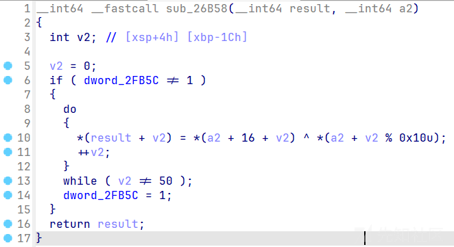
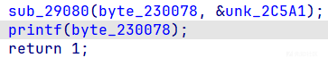

# 特征匹配处理多字符串解密函数混淆-先知社区

> **来源**: https://xz.aliyun.com/news/16980  
> **文章ID**: 16980

---

## 正则表达式

解决这个demo的字符串混淆用到了正则表达式，之前并没有学习过这个内容，所以记录一下正则表达式的知识点

正则表达式（Regular Expression，简称 Regex）是一种用于描述字符串匹配规则的文本模式。它通过特定的语法规则，可以高效地实现**文本的搜索、匹配、替换和提取**操作。在文本特征匹配中，正则表达式能快速定位符合特定模式的内容（如邮箱、电话号码、日期等），是处理文本数据的核心工具之一。

### **一、正则表达式核心语法**

正则表达式由普通字符（如字母、数字）和元字符（特殊符号）组成，以下是关键语法元素：

#### 1. 基础元字符

|  |  |  |
| --- | --- | --- |
| 元字符 | 作用 | 示例 |
| `.` | 匹配任意单个字符（除换行符） | `a.c` → "abc", "a3c" |
| `^` | 匹配字符串开头 | `^start` → 匹配以 "start" 开头的行 |
| `$` | 匹配字符串结尾 | `end$` → 匹配以 "end" 结尾的行 |
| `\d` | 匹配数字（等价于 `[0-9]`） | `\d{3}` → "123" |
| `\w` | 匹配字母、数字或下划线 | `\w+` → "user123" |
| `\s` | 匹配空白字符（空格、制表符等） | `\s+` → 匹配连续空格 |

#### 2. 量词（控制重复次数）

|  |  |  |
| --- | --- | --- |
| 量词 | 作用 | 示例 |
| `*` | 匹配前一个元素 0 次或多次 | `ab*c` → "ac", "abbc" |
| `+` | 匹配前一个元素 1 次或多次 | `a+b` → "ab", "aaab" |
| `?` | 匹配前一个元素 0 次或 1 次 | `colou?r` → "color" 或 "colour" |
| `{n}` | 精确匹配前一个元素 n 次 | `\d{4}` → "2023" |
| `{n,m}` | 匹配前一个元素 n 到 m 次 | `a{2,4}` → "aa", "aaaa" |

#### 3. 字符类与分组

|  |  |  |
| --- | --- | --- |
| 语法 | 作用 | 示例 |
| `[abc]` | 匹配括号内的任意字符 | `[aeiou]` → 匹配任意元音字母 |
| `[^abc]` | 匹配不在括号内的任意字符 | `[^0-9]` → 匹配非数字字符 |
| `(abc)` | 分组，捕获匹配的内容 | `(ab)+` → 匹配 "abab" |
| `|` | 逻辑“或” | `cat | dog` → 匹配 "cat" 或 "dog" |

#### 4. 转义字符

|  |  |
| --- | --- |
| 符号 | 作用 |
| `\` | 转义特殊字符（如 `\.` 匹配真正的点号） |
| `\b` | 匹配单词边界（如 `\bword\b` 匹配独立的 "word"） |

## 使用到的IDA API

* `idautils.Functions()` 这个IDA的API返回函数地址的列表
* `idaapi.decompile(func_ea)` 这个API可以获取到`func_ea`地址处的函数的反编译代码
* `idautils.XrefsTo(funcaddr)` 获取当前地址的交叉引用
* `idc.get_func_name(funcaddr)` 获取当前地址的函数名(符号)
* `idaapi.get_bytes(addr, length)` 获取`addr`处`length`个字节的数据

## 分析demo解密函数的特征



基本上所有的字符串解密函数都长这个样，只有key的长度和data的长度不一样，所以我们需要找出解密函数的共同特征

### 特征分析

主要提取反编译代码中的字符串

* `^ *`, `++`, `while`, `!= 1`, `%`

于是可以写出对应的查找函数`find_all_encode`

* **return** : 加密函数地址的列表

```
import idaapi
import idautils
def find_all_encode():
    '''
    find all encode function
    '''
    func_addr = []
    for func in idautils.Functions():
        features = ['^ *', '!= 1', '++', '%', 'while']
        func_code = str(idaapi.decompile(func))
        if all(feature in func_code for feature in features):
            func_addr.append(func)
    return func_addr
```

## 提取密文及密钥长度

简单分析函数之后可以发现密文及密钥的长度位置是固定的，因此可以通过特征匹配来提取两者的长度

* `*(a2 + v2 % 0x10u)` : **%** 后面是密钥的长度`key_length`
* `while ( v2 != 50 )` : **while**循环中的判定条件是密文的长度`data_length`
* 密文和密钥在同一个全局变量中,前`key_length`个字节是密钥，后面是密文

那么可以用正则表达式匹配对应的字符串写出对应的提取函数`extract`

```
import re
def search_key_length(text):
    '''
    search keylength
    '''
    pattern = r"%[\s]*(0x[0-9a-fA-F]+|\d+)"
    length = re.search(pattern, str(text))
    if length:
        val = length.group(1)
        if val.startswith('0x'):
            return int(val, 16)
        else:
            return int(val)
    return None    

def search_data_length(text):
    '''
    search data length
    '''
    pattern = r"while\s*\([^)]*!=\s*((?:0x[0-9a-fA-F]+)|\d+)[^)]*\)"
    length = re.search(pattern, str(text))
    if length:
        val = length.group(1)
        if val.startswith('0x'):
            return int(val, 16)
        else:
            return int(val)
    return None 

def extract(funcaddr):
    '''
    extract data and key
    '''
    funccode = str(idaapi.decompile(funcaddr))
    for line in funccode.split('
'):
        if 'while' in line:
            datalen = search_data_length(line)
        if '%' in line:
            keylen = search_key_length(line)
    return keylen, datalen
```

## 定位全局变量的地址

前面我们分析了密文和密钥的长度，为了能够自动化批量解密字符串，我们还需要找到存储密文的地址和解密后密文的地址，有了IDA提供的API我们可以很轻松的找到对应的位置。

### 思路

* 对`find_all_encode`函数中得到的加密函数的地址进行交叉引用，得到调用处的地址
* 解析调用处的文本，通过正则匹配提取对应全局变量的地址，如下图



```
import idc
def Xref_to_data_and_key(funcaddr, N=2):
    '''
    find xref to data and key
    '''
    xrefs = [ref.frm for ref in idautils.XrefsTo(funcaddr)]
    funcname = idc.get_func_name(funcaddr)
    result = []
    for xref in xrefs:
        dec = idaapi.decompile(xref)
        if dec is None:
            continue
        dec_str = str(dec)
        lines = dec_str.split('
')
        call_line = [i for i, line in enumerate(lines) if funcname in line]
        for line in call_line:
            context = lines[max(0, line-N):min(len(lines), line+N+1)]
            context = '
'.join(context)
            result.append((xref, context))
    return result

def match_hex(text):
    '''
    match hex
    '''
    pattern = r"_([0-9a-fA-F]+)"
    match = re.search(pattern, text)
    if match:
        return match.group(1)
    return None

def extract_addr(funcaddr):
    '''
    extract data and key address
    '''
    context = Xref_to_data_and_key(funcaddr, 0)[0][1]
    context = context[context.find('('): context.rfind(')') + 1].split(',')
    if len(context) != 2:
        print("error: ", context)
        return None
    dst_addr = int(match_hex(context[0]), 16)
    data_addr = int(match_hex(context[1]), 16)
    return dst_addr, data_addr
```

## 模拟解密函数

比较简单，不多说

```
def decrypt(data, key):
    '''
    decrypt data
    '''
    data = bytearray(data)
    key = bytearray(key)
    for i in range(len(data)):
        data[i] ^= key[i % len(key)]
    return bytes(data)
```

## 完整实现

```
import idaapi
import idautils
import idc  
import re

def find_all_encode():
    '''
    find all encode function
    '''
    func_addr = []
    for func in idautils.Functions():
        features = ['^ *', '!= 1', '++', '%', 'while']
        func_code = str(idaapi.decompile(func))
        if all(feature in func_code for feature in features):
            func_addr.append(func)
    return func_addr

def search_key_length(text):
    '''
    search keylength
    '''
    pattern = r"%[\s]*(0x[0-9a-fA-F]+|\d+)"
    length = re.search(pattern, str(text))
    if length:
        val = length.group(1)
        if val.startswith('0x'):
            return int(val, 16)
        else:
            return int(val)
    return None    

def search_data_length(text):
    '''
    search data length
    '''
    pattern = r"while\s*\([^)]*!=\s*((?:0x[0-9a-fA-F]+)|\d+)[^)]*\)"
    length = re.search(pattern, str(text))
    if length:
        val = length.group(1)
        if val.startswith('0x'):
            return int(val, 16)
        else:
            return int(val)
    return None 

def extract(funcaddr):
    '''
    extract data and key
    '''
    funccode = str(idaapi.decompile(funcaddr))
    for line in funccode.split('
'):
        if 'while' in line:
            datalen = search_data_length(line)
        if '%' in line:
            keylen = search_key_length(line)
    return keylen, datalen

def Xref_to_data_and_key(funcaddr, N=2):
    '''
    find xref to data and key
    '''
    xrefs = [ref.frm for ref in idautils.XrefsTo(funcaddr)]
    funcname = idc.get_func_name(funcaddr)
    result = []
    for xref in xrefs:
        dec = idaapi.decompile(xref)
        if dec is None:
            continue
        dec_str = str(dec)
        lines = dec_str.split('
')
        call_line = [i for i, line in enumerate(lines) if funcname in line]
        for line in call_line:
            context = lines[max(0, line-N):min(len(lines), line+N+1)]
            context = '
'.join(context)
            result.append((xref, context))
    return result

def match_hex(text):
    '''
    match hex
    '''
    pattern = r"_([0-9a-fA-F]+)"
    match = re.search(pattern, text)
    if match:
        return match.group(1)
    return None

def extract_addr(funcaddr):
    '''
    extract data and key address
    '''
    context = Xref_to_data_and_key(funcaddr, 0)[0][1]
    context = context[context.find('('): context.rfind(')') + 1].split(',')
    if len(context) != 2:
        print("error: ", context)
        return None
    dst_addr = int(match_hex(context[0]), 16)
    data_addr = int(match_hex(context[1]), 16)
    return dst_addr, data_addr

def decrypt(data, key):
    '''
    decrypt data
    '''
    data = bytearray(data)
    key = bytearray(key)
    for i in range(len(data)):
        data[i] ^= key[i % len(key)]
    return bytes(data)

def decrypt_all():
    '''
    decrypt all data
    '''
    funcs = find_all_encode()
    for func in funcs:
        try:
            keylength, datalength = extract(func)
            dst_addr, data_addr = extract_addr(func)
            keydata = idaapi.get_bytes(data_addr, keylength)
            data = idaapi.get_bytes(data_addr + keylength, datalength)
            
            decrypt_data = decrypt(data, keydata)
            print(f'addr: {hex(dst_addr)}', decrypt_data)
        except Exception as e:
            print(f'error: {hex(func)}')
            
decrypt_all()
```

## 最终效果

```
addr: 0x2f0a8 b'11.0.2\x00'
addr: 0x2f158 b'miniz.c\x00'
addr: 0x2f164 b'tdefl_status tdefl_compress_buffer(tdefl_compressor *, const void *, size_t, tdefl_flush)\x00'
addr: 0x2f1c4 b'd->m_pPut_buf_func\x00'
addr: 0x2f1dc b'\x05\x05\x04\x00'
addr: 0x2f1e4 b'\x02\x03\x07\x00'
addr: 0x2f1ec b'\x03\x03\x0b\x00'
addr: 0x2f1f4 b'tinfl_status tinfl_decompress(tinfl_decompressor *, const mz_uint8 *, size_t *, mz_uint8 *, mz_uint8 *, size_t *, const mz_uint32)\x00'
addr: 0x2f27c b'!num_bits\x00'
addr: 0x2f28c b'rb\x00'
addr: 0x2f294 b'wb\x00'
addr: 0x2f29c b'w+b\x00'
addr: 0x2f2a4 b'r+b\x00'
addr: 0x2f2ac b'mz_bool mz_zip_writer_add_mem_ex_v2(mz_zip_archive *, const char *, const void *, size_t, const void *, mz_uint16, mz_uint, mz_uint64, mz_uint32, time_t *, const char *, mz_uint, const char *, mz_uint)\x00'
addr: 0x2f37c b'(local_dir_header_ofs & (pZip->m_file_offset_alignment - 1)) == 0\x00'
addr: 0x2f3c4 b'bit_flags & MZ_ZIP_LDH_BIT_FLAG_HAS_LOCATOR\x00'
addr: 0x2f3f4 b'mz_bool mz_zip_writer_add_read_buf_callback(mz_zip_archive *, const char *, mz_file_read_func, void *, mz_uint64, const time_t *, const void *, mz_uint16, mz_uint, const char *, mz_uint, const char *, mz_uint)\x00'
addr: 0x2f4cc b'(cur_archive_file_ofs & (pZip->m_file_offset_alignment - 1)) == 0\x00'
addr: 0x2f514 b'mz_bool mz_zip_writer_add_from_zip_reader(mz_zip_archive *, mz_zip_archive *, mz_uint)\x00'
addr: 0x2f570 b'no error\x00'
addr: 0x2f580 b'undefined error\x00'
addr: 0x2f594 b'too many files\x00'
addr: 0x2f5a8 b'file too large\x00'
addr: 0x2f5bc b'unsupported method\x00'
addr: 0x2f5d4 b'unsupported encryption\x00'
addr: 0x2f5f0 b'unsupported feature\x00'
addr: 0x2f608 b'failed finding central directory\x00'
addr: 0x2f630 b'not a ZIP archive\x00'
addr: 0x2f648 b'invalid header or archive is corrupted\x00'
addr: 0x2f674 b'unsupported multidisk archive\x00'
addr: 0x2f698 b'decompression failed or archive is corrupted\x00'
addr: 0x2f6cc b'compression failed\x00'
addr: 0x2f6e4 b'unexpected decompressed size\x00'
addr: 0x2f708 b'CRC-32 check failed\x00'
addr: 0x2f720 b'unsupported central directory size\x00'
addr: 0x2f748 b'allocation failed\x00'
addr: 0x2f760 b'file open failed\x00'
addr: 0x2f778 b'file create failed\x00'
addr: 0x2f790 b'file write failed\x00'
addr: 0x2f7a8 b'file read failed\x00'
addr: 0x2f7c0 b'file close failed\x00'
addr: 0x2f7d8 b'file seek failed\x00'
addr: 0x2f7f0 b'file stat failed\x00'
addr: 0x2f808 b'invalid parameter\x00'
addr: 0x2f820 b'invalid filename\x00'
addr: 0x2f838 b'buffer too small\x00'
addr: 0x2f850 b'internal error\x00'
addr: 0x2f864 b'file not found\x00'
addr: 0x2f878 b'archive is too large\x00'
addr: 0x2f894 b'validation failed\x00'
addr: 0x2f8ac b'write callback failed\x00'
addr: 0x2f8c8 b'total errors\x00'
addr: 0x2f8dc b'unknown error\x00'
addr: 0x2f8f0 b'mz_bool tdefl_compress_normal(tdefl_compressor *)\x00'
addr: 0x2f928 b'd->m_lookahead_size >= len_to_move\x00'
addr: 0x2f950 b'void tdefl_find_match(tdefl_compressor *, mz_uint, mz_uint, mz_uint, mz_uint *, mz_uint *)\x00'
addr: 0x2f9b0 b'max_match_len <= TDEFL_MAX_MATCH_LEN\x00'
addr: 0x2f9dc b'void tdefl_record_match(tdefl_compressor *, mz_uint, mz_uint)\x00'
addr: 0x2fa20 b'(match_len >= TDEFL_MIN_MATCH_LEN) && (match_dist >= 1) && (match_dist <= TDEFL_LZ_DICT_SIZE)\x00'
addr: 0x2fa84 b'int tdefl_flush_block(tdefl_compressor *, int)\x00'
addr: 0x2fab8 b'!d->m_output_flush_remaining\x00'
addr: 0x2fadc b'bits <= ((1U << len) - 1U)\x00'
addr: 0x2fafc b'd->m_pOutput_buf < d->m_pOutput_buf_end\x00'
error: 0x26b58
addr: 0x2fb60 b'void tdefl_start_dynamic_block(tdefl_compressor *)\x00'
addr: 0x2fb98 b'code < TDEFL_MAX_HUFF_SYMBOLS_2\x00'
addr: 0x2fbbc b'mz_bool tdefl_compress_lz_codes(tdefl_compressor *)\x00'
addr: 0x2fbf4 b'd->m_huff_code_sizes[0][s_tdefl_len_sym[match_len]]\x00'
addr: 0x2fc2c b'd->m_huff_code_sizes[1][sym]\x00'
addr: 0x2fc50 b'd->m_huff_code_sizes[0][lit]\x00'
addr: 0x2fc74 b'mz_bool mz_zip_array_ensure_capacity(mz_zip_archive *, mz_zip_array *, size_t, mz_uint)\x00'
addr: 0x2fcd0 b'pArray->m_element_size\x00'
addr: 0x22fcec b'miniz.c version: %s
\x00'
addr: 0x22fd08 b'11.0.2\x00'
addr: 0x22fd14 b'Usage: example3 [options] [mode:c or d] infile outfile
\x00'
addr: 0x22fd50 b'
Modes:
\x00'
addr: 0x22fd60 b'c - Compresses file infile to a zlib stream in file outfile
\x00'
addr: 0x22fda4 b'd - Decompress zlib stream in file infile to file outfile
\x00'
addr: 0x22fde4 b'
Options:
\x00'
addr: 0x22fdf4 b'-l[0-10] - Compression level, higher values are slower.
\x00'
addr: 0x22fe34 b'Invalid level!
\x00'
addr: 0x22fe48 b'Invalid option: %s
\x00'
addr: 0x22fe60 b'Must specify mode, input filename, and output filename after options!
\x00'
addr: 0x22feac b'Too many filenames!
\x00'
addr: 0x22fec8 b'cCdD\x00'
addr: 0x22fed4 b'Invalid mode!
\x00'
addr: 0x22fee8 b'Mode: %c, Level: %u
Input File: "%s"
Output File: "%s"
\x00'
addr: 0x22ff24 b'rb\x00'
addr: 0x22ff2c b'Failed opening input file!
\x00'
addr: 0x22ff4c b'File is too large to be processed by this example.
\x00'
addr: 0x22ff84 b'wb\x00'
addr: 0x22ff8c b'Failed opening output file!
\x00'
addr: 0x22ffb0 b'Input file size: %u
\x00'
addr: 0x22ffcc b'deflateInit() failed!
\x00'
addr: 0x22ffe8 b'Failed reading from input file!
\x00'
addr: 0x230010 b'Failed writing to output file!
\x00'
addr: 0x230034 b'deflate() failed with status %i!
\x00'
addr: 0x23005c b'deflateEnd() failed!
\x00'
addr: 0x230078 b'inflateInit() failed!
\x00'
addr: 0x230094 b'inflate() failed with status %i!
\x00'
addr: 0x2300bc b'inflateEnd() failed!
\x00'
addr: 0x2300d8 b'Total input bytes: %u
\x00'
addr: 0x2300f4 b'Total output bytes: %u
\x00'
addr: 0x230110 b'Success.
\x00'
```
