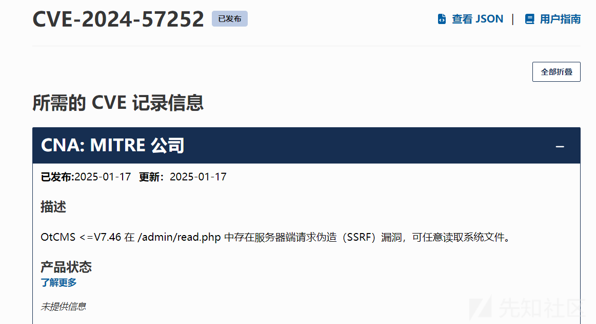
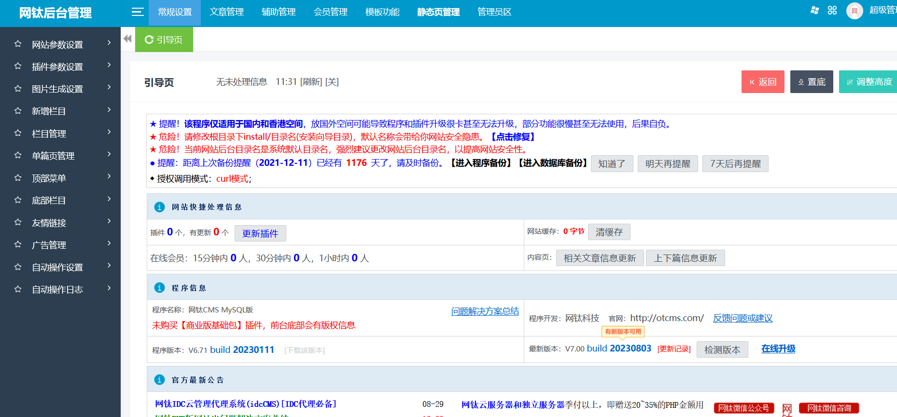
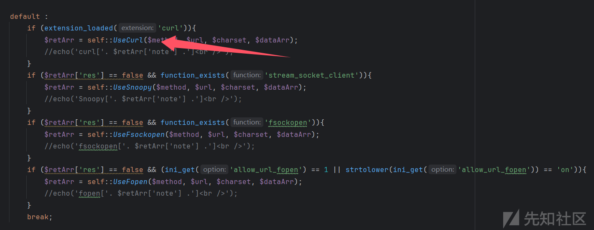
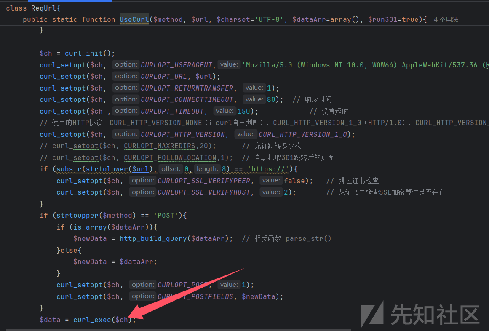
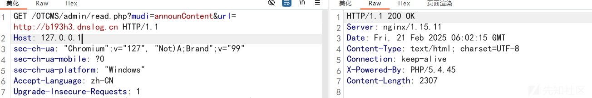
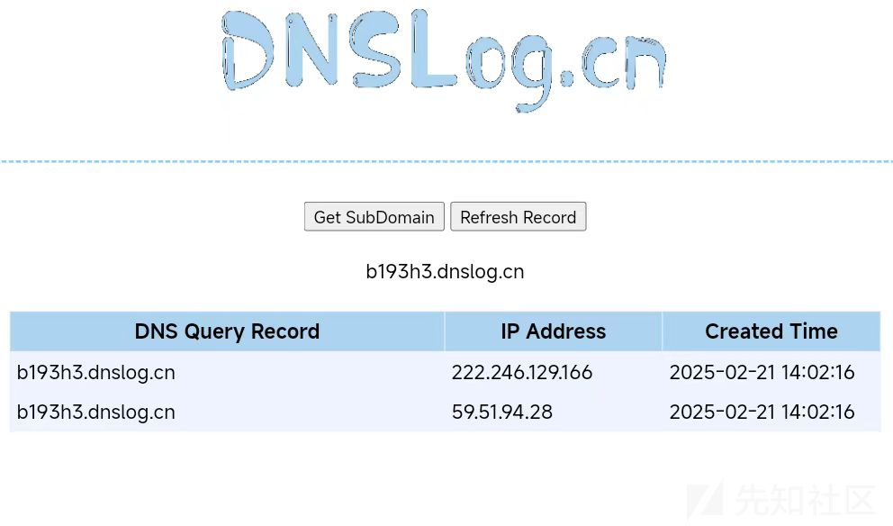
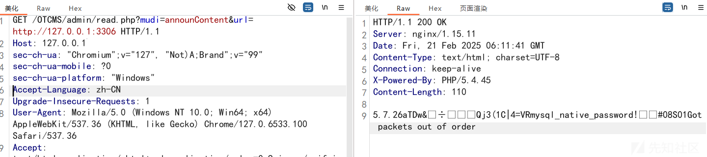

# CVE-2024-57252漏洞详细分析-先知社区

> **来源**: https://xz.aliyun.com/news/16982  
> **文章ID**: 16982

---

# 漏洞描述



# 环境搭建

源码下载地址：<https://www.jb51.net/codes/466422.html>

放置在网站根目录，配置好数据库，后台账号密码即可

访问/admin登录后台



# 漏洞分析

根据漏洞描述找到/admin/read.php文件

```
$mudi = trim(@$_GET['mudi']);

switch ($mudi){
    case 'exitTimeDiff':
       ExitTimeDiff();
       break;

    case 'getKeyWord':
       getKeyWord();
       break;

    case 'getSignal':
       GetSignal();
       break;

    case 'getSignalSec':
       GetSignalSec();
       break;

    case 'checkCollUrl':
       CheckCollUrl();
       break;

    case 'announContent':
       AnnounContent();
       break;

    case 'announBlank':
       AnnounBlank();
       break;

    case 'announNoUpdate':
       AnnounNoUpdate();
       break;

    case 'creatWeb':
       CreatWeb();
       break;

    case 'selUserBox':
       SelUserBox();
       break;

    case 'createUserBox':
       CreateUserBox();
       break;

    default:
       die('err');
}
```

这里需要传入一个mudi参数，不同的参数调用不同的方法

这里主要是AnnounContent方法产生的漏洞，跟进一下方法

```
function AnnounContent(){
    require(OT_ROOT .'inc/classReqUrl.php');

    $url = trim(@$_GET['url']);

    $retArr    = ReqUrl::UseAuto(0, 'GET', $url);
    if ($retArr['res']){
       echo($retArr['note']);
    }else{
       echo('<center style="margin-top:85px;font-size:14px;">检测到该空间访问网钛官网异常，故不自动访问，您可以<a href="'. $url .'">手动刷新访问</a></center>');
    }
}
```

在AnnounContent()函数中，$url变量直接来源于用户输入（GET请求中的url参数），而没有进行有效的验证或过滤。 还包含了classReqUrl.php文件，跟进一下文件

```
class ReqUrl{

    public static function UseAuto($seMode, $method, $url, $charset='UTF-8', $dataArr=array(), $retMode=''){
       $retArr = array('res'=>false, 'note'=>'');

       switch ($seMode){
          case 1:    // Snoopy插件
             $retArr = self::UseSnoopy($method, $url, $charset, $dataArr);
             break;
       
          case 2:    // curl模式
             $retArr = self::UseCurl($method, $url, $charset, $dataArr);
             break;
       
          case 3:    // fsockopen模式
             $retArr = self::UseFsockopen($method, $url, $charset, $dataArr);
             break;

          case 4:    // fopen模式
             $retArr = self::UseFopen($method, $url, $charset, $dataArr);
             break;

          default :
             if (extension_loaded('curl')){
                $retArr = self::UseCurl($method, $url, $charset, $dataArr);
                //echo('curl['. $retArr['note'] .']<br />');
             }
             if ($retArr['res'] == false && function_exists('stream_socket_client')){
                $retArr = self::UseSnoopy($method, $url, $charset, $dataArr);
                //echo('Snoopy['. $retArr['note'] .']<br />');
             }
             if ($retArr['res'] == false && function_exists('fsockopen')){
                $retArr = self::UseFsockopen($method, $url, $charset, $dataArr);
                //echo('fsockopen['. $retArr['note'] .']<br />');
             }
             if ($retArr['res'] == false && (ini_get('allow_url_fopen') == 1 || strtolower(ini_get('allow_url_fopen')) == 'on')){
                $retArr = self::UseFopen($method, $url, $charset, $dataArr);
                //echo('fopen['. $retArr['note'] .']<br />');
             }
             break;
       }
```

$retArr = ReqUrl::UseAuto(0, 'GET', $url);

ReqUrl::UseAuto() 方法尝试根据不同的 $seMode 参数选择不同的方式进行网络请求

这里的$seMode参数值为0，所以会走到UseCurl方法

跟进一下UseCurl方法



调用curl\_exec函数执行了一个curl会话，且$url参数可控，即可造成ssrf漏洞

# 漏洞复现





这里还可以探测内网服务
