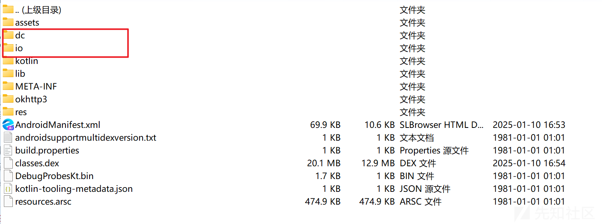
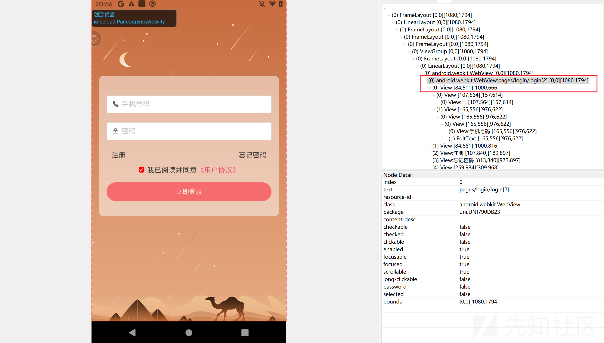
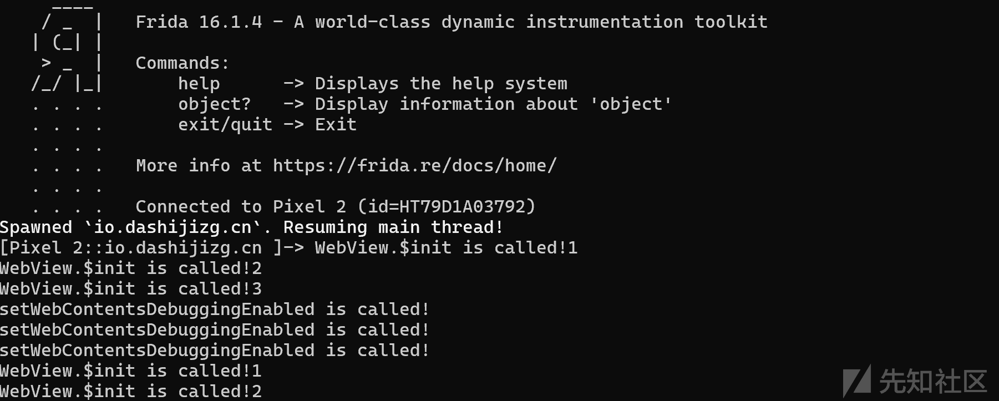
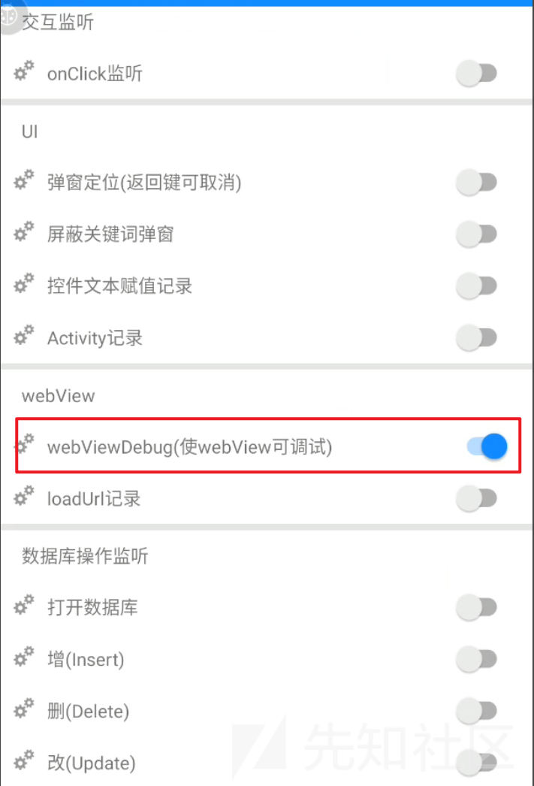
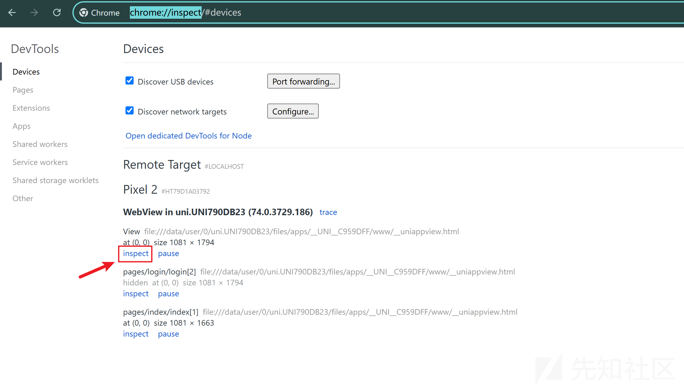
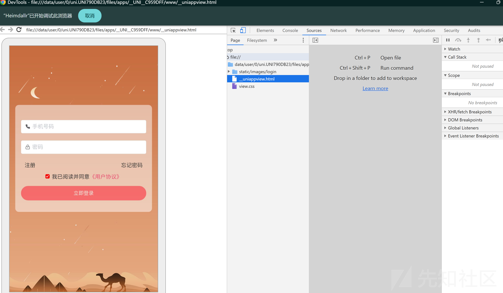
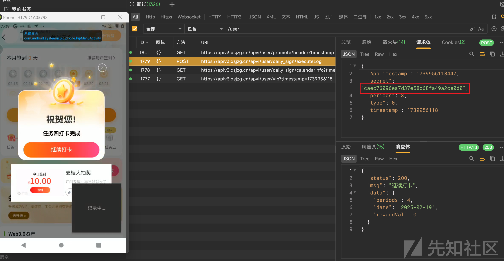
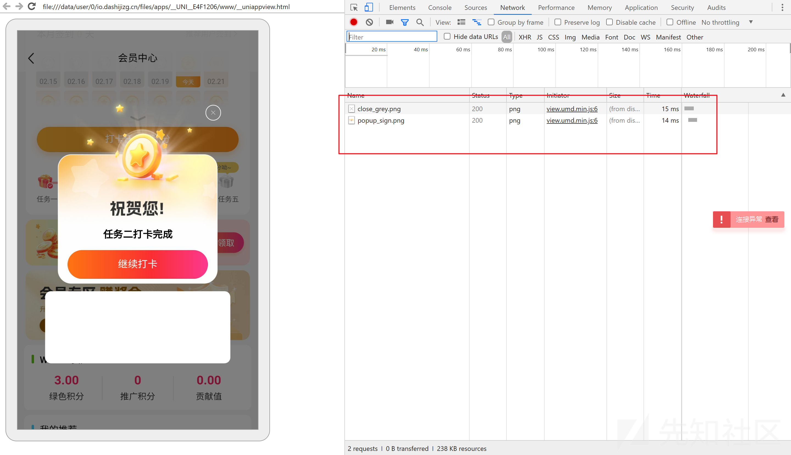
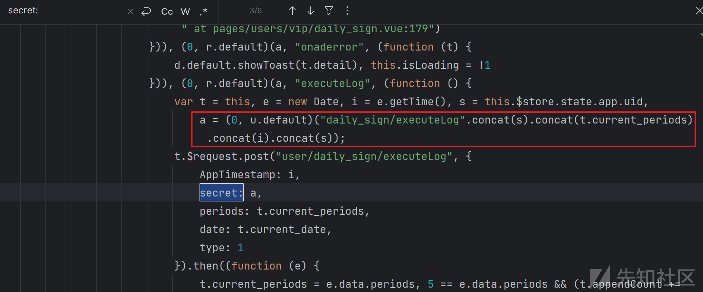
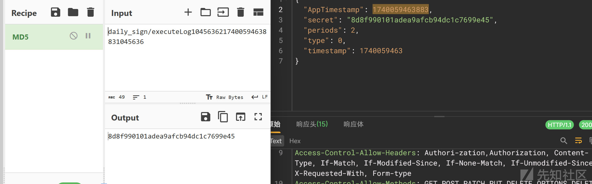

# uniapp分析思路-先知社区

> **来源**: https://xz.aliyun.com/news/16991  
> **文章ID**: 16991

---

### 简介

uni-app 是一个使用 Vue.js开发所有前端应用的框架，由DCloud公司开发和维护，可发布到 iOS、Android、Web、鸿蒙以及各种小程序、快应用等多个平台。

​

### 特征

UniApp打包的Android客户端APK包中结构如下

会出现dc和io这两个纯java开发app中没有的目录



同时，在App端（iOS和Android），UniApp应用的页面通常是基于WebView进行渲染的。

安卓SDK的tools\bin下的uiautomatorviewer查看app界面布局，可以发现界面里面嵌了webview

​



### 分析方法

#### 静态分析

app-service.js文件就是整个app的逻辑层。


所以如果app-service.js没有被加密混淆，在pycharm直接使用快捷键ctrl+alt+L就可以分析了

​

​

#### 动态调试

uniapp的动态调试就是对webview的动态调试

##### 修改设置

大部分uniapp都会设置不可调试，所以首先要通过hook把修改设置

hook代码如下：

```
function setenable(){
  Java.perform(function () {
    //实例化一个对象
    var WebView = Java.use('android.webkit.WebView');
    //重写WebView类的重载方法，因为setWebContentsDebuggingEnabled不是静态方法，所以需要一个对象来调用这个方法
    WebView.$init.overload('android.content.Context').implementation = function (a) {
      console.log("WebView.$init is called!1");
      var retval = this.$init(a);
      this.setWebContentsDebuggingEnabled(true);
      return retval;
    }
    WebView.$init.overload('android.content.Context', 'android.util.AttributeSet').implementation = function (a, b) {
      console.log("WebView.$init is called!2");
      var retval = this.$init(a, b);
      this.setWebContentsDebuggingEnabled(true);
      return retval;
    }
    WebView.$init.overload('android.content.Context', 'android.util.AttributeSet', 'int').implementation = function (a, b, c) {
      console.log("WebView.$init is called!3");
      var retval = this.$init(a, b, c);
      this.setWebContentsDebuggingEnabled(true);
      return retval;
    }
    //始终设置为true,打开调试
    WebView.setWebContentsDebuggingEnabled.implementation = function () {
      this.setWebContentsDebuggingEnabled(true);
      console.log("setWebContentsDebuggingEnabled is called!");
    }

  });

  // frida -U -f package_name -l .\hook.js --no-pause
}
```

​

spawn模式启动frida即可修改设置



也可以使用算法助手开启webviewDebug



##### devtools 调试

启动设置后，开启科学上网，在chrome浏览器输入chrome://inspect



然后选择页面，点击inspect即可开始调试



### 简单案例

app: aW8uZG{beihai\_delete}FzaGlqaXpnLmNu

打卡任务抓包，发现secret这个加密字段



观察发现是uniapp开发的。脱壳查看java层没找到secret相关字段。于是转向分析js

先动态调试，发现network里只有本地图片，那么大概率就是js操作数据字段，java层发包



​

于是分析app-service.js，直接祭出一手字符串大法，发现了相关部分



这个secret是将"daily\_sign/executeLog"，uid，已完成任务数，时间戳和uid拼接得到字符串，再进行某种算法操作得到的

​

这个secret的长度是32，先尝试一手md5，对比一下发现确实是



​

最终，通过静态分析和猜测分析出了secret的由来

### 参考资料

<https://www.52pojie.cn/thread-1457553-1-1.html>

<https://www.bilibili.com/video/BV18r421x7yj/?spm_id_from=333.1387.upload.video_card.click>
