# 某软件系统全局审计分析-先知社区

> **来源**: https://xz.aliyun.com/news/16994  
> **文章ID**: 16994

---

# 声明

本文章中所有内容仅供学习交流，严禁用于商业用途和非法用途，否则由此产生的一切后果均与文章作者无关！

# 前言

这个系统全是漏洞，从前台到后台，并且存在大量的信息泄露，这里就代码快速浏览了一下，半天时间就出货了

# upload

通过文件全局搜索关键词upload、download、file等等

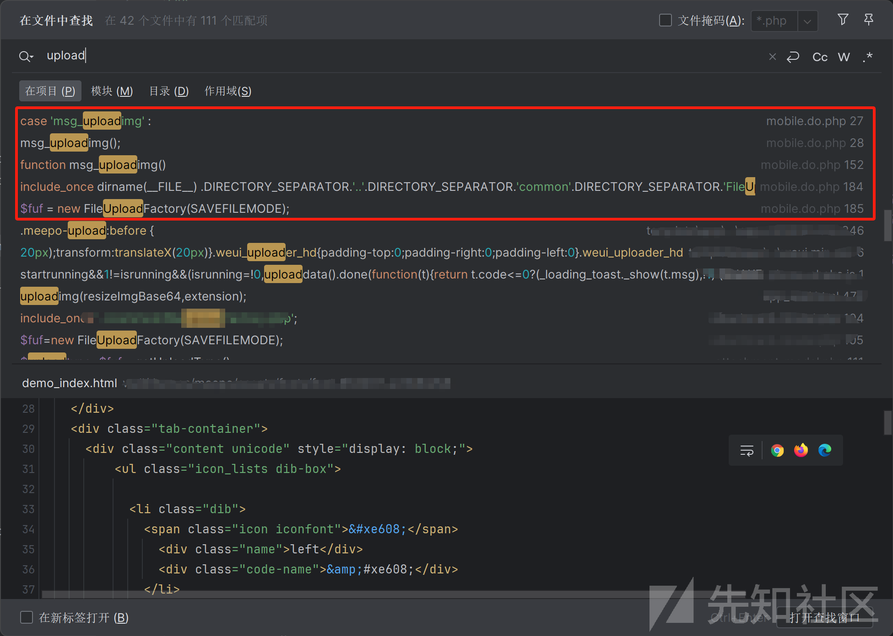

通过上述搜索upload发现疑似存在一个文件上传，跟进查看发现存在一个switch语句，其中6个判断，发现我们搜索的upload时存在一个msg\_uploadimg()函数。

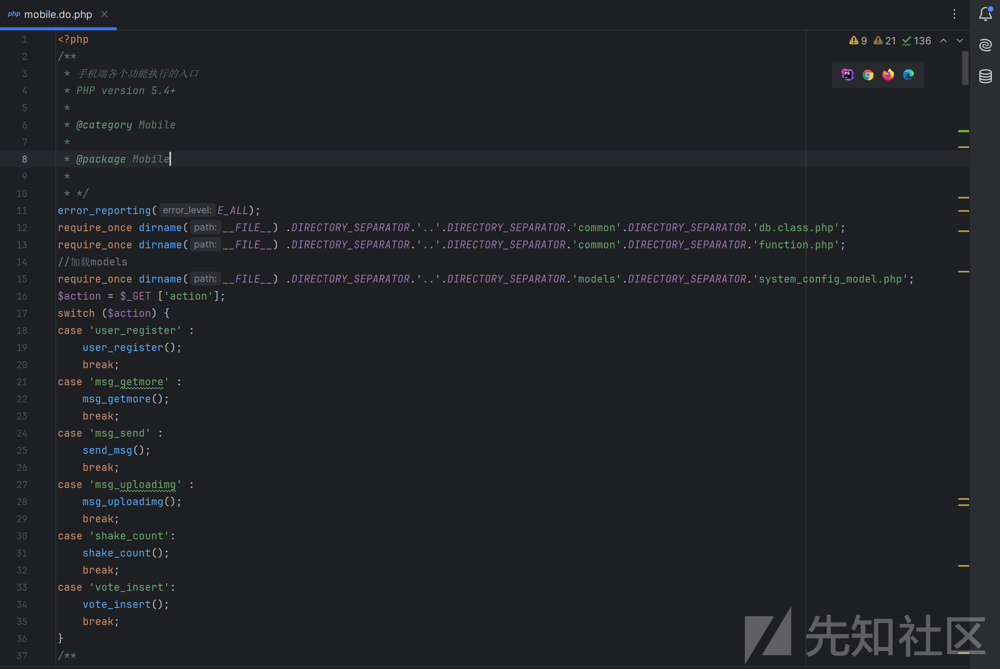

我们点击msg\_uploadimg跟进该函数，发现是一个文件上传的处理逻辑，其中主要存在两个参数，均为POST传参，一个为上传的内容，一个为上传的文件类型，通过下图中的代码逻辑可以发现内容要进行base64解码，最后通过190行的saveFile函数进行保存文件，然后判断是否需要进行审核（这一步其实不重要，审核与否都要返回文件上传相关的信息），最后就是数组的形式返回相关信息

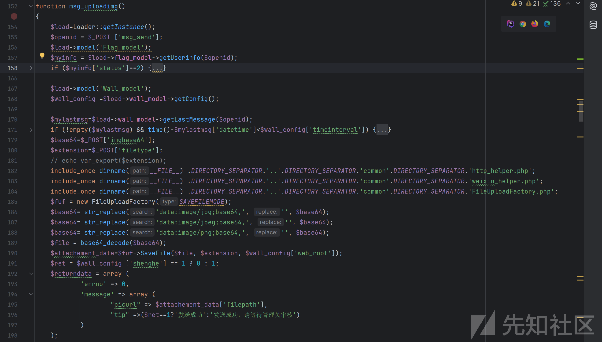

通过上述代码分析因此我们可以发现构造payload需要的三个参数，我们可以直接构造文件上传的请求包，如下直接上传成功，返回文件信息

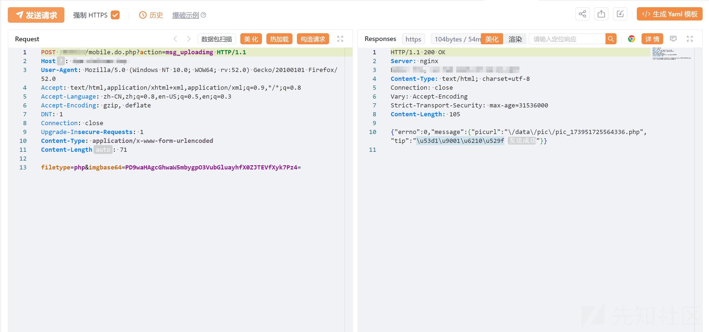

查看上传的phpinfo文件，发现已经成功上传了。

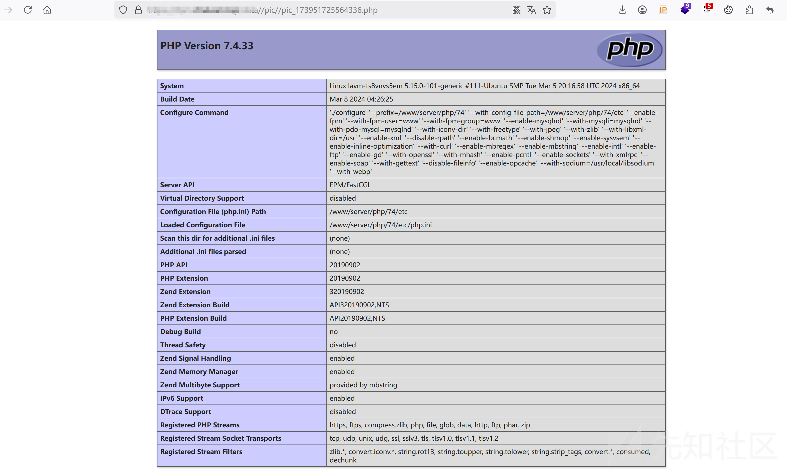

但是有时候上传不了，这里原因是可以查看上述代码中msg\_uploadimg函数中的171行，在这里做了一个上传时间间隔校验，如果在规定时间内多次上传文件则可能存在如下信息

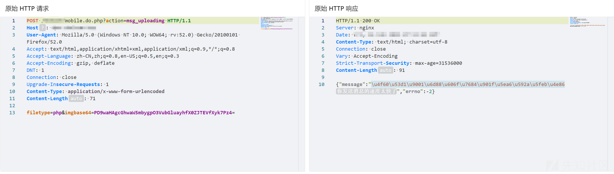

# weixin公众号接管

这里还通过代码审计发现一些微信，appid相关的字样，查看代码也不存在什么信息，所以随机找一个幸运儿登录进后台系统查看，发现存在一个公众号授权界面，里面刚好存在appid以及appsecret值

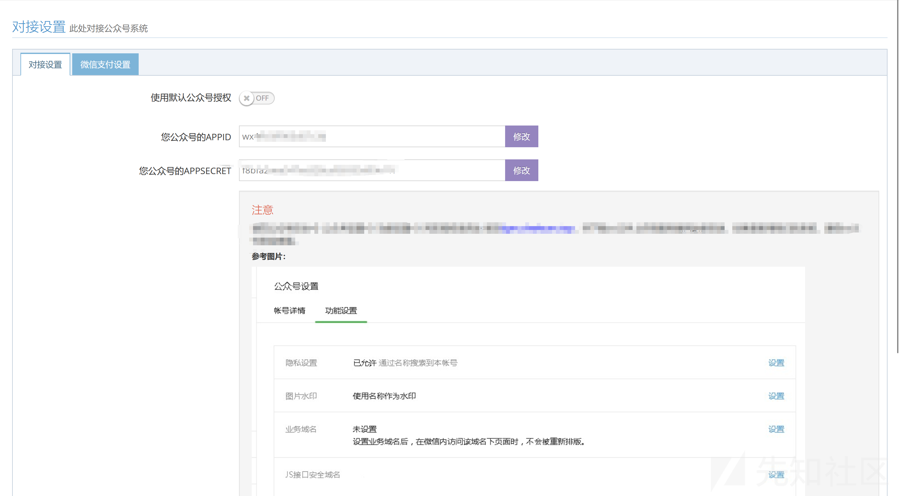

这里直接访问微信的api接口网站使用上述的appid以及appsecret值生成token

通过微信调试平台，利用生成的Token凭证访问公众号的相关信息，即可直接获取到所需的信息

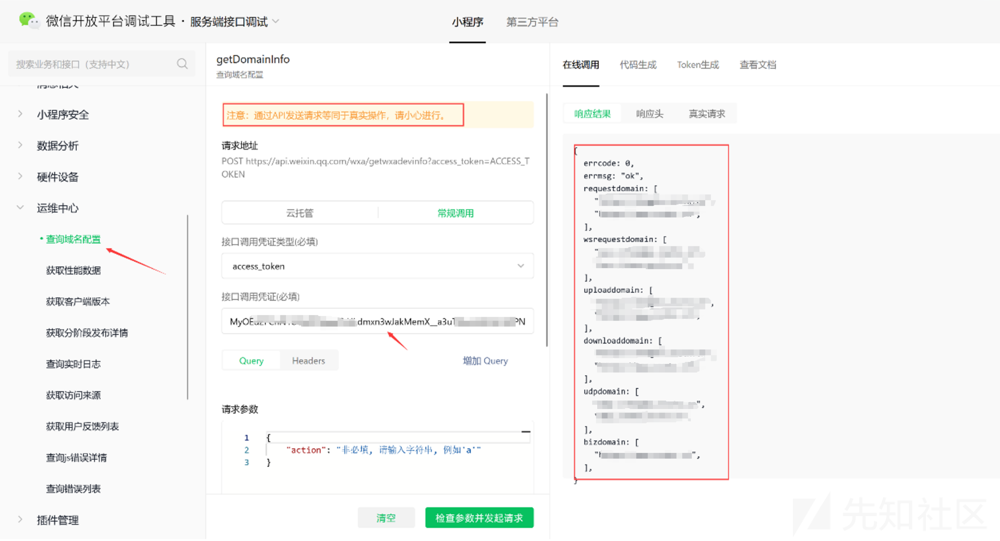

# sql文件泄露

这里直接使用文件查看脚本全局搜索一下.sql、.db的文件，发现存在一个db.sql文件

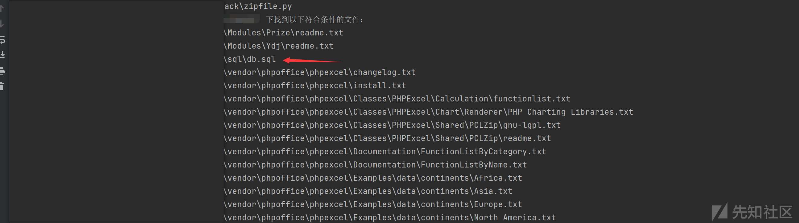

通过浏览器直接下载

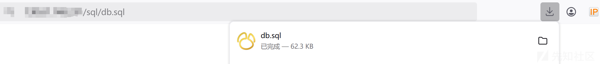

打开查看发现没啥有用的信息，都是一些sql固定的语句

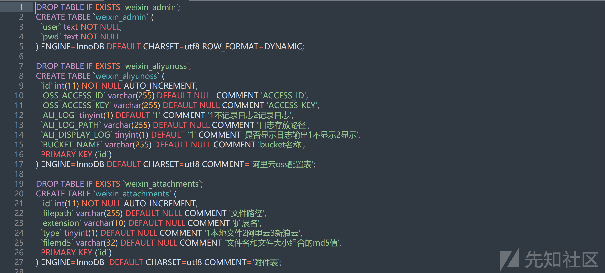

# 源代码泄露

再用文件查找脚本看看其它的文件，发现存在一个bak2文件，而且看样子是数据库文件

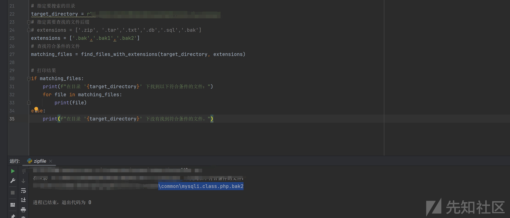

访问进行下载

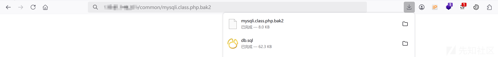

打开查看发现确实是php代码文件，但是也没有什么有用的信息，勉强算源代码泄露

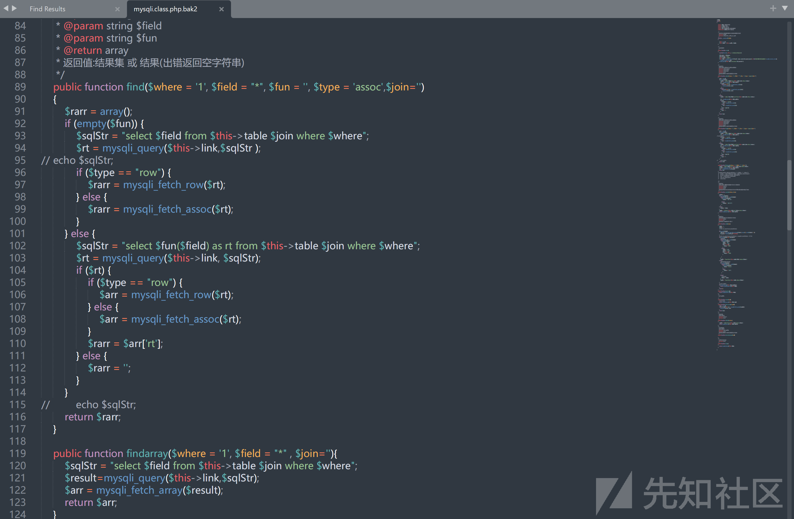

# 逻辑漏洞

我这里本意是想搜索一下password相关的关键字，看看有没有固定密码啥的，结果搜索出来类似这样的代码逻辑

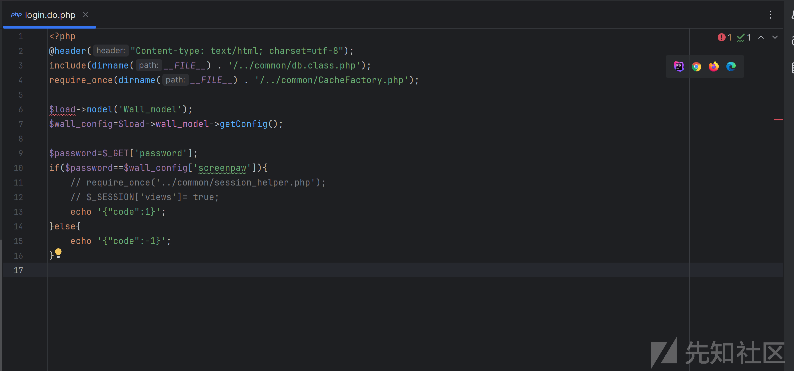

这里随便使用一个网站抓包把-1更改为1发现可以登录进去（点到为止）

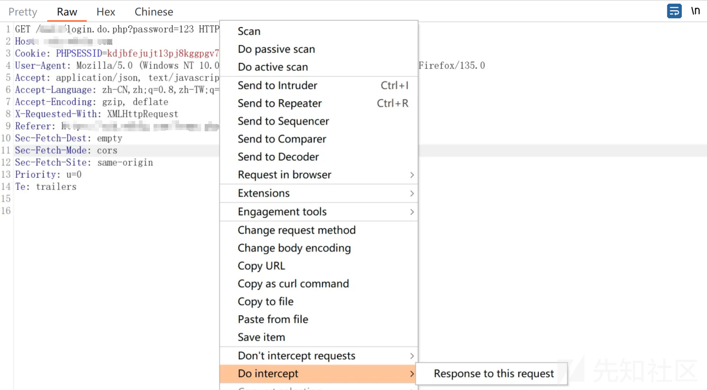

