# 某平台代码审计RCE-先知社区

> **来源**: https://xz.aliyun.com/news/16995  
> **文章ID**: 16995

---

# 声明

本文章中所有内容仅供学习交流，严禁用于商业用途和非法用途，否则由此产生的一切后果均与文章作者无关！

# 前言

第一次分析php代码的命令执行，还请大佬指点

# RCE代码分析

首先在寻找RCE漏洞的时候大多数情况下都是通过关键词来定位，在这里推荐两种方法，其中一种是直接打开phpstorm全局搜索关键词定位，如exec(、system(等等，还有一种就是使用代码审计工具，比如seay源代码审计工具

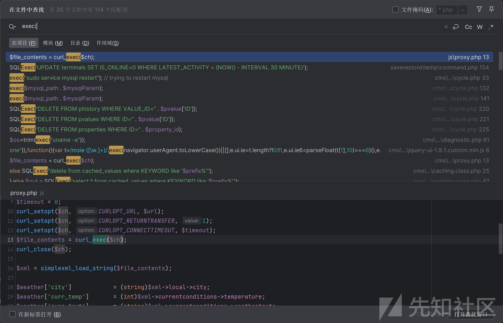

这个命令执行漏洞在不知道漏洞具体的位置时候，通过phpstorm进行全局搜索来进行审计会搜索不到相关的代码文件，通过seay源代码审计工具可以找出来，所以有时候可以结合着用，如下图，通过代码审计工具发现thumb文件可能会存在命令执行漏洞

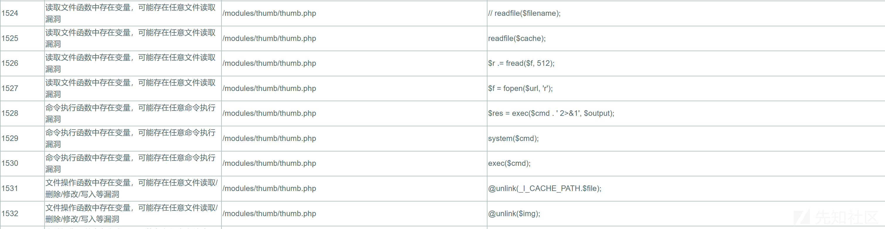

直接使用phpstorm打开该代码文件进行分析，该代码的功能主要是用于处理图像的抓取、缓存和缩放。支持从多种来源（如 RTSP 流、USB 摄像头、MJPEG 流等）获取图像，然后使用FFmpeg.exe进行处理

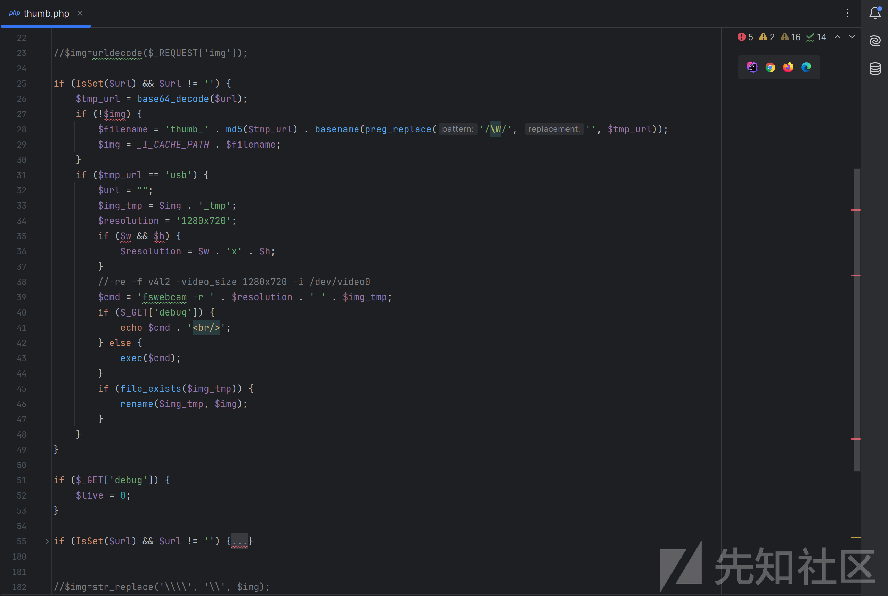

通过查看代码其实可以发现存在多处exec函数进行命令执行的地方，这个漏洞的命令执行都是通过拼接进行操作，但是只有一处存在回显，就是使用rstp协议函数进行图像文件处理时候。通过查看78行代码发现直接GET传参进行变量接收，因此不存在用户输入输出过滤，从而导致RCE

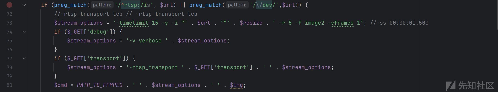

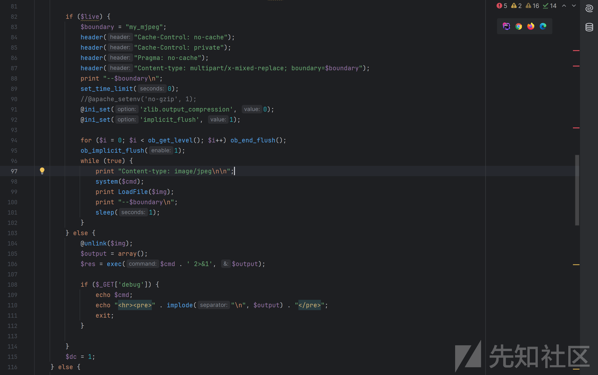

可以通过直接拼接命令来实现远程代码执行（RCE），从图中返回包中的第8行可以发现，使用的`avconc`工具进行图像媒体处理，这里简单解释一下，`avconv` 是一个曾经流行的多媒体处理工具，类似于 `ffmpeg`，但它的开发已经停止，现在已经被 `ffmpeg` 取代。而且可以发现该系统为linux系统，因此一般使用的都是`avconv`，因此命令执行的概率会更大，RCE的利用率也会更大

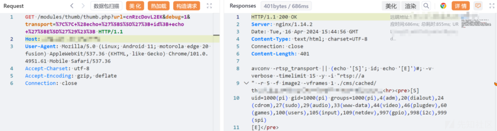

但是有的情况下无法进行命令执行，会出现执行失败，这里可能存在的原因，其中一种为拼接的命令错误导致命令执行失败，还有一种就是从下图返回的内容来看，注入的命令被ffmpeg程序进行了处理，并尝试作为参数传递给了ffmpeg，并不是作为独立的系统命令执行。

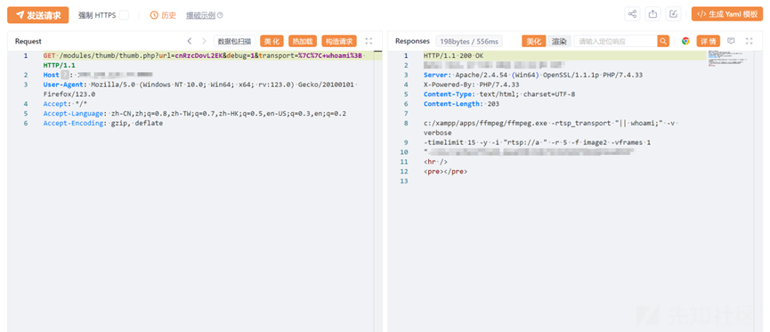

从上述图中可以发现该系统为windows，其使用的是`ffmpeg`来处理媒体流，这是在代码已经定义好的，如果为Windows系统则调用指定路径下的ffmpeg

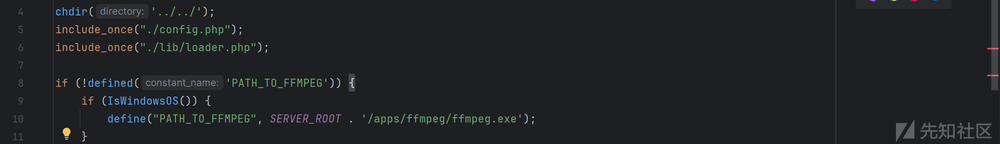

还有一种情况，就是在linux系统中，没有ffmpeg以及avconv工具进行没流体处理，如下图这种情况

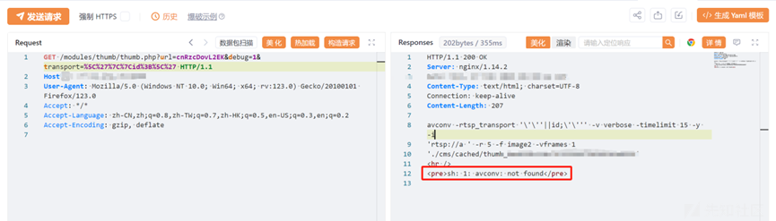

按照正常情况来说即使没有avconv工具也应该也能够执行命令并且回显的，通过本地使用linux进行测试也是成功回显命令

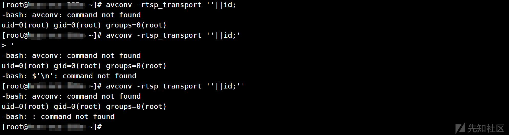因此通过上述代码分析很大程度不是作为独立的系统命令执行。

# 数据库文件泄露

命令执行的代码分析就到这里结束，这里进行一下白盒测试，发现两个SQL文件泄露，随便像sql、bak、db、zip文件在白盒代码审计的时候都是很容易发现的，这里网站根目录泄露了一个sql文件，打开直接搜索password，account，user等字段查查有没有密码，这里刚好泄露一个密码

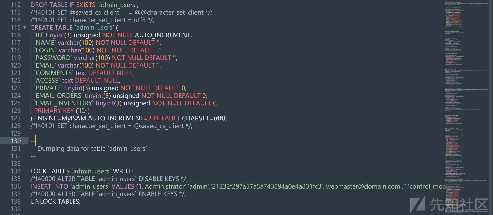

直接使用md5解密，admin

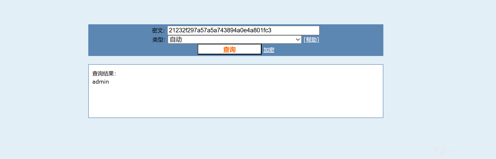

对目标进行批量访问测试，发现仅有两个实例可被成功访问，其余均返回403错误代码，应该是做了访问限制措施。

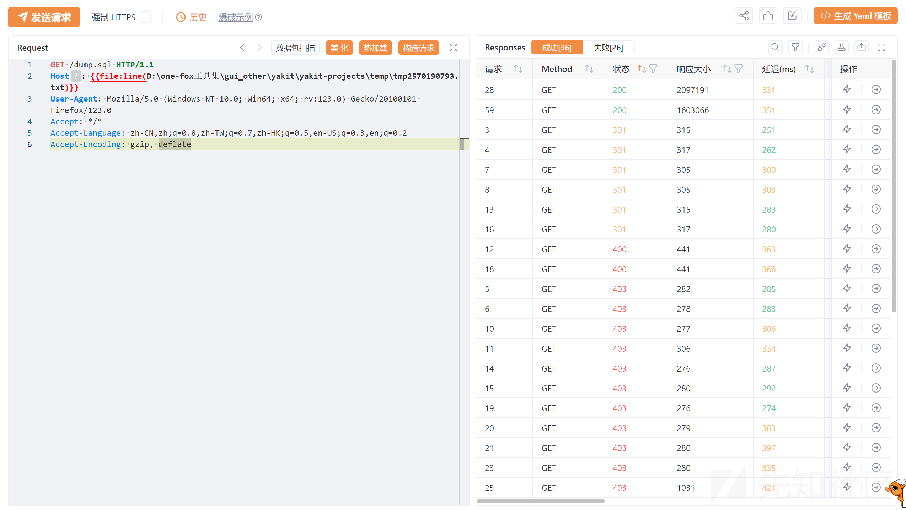

不过这里通过一个脚本还扫出来许多，其中有一个db.sql文件，打开查看发现和上面一个SQL文件内容差不多，但是路径不一样

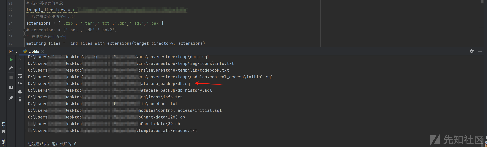

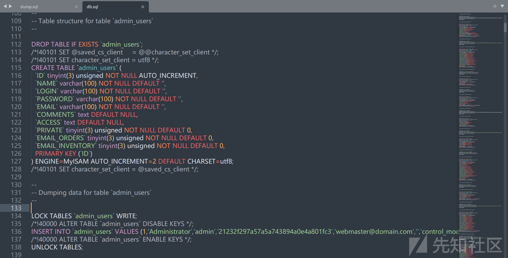

同样使用相同方法对db.sql进行访问，发现比第一个要多几个，猜测还是有一点通杀型的，sql文件太多了，其它就没有进行尝试了

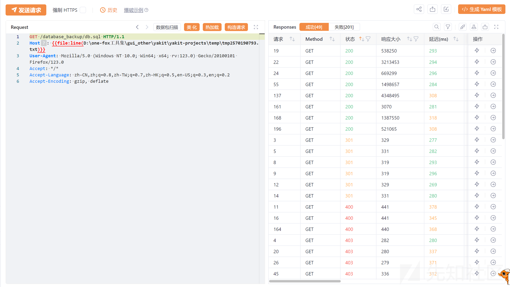

后面还有几个XSS，都懒得去看了，像白盒审计XSS，信息泄露，备份文件，SQL文件等等泄露太多了
