# VNCTF2025 逆向kotlindroid wp-先知社区

> **来源**: https://xz.aliyun.com/news/16997  
> **文章ID**: 16997

---

# 题解

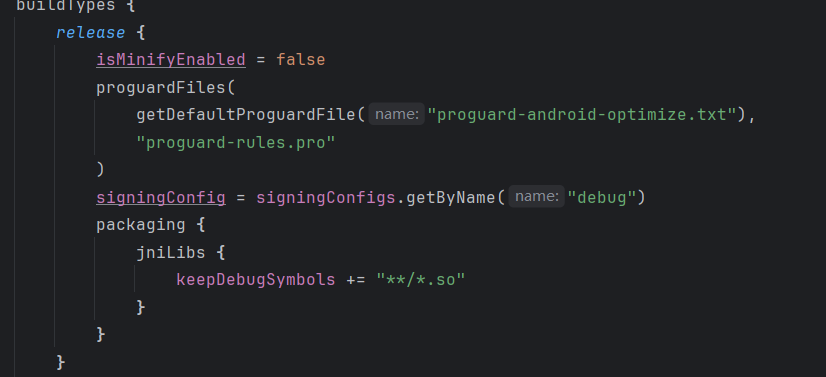

编译的时候开了proguard保护，然后保留了so的符号，用jadx反编译有问题，用jeb反编译

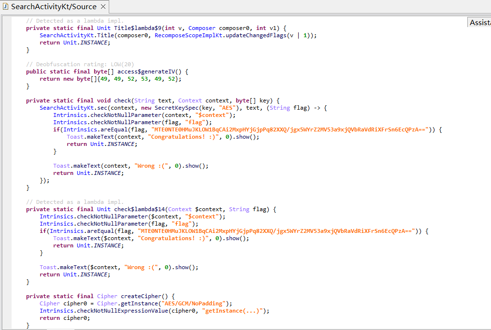

在searchactivity中发现关键逻辑，可以提取到加密模式为AES-GCM，iv为114514，密文为MTE0NTE0HMuJKLOW1BqCAi2MxpHYjGjpPq82XXQ/jgx5WYrZ2MV53a9xjQVbRaVdRiXFrSn6EcQPzA==


函数getGCMParameterSpec设置了tag为128位

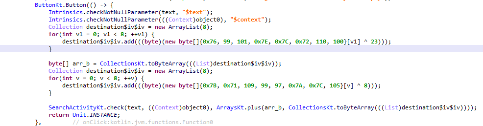

在button里面传了两个数组，异或之后可以得到key ：atrikeyssyekirta

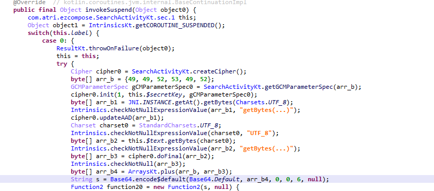

在sec函数里可以发现调用了JNI类获得了一段数组arr\_b1作为add的值，然后在最后把生成的密文放在了iv的后面

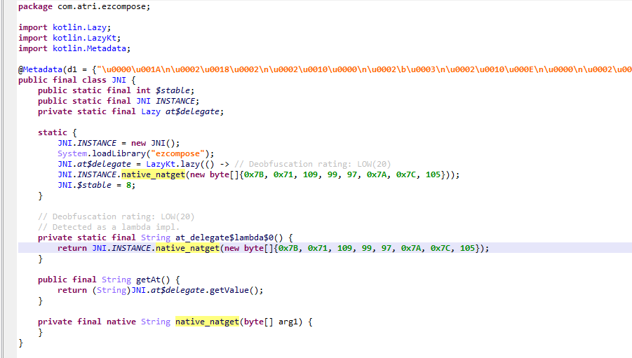

在jni里面调用了本地方法native\_natget传入了一段数组new byte[]{0x7B, 0x71, 109, 99, 97, 0x7A, 0x7C, 105}

由于每次返回的add值是一样的，也可以直接用frida或者动调获得返回值

也可以静态分析，这是一个用kotlin编写的so，已经保留了全部的符号，可以直接搜索找到native\_natget函数

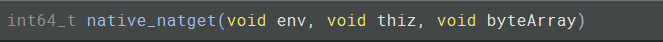

传了3个参数，最后一个是我们的数组

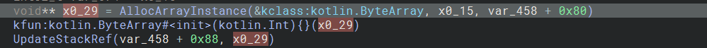

这里初始化了传入的数组创建了实例，然后入栈

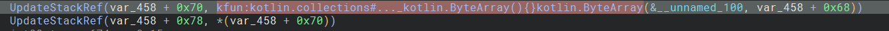

这里入栈了一段本地数据01 1f 09 11 15 1f 0e 0a 17


找到关键的加密循环

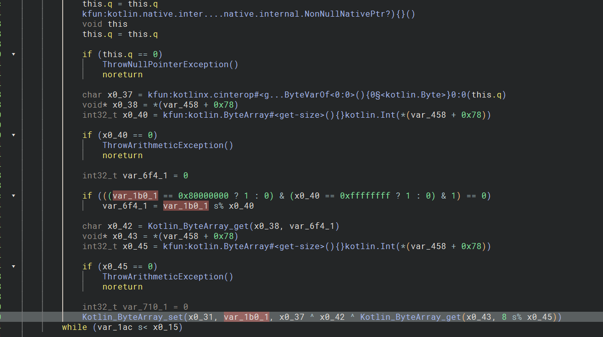

可以看到有两个异或，Kotlin\_ByteArray\_get(x0\_43, 8 s% x0\_45))取了本地数据01 1f 09 11 15 1f 0e 0a 17的第9个数据0x17，x0\_42是循环分别取前8位， x0\_37是取当前实例，这个实例就是之前初始化的传入的数组

根据逻辑可以解出来mysecret

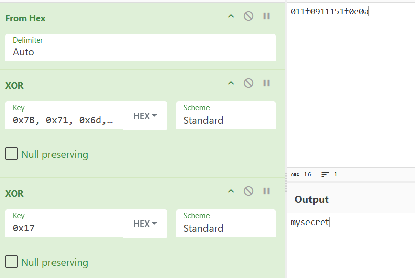

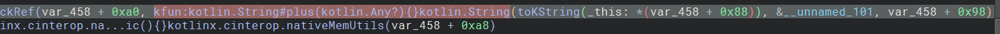

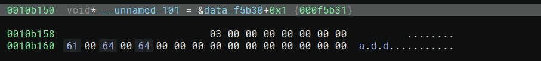

在后面可以发现有一个函数在mysecret后面加上了add这段字符串，然后传回给java层

最后根据获得的信息解密

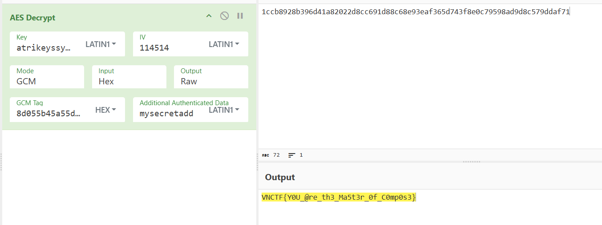

# native部分源码

```
import platform.android.*
import kotlinx.cinterop.*
import kotlin.experimental.ExperimentalNativeApi
import kotlin.experimental.xor

@OptIn(ExperimentalForeignApi::class, ExperimentalNativeApi::class)
@CName("native_natget")
fun native_natget(env: CPointer<JNIEnvVar>, thiz: jobject, byteArray: CPointer<ByteVar>): jstring {
    memScoped {
        val length = env.pointed.pointed!!.GetArrayLength!!(env, byteArray)
        val ktByteArray = env.pointed.pointed!!.GetByteArrayElements!!(env, byteArray, null)!!
        val xorKey = byteArrayOf(0x01,0x1f,0x09,0x11,0x15,0x1f,0x0e,0x0a,0x17)
        val resultBytes = ByteArray(length)
        for (i in 0 until length) {
            resultBytes[i] = ktByteArray[i] xor xorKey[i % xorKey.size] xor xorKey[8 % xorKey.size]
        }
        val resultString = resultBytes.toKString() + "add"
        env.pointed.pointed!!.ReleaseByteArrayElements!!(env, byteArray, ktByteArray, 0)
        return env.pointed.pointed!!.NewStringUTF!!.invoke(env, resultString.cstr.ptr)!!
    }
}


@OptIn(ExperimentalNativeApi::class, ExperimentalForeignApi::class)
@CName("JNI_OnLoad")
fun JNI_OnLoad(vm: CPointer<JavaVMVar>, preserved: COpaquePointer): jint {
    return memScoped {
        val envStorage = alloc<CPointerVar<JNIEnvVar>>()
        val vmValue = vm.pointed.pointed!!
        val result = vmValue.GetEnv!!(vm, envStorage.ptr.reinterpret(), JNI_VERSION_1_6)
        if(result == JNI_OK){
            val env = envStorage.pointed!!.pointed!!
            val jclass = env.FindClass!!(envStorage.value, "com/atri/ezcompose/JNI".cstr.ptr)
            val jniMethod = allocArray<JNINativeMethod>(1)
            jniMethod[0].fnPtr = staticCFunction(::native_natget)
            jniMethod[0].name = "native_natget".cstr.ptr
            jniMethod[0].signature = "([B)Ljava/lang/String;".cstr.ptr
            env.RegisterNatives!!(envStorage.value, jclass, jniMethod, 1)
            __android_log_print(ANDROID_LOG_INFO.toInt(), "hello", "this is kotlin native kotlin_onload, %d, %d", sizeOf<CPointerVar<JNINativeMethod>>(), sizeOf<JNINativeMethod>())
        }
        JNI_VERSION_1_6
    }
}
```
