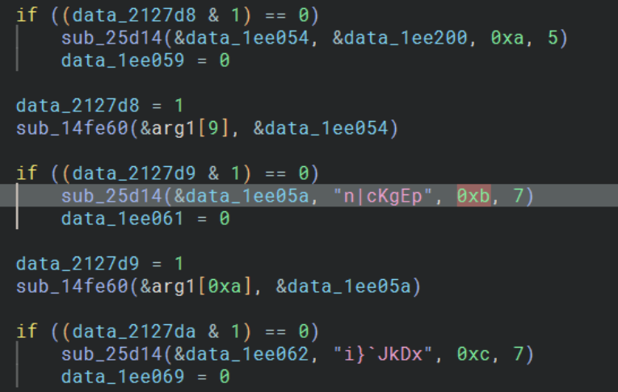
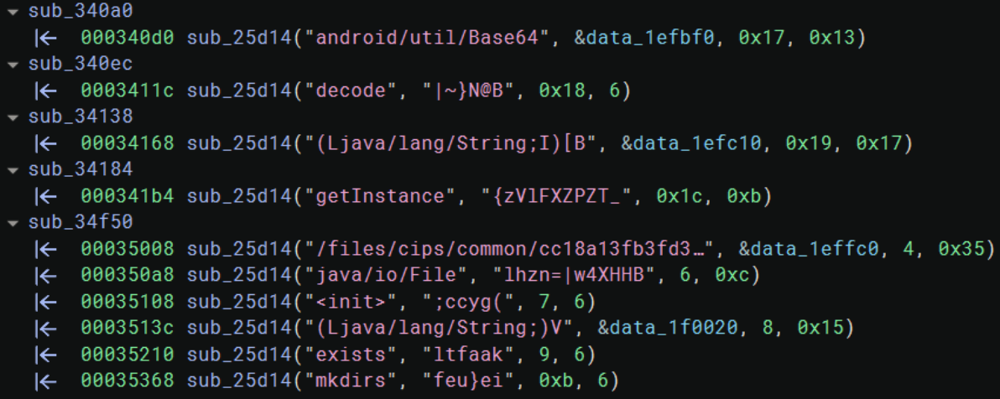
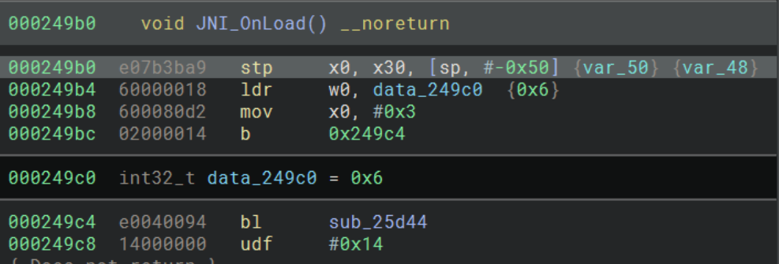
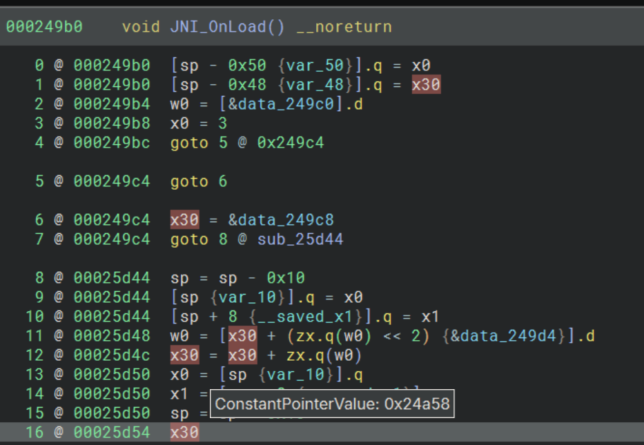
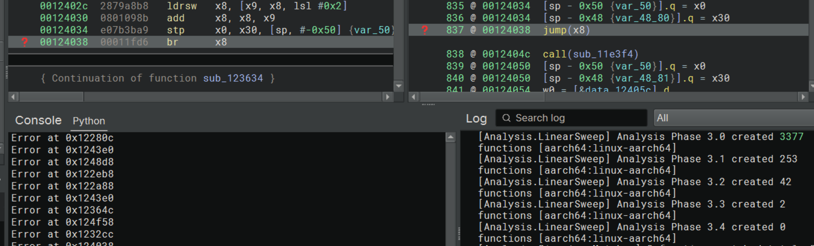
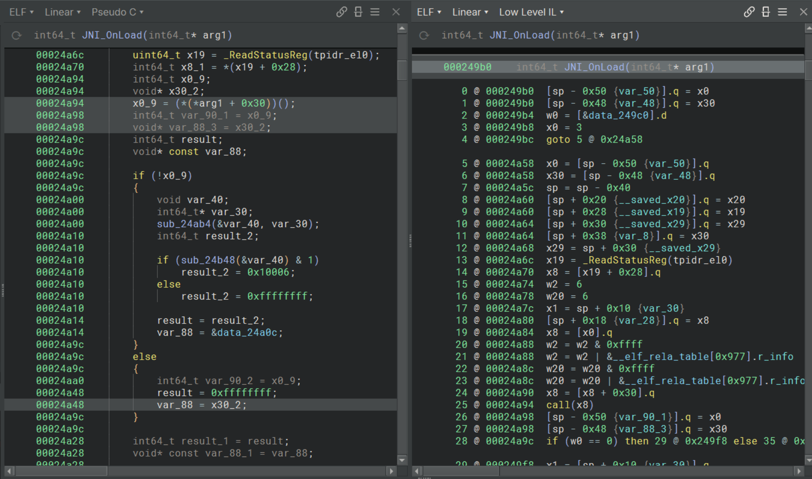
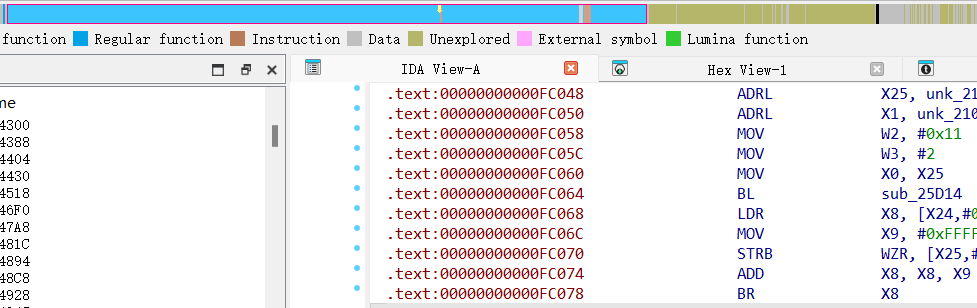

# 使用BinaryNinja分析某外卖libmtguard.so（一）-先知社区

> **来源**: https://xz.aliyun.com/news/16998  
> **文章ID**: 16998

---

# 前言

现在安卓native层的加固技术发展非常迅速，会有大量的混淆手段来干扰静态分析，而binaryninja作为一款非常强大而且灵活的二进制分析工具，在这些混淆手段面前比起ida会有很多更灵活方便的处理方式。在本文中，我们将深入分析某大厂app的native层，并使用binaryninja来去除这些阻碍分析的混淆

# 字符串加密

这个基本上是每个app都会有的，编译时将字符串加密，然后在运行时解密



可以发现25d14这个函数就是字符串加密函数，有4个参数，第一个存放解密后字符串，第二个是加密的字符串，第三个是密钥，第四个是长度，逻辑就是一个简单的密文和密钥异或，数量还是非常多的 ，需要写个脚本用模拟执行来处理

```
from binaryninja import *
from unicorn import *
from unicorn.arm64_const import *

@staticmethod
def page_down(addr: int) -> int:
    return addr >> 12 << 12

@staticmethod
def page_up(addr: int) -> int:
    return (addr >> 12 << 12) + 0x1000

def map_to_memory(bv: BinaryView, uc: Uc) -> None:
    segments = bv.segments
    start = page_down(segments[0].start)  # Get first segment
    end = page_up(segments[-1].end)  # Get last segment
    uc.mem_map(start, end - start, UC_PROT_NONE)
    for segment in segments:
        data = bv.read(segment.start, segment.length)
        uc.mem_write(segment.start, data)
        seg_start = page_down(segment.start)
        seg_end = page_up(segment.end)
        prot = UC_PROT_READ
        if segment.executable:
            prot |= UC_PROT_EXEC
        if segment.readable:
            prot |= UC_PROT_READ
        if segment.writable:
            prot |= UC_PROT_WRITE
        try:
            uc.mem_protect(seg_start, seg_end - seg_start, prot)
        except UcError as e:
            print(f"Error: {e}")
    base = (end >> 12 << 12) + 0x1000
    size = 0x10000000
    uc.mem_map(base, size, UC_PROT_READ | UC_PROT_WRITE)
    uc.reg_write(UC_ARM64_REG_FP, base)
    uc.reg_write(UC_ARM64_REG_SP, base + size // 2)
 
def code_hook(uc:Uc, addr, size, userdata):
    global emu
    if addr == 0x25d14:
        if uc.reg_read(UC_ARM64_REG_X0) == 0:
            uc.emu_stop()
            emu = False

def decodestr(bv: BinaryView, uc: Uc):
    refs = bv.get_code_refs(0x25d14)
    for i in refs:
        emu = True
        mlbb = bv.get_basic_blocks_at(i.address)[0]
        start = mlbb.start
        j=0
        while mlbb[j][0][2].text != '0x25d14': 
            if mlbb[j][0][0].text == 'bl' or mlbb[j][0][0].text == 'b':
                start = mlbb[j].address + 4
            j+=1
        uc.hook_add(UC_HOOK_CODE, code_hook)    
        uc.emu_start(start, 0x25d40)
        if emu:
            x0 = uc.reg_read(UC_ARM64_REG_X0) 
            x9 = uc.reg_read(UC_ARM64_REG_X9)
            decode = uc.mem_read(x0, x9)
            bv.write(x0, decode)
        uc.reg_write(UC_ARM64_REG_X0, 0)
if __name__ == '__main__':
    uc=Uc(UC_ARCH_ARM64, UC_MODE_ARM)
    map_to_memory(bv, uc)
    decodestr(bv, uc)
```

可以看到字符串基本都被解密出来，写脚本的时候要注意执行bl sub\_25d14之前不能有别的跳转指令，以及第一个参数也就是寄存器x0要被正确赋值



# 基于ret的间接跳转

间接跳转的应用也是非常广泛，可以有效的干扰逆向工具分析程序执行流，下面是原本的so在ida里分析之后的样子


可以看到有大量爆红的地方，而爆红的原因就是使用了间接跳转干扰了执行流，而25d44就是跳转函数

使用bn来分析这个函数，在low Level IL里面可以看到bn已经帮我们大致分析出了跳转逻辑


主要逻辑就是从 x30 寄存器（通常用作链接寄存器，用于存储返回地址）所指向的地址加载数据到 w0 寄存器。这里有一个 zx.q(w0)，它表示扩展 w0 为 64 位（zx.q），并将它左移 2 位，然后从x30 + w0 <<2 计算出来的地址加载一个双字到w0，最后再加上x30本身就是要跳转的地址



以jni\_onload为例，从调用25d44的地方可以发现，是通过bl指令将x30设置在0x249c8这个位置，然后x0被赋值为3，就可以计算跳转地址。这里我们利用bn的一个特性，将25d14进行inline分析，在low Level IL里可以看到bn已经自动帮我计算出了x30的值为0x24a58，因为inline了之后在同一个函数中，bn就会自动传播变量的值



当然仅仅计算出了跳转地址是不够的，由于间接跳转非常多，可以发现在跳转到25d14之前都会有一个跳板，比如jni\_onload里面的b 0x249c4，而我们的思路就是用模拟执行计算出跳转地址，然后patch到跳板那里

我们顺着刚才的字符串解密脚本往下写一个deindbr函数来patch，写脚本的时候要注意一个坑点，构造b指令时，跳转地址要减去本身的地址，因为B指令是相对跳转指令，是根据当前PC寄存器的值加上偏移来实现跳转的，计算方式是：指令所要跳转到的标号地址=执行这条指令时PC的值（这条指令的地址值+8，预取指的原因）+机器码中的立即数\*4 ，所以它和代码在内存中的位置无关。

```
def deindbr(bv: BinaryView, uc: Uc):
    jump_table = bv.get_code_refs(0x25d44)
    ref_table = [ref.address for ref in jump_table]
    xref_table = []
    for xref in ref_table:
        p=bv.get_code_refs(xref)
        for i in p:
            if i.address not in xref_table:
                xref_table.append(i.address)
    for i in xref_table:
        if bv.get_disassembly(i)[0:2] == 'b ':
            uc.reg_write(UC_ARM64_REG_X0, 0)
            uc.reg_write(UC_ARM64_REG_X30, 0)
            try:
                print(f"emulating at {hex(i)}")
                uc.emu_start(i-0x4, 0x25d50)
                x30=uc.reg_read(UC_ARM64_REG_X30)
                opcode = bv.arch.assemble(f"b {hex(x30-i)}",addr=i) 
                bv.write(i, opcode)
            except:
                print(f"Error at {hex(i)}")
```

刚好每个跳板的前一条指令刚好都是赋值x0的指令，所以我们只要从赋值x0这条指令处开始执行，执行完add x30, x30, w0, uxtw到0x25d50结束，再读取x30的值，patch到跳板的地址，就可以去除这个间接跳转恢复程序的执行流。

基本思路就是先获取所有跳转到0x25d44的引用，然后再获取所有跳板的引用，获取所有跳板的地址之后开始模拟执行。其中我不知道为什么获取到的跳板地址中有br 寄存器类型的引用，导致一直在报错，所以我增加了bv.get\_disassembly(i)[0:2] == 'b ': 这样的判断，而br 寄存器这种混淆我将会在下一篇文章中分析。由于bn并不会像ida那样反编译所有的代码，无法一次性获取所有引用，所以要多运行几次脚本直到没有地址被patch



最后patch完成之后就可以正常分析了，修复好的JNI\_Onload



此时用ida打开可以看到唯一爆红的地方就是刚才提到的br混淆了，我将在下一篇文章中分析它。



# 总结

可以发现binaryninja配合unicorn在处理这些混淆上面非常方便，通过以上的操作我们已经基本可以恢复程序的执行流，当然现在的混淆手段越来越复杂，而且大部分的apk编译时都是会去符号的，后面还是得恢复符号，结合frida，unidbg等工具来分析内部逻辑。
