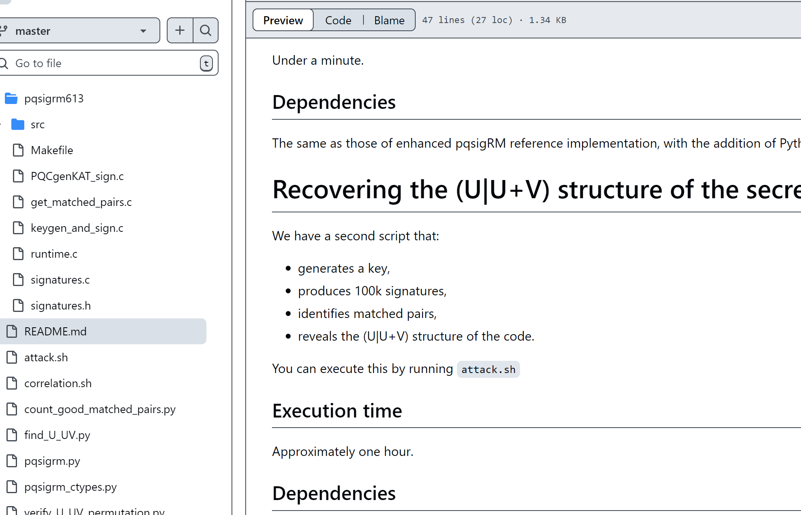
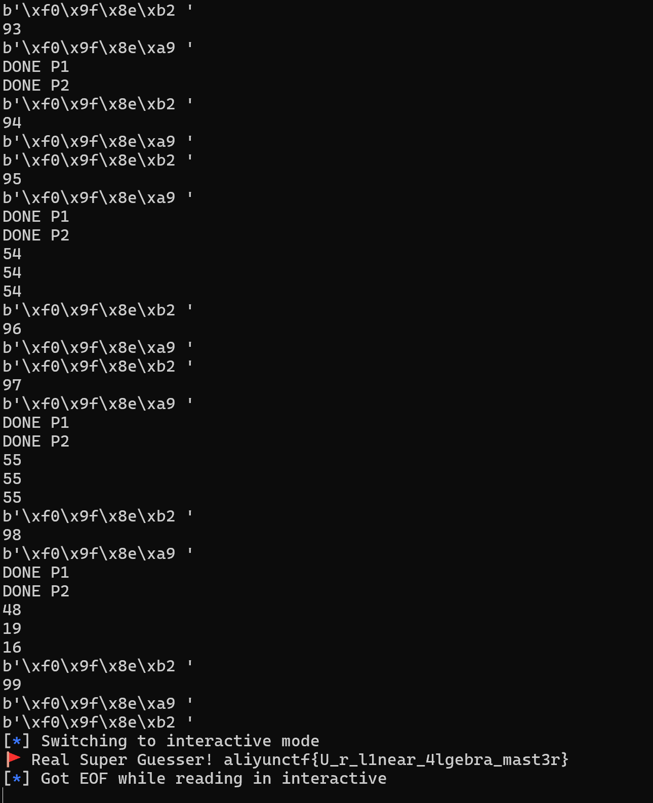

# Aliyunctf -LinearCasino-先知社区

> **来源**: https://xz.aliyun.com/news/17008  
> **文章ID**: 17008

---

# aliyunctf2025

## LinearCasino

Are you Super Guesser


### 题目

```
alarm(120)
n, d1, d2 = 100, 60, 50
FLAG = "aliyunctf{REDACTED}"
print("😊 LinearCasino is the Game 4 Super Guesser.")
for _ in range(100):
    D1 = random_matrix(GF(2), d1, n)
    D2 = random_matrix(GF(2), d2, n)
    A = random_matrix(GF(2), d1+d2, d1+d2)
    B = [random_matrix(GF(2), d1+d2, 2*n), block_matrix([[D1, D1],[0, D2]])]
    C = Permutations(2*n).random_element().to_matrix()
    ct = [A*B[0]*C, A*B[1]*C]
    decision = randint(0,1)
    a = int(''.join(map(str, ct[decision].list())),2)

    print("🎩", int(''.join(map(str, ct[decision].list())),2))
    assert input("🎲 ") == str(decision)
print(f"🚩 Real Super Guesser! {FLAG}")
```

### 题解

要求在 120 秒内连续 100 次正确猜出 `decision` 的值（0 或 1）。每次循环会生成多个矩阵，经过一系列运算得到 `ct[0]` 和 `ct[1]`，随机选择其中一个转换为整数 `a` 输出，我们要根据这个 `a` 猜出对应的 `decision`。解题的核心在于找出 `a` 与 `decision` 之间的规律，由于 `B` 中两个矩阵一个随机一个有特定块结构，我们可以从矩阵运算的结果特征来分析。  
$$  
\begin{bmatrix}  
D\_1 & D\_1   
0 & D\_2  
\end{bmatrix}  
$$  
D1 60\*100随机矩阵

D2 50\*100随机矩阵

`C` 是一个 **随机置换矩阵**，由 `Permutations(2 * n).random_element()` 生成

他们都是通过在有限域 GF(2) 上生成的随机矩阵

结构化矩阵A \* B[1] \*C以通常的方式进行混淆A \* B[1] \*C：列是随机排列的，我们得到了矩阵行空间的随机基。这两种变换都不会改变解的权重。

经过查询在github上发现了[pqsigRM/find\_U\_UV.py at master · vvasseur/pqsigRM (github.com)



然后发现idekctf中的一道密码题有对此代码的应用

要求 assert (2 \* ku - kv <= n//2)

根据题目中对应的n,d1,d2，更改参数n,ku,kv

题目中：n, d1, d2 = 100, 60, 50

更改参数：

n = 200  
 ku = 50  
 kv = 40

改完参数，尝试自己生成，进行测试验证

```
F2 = GF(2)
n = 200
ku = 50
kv = 40
Hu = random_matrix(GF(2), kv, n//2, implementation = "m4ri")
Hv = random_matrix(GF(2), ku, n//2, implementation = "m4ri")
Hs = block_matrix(GF(2), [
    [Hv, Hv],
    [Hu, 0]
])

while (S := random_matrix(GF(2), n//2, n//2, implementation = "m4ri")):
    if S.is_invertible():
        break

perm = list(range(n))
random.shuffle(perm)
P = Matrix(GF(2), [[1 if i == perm[j] else 0 for j in range(n)] for i in range(n)], implementation = "m4ri")

# Usual obfuscation of the code
Hpub = S * Hs * P
```

测试时还需要再调整Hs矩阵调整为[[Hv,Hv],[0, Hu]]

经过测试后，运行到find\_swaps这个函数会卡住，while循环中的 rank > dimA会一直成立，但是经过测试有两种情况，如果Hs为随机矩阵则会卡在solve\_left这个函数；正常的Hv=[[Hv,Hv],[0, Hu]]会正常的运行但是 rank > dimA而陷入死循环。根据这个发现我们可以设置循环的次数以及超时机制，如果循环次数大于3则可以认为decision=1，反之如果超时了decision则为0。

这里时间要求alarm(120)

使用@func\_set\_timeout(1)

接受a，a = int(''.join(map(str, ct[decision].list())),2

将a 转化成矩阵：

```
binary_str = bin(a)[2:].zfill(110 * 200)
element_list = [int(bit) for bit in binary_str]
Hpub = Matrix(GF(2), 110, 200, element_list)
```

# exp

```
from itertools import chain
import random
import time

from func_timeout import func_set_timeout

def compute_equations(GPJ):
    N = GPJ.ncols()
    R = N // 2

    dim_VA = GPJ[:, :R].rank()
    dim_U = GPJ[dim_VA:, R:].rank()
    len_U2 = R - dim_U
    pivots_U = GPJ[dim_VA:, R:].pivots()
    supp_U2 = [R + i for i in range(R) if i not in pivots_U]

    # The permutation of two matched pairs in GP is in fact a linear operation
    # on GP * J. In this loop we precompute all the differences.
    equations_row = [matrix(GF(2), R, len_U2) for i in range(dim_VA)]
    for i in range(R):
        column_left = GPJ[:dim_VA, i]
        support_indices = [j for j, cj in enumerate(column_left) if cj[0] == 1]
        if i in pivots_U:
            r = pivots_U.index(i)
            row_right = GPJ[dim_VA + r, supp_U2]
            for j in support_indices:
                equations_row[j][i] = row_right
        else:
            i2 = supp_U2.index(R + i)
            for j in support_indices:
                equations_row[j][i, i2] = 1

    return equations_row, supp_U2

def apply_swaps(permutation, swaps):
    permutation_swapped = permutation[:]
    k = len(swaps)
    for i in range(0, len(permutation), 2 * k):
        for j in range(k):
            if swaps[j]:
                permutation_swapped[i + j], permutation_swapped[i + j + k] = (
                    permutation_swapped[i + j + k],
                    permutation_swapped[i + j],
                )
    return permutation_swapped


def find_swaps(GP, dimA=0):
    N = GP.ncols()
    R = N // 2

    J = matrix.block(
        [
            [matrix.identity(GF(2), R), matrix.identity(GF(2), R)],
            [matrix.identity(GF(2), R), 0],
        ]
    )

    swaps = [0 for _ in range(R)]

    GPJ = GP * J
    GPJ.echelonize()

    # The left side of GPJ has a rank equal to the dimension of V + A.
    # (A is the span of the appended rows.)
    dim_VA = GPJ[:, :R].rank()

    equations_row, supp_U2 = compute_equations(GPJ)

    # This heuristic finds a permutation while handling the appended rows. In
    # the end, the submatrix in the upper right corner of GPJ should have a
    # rank equal to `K_APP`.
    # For each row, a linear system can be solved to find suitable column
    # swapping that cancels that row if its component on A is zero. If not, we
    # append the row to our system, hoping that it is a vector of a basis of A.
    rank = GPJ[:dim_VA, R:].rank()
    c = 0
    while rank > dimA:
        print(rank)
        unsolved = []
        for j in range(dim_VA):
            if vector(GPJ[j, supp_U2]) == 0:
                continue

            A = equations_row[j]
            if unsolved:
                A = A.stack(GPJ[unsolved, supp_U2])

            try:
                sol = A.solve_left(vector(GPJ[j, supp_U2]))
            except Exception:
                unsolved.append(j)
                pass
            else:
                if sol[:R] != 0:
                    for i, pi in enumerate(sol[:R]):
                        if pi == 1:
                            GPJ[:, i + R] += GPJ[:, i]
                            swaps[i] ^= 1
                    GPJ.echelonize()

        rank = GPJ[:dim_VA, R:].rank()
        c += 1
        if c >= 3: return 1
    return 1

def prange_1(H, w, s):
    n = H.ncols() * 2
    for ind in range(n//2):
        pivots = H[:, ind:].pivots()
        pivots = [ind + x for x in pivots]

        try:
            e2 = H[:, pivots].solve_right(s)
        except:
            continue
        if e2.hamming_weight() == w:
            print("FOUND", ind)
            e = [0 for _ in range(n//2)]
            for i in range(len(pivots)):
                e[pivots[i]] = e2[i]
            e = vector(F2, e)
            assert(H * e == s)
            return e
    print("NOT FOUND")
    sys.exit(1)


def prange_2(H, w, s, x):
    n = H.ncols() * 2
    rho = x.hamming_weight()
    supp = x.support()
    perm = supp + [i for i in range(n//2) if i not in supp]

    Ht = H[:, perm]
    Htr = Ht.echelon_form()
    S = Ht.solve_left(Htr)

    Ht1 = Htr[:rho, rho:]
    Ht2 = Htr[rho:, rho:]
    sr = S * s
    sp1 = vector(F2, sr[:rho])
    sp2 = vector(F2, sr[rho:])
    e2 = prange_1(Ht2, w, sp2)
    e1 = sp1 + Ht1 * e2

    e = vector(F2, list(e1) + list(e2))
    e = vector(F2, [e[perm.index(i)] for i in range(n//2)])
    assert len(set(e.support()) - set(x.support())) == w
    assert (H * e == s)
    return e


@func_set_timeout(1)
def get_ans(Hpub):
    Hdual = Hpub.right_kernel().basis_matrix()
    FF = Hdual.stack(Hpub)
    hull = FF.right_kernel().basis_matrix()
    hullt = hull.T

    # Recover column by column
    zeros = [i for i in range(n) if hull[0][i] == 0]
    ones = [i for i in range(n) if hull[0][i] == 1]
    recov = []

    import itertools

    for a, b in itertools.combinations(zeros, 2):
        if hullt[a] == hullt[b]:
            recov.append((a, b))
    print("DONE P1")

    for a, b in itertools.combinations(ones, 2):
        if hullt[a] == hullt[b]:
            recov.append((a, b))
    print("DONE P2")

    pairs = {(min(x), max(x)) for x in recov}
    permutation = list(chain.from_iterable(zip(*pairs)))

    G = Hpub.right_kernel().basis_matrix()
    Gpub = G
    return find_swaps(G[:, permutation])

F2 = GF(2)
n = 200
ku = 50
kv = 40

from pwn import *
sys.set_int_max_str_digits(307307)
re = remote("121.41.238.106", 35105)
re.recvline()
for i in range(100):
    print(i)
    time.sleep(float(0.2))
    re.recvuntil(b" ")
    a = int(re.recvline().strip().decode())
    binary_str = bin(a)[2:].zfill(110 * 200)
    element_list = [int(bit) for bit in binary_str]
    Hpub = Matrix(GF(2), 110, 200, element_list)
    try:
        ans = get_ans(Hpub)
    except:
        ans = 0
    re.recvuntil(b" ")
    re.sendline(str(ans).encode())

re.interactive()
# re.close()


# Seq = (Hss * Peq).solve_left(Hpub)
# Seqinv = Seq ** -1
# assert Seq * Hss * Peq == Hpub
```


