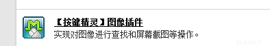
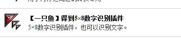
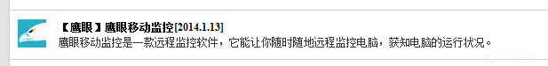
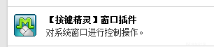
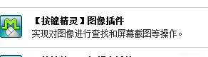
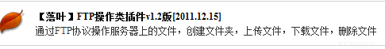
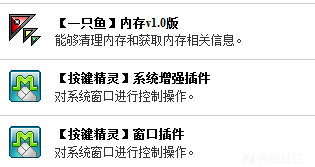
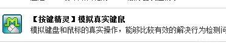
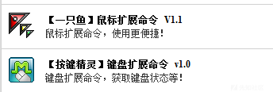
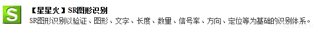

# 按键精灵也能玩出花来-先知社区

> **来源**: https://xz.aliyun.com/news/17009  
> **文章ID**: 17009

---

本文章仅供学习、研究、教育或合法用途。开发者明确声明其无意将该代码用于任何违法、犯罪或违反道德规范的行为。任何个人或组织在使用本代码时，需自行确保其行为符合所在国家或地区的法律法规。

开发者对任何因直接或间接使用该代码而导致的法律责任、经济损失或其他后果概不负责。使用者需自行承担因使用本代码产生的全部风险和责任。请勿将本代码用于任何违反法律、侵犯他人权益或破坏公共秩序的活动。

# 一·按键精灵介绍

按键精灵电脑版是一款自动化工具软件，主要用于实现鼠标和键盘操作的自动化。它通过模拟人工操作，帮助用户自动执行一些重复性任务，广泛应用于游戏辅助、工作流程自动化、测试自动化等领域。

### 主要功能介绍：

1. **脚本录制与回放**：

* 允许用户录制鼠标点击、键盘按键等操作，并生成脚本文件。之后可以通过回放这些脚本来自动执行任务。

1. **图像识别**：

* 可以通过识别屏幕上的图像来执行操作，例如点击特定图标、按钮或区域。这样即使界面发生变化，只要目标图像不变，按键精灵仍能正确操作。

1. **定时任务**：

* 用户可以设置定时任务，让按键精灵按照设定的时间自动执行特定的操作。对于需要定时进行的任务，如定时备份、刷新网页等，十分方便。

1. **批量操作**：

* 支持批量执行脚本，可以一次性处理多个任务。适用于重复性高、单调的工作。

1. **自动填充**：

* 对于需要大量重复填写的信息（如登录、表单提交等），按键精灵可以自动填充，节省用户时间。

1. **多线程与并发处理**：

* 支持多线程操作，可以并行执行多个任务，提高工作效率。

1. **调试和错误处理**：

* 提供调试功能，帮助用户检查脚本的执行过程。还支持错误处理，可以根据不同的错误类型采取相应的措施，如重试或停止执行。

1. **跨平台支持**：

* 虽然按键精灵的电脑版最为知名，但它也有一些跨平台版本，支持移动设备上的自动化功能。

1. **界面简洁易用**：

* 按键精灵电脑版提供了友好的用户界面，操作简单直观，即便是没有编程经验的用户也能轻松上手。

1. **任务管理与日志记录**：

* 按键精灵提供任务管理功能，可以查看历史任务的执行记录，便于管理和审查操作过程。

### 适用场景：

* **游戏辅助**：自动化刷副本、日常任务等。
* **办公自动化**：自动填写表单、批量处理文件等。
* **软件测试**：自动执行测试脚本，模拟用户操作。
* **数据采集**：自动抓取网页数据、处理信息等。

# 二·自定义脚本

按键精灵的自定义脚本语言是一种基于宏命令的编程语言，专门用于模拟键盘鼠标操作、图像识别等自动化任务。它的语法简单、易学，特别适合没有编程基础的用户进行快速上手，下面是其语法特征和语言基础的详细介绍。

### 1. **按键精灵自定义脚本语法特征**

* **简单的命令行结构**： 按键精灵的脚本是由一行一行的命令组成，类似于批处理脚本。每个命令通常对应一个特定的动作，如点击鼠标、按键、延时等。
* **支持注释**： 脚本中可以通过 `//` 或 `/* */` 来添加注释，用于描述代码功能、标明脚本的执行过程等，增强脚本的可读性。

示例：

```
// 这是一个注释
```

* **语句分隔符**： 每条语句以 `Enter`（回车）结束，可以通过空格或Tab键来缩进语句，增加脚本的可读性。
* **变量支持**： 按键精灵允许使用变量来保存数值、字符串等信息，可以方便地在脚本中进行数据存储和运算。

示例：

```
a = 10  // 定义变量a，并赋值为10
b = a + 5  // b = 15
```

### 2. **按键精灵语言基础**

* **常用命令**： 按键精灵自定义脚本语言内置了许多常用命令，下面是几个示例：

* **模拟按键操作**： 用于模拟按下、释放或输入字符。

```
KeyPress("A")  // 按下 A 键
KeyDown("Ctrl")  // 按住 Ctrl 键
KeyUp("Ctrl")  // 松开 Ctrl 键
```

```
- **模拟鼠标操作**： 用于模拟鼠标点击、移动等操作。
```

```
MouseMove(100, 200)  // 将鼠标移动到屏幕坐标 (100, 200)
MouseClick(100, 200)  // 在坐标 (100, 200) 处点击鼠标
MouseDoubleClick(100, 200)  // 双击鼠标
```

```
- **延时与等待**： 可以设置延时，让脚本在执行特定操作前等待一段时间。
```

```
Wait(5000)  // 等待5秒钟
```

```
- **图像识别**： 按键精灵支持通过图像识别来实现自动化操作。这需要事先截取图像并保存，然后在脚本中调用进行识别。
```

```
FindPic(100, 100, 200, 200, "button.png")  // 在指定区域内寻找图像 button.png
```

```
- **循环结构**： 支持常见的循环语句，如 `For` 和 `While`。
```

```
For i = 1 To 10
    MouseClick(100, 100)  // 执行点击操作
Next
```

```
- **条件判断**： 使用 `If` 语句判断条件，执行不同的操作。
```

```
If a > 10 Then
    MsgBox("a is greater than 10")
Else
    MsgBox("a is less than or equal to 10")
End If
```

* **内置函数**： 按键精灵提供了大量的内置函数，帮助用户实现复杂的任务。这些函数包括字符串处理、文件操作、系统控制等。

示例：

```
GetWindowText(hwnd)  // 获取窗口的文本
FileRead("file.txt")  // 读取文件内容
FileWrite("file.txt", "Hello, world!")  // 写入文件
```

* **数据类型**： 按键精灵支持常见的数据类型，如整数、浮点数、字符串、布尔值等。变量类型根据值的不同自动推断。

示例：

```
a = 10  // 整数类型
b = 3.14  // 浮点类型
c = "Hello"  // 字符串类型
d = True  // 布尔类型
```

* **函数和子程序**： 按键精灵支持定义函数（或称为子程序）来封装重复的操作，提高代码的重用性和可维护性。

示例：

```
Function MyFunction()
    MsgBox("Hello, world!")
End Function
```

### 3. **按键精灵脚本开发技巧**

* **分块调试**：编写脚本时可以将脚本拆分成多个小块，逐个进行调试，确保每个模块都能正常运行。
* **图像文件与坐标的精准度**：图像识别和坐标操作的准确性对自动化脚本的稳定性至关重要，建议在脚本编写过程中进行多次测试。
* **合理使用延时**：适当的延时能够确保脚本操作的稳定性，避免过快的操作导致程序崩溃或出现错误。

===================================================================

[具体教程](http://bbs.anjian.com/showtopic-699191-1.aspx)

===================================================================

# 三·样例代码

### 1. **自动点击广告并刷新页面**

这个脚本会模拟鼠标点击页面上的广告，并在完成后刷新页面。假设广告在固定区域，并且需要等待一段时间来确保广告已加载。

```
// 定义广告区域的图片（请替换为你实际广告图的路径）
adPic = "ad_button.png"

// 循环进行广告点击和页面刷新
While True
    // 查找广告图片
    adPos = FindPic(0, 0, 1920, 1080, adPic)
    
    If adPos <> 0 Then
        // 如果找到广告，点击它
        MouseMove(adPos[0], adPos[1])
        MouseClick(adPos[0], adPos[1])
        
        // 等待广告加载
        Wait(3000)
        
        // 刷新页面
        KeyPress("F5")
        
        // 等待一段时间后再执行下一次点击
        Wait(5000)
    Else
        // 如果没有找到广告，等待再试
        Wait(1000)
    End If
Wend
```

**说明：**

* `FindPic`用于找到广告的图像，并返回广告的位置。
* 如果找到广告，脚本将模拟鼠标点击广告并刷新页面。
* 循环执行，确保脚本不断运行并执行任务。

### 2. **自动登录并提交表单**

这个脚本用于模拟自动化登录流程，填写用户名和密码并提交表单。

```

// 定义用户信息
username = "your_username"
password = "your_password"

// 打开浏览器并加载登录页面（假设浏览器已打开）
ActivateWindow("Your Browser Window")

// 等待页面加载完成
Wait(2000)

// 填写用户名
SetText("username_field", username)  // 假设字段为 "username_field"

// 填写密码
SetText("password_field", password)  // 假设字段为 "password_field"

// 模拟点击登录按钮
MouseClick(200, 300)  // 点击坐标根据页面实际情况

// 等待登录操作完成
Wait(5000)

// 提交表单
MouseClick(400, 500)  // 提交按钮坐标

// 等待提交完成并返回首页
Wait(3000)
```

**说明：**

* 使用 `SetText` 填充用户名和密码字段。
* `MouseClick` 模拟鼠标点击操作，点击登录和提交按钮。
* 使用 `Wait` 控制延时，确保页面加载完成。

### 3. **自动截图并保存文件**

这个脚本自动捕捉屏幕截图并保存为文件，每隔一定时间自动截取一次。

```
// 定义截图保存路径
filePath = "C:\Screenshots\screenshot_"

// 每隔1分钟截图一次
While True
    // 获取当前时间戳作为文件名的一部分
    timestamp = GetTimeStamp()
    fileName = filePath + timestamp + ".png"
    
    // 截取当前屏幕并保存为文件
    CaptureScreen(fileName)
    
    // 等待1分钟
    Wait(60000)
Wend
```

**说明：**

* `CaptureScreen` 用于截图并保存为 PNG 文件。
* `GetTimeStamp` 获取当前的时间戳，用于生成唯一的文件名。
* 脚本每隔1分钟执行一次截图。

### 4. **自动化填写并提交多个表单**

这个脚本模拟填写多个表单并提交，适用于批量处理重复性的表单填写任务。

```
// 假设你有一个包含多个用户信息的数组
users = [["user1", "password1"], ["user2", "password2"], ["user3", "password3"]]

// 循环遍历用户数组，自动填写并提交表单
For i = 1 To 3
    username = users[i][0]
    password = users[i][1]

    // 填写用户名
    SetText("username_field", username)
    
    // 填写密码
    SetText("password_field", password)
    
    // 提交表单
    MouseClick(200, 300)  // 假设登录按钮位置
    
    // 等待提交结果
    Wait(3000)
    
    // 如果需要，返回主页或切换到下一个表单
    MouseClick(100, 150)  // 返回按钮坐标（假设有返回按钮）
    Wait(1000)
Next
```

**说明：**

* 使用二维数组 `users` 存储多个用户名和密码。
* 使用 `For` 循环遍历所有用户，逐个填写表单并提交。
* 每次操作后等待一定时间，以确保表单提交成功。

### 5. **自动执行游戏内日常任务**

这个脚本模拟在游戏中执行一些重复性的日常任务，比如击杀怪物、收集资源等。

```
// 假设游戏的任务按钮位置和击杀怪物区域已知

// 开始任务
While True
    // 激活游戏窗口
    ActivateWindow("Game Window")
    
    // 点击任务面板按钮
    MouseClick(300, 500)  // 任务面板按钮坐标
    
    // 等待任务加载
    Wait(2000)
    
    // 点击开始任务按钮
    MouseClick(400, 600)  // 开始任务按钮坐标
    
    // 等待任务进行
    Wait(5000)
    
    // 模拟击杀怪物
    MouseClick(600, 700)  // 假设怪物位置
    
    // 收集资源
    MouseClick(800, 900)  // 假设资源位置
    
    // 完成任务后返回任务面板
    MouseClick(300, 500)
    
    // 等待一段时间后再次执行任务
    Wait(10000)
Wend
```

**说明：**

* `MouseClick` 用于模拟点击按钮、击杀怪物、收集资源等操作。
* 每个操作后加入适当的 `Wait` 延时，确保任务顺利执行。

# 四·恶意利用

本代码仅供学习、研究、教育或合法用途。开发者明确声明其无意将该代码用于任何违法、犯罪或违反道德规范的行为。任何个人或组织在使用本代码时，需自行确保其行为符合所在国家或地区的法律法规。

开发者对任何因直接或间接使用该代码而导致的法律责任、经济损失或其他后果概不负责。使用者需自行承担因使用本代码产生的全部风险和责任。请勿将本代码用于任何违反法律、侵犯他人权益或破坏公共秩序的活动。

后文仅说思路，不多阐述代码

## 1·暴力破解







用以上几种插件实现自动识别验证码+密码填充爆破

## 2·yk（懂的都懂）








绕过屏幕拦截思路：实时截图，计算鼠标位置，发送模拟键鼠

## 3·ms（懂的都懂）





获取shellcode，注入内存，再加上一些窗口操作，理论上过掉所有Av

## 4·模拟键鼠

我之前文章讲过模拟键鼠可以绕过Av，这里有几个插件





## 5·反沙盒

思路：写一个先锋M用来访问[download](http://res.91anjian.com/Pc/qm2014chs.exe)，安装，然后导入一个反沙盒的键盘精灵脚本

脚本思路：用下列插件，检测云沙箱壁纸（或者关键像素点），理论上不会失效


