# 某读 数据包加密分析-先知社区

> **来源**: https://xz.aliyun.com/news/17031  
> **文章ID**: 17031

---

本文仅用于学习记录

​

app：5oWi6K+7{beihai\_deleteIDMuMjEuMAo=

## 抓包

用小黄鸟抓一下登录包

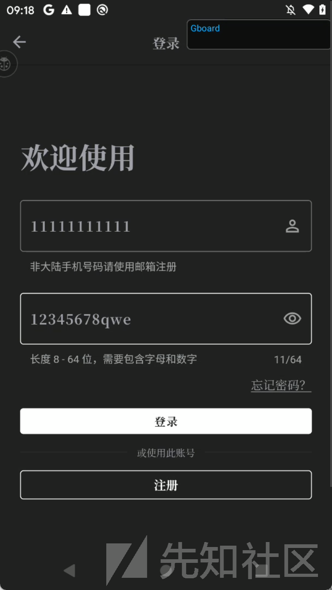

但是发现抓不到包。改用reqable的增强式抓包（强制捕获所有的流量）成功抓取，发现password字段进行了加密

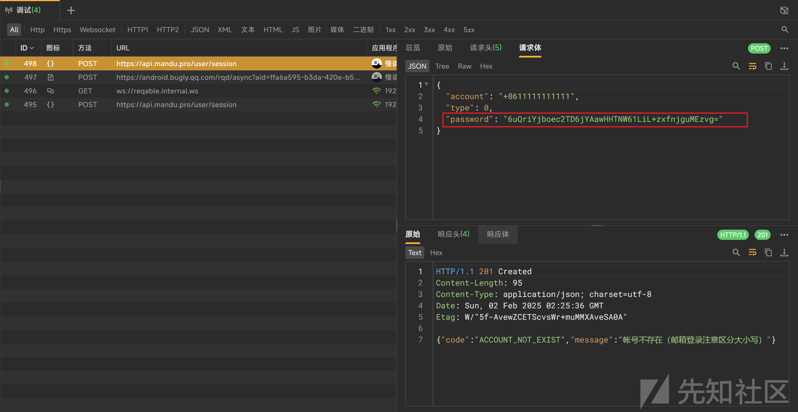

​

下面分析一下这个加密过程

反编译apk。结果发现这个app是用flutter混合开发的，怪不得小黄鸟抓不到包。

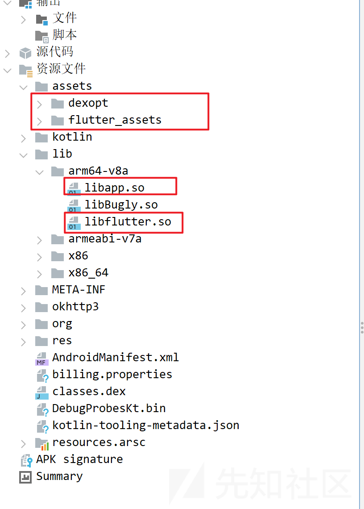

Flutter框架采用Dart 语言进行开发。

Dart语言标准库中的网络请求机制比较特殊，它不会通过用户设置的Wi-Fi代理来发送请求。如果app的网络请求代码使用了Dart标准库中的网络请求机制，常规的依赖代理的抓包工具就失效了

Dart SDK在Android 平台上，强制只信任系统目录下的证书。Flutter应用在运行时，默认不会信任用户自行安装的证书，只有当这些用户安装的证书被放置在Android系统的 /system/etc/security/cacerts目录中时，Flutter应用才会信任它们。这一规则是通过Dart源码中的 runtime/bin/security\_context\_linux.cc文件来实现的

​

除了使用reqable的增强模式，也可以通过hook脚本来绕过flutter网络请求机制

源码中`session_verify_cert_chain`函数会验证证书链，如果证书验证失败，会返回一个错误。对抗flutter机制的方法就是hook这个函数，将返回值改为true

​

先反编译libflutter.so，再通过ssl\_client字段定位到函数session\_verify\_cert\_chain

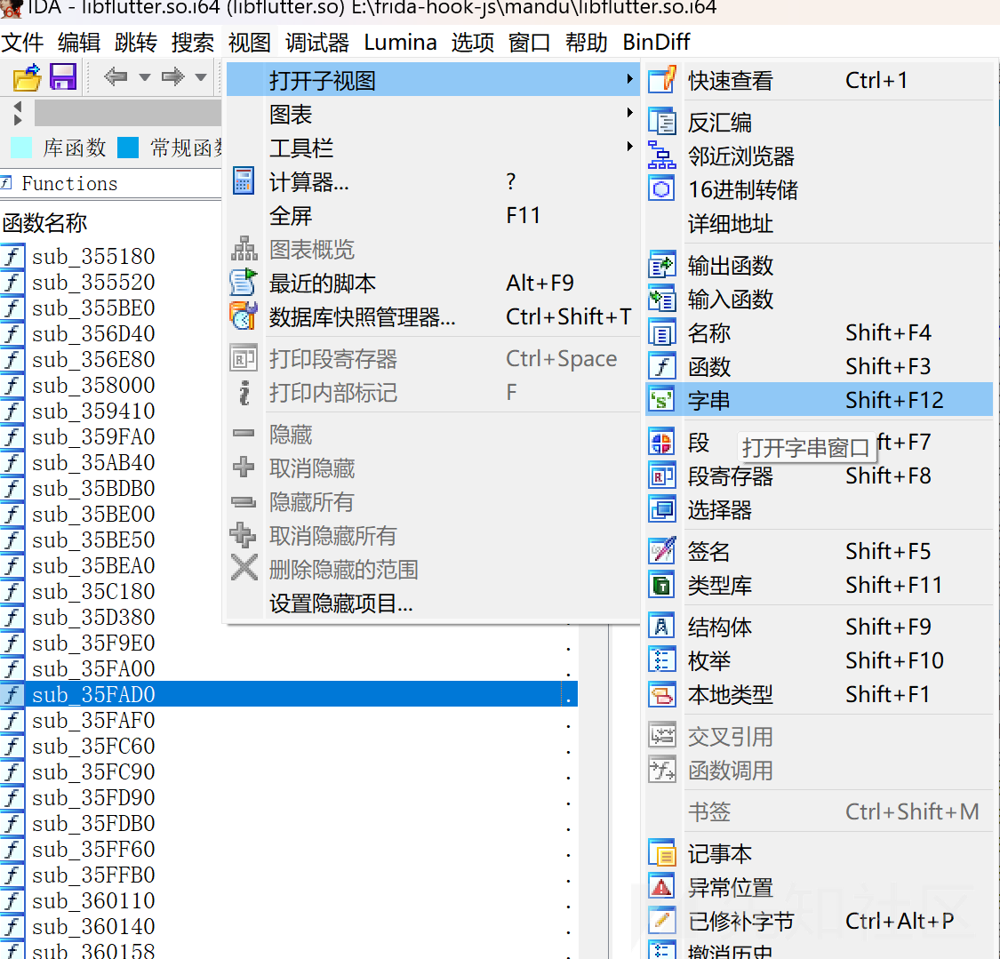

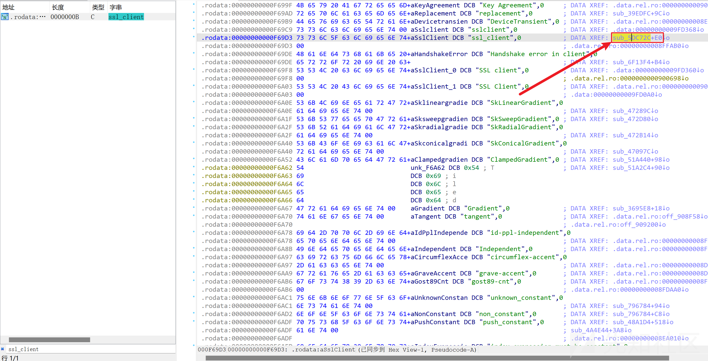

复制函数偏移，编写hook代码

​

```
function hook_dlopen() {
    var android_dlopen_ext = Module.findExportByName(null, "android_dlopen_ext");
    Interceptor.attach(android_dlopen_ext, {
        onEnter: function (args) {
            var so_name = args[0].readCString();
            if (so_name.indexOf("libflutter.so") >= 0) this.call_hook = true;
        }, onLeave: function (retval) {
            if (this.call_hook) hook_flutter2();
        }
    })
}
function hook_ssl_verify_result(address){
    Interceptor.attach(address, {
        onEnter: function (args) {
            console.log("Disable SSL validation");
        }, onLeave: function (retval) {
            console.log("Retval: ", retval);
            retval.replace(0x1);
        }
    })
}
function hook_flutter2() {
    var addr = Module.findBaseAddress("libflutter.so");
    var funcAddr = addr.add(0x5DC72C);
    console.log("Target function address: ", funcAddr.toString());
    hook_ssl_verify_result(funcAddr);
}
function main(){
    hook_dlopen();
}
setImmediate(main);
```

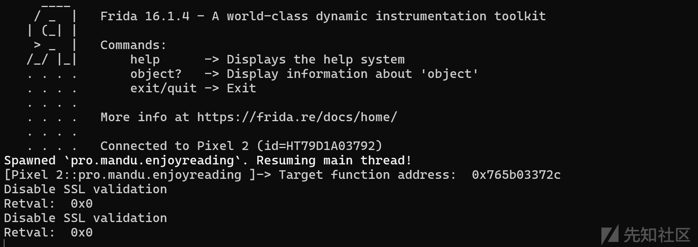

hook之后使用小黄鸟成功抓到包

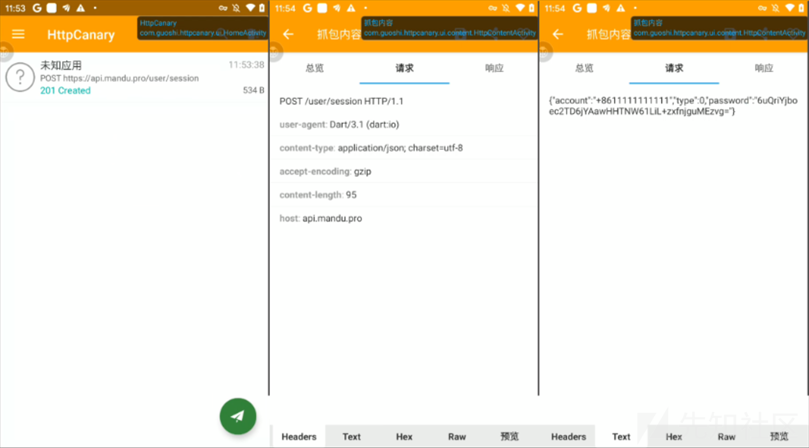

## 加密分析

既然是flutter开发的

那就祭出一手blutter(<https://github.com/worawit/blutter>)静态分析工具，分析libapp.so

因为直接反编译的结果没有类名函数名等具体的业务代码信息，如下图

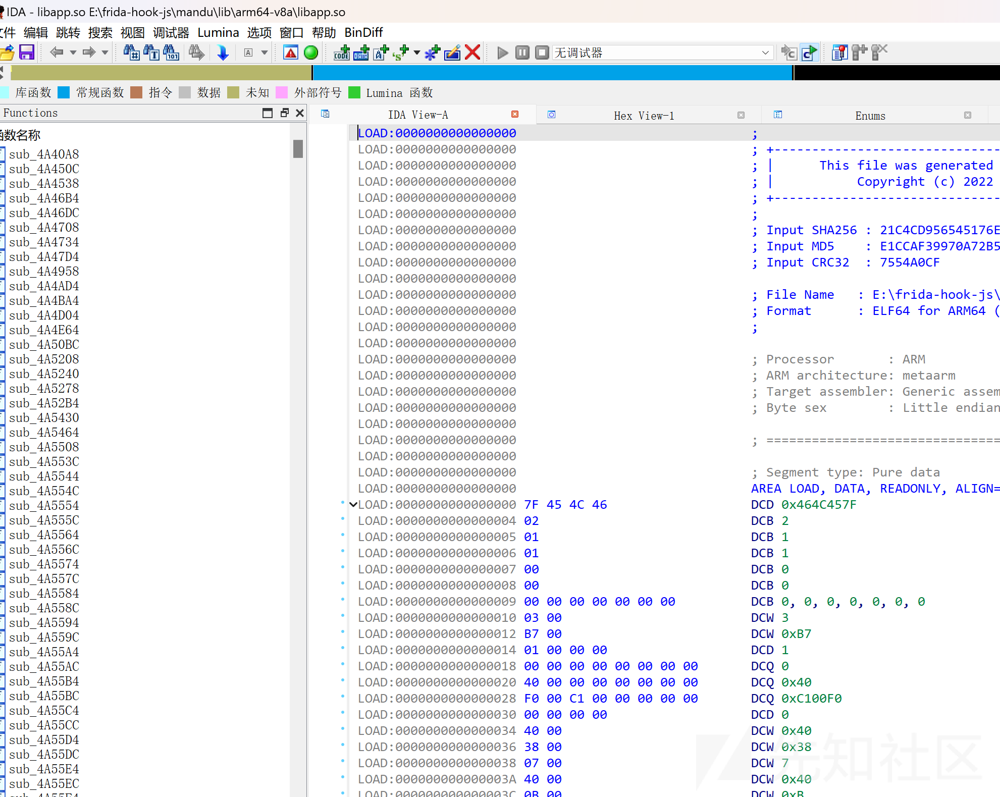

运行blutter

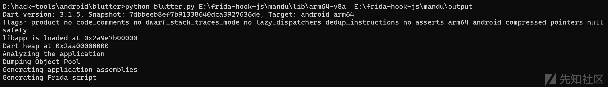

ida反编译libapp.so，导入blutter分析结果

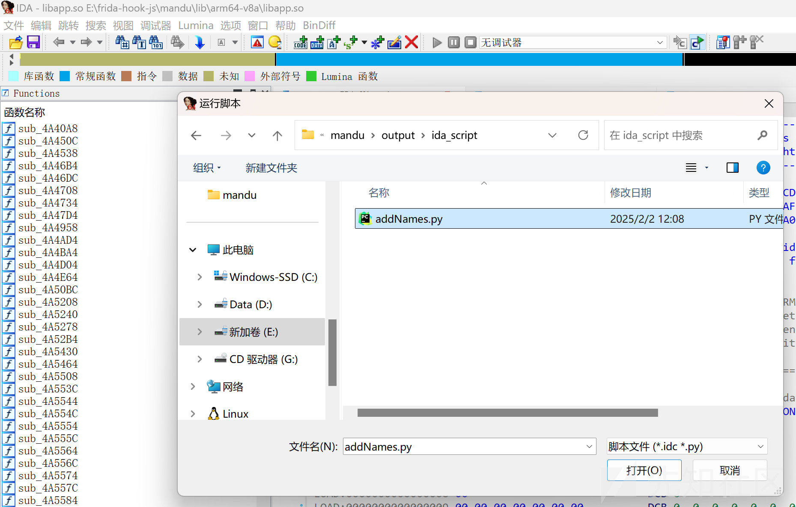

搜索关键字password，发现可疑函数，这个函数的偏移为0x723d00

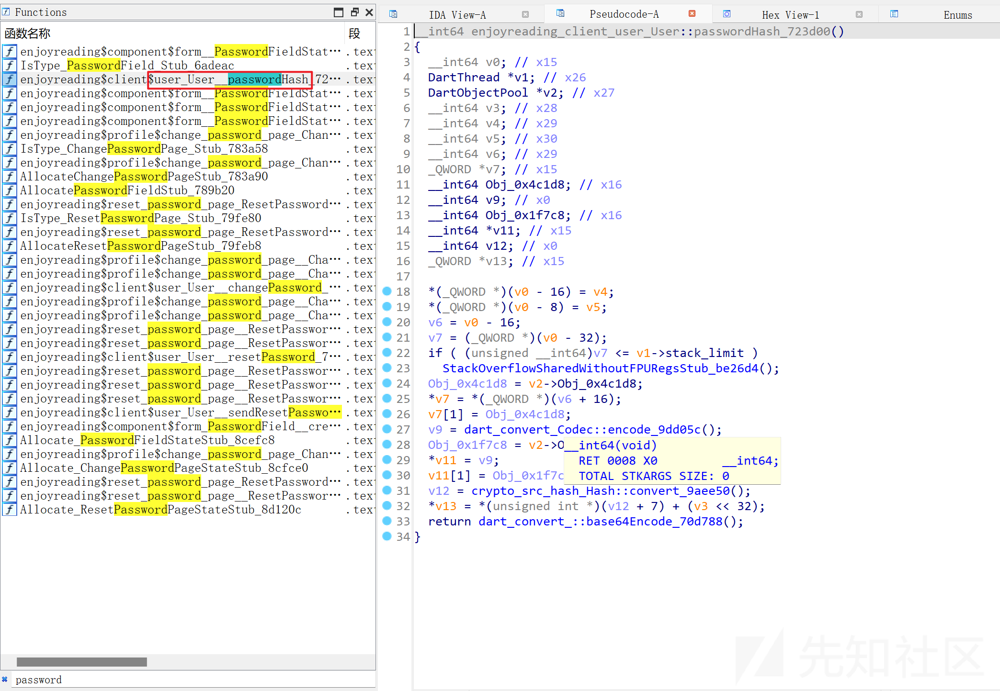

blutter已经生成了hook libapp的脚本，在output文件夹里

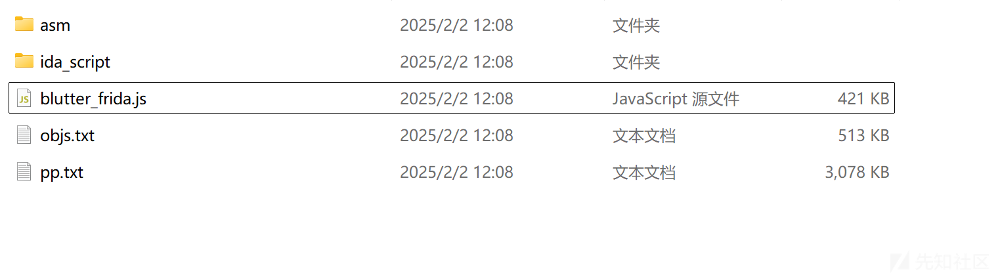

修改一下onLibappLoaded函数，添加一个dump函数就可以用了

```
function dumpArgs(step, address, bufSize) {
    var buf = Memory.readByteArray(address, bufSize)
    console.log('Argument ' + step + ' address ' + address.toString() + ' ' + 'buffer: ' + bufSize.toString() + '

 Value:
' +hexdump(buf, {
        offset: 0,
        length: bufSize,
        header: false,
        ansi: false
    }));
    console.log("Trying interpret that arg is pointer")
    console.log("=====================================")
    try{
    console.log(Memory.readCString(ptr(address)));
    console.log(ptr(address).readCString());
    console.log(hexdump(ptr(address)));
    }catch(e){
        console.log(e);
    }
    console.log('')
    console.log('----------------------------------------------------')
    console.log('')
}
function onLibappLoaded() {
    // xxx("remove this line and correct the hook value");
    const fn_addr = 0x723d00; //此处修改为你想hook的函数地址
    Interceptor.attach(libapp.add(fn_addr), {
        onEnter: function () {
            init(this.context);
            let objPtr = getArg(this.context, 0);
            const [tptr, cls, values] = getTaggedObjectValue(objPtr);
            console.log(`${cls.name}@${tptr.toString().slice(2)} =`, JSON.stringify(values, null, 2));
        },
        onLeave: function (retval) {
            dumpArgs(0, retval, 500);
        }
    });
}
```

运行，通过结果可以发现就是这个函数无疑

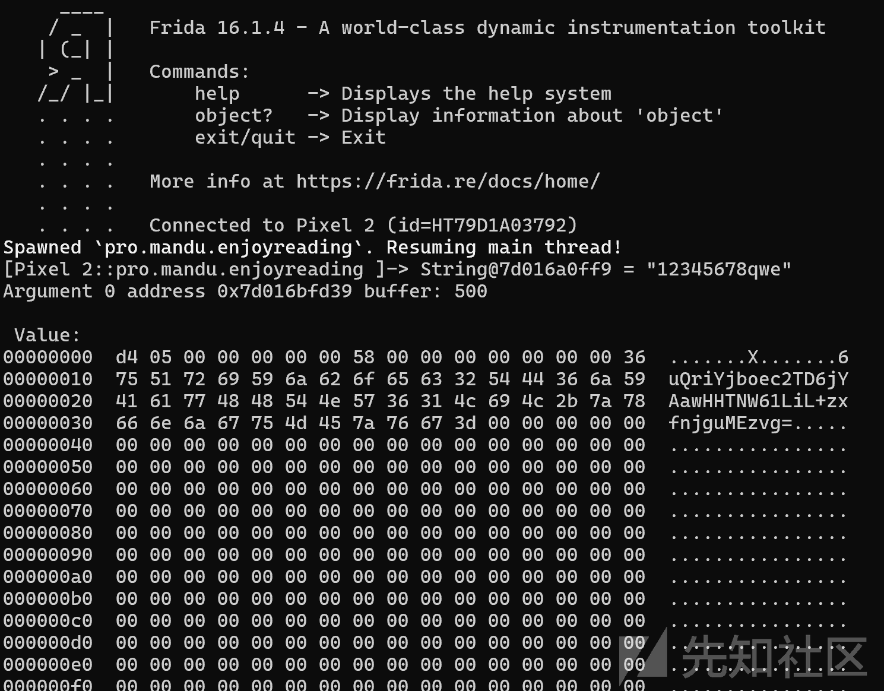

来看看这个函数的内容

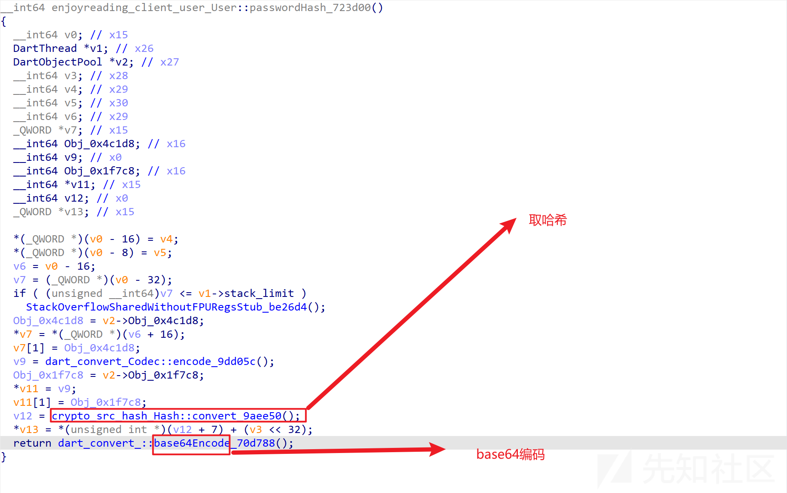

进入这个取哈希的函数，发现存在sha256和sha1两种

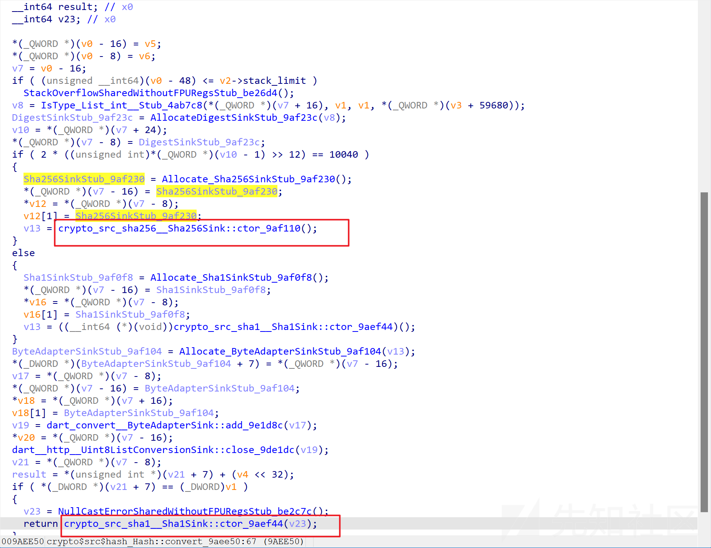

分别整个sha256和sha1的脚本跑一下

和app的加密结果对比发现代码里跑的是sha256

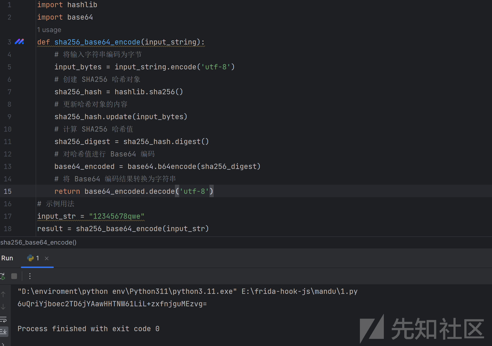

总结一下，password字段的加密方式就是简单使用了sha256哈希计算并进行 Base64 编码
