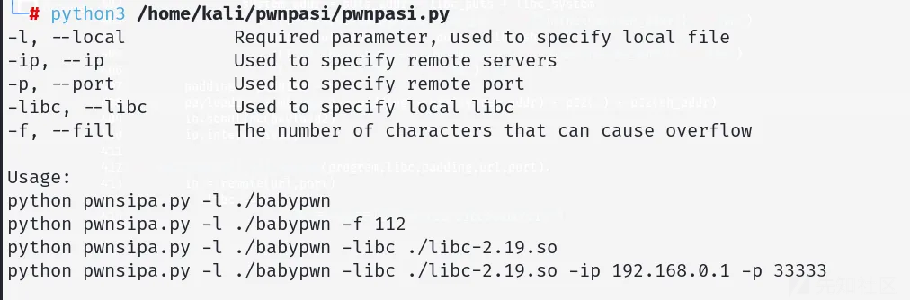
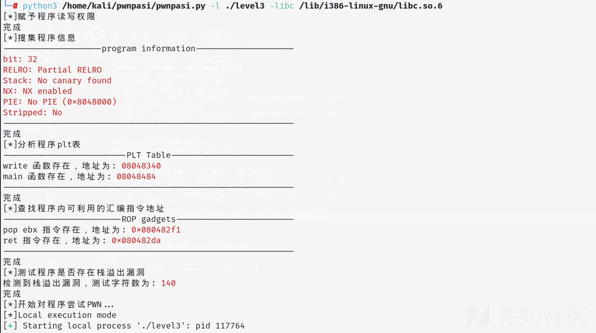
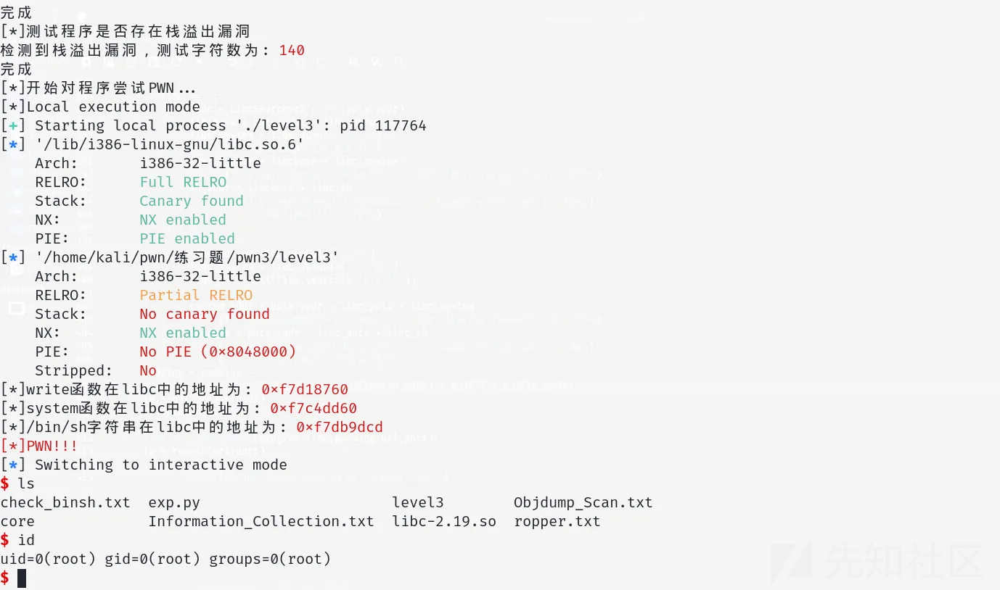

# pwnpasi CTF PWN一键栈溢出利用工具-先知社区

> **来源**: https://xz.aliyun.com/news/17034  
> **文章ID**: 17034

---

工具github地址：

```
https://github.com/heimao-box/pwnpasi
```







# pwnpasi

pwnpasi 是一款专为CTF PWN方向栈溢出入门基础题目开发设计的自动化工具，旨在帮助新手小白快速识别和利用32位和64位程序中的栈溢出漏洞。该工具能够自动判断溢出字符数，并生成相应的ROP链以利用漏洞。支持多种利用方式，包括调用system后门函数、puts函数ROP、write函数ROP以及syscall ROP。此外，工具还具备本地和远程利用功能，并集成了LibcSearcher库，用于在没有提供libc地址的情况下自动搜索合适的libc版本

## 使用说明安装依赖

确保已安装Python 3.x，安装所需依赖库：

```
pip3 install pwntools LibcSearcher
```

安装所需工具：

```
apt install checksec objdump strings
```

## 运行工具

通过命令行运行工具，指定目标程序和溢出字符数（可选）。示例命令：

```
python pwnsipa.py -l babypwn -libc ./libc-2.19.so
```

使用ldd工具可查看程序调用的动态链接库

```
ldd [文件名]
```


指定造成溢出的字符数：

```
python pwnsipa.py -l babypwn -libc ./libc-2.19.so -f 112
```

远程连接：

```
python pwnsipa.py -l babypwn -libc ./libc-2.19.so -ip 192.168.0.1 -p 33333
```

## 未来计划

完善64位程序的寄存器调用功能。

增加格式化字符串漏洞利用与绕过Canary防护

增加更多漏洞利用方式和支持的架构。

提升工具的自动化程度和用户友好性。
