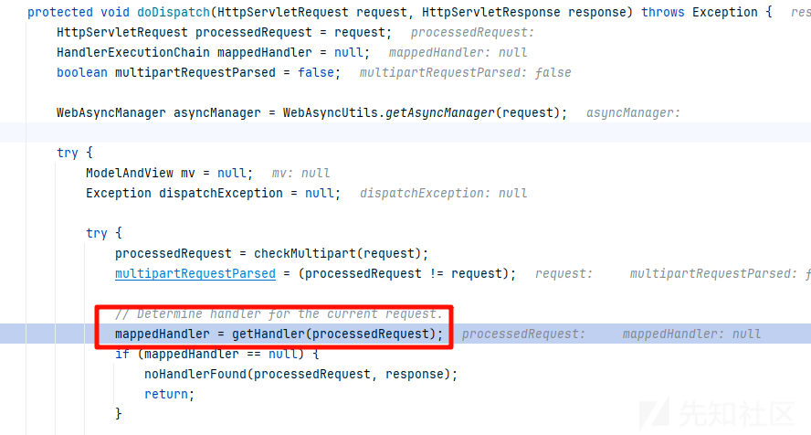
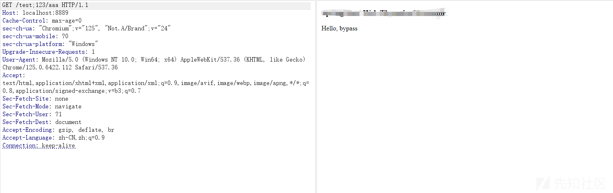
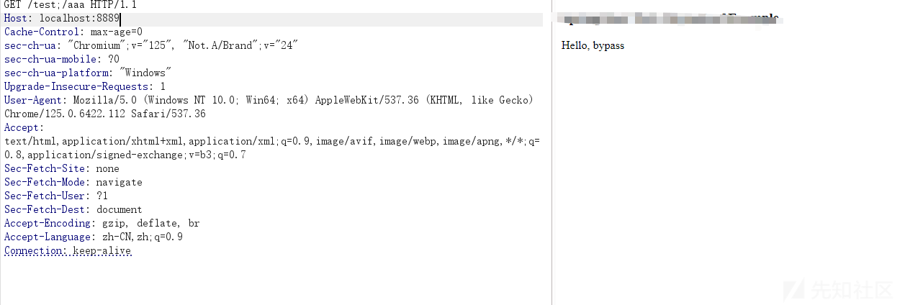
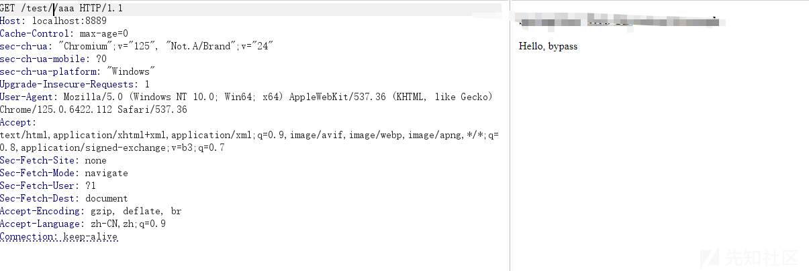
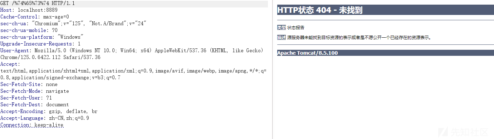
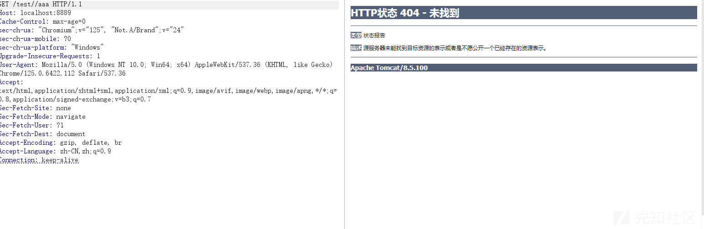
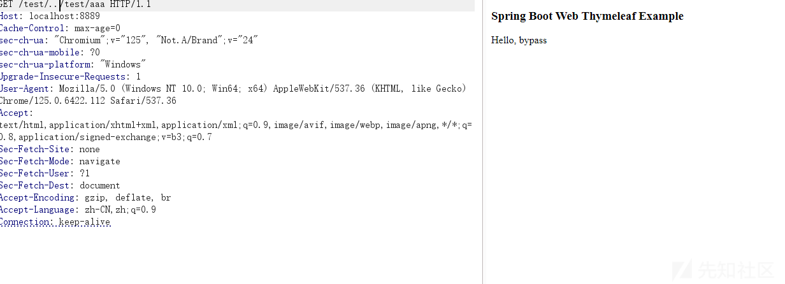

# spring架构解析路由过程&可能的绕过手法分析-先知社区

> **来源**: https://xz.aliyun.com/news/17051  
> **文章ID**: 17051

---

# spring架构解析路由过程&可能的绕过手法分析

## 前言

自从上次分析了CVE-2024-38816 Spring Framework 目录遍历漏洞后，发现其实历史上有很多的绕过，都是基他们对路由的，解析来绕过的，因为不同的框架对路由的解析都不相同，比如shiro和spring的解析差异导致的绕过，这里也来分析一下spring路由是如何解析path的

## 处理路由的几处逻辑

### getPathWithinApplication

首先spring的mvc模式中会有一个这样的过程，在路由分发的时候会调用doDispatch来处理这个流程



跟进getHandler方法

```
protected HandlerExecutionChain getHandler(HttpServletRequest request) throws Exception {
        if (this.handlerMappings != null) {
            for (HandlerMapping mapping : this.handlerMappings) {
                HandlerExecutionChain handler = mapping.getHandler(request);
                if (handler != null) {
                    return handler;
                }
            }
        }
        return null;
    }
```

具体的处理是从handlerMappings中获得的，其中处理路由只要是从这个map中获取的


之后会来到

```
protected HandlerMethod getHandlerInternal(HttpServletRequest request) throws Exception {
        String lookupPath = initLookupPath(request);
        this.mappingRegistry.acquireReadLock();
        try {
            HandlerMethod handlerMethod = lookupHandlerMethod(lookupPath, request);
            return (handlerMethod != null ? handlerMethod.createWithResolvedBean() : null);
        }
        finally {
            this.mappingRegistry.releaseReadLock();
        }
    }
```

调用站如下

```
getHandlerInternal:361, AbstractHandlerMethodMapping (org.springframework.web.servlet.handler)
getHandlerInternal:123, RequestMappingInfoHandlerMapping (org.springframework.web.servlet.mvc.method)
getHandlerInternal:66, RequestMappingInfoHandlerMapping (org.springframework.web.servlet.mvc.method)
getHandler:491, AbstractHandlerMapping (org.springframework.web.servlet.handler)
getHandler:1255, DispatcherServlet (org.springframework.web.servlet)
doDispatch:1037, DispatcherServlet (org.springframework.web.servlet)
```

然后跟进initLookupPath方法，这个方法是对我们的路径主要的处理

```
protected String initLookupPath(HttpServletRequest request) {
        if (usesPathPatterns()) {
            request.removeAttribute(UrlPathHelper.PATH_ATTRIBUTE);
            RequestPath requestPath = ServletRequestPathUtils.getParsedRequestPath(request);
            String lookupPath = requestPath.pathWithinApplication().value();
            return UrlPathHelper.defaultInstance.removeSemicolonContent(lookupPath);
        }
        else {
            return getUrlPathHelper().resolveAndCacheLookupPath(request);
        }
    }
```

#### usesPathPatterns为flase

那么来到resolveAndCacheLookupPath方法

```
public String resolveAndCacheLookupPath(HttpServletRequest request) {
        String lookupPath = getLookupPathForRequest(request);
        request.setAttribute(PATH_ATTRIBUTE, lookupPath);
        return lookupPath;
    }
```

跟进getLookupPathForRequest方法

```
public String getLookupPathForRequest(HttpServletRequest request) {
    String pathWithinApp = getPathWithinApplication(request);
    // Always use full path within current servlet context?
    if (this.alwaysUseFullPath || skipServletPathDetermination(request)) {
       return pathWithinApp;
    }
    // Else, use path within current servlet mapping if applicable
    String rest = getPathWithinServletMapping(request, pathWithinApp);
    if (StringUtils.hasLength(rest)) {
       return rest;
    }
    else {
       return pathWithinApp;
    }
}
```

path处理是在getPathWithinApplication方法，看name都知道

```
public String getLookupPathForRequest(HttpServletRequest request) {
        String pathWithinApp = getPathWithinApplication(request);
        
        if (this.alwaysUseFullPath  skipServletPathDetermination(request)) {
            return pathWithinApp;
        }
        String rest = getPathWithinServletMapping(request, pathWithinApp);
        if (StringUtils.hasLength(rest)) {
            return rest;
        }
        else {
            return pathWithinApp;
        }
    }
```

跟进getPathWithinApplication

```
public String getPathWithinApplication(HttpServletRequest request) {
        String contextPath = getContextPath(request);
        String requestUri = getRequestUri(request);
        String path = getRemainingPath(requestUri, contextPath, true);
        if (path != null) {
            // Normal case: URI contains context path.
            return (StringUtils.hasText(path) ? path : "/");
        }
        else {
            return requestUri;
        }
    }
```

可以看到返回的path是由contextPath和requestUri组成的，所以我们跟进去看看

**getContextPath**方法

```
public String getContextPath(HttpServletRequest request) {
        String contextPath = (String) request.getAttribute(WebUtils.INCLUDE_CONTEXT_PATH_ATTRIBUTE);
        if (contextPath == null) {
            contextPath = request.getContextPath();
        }
        if (StringUtils.matchesCharacter(contextPath, '/')) {
            // Invalid case, but happens for includes on Jetty: silently adapt it.
            contextPath = "";
        }
        return decodeRequestString(request, contextPath);
    }
```

第一个对我们路由的处理出现了

```
return decodeRequestString(request, contextPath);
```

跟进

```
public String decodeRequestString(HttpServletRequest request, String source) {
        if (this.urlDecode) {
            return decodeInternal(request, source);
        }
        return source;
    }
```

会继续url解码，但是这个一般返回的都为null

然后再跟进getRequestUri方法，主要就是获取uri后进行处理

```
public String getRequestUri(HttpServletRequest request) {
        String uri = (String) request.getAttribute(WebUtils.INCLUDE_REQUEST_URI_ATTRIBUTE);
        if (uri == null) {
            uri = request.getRequestURI();
        }
        return decodeAndCleanUriString(request, uri);
    }
```

重点跟进decodeAndCleanUriString方法

```
private String decodeAndCleanUriString(HttpServletRequest request, String uri) {
    uri = removeSemicolonContent(uri);
    uri = decodeRequestString(request, uri);
    uri = getSanitizedPath(uri);
    return uri;
}
```

我们看看idea本来的描述

```
Return the request URI for the given request, detecting an include request URL if called within a RequestDispatcher include.
As the value returned by request.getRequestURI() is not decoded by the servlet container, this method will decode it.
The URI that the web container resolves should be correct, but some containers like JBoss/Jetty incorrectly include ";" strings like ";jsessionid" in the URI. This method cuts off such incorrect appendices.
```

两个关键点

第一是解码，第二是处理;符号

然后回到方法看看具体是在什么时候执行的

跟进removeSemicolonContent

```
private static String removeSemicolonContentInternal(String requestUri) {
        int semicolonIndex = requestUri.indexOf(';');
        if (semicolonIndex == -1) {
            return requestUri;
        }
        StringBuilder sb = new StringBuilder(requestUri);
        while (semicolonIndex != -1) {
            int slashIndex = sb.indexOf("/", semicolonIndex + 1);
            if (slashIndex == -1) {
                return sb.substring(0, semicolonIndex);
            }
            sb.delete(semicolonIndex, slashIndex);
            semicolonIndex = sb.indexOf(";", semicolonIndex);
        }
        return sb.toString();
    }
```

首先寻找;符号的位置，然后寻找到/,然后会删除之间的内容，之后再次循环，举个例子

假设输入的字符串为：

```
String requestUri = "/example;param=value/test;id=123";
```

* 第一次循环：

* `semicolonIndex` 找到第一个 `;`（位于 "/example;"），然后找到下一个 `/`（"/test"）。
* 删除 `;param=value`，结果为 `/example/test;id=123`。

* 第二次循环：

* 继续找到第二个 `;`（位于 "/test;"），找到字符串结束。
* 删除 `;id=123`，结果为 `/example/test`。

最终返回 `/example/test`。

这里也是一个点后面绕过会说到

然后回去再看其他方法

```
decodeRequestString
```

```
public String decodeRequestString(HttpServletRequest request, String source) {
        if (this.urlDecode) {
            return decodeInternal(request, source);
        }
        return source;
    }
```

就是url解码

然后还有getSanitizedPath方法

```
private static String getSanitizedPath(final String path) {
        int index = path.indexOf("//");
        if (index >= 0) {
            StringBuilder sanitized = new StringBuilder(path);
            while (index != -1) {
                sanitized.deleteCharAt(index);
                index = sanitized.indexOf("//", index);
            }
            return sanitized.toString();
        }
        return path;
    }
```

看idea的解析，很精髓的概括了这个方法

```
replace all "//" by "/"
```

然后就是一路返回我们的路径了

#### usesPathPatterns为true

我们回到initLookupPath方法

```
protected String initLookupPath(HttpServletRequest request) {
    if (usesPathPatterns()) {
       request.removeAttribute(UrlPathHelper.PATH_ATTRIBUTE);
       RequestPath requestPath = ServletRequestPathUtils.getParsedRequestPath(request);
       String lookupPath = requestPath.pathWithinApplication().value();
       return UrlPathHelper.defaultInstance.removeSemicolonContent(lookupPath);
    }
    else {
       return getUrlPathHelper().resolveAndCacheLookupPath(request);
    }
}
```

那么就会来到下面的逻辑

主要的处理还是在removeSemicolonContent方法，前已经说过了，就是处理;和/之间的内容，这里就不说了，但是缺少了对url解码的处理和//的替换处理

### getPathWithinServletMapping

在getPathWithinServletMapping方法中还存在

```
public String getLookupPathForRequest(HttpServletRequest request) {
    String pathWithinApp = getPathWithinApplication(request);
    // Always use full path within current servlet context?
    if (this.alwaysUseFullPath || skipServletPathDetermination(request)) {
       return pathWithinApp;
    }
    // Else, use path within current servlet mapping if applicable
    String rest = getPathWithinServletMapping(request, pathWithinApp);
    if (StringUtils.hasLength(rest)) {
       return rest;
    }
    else {
       return pathWithinApp;
    }
}
```

如果alwaysUseFullPath不为真，还会来到getPathWithinServletMapping方法

```
protected String getPathWithinServletMapping(HttpServletRequest request, String pathWithinApp) {
        String servletPath = getServletPath(request);
        String sanitizedPathWithinApp = getSanitizedPath(pathWithinApp);
        String path;
        if (servletPath.contains(sanitizedPathWithinApp)) {
            path = getRemainingPath(sanitizedPathWithinApp, servletPath, false);
        }
        else {
            path = getRemainingPath(pathWithinApp, servletPath, false);
        }

        if (path != null) {
            // Normal case: URI contains servlet path.
            return path;
        }
        else {
            // Special case: URI is different from servlet path.
            String pathInfo = request.getPathInfo();
            if (pathInfo != null) {
                // Use path info if available. Indicates index page within a servlet mapping?
                // e.g. with index page: URI="/", servletPath="/index.html"
                return pathInfo;
            }
            if (!this.urlDecode) {
                // No path info... (not mapped by prefix, nor by extension, nor "/*")
                // For the default servlet mapping (i.e. "/"), urlDecode=false can
                // cause issues since getServletPath() returns a decoded path.
                // If decoding pathWithinApp yields a match just use pathWithinApp.
                path = getRemainingPath(decodeInternal(request, pathWithinApp), servletPath, false);
                if (path != null) {
                    return pathWithinApp;
                }
            }
            // Otherwise, use the full servlet path.
            return servletPath;
        }
    }

```

简单说一下区别

在**小于等于2.3.0.RELEASE**版本的时候，会进行标准化处理，会对../这种处理

## 绕过分析

**因为鉴权的时候是不固定的，这里简单说一下绕过的情况**

### 使用getPathWithinApplication的时候

#### url编码绕过

如果我们鉴权不能url解码，比如我有一个test路径，鉴权的逻辑只能匹配到test

前面在decodeRequestString方法说过，会url解码

```
public String decodeRequestString(HttpServletRequest request, String source) {
        if (this.urlDecode) {
            return decodeInternal(request, source);
        }
        return source;
    }
```

我们就可以这样绕过



可以看到在spring下是可以成功解析的

而鉴权因为不能识别这个%74%65%73%74，就不会去鉴权，导致权限绕过

#### 加入;号绕过

如果我们鉴权不能删除;和/之间的内容，比如我有一个/test/aaa路径，鉴权的逻辑只能匹配到/test/aaa

处理逻辑是在

```
private static String removeSemicolonContentInternal(String requestUri) {
        int semicolonIndex = requestUri.indexOf(';');
        if (semicolonIndex == -1) {
            return requestUri;
        }
        StringBuilder sb = new StringBuilder(requestUri);
        while (semicolonIndex != -1) {
            int slashIndex = sb.indexOf("/", semicolonIndex + 1);
            if (slashIndex == -1) {
                return sb.substring(0, semicolonIndex);
            }
            sb.delete(semicolonIndex, slashIndex);
            semicolonIndex = sb.indexOf(";", semicolonIndex);
        }
        return sb.toString();
    }
```

我们可以这样绕过



#### //绕过

如果我们鉴权不能把//转换为/之间的内容，比如我有一个/test/aaa路径，鉴权的逻辑只能匹配到/test/aaa

代码逻辑如下

```
private static String getSanitizedPath(final String path) {
        int index = path.indexOf("//");
        if (index >= 0) {
            StringBuilder sanitized = new StringBuilder(path);
            while (index != -1) {
                sanitized.deleteCharAt(index);
                index = sanitized.indexOf("//", index);
            }
            return sanitized.toString();
        }
        return path;
    }
```

可以这样绕过



#### 不能绕过的情况

上面说到过usesPathPatterns为true的时候，因为缺少了对url解码的处理和//的替换处理

```
protected String initLookupPath(HttpServletRequest request) {
    if (usesPathPatterns()) {
       request.removeAttribute(UrlPathHelper.PATH_ATTRIBUTE);
       RequestPath requestPath = ServletRequestPathUtils.getParsedRequestPath(request);
       String lookupPath = requestPath.pathWithinApplication().value();
       return UrlPathHelper.defaultInstance.removeSemicolonContent(lookupPath);
    }
    else {
       return getUrlPathHelper().resolveAndCacheLookupPath(request);
    }
}
```

所以如果我们再次使用url编码和//这种情况spring就识别不了了，导致不能绕过



因为我是tomcat启动的，但是差不多的



### 使用getPathWithinServletMapping时

前面也是说过的，会对../这种路径做标准处理

我们可以这样绕过



## 最后

这就是一些绕过方法，当然对于不同的鉴权逻辑我们可以适当的去选择一下如何绕过，对于不同的spring版本，也是存在着处理路径的差异的，这就需要随机应变了

参考

​
