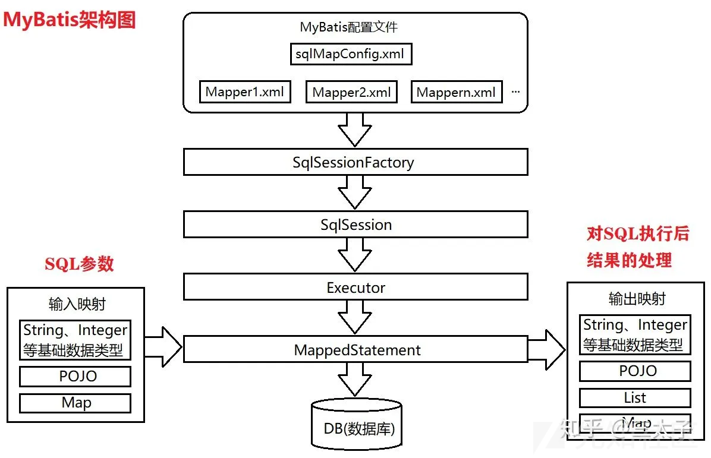
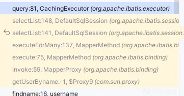
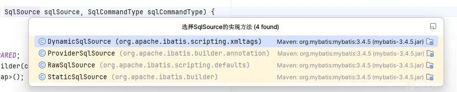
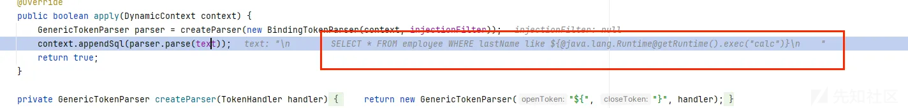
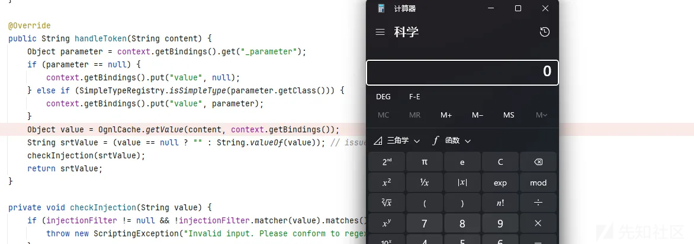
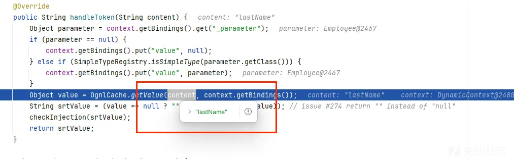
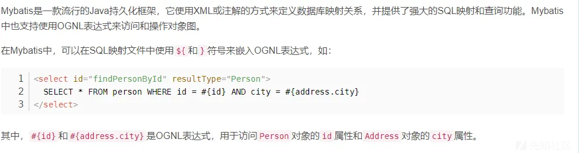
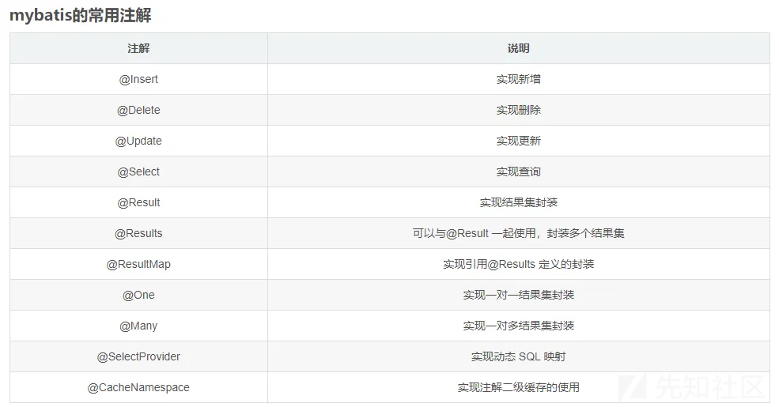
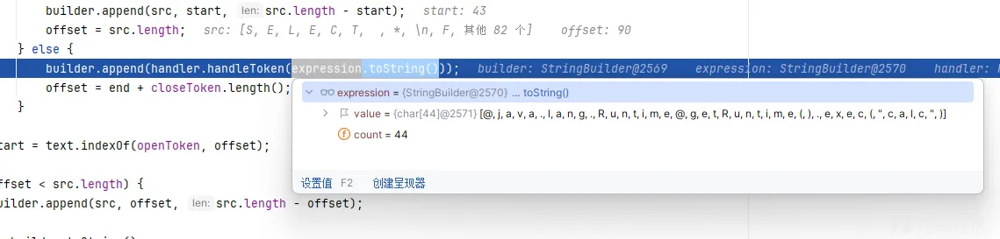

# mybatis下的ognl注入分析-先知社区

> **来源**: https://xz.aliyun.com/news/17054  
> **文章ID**: 17054

---

# mybatis下的ognl注入

### 前言

最近在审计cms的时后发现mysql连接使用的是mybatis，而且可以ognl注入，当初在复现2022-D^3CTF的web题的ezsql时，有相同的利用，是很有意思的mybatis下的ognl表达式注入，相比于单纯 sql注入，就更容易getshell了

### mybatis简单介绍

在我的文章java之sql注入代码审计，大概介绍过

#### 什么是mybatis

MyBatis 是一款优秀的持久层框架，可以理解为 MyBatis 就是对 JDBC 访问数据库的过程进行了封装，简化了 JDBC 代码，解决 JDBC 将结果集封装为 Java 对象的麻烦，使开发者只需要关注 SQL 本身，而不需要花费精力去处理例如注册驱动、创建 connection、创建 statement、手动设置参数、结果集检索等 JDBC 繁杂的过程代码。

具体使用时，MyBatis 通过 xml 或注解的方式将要执行的各种 statement（statement、preparedStatemnt）配置起来，并通过 Java 对象和 statement 中的 SQL 进行映射生成最终执行的 SQL 语句，最后由 MyBatis 框架执行 SQL 并将结果映射成 Java 对象并返回。

#### 架构图



1. **mybatis-config.xml** 是Mybatis的核心配置文件，通过其中的配置可以生成SqlSessionFactory,也就是SqlSession工厂；
2. **SqlSessionFactory** 可以生成 SqlSession 对象
3. **SqlSession** 是一个既可以发送 SQL 去执行，并返回结果，类似于 JDBC 中的 Connection 对象，也是 MyBatis 中至关重要的一个对象；
4. **Executor** 是 SqlSession 底层的对象，用于执行 SQL 语句；
5. **MapperStatement** 对象也是 SqlSession 底层的对象，用于接收输入映射（SQL 语句中的参数），以及做输出映射（即将 SQL 查询的结果映射成相应的结果）。

每一个Mapper都是为了一个具体的业务

### sql语句中ognl的解析过程

这里主要是重点介绍分析过程

name.xml内容如下

```
<?xml version="1.0" encoding="UTF-8" ?>
<!DOCTYPE mapper
        PUBLIC "-//mybatis.org//DTD Mapper 3.0//EN"
        "http://mybatis.org/dtd/mybatis-3-mapper.dtd">

<mapper namespace="com.dianchou.dao.Username">
    <select id="getUserByname"  parameterType="String" resultType="com.dianchou.bean.Employee" >
        SELECT * FROM employee WHERE lastName like ${@java.lang.Runtime@getRuntime().exec("calc")}
    </select>
</mapper>
```

实战中是不可能这样写的

配置一下实体类

```
package com.dianchou.dao;

import com.dianchou.bean.Employee;

import java.util.List;

public interface Username {
//    Employee getUserByname(String params);
//    Employee getUserByname(Employee lastName);
    List<Employee> getUserByname(Employee lastName);
}
```

跟着调用栈

主要的执行逻辑都在`MapperMethod`的`execute()`方法，判断sql语句注入类型后来到sqlSession.selectList()

是我们的核心逻辑部分



来到query方法

```
public <E> List<E> query(MappedStatement ms, Object parameterObject, RowBounds rowBounds, ResultHandler resultHandler) throws SQLException {
  BoundSql boundSql = ms.getBoundSql(parameterObject);
  CacheKey key = createCacheKey(ms, parameterObject, rowBounds, boundSql);
  return query(ms, parameterObject, rowBounds, resultHandler, key, boundSql);
}
```

其中getBoundSql是根据传入参数构建sql语句的过程

跟进getBoundSql，构建过程如下  
`BoundSql boundSql = sqlSource.getBoundSql(parameterObject);`

其中sqlSource，可以看见有如下类型



<https://forum.butian.net/share/1749师傅总结如下>

* StaticSqlSource静态SQL，DynamicSqlSource、RawSqlSource处理过后都会转成StaticSqlSource
* DynamicSqlSource处理包含${}、动态SQL节点的
* RawSqlSource处理不包含${}、动态SQL节点的
* ProviderSqlSource动态SQL，看名称应该是跟类似@SelectProvider注解有关

这里是DynamicSqlSource

```
public BoundSql getBoundSql(Object parameterObject) {
  DynamicContext context = new DynamicContext(configuration, parameterObject);
  rootSqlNode.apply(context);
```

可以发现我们的输入被传入到了apply方法

```
public boolean apply(DynamicContext context) {
  for (SqlNode sqlNode : contents) {
    sqlNode.apply(context);
  }
  return true;
}
```

就是根据sqlNode去解析我们的语句，sqlnode就和html的tag类似

我们的是Test类型，来到TextSqlNode的apply方法



paras方法如下

```
public String parse(String text) {
  if (text == null || text.isEmpty()) {
    return "";
  }
  // search open token
  int start = text.indexOf(openToken, 0);
  if (start == -1) {
    return text;
  }
  char[] src = text.toCharArray();
  int offset = 0;
  final StringBuilder builder = new StringBuilder();
  StringBuilder expression = null;
  while (start > -1) {
    if (start > 0 && src[start - 1] == '\') {
      // this open token is escaped. remove the backslash and continue.
      builder.append(src, offset, start - offset - 1).append(openToken);
      offset = start + openToken.length();
    } else {
      // found open token. let's search close token.
      if (expression == null) {
        expression = new StringBuilder();
      } else {
        expression.setLength(0);
      }
      builder.append(src, offset, start - offset);
      offset = start + openToken.length();
      int end = text.indexOf(closeToken, offset);
      while (end > -1) {
        if (end > offset && src[end - 1] == '\') {
          // this close token is escaped. remove the backslash and continue.
          expression.append(src, offset, end - offset - 1).append(closeToken);
          offset = end + closeToken.length();
          end = text.indexOf(closeToken, offset);
        } else {
          expression.append(src, offset, end - offset);
          offset = end + closeToken.length();
          break;
        }
      }
      if (end == -1) {
        // close token was not found.
        builder.append(src, start, src.length - start);
        offset = src.length;
      } else {
        builder.append(handler.handleToken(expression.toString()));
        offset = end + closeToken.length();
      }
    }
    start = text.indexOf(openToken, offset);
  }
  if (offset < src.length) {
    builder.append(src, offset, src.length - offset);
  }
  return builder.toString();
}
```

其中会把我们的表达式也就是${}把内容截取出来，放入

```
builder.append(handler.handleToken(expression.toString()));
```

handleToken方法如下，这里把内容就当作ognl表达式执行了

```
public String handleToken(String content) {
  Object parameter = context.getBindings().get("_parameter");
  if (parameter == null) {
    context.getBindings().put("value", null);
  } else if (SimpleTypeRegistry.isSimpleType(parameter.getClass())) {
    context.getBindings().put("value", parameter);
  }
  Object value = OgnlCache.getValue(content, context.getBindings());
  String srtValue = (value == null ? "" : String.valueOf(value)); // issue #274 return "" instead of "null"
  checkInjection(srtValue);
  return srtValue;
}
```

然后弹出了计算器



### 传入paylaod恶意执行？

我们该为正常的情况

```
<?xml version="1.0" encoding="UTF-8" ?>
<!DOCTYPE mapper
        PUBLIC "-//mybatis.org//DTD Mapper 3.0//EN"
        "http://mybatis.org/dtd/mybatis-3-mapper.dtd">

<mapper namespace="com.dianchou.dao.Username">
    <select id="getUserByname"  parameterType="String" resultType="com.dianchou.bean.Employee" >
        SELECT * FROM employee WHERE lastName like ${lastName}
    </select>
</mapper>
```

是不是我们只需要在lastName传入恶意表达式就好了?

```
public void findname() {
    SqlSession sqlSession = MybatisUntils.getSqlSession();
    Username username = sqlSession.getMapper(Username.class);
    Employee params=new Employee();
    params.setLastName("${@java.lang.Runtime@getRuntime().exec("calc")}");
    List<Employee> employees = username.getUserByname(params);
    for (Employee user : employees) {
        System.out.println(user);
    }
```

传入参数如下${@java.lang.Runtime@getRuntime().exec(calc)}



可惜开发者还是防御了一手，是先把内容带进去解析后再把参数添加进去，导致不能利用了

作者的本意是再xml中方便解析



我们一般是不可能控制xml内容的，难道没有办法了吗?

### 注解利用

现在java和springboot可以说是息息相关，而mybatis也为springboot提供了对应的注解来满足动态SQL的功能

参考<https://blog.csdn.net/weixin_43883917/article/details/113830667师傅说法>



但是实际上他们的问题和上面分析的一样的，是先解析再放入

但是还有一个Provider注解

如果使用Provider注解就会先把参数传入，再去解析

```
package com.dianchou.dao;

import org.apache.ibatis.jdbc.SQL;

public class EmployeeSqlProvider {
    public String getUserByLastName(final String lastName) {
        return new SQL() {{
            SELECT("*");
            FROM("employee");
            WHERE("lastName = ' " + lastName + "'");
        }}.toString();
    }
}  
```



就能够解析了

造成了ognl表达式注入
