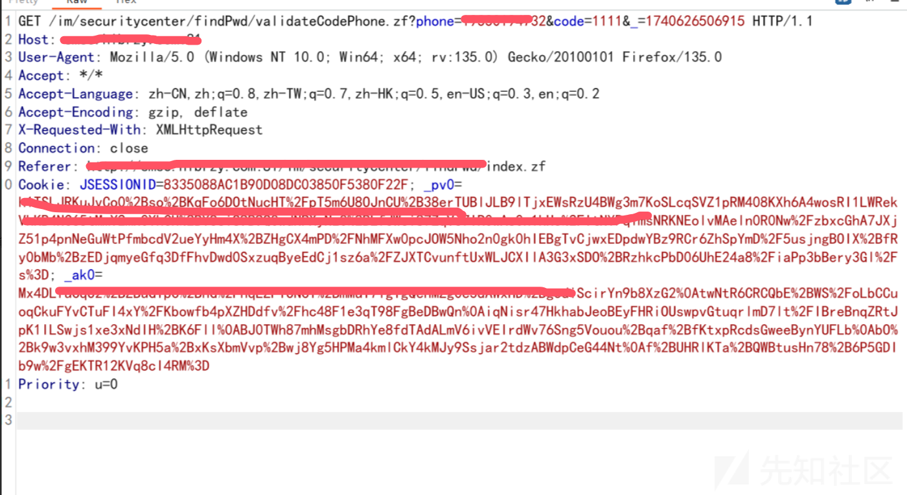
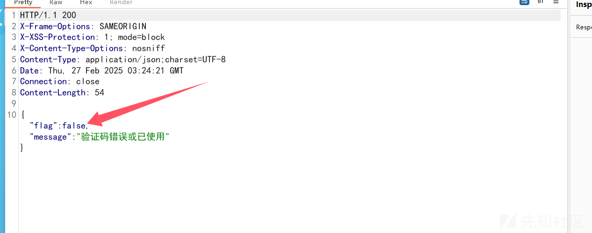
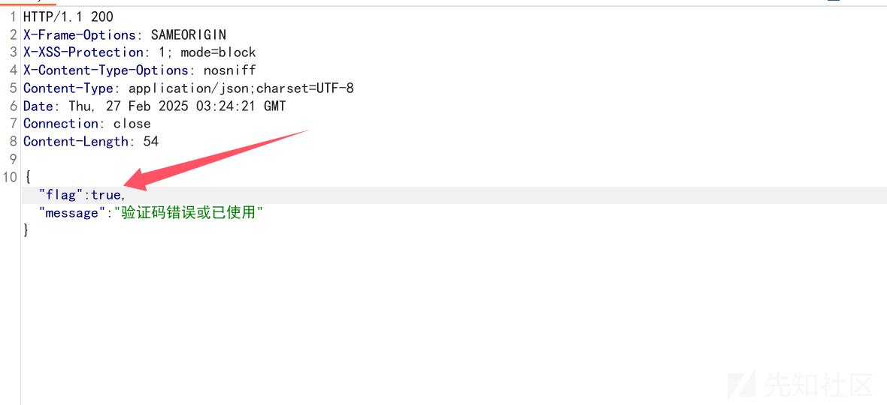
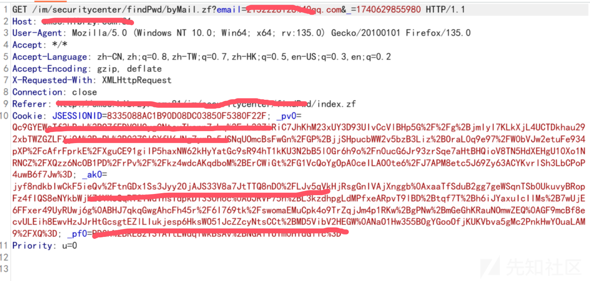
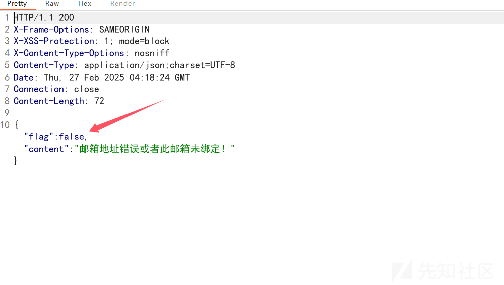
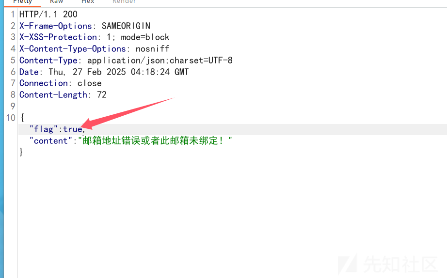

# 逻辑漏洞挖掘案例-先知社区

> **来源**: https://xz.aliyun.com/news/17066  
> **文章ID**: 17066

---

开局一个登录框，发现有忘记密码功能

忘记密码功能可能存在的漏洞：

```
用户名遍历
（绕过分布校验）任意用户密码重置
（重置密码链接可猜解）任意用户密码重置
（未校验手机号码与用户的一致性）任意用户密码重置
（修改用户id/用户名）任意用户密码重置
```

# 案例一


这里有3种找回密码方式，先看手机号码，随便输入一个电话号码（信息收集）和验证码，进行抓包


看响应和请求，发现可能存在逻辑漏洞



把false改为true,看看能不能绕过去

到这里就发现并不需要验证码就可以绕过重置密码


# 案例二

这里还有一个邮箱找回密码，和上面一样的，改响应包即可，输入一个邮箱（可以是自己的，因为可以邮箱登录）









# 案例三


这里也有一个找回密码的功能，看看它的逻辑是怎样的

这里需要输入一个存在的账号，所以我们可以对账号进行一个爆破（随便试几个常用的，比如：admin,test,000000这些）

这里经过测试发现存在账号：000000

成功来到验证界面，这里也是和上面案例一样，随便输入验证码，看看响应返回了什么


这就有可能是前端校验，把false改为true以后，放包，看看能不能绕过去


发现是可以绕过去的
